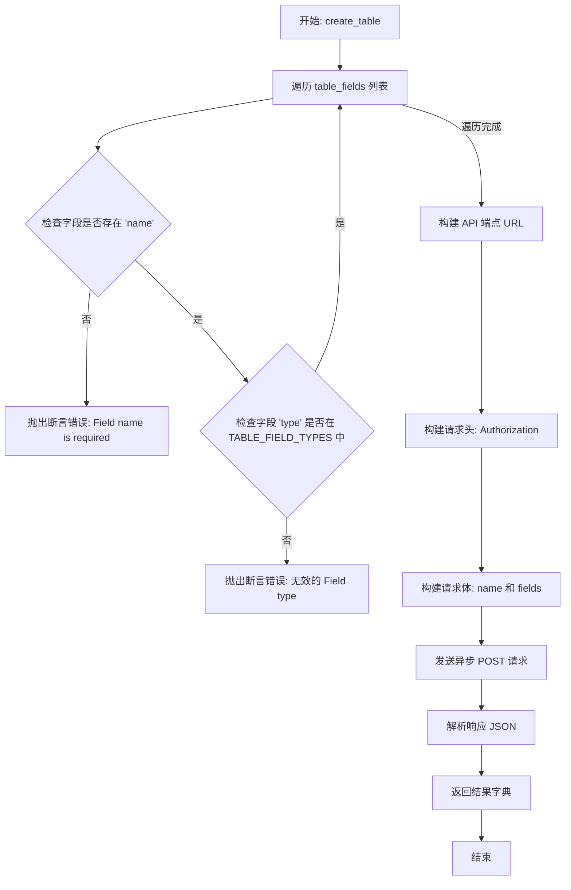
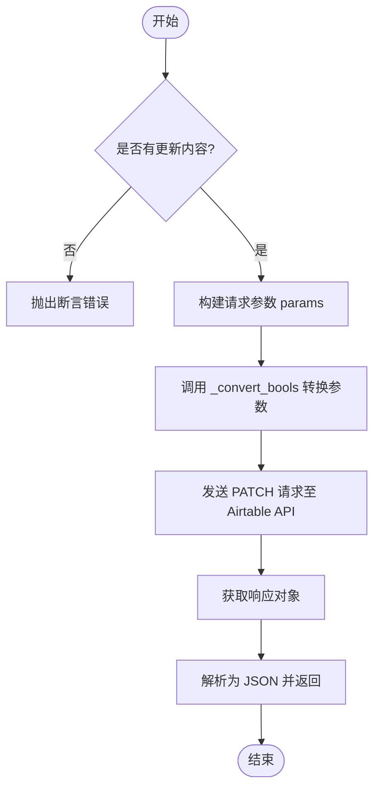
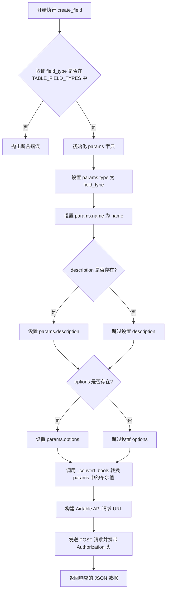
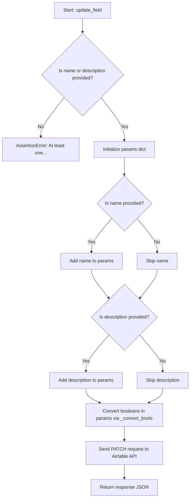
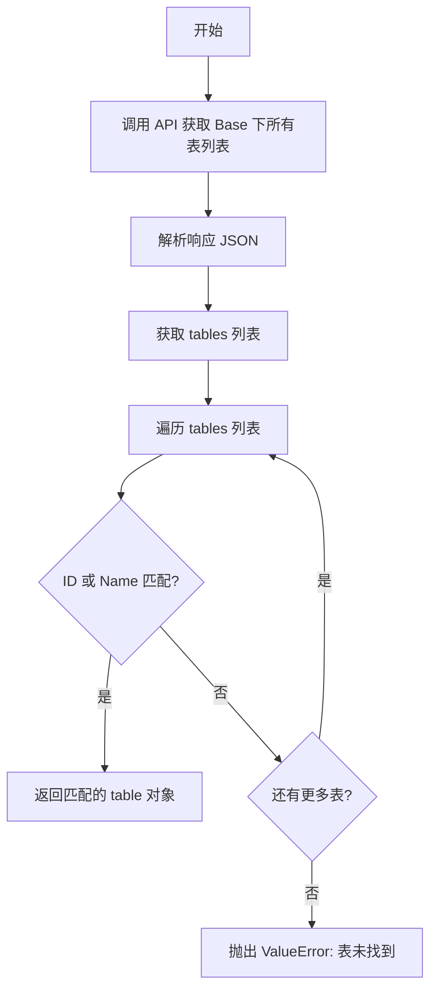
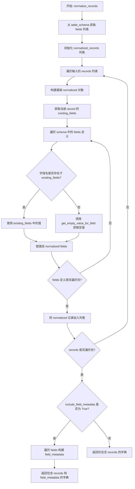
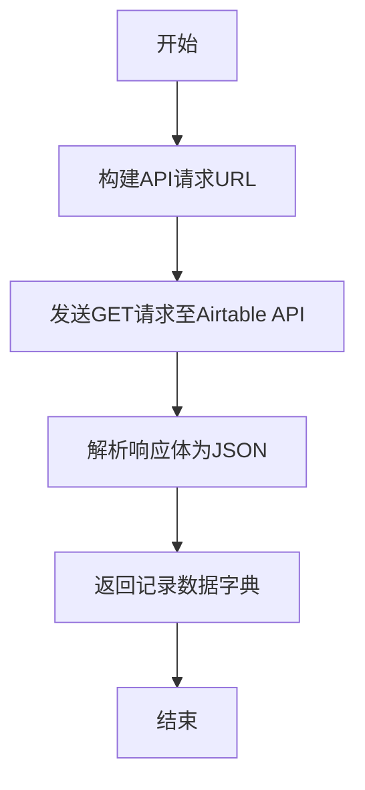
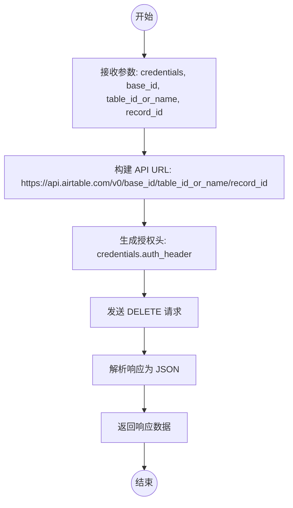
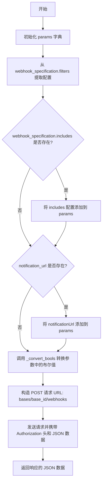
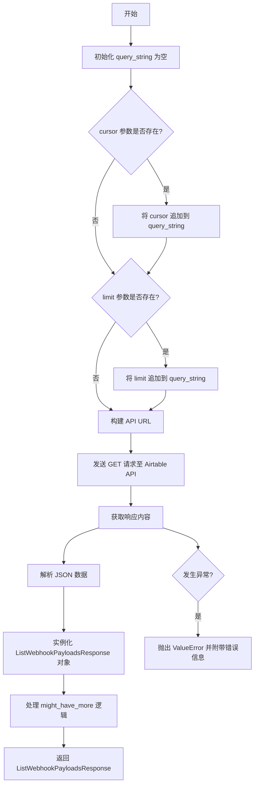

# `AutoGPT\autogpt_platform\backend\backend\blocks\airtable\_api.py` 详细设计文档

该代码文件是一个异步的 Airtable API 客户端封装库，提供了对 Airtable 的元数据（Schema）、记录、Webhook、OAuth2 认证以及 Base 管理等功能的完整操作接口，并包含了数据模型定义、数据转换工具函数和字段类型的枚举定义。

## 整体流程

```mermaid
graph TD
    A[外部调用 API 函数] --> B{操作类型?}
    B -- Schema管理 --> C[create_table / update_table / create_field...]
    B -- 记录管理 --> D[list_records / create_record / update_record...]
    B -- Webhook管理 --> E[create_webhook / list_webhook_payloads...]
    B -- OAuth认证 --> F[oauth_exchange_code_for_tokens / make_oauth_authorize_url...]
    B -- Base管理 --> G[create_base / list_bases...]
    C --> H[参数校验与断言]
    D --> H
    E --> H
    F --> H
    G --> H
    H --> I[数据转换与预处理 _convert_bools]
    I --> J[调用 Requests().get/post/patch/delete]
    J --> K{响应处理}
    K -- 成功 --> L[返回 JSON 或 Model 对象]
    K -- 失败 --> M[抛出异常或记录错误]
```

## 类结构

```
BaseModel (外部引入)
├── WebhookFilters
├── WebhookIncludes
├── WebhookSpecification
├── WebhookPayload
├── ListWebhookPayloadsResponse
├── OAuthAuthorizeRequest
├── OAuthTokenRequest
├── OAuthRefreshTokenRequest
└── OAuthTokenResponse
Enum (标准库)
├── TableFieldType
└── AirtableTimeZones
```

## 全局变量及字段


### `logger`
    
用于记录日志信息的全局日志记录器实例

类型：`logging.Logger`
    


### `TABLE_FIELD_TYPES`
    
包含所有有效 Airtable 表字段类型字符串值的集合，用于验证字段类型的合法性

类型：`set[str]`
    


### `WebhookFilters.dataTypes`
    
指定 Webhook 触发所需的数据类型列表

类型：`list[str]`
    


### `WebhookFilters.changeTypes`
    
指定 Webhook 触发所需的变化类型列表（可选）

类型：`list[str] | None`
    


### `WebhookFilters.fromSources`
    
指定 Webhook 触发所需的变更来源列表（可选）

类型：`list[str] | None`
    


### `WebhookFilters.sourceOptions`
    
用于配置 Webhook 触发来源的选项字典（可选）

类型：`dict | None`
    


### `WebhookFilters.watchDataInFieldIds`
    
指定需要监听数据变更的字段 ID 列表（可选）

类型：`list[str] | None`
    


### `WebhookFilters.watchSchemasOfFieldIds`
    
指定需要监听模式变更的字段 ID 列表（可选）

类型：`list[str] | None`
    


### `WebhookIncludes.includeCellValuesInFieldIds`
    
指定在 Webhook 负载中需要包含单元格值的字段 ID 或列表（可选）

类型：`list[str] | str | None`
    


### `WebhookIncludes.includePreviousCellValues`
    
指示是否在 Webhook 负载中包含变更前的单元格值（可选）

类型：`bool | None`
    


### `WebhookIncludes.includePreviousFieldDefinitions`
    
指示是否在 Webhook 负载中包含变更前的字段定义（可选）

类型：`bool | None`
    


### `WebhookSpecification.recordChangeScope`
    
定义 Webhook 监听记录变更的范围（可选）

类型：`str | None`
    


### `WebhookSpecification.filters`
    
定义 Webhook 监听的过滤条件

类型：`WebhookFilters`
    


### `WebhookSpecification.includes`
    
定义 Webhook 负载中需要包含的额外信息（可选）

类型：`WebhookIncludes | None`
    


### `WebhookPayload.actionMetadata`
    
包含触发 Webhook 的操作相关的元数据信息

类型：`dict`
    


### `WebhookPayload.baseTransactionNumber`
    
表示当前变更的基础事务编号，用于标识事务顺序

类型：`int`
    


### `WebhookPayload.payloadFormat`
    
指定 Webhook 负载的格式版本（例如 'v0'）

类型：`str`
    


### `WebhookPayload.timestamp`
    
Webhook 触发时的 ISO 8601 格式时间戳

类型：`str`
    


### `WebhookPayload.changedTablesById`
    
包含发生变更的表的字典，键为表 ID，值为表变更详情（可选）

类型：`dict | None`
    


### `WebhookPayload.createdTablesById`
    
包含新创建的表的字典，键为表 ID，值为表详情（可选）

类型：`dict | None`
    


### `WebhookPayload.destroyedTableIds`
    
包含被删除的表 ID 列表（可选）

类型：`list[str] | None`
    


### `WebhookPayload.error`
    
指示 Webhook 负载中是否包含错误信息（可选）

类型：`bool | None`
    


### `WebhookPayload.code`
    
与负载相关的错误代码（可选）

类型：`str | None`
    


### `ListWebhookPayloadsResponse.payloads`
    
Webhook 负载对象的列表

类型：`list[WebhookPayload]`
    


### `ListWebhookPayloadsResponse.cursor`
    
用于分页查询的游标标记，表示下一页的起始位置（可选）

类型：`int | None`
    


### `ListWebhookPayloadsResponse.might_have_more`
    
指示是否还有更多的 Webhook 负载可供查询（可选）

类型：`bool | None`
    


### `ListWebhookPayloadsResponse.payloadFormat`
    
返回的 Webhook 负载的格式版本

类型：`str`
    


### `TableFieldType.SINGLE_LINE_TEXT`
    
单行文本类型字段，用于存储短文本

类型：`str`
    


### `TableFieldType.EMAIL`
    
电子邮件类型字段，用于存储和验证邮箱地址

类型：`str`
    


### `TableFieldType.URL`
    
URL 类型字段，用于存储网站链接

类型：`str`
    


### `TableFieldType.MULTILINE_TEXT`
    
多行文本类型字段，用于存储长文本或段落

类型：`str`
    


### `TableFieldType.NUMBER`
    
数字类型字段，用于存储数值

类型：`str`
    


### `TableFieldType.PERCENT`
    
百分比类型字段，用于存储百分比数值

类型：`str`
    


### `TableFieldType.CURRENCY`
    
货币类型字段，用于存储金额，支持货币符号

类型：`str`
    


### `TableFieldType.SINGLE_SELECT`
    
单项选择类型字段，用于从预定义选项中选择一个

类型：`str`
    


### `TableFieldType.MULTIPLE_SELECTS`
    
多项选择类型字段，用于从预定义选项中选择多个

类型：`str`
    


### `TableFieldType.SINGLE_COLLABORATOR`
    
单个协作者类型字段，用于关联单个用户

类型：`str`
    


### `TableFieldType.MULTIPLE_COLLABORATORS`
    
多个协作者类型字段，用于关联多个用户

类型：`str`
    


### `TableFieldType.MULTIPLE_RECORD_LINKS`
    
多条记录链接类型字段，用于建立与同一表中其他记录的关系

类型：`str`
    


### `TableFieldType.DATE`
    
日期类型字段，用于存储日期（不含时间）

类型：`str`
    


### `TableFieldType.DATE_TIME`
    
日期时间类型字段，用于存储具体的日期和时间点

类型：`str`
    


### `TableFieldType.PHONE_NUMBER`
    
电话号码类型字段，用于存储和格式化电话号码

类型：`str`
    


### `TableFieldType.MULTIPLE_ATTACHMENTS`
    
多个附件类型字段，用于上传和管理多个文件

类型：`str`
    


### `TableFieldType.CHECKBOX`
    
复选框类型字段，用于表示布尔值（真/假）

类型：`str`
    


### `TableFieldType.FORMULA`
    
公式类型字段，用于根据其他字段动态计算值

类型：`str`
    


### `TableFieldType.CREATED_TIME`
    
创建时间类型字段，自动记录记录的创建时间戳

类型：`str`
    


### `TableFieldType.ROLLUP`
    
汇总类型字段，用于从关联记录中聚合数据（如求和、计数）

类型：`str`
    


### `TableFieldType.COUNT`
    
计数类型字段，用于统计关联记录的数量

类型：`str`
    


### `TableFieldType.LOOKUP`
    
查找类型字段，用于从关联记录中检索特定字段的值

类型：`str`
    


### `TableFieldType.MULTIPLE_LOOKUP_VALUES`
    
多个查找值类型字段，用于从关联记录中检索多个值

类型：`str`
    


### `TableFieldType.AUTO_NUMBER`
    
自动编号类型字段，用于自动生成唯一的递增数字 ID

类型：`str`
    


### `TableFieldType.BARCODE`
    
条形码类型字段，用于存储和显示条形码数据

类型：`str`
    


### `TableFieldType.RATING`
    
评分类型字段，用于进行星级或其他形式的评分

类型：`str`
    


### `TableFieldType.RICH_TEXT`
    
富文本类型字段，支持文本格式化（如加粗、斜体、列表）

类型：`str`
    


### `TableFieldType.DURATION`
    
持续时间类型字段，用于存储时间长度（如小时、分钟）

类型：`str`
    


### `TableFieldType.LAST_MODIFIED_TIME`
    
最后修改时间类型字段，自动记录记录最后被修改的时间戳

类型：`str`
    


### `TableFieldType.BUTTON`
    
按钮类型字段，提供一个可点击的按钮来触发脚本或 URL

类型：`str`
    


### `TableFieldType.CREATED_BY`
    
创建者类型字段，自动记录创建记录的用户信息

类型：`str`
    


### `TableFieldType.LAST_MODIFIED_BY`
    
最后修改者类型字段，自动记录最后修改记录的用户信息

类型：`str`
    


### `TableFieldType.EXTERNAL_SYNC_SOURCE`
    
外部同步源类型字段，用于标识数据来自外部同步源

类型：`str`
    


### `TableFieldType.AI_TEXT`
    
AI 文本类型字段，可能用于集成 AI 生成或处理的文本内容

类型：`str`
    


### `AirtableTimeZones.UTC`
    
协调世界时时区

类型：`str`
    


### `AirtableTimeZones.CLIENT`
    
客户端本地时区

类型：`str`
    


### `AirtableTimeZones.AFRICA_ABIDJAN`
    
非洲/阿比让时区

类型：`str`
    


### `AirtableTimeZones.AFRICA_ACCRA`
    
非洲/阿克拉时区

类型：`str`
    


### `AirtableTimeZones.AFRICA_ADDIS_ABABA`
    
非洲/亚的斯亚贝巴时区

类型：`str`
    


### `AirtableTimeZones.AMERICA_ANCHORAGE`
    
美洲/安克雷奇时区

类型：`str`
    


### `AirtableTimeZones.AMERICA_ARGENTINA_BUENOS_AIRES`
    
美洲/阿根廷/布宜诺斯艾利斯时区

类型：`str`
    


### `AirtableTimeZones.AMERICA_CHICAGO`
    
美洲/芝加哥时区

类型：`str`
    


### `AirtableTimeZones.AMERICA_LOS_ANGELES`
    
美洲/洛杉矶时区

类型：`str`
    


### `AirtableTimeZones.AMERICA_NEW_YORK`
    
美洲/纽约时区

类型：`str`
    


### `AirtableTimeZones.ASIA_SHANGHAI`
    
亚洲/上海时区

类型：`str`
    


### `AirtableTimeZones.ASIA_TOKYO`
    
亚洲/东京时区

类型：`str`
    


### `AirtableTimeZones.EUPE_LONDON`
    
欧洲/伦敦时区

类型：`str`
    


### `AirtableTimeZones.EUPE_PARIS`
    
欧洲/巴黎时区

类型：`str`
    


### `AirtableTimeZones.PACIFIC_AUCKLAND`
    
太平洋/奥克兰时区

类型：`str`
    


### `AirtableTimeZones.... (以及其他大量枚举值)`
    
Airtable 支持的其他 IANA 时区标识符

类型：`str`
    


### `OAuthAuthorizeRequest.client_id`
    
用于标识集成的唯一客户端 ID

类型：`str`
    


### `OAuthAuthorizeRequest.redirect_uri`
    
授权完成后重定向回的 URI 地址

类型：`str`
    


### `OAuthAuthorizeRequest.response_type`
    
授权响应类型，固定为 'code'

类型：`str`
    


### `OAuthAuthorizeRequest.scope`
    
以空格分隔的权限范围列表，定义请求的访问权限

类型：`str`
    


### `OAuthAuthorizeRequest.state`
    
用于防止 CSRF 攻击的随机字符串

类型：`str`
    


### `OAuthAuthorizeRequest.code_challenge`
    
基于 PKCE 扩展生成的代码挑战值

类型：`str`
    


### `OAuthAuthorizeRequest.code_challenge_method`
    
代码挑战的方法，固定为 'S256'

类型：`str`
    


### `OAuthTokenRequest.code`
    
授权流程中获得的授权码

类型：`str`
    


### `OAuthTokenRequest.client_id`
    
获取授权码时使用的客户端 ID

类型：`str`
    


### `OAuthTokenRequest.redirect_uri`
    
获取授权码时使用的重定向 URI

类型：`str`
    


### `OAuthTokenRequest.grant_type`
    
授权类型，固定为 'authorization_code'

类型：`str`
    


### `OAuthTokenRequest.code_verifier`
    
用于生成 code_challenge 的原始验证码

类型：`str`
    


### `OAuthRefreshTokenRequest.refresh_token`
    
用于刷新访问令牌的刷新令牌

类型：`str`
    


### `OAuthRefreshTokenRequest.client_id`
    
客户端 ID，当没有 client_secret 时需要提供（可选）

类型：`str | None`
    


### `OAuthRefreshTokenRequest.grant_type`
    
授权类型，固定为 'refresh_token'

类型：`str`
    


### `OAuthRefreshTokenRequest.scope`
    
刷新令牌时的可选权限范围子集（可选）

类型：`str | None`
    


### `OAuthTokenResponse.access_token`
    
用于访问 Airtable API 的有效访问令牌

类型：`str`
    


### `OAuthTokenResponse.refresh_token`
    
用于在访问令牌过期后获取新令牌的刷新令牌

类型：`str`
    


### `OAuthTokenResponse.token_type`
    
令牌类型，通常为 'Bearer'

类型：`str`
    


### `OAuthTokenResponse.scope`
    
授予访问令牌的权限范围列表

类型：`str`
    


### `OAuthTokenResponse.expires_in`
    
访问令牌过期前的秒数

类型：`int`
    


### `OAuthTokenResponse.refresh_expires_in`
    
刷新令牌过期前的秒数

类型：`int`
    
    

## 全局函数及方法


### `_convert_bools`

该函数是一个递归工具，用于遍历输入对象（字符串、列表或字典），并将表示布尔值的字符串（"true"/"false"）强制转换为 Python 原生的布尔类型（`True`/`False`）。

参数：

-   `obj`：`Any`，需要被遍历和转换的输入对象，可以是字符串、列表、字典或其他任意类型。

返回值：`Any`，转换后的对象，其结构与输入对象一致，但其中的字符串 "true" 和 "false" 会被替换为对应的布尔值。

#### 流程图

```mermaid
flowchart TD
    Start([开始]) --> CheckString{obj 是 str?}
    
    CheckString -- 是 --> ToLower[lowered = obj.lower()]
    ToLower --> CheckTrue{lowered == "true"?}
    CheckTrue -- 是 --> ReturnTrue([返回 True])
    CheckTrue -- 否 --> CheckFalse{lowered == "false"?}
    CheckFalse -- 是 --> ReturnFalse([返回 False])
    CheckFalse -- 否 --> ReturnString([返回 obj])
    
    CheckString -- 否 --> CheckList{obj 是 list?}
    CheckList -- 是 --> RecurseList[对每个 item 递归调用 _convert_bools]
    RecurseList --> ReturnList([返回新列表])
    
    CheckList -- 否 --> CheckDict{obj 是 dict?}
    CheckDict -- 是 --> RecurseDict[对每个 value 递归调用 _convert_bools]
    RecurseDict --> ReturnDict([返回新字典])
    
    CheckDict -- 否 --> ReturnObj([返回 obj])
```

#### 带注释源码

```python
def _convert_bools(
    obj: Any,
) -> Any:  # noqa: ANN401 – allow Any for deep conversion utility
    """Recursively walk *obj* and coerce string booleans to real booleans."""
    # 检查当前对象是否为字符串
    if isinstance(obj, str):
        # 将字符串转换为小写以便不区分大小写比较
        lowered = obj.lower()
        # 如果字符串内容为 "true"，返回布尔值 True
        if lowered == "true":
            return True
        # 如果字符串内容为 "false"，返回布尔值 False
        if lowered == "false":
            return False
        # 如果是其他字符串，原样返回
        return obj
    
    # 检查当前对象是否为列表
    if isinstance(obj, list):
        # 使用列表推导式，对列表中的每个元素递归调用此函数
        return [_convert_bools(item) for item in obj]
    
    # 检查当前对象是否为字典
    if isinstance(obj, dict):
        # 使用字典推导式，保留键，对字典中的每个值递归调用此函数
        return {k: _convert_bools(v) for k, v in obj.items()}
    
    # 对于其他类型（如整数、布尔值本身、None等），原样返回
    return obj
```


### `create_table`

该函数通过Airtable API在指定的Base中创建一个新表，它首先遍历并验证输入的字段列表以确保每个字段包含名称且类型合法，随后构造并发送一个包含表名和字段定义的POST请求到Airtable元数据接口，最后返回包含创建结果的JSON响应。

参数：

- `credentials`：`Credentials`，包含访问令牌的认证对象，用于API请求鉴权。
- `base_id`：`str`，目标Base的唯一标识符。
- `table_name`：`str`，待创建表的名称。
- `table_fields`：`list[dict]`，定义表结构的字段列表，每个字典需包含字段名和类型。

返回值：`dict`，Airtable API响应的JSON对象，包含新创建表的元数据（如表ID、名称、字段等）。

#### 流程图



#### 带注释源码

```python
async def create_table(
    credentials: Credentials,
    base_id: str,
    table_name: str,
    table_fields: list[dict],
) -> dict:
    # 遍历所有待创建的字段，进行本地验证
    for field in table_fields:
        # 确保每个字段都有名称
        assert field.get("name"), "Field name is required"
        # 确保每个字段的类型在 Airtable 允许的类型列表中
        assert (
            field.get("type") in TABLE_FIELD_TYPES
        ), f"Field type {field.get('type')} is not valid. Valid types are {TABLE_FIELD_TYPES}."
        # 注意：不同类型的字段有不同的配置选项，此处暂不进行详细验证

    # 构造并发送 POST 请求以创建表
    response = await Requests().post(
        f"https://api.airtable.com/v0/meta/bases/{base_id}/tables", # API 端点
        headers={"Authorization": credentials.auth_header()},        # 认证头
        json={                                                       # 请求体
            "name": table_name,
            "fields": table_fields,
        },
    )

    # 返回 API 响应的 JSON 数据
    return response.json()
```


### `update_table`

该函数用于异步更新 Airtable 中指定表的元数据，允许修改表的名称、描述或日期依赖配置。

参数：

-  `credentials`：`Credentials`，Airtable API 的认证凭据对象，用于生成请求头中的授权信息。
-  `base_id`：`str`，目标 Base 的唯一标识符。
-  `table_id`：`str`，目标表的唯一标识符。
-  `table_name`：`str | None`，表的新名称（可选）。
-  `table_description`：`str | None`，表的新描述（可选）。
-  `date_dependency`：`dict | None`，表的日期依赖配置（可选）。

返回值：`dict`，包含 API 返回的更新后表信息的字典。

#### 流程图



#### 带注释源码

```python
async def update_table(
    credentials: Credentials,
    base_id: str,
    table_id: str,
    table_name: str | None = None,
    table_description: str | None = None,
    date_dependency: dict | None = None,
) -> dict:
    # 断言至少需要提供一个更新字段，否则抛出异常
    assert (
        table_name or table_description or date_dependency
    ), "At least one of table_name, table_description, or date_dependency must be provided"

    # 初始化参数字典，仅包含非空的更新字段
    params: dict[str, str | dict[str, str]] = {}
    if table_name:
        params["name"] = table_name
    if table_description:
        params["description"] = table_description
    if date_dependency:
        params["dateDependency"] = date_dependency

    # 发送 PATCH 请求到 Airtable 元数据 API
    # json=_convert_bools(params) 确保字典中的字符串布尔值（如 "true"）被转换为 Python 布尔值
    response = await Requests().patch(
        f"https://api.airtable.com/v0/meta/bases/{base_id}/tables/{table_id}",
        headers={"Authorization": credentials.auth_header()},
        json=_convert_bools(params),
    )

    # 返回 API 响应的 JSON 数据
    return response.json()
```


### `create_field`

该函数用于在指定的 Airtable Base 和 Table 中创建一个新的字段。它接受认证凭据、基础 ID、表格 ID、字段类型、名称以及可选的描述和配置选项，验证字段类型后，向 Airtable API 发送 POST 请求以创建字段并返回响应。

参数：

-  `credentials`：`Credentials`，Airtable API 的认证凭据对象，用于生成请求头。
-  `base_id`：`str`，目标 Base 的 ID。
-  `table_id`：`str`，目标 Table 的 ID。
-  `field_type`：`TableFieldType`，要创建的字段类型（枚举值）。
-  `name`：`str`，新字段的名称。
-  `description`：`str | None`，字段的描述信息，可选。
-  `options`：`dict[str, str] | None`，特定于字段类型的配置选项，可选。

返回值：`dict[str, str | dict[str, str]]`，Airtable API 返回的 JSON 对象，包含新创建字段的详细信息。

#### 流程图



#### 带注释源码

```python
async def create_field(
    credentials: Credentials,
    base_id: str,
    table_id: str,
    field_type: TableFieldType,
    name: str,
    description: str | None = None,
    options: dict[str, str] | None = None,
) -> dict[str, str | dict[str, str]]:

    # 检查提供的字段类型是否在允许的类型集合中
    assert (
        field_type in TABLE_FIELD_TYPES
    ), f"Field type {field_type} is not valid. Valid types are {TABLE_FIELD_TYPES}."
    
    # 初始化请求参数字典
    params: dict[str, str | dict[str, str]] = {}
    
    # 设置必填字段：类型和名称
    params["type"] = field_type
    params["name"] = name
    
    # 如果提供了描述，添加到参数中
    if description:
        params["description"] = description
        
    # 如果提供了选项，添加到参数中
    if options:
        params["options"] = options

    # 发送 POST 请求到 Airtable Meta API 创建字段
    response = await Requests().post(
        f"https://api.airtable.com/v0/meta/bases/{base_id}/tables/{table_id}/fields",
        headers={"Authorization": credentials.auth_header()}, # 使用凭据生成认证头
        json=_convert_bools(params), # 转换参数中的布尔字符串为真正的布尔值
    )
    
    # 返回 API 响应的 JSON 数据
    return response.json()
```


### `update_field`

更新 Airtable 表中现有字段的元数据，包括名称或描述。

参数：

- `credentials`：`Credentials`，用于 API 身份验证的凭证对象
- `base_id`：`str`，包含目标表的基础 ID
- `table_id`：`str`，包含目标字段的表 ID
- `field_id`：`str`，需要更新的字段 ID
- `name`：`str | None`，字段的新名称（可选）
- `description`：`str | None`，字段的新描述（可选）

返回值：`dict[str, str]`，包含更新后字段信息的 API 响应 JSON 数据

#### 流程图



#### 带注释源码

```python
async def update_field(
    credentials: Credentials,
    base_id: str,
    table_id: str,
    field_id: str,
    name: str | None = None,
    description: str | None = None,
) -> dict[str, str]:

    # 断言：至少需要提供名称或描述中的一个才能执行更新
    assert name or description, "At least one of name or description must be provided"
    
    # 初始化参数字典，用于存放请求体数据
    params: dict[str, str | dict[str, str]] = {}
    if name:
        params["name"] = name
    if description:
        params["description"] = description

    # 使用 Requests 客户端发送 PATCH 请求更新字段
    # URL 指向特定 Base 下特定 Table 中的特定 Field
    # 使用 _convert_bools 辅助函数处理参数中的布尔值转换（如有）
    response = await Requests().patch(
        f"https://api.airtable.com/v0/meta/bases/{base_id}/tables/{table_id}/fields/{field_id}",
        headers={"Authorization": credentials.auth_header()},
        json=_convert_bools(params),
    )
    # 返回 API 响应的 JSON 格式数据
    return response.json()
```


### `get_table_schema`

获取特定表的架构，包括所有字段定义。

参数：

-   `credentials`：`Credentials`，Airtable API 凭证
-   `base_id`：`str`，Base ID
-   `table_id_or_name`：`str`，表 ID 或名称

返回值：`dict`，包含表架构及字段信息的字典。

#### 流程图



#### 带注释源码

```python
async def get_table_schema(
    credentials: Credentials,
    base_id: str,
    table_id_or_name: str,
) -> dict:
    """
    Get the schema for a specific table, including all field definitions.

    Args:
        credentials: Airtable API credentials
        base_id: The base ID
        table_id_or_name: The table ID or name

    Returns:
        Dict containing table schema with fields information
    """
    # 首先获取所有表以找到正确的表
    response = await Requests().get(
        f"https://api.airtable.com/v0/meta/bases/{base_id}/tables",
        headers={"Authorization": credentials.auth_header()},
    )

    # 解析响应数据
    data = response.json()
    tables = data.get("tables", [])

    # 查找匹配的表
    for table in tables:
        # 检查 ID 或名称是否与输入参数匹配
        if table.get("id") == table_id_or_name or table.get("name") == table_id_or_name:
            return table

    # 如果遍历完仍未找到，抛出异常
    raise ValueError(f"Table '{table_id_or_name}' not found in base '{base_id}'")
```


### `get_empty_value_for_field`

Return the appropriate empty value for a given Airtable field type.

参数：

- `field_type`：`str`，The Airtable field type.

返回值：`Any`，The appropriate empty value for that field type (e.g., False, [], 0, "", or None).

#### 流程图

```mermaid
flowchart TD
    A[Start: get_empty_value_for_field] --> B{field_type == 'checkbox'?}
    B -- Yes --> C[Return False]
    B -- No --> D{field_type in list?<br/>multipleSelects, multipleRecordLinks,<br/>multipleAttachments, multipleLookupValues,<br/>multipleCollaborators}
    D -- Yes --> E[Return []]
    D -- No --> F{field_type in list?<br/>number, percent, currency, rating,<br/>duration, count, autoNumber}
    F -- Yes --> G[Return 0]
    F -- No --> H{field_type in list?<br/>singleLineText, multilineText,<br/>email, url, phoneNumber, richText, barcode}
    H -- Yes --> I[Return ""]
    H -- No --> J[Default Case]
    J --> K[Return None]
```

#### 带注释源码

```python
def get_empty_value_for_field(field_type: str) -> Any:
    """
    Return the appropriate empty value for a given Airtable field type.

    Args:
        field_type: The Airtable field type

    Returns:
        The appropriate empty value for that field type
    """
    # Fields that should be false when empty
    if field_type == "checkbox":
        return False

    # Fields that should be empty arrays
    if field_type in [
        "multipleSelects",
        "multipleRecordLinks",
        "multipleAttachments",
        "multipleLookupValues",
        "multipleCollaborators",
    ]:
        return []

    # Fields that should be 0 when empty (numeric types)
    if field_type in [
        "number",
        "percent",
        "currency",
        "rating",
        "duration",
        "count",
        "autoNumber",
    ]:
        return 0

    # Fields that should be empty strings
    if field_type in [
        "singleLineText",
        "multilineText",
        "email",
        "url",
        "phoneNumber",
        "richText",
        "barcode",
    ]:
        return ""

    # Everything else gets null (dates, single selects, formulas, etc.)
    return None
```


### `normalize_records`

该函数用于规范化从 Airtable API 获取的记录列表。它通过对比传入的表结构定义，确保每条记录都包含表结构中定义的所有字段。对于 Airtable 返回数据中缺失的字段，会根据字段类型填充正确的“空值”（例如：字符串类型填充空字符串，复选框填充 false，多选列表填充空数组等）。此外，该函数支持根据请求包含字段的详细元数据。

参数：

-   `records`：`list[dict]`，来自 Airtable API 的原始记录对象列表。
-   `table_schema`：`dict`，包含字段定义的表结构信息（通常来自 `get_table_schema`）。
-   `include_field_metadata`：`bool`，是否在返回结果中包含字段的元数据（如类型、ID、选项配置等）。

返回值：`dict`，包含规范化后的记录列表（`records` 键），如果 `include_field_metadata` 为 True，则还包含字段元数据（`field_metadata` 键）。

#### 流程图



#### 带注释源码

```python
async def normalize_records(
    records: list[dict],
    table_schema: dict,
    include_field_metadata: bool = False,
) -> dict:
    """
    Normalize Airtable records to include all fields with proper empty values.

    Args:
        records: List of record objects from Airtable API
        table_schema: Table schema containing field definitions
        include_field_metadata: Whether to include field metadata in response

    Returns:
        Dict with normalized records and optionally field metadata
    """
    # 从表结构中获取字段定义列表
    fields = table_schema.get("fields", [])

    # 初始化用于存储规范化记录的列表
    normalized_records = []
    for record in records:
        # 构建每条记录的基础结构，包含 ID 和创建时间
        normalized = {
            "id": record.get("id"),
            "createdTime": record.get("createdTime"),
            "fields": {},
        }

        # 获取当前记录中已存在的字段数据
        existing_fields = record.get("fields", {})

        # 遍历表结构定义中的所有字段，确保每条记录都包含所有字段
        for field in fields:
            field_name = field["name"]
            field_type = field["type"]

            if field_name in existing_fields:
                # 如果字段在当前记录中存在，则直接使用其值
                normalized["fields"][field_name] = existing_fields[field_name]
            else:
                # 如果字段缺失，根据字段类型填充适当的空值（如空字符串、0、False、None等）
                normalized["fields"][field_name] = get_empty_value_for_field(field_type)

        # 将处理好的记录添加到结果列表
        normalized_records.append(normalized)

    # 根据参数决定是否构建字段元数据部分
    # Build result dictionary
    if include_field_metadata:
        field_metadata = {}
        for field in fields:
            # 提取基础元数据：类型和ID
            metadata = {"type": field["type"], "id": field["id"]}

            # 根据不同的字段类型提取特定的选项配置
            options = field.get("options", {})
            if field["type"] == "currency" and "symbol" in options:
                metadata["symbol"] = options["symbol"]
                metadata["precision"] = options.get("precision", 2)
            elif field["type"] == "duration" and "durationFormat" in options:
                metadata["format"] = options["durationFormat"]
            elif field["type"] == "percent" and "precision" in options:
                metadata["precision"] = options["precision"]
            elif (
                field["type"] in ["singleSelect", "multipleSelects"]
                and "choices" in options
            ):
                metadata["choices"] = [choice["name"] for choice in options["choices"]]
            elif field["type"] == "rating" and "max" in options:
                metadata["max"] = options["max"]
                metadata["icon"] = options.get("icon", "star")
                metadata["color"] = options.get("color", "yellowBright")

            # 以字段名为 Key 存储元数据
            field_metadata[field["name"]] = metadata

        # 返回包含记录和元数据的字典
        return {"records": normalized_records, "field_metadata": field_metadata}
    else:
        # 返回仅包含记录的字典
        return {"records": normalized_records}
```


### `list_records`

从指定的 Airtable 表中检索记录列表，支持通过多种参数进行过滤、排序、分页和字段选择。

参数：

-   `credentials`：`Credentials`，用于 API 认证的凭据对象。
-   `base_id`：`str`，包含目标表的 Base ID。
-   `table_id_or_name`：`str`，目标表的 ID 或名称。
-   `time_zone`：`AirtableTimeZones | None`，用于格式化日期的时区设置。
-   `user_local`：`str | None`，用户的区域设置。
-   `page_size`：`int | None`，每页返回的记录数。
-   `max_records`：`int | None`，返回的最大记录总数。
-   `offset`：`str | None`，分页偏移量，用于获取下一页数据。
-   `view`：`str | None`，用于过滤记录的视图 ID 或名称。
-   `sort`：`list[dict[str, str]] | None`，用于对结果进行排序的排序对象列表。
-   `filter_by_formula`：`str | None`，用于过滤记录的 Airtable 公式。
-   `cell_format`：`dict[str, str] | None`，指定单元格格式（例如 "json", "string"）。
-   `fields`：`list[str] | None`，指定要返回的字段名称列表。
-   `return_fields_by_field_id`：`bool | None`，是否使用字段 ID 而不是字段名称来返回字段。
-   `record_metadata`：`list[str] | None`，指定要返回的记录元数据键列表。

返回值：`dict[str, list[dict[str, dict[str, str]]]]`，Airtable API 返回的 JSON 响应数据，包含记录列表及相关元数据。

#### 流程图

```mermaid
flowchart TD
    Start([开始: list_records]) --> InitParams[初始化 params 字典]
    InitParams --> ProcessParams{遍历可选参数}
    
    ProcessParams -->|time_zone| SetTimeZone[设置 timeZone]
    ProcessParams -->|user_local| SetUserLocal[设置 userLocal]
    ProcessParams -->|page_size| SetPageSize[设置 pageSize, int -> str]
    ProcessParams -->|max_records| SetMaxRecords[设置 maxRecords, int -> str]
    ProcessParams -->|offset| SetOffset[设置 offset]
    ProcessParams -->|view| SetView[设置 view]
    ProcessParams -->|sort| SetSort[设置 sort]
    ProcessParams -->|filter_by_formula| SetFilter[设置 filterByFormula]
    ProcessParams -->|cell_format| SetFormat[设置 cellFormat]
    ProcessParams -->|fields| SetFields[设置 fields]
    ProcessParams -->|return_fields_by_field_id| SetReturnId[设置 returnFieldsByFieldId, bool -> str]
    ProcessParams -->|record_metadata| SetMeta[设置 recordMetadata]

    SetTimeZone --> ProcessParams
    SetUserLocal --> ProcessParams
    SetPageSize --> ProcessParams
    SetMaxRecords --> ProcessParams
    SetOffset --> ProcessParams
    SetView --> ProcessParams
    SetSort --> ProcessParams
    SetFilter --> ProcessParams
    SetFormat --> ProcessParams
    SetFields --> ProcessParams
    SetReturnId --> ProcessParams
    SetMeta --> ProcessParams

    ProcessParams --> BuildHeaders[构建请求头 Authorization]
    BuildHeaders --> PrepareBody[执行 _convert_bools(params) 处理布尔值]
    PrepareBody --> SendRequest[发送 GET 请求到 Airtable API<br/>URL: /v0/{base_id}/{table}]
    SendRequest --> ReturnResponse[返回 response.json()]
    ReturnResponse --> End([结束])
```

#### 带注释源码

```python
async def list_records(
    credentials: Credentials,
    base_id: str,
    table_id_or_name: str,
    # Query parameters
    time_zone: AirtableTimeZones | None = None,
    user_local: str | None = None,
    page_size: int | None = None,
    max_records: int | None = None,
    offset: str | None = None,
    view: str | None = None,
    sort: list[dict[str, str]] | None = None,
    filter_by_formula: str | None = None,
    cell_format: dict[str, str] | None = None,
    fields: list[str] | None = None,
    return_fields_by_field_id: bool | None = None,
    record_metadata: list[str] | None = None,
) -> dict[str, list[dict[str, dict[str, str]]]]:

    # 初始化参数字典
    params: dict[str, str | dict[str, str] | list[dict[str, str]] | list[str]] = {}
    
    # 条件性地添加各个查询参数到字典中
    if time_zone:
        params["timeZone"] = time_zone
    if user_local:
        params["userLocal"] = user_local
    if page_size:
        # 将整型转换为字符串
        params["pageSize"] = str(page_size)
    if max_records:
        # 将整型转换为字符串
        params["maxRecords"] = str(max_records)
    if offset:
        params["offset"] = offset
    if view:
        params["view"] = view
    if sort:
        params["sort"] = sort
    if filter_by_formula:
        params["filterByFormula"] = filter_by_formula
    if cell_format:
        params["cellFormat"] = cell_format
    if fields:
        params["fields"] = fields
    if return_fields_by_field_id:
        # 将布尔值转换为字符串
        params["returnFieldsByFieldId"] = str(return_fields_by_field_id)
    if record_metadata:
        params["recordMetadata"] = record_metadata

    # 发起异步 GET 请求
    # 注意：代码中使用了 json 参数传递 params，这通常用于 POST 请求，
    # 但此处依据源码逻辑描述，且依赖 _convert_bools 处理数据
    response = await Requests().get(
        f"https://api.airtable.com/v0/{base_id}/{table_id_or_name}",
        headers={"Authorization": credentials.auth_header()},
        json=_convert_bools(params),
    )
    
    # 返回解析后的 JSON 数据
    return response.json()
```


### `get_record`

根据记录ID从Airtable指定Base和表格中获取单条记录的详细信息。

参数：

-  `credentials`：`Credentials`，Airtable API认证凭证，用于携带授权信息。
-  `base_id`：`str`，Airtable Base的唯一标识符。
-  `table_id_or_name`：`str`，目标表格的ID或名称。
-  `record_id`：`str`，要获取的目标记录的唯一标识符。

返回值：`dict[str, dict[str, dict[str, str]]]`，包含记录详细信息的字典对象，通常包含记录ID、创建时间以及各字段的值。

#### 流程图



#### 带注释源码

```python
async def get_record(
    credentials: Credentials,
    base_id: str,
    table_id_or_name: str,
    record_id: str,
) -> dict[str, dict[str, dict[str, str]]]:

    # 发起异步GET请求，拼接base_id、table_id_or_name和record_id构成完整的资源路径
    # 使用credentials生成包含Bearer Token的Authorization请求头
    response = await Requests().get(
        f"https://api.airtable.com/v0/{base_id}/{table_id_or_name}/{record_id}",
        headers={"Authorization": credentials.auth_header()},
    )
    
    # 返回API响应的JSON数据，包含记录的详细内容
    return response.json()
```


### `update_multiple_records`

该函数通过发送PATCH请求到Airtable API，用于批量更新或创建指定表中的多条记录。它支持 Upsert（更新或插入）操作、字段ID返回选项以及自动类型转换功能。

参数：

- `credentials`：`Credentials`，包含用于API认证的凭证对象。
- `base_id`：`str`，目标 Base 的唯一标识符。
- `table_id_or_name`：`str`，目标表的 ID 或名称。
- `records`：`list[dict[str, dict[str, str]]]`，需要更新或创建的记录对象列表，每个记录通常包含 ID 和字段数据。
- `perform_upsert`：`dict[str, list[str]] | None`，可选参数，用于配置 Upsert 操作，例如指定用于判定记录唯一性的字段列表。
- `return_fields_by_field_id`：`bool | None`，可选参数，如果为 true，响应中的字段将使用字段 ID 而非字段名作为键。
- `typecast`：`bool | None`，可选参数，如果为 true，系统将尝试自动将数据转换为正确的字段类型。

返回值：`dict[str, dict[str, dict[str, str]]]`，API 返回的 JSON 数据，包含被更新或创建的记录详情。

#### 流程图

```mermaid
flowchart TD
    Start([开始]) --> InitParams[初始化请求参数字典 params]
    InitParams --> CheckUpsert{是否提供 perform_upsert?}
    CheckUpsert -- 是 --> AddUpsert[添加 performUpsert 到 params]
    CheckUpsert -- 否 --> CheckReturnFields
    AddUpsert --> CheckReturnFields{是否提供 return_fields_by_field_id?}
    CheckReturnFields -- 是 --> AddReturnFields[转换并添加 returnFieldsByFieldId 到 params]
    CheckReturnFields -- 否 --> CheckTypecast
    AddReturnFields --> CheckTypecast{是否提供 typecast?}
    CheckTypecast -- 是 --> AddTypecast[添加 typecast 到 params]
    CheckTypecast -- 否 --> ProcessRecords
    AddTypecast --> ProcessRecords[使用 _convert_bools 转换 records 列表]
    ProcessRecords --> AddRecords[将处理后的 records 赋值给 params['records']]
    AddRecords --> SendRequest[构建并发送 PATCH 请求至 Airtable API]
    SendRequest --> ReturnResponse[返回解析后的 JSON 响应]
    ReturnResponse --> End([结束])
```

#### 带注释源码

```python
async def update_multiple_records(
    credentials: Credentials,
    base_id: str,
    table_id_or_name: str,
    records: list[dict[str, dict[str, str]]],
    perform_upsert: dict[str, list[str]] | None = None,
    return_fields_by_field_id: bool | None = None,
    typecast: bool | None = None,
) -> dict[str, dict[str, dict[str, str]]]:

    # 初始化参数字典，用于收集请求体中的可选参数
    params: dict[
        str, str | bool | dict[str, list[str]] | list[dict[str, dict[str, str]]]
    ] = {}
    
    # 如果提供了 perform_upsert 参数，将其添加到 params 中
    if perform_upsert:
        params["performUpsert"] = perform_upsert
        
    # 如果提供了 return_fields_by_field_id 参数，将其转换为字符串并添加到 params 中
    if return_fields_by_field_id:
        params["returnFieldsByFieldId"] = str(return_fields_by_field_id)
        
    # 如果提供了 typecast 参数，将其添加到 params 中
    if typecast:
        params["typecast"] = typecast

    # 使用辅助函数 _convert_bools 预处理每一条记录
    # 这有助于将字符串形式的布尔值（如 "true"）转换为实际的布尔类型
    params["records"] = [_convert_bools(record) for record in records]

    # 使用 Requests 工具发送异步 PATCH 请求
    # URL 包含 base_id 和 table_id_or_name
    # 请求头包含认证信息
    # 请求体包含经过 _convert_bools 处理的 params
    response = await Requests().patch(
        f"https://api.airtable.com/v0/{base_id}/{table_id_or_name}",
        headers={"Authorization": credentials.auth_header()},
        json=_convert_bools(params),
    )
    
    # 返回 API 响应的 JSON 数据
    return response.json()
```


### `update_record`

该函数通过发送 `PATCH` 请求更新 Airtable 指定 Base 和 Table 中的单条记录。它支持配置返回字段格式、自动类型转换以及具体的字段更新内容。

参数：

-  `credentials`：`Credentials`，Airtable API 的认证凭证对象。
-  `base_id`：`str`，Base 的唯一标识符。
-  `table_id_or_name`：`str`，Table 的 ID 或名称。
-  `record_id`：`str`，要更新的记录的唯一标识符。
-  `return_fields_by_field_id`：`bool | None`，可选参数，指示是否使用字段 ID 而非字段名作为返回结果的键。
-  `typecast`：`bool | None`，可选参数，指示是否自动将字符串值转换为适当的类型（如数字、日期等）。
-  `fields`：`dict[str, Any] | None`，可选参数，包含要更新的字段名及其对应新值的字典。

返回值：`dict[str, dict[str, dict[str, str]]]`，包含更新后记录数据的字典响应。

#### 流程图

```mermaid
flowchart TD
    Start([开始]) --> InitParams[初始化空字典 params]
    InitParams --> CheckReturn{return_fields_by_field_id 是否存在?}
    CheckReturn -- 是 --> SetReturn[params['returnFieldsByFieldId'] = return_fields_by_field_id]
    SetReturn --> CheckTypecast
    CheckReturn -- 否 --> CheckTypecast{typecast 是否存在?}
    CheckTypecast -- 是 --> SetTypecast[params['typecast'] = typecast]
    SetTypecast --> CheckFields
    CheckTypecast -- 否 --> CheckFields{fields 是否存在?}
    CheckFields -- 是 --> SetFields[params['fields'] = fields]
    SetFields --> PrepareRequest
    CheckFields -- 否 --> PrepareRequest[准备请求 URL 和 Headers]
    PrepareRequest --> ConvertBool[调用 _convert_bools 处理 params 中的布尔值]
    ConvertBool --> SendRequest[执行 Requests().patch 发送请求]
    SendRequest --> ReturnJson[返回 response.json]
    ReturnJson --> End([结束])
```

#### 带注释源码

```python
async def update_record(
    credentials: Credentials,
    base_id: str,
    table_id_or_name: str,
    record_id: str,
    return_fields_by_field_id: bool | None = None,
    typecast: bool | None = None,
    fields: dict[str, Any] | None = None,
) -> dict[str, dict[str, dict[str, str]]]:
    # 初始化参数字典，用于构建请求体
    params: dict[str, str | bool | dict[str, Any] | list[dict[str, dict[str, str]]]] = (
        {}
    )
    # 如果提供了 return_fields_by_field_id，加入参数
    if return_fields_by_field_id:
        params["returnFieldsByFieldId"] = return_fields_by_field_id
    # 如果提供了 typecast，加入参数
    if typecast:
        params["typecast"] = typecast
    # 如果提供了 fields 数据，加入参数
    if fields:
        params["fields"] = fields

    # 构造并发送 PATCH 请求到指定记录的端点
    response = await Requests().patch(
        f"https://api.airtable.com/v0/{base_id}/{table_id_or_name}/{record_id}",
        headers={"Authorization": credentials.auth_header()}, # 设置认证头
        json=_convert_bools(params), # 转换布尔字符串并发送 JSON 数据
    )
    # 返回响应的 JSON 数据
    return response.json()
```


### `create_record`

创建单条或多条记录到指定的 Airtable 表格中，支持单条记录字段对象或多条记录列表的输入，并进行参数校验和数据格式转换。

参数：

-   `credentials`：`Credentials`，Airtable API 的认证凭证对象
-   `base_id`：`str`，Airtable Base 的唯一标识符
-   `table_id_or_name`：`str`，目标表格的 ID 或名称
-   `fields`：`dict[str, Any] | None`，单条记录的字段键值对，与 `records` 参数互斥
-   `records`：`list[dict[str, Any]] | None`，多条记录的列表（最多 10 条），与 `fields` 参数互斥
-   `return_fields_by_field_id`：`bool | None`，可选参数，是否返回字段 ID 而非字段名
-   `typecast`：`bool | None`，可选参数，是否启用自动类型转换

返回值：`dict[str, dict[str, dict[str, str]]]`，包含创建成功的记录信息的 JSON 响应字典

#### 流程图

```mermaid
graph TD
    A[开始 create_record] --> B{fields 或 records 是否提供?}
    B -- 否 --> C[抛出断言错误: 必须提供其中之一]
    B -- 是 --> D{fields 和 records 是否同时提供?}
    D -- 是 --> E[抛出断言错误: 只能提供其中之一]
    D -- 否 --> F{records 是否不为 None?}
    F -- 是 --> G{records 长度 <= 10?}
    G -- 否 --> H[抛出断言错误: 最多 10 条记录]
    G -- 是 --> I[构建 params 字典]
    F -- 否 --> I
    I --> J{fields 是否存在?}
    J -- 是 --> K[params['fields'] = fields]
    J -- 否 --> L{records 是否存在?}
    L -- 是 --> M[params['records'] = records]
    K --> N[添加可选参数 return_fields_by_field_id 和 typecast]
    M --> N
    N --> O[调用 _convert_bools 转换布尔值]
    O --> P[发送 POST 请求到 Airtable API]
    P --> Q[返回 response.json]
```

#### 带注释源码

```python
async def create_record(
    credentials: Credentials,
    base_id: str,
    table_id_or_name: str,
    fields: dict[str, Any] | None = None,
    records: list[dict[str, Any]] | None = None,
    return_fields_by_field_id: bool | None = None,
    typecast: bool | None = None,
) -> dict[str, dict[str, dict[str, str]]]:
    # 校验：fields 和 records 必须至少提供一个
    assert fields or records, "At least one of fields or records must be provided"
    # 校验：fields 和 records 不能同时提供，互斥
    assert not (fields and records), "Only one of fields or records can be provided"
    
    # 如果是批量创建 records，校验数量限制
    if records is not None:
        assert (
            len(records) <= 10
        ), "Only up to 10 records can be provided when using records"

    # 初始化请求参数字典
    params: dict[str, str | bool | dict[str, Any] | list[dict[str, Any]]] = {}
    
    # 根据单条或多条记录模式填充参数
    if fields:
        params["fields"] = fields
    if records:
        params["records"] = records
    
    # 添加可选的功能性参数
    if return_fields_by_field_id:
        params["returnFieldsByFieldId"] = return_fields_by_field_id
    if typecast:
        params["typecast"] = typecast

    # 发送异步 POST 请求创建记录
    # 使用 _convert_bools 确保字典中的布尔值符合 API 规范
    response = await Requests().post(
        f"https://api.airtable.com/v0/{base_id}/{table_id_or_name}",
        headers={"Authorization": credentials.auth_header()},
        json=_convert_bools(params),
    )

    # 返回解析后的 JSON 响应
    return response.json()
```


### `delete_multiple_records`

该函数用于异步删除 Airtable 中指定 Base 和 Table 下的多条记录。它通过构建包含记录 ID 的查询字符串，并向 Airtable API 发送 HTTP DELETE 请求来实现批量删除。

参数：

-   `credentials`：`Credentials`，Airtable API 凭证对象，用于包含授权信息。
-   `base_id`：`str`，目标 Base 的 ID。
-   `table_id_or_name`：`str`，目标 Table 的 ID 或名称。
-   `records`：`list[str]`，待删除的记录 ID 列表。

返回值：`dict[str, dict[str, dict[str, str]]]`，API 返回的 JSON 响应数据，通常包含被删除记录的信息。

#### 流程图

```mermaid
graph TD
    A[开始] --> B[接收参数: credentials, base_id, table_id_or_name, records]
    B --> C[遍历 records 列表]
    C --> D{是否存在记录 ID?}
    D -- 是 --> E[格式化并 URL 编码记录 ID: quote]
    D -- 否 --> F[结束循环]
    E --> G[拼接 Query String: records[]=id1&records[]=id2...]
    G --> C
    F --> H[构建完整 API URL: https://api.airtable.com/v0/...]
    H --> I[设置 Headers: Authorization]
    I --> J[发送 HTTP DELETE 请求]
    J --> K[接收响应]
    K --> L[解析响应为 JSON]
    L --> M[返回 dict]
    M --> N[结束]
```

#### 带注释源码

```python
async def delete_multiple_records(
    credentials: Credentials,
    base_id: str,
    table_id_or_name: str,
    records: list[str],
) -> dict[str, dict[str, dict[str, str]]]:
    """
    异步删除多条记录。
    
    Args:
        credentials: Airtable API 凭证。
        base_id: Base ID。
        table_id_or_name: 表 ID 或名称。
        records: 要删除的记录 ID 列表。
        
    Returns:
        包含删除结果的字典。
    """

    # 构建查询字符串：将每个记录 ID 格式化为 "records[]=ID"，并用 URL 编码处理特殊字符，最后用 "&" 连接
    # 示例: records[]=rec1&records[]=rec2
    query_string = "&".join([f"records[]={quote(record)}" for record in records])
    
    # 发送 DELETE 请求到 Airtable API
    # URL 包含 base_id, table_id_or_name 和上面构建的 query_string
    response = await Requests().delete(
        f"https://api.airtable.com/v0/{base_id}/{table_id_or_name}?{query_string}",
        headers={"Authorization": credentials.auth_header()}, # 使用凭证获取授权头
    )
    
    # 返回 JSON 格式的响应体
    return response.json()
```


### `delete_record`

删除指定 Airtable 表中的特定记录。该函数通过记录 ID 发送 DELETE 请求来移除记录。

参数：

- `credentials`：`Credentials`，用于进行 API 身份验证的凭证对象。
- `base_id`：`str`，Airtable Base 的唯一标识符。
- `table_id_or_name`：`str`，表的 ID 或名称。
- `record_id`：`str`，要删除的记录的唯一标识符。

返回值：`dict[str, dict[str, dict[str, str]]]`，包含 API 响应的字典，通常包括已删除记录的 ID 和删除时间戳。

#### 流程图



#### 带注释源码

```python
async def delete_record(
    credentials: Credentials,
    base_id: str,
    table_id_or_name: str,
    record_id: str,
) -> dict[str, dict[str, dict[str, str]]]:

    # 发送 DELETE 请求到 Airtable API 的记录端点
    # URL 构建方式: /v0/{base_id}/{table_id_or_name}/{record_id}
    response = await Requests().delete(
        f"https://api.airtable.com/v0/{base_id}/{table_id_or_name}/{record_id}",
        headers={"Authorization": credentials.auth_header()}, # 使用凭证生成 Bearer Token
    )
    # 返回解析后的 JSON 响应数据
    return response.json()
```


### `create_webhook`

该函数用于向 Airtable API 发送请求，在指定的 Base 中创建一个新的 Webhook。它根据传入的规范配置（如过滤器、包含选项等）构建请求体，并支持指定通知接收 URL。

参数：

-  `credentials`：`Credentials`，用于调用 Airtable API 的认证凭证对象。
-  `base_id`：`str`，要在其中创建 Webhook 的 Base ID。
-  `webhook_specification`：`WebhookSpecification`，Webhook 的配置规范对象，包含过滤器和可选的包含选项。
-  `notification_url`：`str | None`，可选参数，用于接收 Webhook 通知的目标 URL。

返回值：`Any`（通常是 `dict`），返回 Airtable API 响应的 JSON 数据，包含新创建的 Webhook 的详细信息。

#### 流程图



#### 带注释源码

```python
async def create_webhook(
    credentials: Credentials,
    base_id: str,
    webhook_specification: WebhookSpecification,
    notification_url: str | None = None,
) -> Any:
    # 初始化请求参数字典，构建 specification 结构
    # 使用 model_dump(exclude_unset=True) 排除未设置的字段，仅发送有效配置
    params: dict[str, Any] = {
        "specification": {
            "options": {
                "filters": webhook_specification.filters.model_dump(exclude_unset=True),
            }
        },
    }

    # 如果 Webhook 规范中包含 includes 选项，将其添加到请求参数中
    if webhook_specification.includes:
        params["specification"]["options"]["includes"] = (
            webhook_specification.includes.model_dump(exclude_unset=True)
        )

    # 如果提供了通知 URL，将其添加到请求参数的根级别
    if notification_url:
        params["notificationUrl"] = notification_url

    # 发送 POST 请求到 Airtable API 创建 Webhook
    # 使用 _convert_bools 确保字典中的字符串布尔值被转换为实际的布尔类型
    response = await Requests().post(
        f"https://api.airtable.com/v0/bases/{base_id}/webhooks",
        headers={"Authorization": credentials.auth_header()},
        json=_convert_bools(params),
    )

    # 返回 API 响应的 JSON 数据
    return response.json()
```


### `delete_webhook`

删除指定的 Airtable Webhook。

参数：

- `credentials`：`Credentials`，Airtable API 认证凭证
- `base_id`：`str`，Base 的 ID
- `webhook_id`：`str`，要删除的 Webhook 的 ID

返回值：`Any`，API 返回的 JSON 响应数据

#### 流程图

```mermaid
flowchart TD
    Start([开始]) --> Input[接收参数: credentials, base_id, webhook_id]
    Input --> ConstructUrl[构建删除请求URL: https://api.airtable.com/v0/bases/{base_id}/webhooks/{webhook_id}]
    ConstructUrl --> SetHeaders[设置请求头: Authorization]
    SetHeaders --> SendRequest[发送 DELETE 请求]
    SendRequest --> ParseResponse[解析响应为 JSON]
    ParseResponse --> End([返回结果])
```

#### 带注释源码

```python
async def delete_webhook(
    credentials: Credentials,
    base_id: str,
    webhook_id: str,
) -> Any:

    # 发送 DELETE 请求到 Airtable API 删除指定的 webhook
    response = await Requests().delete(
        f"https://api.airtable.com/v0/bases/{base_id}/webhooks/{webhook_id}",
        headers={"Authorization": credentials.auth_header()},
    )
    # 返回响应的 JSON 数据
    return response.json()
```


### `list_webhook_payloads`

该函数用于从指定的 Airtable Base 和 Webhook 中检索 payload 列表。它支持分页机制，允许通过游标和限制参数来控制返回的数据量和位置，并将原始 API 响应解析为结构化的 `ListWebhookPayloadsResponse` 对象。

参数：

- `credentials`：`Credentials`，用于认证 Airtable API 的凭据对象。
- `base_id`：`str`，目标 Airtable Base 的唯一标识符。
- `webhook_id`：`str`，目标 Webhook 的唯一标识符。
- `cursor`：`str | None`，用于分页的游标字符串，用于指定从哪个位置开始获取数据。
- `limit`：`int | None`，可选参数，用于限制返回的 payload 数量。

返回值：`ListWebhookPayloadsResponse`，包含解析后的 payload 列表、分页游标、是否还有更多数据的标志以及 payload 格式的响应对象。

#### 流程图



#### 带注释源码

```python
async def list_webhook_payloads(
    credentials: Credentials,
    base_id: str,
    webhook_id: str,
    cursor: str | None = None,
    limit: int | None = None,
) -> ListWebhookPayloadsResponse:

    # 初始化查询字符串
    query_string = ""
    
    # 如果提供了 cursor，将其添加到查询参数中
    if cursor:
        query_string += f"cursor={cursor}"
    
    # 如果提供了 limit，将其添加到查询参数中
    # 注意：这里没有处理 & 连接符，假设通常只传其中一个或者简单的字符串拼接在后续逻辑中可行
    if limit:
        query_string += f"limit={limit}"

    # 如果查询字符串不为空，添加 '?' 前缀
    if query_string:
        query_string = f"?{query_string}"

    # 发送 GET 请求到 Airtable Webhook Payloads 端点
    response = await Requests().get(
        f"https://api.airtable.com/v0/bases/{base_id}/webhooks/{webhook_id}/payloads{query_string}",
        headers={"Authorization": credentials.auth_header()},
    )
    
    try:
        # 记录原始响应以便调试
        logger.info(f"Response: {response.json()}")
        
        # 解析响应 JSON 并构造强类型返回对象
        # 注意：将 API 返回的 "True" 字符串显式转换为布尔值
        return ListWebhookPayloadsResponse(
            payloads=response.json().get("payloads", []),
            cursor=response.json().get("cursor"),
            might_have_more=response.json().get("might_have_more") == "True",
            payloadFormat=response.json().get("payloadFormat", "v0"),
        )
    except Exception as e:
        # 如果解析失败，抛出包含详细信息的 ValueError
        raise ValueError(
            f"Failed to validate webhook payloads response: {e}\nResponse: {response.json()}"
        )
```


### `list_webhooks`

该函数用于异步获取指定 Airtable Base 下所有的 Webhook 配置列表。

参数：

- `credentials`：`Credentials`，包含用于认证 Airtable API 的凭证对象。
- `base_id`：`str`，目标 Base 的唯一标识符。

返回值：`Any`，包含 Base 中所有 Webhook 信息的 JSON 字典对象。

#### 流程图

```mermaid
flowchart TD
    Start([开始]) --> BuildURL[构建请求URL: /bases/{base_id}/webhooks]
    BuildURL --> SetHeaders[设置Authorization请求头]
    SetHeaders --> SendRequest[发送GET请求]
    SendRequest --> ReceiveResponse[接收API响应]
    ReceiveResponse --> ReturnJSON[返回响应JSON数据]
    ReturnJSON --> End([结束])
```

#### 带注释源码

```python
async def list_webhooks(
    credentials: Credentials,
    base_id: str,
) -> Any:

    # 构建请求URL，指向指定base的webhooks端点
    # 使用Requests实例发送异步GET请求
    # headers中包含从credentials对象获取的认证信息
    response = await Requests().get(
        f"https://api.airtable.com/v0/bases/{base_id}/webhooks",
        headers={"Authorization": credentials.auth_header()},
    )
    
    # 解析并返回响应体中的JSON数据
    return response.json()
```


### `make_oauth_authorize_url`

该函数用于生成 Airtable OAuth2 授权流程的完整 URL，整合了客户端 ID、重定向 URI、权限范围、状态值以及 PKCE（Proof Key for Code Exchange）代码挑战等参数。

参数：

- `client_id`：`str`，标识集成的客户端 ID。
- `redirect_uri`：`str`，授权响应后的重定向 URI。
- `scopes`：`list[str]`，请求的权限范围列表，函数内部会将其转换为空格分隔的字符串。
- `state`：`str`，用于防止 CSRF 攻击的随机生成字符串。
- `code_challenge`：`str`，基于 code_verifier 生成的 SHA256 哈希值并进行 Base64 URL 编码，用于 PKCE 流程。

返回值：`str`，用户需访问以进行 OAuth 授权的完整 URL 字符串。

#### 流程图

```mermaid
graph TD
    A[开始] --> B[接收输入参数<br/>client_id, redirect_uri, scopes, state, code_challenge]
    B --> C[构建 OAuthAuthorizeRequest 模型对象<br/>将 scopes 列表通过空格连接为字符串]
    C --> D[序列化模型对象为字典<br/>排除值为 None 的字段]
    D --> E[将字典编码为 URL 查询字符串<br/>使用 urlencode]
    E --> F[拼接基础 URL 与查询字符串<br/>https://airtable.com/oauth2/v1/authorize]
    F --> G[返回最终的授权 URL]
    G --> H[结束]
```

#### 带注释源码

```python
def make_oauth_authorize_url(
    client_id: str,
    redirect_uri: str,
    scopes: list[str],
    state: str,
    code_challenge: str,
) -> str:
    """
    Generate the OAuth authorization URL for Airtable.

    Args:
        client_id: An opaque string that identifies your integration with Airtable
        redirect_uri: The URI for the authorize response redirect
        scope: A space delimited list of unique scopes
        state: A cryptographically generated, opaque string for CSRF protection
        code_challenge: The base64 url-encoding of the sha256 of the code_verifier
        code_challenge_method: The string "S256" (default)
        response_type: The string "code" (default)

    Returns:
        The authorization URL that the user should visit
    """
    # Validate the request parameters
    # 实例化 OAuthAuthorizeRequest 模型，将传入的参数映射到模型字段中
    # 注意：scopes 列表在这里被转换为以空格分隔的字符串
    # response_type 和 code_challenge_method 会使用模型中定义的默认值 ("code" 和 "S256")
    request_params = OAuthAuthorizeRequest(
        client_id=client_id,
        redirect_uri=redirect_uri,
        scope=" ".join(scopes),
        state=state,
        code_challenge=code_challenge,
    )

    # Build the authorization URL
    # 定义 Airtable OAuth 授权的基础地址
    base_url = "https://airtable.com/oauth2/v1/authorize"
    
    # 将请求参数模型转换为字典（排除值为 None 的字段），并进行 URL 编码生成查询字符串
    query_string = urlencode(request_params.model_dump(exclude_none=True))

    # 拼接基础 URL 和查询字符串并返回
    return f"{base_url}?{query_string}"
```


### `oauth_exchange_code_for_tokens`

该函数用于通过 Airtable OAuth2 授权端点，使用授权码换取访问令牌和刷新令牌。它支持 PKCE（Proof Key for Code Exchange）扩展，并可选择使用客户端密钥以支持机密客户端模式。

参数：

- `client_id`：`str`，Airtable 集成的客户端 ID。
- `code_verifier`：`bytes`，PKCE 流程中生成的原始 code_verifier（字节类型），用于验证授权码请求。
- `code`：`str`，Airtable 在授权步骤返回的授权码。
- `redirect_uri`：`str`，授权请求中使用的重定向 URI，必须与之前请求的完全一致。
- `client_secret`：`str | None`，集成的客户端密钥（如果有），用于增强安全性（可选）。

返回值：`OAuthTokenResponse`，包含访问令牌、刷新令牌、作用域、过期时间等信息的对象。

#### 流程图

```mermaid
flowchart TD
    Start([开始]) --> CheckSecret{是否存在 client_secret?}
    CheckSecret -->|是| Encode[将 client_id:client_secret 进行 Base64 编码]
    Encode --> SetHeader[设置 Authorization Basic Header]
    CheckSecret -->|否| InitHeader[初始化 Headers]
    SetHeader --> PrepareData[构建 OAuthTokenRequest 数据对象]
    InitHeader --> PrepareData
    PrepareData --> SendRequest[向 Airtable Token 端点发送 POST 请求]
    SendRequest --> CheckResponse{请求成功?}
    CheckResponse -->|是| Parse[解析响应为 OAuthTokenResponse 对象]
    Parse --> End([返回结果])
    CheckResponse -->|否| Error[抛出 ValueError 并包含状态码和错误信息]
```

#### 带注释源码

```python
async def oauth_exchange_code_for_tokens(
    client_id: str,
    code_verifier: bytes,
    code: str,
    redirect_uri: str,
    client_secret: str | None = None,
) -> OAuthTokenResponse:
    """
    Exchange an authorization code for access and refresh tokens.

    Args:
        client_id: The Airtable integration client ID.
        code_verifier: The original code_verifier (required for PKCE).
        code: The authorization code returned by Airtable.
        redirect_uri: The redirect URI used during authorization.
        client_secret: Integration client secret if available (optional).

    Returns:
        Parsed JSON response containing the access token, refresh token, scope, etc.
    """

    # 初始化请求头，设置内容类型为 application/x-www-form-urlencoded
    headers = {
        "Content-Type": "application/x-www-form-urlencoded",
    }
    
    # 如果提供了 client_secret，则使用 Basic Auth 进行认证
    # 适用于 Confidential Client（机密客户端）模式
    if client_secret:
        # 对 client_id 和 client_secret 进行拼接并编码
        credentials_encoded = base64.urlsafe_b64encode(
            f"{client_id}:{client_secret}".encode()
        ).decode()
        headers["Authorization"] = f"Basic {credentials_encoded}"

    # 构建请求体数据
    # 使用 Pydantic 模型确保数据格式正确
    data = OAuthTokenRequest(
        code=code,
        client_id=client_id,
        redirect_uri=redirect_uri,
        grant_type="authorization_code",
        # code_verifier 是 bytes 类型，需要解码为 utf-8 字符串
        code_verifier=code_verifier.decode("utf-8"),
    ).model_dump(exclude_none=True)

    # 发送 POST 请求到 Airtable 的令牌端点
    response = await Requests().post(
        "https://airtable.com/oauth2/v1/token",
        headers=headers,
        data=data,
    )

    # 检查响应状态
    if response.ok:
        # 验证并返回解析后的 Token 响应对象
        return OAuthTokenResponse.model_validate(response.json())
    
    # 如果请求失败，抛出包含详细信息的错误
    raise ValueError(
        f"Failed to exchange code for tokens: {response.status} {response.text}"
    )
```


### `oauth_refresh_tokens`

Refreshes an expired Airtable access token using a valid refresh token, optionally using client credentials for confidential clients.

参数：

-  `client_id`：`str`，The Airtable integration client ID.
-  `refresh_token`：`str`，The refresh token previously issued by Airtable.
-  `client_secret`：`str | None`，Integration client secret if available (optional).

返回值：`OAuthTokenResponse`，Parsed JSON response containing the new access token, refresh token, scope, and expiration times.

#### 流程图

```mermaid
flowchart TD
    A[开始] --> B[初始化请求 Headers]
    B --> C{是否存在 client_secret?}
    C -- 是 --> D[Base64 编码 client_id:client_secret]
    D --> E[添加 Authorization Header]
    C -- 否 --> F[构建 OAuthRefreshTokenRequest 数据体]
    E --> F
    F --> G[发送 POST 请求到 Airtable Token 端点]
    G --> H{请求是否成功?}
    H -- 是 --> I[解析 JSON 为 OAuthTokenResponse 对象]
    I --> J[返回 Response 对象]
    H -- 否 --> K[抛出 ValueError 异常]
```

#### 带注释源码

```python
async def oauth_refresh_tokens(
    client_id: str,
    refresh_token: str,
    client_secret: str | None = None,
) -> OAuthTokenResponse:
    """
    Refresh an expired (or soon-to-expire) access token.

    Args:
        client_id: The Airtable integration client ID.
        refresh_token: The refresh token previously issued by Airtable.
        client_secret: Integration client secret if available (optional).

    Returns:
        Parsed JSON response containing the new tokens and metadata.
        https://airtable.com/oauth2/v1/authorize?client_id=7642abbb-8fbc-494c-b6e0-58484364e28c&redirect_uri=https%3A%2F%2Fdev-builder.agpt.co%2Fauth%2Fintegrations%2Foauth_callback&response_type=code&scope=&state=OcmqX6Y5MTkhHLc6vkbR6uEtSiZHawzEUcxDscqkWRk&code_challenge=v2Ly1CcG8UkCXJ2n--TEKZc6HeKaN1wrZLgIr_qVnJ8&code_challenge_method=S256
    """

    # 设置请求头，指定内容类型为 application/x-www-form-urlencoded
    headers = {
        "Content-Type": "application/x-www-form-urlencoded",
    }

    # 如果提供了 client_secret，则使用 Basic Authentication 进行认证
    # 这通常用于 Confidential Client（机密客户端）模式
    if client_secret:
        credentials_encoded = base64.urlsafe_b64encode(
            f"{client_id}:{client_secret}".encode()
        ).decode()
        headers["Authorization"] = f"Basic {credentials_encoded}"

    # 构建请求体数据，使用 Pydantic 模型确保数据格式正确
    # exclude_none=True 会忽略值为 None 的字段
    data = OAuthRefreshTokenRequest(
        refresh_token=refresh_token,
        client_id=client_id,
        grant_type="refresh_token",
    ).model_dump(exclude_none=True)

    # 发送 POST 请求到 Airtable 的 OAuth Token 端点
    response = await Requests().post(
        "https://airtable.com/oauth2/v1/token",
        headers=headers,
        data=data,
    )

    # 检查响应状态码
    if response.ok:
        # 如果成功，将响应 JSON 解析并验证为 OAuthTokenResponse 模型返回
        return OAuthTokenResponse.model_validate(response.json())
    
    # 如果失败，抛出包含详细错误信息的 ValueError
    raise ValueError(f"Failed to refresh tokens: {response.status} {response.text}")
```


### `create_base`

Create a new base in Airtable.

参数：

-  `credentials`：`Credentials`，Airtable API credentials
-  `workspace_id`：`str`，The workspace ID where the base will be created
-  `name`：`str`，The name of the new base
-  `tables`：`list[dict]`，Optional list of table objects to create in the base

返回值：`dict`，Response containing the created base information

#### 流程图

```mermaid
graph TD
    A[Start] --> B[Initialize params dict with name and workspaceId]
    B --> C{Is tables provided or default exists?}
    C -- Yes --> D[Add tables to params]
    C -- No --> E[Log debug info]
    D --> E
    E --> F[Send POST request to /meta/bases]
    F --> G[Return JSON response]
    G --> H[End]
```

#### 带注释源码

```python
async def create_base(
    credentials: Credentials,
    workspace_id: str,
    name: str,
    # 定义默认的表结构，包含一个ID字段
    tables: list[dict] = [
        {
            "description": "Default table",
            "name": "Default table",
            "fields": [
                {
                    "name": "ID",
                    "type": "number",
                    "description": "Auto-incrementing ID field",
                    "options": {"precision": 0},
                }
            ],
        }
    ],
) -> dict:
    """
    Create a new base in Airtable.

    Args:
        credentials: Airtable API credentials
        workspace_id: The workspace ID where the base will be created
        name: The name of the new base
        tables: Optional list of table objects to create in the base

    Returns:
        dict: Response containing the created base information
    """
    # 构建请求参数，包含 Base 名称和所属 Workspace ID
    params: dict[str, Any] = {
        "name": name,
        "workspaceId": workspace_id,
    }

    # 如果提供了 tables 参数（包括默认值），将其添加到请求体中
    if tables:
        params["tables"] = tables

    # 记录调试日志，输出构建的参数
    logger.debug(f"Creating Airtable base with params: {params}")

    # 发送 POST 请求到 Airtable Meta API 创建 Base
    response = await Requests().post(
        "https://api.airtable.com/v0/meta/bases",
        headers={
            "Authorization": credentials.auth_header(),
            "Content-Type": "application/json",
        },
        # 转换布尔值并发送 JSON 数据
        json=_convert_bools(params),
    )

    # 返回响应的 JSON 数据
    return response.json()
```


### `list_bases`

列出经过身份验证的用户有权访问的所有 Base。

参数：

- `credentials`：`Credentials`，Airtable API 凭证。
- `offset`：`str | None`，可选的分页偏移量。

返回值：`dict`，包含 Base 列表的响应。

#### 流程图

```mermaid
flowchart TD
    Start([开始]) --> InitParams[初始化 params 为空字典]
    InitParams --> CheckOffset{offset 是否存在?}
    CheckOffset -- 是 --> SetOffset[设置 params['offset'] = offset]
    CheckOffset -- 否 --> MakeRequest
    SetOffset --> MakeRequest[发起 GET 请求到 https://api.airtable.com/v0/meta/bases]
    MakeRequest --> GetResponse[获取响应 response]
    GetResponse --> ReturnJson[返回 response.json()]
    ReturnJson --> End([结束])
```

#### 带注释源码

```python
async def list_bases(
    credentials: Credentials,
    offset: str | None = None,
) -> dict:
    """
    List all bases that the authenticated user has access to.

    Args:
        credentials: Airtable API credentials
        offset: Optional pagination offset

    Returns:
        dict: Response containing the list of bases
    """
    # 初始化请求参数字典
    params = {}
    # 如果提供了 offset，则将其加入参数
    if offset:
        params["offset"] = offset

    # 发起异步 GET 请求获取 Base 列表
    response = await Requests().get(
        "https://api.airtable.com/v0/meta/bases",
        headers={"Authorization": credentials.auth_header()}, # 设置认证头
        params=params,
    )

    # 返回 JSON 格式的响应数据
    return response.json()
```


### `get_base_tables`

获取指定 Airtable Base 中的所有表及其架构信息。

参数：

- `credentials`：`Credentials`，用于进行 API 身份验证的凭据对象。
- `base_id`：`str`，目标 Airtable Base 的唯一标识符。

返回值：`list[dict]`，包含表对象及其架构详细信息的字典列表。如果未找到表，则返回空列表。

#### 流程图

```mermaid
graph TD
    A[开始] --> B[接收 credentials 和 base_id]
    B --> C[构建 API 请求 URL]
    C --> D[发送 GET 请求<br/>附带 Authorization 请求头]
    D --> E[接收 HTTP 响应]
    E --> F[解析响应体为 JSON 数据]
    F --> G[从数据中提取 'tables' 列表<br/>若不存在则返回空列表]
    G --> H[返回表列表]
    H --> I[结束]
```

#### 带注释源码

```python
async def get_base_tables(
    credentials: Credentials,
    base_id: str,
) -> list[dict]:
    """
    Get all tables for a specific base.

    Args:
        credentials: Airtable API credentials
        base_id: The ID of the base

    Returns:
        list[dict]: List of table objects with their schemas
    """
    # 发送 GET 请求到 Airtable Meta API，获取指定 Base 下的所有表信息
    # 使用 credentials 生成 Authorization 请求头
    response = await Requests().get(
        f"https://api.airtable.com/v0/meta/bases/{base_id}/tables",
        headers={"Authorization": credentials.auth_header()},
    )

    # 将响应内容解析为 JSON 格式的字典
    data = response.json()
    # 返回解析后数据中的 'tables' 字段内容，如果不存在则返回空列表
    return data.get("tables", [])
```


## 关键组件


### 数据模型与枚举

包含用于 Webhook 配置、OAuth 认证流程和数据响应的 Pydantic 模型（如 `WebhookPayload`, `OAuthTokenResponse`），以及详尽定义 Airtable 支持的字段类型（`TableFieldType`）和时区（`AirtableTimeZones`）的枚举，为 API 交互提供严格的类型定义和数据结构约束。

### Schema 管理

一组用于与 Airtable 元数据 API 交互的异步函数（如 `create_table`, `update_table`, `create_field`），负责创建和修改数据库的结构定义，包括表的名称、描述以及字段的类型、选项和配置。

### 记录管理

核心业务逻辑组件，包含对数据进行 CRUD 操作的异步函数（如 `list_records`, `create_record`, `update_record`），并集成了数据处理工具（如 `normalize_records`, `get_empty_value_for_field`），用于根据 Schema 规范化返回的数据，确保字段值的完整性和一致性。

### Webhook 管理

负责处理 Airtable Webhook 生命周期管理的异步函数集合（如 `create_webhook`, `list_webhook_payloads`），用于创建通知订阅、删除订阅以及从通知队列中检索数据变更的详细负载，实现外部系统对数据变更的实时或近实时响应。

### OAuth 认证

实现与 Airtable OAuth 2.0 流程交互的功能模块，包含生成授权 URL（`make_oauth_authorize_url`）、交换授权码获取令牌（`oauth_exchange_code_for_tokens`）以及刷新访问令牌（`oauth_refresh_tokens`）的函数，支持 PKCE 安全扩展以处理用户身份验证和授权。

### Base 管理

处理 Workspace 级别操作的异步函数集合（如 `create_base`, `list_bases`, `get_base_tables`），用于在特定工作空间下创建新的 Base、列出用户有权限访问的所有 Base 以及获取 Base 下所有表的概要信息。

### 辅助工具

提供底层支持的工具函数，例如 `_convert_bools` 用于递归地将 API 响应中的字符串布尔值转换为 Python 布尔类型，确保数据处理逻辑的健壮性。


## 问题及建议


### 已知问题

-   **GET请求参数传递错误**：在 `list_records` 函数中，使用了 `json` 参数来传递查询参数（如 `filter_by_formula`, `sort` 等）。GET 请求通常不应该包含 Body，且 Airtable API 需要将这些参数作为 URL Query String 传递。当前的实现会导致过滤和排序功能失效或 API 调用失败。
-   **可变默认参数风险**：在 `create_base` 函数中，`tables` 参数的默认值被设置为了一个可变的列表对象 `[{...}]`。在 Python 中，这种写法会导致该默认列表在所有未显式提供 `tables` 参数的函数调用之间共享，如果后续代码意外修改了该列表，将导致数据污染。
-   **使用断言进行业务逻辑校验**：在 `create_table`, `update_table`, `create_field` 等函数中使用了 `assert` 语句来校验输入参数（如字段名称、类型合法性）。在 Python 生产环境（特别是使用 `-O` 优化标志运行）中，断言会被剥离，导致关键的输入校验失效，引发不可预期的运行时错误。
-   **类型定义与实际使用不符**：在 `oauth_exchange_code_for_tokens` 函数中，参数 `code_verifier` 的类型注解为 `bytes`，但在函数体内部立即调用了 `.decode("utf-8")` 将其转换为字符串。这种不一致的类型定义可能会误导调用者，且实际上要求调用者必须传入字节串，增加了使用复杂度。
-   **硬编码的 API 端点**：代码中充斥着硬编码的 URL（如 `"https://api.airtable.com/v0/..."`）。如果 API 版本升级或域名变更，需要修改多处代码，缺乏灵活性和可维护性。

### 优化建议

-   **统一返回类型为 Pydantic 模型**：当前大部分函数返回原始的 `dict` 或 `Any`，只有 Webhook 和 OAuth 部分使用了 Pydantic 模型（如 `OAuthTokenResponse`）。建议为所有 API 的响应定义对应的 Pydantic 模型，以利用其数据验证、类型提示和自动文档生成的能力，提高代码的健壮性。
-   **引入配置管理类**：创建一个配置类（如 `AirtableConfig`）来管理 API Base URL、超时时间、默认重试策略等常量，避免硬编码，并便于在不同环境（如测试、生产）之间切换。
-   **拆分大型枚举和常量**：`AirtableTimeZones` 和 `TableFieldType` 枚举占用了大量代码行数。建议将它们移至单独的常量文件或模块中，保持主逻辑文件的清晰和可读性。
-   **优化 HTTP 客户端的使用**：当前每个函数都通过 `Requests()` 创建新的实例。如果 `Requests` 类底层维护了连接池，这种做法会增加开销。建议将 `Requests` 实例化为模块级的单例或通过依赖注入的方式传入，以提高资源利用效率。
-   **增强错误处理机制**：目前仅有 `list_webhook_payloads` 包含详细的错误处理（捕获异常并重抛 `ValueError`）。建议统一异常处理策略，定义自定义异常类（如 `AirtableAPIError`），并将底层的网络错误和业务错误统一封装，便于上层应用捕获和处理。
-   **完善文档与参数校验**：将所有的 `assert` 校验替换为显式的 `if` 条件判断并抛出 `ValueError`，确保在任何运行模式下校验逻辑都能生效。同时，补充函数的 Docstring，特别是对于复杂参数（如 `table_fields` 中的 `options`）的结构说明。


## 其它


### 设计目标与约束

**设计目标：**
1.  **统一接口封装**：提供一个标准化的 Python 异步接口层，封装 Airtable API 的复杂性，包括元数据管理、记录操作、Webhook 管理及 OAuth 认证流程。
2.  **类型安全**：通过枚举（Enum）和 Pydantic 模型（BaseModel）严格定义 API 请求与响应的数据结构，减少运行时错误并提供 IDE 友好的代码提示。
3.  **数据规范化**：自动处理 API 返回数据中的类型转换（如字符串布尔值转布尔类型）和缺失字段的默认值填充，确保上层应用获取到的数据结构一致。

**约束条件：**
1.  **API 版本依赖**：代码严格绑定 Airtable API 的特定端点结构（如 `/v0/`），若底层 API 发生不兼容升级，需同步修改。
2.  **批量操作限制**：遵循 Airtable API 的限制，例如批量创建记录时最多支持 10 条（`assert len(records) <= 10`）。
3.  **异步运行时**：所有网络 I/O 操作均基于 `async/await` 语法，要求调用方必须在异步事件循环中运行。
4.  **字段类型限制**：创建或更新字段时，类型必须在预定义的 `TableFieldType` 集合中，不允许自定义未枚举的类型。

### 错误处理与异常设计

**错误检测策略：**
1.  **前置断言**：在函数入口处使用 `assert` 语句进行参数校验，如字段名称必填、记录数量限制、互斥参数检查（如 `fields` 和 `records` 不能同时存在）。
2.  **HTTP 状态检查**：在 OAuth 流程中显式检查 `response.ok`，若请求失败则抛出异常。
3.  **数据解析验证**：在解析 Webhook Payloads 时，使用 `try-except` 块捕获解析异常，并抛出包含原始响应内容的 `ValueError`，以便调试。

**异常传播：**
1.  **底层依赖透传**：`Requests` 对象可能抛出的网络异常（如连接超时）未在此层捕获，将直接向上传播，由上层业务逻辑处理重试或熔断。
2.  **逻辑异常抛出**：对于业务逻辑错误（如找不到 Table、OAuth 交换失败），统一抛出 `ValueError` 并附带描述性信息。

### 数据流与状态机

**数据流转换：**
1.  **请求流**：业务对象（Pydantic 模型/字典） -> 参数校验 -> 布尔值转换（`_convert_bools`） -> JSON 序列化 -> HTTP 请求发送。
2.  **响应流**：HTTP 响应接收 -> JSON 反序列化 -> 布尔值递归转换（`_convert_bools`） -> 结构化数据填充（`normalize_records` 填充缺失字段） -> 返回业务对象或字典。

**关键处理节点（以记录规范化为例）：**
1.  **输入**：原始 API 记录列表 + 表 Schema。
2.  **遍历**：逐条处理记录，比对 Schema 中的字段定义。
3.  **填充**：对于 API 返回中缺失的字段，根据字段类型（`get_empty_value_for_field`）注入对应的空值（如数字类型注入 `0`，数组类型注入 `[]`）。
4.  **元数据提取**：可选提取字段的配置信息（如选项列表、精度格式等）。
5.  **输出**：补全后的标准化记录集。

**状态机特征：**
本项目为无状态（Stateless）的 API 客户端，不维护客户端会话状态。唯一的“状态”概念体现在 OAuth 2.0 流程中：
1.  **未授权**：通过 `make_oauth_authorize_url` 生成授权链接。
2.  **授权码获取**：用户回调获取 `code`。
3.  **令牌交换**：通过 `oauth_exchange_code_for_tokens` 换取 `access_token` 和 `refresh_token`。
4.  **令牌刷新**：当 `access_token` 过期，使用 `oauth_refresh_tokens` 获取新令牌。

### 外部依赖与接口契约

**外部依赖模块：**
1.  **`backend.sdk`**：
    *   `BaseModel`：作为所有数据模型（如 `WebhookSpecification`, `OAuthTokenRequest`）的基类，提供 `.model_dump()` 和 `.model_validate()` 等数据序列化/反序列化能力。
    *   `Credentials`：凭据管理类，必须提供 `.auth_header()` 方法，用于生成符合 Airtable 认证规范的 HTTP Header 字符串（如 `Bearer <token>`）。
    *   `Requests`：异步 HTTP 客户端类。接口契约要求其实例化后支持 `.get()`, `.post()`, `.patch()`, `.delete()` 方法，且这些方法必须接收 URL、Headers 和 Params/JSON 数据，并返回一个具有 `.json()` 方法的响应对象。

**外部 API 服务：**
1.  **Airtable REST API**：
    *   **认证契约**：所有请求必须在 Header 中携带 `Authorization` 字段。
    *   **格式契约**：请求体和响应体主要为 JSON 格式。
    *   **PKCE 支持**：OAuth 流程强制要求支持 `code_challenge` 和 `code_verifier` 的 S256 模式。

### 安全与合规

1.  **认证安全**：支持 OAuth 2.0 授权码模式和 PKCE (Proof Key for Code Exchange) 扩展，防止授权码拦截攻击。
2.  **敏感数据处理**：在 OAuth 交换令牌时，若存在 `client_secret`，使用 Base64 URL 安全编码将其拼接在 Authorization Header 中（Basic Auth），而不是将其放在请求体或 URL 中。
3.  **输入清洗**：虽然依赖 Pydantic 模型进行验证，但在 URL 构建时使用了 `urllib.parse.quote` 和 `urlencode`，防止 URL 注入或参数格式错误。
4.  **日志脱敏**：代码中使用了 `logger` 记录响应，但需注意在实际部署中应避免打印敏感的 `access_token` 或 `refresh_token`（当前代码 `list_webhook_payloads` 中记录了 Response，需确保日志配置已脱敏）。

### 性能与扩展性

1.  **异步 I/O**：全链路采用 `async/await` 设计，利用非阻塞 I/O 提高高并发场景下的吞吐量，避免因网络等待阻塞主线程。
2.  **分页支持**：对于可能返回大量数据的接口（如 `list_records`, `list_bases`, `list_webhook_payloads`），原生支持分页参数（`offset`, `cursor`, `limit`），允许调用方按需拉取数据，防止内存溢出。
3.  **批量处理**：提供了 `update_multiple_records` 等批量接口，减少网络往返次数（RTT），提升写入性能。
4.  **字段查找优化**：`get_table_schema` 会获取 Base 下所有表并在内存中查找目标表。对于包含大量表的 Base，这是一个潜在的性能瓶颈，但在常规规模下可接受。

    