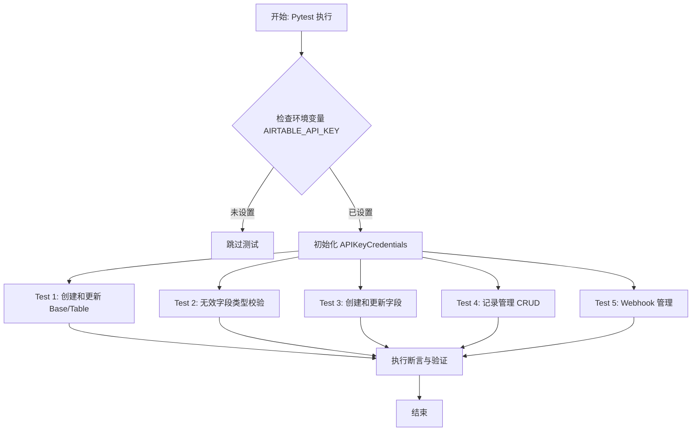
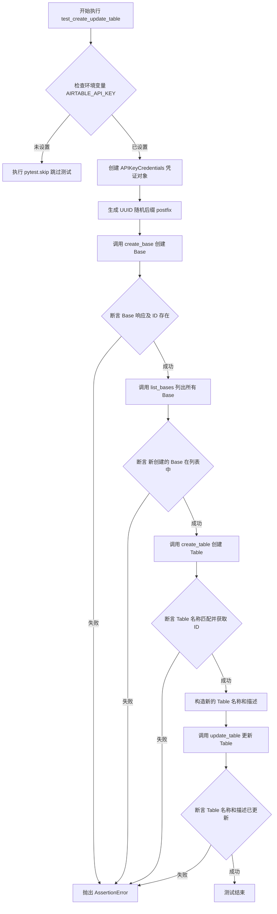
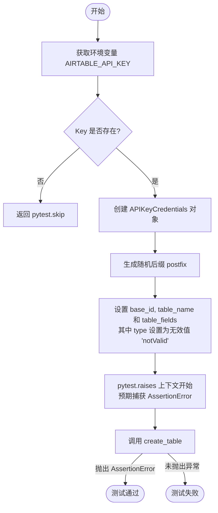
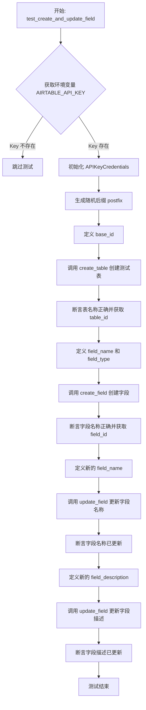
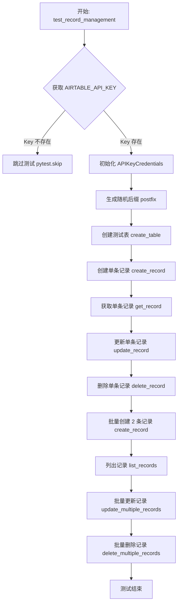
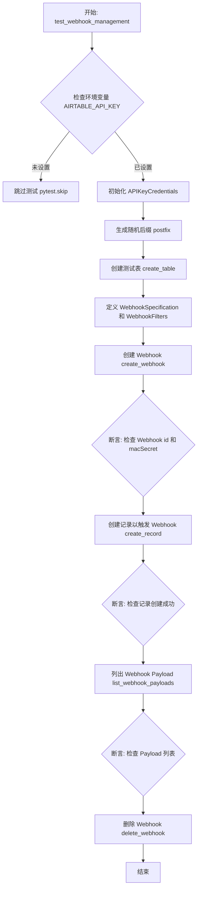

# `AutoGPT\autogpt_platform\backend\backend\blocks\airtable\_api_test.py` 详细设计文档

该文件是一个基于 pytest 的异步测试套件，用于验证 Airtable API 集成功能。它涵盖了 Base、Table、Field、Record 以及 Webhook 的增删改查（CRUD）操作，并包含了对无效类型的错误处理测试。

## 整体流程



## 类结构

```
No user-defined classes found in this file
Functions (Test Cases):
├── test_create_update_table
├── test_invalid_field_type
├── test_create_and_update_field
├── test_record_management
└── test_webhook_management
```

## 全局变量及字段


    

## 全局函数及方法


### `test_create_update_table`

该函数是一个异步测试用例，用于验证通过 SDK 创建和更新 Airtable Base（数据库）及 Table（表）的完整流程。它首先检查 API 密钥环境变量，然后执行创建 Base、验证 Base 列表、创建 Table 以及更新 Table 属性的操作，并在每一步进行断言以确保功能正确性。

参数：

返回值：`None`，无返回值。函数主要用于验证逻辑，若验证失败会抛出断言错误，若缺少环境变量则跳过测试。

#### 流程图



#### 带注释源码

```python
@pytest.mark.asyncio
async def test_create_update_table():

    # 从环境变量获取 Airtable API Key
    key = getenv("AIRTABLE_API_KEY")
    # 如果未设置 Key，则跳过该测试
    if not key:
        return pytest.skip("AIRTABLE_API_KEY is not set")

    # 使用 API Key 初始化凭证对象
    credentials = APIKeyCredentials(
        provider="airtable",
        api_key=SecretStr(key),
    )
    # 生成一个 4 位随机字符串作为后缀，防止命名冲突
    postfix = uuid4().hex[:4]
    # 指定 Workspace ID
    workspace_id = "wsphuHmfllg7V3Brd"
    
    # 调用 create_base 接口创建一个名为 "API Testing Base" 的 Base
    response = await create_base(credentials, workspace_id, "API Testing Base")
    # 断言响应不为空
    assert response is not None, f"Checking create base response: {response}"
    # 断言响应中包含 id 字段
    assert (
        response.get("id") is not None
    ), f"Checking create base response id: {response}"
    # 获取新创建的 Base ID
    base_id = response.get("id")
    assert base_id is not None, f"Checking create base response id: {base_id}"

    # 调用 list_bases 接口列出所有 Base
    response = await list_bases(credentials)
    assert response is not None, f"Checking list bases response: {response}"
    # 断言新创建的 Base 名称存在于返回的 Base 列表中
    assert "API Testing Base" in [
        base.get("name") for base in response.get("bases", [])
    ], f"Checking list bases response bases: {response}"

    # 定义 Table 名称和字段配置
    table_name = f"test_table_{postfix}"
    table_fields = [{"name": "test_field", "type": "singleLineText"}]
    # 调用 create_table 接口在指定 Base 下创建 Table
    table = await create_table(credentials, base_id, table_name, table_fields)
    # 断言创建的 Table 名称正确
    assert table.get("name") == table_name

    # 获取 Table ID
    table_id = table.get("id")

    assert table_id is not None

    # 准备更新后的 Table 名称和描述
    table_name = f"test_table_updated_{postfix}"
    table_description = "test_description_updated"
    # 调用 update_table 接口更新 Table 的名称和描述
    table = await update_table(
        credentials,
        base_id,
        table_id,
        table_name=table_name,
        table_description=table_description,
    )
    # 断言 Table 名称已更新
    assert table.get("name") == table_name
    # 断言 Table 描述已更新
    assert table.get("description") == table_description
```


### `test_invalid_field_type`

该函数用于测试当尝试创建包含无效字段类型的表时，系统能否正确抛出 `AssertionError` 异常，以此验证输入校验逻辑的有效性。

参数：

-  无

返回值：`None`，测试函数在成功捕获异常时无返回值，若环境变量缺失则返回 `pytest.skip` 控制对象。

#### 流程图



#### 带注释源码

```python
@pytest.mark.asyncio
async def test_invalid_field_type():
    # 获取环境变量中的 Airtable API Key
    key = getenv("AIRTABLE_API_KEY")
    # 如果 Key 未设置，则跳过该测试用例
    if not key:
        return pytest.skip("AIRTABLE_API_KEY is not set")

    # 使用 API Key 初始化凭证对象
    credentials = APIKeyCredentials(
        provider="airtable",
        api_key=SecretStr(key),
    )
    # 生成随机后缀，防止表名冲突
    postfix = uuid4().hex[:4]
    # 指定测试使用的 Base ID
    base_id = "appZPxegHEU3kDc1S"
    # 构造表名
    table_name = f"test_table_{postfix}"
    # 定义字段配置，此处故意使用 "notValid" 这一无效类型
    table_fields = [{"name": "test_field", "type": "notValid"}]
    
    # 使用 pytest.raises 验证调用 create_table 时是否抛出 AssertionError
    with pytest.raises(AssertionError):
        await create_table(credentials, base_id, table_name, table_fields)
```


### `test_create_and_update_field`

该函数是一个异步测试用例，用于验证在 Airtable 中创建表字段以及更新字段属性（名称和描述）的功能。它涵盖了从初始化凭据、创建测试表、创建字段、到更新字段名称和描述的完整流程，并包含对关键步骤的断言验证。

参数：

-  无

返回值：`None`，该函数作为测试用例执行断言，无显式返回值。

#### 流程图



#### 带注释源码

```python
@pytest.mark.asyncio
async def test_create_and_update_field():
    # 从环境变量获取 Airtable API Key
    key = getenv("AIRTABLE_API_KEY")
    # 如果 Key 不存在，则跳过该测试
    if not key:
        return pytest.skip("AIRTABLE_API_KEY is not set")

    # 使用获取到的 Key 初始化 API 凭证对象
    credentials = APIKeyCredentials(
        provider="airtable",
        api_key=SecretStr(key),
    )
    # 生成一个 4 位的随机十六进制后缀，用于确保测试数据的唯一性
    postfix = uuid4().hex[:4]
    # 指定测试使用的 Base ID
    base_id = "appZPxegHEU3kDc1S"
    # 构建唯一的表名
    table_name = f"test_table_{postfix}"
    # 定义表的初始字段配置
    table_fields = [{"name": "test_field", "type": "singleLineText"}]
    # 调用 create_table API 创建表
    table = await create_table(credentials, base_id, table_name, table_fields)
    # 断言：验证返回的表名称与预期一致
    assert table.get("name") == table_name

    # 从返回结果中获取表 ID
    table_id = table.get("id")

    # 断言：确保 table_id 存在
    assert table_id is not None

    # 构建唯一的字段名称
    field_name = f"test_field_{postfix}"
    # 指定字段类型为单行文本
    field_type = TableFieldType.SINGLE_LINE_TEXT
    # 调用 create_field API 在指定表中创建字段
    field = await create_field(credentials, base_id, table_id, field_type, field_name)
    # 断言：验证返回的字段名称与预期一致
    assert field.get("name") == field_name

    # 从返回结果中获取字段 ID
    field_id = field.get("id")

    # 断言：确保 field_id 存在且为字符串类型
    assert field_id is not None
    assert isinstance(field_id, str)

    # 定义更新后的字段名称
    field_name = f"test_field_updated_{postfix}"
    # 调用 update_field API 更新字段的名称
    field = await update_field(credentials, base_id, table_id, field_id, field_name)
    # 断言：验证返回的字段名称已更新
    assert field.get("name") == field_name

    # 定义更新后的字段描述
    field_description = "test_description_updated"
    # 调用 update_field API 更新字段的描述
    field = await update_field(
        credentials, base_id, table_id, field_id, description=field_description
    )
    # 断言：验证返回的字段描述已更新
    assert field.get("description") == field_description
```


### `test_record_management`

这是一个异步测试函数，旨在全面验证 Airtable API 中关于记录管理的核心功能。该测试涵盖了单条记录的完整生命周期（创建、读取、更新、删除）以及批量操作（批量创建、批量更新、批量删除），并确保在操作前已正确配置 API 访问凭证和测试所需的表结构。

参数：

-   无：该函数不接收直接参数，依赖于外部环境变量 `AIRTABLE_API_KEY`。

返回值：`None`，该函数作为测试用例，执行过程中通过断言验证逻辑，成功结束时无返回值，失败时抛出异常。

#### 流程图



#### 带注释源码

```python
@pytest.mark.asyncio
async def test_record_management():
    # 1. 环境检查与凭证初始化
    # 从环境变量获取 API Key，如果未设置则跳过测试
    key = getenv("AIRTABLE_API_KEY")
    if not key:
        return pytest.skip("AIRTABLE_API_KEY is not set")

    # 使用获取到的 Key 创建 API 凭证对象
    credentials = APIKeyCredentials(
        provider="airtable",
        api_key=SecretStr(key),
    )
    # 生成随机后缀，用于生成唯一的表名，避免测试数据冲突
    postfix = uuid4().hex[:4]
    
    # 指定测试使用的 Base ID
    base_id = "appZPxegHEU3kDc1S"
    
    # 构建测试表名称和字段结构
    table_name = f"test_table_{postfix}"
    table_fields = [{"name": "test_field", "type": "singleLineText"}]
    
    # 2. 准备测试环境：创建测试表
    table = await create_table(credentials, base_id, table_name, table_fields)
    assert table.get("name") == table_name

    # 获取并验证表 ID
    table_id = table.get("id")
    assert table_id is not None

    # 3. 单条记录操作测试 (CRUD)
    
    # Create: 创建一条包含 test_field 的记录
    record_fields = {"test_field": "test_value"}
    record = await create_record(credentials, base_id, table_id, fields=record_fields)
    fields = record.get("fields")
    assert fields is not None
    assert isinstance(fields, dict)
    assert fields.get("test_field") == "test_value"

    record_id = record.get("id")
    assert record_id is not None
    assert isinstance(record_id, str)

    # Read: 根据 ID 获取记录并验证内容
    record = await get_record(credentials, base_id, table_id, record_id)
    fields = record.get("fields")
    assert fields is not None
    assert isinstance(fields, dict)
    assert fields.get("test_field") == "test_value"

    # Update: 更新记录字段值
    record_fields = {"test_field": "test_value_updated"}
    record = await update_record(
        credentials, base_id, table_id, record_id, fields=record_fields
    )
    fields = record.get("fields")
    assert fields is not None
    assert isinstance(fields, dict)
    assert fields.get("test_field") == "test_value_updated"

    # Delete: 删除记录并验证删除标记
    record = await delete_record(credentials, base_id, table_id, record_id)
    assert record is not None
    assert record.get("id") == record_id
    assert record.get("deleted")

    # 4. 批量记录操作测试

    # Batch Create: 一次性创建两条记录
    records = [
        {"fields": {"test_field": "test_value_1"}},
        {"fields": {"test_field": "test_value_2"}},
    ]
    response = await create_record(credentials, base_id, table_id, records=records)
    created_records = response.get("records")
    assert created_records is not None
    assert isinstance(created_records, list)
    assert len(created_records) == 2, f"Created records: {created_records}"
    first_record = created_records[0]  # type: ignore
    second_record = created_records[1]  # type: ignore
    first_record_id = first_record.get("id")
    second_record_id = second_record.get("id")
    assert first_record_id is not None
    assert second_record_id is not None
    assert first_record_id != second_record_id
    first_fields = first_record.get("fields")
    second_fields = second_record.get("fields")
    assert first_fields is not None
    assert second_fields is not None
    assert first_fields.get("test_field") == "test_value_1"  # type: ignore
    assert second_fields.get("test_field") == "test_value_2"  # type: ignore

    # List: 获取表中的所有记录，验证数量为 2
    response = await list_records(credentials, base_id, table_id)
    records = response.get("records")
    assert records is not None
    assert len(records) == 2, f"Records: {records}"
    assert isinstance(records, list), f"Type of records: {type(records)}"

    # Batch Update: 同时更新两条记录
    records = [
        {"id": first_record_id, "fields": {"test_field": "test_value_1_updated"}},
        {"id": second_record_id, "fields": {"test_field": "test_value_2_updated"}},
    ]
    response = await update_multiple_records(
        credentials, base_id, table_id, records=records
    )
    updated_records = response.get("records")
    assert updated_records is not None
    assert len(updated_records) == 2, f"Updated records: {updated_records}"
    assert isinstance(
        updated_records, list
    ), f"Type of updated records: {type(updated_records)}"
    first_updated = updated_records[0]  # type: ignore
    second_updated = updated_records[1]  # type: ignore
    first_updated_fields = first_updated.get("fields")
    second_updated_fields = second_updated.get("fields")
    assert first_updated_fields is not None
    assert second_updated_fields is not None
    assert first_updated_fields.get("test_field") == "test_value_1_updated"  # type: ignore
    assert second_updated_fields.get("test_field") == "test_value_2_updated"  # type: ignore

    # Batch Delete: 同时删除两条记录
    assert isinstance(first_record_id, str)
    assert isinstance(second_record_id, str)
    response = await delete_multiple_records(
        credentials, base_id, table_id, records=[first_record_id, second_record_id]
    )
    deleted_records = response.get("records")
    assert deleted_records is not None
    assert len(deleted_records) == 2, f"Deleted records: {deleted_records}"
    assert isinstance(
        deleted_records, list
    ), f"Type of deleted records: {type(deleted_records)}"
    first_deleted = deleted_records[0]  # type: ignore
    second_deleted = deleted_records[1]  # type: ignore
    assert first_deleted.get("deleted")
    assert second_deleted.get("deleted")
```


### `test_webhook_management`

该函数用于测试 Webhook 的完整生命周期管理流程，包括创建测试表、定义并创建 Webhook、通过创建记录触发 Webhook、列出 Webhook 的 Payload 以及最终的删除操作。

参数：

-   `无`：该函数为 pytest 异步测试用例，不接受任何参数。

返回值：`None`，该函数作为测试用例，主要用于断言验证，无显式返回值。

#### 流程图



#### 带注释源码

```python
@pytest.mark.asyncio
async def test_webhook_management():
    # 从环境变量获取 API Key
    key = getenv("AIRTABLE_API_KEY")
    if not key:
        return pytest.skip("AIRTABLE_API_KEY is not set")

    # 初始化凭证对象
    credentials = APIKeyCredentials(
        provider="airtable",
        api_key=SecretStr(key),
    )
    # 生成随机后缀以防止表名冲突
    postfix = uuid4().hex[:4]
    base_id = "appZPxegHEU3kDc1S"
    table_name = f"test_table_{postfix}"
    table_fields = [{"name": "test_field", "type": "singleLineText"}]
    
    # 创建测试用的数据表
    table = await create_table(credentials, base_id, table_name, table_fields)
    assert table.get("name") == table_name

    table_id = table.get("id")
    assert table_id is not None
    
    # 定义 Webhook 规范，包括过滤的数据类型和变更类型
    webhook_specification = WebhookSpecification(
        filters=WebhookFilters(
            dataTypes=["tableData", "tableFields", "tableMetadata"],
            changeTypes=["add", "update", "remove"],
        )
    )
    
    # 创建 Webhook 并验证响应
    response = await create_webhook(credentials, base_id, webhook_specification)
    assert response is not None, f"Checking create webhook response: {response}"
    assert (
        response.get("id") is not None
    ), f"Checking create webhook response id: {response}"
    assert (
        response.get("macSecretBase64") is not None
    ), f"Checking create webhook response macSecretBase64: {response}"

    webhook_id = response.get("id")
    assert webhook_id is not None, f"Webhook ID: {webhook_id}"
    assert isinstance(webhook_id, str)

    # 在表中创建一条记录，旨在触发 Webhook
    response = await create_record(
        credentials, base_id, table_id, fields={"test_field": "test_value"}
    )
    assert response is not None, f"Checking create record response: {response}"
    assert (
        response.get("id") is not None
    ), f"Checking create record response id: {response}"
    fields = response.get("fields")
    assert fields is not None, f"Checking create record response fields: {response}"
    assert (
        fields.get("test_field") == "test_value"
    ), f"Checking create record response fields test_field: {response}"

    # 列出 Webhook 的 Payload，验证是否收到通知
    response = await list_webhook_payloads(credentials, base_id, webhook_id)
    assert response is not None, f"Checking list webhook payloads response: {response}"

    # 清理：删除创建的 Webhook
    response = await delete_webhook(credentials, base_id, webhook_id)
```


## 关键组件


### Authentication Configuration

Utilizes `APIKeyCredentials` and environment variables to securely configure and manage API access tokens for Airtable.

### Base Lifecycle Management

Handles the creation of new Airtable bases within a workspace and verifies their existence by listing available bases.

### Table Schema Management

Manages the creation, modification, and validation of table structures, ensuring that field types and properties comply with system constraints.

### Field Management

Controls the addition of new fields to tables and updates existing field properties such as names and descriptions.

### Single Record Operations

Executes individual Create, Read, Update, and Delete (CRUD) actions on specific records to verify data persistence and retrieval.

### Batch Record Operations

Performs bulk updates and deletions of multiple records in a single request, testing the API's ability to handle concurrent data changes efficiently.

### Webhook Management

Configures webhooks with specific filters for data types and change types, monitors incoming payloads, and manages webhook lifecycle including deletion.


## 问题及建议


### 已知问题

-   硬编码的资源ID：代码中硬编码了 `workspace_id` ("wsphuHmfllg7V3Brd") 和 `base_id` ("appZPxegHEU3kDc1S")，导致测试环境与特定账号强耦合，缺乏灵活性，并可能引入安全风险。
-   缺乏资源清理机制：测试过程中创建的 Base（如 `test_create_update_table`）和 Table（如 `test_record_management`, `test_webhook_management`）在测试结束后未被显式删除，会导致 Airtable 工作区中残留大量测试垃圾数据，长期运行可能影响测试环境性能或达到限额。
-   测试用例间存在环境依赖：多个测试函数依赖于同一个硬编码的 `base_id`，如果该 Base 在外部被误删或权限变更，会导致多个测试用例同时失败，破坏了测试的独立性和健壮性。

### 优化建议

-   引入 Pytest Fixture：使用 `@pytest.fixture` 封装重复的凭证初始化、Base 创建和 Table 创建逻辑。利用 `yield` 关键字实现测试后的自动资源清理（Teardown），解决数据残留问题。
-   配置外部化：将硬编码的 `workspace_id`、`base_id` 等配置项移至环境变量或独立的配置文件中，以适应不同的运行环境（如开发、CI/CD 流水线）。
-   提升测试隔离性：建议让每个测试用例或测试类动态创建独立的测试资源（Base/Table），而非共享预置资源，确保测试之间的完全隔离和幂等性。


## 其它


### 设计目标与约束

1.  **设计目标**：本代码旨在对 Airtable API 的 SDK 集成进行全面的功能性测试。核心目标是验证 `_api` 模块中定义的各类异步方法（如 Base、Table、Field、Record 及 Webhook 的 CRUD 操作）在与真实 Airtable 服务交互时的正确性、数据完整性和响应格式符合预期。
2.  **约束条件**：
    *   **环境依赖**：测试执行依赖于环境变量 `AIRTABLE_API_KEY` 的设置，若缺失则跳过测试。
    *   **硬编码资源**：部分测试依赖于特定的 Workspace ID (`wsphuHmfllg7V3Brd`) 和 Base ID (`appZPxegHEU3kDc1S`) 的存在，限制了测试环境的灵活性。
    *   **异步执行**：所有测试函数必须作为协程运行，依赖于 `pytest-asyncio` 插件。
    *   **数据残留风险**：尽管在测试流程中尝试删除记录和 Webhook，但部分测试（如 Table 和 Base 的创建）未在测试结束后显式清理，可能导致测试环境产生数据残留。

### 外部依赖与接口契约

1.  **外部依赖**：
    *   **SDK模块** (`backend.sdk`)：提供认证凭证类 `APIKeyCredentials` 和安全字符串包装 `SecretStr`。
    *   **API封装模块** (`_api`)：提供所有与 Airtable 交互的底层异步函数（如 `create_table`, `update_record` 等）及数据模型（如 `TableFieldType`, `WebhookSpecification`）。
    *   **测试框架**：`pytest` 用于测试结构化，`pytest.mark.asyncio` 用于异步测试支持。
    *   **Airtable 服务**：实际的远程 API 服务端点。
2.  **接口契约**：
    *   **认证**：所有 API 调用要求第一个参数为 `credentials` 对象。
    *   **标识符**：操作资源通常需要 `base_id` (str), `table_id` (str), 或 `record_id` (str) 作为参数。
    *   **返回值**：API 函数约定返回包含 JSON 响应数据的字典。成功操作通常包含资源的 `id` 和 `createdTime` 等字段。
    *   **异常**：无效输入（如不合法的字段类型）预期会触发异常（如 `AssertionError`），由测试用例捕获并验证。

### 错误处理与异常设计

1.  **配置缺失处理**：通过 `os.getenv("AIRTABLE_API_KEY")` 获取密钥，如果返回空值，直接调用 `pytest.skip` 跳过当前测试，避免因环境配置问题导致的测试误报失败。
2.  **断言验证机制**：
    *   **显式非空检查**：对关键 API 响应（如创建 Base、Table、Record）进行 `assert ... is not None` 检查，确保 API 未返回静默错误。
    *   **类型一致性检查**：检查返回的 ID 是否为字符串类型（`isinstance(..., str)`），确保数据契约被遵守。
    *   **值相等性检查**：验证更新操作后的字段值（如 `name`, `description`）是否与输入参数一致。
3.  **异常预期**：在 `test_invalid_field_type` 中，使用 `pytest.raises(AssertionError)` 上下文管理器，明确预期当传入非法字段类型时，系统应抛出断言错误，验证了输入校验逻辑的有效性。

### 数据流与状态管理

1.  **测试数据流**：
    *   **初始化阶段**：从环境变量读取密钥 -> 封装为 `APIKeyCredentials` -> 生成随机后缀（`postfix`）。
    *   **资源构建阶段**：调用 `create_base`/`create_table` -> 提取返回的 `id` -> 作为下游操作（如 `create_field`）的输入参数。这种级联依赖关系确保了操作对象的有效性。
    *   **状态变更验证**：通过 `update_*` 系列方法修改资源属性 -> 重新获取或检查响应 -> 断言新值生效。
    *   **清理阶段**：调用 `delete_record` 或 `delete_webhook` 移除生成的临时数据。
2.  **状态管理**：
    *   **无状态测试结构**：每个测试函数（`test_*`）独立运行，不共享全局状态。
    *   **资源唯一性**：利用 `uuid4` 生成随机后缀附着于资源名称（如 `test_table_{postfix}`），防止并发测试或重复运行时的资源命名冲突。
    *   **生命周期管理**：测试数据遵循“创建-验证-更新-验证-删除”的生命周期模式，但在最高层级（Base/Table）上主要侧重于创建与更新，未强制销毁。

### 测试策略与覆盖范围

1.  **测试策略**：
    *   **集成测试**：直接与外部 Airtable API 通信，验证端到端的功能性，而非单纯的单元 Mock 测试。
    *   **正向路径测试**：主要覆盖所有 CRUD 操作的成功路径。
    *   **负向路径测试**：包含针对非法输入的测试用例（如 `test_invalid_field_type`）。
2.  **覆盖范围**：
    *   **Base管理**：创建 Base，列出 Base。
    *   **Schema管理**：创建 Table，更新 Table；创建 Field，更新 Field。
    *   **数据操作**：单条 Record 的增删改查，批量 Record 的创建、更新、删除，列表查询。
    *   **Webhook管理**：创建 Webhook（带 Specification），列出 Payloads，删除 Webhook。

    