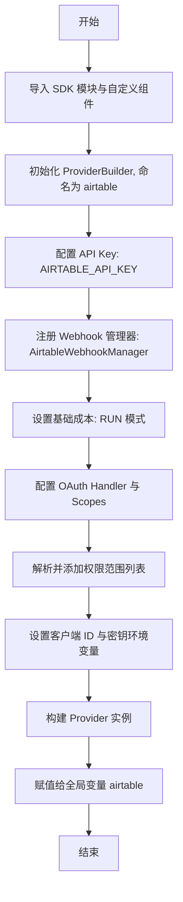
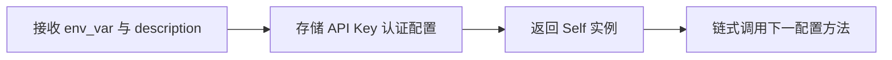
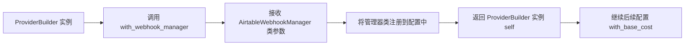
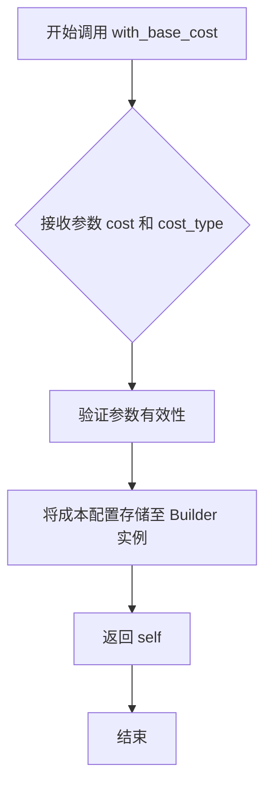
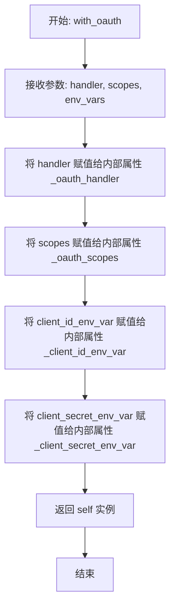
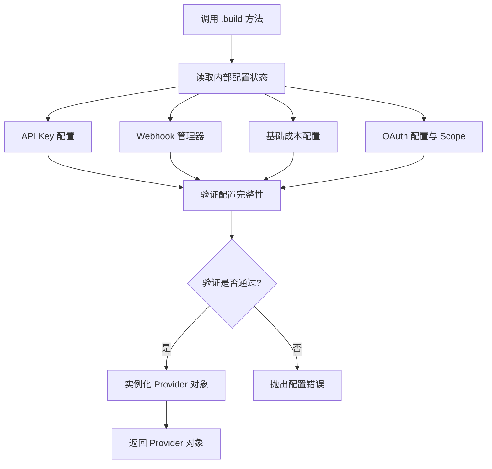

# `AutoGPT\autogpt_platform\backend\backend\blocks\airtable\_config.py` 详细设计文档

该 Python 脚本用于初始化和配置 Airtable 服务提供者，使用了构建器模式（ProviderBuilder）。它集成了 API 密钥认证、Webhook 管理器、基础运行成本设置，并配置了包含特定作用域（数据读写、Schema 读写、Webhook 管理）的 OAuth 认证流程。

## 整体流程



## 类结构

```
N/A (该文件不包含类定义，仅包含导入与配置逻辑)
```

## 全局变量及字段


### `airtable`
    
The fully configured Airtable provider instance including authentication, webhook, OAuth, and cost settings.

类型：`Provider`
    


### `AirtableScope.DATA_RECORDS_READ`
    
OAuth scope permission for reading data records from Airtable.

类型：`AirtableScope`
    


### `AirtableScope.DATA_RECORDS_WRITE`
    
OAuth scope permission for creating or modifying data records in Airtable.

类型：`AirtableScope`
    


### `AirtableScope.SCHEMA_BASES_READ`
    
OAuth scope permission for reading base schemas and table structures.

类型：`AirtableScope`
    


### `AirtableScope.SCHEMA_BASES_WRITE`
    
OAuth scope permission for creating or modifying base schemas and table structures.

类型：`AirtableScope`
    


### `AirtableScope.WEBHOOK_MANAGE`
    
OAuth scope permission for creating and managing webhooks.

类型：`AirtableScope`
    


### `BlockCostType.RUN`
    
A constant representing the cost type incurred during the execution phase of a block.

类型：`BlockCostType`
    
    

## 全局函数及方法


### `ProviderBuilder.with_api_key`

该方法是 Provider 构建器链式调用的一部分，用于配置数据提供者使用 API Key 进行身份验证。它接收环境变量名称和描述信息，将认证配置存储在构建器中，并返回构建器实例自身以支持后续的链式配置。

参数：

-   `key_env_var`：`str`，存储 API Key 的环境变量名称（代码中为 `"AIRTABLE_API_KEY"`）。
-   `key_description`：`str`，API Key 的描述文本，用于说明该凭证的用途（代码中为 `"Airtable Personal Access Token"`）。

返回值：`ProviderBuilder`，返回构建器实例自身，以便继续调用其他配置方法（如 `with_webhook_manager`）。

#### 流程图



#### 带注释源码

```python
# 以下代码展示了在构建 Airtable provider 时，如何使用 with_api_key 方法进行配置
.with_api_key(
    "AIRTABLE_API_KEY",                 # 参数1: 指定环境变量名，系统运行时将从此变量读取实际的 Token
    "Airtable Personal Access Token"    # 参数2: 对该 Key 的文字描述，通常用于在管理界面或文档中指代该凭证类型
)
```


### `ProviderBuilder.with_webhook_manager`

用于在 ProviderBuilder 配置链中注册 webhook 管理器类，该管理器负责处理 Webhook 的注册、验证及事件分发逻辑。此方法是构建 Airtable Provider 的关键步骤之一，通过链式调用返回 Builder 实例以支持连续配置。

参数：

- `webhook_manager_class`：`type`，用于处理 Webhook 生命周期的管理器类（在此处传入的是 `AirtableWebhookManager` 类）。

返回值：`ProviderBuilder`，返回当前的 Builder 实例，以便进行链式调用。

#### 流程图



#### 带注释源码

```python
# 配置 Airtable provider 时，指定用于处理 Webhook 的管理器类
# 这一步将自定义的 Webhook 处理逻辑注入到 SDK 的 Provider 机制中
.with_webhook_manager(AirtableWebhookManager)
```


### `ProviderBuilder.with_base_cost`

该方法用于为 Provider 配置基础成本信息，定义了调用该 Provider 时的资源消耗量或计费单位。

参数：

- `cost`：`int` 或 `float`，表示基础成本的数值（例如：1）。
- `cost_type`：`BlockCostType`，表示成本计算的类型或单位（例如：`BlockCostType.RUN`，代表按次运行计费）。

返回值：`ProviderBuilder`，返回 Builder 实例自身，以支持链式调用。

#### 流程图



#### 带注释源码

```python
    # 设置该 Provider 的基础成本为 1，计费类型为 RUN（每次运行）
    .with_base_cost(1, BlockCostType.RUN)
```


### `ProviderBuilder.with_oauth`

配置提供者使用 OAuth 2.0 认证方式。该方法接收 OAuth 处理器类、权限范围列表以及用于存放客户端凭证的环境变量名，将其绑定到构建器实例中，以便在构建最终 Provider 对象时初始化认证逻辑。该方法支持链式调用。

参数：

-  `handler`：`Type[BaseOAuthHandler]`，OAuth 认证处理类，负责处理具体的认证交互逻辑（如处理回调、令牌交换等）。
-  `scopes`：`List[str]`，请求的 OAuth 权限范围列表，定义了访问资源的权限级别。
-  `client_id_env_var`：`str`，存储 OAuth Client ID 的环境变量名称。
-  `client_secret_env_var`：`str`，存储 OAuth Client Secret 的环境变量名称。

返回值：`ProviderBuilder`，返回构建器实例自身，以支持链式调用。

#### 流程图



#### 带注释源码

```python
def with_oauth(
    self,
    handler: Type[BaseOAuthHandler],  # OAuth 处理器类
    scopes: List[str],                # 权限范围列表
    client_id_env_var: str,           # 客户端 ID 环境变量名
    client_secret_env_var: str        # 客户端密钥环境变量名
) -> "ProviderBuilder":
    """
    配置 Provider 使用 OAuth 认证。
    注意：以下代码是基于调用上下文和构建器模式推断的典型实现，
    因为源码中未包含 backend.sdk 的具体实现。
    """
    
    # 存储传入的 OAuth 处理器类，用于后续实例化处理认证逻辑
    self._oauth_handler = handler
    
    # 存储所需的权限范围，认证时告知服务端需要的权限
    self._oauth_scopes = scopes
    
    # 存储客户端 ID 的环境变量名，运行时通过该变量名读取实际值
    self._client_id_env_var = client_id_env_var
    
    # 存储客户端密钥的环境变量名，运行时通过该变量名读取实际值
    self._client_secret_env_var = client_secret_env_var
    
    # 返回当前实例，支持链式调用（例如继续调用 .with_webhook_manager()）
    return self
```


### `ProviderBuilder.build`

构建器模式的终结方法，用于根据之前链式调用设置的参数（包括 API 密钥、Webhook 管理器、基础成本配置以及 OAuth 配置）来实例化并返回一个完全配置好的 Provider 对象。

参数：

-   `无`：该方法通常不接受参数，直接使用构建器实例内部累积的状态。

返回值：`Provider`，根据配置信息构造完成的 Airtable Provider 实例。

#### 流程图



#### 带注释源码

```python
    # 注意：ProviderBuilder 类定义于外部依赖 backend.sdk 中，此处仅展示其在当前文件中的调用上下文
    # 
    # 1. 该方法是链式调用的最后一步
    # 2. 它不接收参数，而是利用前置方法（如 .with_api_key, .with_oauth 等）设置的内部状态
    # 3. 它触发了 Provider 对象的实际构造过程，将分散的配置整合为一个统一的服务提供者实例
    # 4. 返回的实例被赋值给全局变量 'airtable'，供后续模块使用
    .build()
```


## 关键组件


### ProviderBuilder

用于配置和实例化服务提供者的构建器类，支持链式调用以设置认证、Webhook 和成本等参数。

### AirtableOAuthHandler

专门处理 Airtable OAuth 2.0 认证流程的组件，包括授权请求和令牌交换。

### AirtableWebhookManager

负责管理 Airtable Webhook 的生命周期，包括注册、接收和处理 Webhook 事件。

### AirtableScope

定义 Airtable API 访问权限范围的枚举集合，用于在 OAuth 授权过程中请求特定级别的访问权限。


## 问题及建议


### 已知问题

-   **导入时副作用**：ProviderBuilder 的构建逻辑直接写在模块全局作用域，这意味着在导入该模块时会立即执行构建。这会导致单元测试困难（难以 Mock），增加了模块间的隐式耦合，并且如果构建逻辑耗时，会影响应用启动速度。
-   **硬编码配置值**：成本值 `1` 以及环境变量名称（如 `"AIRTABLE_API_KEY"`）以魔术字符串和数字的形式散落在代码中。如果未来需要调整成本结构或环境变量命名，必须直接修改源代码，降低了配置的灵活性。
-   **代码可读性与冗余**：在配置 OAuth Scopes 时，使用了一个显式的列表包裹枚举，再通过列表推导式提取 `value`。这种写法略显冗余，不如直接推导或直接使用列表清晰。

### 优化建议

-   **采用工厂模式或延迟加载**：将 `airtable` 实例的创建封装在一个函数（如 `create_airtable_provider()`）或类方法中。这样可以将初始化过程推迟到实际调用时，便于在测试中进行依赖注入，并避免不必要的启动开销。
-   **提取配置常量**：将环境变量名、Client ID/Secret Key 变量名以及基础成本值提取为模块顶部的常量（例如 `AIRTABLE_PROVIDER_COST = 1`）。集中管理配置项，提高代码的可维护性。
-   **简化 Scopes 生成逻辑**：优化 OAuth Scopes 的列表推导式写法，使其更加简洁直观，或者如果 Scopes 是固定的，直接定义为一个常量列表。


## 其它


### 设计目标与约束

**设计目标**：
本模块旨在提供一个集中式、可复用的 Airtable 服务提供者配置。通过封装 API 密钥认证、OAuth 2.0 授权流程、Webhook 管理以及计费成本配置，确保所有基于 SDK 模式的 Airtable 模块行为一致。它利用构建器模式简化了复杂的对象初始化过程。

**设计约束**：
1.  **环境变量依赖**：运行时必须提供 `AIRTABLE_API_KEY`、`AIRTABLE_CLIENT_ID` 和 `AIRTABLE_CLIENT_SECRET` 环境变量，否则配置构建将失败。
2.  **模块依赖**：强依赖 `backend.sdk` 框架提供的 `ProviderBuilder`、`BlockCostType` 等核心类，以及本地模块 `_oauth` 和 `_webhook` 的具体实现。
3.  **作用域限制**：硬编码了一组特定的 OAuth 作用域，适用于需要完整读写和架构管理权限的场景，限制了细粒度的权限控制能力。

### 错误处理与异常设计

本配置文件本身不包含显式的 `try-catch` 逻辑，错误处理策略依赖于外部框架或调用方：

1.  **配置验证失败**：`ProviderBuilder` 在调用 `with_api_key` 或 `with_oauth` 时，可能会验证参数合法性。如果参数无效（如空的 Client ID），构建器应抛出 `ValueError` 或特定的配置异常。
2.  **环境变量缺失**：如果在系统环境中找不到指定的键名，`ProviderBuilder` 的内部逻辑在尝试读取时将抛出 `KeyError` 或 `ConfigurationError`。预期这是启动阶段的致命错误，会导致应用初始化失败。
3.  **构建失败**：在调用 `.build()` 时，如果缺少必要组件（如未注册 Webhook 管理器或 OAuth 处理器），框架应抛出 `BuildError`，防止不完整的提供者实例被使用。

### 数据流与状态机

**数据流**：
1.  **输入**：从操作系统环境变量中读取敏感信息（API Key、OAuth 凭证）。
2.  **配置传递**：
    *   API Key 流向 `ProviderBuilder` 的认证模块。
    *   OAuth 配置（Handler 类、Scope 列表、凭证变量名）流向授权模块。
    *   `AirtableWebhookManager` 类流向回调处理模块。
    *   成本配置流向计费模块。
3.  **输出**：生成一个完全初始化的 `airtable` 对象（服务提供者实例），供应用程序的其他部分注入和使用。

**状态机**：
该模块描述的是一个静态配置过程，主要涉及构建对象的状态变迁：
*   **Idle (空闲)**：模块加载前。
*   **Configuring (配置中)**：链式调用 `with_...` 方法设置属性。
*   **Built (已构建)**：调用 `.build()` 后，状态锁定，实例不可变，可用于服务请求。

### 外部依赖与接口契约

**外部依赖**：
1.  **Backend SDK** (`backend.sdk`)：核心开发框架，提供 `ProviderBuilder` 用于组装服务提供者。
2.  **Airtable API**：远程服务端，定义了 OAuth Scope 的有效值和 API 交互规范。
3.  **内部模块**：
    *   `._oauth.AirtableOAuthHandler`：处理具体的 OAuth2 交互逻辑。
    *   `._webhook.AirtableWebhookManager`：处理 Airtable Webhook 的接收与验证。

**接口契约**：
1.  **ProviderBuilder 接口**：期望链式方法（`with_api_key`, `with_webhook_manager` 等）返回 `self` 以支持流式 API，且最终 `build()` 方法返回符合服务提供者协议的对象。
2.  **WebhookManager 接口**：`AirtableWebhookManager` 必须实现 SDK 规定的 Webhook 处理接口（通常包含验证签名、分发事件等方法）。
3.  **OAuthHandler 接口**：`AirtableOAuthHandler` 必须符合 SDK 的 OAuth 处理器规范，能够处理授权码交换、令牌刷新等流程。
4.  **枚举契约**：`AirtableScope` 枚举类的 `.value` 属性必须返回 Airtable API 接受的字符串格式（如 `data.records:read`）。

### 安全性与合规性

1.  **凭证管理**：敏感信息（Personal Access Token, Client Secret）不硬编码在源代码中，而是通过环境变量注入，符合 12-Factor App 原则，防止凭证泄露。
2.  **最小权限原则（评估）**：当前配置请求了较为广泛的权限（包括 Schema Bases Read/Write 和 Webhook 管理）。在生产环境中，应评估是否所有使用此 Provider 的块都需要修改 Schema 的权限，建议根据实际业务需求拆分权限配置以遵循最小权限原则。
3.  **传输安全**：依赖于 SDK 和 `AirtableOAuthHandler` 在底层实现所有通信的 HTTPS 加密。
4.  **作用域声明**：显式声明了所需的 OAuth 作用域，确保用户在授权时知晓应用所需的数据访问级别。


    