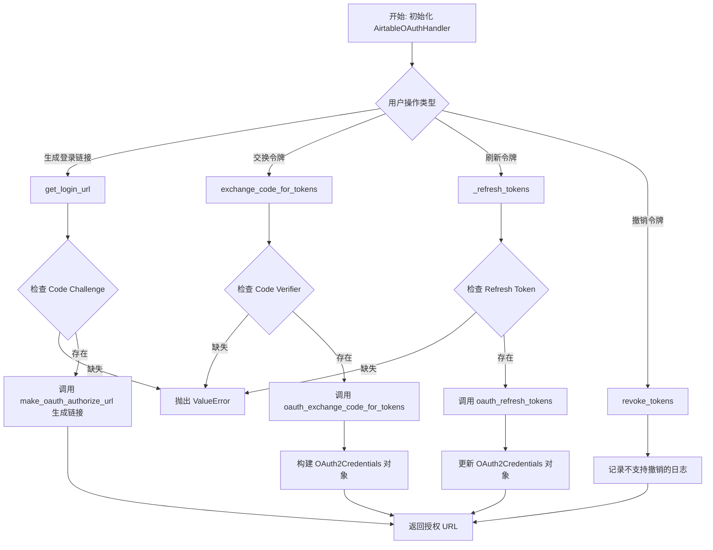
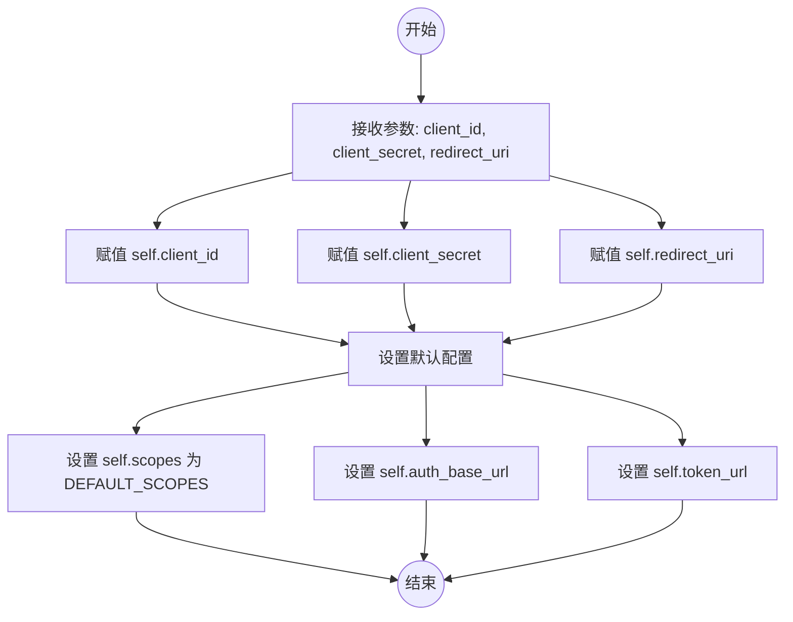
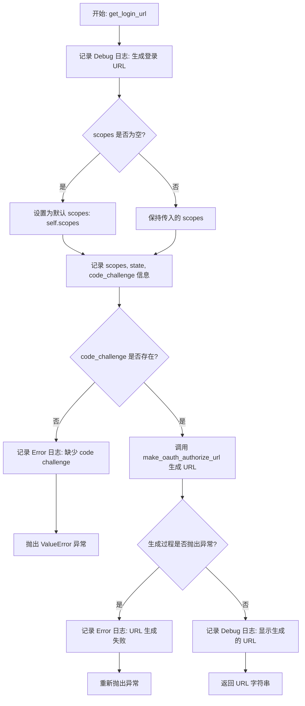
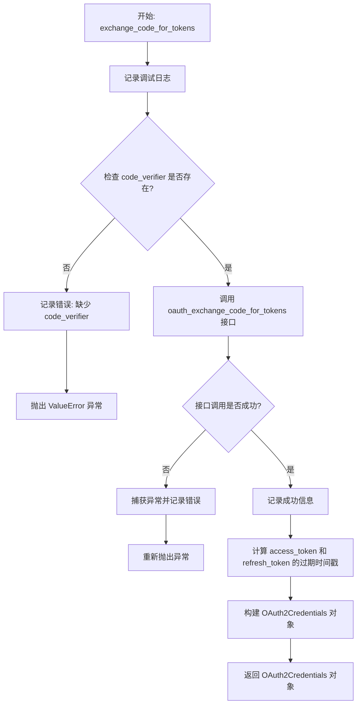
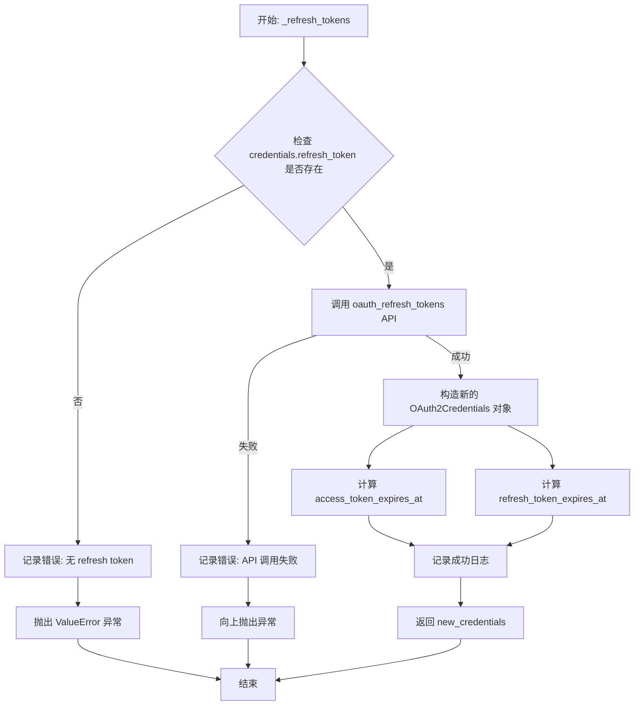
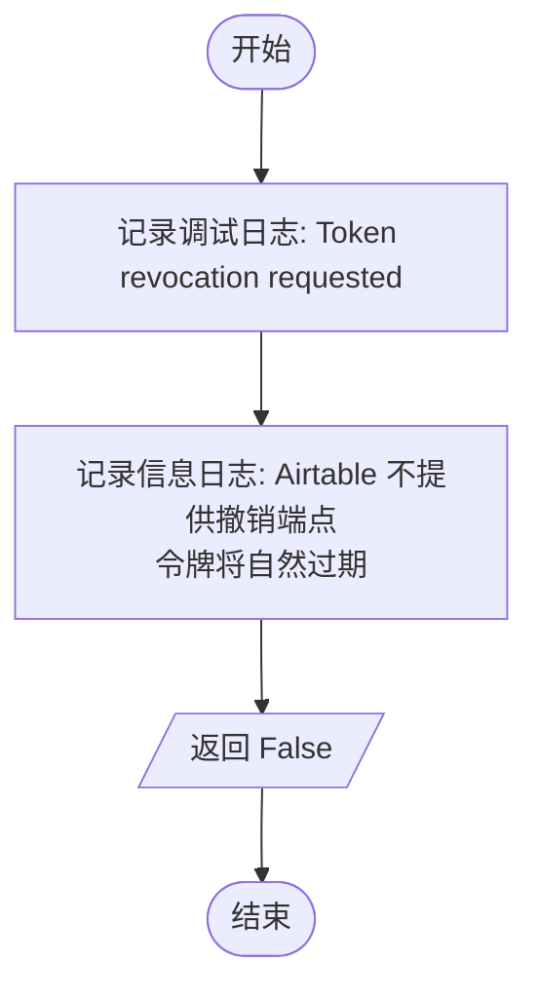

# `AutoGPT\autogpt_platform\backend\backend\blocks\airtable\_oauth.py` 详细设计文档

该代码实现了针对 Airtable 的 OAuth2 认证处理器，支持 PKCE（Proof Key for Code Exchange）安全流程。它定义了 Airtable API 所需的各种权限范围，并提供了生成授权登录 URL、使用授权码交换访问令牌、刷新令牌以及撤销令牌等核心功能，以集成 Airtable 服务。

## 整体流程



## 类结构

```
AirtableScope (str, Enum)
└── [Enum Members: DATA_RECORDS_READ, ...]
AirtableOAuthHandler (BaseOAuthHandler)
├── Class Variables: PROVIDER_NAME, DEFAULT_SCOPES
├── __init__
├── get_login_url
├── exchange_code_for_tokens
├── _refresh_tokens
└── revoke_tokens
```

## 全局变量及字段


### `logger`
    
用于记录日志的模块级记录器实例

类型：`Logger`
    


### `AirtableScope.DATA_RECORDS_READ`
    
读取数据记录的 OAuth 权限范围

类型：`str`
    


### `AirtableScope.DATA_RECORDS_WRITE`
    
写入数据记录的 OAuth 权限范围

类型：`str`
    


### `AirtableScope.DATA_RECORD_COMMENTS_READ`
    
读取记录评论的 OAuth 权限范围

类型：`str`
    


### `AirtableScope.DATA_RECORD_COMMENTS_WRITE`
    
写入记录评论的 OAuth 权限范围

类型：`str`
    


### `AirtableScope.SCHEMA_BASES_READ`
    
读取基础结构的 OAuth 权限范围

类型：`str`
    


### `AirtableScope.SCHEMA_BASES_WRITE`
    
写入基础结构的 OAuth 权限范围

类型：`str`
    


### `AirtableScope.WEBHOOK_MANAGE`
    
管理 Webhook 的 OAuth 权限范围

类型：`str`
    


### `AirtableScope.BLOCK_MANAGE`
    
管理块(Block)的 OAuth 权限范围

类型：`str`
    


### `AirtableScope.USER_EMAIL_READ`
    
读取用户邮箱的 OAuth 权限范围

类型：`str`
    


### `AirtableScope.ENTERPRISE_GROUPS_READ`
    
读取企业组的 OAuth 权限范围

类型：`str`
    


### `AirtableScope.WORKSPACES_AND_BASES_READ`
    
读取工作区和基础的 OAuth 权限范围

类型：`str`
    


### `AirtableScope.WORKSPACES_AND_BASES_WRITE`
    
写入工作区和基础的 OAuth 权限范围

类型：`str`
    


### `AirtableScope.WORKSPACES_AND_BASES_SHARES_MANAGE`
    
管理工作区和基础共享的 OAuth 权限范围

类型：`str`
    


### `AirtableScope.ENTERPRISE_SCIM_USERS_AND_GROUPS_MANAGE`
    
管理 SCIM 用户和组的 OAuth 权限范围

类型：`str`
    


### `AirtableScope.ENTERPRISE_AUDIT_LOGS_READ`
    
读取企业审计日志的 OAuth 权限范围

类型：`str`
    


### `AirtableScope.ENTERPRISE_CHANGE_EVENTS_READ`
    
读取企业变更事件的 OAuth 权限范围

类型：`str`
    


### `AirtableScope.ENTERPRISE_EXPORTS_MANAGE`
    
管理企业导出的 OAuth 权限范围

类型：`str`
    


### `AirtableScope.ENTERPRISE_ACCOUNT_READ`
    
读取企业账户信息的 OAuth 权限范围

类型：`str`
    


### `AirtableScope.ENTERPRISE_ACCOUNT_WRITE`
    
写入企业账户信息的 OAuth 权限范围

类型：`str`
    


### `AirtableScope.ENTERPRISE_USER_READ`
    
读取企业用户信息的 OAuth 权限范围

类型：`str`
    


### `AirtableScope.ENTERPRISE_USER_WRITE`
    
写入企业用户信息的 OAuth 权限范围

类型：`str`
    


### `AirtableScope.ENTERPRISE_GROUPS_MANAGE`
    
管理企业组的 OAuth 权限范围

类型：`str`
    


### `AirtableScope.WORKSPACES_AND_BASES_MANAGE`
    
管理工作区和基础的 OAuth 权限范围

类型：`str`
    


### `AirtableScope.HYPERDB_RECORDS_READ`
    
读取 HyperDB 记录的 OAuth 权限范围

类型：`str`
    


### `AirtableScope.HYPERDB_RECORDS_WRITE`
    
写入 HyperDB 记录的 OAuth 权限范围

类型：`str`
    


### `AirtableOAuthHandler.PROVIDER_NAME`
    
OAuth 提供商的名称标识符

类型：`ProviderName`
    


### `AirtableOAuthHandler.DEFAULT_SCOPES`
    
默认请求的 OAuth 权限范围列表

类型：`list[str]`
    


### `AirtableOAuthHandler.client_id`
    
OAuth 客户端 ID

类型：`str`
    


### `AirtableOAuthHandler.client_secret`
    
OAuth 客户端密钥

类型：`Optional[str]`
    


### `AirtableOAuthHandler.redirect_uri`
    
OAuth 授权回调地址

类型：`str`
    


### `AirtableOAuthHandler.scopes`
    
当前实例使用的 OAuth 权限范围列表

类型：`list[str]`
    


### `AirtableOAuthHandler.auth_base_url`
    
OAuth 授权端点的 URL

类型：`str`
    


### `AirtableOAuthHandler.token_url`
    
OAuth 令牌交换端点的 URL

类型：`str`
    
    

## 全局函数及方法


### `AirtableOAuthHandler.__init__`

初始化 Airtable OAuth 处理程序的实例，配置必要的客户端凭证（ID 和 Secret）、重定向 URI、默认 OAuth 作用域以及 Airtable API 端点。

参数：

- `self`：`AirtableOAuthHandler`，类的实例引用。
- `client_id`：`str`，用于向 Airtable 标识应用程序的客户端 ID。
- `client_secret`：`Optional[str]`，用于客户端身份验证的客户端密钥，可能为空。
- `redirect_uri`：`str`，用户授权后重定向回的 URI。

返回值：`None`，构造函数不返回任何值。

#### 流程图



#### 带注释源码

```python
def __init__(self, client_id: str, client_secret: Optional[str], redirect_uri: str):
    # 存储客户端 ID，用于 OAuth 流程中标识应用
    self.client_id = client_id
    # 存储客户端密钥，用于在后端交换 Token 时进行验证
    self.client_secret = client_secret
    # 存储重定向 URI，必须与 Airtable 应用配置中的一致
    self.redirect_uri = redirect_uri
    # 设置默认的权限范围（Scopes），定义了应用可以访问的资源
    self.scopes = self.DEFAULT_SCOPES
    # 设置 OAuth2 授权页面的基础 URL
    self.auth_base_url = "https://airtable.com/oauth2/v1/authorize"
    # 设置用于交换访问令牌的 Token 端点 URL
    self.token_url = "https://airtable.com/oauth2/v1/token"
```


### `AirtableOAuthHandler.get_login_url`

生成用于 Airtable OAuth 2.0 认证的登录 URL，支持自定义权限范围和 PKCE（Proof Key for Code Exchange）扩展，以确保安全性。

参数：

- `scopes`：`list[str]`，请求的 OAuth 权限范围列表。如果为空，将使用默认配置的作用域。
- `state`：`str`，用于维持请求和回调之间状态的安全随机字符串，主要用于防止 CSRF 攻击。
- `code_challenge`：`Optional[str]`，PKCE 流程所需的代码挑战值。这是一个必填参数，如果未提供将抛出异常。

返回值：`str`，生成的 Airtable OAuth 授权 URL。

#### 流程图



#### 带注释源码

```python
    def get_login_url(
        self, scopes: list[str], state: str, code_challenge: Optional[str]
    ) -> str:
        logger.debug("Generating Airtable OAuth login URL")
        # 如果未提供 scopes，则回退到实例初始化时定义的默认 scopes
        if not scopes:
            logger.debug("No scopes provided, using default scopes")
            scopes = self.scopes

        logger.debug(f"Using scopes: {scopes}")
        logger.debug(f"State: {state}")
        logger.debug(f"Code challenge: {code_challenge}")
        
        # 验证 PKCE 所需的 code_challenge 是否存在
        if not code_challenge:
            logger.error("Code challenge is required but none was provided")
            raise ValueError("No code challenge provided")

        try:
            # 调用辅助函数构建完整的授权 URL
            url = make_oauth_authorize_url(
                self.client_id, self.redirect_uri, scopes, state, code_challenge
            )
            logger.debug(f"Generated OAuth URL: {url}")
            return url
        except Exception as e:
            # 捕获并记录 URL 生成过程中的任何错误
            logger.error(f"Failed to generate OAuth URL: {str(e)}")
            raise
```


### `AirtableOAuthHandler.exchange_code_for_tokens`

该方法用于使用OAuth2授权码和PKCE（Proof Key for Code Exchange）验证器从Airtable交换访问令牌和刷新令牌。

参数：

- `code`：`str`，从OAuth回调中获取的授权码。
- `scopes`：`list[str]`，请求的权限范围列表。
- `code_verifier`：`Optional[str]`，PKCE流程中生成的代码验证器，用于验证授权码请求的合法性。

返回值：`OAuth2Credentials`，包含访问令牌、刷新令牌及其过期时间的凭据对象。

#### 流程图



#### 带注释源码

```python
    async def exchange_code_for_tokens(
        self, code: str, scopes: list[str], code_verifier: Optional[str]
    ) -> OAuth2Credentials:
        # 记录开始交换令牌的调试日志
        logger.debug("Exchanging authorization code for tokens")
        # 出于安全考虑，仅记录授权码的前4个字符
        logger.debug(f"Code: {code[:4]}...")
        # 记录请求的 scopes
        logger.debug(f"Scopes: {scopes}")
        
        # 验证 code_verifier 是否存在，这是 PKCE 流程的关键部分
        if not code_verifier:
            logger.error("Code verifier is required but none was provided")
            raise ValueError("No code verifier provided")

        try:
            # 调用底层 API 执行令牌交换操作
            # 注意：code_verifier 需要编码为 bytes
            response: OAuthTokenResponse = await oauth_exchange_code_for_tokens(
                client_id=self.client_id,
                code=code,
                code_verifier=code_verifier.encode("utf-8"),
                redirect_uri=self.redirect_uri,
                client_secret=self.client_secret,
            )
            logger.info("Successfully exchanged code for tokens")

            # 构建返回的凭据对象
            # 计算令牌过期的绝对时间戳（当前时间 + 有效期秒数）
            credentials = OAuth2Credentials(
                access_token=SecretStr(response.access_token),
                refresh_token=SecretStr(response.refresh_token),
                access_token_expires_at=int(time.time()) + response.expires_in,
                refresh_token_expires_at=int(time.time()) + response.refresh_expires_in,
                provider=self.PROVIDER_NAME,
                scopes=scopes,
            )
            # 记录令牌有效期信息
            logger.debug(f"Access token expires in {response.expires_in} seconds")
            logger.debug(
                f"Refresh token expires in {response.refresh_expires_in} seconds"
            )
            return credentials

        except Exception as e:
            # 捕获并记录交换过程中的任何错误，然后向上抛出
            logger.error(f"Failed to exchange code for tokens: {str(e)}")
            raise
```


### `AirtableOAuthHandler._refresh_tokens`

该方法用于在访问令牌过期时，利用刷新令牌向 Airtable 认证服务器申请新的访问令牌和刷新令牌。它会验证输入凭据中是否存在有效的刷新令牌，调用底层 API 完成刷新流程，并返回包含新令牌和更新过期时间戳的新凭据对象。

参数：

- `credentials`：`OAuth2Credentials`，包含当前认证信息的凭据对象，必须包含有效的 refresh_token 才能执行刷新操作。

返回值：`OAuth2Credentials`，更新后的认证凭据对象，包含新的 access_token、新的 refresh_token 以及基于当前时间计算的过期时间戳。

#### 流程图



#### 带注释源码

```python
    async def _refresh_tokens(
        self, credentials: OAuth2Credentials
    ) -> OAuth2Credentials:
        # 记录调试日志，指示开始尝试刷新令牌
        logger.debug("Attempting to refresh OAuth tokens")

        # 校验凭据中是否存在 refresh_token
        if credentials.refresh_token is None:
            # 如果不存在，无法进行刷新，记录错误并抛出 ValueError
            logger.error("Cannot refresh tokens - no refresh token available")
            raise ValueError("No refresh token available")

        try:
            # 调用外部 API 方法执行实际的令牌刷新操作
            response: OAuthTokenResponse = await oauth_refresh_tokens(
                client_id=self.client_id,
                # 获取 refresh_token 的明文值用于 API 请求
                refresh_token=credentials.refresh_token.get_secret_value(),
                client_secret=self.client_secret,
            )
            # 记录刷新成功的日志
            logger.info("Successfully refreshed tokens")

            # 构建新的凭据对象，保留原有 ID，更新令牌和过期时间
            new_credentials = OAuth2Credentials(
                id=credentials.id,
                access_token=SecretStr(response.access_token),
                refresh_token=SecretStr(response.refresh_token),
                # 计算新的访问令牌过期时间戳（当前时间 + 有效期秒数）
                access_token_expires_at=int(time.time()) + response.expires_in,
                # 计算新的刷新令牌过期时间戳（当前时间 + 有效期秒数）
                refresh_token_expires_at=int(time.time()) + response.refresh_expires_in,
                provider=self.PROVIDER_NAME,
                scopes=self.scopes,
            )
            # 记录调试信息，输出令牌有效期
            logger.debug(f"New access token expires in {response.expires_in} seconds")
            logger.debug(
                f"New refresh token expires in {response.refresh_expires_in} seconds"
            )
            # 返回新构建的凭据对象
            return new_credentials

        except Exception as e:
            # 捕获过程中的异常，记录错误日志并重新抛出，由上层处理
            logger.error(f"Failed to refresh tokens: {str(e)}")
            raise
```


### `AirtableOAuthHandler.revoke_tokens`

该异步方法用于处理 OAuth 令牌的撤销请求。鉴于 Airtable 未提供专门的令牌撤销端点，该方法记录相关信息并返回 False，表示无法通过 API 主动撤销令牌，令牌将在过期时间到达后自然失效。

参数：

-  `credentials`：`OAuth2Credentials`，包含访问令牌和刷新令牌的 OAuth 凭证对象。

返回值：`bool`，固定返回 False，表示未执行实际的撤销操作。

#### 流程图



#### 带注释源码

```python
    async def revoke_tokens(self, credentials: OAuth2Credentials) -> bool:
        # 记录调试日志，表示已接收到撤销令牌的请求
        logger.debug("Token revocation requested")
        # 记录信息日志，告知用户 Airtable 不支持撤销端点，令牌将在 60 分钟后自然过期
        logger.info(
            "Airtable doesn't provide a token revocation endpoint - tokens will expire naturally after 60 minutes"
        )
        # 返回 False，明确指示当前未进行撤销操作
        return False
```


## 关键组件


### AirtableScope 枚举

定义了 Airtable API 的所有权限范围，涵盖了基础的数据读写、Schema 管理、Webhook 处理以及企业级的组、审计日志等高级权限。

### AirtableOAuthHandler 类

Airtable OAuth2 协议的核心处理器，负责配置客户端参数、管理授权 URL 生成、处理令牌交换以及令牌刷新等全流程逻辑。

### PKCE (Proof Key for Code Exchange) 验证

在授权请求中强制要求 code_challenge，在令牌交换中强制要求 code_verifier，以增强授权码流程的安全性，防止授权码拦截。

### 令牌交换与刷新逻辑

负责将授权码换取访问令牌和刷新令牌，并在访问令牌即将过期时利用刷新令牌获取新的凭证，同时计算并管理令牌的过期时间。

### 令牌撤销处理

处理令牌的撤销请求，尽管 Airtable 不提供特定的撤销端点，但该组件提供了接口兼容性并记录了相应的行为（令牌将在 60 分钟后自然过期）。


## 问题及建议


### 已知问题

-   **刷新令牌时权限范围丢失风险**：在 `_refresh_tokens` 方法中，创建新凭证 `new_credentials` 时使用了 `self.scopes`（即默认权限范围），而不是原凭证对象中的 `credentials.scopes`。这可能导致如果用户之前申请了自定义的扩展权限，刷新令牌后新凭证对象中记录的权限范围会回退到默认值，尽管实际的令牌可能仍然有效。
-   **撤销令牌功能未实现**：`revoke_tokens` 方法仅记录日志并返回 `False`，并未执行任何实际的清理或失效操作。虽然 Airtable 可能不提供标准的撤销端点，但此实现不符合通常期望的“注销”行为，可能导致调用方误以为令牌已被主动失效。
-   **可选密钥处理的潜在异常**：`__init__` 中 `client_secret` 被定义为 `Optional[str]`，但在 `exchange_code_for_tokens` 和 `_refresh_tokens` 方法中直接将其传递给底层 API 调用。如果传入 `None`，且底层 API 处理不够健壮（例如直接将其格式化为请求体字符串），可能会引发意外的错误。

### 优化建议

-   **提取硬编码 URL 为配置常量**：将 `auth_base_url` 和 `token_url` 从 `__init__` 方法中移出，定义为类级别的常量或通过配置对象注入。这样有利于多环境部署（如测试环境与生产环境 URL 不同）以及提高代码的可维护性。
-   **继承原凭证的权限范围**：在 `_refresh_tokens` 方法中，将生成新凭证时的 `scopes` 参数由 `self.scopes` 修改为 `credentials.scopes`，以确保权限范围在令牌刷新周期内保持一致。
-   **细化异常处理机制**：当前的 `except Exception as e` 过于宽泛，建议捕获具体的网络请求异常（如 `httpx.HTTPStatusError`）或 OAuth 协议特定错误（如无效授权码 `invalid_grant`）。这样可以允许上层调用逻辑针对特定错误实施重试策略或向用户展示更精确的错误信息。
-   **完善密钥为空时的处理逻辑**：鉴于 `client_secret` 是可选的（支持 Public Client 模式），在调用 API 之前应检查其是否为 `None`。如果为 `None`，应确保不传递该参数或传递空值给底层 API，防止因参数类型错误导致调用失败。
-   **增强日志安全性**：在 `get_login_url` 中记录了完整的 `state` 和 `code_challenge`。虽然通常不敏感，但在高安全要求的场景下，建议对这些参数进行脱敏处理或仅在 Debug 级别下记录。


## 其它


### 设计目标与约束

1.  **安全性设计**：
    *   **强制 PKCE (Proof Key for Code Exchange)**：为了防止授权码拦截攻击，该实现强制要求 PKCE 流程。`get_login_url` 必须接收 `code_challenge`，且 `exchange_code_for_tokens` 必须接收 `code_verifier`，否则抛出异常。
    *   **敏感信息保护**：使用 `SecretStr` 类型存储令牌，并在日志中屏蔽敏感信息（如 Code 仅显示前4位，Token 不明文显示）。
2.  **合规性与标准**：
    *   遵循 OAuth 2.0 标准（RFC 6749）。
    *   必须符合 Airtable 特定的 OAuth 2.0 实现细节，包括特定的授权和令牌端点 URL。
3.  **功能约束**：
    *   **令牌撤销限制**：鉴于 Airtable 未提供令牌撤销端点，`revoke_tokens` 方法无法真正执行撤销操作，仅记录日志并返回 `False`。客户端需依赖令牌自然过期（60分钟）。
    *   **作用域管理**：定义了详细的权限作用域（`AirtableScope`），包括基础、企业成员及管理员级别的细粒度权限。

### 错误处理与异常设计

1.  **输入验证**：
    *   在 `get_login_url` 方法中，检查 `code_challenge` 是否为空，若为空则记录 `ERROR` 级别日志并抛出 `ValueError`。
    *   在 `exchange_code_for_tokens` 方法中，检查 `code_verifier` 是否为空，若为空则记录 `ERROR` 级别日志并抛出 `ValueError`。
    *   在 `_refresh_tokens` 方法中，检查 `credentials.refresh_token` 是否存在，若不存在则抛出 `ValueError`。
2.  **异常传播策略**：
    *   对于 API 调用（`_api` 模块）可能抛出的网络错误、协议错误等底层异常，当前逻辑捕获通用的 `Exception`，记录详细的错误上下文（包括错误消息和部分参数），然后将原始异常重新抛出。这种策略保证了上层调用者能够感知到底层错误，同时留下了调试日志。
3.  **日志记录规范**：
    *   **DEBUG**：记录正常的流程步骤、生成的 URL（脱敏）、令牌过期时间等。
    *   **INFO**：记录关键操作成功事件（如成功交换令牌、成功刷新令牌）及非致命的功能性限制（如无法撤销令牌）。
    *   **ERROR**：记录参数缺失、API 调用失败等异常情况。

### 数据流与状态机

1.  **OAuth2 认证状态机**：
    *   **初始状态**：未认证。
    *   **待授权状态**：调用 `get_login_url` 获取授权地址，引导用户跳转。此时客户端持有 `state` 和 `code_verifier`。
    *   **令牌交换状态**：用户授权后回调，持有 `code`。调用 `exchange_code_for_tokens` 将 `code` 和 `code_verifier` 发送至服务端。
    *   **已认证状态**：成功获取 `OAuth2Credentials`。此时 Access Token 可用，且处于有效期内。
    *   **令牌刷新状态**：Access Token 过期或即将过期时，调用 `_refresh_tokens`，使用 Refresh Token 获取新的 Access Token 和 Refresh Token，状态回滚至 **已认证状态**。
    *   **失效状态**：Refresh Token 过期或丢失，无法自动刷新，需重新进入 **待授权状态**。
2.  **核心数据流**：
    *   **授权流**：客户端 -> `get_login_url` (生成 Challenge) -> Airtable Auth Page -> 用户同意 -> 客户端获取 Code。
    *   **凭证流**：客户端 (Code + Verifier) -> `exchange_code_for_tokens` -> Airtable Token Endpoint -> 返回 Access Token / Refresh Token -> 封装为 `OAuth2Credentials`。
    *   **刷新流**：`AirtableOAuthHandler` (Refresh Token) -> `_refresh_tokens` -> Airtable Token Endpoint -> 返回新的 Token 对。

### 外部依赖与接口契约

1.  **SDK 基类依赖 (`backend.sdk`)**：
    *   `BaseOAuthHandler`：定义了 OAuth 处理器的标准接口契约，本类必须实现其定义的核心方法（如 `get_login_url`, `exchange_code_for_tokens` 等）。
    *   `OAuth2Credentials`：数据结构契约，用于标准化的令牌存储和传递，包含 `access_token` (SecretStr), `refresh_token` (SecretStr), `expires_at` 等字段。
2.  **内部 API 模块依赖 (`._api`)**：
    *   `make_oauth_authorize_url`：函数契约，输入认证参数，返回完整的授权 URL 字符串。
    *   `oauth_exchange_code_for_tokens`：异步函数契约，执行网络请求。输入包含 `code_verifier`，返回 `OAuthTokenResponse` 对象。
    *   `oauth_refresh_tokens`：异步函数契约，执行网络请求。输入包含 `refresh_token`，返回 `OAuthTokenResponse` 对象。
3.  **外部服务接口契约 (Airtable)**：
    *   **Authorize Endpoint** (`https://airtable.com/oauth2/v1/authorize`)：必须处理 `response_type=code`, `client_id`, `redirect_uri`, `scope`, `state`, `code_challenge`, `code_challenge_method` 参数。
    *   **Token Endpoint** (`https://airtable.com/oauth2/v1/token`)：必须处理 `grant_type` (authorization_code 或 refresh_token), `client_id`, `client_secret`, `code/refresh_token`, `redirect_uri`, `code_verifier` 参数。返回 JSON 包含 `access_token`, `refresh_token`, `expires_in`, `refresh_expires_in`。
    *   **撤销接口**：无。Airtable 不支持此接口，调用 `revoke_tokens` 将不会产生任何网络请求。

    