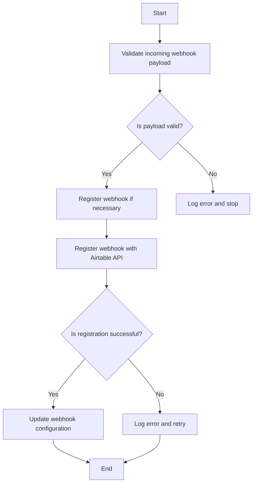
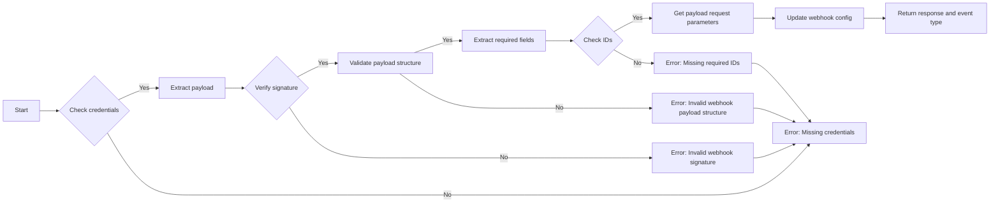
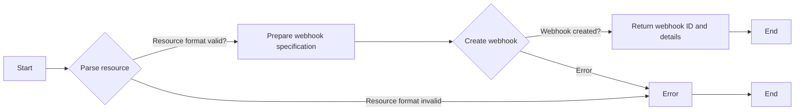
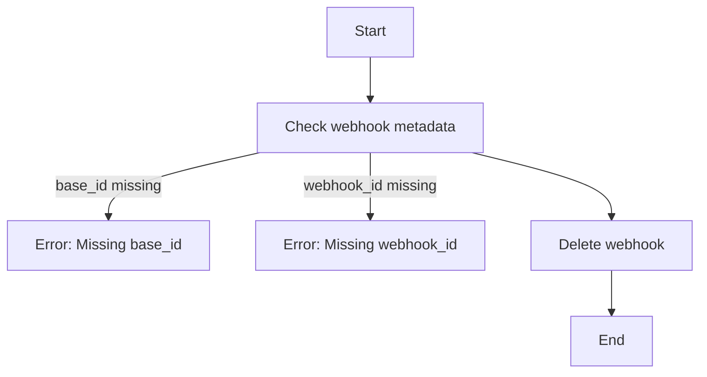
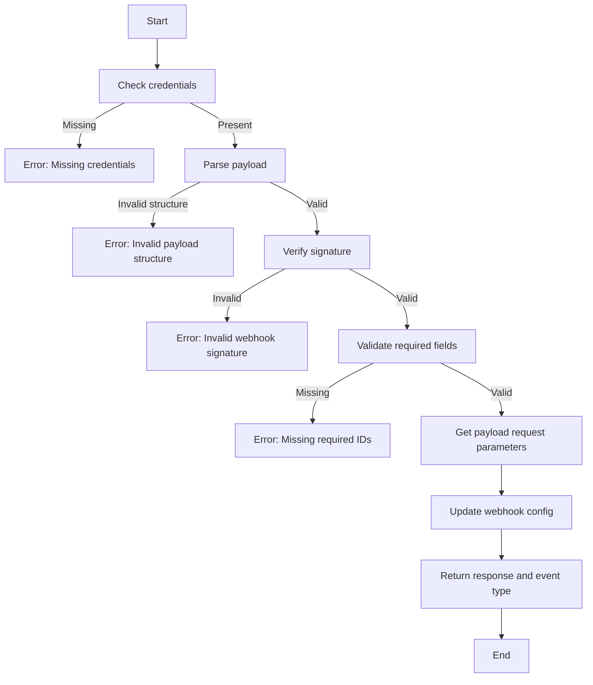
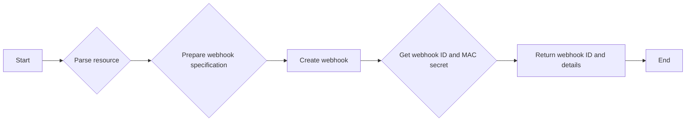

# `.\AutoGPT\autogpt_platform\backend\backend\blocks\airtable\_webhook.py` 详细设计文档

The code manages webhooks for Airtable API, handling validation, registration, and deregistration of webhooks.

## 整体流程



## 类结构

```
AirtableWebhookManager (继承自 BaseWebhooksManager)
├── AirtableWebhookEvent (枚举)
│   ├── TABLE_DATA
│   ├── TABLE_FIELDS
│   └── TABLE_METADATA
└── Webhook (未知类)
```

## 全局变量及字段


### `logger`
    
Logger instance for the module.

类型：`logging.getLogger`
    


### `BaseWebhooksManager`
    
Base class for webhook managers.

类型：`backend.sdk.BaseWebhooksManager`
    


### `Credentials`
    
Credentials for accessing the Airtable API.

类型：`backend.sdk.Credentials`
    


### `ProviderName`
    
Enum representing the provider name.

类型：`backend.sdk.ProviderName`
    


### `Webhook`
    
Webhook object representing an Airtable webhook.

类型：`backend.sdk.Webhook`
    


### `Serializable`
    
Serializable type for Prisma.

类型：`prisma.types.Serializable`
    


### `WebhookFilters`
    
Filters for webhook specifications.

类型：`backend._api.WebhookFilters`
    


### `WebhookSpecification`
    
Specification for creating a webhook.

类型：`backend._api.WebhookSpecification`
    


### `create_webhook`
    
Function to create a webhook.

类型：`backend._api.create_webhook`
    


### `delete_webhook`
    
Function to delete a webhook.

类型：`backend._api.delete_webhook`
    


### `list_webhook_payloads`
    
Function to list webhook payloads.

类型：`backend._api.list_webhook_payloads`
    


### `update_webhook`
    
Function to update a webhook.

类型：`backend._api.update_webhook`
    


### `AirtableWebhookManager.PROVIDER_NAME`
    
Provider name for Airtable webhooks.

类型：`backend.sdk.ProviderName`
    


### `AirtableWebhookManager.AirtableWebhookManager.PROVIDER_NAME`
    
Provider name for Airtable webhooks, set to 'airtable'.

类型：`backend.sdk.ProviderName`
    
    

## 全局函数及方法


### AirtableWebhookManager.validate_payload

Validate incoming webhook payload and signature.

参数：

- `webhook`：`Webhook`，The webhook object containing the webhook configuration and metadata.
- `request`：`Request`，The incoming webhook request object.
- `credentials`：`Credentials | None`，The credentials object for the Airtable API.

返回值：`tuple[dict, str]`，A tuple containing the validated payload as a dictionary and the event type as a string.

#### 流程图



#### 带注释源码

```python
@classmethod
async def validate_payload(cls, webhook: Webhook, request, credentials: Credentials | None) -> tuple[dict, str]:
    """Validate incoming webhook payload and signature."""

    if not credentials:
        raise ValueError("Missing credentials in webhook metadata")

    payload = await request.json()

    # Verify webhook signature using HMAC-SHA256
    if webhook.secret:
        mac_secret = webhook.config.get("mac_secret")
        if mac_secret:
            # Get the raw body for signature verification
            body = await request.body()

            # Calculate expected signature
            mac_secret_decoded = mac_secret.encode()
            hmac_obj = hmac.new(mac_secret_decoded, body, hashlib.sha256)
            expected_mac = f"hmac-sha256={hmac_obj.hexdigest()}"

            # Get signature from headers
            signature = request.headers.get("X-Airtable-Content-MAC")

            if signature and not hmac.compare_digest(signature, expected_mac):
                raise ValueError("Invalid webhook signature")

    # Validate payload structure
    required_fields = ["base", "webhook", "timestamp"]
    if not all(field in payload for field in required_fields):
        raise ValueError("Invalid webhook payload structure")

    if "id" not in payload["base"] or "id" not in payload["webhook"]:
        raise ValueError("Missing required IDs in webhook payload")
    base_id = payload["base"]["id"]
    webhook_id = payload["webhook"]["id"]

    # get payload request parameters
    cursor = webhook.config.get("cursor", 1)

    response = await list_webhook_payloads(credentials, base_id, webhook_id, cursor)

    # update webhook config
    await update_webhook(
        webhook.id,
        config=cast(
            dict[str, Serializable], {"base_id": base_id, "cursor": response.cursor}
        ),
    )

    event_type = "notification"
    return response.model_dump(), event_type
```


### `_register_webhook`

Register webhook with Airtable API.

参数：

- `credentials`：`Credentials`，Webhook credentials for Airtable API.
- `webhook_type`：`str`，Type of webhook to register.
- `resource`：`str`，Resource to which the webhook is registered.
- `events`：`list[str]`，List of events to listen for.
- `ingress_url`：`str`，URL to which Airtable will send notifications.
- `secret`：`str`，Secret used for signing webhook requests.

返回值：`tuple[str, dict]`，A tuple containing the webhook ID and a dictionary with webhook details.

#### 流程图



#### 带注释源码

```python
async def _register_webhook(
    self,
    credentials: Credentials,
    webhook_type: str,
    resource: str,
    events: list[str],
    ingress_url: str,
    secret: str,
) -> tuple[str, dict]:
    """Register webhook with Airtable API."""

    # Parse resource to get base_id and table_id/or_name
    # Resource format: "{base_id}/{table_id_or_name}"
    parts = resource.split("/", 1)
    if len(parts) != 2:
        raise ValueError("Resource must be in format: {base_id}/{table_id_or_name}")

    base_id, table_id_or_name = parts

    # Prepare webhook specification
    webhook_specification = WebhookSpecification(
        filters=WebhookFilters(
            dataTypes=events,
        )
    )

    # Create webhook
    webhook_data = await create_webhook(
        credentials=credentials,
        base_id=base_id,
        webhook_specification=webhook_specification,
        notification_url=ingress_url,
    )

    webhook_id = webhook_data["id"]
    mac_secret = webhook_data.get("macSecretBase64")

    return webhook_id, {
        "webhook_id": webhook_id,
        "base_id": base_id,
        "table_id_or_name": table_id_or_name,
        "events": events,
        "mac_secret": mac_secret,
        "cursor": 1,
        "expiration_time": webhook_data.get("expirationTime"),
    }
```


### `_deregister_webhook`

Deregister a webhook from the Airtable API.

参数：

- `webhook`：`Webhook`，The webhook object containing the metadata of the webhook to be deregistered.
- `credentials`：`Credentials`，The credentials required to interact with the Airtable API.

返回值：`None`，No value is returned as the function is asynchronous and performs an action without returning a result.

#### 流程图



#### 带注释源码

```python
async def _deregister_webhook(self, webhook: Webhook, credentials: Credentials) -> None:
    """Deregister webhook from Airtable API."""

    base_id = webhook.config.get("base_id")
    webhook_id = webhook.config.get("webhook_id")

    if not base_id:
        raise ValueError("Missing base_id in webhook metadata")

    if not webhook_id:
        raise ValueError("Missing webhook_id in webhook metadata")

    await delete_webhook(credentials, base_id, webhook_id)
```


### AirtableWebhookManager.validate_payload

Validate incoming webhook payload and signature.

参数：

- `webhook`：`Webhook`，The webhook object containing the necessary information.
- `request`：`Request`，The incoming webhook request.
- `credentials`：`Credentials | None`，The credentials used for authentication.

返回值：`tuple[dict, str]`，A tuple containing the validated payload as a dictionary and the event type as a string.

#### 流程图



#### 带注释源码

```python
@classmethod
async def validate_payload(cls, webhook: Webhook, request, credentials: Credentials | None) -> tuple[dict, str]:
    """Validate incoming webhook payload and signature."""

    if not credentials:
        raise ValueError("Missing credentials in webhook metadata")

    payload = await request.json()

    # Verify webhook signature using HMAC-SHA256
    if webhook.secret:
        mac_secret = webhook.config.get("mac_secret")
        if mac_secret:
            # Get the raw body for signature verification
            body = await request.body()

            # Calculate expected signature
            mac_secret_decoded = mac_secret.encode()
            hmac_obj = hmac.new(mac_secret_decoded, body, hashlib.sha256)
            expected_mac = f"hmac-sha256={hmac_obj.hexdigest()}"

            # Get signature from headers
            signature = request.headers.get("X-Airtable-Content-MAC")

            if signature and not hmac.compare_digest(signature, expected_mac):
                raise ValueError("Invalid webhook signature")

    # Validate payload structure
    required_fields = ["base", "webhook", "timestamp"]
    if not all(field in payload for field in required_fields):
        raise ValueError("Invalid webhook payload structure")

    if "id" not in payload["base"] or "id" not in payload["webhook"]:
        raise ValueError("Missing required IDs in webhook payload")
    base_id = payload["base"]["id"]
    webhook_id = payload["webhook"]["id"]

    # get payload request parameters
    cursor = webhook.config.get("cursor", 1)

    response = await list_webhook_payloads(credentials, base_id, webhook_id, cursor)

    # update webhook config
    await update_webhook(
        webhook.id,
        config=cast(
            dict[str, Serializable], {"base_id": base_id, "cursor": response.cursor}
        ),
    )

    event_type = "notification"
    return response.model_dump(), event_type
```


### AirtableWebhookManager._register_webhook

Register webhook with Airtable API.

参数：

- `credentials`：`Credentials`，Webhook credentials for Airtable API.
- `webhook_type`：`str`，Type of webhook to register.
- `resource`：`str`，Resource to which the webhook is registered.
- `events`：`list[str]`，List of events to trigger the webhook.
- `ingress_url`：`str`，URL to which the webhook notifications are sent.
- `secret`：`str`，Secret used for signing webhook payloads.

返回值：`tuple[str, dict]`，A tuple containing the webhook ID and a dictionary with webhook details.

#### 流程图



#### 带注释源码

```python
async def _register_webhook(
    self,
    credentials: Credentials,
    webhook_type: str,
    resource: str,
    events: list[str],
    ingress_url: str,
    secret: str,
) -> tuple[str, dict]:
    """Register webhook with Airtable API."""

    # Parse resource to get base_id and table_id/or_name
    # Resource format: "{base_id}/{table_id_or_name}"
    parts = resource.split("/", 1)
    if len(parts) != 2:
        raise ValueError("Resource must be in format: {base_id}/{table_id_or_name}")

    base_id, table_id_or_name = parts

    # Prepare webhook specification
    webhook_specification = WebhookSpecification(
        filters=WebhookFilters(
            dataTypes=events,
        )
    )

    # Create webhook
    webhook_data = await create_webhook(
        credentials=credentials,
        base_id=base_id,
        webhook_specification=webhook_specification,
        notification_url=ingress_url,
    )

    webhook_id = webhook_data["id"]
    mac_secret = webhook_data.get("macSecretBase64")

    return webhook_id, {
        "webhook_id": webhook_id,
        "base_id": base_id,
        "table_id_or_name": table_id_or_name,
        "events": events,
        "mac_secret": mac_secret,
        "cursor": 1,
        "expiration_time": webhook_data.get("expirationTime"),
    }
```


### AirtableWebhookManager._deregister_webhook

Deregister a webhook from the Airtable API.

参数：

- `webhook`：`Webhook`，The webhook object to deregister.
- `credentials`：`Credentials`，The credentials used to interact with the Airtable API.

返回值：`None`，No return value.

#### 流程图


#### 带注释源码

```python
async def _deregister_webhook(self, webhook: Webhook, credentials: Credentials) -> None:
    """Deregister webhook from Airtable API."""

    base_id = webhook.config.get("base_id")
    webhook_id = webhook.config.get("webhook_id")

    if not base_id:
        raise ValueError("Missing base_id in webhook metadata")

    if not webhook_id:
        raise ValueError("Missing webhook_id in webhook metadata")

    await delete_webhook(credentials, base_id, webhook_id)
``` 


## 关键组件


### 张量索引与惰性加载

用于在处理Airtable webhook数据时，延迟加载和索引数据，以提高性能和资源利用率。

### 反量化支持

提供对量化策略的支持，允许在处理Airtable webhook数据时应用量化技术，以优化数据处理过程。

### 量化策略

实现量化策略，用于在处理Airtable webhook数据时，对数据进行量化处理，以减少内存使用和提高处理速度。


## 问题及建议


### 已知问题

-   **代码重复**: `validate_payload` 和 `_register_webhook` 方法中都有对资源格式的解析逻辑，这部分代码可以提取为公共方法以减少重复。
-   **异常处理**: 代码中存在多个 `raise ValueError` 调用，但没有提供具体的错误信息，这可能会使得调试和错误处理变得困难。
-   **日志记录**: 代码中没有使用日志记录来记录重要的操作和异常，这可能会影响问题的追踪和调试。
-   **类型注解**: 代码中使用了 `Serializable` 类型注解，但没有提供该类型的定义，这可能会影响代码的可读性和可维护性。

### 优化建议

-   **提取公共方法**: 将资源解析逻辑提取为公共方法，减少代码重复。
-   **增强异常信息**: 在抛出异常时提供更详细的错误信息，以便于调试和错误处理。
-   **添加日志记录**: 在关键操作和异常处理中添加日志记录，以便于问题的追踪和调试。
-   **定义类型注解**: 提供对 `Serializable` 类型注解的定义，提高代码的可读性和可维护性。
-   **异步操作管理**: 考虑使用异步上下文管理器（`async with`）来管理异步资源，例如数据库连接，以避免潜在的泄漏问题。
-   **代码测试**: 增加单元测试来验证代码的功能和异常处理，确保代码的稳定性和可靠性。


## 其它


### 设计目标与约束

- 设计目标：
  - 提供一个易于使用的接口来管理Airtable的webhook。
  - 确保webhook的安全性和可靠性。
  - 支持多种事件类型和资源。
  - 与Airtable API兼容。
- 约束：
  - 必须使用Airtable提供的API进行操作。
  - 必须处理和验证webhook签名。
  - 必须处理异常和错误情况。

### 错误处理与异常设计

- 错误处理：
  - 使用异常来处理错误情况，如无效的webhook签名、无效的webhook结构、缺失的配置信息等。
  - 异常信息应提供足够的信息以便于调试和修复。
- 异常设计：
  - `ValueError`：用于处理无效的输入和配置错误。
  - `Exception`：用于处理其他未预料的错误。

### 数据流与状态机

- 数据流：
  - 用户通过API发送请求来注册或注销webhook。
  - 系统验证请求并调用相应的函数来处理。
  - 系统与Airtable API交互以创建、更新或删除webhook。
- 状态机：
  - Webhook可以处于以下状态：未注册、已注册、已注销。
  - 状态转换：未注册 -> 已注册，已注册 -> 已注销。

### 外部依赖与接口契约

- 外部依赖：
  - Airtable API：用于创建、更新和删除webhook。
  - Prisma：用于数据库操作。
- 接口契约：
  - `BaseWebhooksManager`：定义了webhook管理的基本接口。
  - `Credentials`：用于存储和验证用户凭据。
  - `Webhook`：表示Airtable webhook的模型。
  - `WebhookFilters`：用于定义webhook的过滤器。
  - `WebhookSpecification`：用于定义webhook的规格。

    