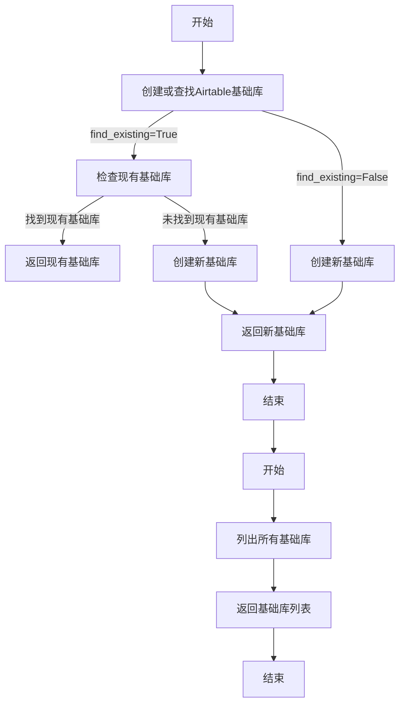
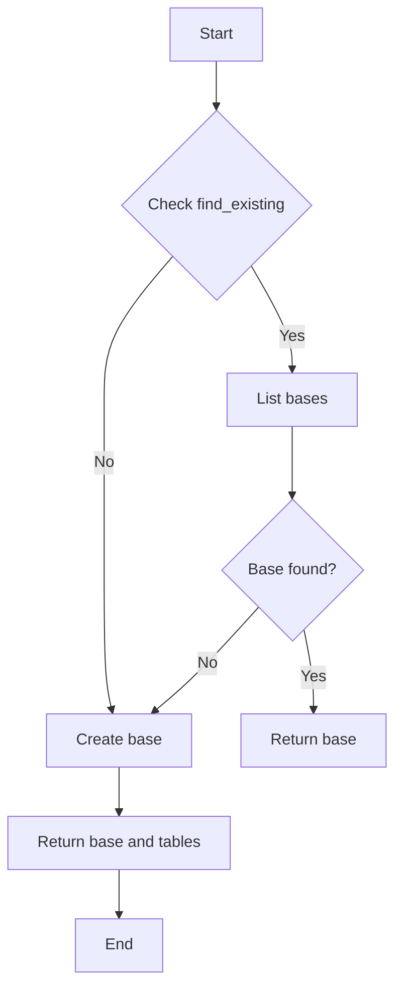
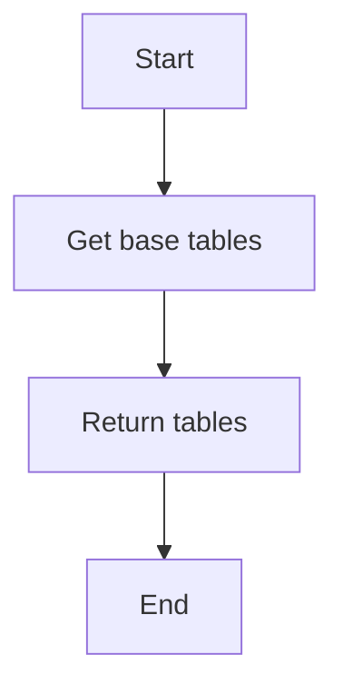
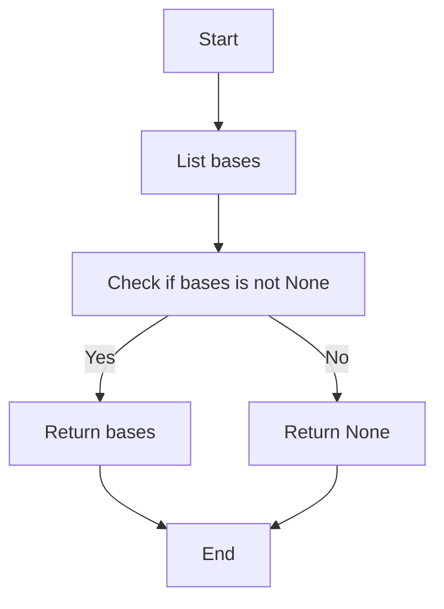
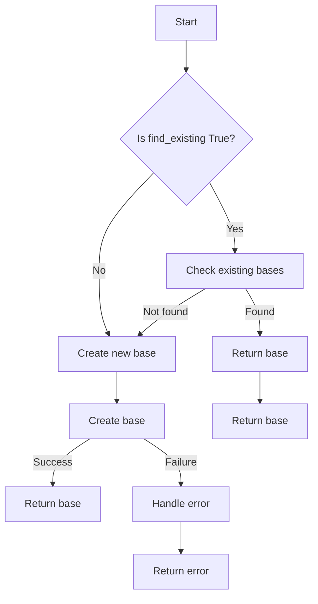
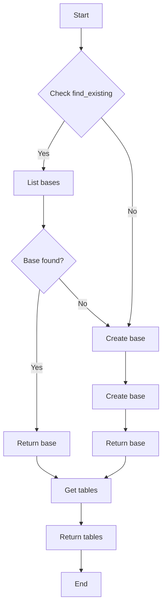

# `.\AutoGPT\autogpt_platform\backend\backend\blocks\airtable\bases.py` 详细设计文档

This code provides functionality to create or list bases in an Airtable workspace using Airtable API.

## 整体流程



## 类结构

```
AirtableCreateBaseBlock (创建或查找Airtable基础库)
├── Input (输入)
│   ├── credentials (Airtable API凭证)
│   ├── workspace_id (工作区ID)
│   ├── name (基础库名称)
│   ├── find_existing (是否查找现有基础库)
│   └── tables (表数组)
└── Output (输出)
    ├── base_id (基础库ID)
    ├── tables (表数组)
    └── was_created (是否创建新基础库)
```

## 全局变量及字段


### `id`
    
Unique identifier for the block

类型：`str`
    


### `description`
    
Description of the block's functionality

类型：`str`
    


### `categories`
    
Categories that the block belongs to

类型：`set[str]`
    


### `input_schema`
    
Schema for the block's input

类型：`BlockSchemaInput`
    


### `output_schema`
    
Schema for the block's output

类型：`BlockSchemaOutput`
    


### `Input.credentials`
    
Airtable API credentials

类型：`CredentialsMetaInput`
    


### `Input.workspace_id`
    
The workspace ID where the base will be created

类型：`str`
    


### `Input.name`
    
The name of the new base

类型：`str`
    


### `Input.find_existing`
    
If true, return existing base with same name instead of creating duplicate

类型：`bool`
    


### `Input.tables`
    
Array of table objects to create in the base

类型：`list[dict]`
    


### `Output.base_id`
    
The ID of the created or found base

类型：`str`
    


### `Output.tables`
    
Array of table objects

类型：`list[dict]`
    


### `Output.was_created`
    
True if a new base was created, False if existing was found

类型：`bool`
    
    

## 全局函数及方法


### `AirtableCreateBaseBlock.run`

This method creates a new base in an Airtable workspace or returns an existing base if one with the same name exists.

参数：

- `input_data`：`Input`，The input data for the block, containing the workspace ID, base name, and other parameters.
- `credentials`：`APIKeyCredentials`，The Airtable API credentials for authentication.
- `**kwargs`：Additional keyword arguments, not used in this method.

返回值：`BlockOutput`，The output data from the block, containing the base ID, tables, and whether a new base was created.

#### 流程图



#### 带注释源码

```python
async def run(self, input_data: Input, *, credentials: APIKeyCredentials, **kwargs) -> BlockOutput:
    # If find_existing is true, check if a base with this name already exists
    if input_data.find_existing:
        # List all bases to check for existing one with same name
        existing_bases = await list_bases(credentials)

        for base in existing_bases.get("bases", []):
            if base.get("name") == input_data.name:
                # Base already exists, return it
                base_id = base.get("id")
                yield "base_id", base_id
                yield "was_created", False

                # Get the tables for this base
                try:
                    tables = await get_base_tables(credentials, base_id)
                    yield "tables", tables
                    for table in tables:
                        yield "table", table
                except Exception:
                    # If we can't get tables, return empty list
                    yield "tables", []
                return

    # No existing base found or find_existing is false, create new one
    data = await create_base(
        credentials,
        input_data.workspace_id,
        input_data.name,
        input_data.tables,
    )

    yield "base_id", data.get("id", None)
    yield "was_created", True
    yield "tables", data.get("tables", [])
    for table in data.get("tables", []):
        yield "table", table
```


### get_base_tables

获取指定Airtable基础库中的所有表。

参数：

- `credentials`：`APIKeyCredentials`，Airtable API凭证
- `base_id`：`str`，指定基础库的ID

返回值：`list[dict]`，包含所有表的列表

#### 流程图



#### 带注释源码

```python
# 从 backend.sdk 模块导入必要的类和函数
from backend.sdk import APIKeyCredentials

# get_base_tables 函数定义
async def get_base_tables(credentials: APIKeyCredentials, base_id: str) -> list[dict]:
    # TODO: 实现获取基础库中所有表的逻辑
    pass
```


### list_bases

Lists all bases in an Airtable workspace that the user has access to.

参数：

- `credentials`：`APIKeyCredentials`，Airtable API credentials
- `offset`：`Optional[str]`，Pagination offset from previous request

返回值：`Optional[dict]`，Array of base objects

#### 流程图



#### 带注释源码

```python
async def list_bases(credentials: APIKeyCredentials, offset: Optional[str] = None) -> Optional[dict]:
    # List all bases to check for existing one with same name
    # Note: Airtable API doesn't have a direct search, so we need to list and filter
    data = await self._api.list_bases(credentials, offset=offset)
    return data
``` 


### AirtableCreateBaseBlock.__init__

This method initializes the AirtableCreateBaseBlock class, setting up its schema and metadata.

参数：

- `self`：`AirtableCreateBaseBlock` 类的实例，用于初始化当前对象。

返回值：无

#### 流程图



#### 带注释源码

```python
def __init__(self):
    super().__init__(
        id="f59b88a8-54ce-4676-a508-fd614b4e8dce",
        description="Create or find a base in Airtable",
        categories={BlockCategory.DATA},
        input_schema=self.Input,
        output_schema=self.Output,
    )
```


### AirtableCreateBaseBlock.run

This method creates a new base in an Airtable workspace or returns an existing base if one with the same name exists.

参数：

- `input_data`：`Input`，The input data for the block, including credentials, workspace ID, base name, and other options.
- `credentials`：`APIKeyCredentials`，The Airtable API credentials used to authenticate requests.
- `**kwargs`：Optional additional keyword arguments.

返回值：`BlockOutput`，The output data from the block, including the base ID, tables, and whether a new base was created.

#### 流程图



#### 带注释源码

```python
async def run(self, input_data: Input, *, credentials: APIKeyCredentials, **kwargs) -> BlockOutput:
    # If find_existing is true, check if a base with this name already exists
    if input_data.find_existing:
        # List all bases to check for existing one with same name
        existing_bases = await list_bases(credentials)

        for base in existing_bases.get("bases", []):
            if base.get("name") == input_data.name:
                # Base already exists, return it
                base_id = base.get("id")
                yield "base_id", base_id
                yield "was_created", False

                # Get the tables for this base
                try:
                    tables = await get_base_tables(credentials, base_id)
                    yield "tables", tables
                    for table in tables:
                        yield "table", table
                except Exception:
                    # If we can't get tables, return empty list
                    yield "tables", []
                return

    # No existing base found or find_existing is false, create new one
    data = await create_base(
        credentials,
        input_data.workspace_id,
        input_data.name,
        input_data.tables,
    )

    yield "base_id", data.get("id", None)
    yield "was_created", True
    yield "tables", data.get("tables", [])
    for table in data.get("tables", []):
        yield "table", table
```


## 关键组件


### 张量索引与惰性加载

张量索引与惰性加载是代码中用于高效处理和访问数据结构的关键组件，它允许在数据量较大时延迟加载数据，从而优化内存使用和提升性能。

### 反量化支持

反量化支持是代码中用于处理和转换数据的关键组件，它能够将量化数据转换为原始数据，以便进行进一步的处理和分析。

### 量化策略

量化策略是代码中用于优化数据表示和存储的关键组件，它通过减少数据精度来降低内存占用，同时保持数据的可用性和准确性。

## 问题及建议


### 已知问题

-   **API效率问题**：代码中在查找现有基础时，需要列出所有基础并过滤出具有相同名称的基础。如果基础数量非常多，这个过程可能会非常耗时，并且效率低下。
-   **异常处理**：在获取基础表格时，如果发生异常，代码会捕获异常并返回空列表。这可能隐藏了潜在的错误，建议提供更详细的错误信息。
-   **代码重复**：`AirtableCreateBaseBlock` 和 `AirtableListBasesBlock` 类中都有获取基础列表的逻辑，这可能导致代码重复和维护困难。

### 优化建议

-   **优化基础查找**：考虑使用缓存机制来存储已查找的基础信息，以减少对API的调用次数。如果基础列表不经常变化，这可以显著提高效率。
-   **改进异常处理**：在捕获异常时，应该记录详细的错误信息，以便于调试和问题追踪。可以考虑使用日志记录或错误报告系统。
-   **减少代码重复**：将获取基础列表的逻辑提取到一个单独的函数中，然后在两个类中重用该函数，以减少代码重复并提高可维护性。
-   **参数验证**：在`run`方法中，应该对输入数据进行验证，确保它们符合预期的格式和类型，以避免潜在的错误。
-   **文档和注释**：增加对代码的文档和注释，以便其他开发者更容易理解代码的功能和逻辑。


## 其它


### 设计目标与约束

- 设计目标：
  - 提供创建和列出Airtable工作空间中基础的功能。
  - 确保API调用高效且安全。
  - 提供清晰的输入和输出格式，便于集成和使用。

- 约束：
  - 必须使用Airtable官方API进行操作。
  - 输入数据必须符合Airtable API的要求。
  - 输出数据格式必须符合Block输出规范。

### 错误处理与异常设计

- 错误处理：
  - 在API调用失败时，捕获异常并返回错误信息。
  - 对于不合法的输入数据，返回相应的错误信息。

- 异常设计：
  - 使用try-except块捕获API调用中可能发生的异常。
  - 定义自定义异常类，以便于错误信息的传递和处理。

### 数据流与状态机

- 数据流：
  - 输入数据通过API调用传递到Airtable。
  - 输出数据通过API调用返回给调用者。

- 状态机：
  - 无状态机设计，操作为同步执行。

### 外部依赖与接口契约

- 外部依赖：
  - Airtable API SDK。

- 接口契约：
  - 输入输出格式遵循Block规范。
  - API调用遵循Airtable API规范。


    