# `.\AutoGPT\autogpt_platform\backend\backend\blocks\airtable\records.py` 详细设计文档

This code provides a set of blocks for interacting with Airtable records, including listing, getting, creating, updating, and deleting records.

## 整体流程

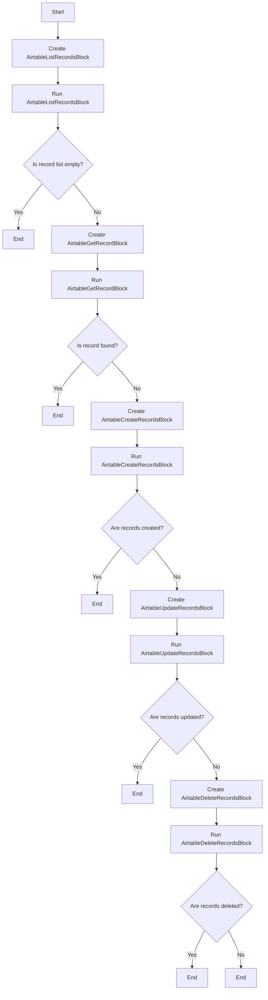

## 类结构

```
AirtableListRecordsBlock
├── Input
│   ├── credentials
│   ├── base_id
│   ├── table_id_or_name
│   ├── filter_formula
│   ├── view
│   ├── sort
│   ├── max_records
│   ├── page_size
│   ├── offset
│   ├── return_fields
│   └── normalize_output
│   └── include_field_metadata
└── Output
    ├── records
    ├── offset
    └── field_metadata
```

## 全局变量及字段


### `id`
    
Unique identifier for the block

类型：`str`
    


### `description`
    
Description of the block's functionality

类型：`str`
    


### `categories`
    
Set of categories the block belongs to

类型：`set[str]`
    


### `input_schema`
    
Input schema for the block

类型：`BlockSchemaInput`
    


### `output_schema`
    
Output schema for the block

类型：`BlockSchemaOutput`
    


### `AirtableListRecordsBlock.id`
    
Unique identifier for the AirtableListRecordsBlock

类型：`str`
    


### `AirtableListRecordsBlock.description`
    
Description of the AirtableListRecordsBlock's functionality

类型：`str`
    


### `AirtableListRecordsBlock.categories`
    
Set of categories the AirtableListRecordsBlock belongs to

类型：`set[str]`
    


### `AirtableListRecordsBlock.input_schema`
    
Input schema for the AirtableListRecordsBlock

类型：`BlockSchemaInput`
    


### `AirtableListRecordsBlock.output_schema`
    
Output schema for the AirtableListRecordsBlock

类型：`BlockSchemaOutput`
    


### `AirtableGetRecordBlock.id`
    
Unique identifier for the AirtableGetRecordBlock

类型：`str`
    


### `AirtableGetRecordBlock.description`
    
Description of the AirtableGetRecordBlock's functionality

类型：`str`
    


### `AirtableGetRecordBlock.categories`
    
Set of categories the AirtableGetRecordBlock belongs to

类型：`set[str]`
    


### `AirtableGetRecordBlock.input_schema`
    
Input schema for the AirtableGetRecordBlock

类型：`BlockSchemaInput`
    


### `AirtableGetRecordBlock.output_schema`
    
Output schema for the AirtableGetRecordBlock

类型：`BlockSchemaOutput`
    


### `AirtableCreateRecordsBlock.id`
    
Unique identifier for the AirtableCreateRecordsBlock

类型：`str`
    


### `AirtableCreateRecordsBlock.description`
    
Description of the AirtableCreateRecordsBlock's functionality

类型：`str`
    


### `AirtableCreateRecordsBlock.categories`
    
Set of categories the AirtableCreateRecordsBlock belongs to

类型：`set[str]`
    


### `AirtableCreateRecordsBlock.input_schema`
    
Input schema for the AirtableCreateRecordsBlock

类型：`BlockSchemaInput`
    


### `AirtableCreateRecordsBlock.output_schema`
    
Output schema for the AirtableCreateRecordsBlock

类型：`BlockSchemaOutput`
    


### `AirtableUpdateRecordsBlock.id`
    
Unique identifier for the AirtableUpdateRecordsBlock

类型：`str`
    


### `AirtableUpdateRecordsBlock.description`
    
Description of the AirtableUpdateRecordsBlock's functionality

类型：`str`
    


### `AirtableUpdateRecordsBlock.categories`
    
Set of categories the AirtableUpdateRecordsBlock belongs to

类型：`set[str]`
    


### `AirtableUpdateRecordsBlock.input_schema`
    
Input schema for the AirtableUpdateRecordsBlock

类型：`BlockSchemaInput`
    


### `AirtableUpdateRecordsBlock.output_schema`
    
Output schema for the AirtableUpdateRecordsBlock

类型：`BlockSchemaOutput`
    


### `AirtableDeleteRecordsBlock.id`
    
Unique identifier for the AirtableDeleteRecordsBlock

类型：`str`
    


### `AirtableDeleteRecordsBlock.description`
    
Description of the AirtableDeleteRecordsBlock's functionality

类型：`str`
    


### `AirtableDeleteRecordsBlock.categories`
    
Set of categories the AirtableDeleteRecordsBlock belongs to

类型：`set[str]`
    


### `AirtableDeleteRecordsBlock.input_schema`
    
Input schema for the AirtableDeleteRecordsBlock

类型：`BlockSchemaInput`
    


### `AirtableDeleteRecordsBlock.output_schema`
    
Output schema for the AirtableDeleteRecordsBlock

类型：`BlockSchemaOutput`
    
    

## 全局函数及方法


### `create_record`

Creates one or more records in an Airtable table.

参数：

- `credentials`：`APIKeyCredentials`，Airtable API credentials
- `base_id`：`str`，The Airtable base ID
- `table_id_or_name`：`str`，Table ID or name
- `records`：`list[dict]`，Array of records to create (each with 'fields' object)
- `typecast`：`Optional[bool]`，Automatically convert string values to appropriate types
- `return_fields_by_field_id`：`Optional[bool]`，Return fields by field ID

返回值：`list[dict]`，Array of created record objects

#### 流程图

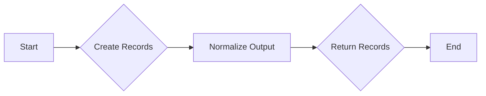

#### 带注释源码

```python
async def create_record(
    credentials: APIKeyCredentials,
    base_id: str,
    table_id_or_name: str,
    records: list[dict],
    typecast: Optional[bool] = None,
    return_fields_by_field_id: Optional[bool] = None,
) -> list[dict]:
    data = await _api.create_record(
        credentials,
        base_id,
        table_id_or_name,
        records=[{"fields": record} for record in records],
        typecast=typecast,
        return_fields_by_field_id=return_fields_by_field_id,
    )
    result_records = cast(list[dict], data.get("records", []))
    return result_records
```


### delete_multiple_records

Deletes one or more records from an Airtable table.

参数：

- `credentials`：`APIKeyCredentials`，Airtable API credentials
- `base_id`：`str`，The Airtable base ID
- `table_id_or_name`：`str`，Table ID or name - It's better to use the table ID instead of the name
- `record_ids`：`list[str]`，Array of upto 10 record IDs to delete

返回值：`list[dict]`，Array of deletion results

#### 流程图

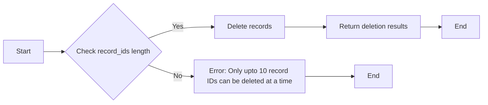

#### 带注释源码

```python
async def delete_multiple_records(
    credentials: APIKeyCredentials,
    base_id: str,
    table_id_or_name: str,
    record_ids: list[str],
) -> list[dict]:
    if len(record_ids) > 10:
        yield "error", "Only upto 10 record IDs can be deleted at a time"
    else:
        data = await delete_records(
            credentials,
            base_id,
            table_id_or_name,
            record_ids,
        )
        yield "records", data.get("records", [])
```


### AirtableGetRecordBlock.get_record

Retrieves a single record from an Airtable table by its ID.

参数：

- `credentials`：`APIKeyCredentials`，Airtable API credentials
- `base_id`：`str`，The Airtable base ID
- `table_id_or_name`：`str`，Table ID or name
- `record_id`：`str`，The record ID to retrieve

返回值：`dict`，The retrieved record

#### 流程图

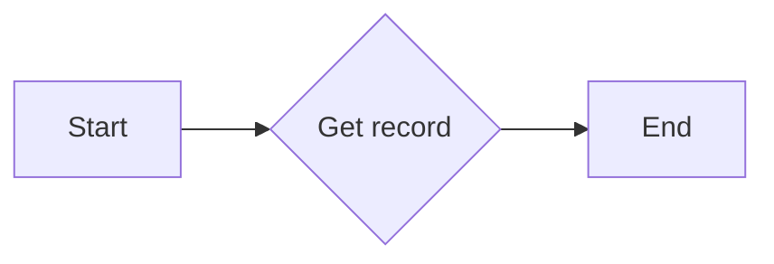

#### 带注释源码

```python
async def get_record(
    credentials: APIKeyCredentials,
    base_id: str,
    table_id_or_name: str,
    record_id: str,
) -> dict:
    # Implementation of the get_record function
    # ...
```


### `get_table_schema`

Retrieves the schema of a table in Airtable.

参数：

- `credentials`：`APIKeyCredentials`，Airtable API credentials
- `base_id`：`str`，The Airtable base ID
- `table_id_or_name`：`str`，Table ID or name

返回值：`Optional[dict]`，The schema of the table

#### 流程图

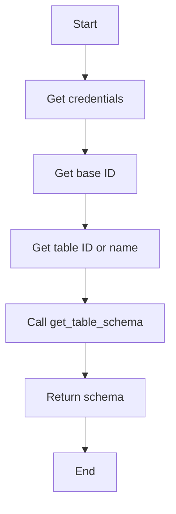

#### 带注释源码

```python
# from backend.sdk import APIKeyCredentials, Block, BlockCategory, BlockOutput, BlockSchemaInput, BlockSchemaOutput, CredentialsMetaInput, SchemaField

from ._api import get_table_schema

async def get_table_schema(credentials: APIKeyCredentials, base_id: str, table_id_or_name: str) -> Optional[dict]:
    # Implementation of the get_table_schema function
    # ...
    pass
```


### list_records

Retrieves records from an Airtable table with optional filtering, sorting, and pagination.

参数：

- `credentials`：`APIKeyCredentials`，Airtable API credentials
- `base_id`：`str`，The Airtable base ID
- `table_id_or_name`：`str`，Table ID or name
- `filter_by_formula`：`Optional[str]`，Airtable formula to filter records
- `view`：`Optional[str]`，View ID or name to use
- `sort`：`Optional[list[dict]]`，Sort configuration (array of {field, direction})
- `max_records`：`Optional[int]`，Maximum number of records to return
- `page_size`：`Optional[int]`，Number of records per page (max 100)
- `offset`：`Optional[str]`，Pagination offset from previous request
- `fields`：`Optional[list[str]]`，Specific fields to return (comma-separated)

返回值：`BlockOutput`，Array of record objects

#### 流程图

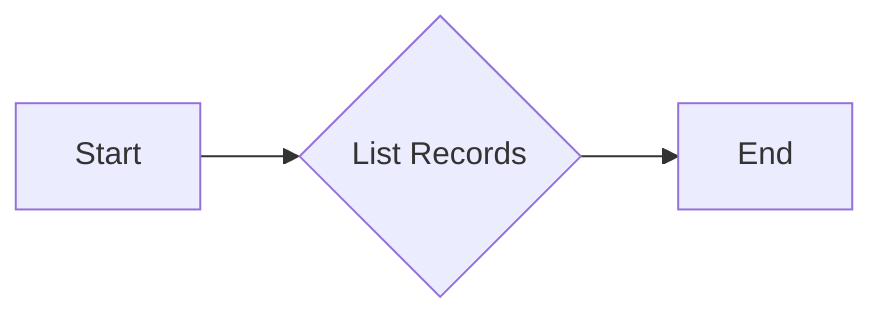

#### 带注释源码

```python
async def list_records(
    credentials: APIKeyCredentials,
    base_id: str,
    table_id_or_name: str,
    filter_by_formula: Optional[str] = None,
    view: Optional[str] = None,
    sort: Optional[list[dict]] = None,
    max_records: Optional[int] = None,
    page_size: Optional[int] = None,
    offset: Optional[str] = None,
    fields: Optional[list[str]] = None,
) -> BlockOutput:
    # Implementation of the list_records function
    pass
```


### normalize_records

Normalize records based on the provided table schema.

参数：

- `records`：`list[dict]`，The records to normalize.
- `table_schema`：`dict`，The schema of the table to use for normalization.
- `include_field_metadata`：`bool`，Whether to include field metadata in the normalized records.

返回值：`dict`，The normalized records.

#### 流程图

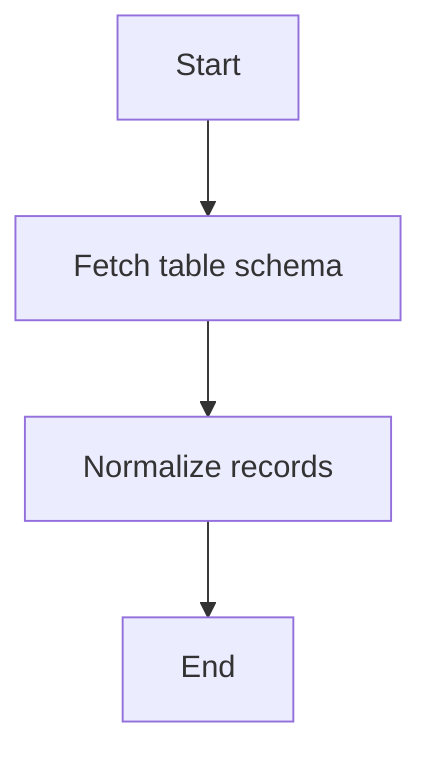

#### 带注释源码

```python
async def normalize_records(
    records: list[dict], table_schema: dict, include_field_metadata: bool = False
) -> dict:
    # Normalize the records based on the provided table schema
    normalized_data = []
    for record in records:
        normalized_record = {}
        for field_name, field_info in table_schema.items():
            field_value = record.get(field_name, None)
            if field_info["type"] == "string":
                normalized_record[field_name] = str(field_value)
            elif field_info["type"] == "number":
                normalized_record[field_name] = float(field_value)
            elif field_info["type"] == "boolean":
                normalized_record[field_name] = field_value in [True, "true", 1]
            elif field_info["type"] == "datetime":
                normalized_record[field_name] = field_value
            else:
                normalized_record[field_name] = field_value
        if include_field_metadata:
            normalized_record["field_metadata"] = field_info
        normalized_data.append(normalized_record)
    return {"records": normalized_data}
```


### update_multiple_records

Updates one or more existing records in an Airtable table.

参数：

- `credentials`：`APIKeyCredentials`，Airtable API credentials
- `base_id`：`str`，The Airtable base ID
- `table_id_or_name`：`str`，Table ID or name - It's better to use the table ID instead of the name
- `records`：`list[dict]`，Array of records to update (each with 'id' and 'fields')
- `typecast`：`bool | None`，Automatically convert string values to appropriate types (default is None)

返回值：`list[dict]`，Array of updated record objects

#### 流程图

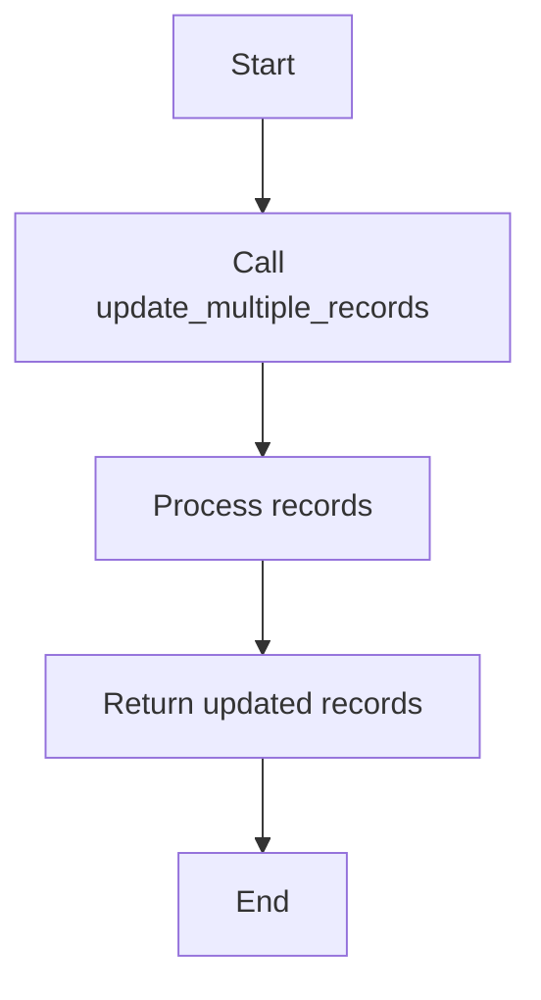

#### 带注释源码

```python
async def update_multiple_records(
    credentials: APIKeyCredentials,
    base_id: str,
    table_id_or_name: str,
    records: list[dict],
    typecast: bool | None = None,
    return_fields_by_field_id: bool = False,  # Use field names, not IDs
) -> list[dict]:
    # The update_multiple_records API expects records with id and fields
    data = await update_records(
        credentials,
        base_id,
        table_id_or_name,
        records,
        typecast=typecast if typecast else None,
        return_fields_by_field_id=return_fields_by_field_id,
    )
    return data.get("records", [])
```


### AirtableListRecordsBlock.__init__

This method initializes the AirtableListRecordsBlock class, setting up its schema and metadata.

参数：

- `credentials`：`CredentialsMetaInput`，Airtable API credentials
- `description`：`str`，A description of the block's functionality
- `categories`：`set`，A set of categories the block belongs to
- `input_schema`：`BlockSchemaInput`，The input schema for the block
- `output_schema`：`BlockSchemaOutput`，The output schema for the block

返回值：无

#### 流程图

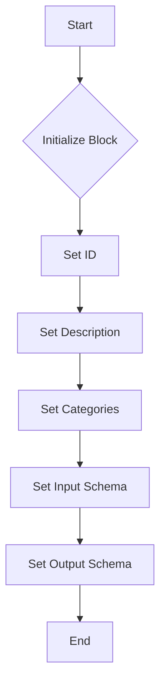

#### 带注释源码

```python
def __init__(self):
    super().__init__(
        id="588a9fde-5733-4da7-b03c-35f5671e960f",
        description="List records from an Airtable table",
        categories={BlockCategory.DATA},
        input_schema=self.Input,
        output_schema=self.Output,
    )
```


### AirtableListRecordsBlock.run

Lists records from an Airtable table with optional filtering, sorting, and pagination.

参数：

- `input_data`：`Input`，The input data for the block.
- `credentials`：`APIKeyCredentials`，Airtable API credentials.
- `**kwargs`：`Any`，Additional keyword arguments.

返回值：`BlockOutput`，The output of the block.

#### 流程图

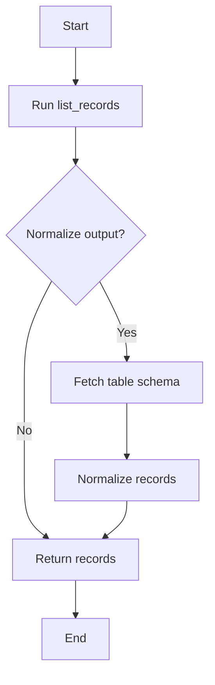

#### 带注释源码

```python
async def run(self, input_data: Input, *, credentials: APIKeyCredentials, **kwargs) -> BlockOutput:
    data = await list_records(
        credentials,
        input_data.base_id,
        input_data.table_id_or_name,
        filter_by_formula=(
            input_data.filter_formula if input_data.filter_formula else None
        ),
        view=input_data.view if input_data.view else None,
        sort=input_data.sort if input_data.sort else None,
        max_records=input_data.max_records if input_data.max_records else None,
        page_size=min(input_data.page_size, 100) if input_data.page_size else None,
        offset=input_data.offset if input_data.offset else None,
        fields=input_data.return_fields if input_data.return_fields else None,
    )

    records = data.get("records", [])

    # Normalize output if requested
    if input_data.normalize_output:
        # Fetch table schema
        table_schema = await get_table_schema(
            credentials, input_data.base_id, input_data.table_id_or_name
        )

        # Normalize the records
        normalized_data = await normalize_records(
            records,
            table_schema,
            include_field_metadata=input_data.include_field_metadata,
        )

        yield "records", normalized_data["records"]
        yield "offset", data.get("offset", None)

        if (
            input_data.include_field_metadata
            and "field_metadata" in normalized_data
        ):
            yield "field_metadata", normalized_data["field_metadata"]
    else:
        yield "records", records
        yield "offset", data.get("offset", None)
```


### AirtableGetRecordBlock.__init__

This method initializes the AirtableGetRecordBlock class, setting up its metadata and schema for interacting with Airtable records.

参数：

- `self`：`None`，The instance of the class being initialized.
- `id`：`str`，The unique identifier for the block.
- `description`：`str`，A brief description of the block's functionality.
- `categories`：`set`，A set of categories that the block belongs to.
- `input_schema`：`BlockSchemaInput`，The schema for the input data of the block.
- `output_schema`：`BlockSchemaOutput`，The schema for the output data of the block.

返回值：`None`，No return value is specified as the method is used for initialization purposes.

#### 流程图

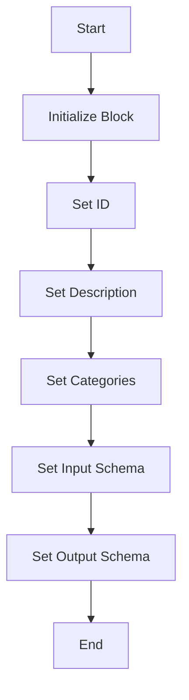

#### 带注释源码

```python
def __init__(self):
    super().__init__(
        id="c29c5cbf-0aff-40f9-bbb5-f26061792d2b",
        description="Get a single record from Airtable",
        categories={BlockCategory.DATA},
        input_schema=self.Input,
        output_schema=self.Output,
    )
```


### AirtableGetRecordBlock.run

Retrieves a single record from an Airtable table by its ID.

参数：

- `input_data`：`Input`，The input data for the block.
- `credentials`：`APIKeyCredentials`，Airtable API credentials.

返回值：`BlockOutput`，The output of the block.

#### 流程图

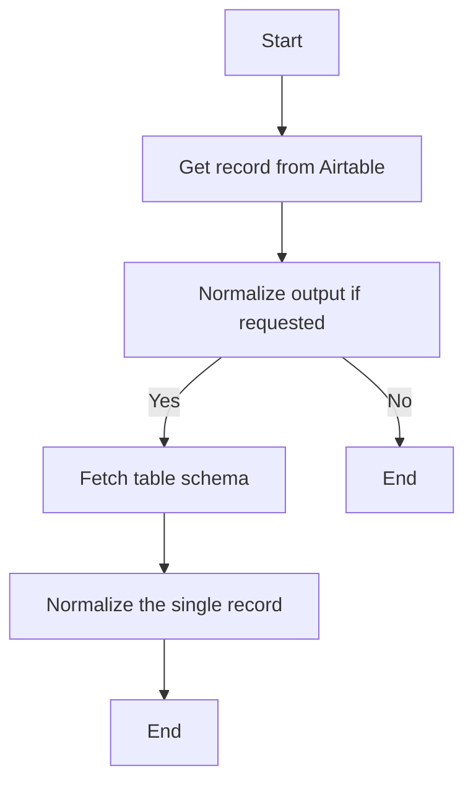

#### 带注释源码

```python
async def run(self, input_data: Input, *, credentials: APIKeyCredentials, **kwargs) -> BlockOutput:
    record = await get_record(
        credentials,
        input_data.base_id,
        input_data.table_id_or_name,
        input_data.record_id,
    )

    # Normalize output if requested
    if input_data.normalize_output:
        # Fetch table schema
        table_schema = await get_table_schema(
            credentials, input_data.base_id, input_data.table_id_or_name
        )

        # Normalize the single record (wrap in list and unwrap result)
        normalized_data = await normalize_records(
            [record],
            table_schema,
            include_field_metadata=input_data.include_field_metadata,
        )

        normalized_record = normalized_data["records"][0]
        yield "id", normalized_record.get("id", None)
        yield "fields", normalized_record.get("fields", None)
        yield "created_time", normalized_record.get("createdTime", None)

        if (
            input_data.include_field_metadata
            and "field_metadata" in normalized_data
        ):
            yield "field_metadata", normalized_data["field_metadata"]
    else:
        yield "id", record.get("id", None)
        yield "fields", record.get("fields", None)
        yield "created_time", record.get("createdTime", None)
```


### AirtableCreateRecordsBlock.__init__

This method initializes the AirtableCreateRecordsBlock class, setting up its schema and metadata.

参数：

- `self`：`AirtableCreateRecordsBlock` 类的实例

返回值：无

#### 流程图

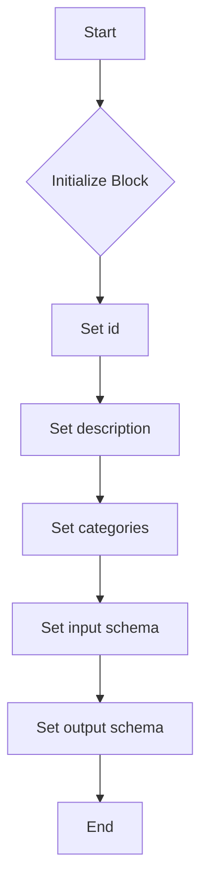

#### 带注释源码

```python
def __init__(self):
    super().__init__(
        id="42527e98-47b6-44ce-ac0e-86b4883721d3",
        description="Create records in an Airtable table",
        categories={BlockCategory.DATA},
        input_schema=self.Input,
        output_schema=self.Output,
    )
```


### AirtableCreateRecordsBlock.run

Creates one or more records in an Airtable table.

参数：

- `input_data`：`Input`，The input data for the block.
- `credentials`：`APIKeyCredentials`，Airtable API credentials.
- `kwargs`：`Any`，Additional keyword arguments.

返回值：`BlockOutput`，The output of the block.

#### 流程图

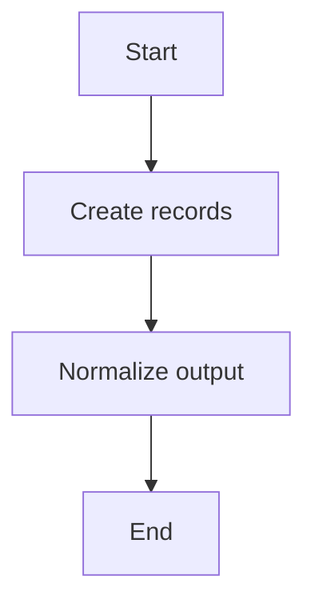

#### 带注释源码

```python
async def run(self, input_data: Input, *, credentials: APIKeyCredentials, **kwargs) -> BlockOutput:
    data = await create_record(
        credentials,
        input_data.base_id,
        input_data.table_id_or_name,
        records=[{"fields": record} for record in input_data.records],
        typecast=input_data.typecast if input_data.typecast else None,
        return_fields_by_field_id=input_data.return_fields_by_field_id,
    )
    result_records = cast(list[dict], data.get("records", []))

    # Normalize output unless explicitly disabled
    if not input_data.skip_normalization and result_records:
        # Fetch table schema
        table_schema = await get_table_schema(
            credentials, input_data.base_id, input_data.table_id_or_name
        )

        # Normalize the records
        normalized_data = await normalize_records(
            result_records, table_schema, include_field_metadata=False
        )
        result_records = normalized_data["records"]

    yield "records", result_records
    details = data.get("details", None)
    if details:
        yield "details", details
```


### AirtableUpdateRecordsBlock.__init__

This method initializes the AirtableUpdateRecordsBlock class, setting up its metadata and schema for the Airtable API operations.

参数：

- `self`：`None`，The instance of the class being initialized.

返回值：`None`，No return value, as it's an initializer method.

#### 流程图

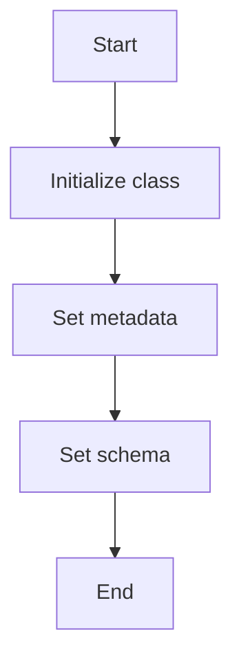

#### 带注释源码

```python
def __init__(self):
    # Initialize the parent class with the necessary metadata
    super().__init__(
        id="6e7d2590-ac2b-4b5d-b08c-fc039cd77e1f",
        description="Update records in an Airtable table",
        categories={BlockCategory.DATA},
        input_schema=self.Input,
        output_schema=self.Output,
    )
```


### AirtableUpdateRecordsBlock.run

Updates one or more existing records in an Airtable table.

参数：

- `input_data`：`Input`，The input data for the block.
- `credentials`：`APIKeyCredentials`，Airtable API credentials.

返回值：`BlockOutput`，The output of the block.

#### 流程图

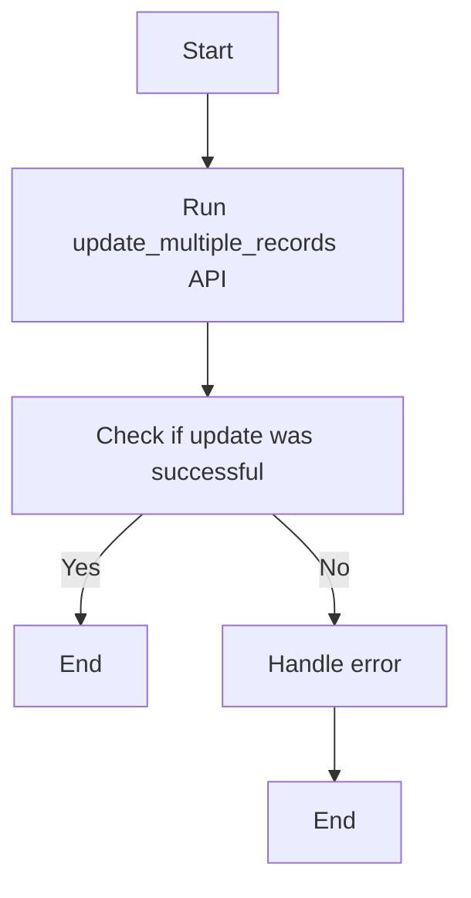

#### 带注释源码

```python
async def run(self, input_data: Input, *, credentials: APIKeyCredentials, **kwargs) -> BlockOutput:
    # The update_multiple_records API expects records with id and fields
    data = await update_multiple_records(
        credentials,
        input_data.base_id,
        input_data.table_id_or_name,
        records=input_data.records,
        typecast=input_data.typecast if input_data.typecast else None,
        return_fields_by_field_id=False,  # Use field names, not IDs
    )

    yield "records", data.get("records", [])
```


### AirtableDeleteRecordsBlock.__init__

This method initializes the AirtableDeleteRecordsBlock class, setting up its metadata and schema for the Airtable API block that deletes records from an Airtable table.

参数：

- `self`：`None`，The instance of the class being initialized.

返回值：`None`，No return value is specified as the method is used for initialization purposes only.

#### 流程图


#### 带注释源码

```python
def __init__(self):
    # Initialize the parent class with the block's ID, description, categories, input schema, and output schema
    super().__init__(
        id="93e22b8b-3642-4477-aefb-1c0929a4a3a6",
        description="Delete records from an Airtable table",
        categories={BlockCategory.DATA},
        input_schema=self.Input,
        output_schema=self.Output,
    )
```


### AirtableDeleteRecordsBlock.run

Deletes one or more records from an Airtable table.

参数：

- `input_data`：`Input`，The input data for the block.
- `credentials`：`APIKeyCredentials`，Airtable API credentials.
- `kwargs`：`Any`，Additional keyword arguments.

返回值：`BlockOutput`，The output of the block.

#### 流程图

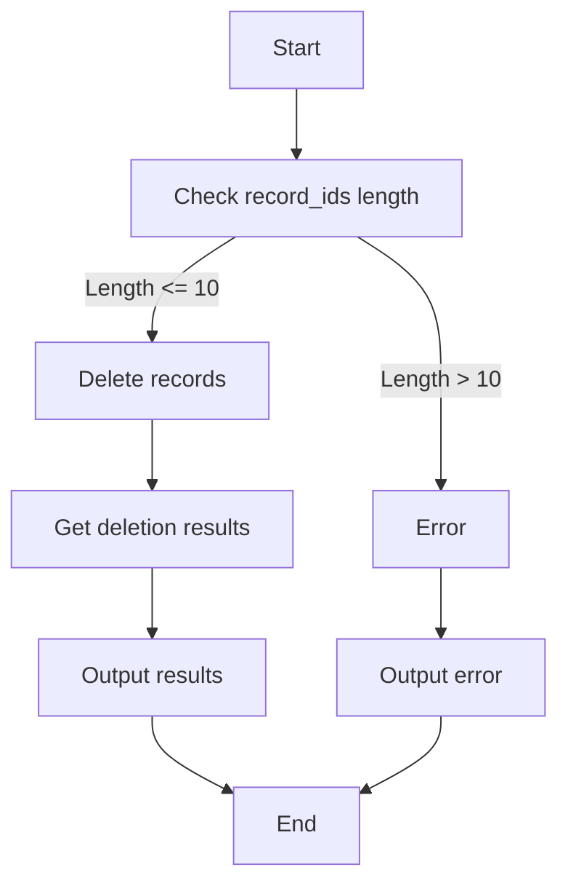

#### 带注释源码

```python
async def run(self, input_data: Input, *, credentials: APIKeyCredentials, **kwargs) -> BlockOutput:
    if len(input_data.record_ids) > 10:
        yield "error", "Only upto 10 record IDs can be deleted at a time"
    else:
        data = await delete_multiple_records(
            credentials,
            input_data.base_id,
            input_data.table_id_or_name,
            input_data.record_ids,
        )

        yield "records", data.get("records", [])
```


## 关键组件


### 张量索引与惰性加载

张量索引与惰性加载是代码中用于高效处理大量数据的关键组件，通过延迟计算和按需加载数据，优化内存使用和性能。

### 反量化支持

反量化支持是代码中用于处理量化数据的关键组件，它允许在量化过程中进行反向操作，以恢复原始数据。

### 量化策略

量化策略是代码中用于优化数据表示和存储的关键组件，通过减少数据精度来降低内存和计算需求。


## 问题及建议


### 已知问题

-   **代码重复**：多个类（`AirtableListRecordsBlock`, `AirtableGetRecordBlock`, `AirtableCreateRecordsBlock`, `AirtableUpdateRecordsBlock`, `AirtableDeleteRecordsBlock`）中存在大量重复的代码，特别是在初始化方法和`run`方法中。这可能导致维护困难，如果API或逻辑发生变化，需要修改多个地方。
-   **异常处理**：代码中没有明确的异常处理机制。如果API调用失败或出现错误，可能会抛出异常，但没有相应的捕获和处理逻辑。
-   **全局变量**：代码中使用了全局变量`airtable`，这可能导致代码难以理解和维护，特别是在大型项目中。

### 优化建议

-   **代码重构**：将重复的代码提取到单独的函数或类中，减少代码重复，提高可维护性。
-   **异常处理**：添加异常处理逻辑，确保在API调用失败时能够捕获异常并给出适当的反馈。
-   **全局变量**：避免使用全局变量，使用参数传递或类属性来管理状态。
-   **单元测试**：编写单元测试来确保每个功能块都能按预期工作，并帮助在代码更改时发现潜在的问题。
-   **文档**：为每个类和方法添加详细的文档注释，包括参数描述、返回值描述和异常情况。
-   **API版本兼容性**：考虑添加逻辑来处理不同版本的Airtable API，以避免因API更改而导致的问题。
-   **性能优化**：对于可能返回大量数据的操作，考虑实现分页或流式处理，以减少内存消耗和提高性能。


## 其它


### 设计目标与约束

- 设计目标：
  - 提供一个模块化的Airtable记录操作接口。
  - 支持记录的创建、读取、更新和删除。
  - 支持记录的过滤、排序和分页。
  - 支持输出结果的规范化处理。
  - 确保API调用安全可靠。

- 约束条件：
  - 必须使用Airtable官方API进行操作。
  - 输入参数必须符合Airtable API的要求。
  - 输出结果必须符合预定义的输出格式。
  - 代码必须遵循Python编程规范。

### 错误处理与异常设计

- 错误处理：
  - 捕获API调用过程中可能出现的异常。
  - 将异常转换为用户友好的错误信息。
  - 在输出中返回错误信息。

- 异常设计：
  - 定义自定义异常类，用于处理特定错误情况。
  - 使用try-except语句捕获和处理异常。

### 数据流与状态机

- 数据流：
  - 输入数据通过API接口传递到相应的处理函数。
  - 处理函数根据输入数据执行相应的操作。
  - 输出结果通过API接口返回给调用者。

- 状态机：
  - 每个处理函数根据输入数据的状态执行相应的操作。
  - 状态机用于控制数据处理流程。

### 外部依赖与接口契约

- 外部依赖：
  - Airtable API。
  - Python异步编程库。

- 接口契约：
  - 定义API接口的输入和输出格式。
  - 确保API调用符合契约要求。

### 安全性与权限管理

- 安全性：
  - 使用API密钥进行身份验证。
  - 确保API调用安全可靠。

- 权限管理：
  - 根据用户角色和权限限制API调用。

### 性能优化

- 性能优化：
  - 使用异步编程提高API调用效率。
  - 优化数据传输和处理过程。

### 可维护性与可扩展性

- 可维护性：
  - 代码结构清晰，易于理解和维护。
  - 使用文档和注释提高代码可读性。

- 可扩展性：
  - 设计模块化架构，方便扩展功能。
  - 使用配置文件管理参数，方便调整配置。

### 测试与部署

- 测试：
  - 编写单元测试和集成测试。
  - 确保代码质量。

- 部署：
  - 使用容器化技术部署应用程序。
  - 确保应用程序稳定运行。


    