# `.\AutoGPT\autogpt_platform\backend\backend\blocks\airtable\schema.py` 详细设计文档

This Python code provides a set of blocks for managing Airtable schemas and tables, including retrieving schemas, creating and updating tables and fields.

## 整体流程

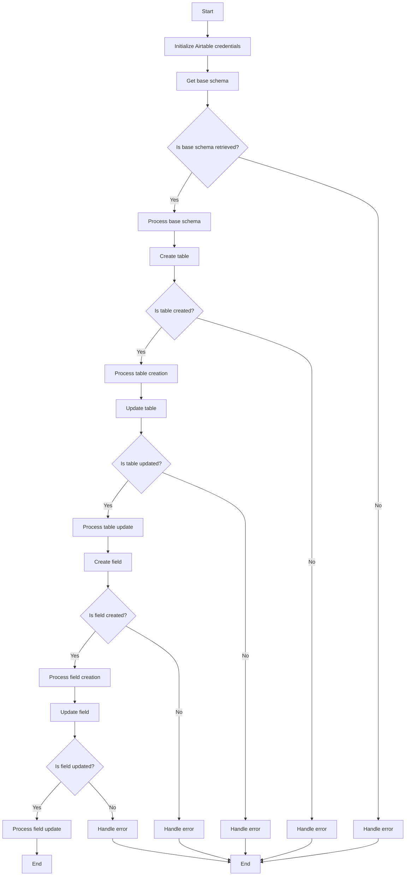

## 类结构

```
AirtableListSchemaBlock (Block)
├── Input (BlockSchemaInput)
│   ├── credentials (CredentialsMetaInput)
│   └── base_id (str)
│       └── SchemaField
│           └── description
│               └── The Airtable base ID
│   └── Output (BlockSchemaOutput)
│       ├── base_schema (dict)
│       └── tables (list[dict])
│           └── SchemaField
│               └── description
│                   └── Array of table objects
├── AirtableCreateTableBlock (Block)
│   ├── Input (BlockSchemaInput)
│   │   ├── credentials (CredentialsMetaInput)
│   │   └── ...
│   └── Output (BlockSchemaOutput)
│       ├── table (dict)
│       └── table_id (str)
│           └── SchemaField
│               └── description
│                   └── Created table object
├── AirtableUpdateTableBlock (Block)
│   ├── Input (BlockSchemaInput)
│   │   ├── credentials (CredentialsMetaInput)
│   │   └── ...
│   └── Output (BlockSchemaOutput)
│       └── table (dict)
│           └── SchemaField
│               └── description
│                   └── Updated table object
├── AirtableCreateFieldBlock (Block)
│   ├── Input (BlockSchemaInput)
│   │   ├── credentials (CredentialsMetaInput)
│   │   └── ...
│   └── Output (BlockSchemaOutput)
│       ├── field (dict)
│       └── field_id (str)
│           └── SchemaField
│               └── description
│                   └── Created field object
└── AirtableUpdateFieldBlock (Block)
   ├── Input (BlockSchemaInput)
   │   ├── credentials (CredentialsMetaInput)
   │   └── ...
   └── Output (BlockSchemaOutput)
       └── field (dict)
           └── SchemaField
               └── description
                   └── Updated field object
```

## 全局变量及字段


### `credentials`
    
Airtable API credentials

类型：`CredentialsMetaInput`
    


### `base_id`
    
The Airtable base ID

类型：`str`
    


### `table_name`
    
The name of the table to create

类型：`str`
    


### `table_fields`
    
Table fields with name, type, and options

类型：`list[dict]`
    


### `table_id`
    
The table ID to update

类型：`str`
    


### `table_name`
    
The name of the table to update

类型：`str | None`
    


### `table_description`
    
The description of the table to update

类型：`str | None`
    


### `date_dependency`
    
The date dependency of the table to update

类型：`dict | None`
    


### `field_type`
    
The type of the field to create

类型：`TableFieldType`
    


### `name`
    
The name of the field to create

类型：`str`
    


### `description`
    
The description of the field to create

类型：`str | None`
    


### `options`
    
The options of the field to create

类型：`dict[str, str] | None`
    


### `field_id`
    
The field ID to update

类型：`str`
    


### `name`
    
The name of the field to update

类型：`str | None`
    


### `description`
    
The description of the field to update

类型：`str | None`
    


### `AirtableListSchemaBlock.Input`
    
Input schema for the AirtableListSchemaBlock

类型：`BlockSchemaInput`
    


### `AirtableListSchemaBlock.Output`
    
Output schema for the AirtableListSchemaBlock

类型：`BlockSchemaOutput`
    


### `AirtableCreateTableBlock.Input`
    
Input schema for the AirtableCreateTableBlock

类型：`BlockSchemaInput`
    


### `AirtableCreateTableBlock.Output`
    
Output schema for the AirtableCreateTableBlock

类型：`BlockSchemaOutput`
    


### `AirtableUpdateTableBlock.Input`
    
Input schema for the AirtableUpdateTableBlock

类型：`BlockSchemaInput`
    


### `AirtableUpdateTableBlock.Output`
    
Output schema for the AirtableUpdateTableBlock

类型：`BlockSchemaOutput`
    


### `AirtableCreateFieldBlock.Input`
    
Input schema for the AirtableCreateFieldBlock

类型：`BlockSchemaInput`
    


### `AirtableCreateFieldBlock.Output`
    
Output schema for the AirtableCreateFieldBlock

类型：`BlockSchemaOutput`
    


### `AirtableUpdateFieldBlock.Input`
    
Input schema for the AirtableUpdateFieldBlock

类型：`BlockSchemaInput`
    


### `AirtableUpdateFieldBlock.Output`
    
Output schema for the AirtableUpdateFieldBlock

类型：`BlockSchemaOutput`
    
    

## 全局函数及方法


### `create_table`

Create a new table in an Airtable base with specified fields and views.

参数：

- `credentials`：`APIKeyCredentials`，Airtable API credentials
- `base_id`：`str`，The Airtable base ID
- `table_name`：`str`，The name of the table to create
- `table_fields`：`list[dict]`，Table fields with name, type, and options

返回值：`dict`，Created table object

#### 流程图

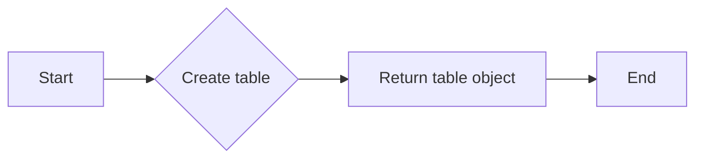

#### 带注释源码

```python
async def create_table(
    credentials: APIKeyCredentials,
    base_id: str,
    table_name: str,
    table_fields: list[dict],
) -> dict:
    # Construct the request data
    data = {
        "name": table_name,
        "fields": table_fields,
    }

    # Make the API request to create the table
    response = await Requests().post(
        f"https://api.airtable.com/v0/bases/{base_id}/tables",
        headers={"Authorization": f"Bearer {credentials.api_key.get_secret_value()}"},
        json=data,
    )

    # Parse the response and return the created table object
    return response.json()
```


### update_table

Updates an existing table's properties such as name or description.

参数：

- `credentials`：`APIKeyCredentials`，Airtable API credentials
- `base_id`：`str`，The Airtable base ID
- `table_id`：`str`，The table ID to update
- `table_name`：`str | None`，The name of the table to update
- `table_description`：`str | None`，The description of the table to update
- `date_dependency`：`dict | None`，The date dependency of the table to update

返回值：`dict`，Updated table object

#### 流程图

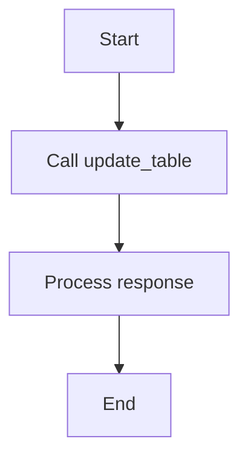

#### 带注释源码

```python
async def update_table(
    credentials: APIKeyCredentials,
    base_id: str,
    table_id: str,
    table_name: str | None = None,
    table_description: str | None = None,
    date_dependency: dict | None = None,
) -> dict:
    # Construct the request data
    data = {
        "table_name": table_name,
        "table_description": table_description,
        "date_dependency": date_dependency,
    }
    # Filter out None values
    data = {k: v for k, v in data.items() if v is not None}

    # Make the API request
    response = await Requests().patch(
        f"https://api.airtable.com/v0/bases/{base_id}/tables/{table_id}",
        headers={"Authorization": f"Bearer {credentials.api_key.get_secret_value()}"},
        json=data,
    )

    # Return the response data
    return response.json()
```


### create_field

Adds a new field (column) to an existing Airtable table.

参数：

- `credentials`：`APIKeyCredentials`，Airtable API credentials
- `base_id`：`str`，The Airtable base ID
- `table_id`：`str`，The table ID to add field to
- `field_type`：`TableFieldType`，The type of the field to create
- `name`：`str`，The name of the field to create

返回值：`dict`，Created field object

#### 流程图

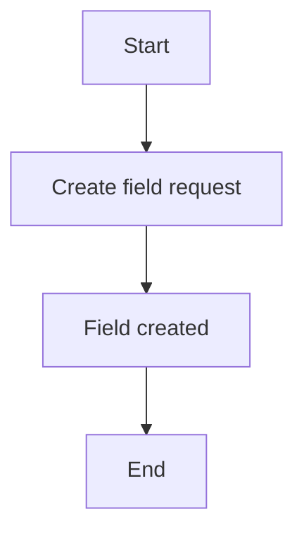

#### 带注释源码

```python
async def create_field(
    credentials: APIKeyCredentials,
    base_id: str,
    table_id: str,
    field_type: TableFieldType,
    name: str,
) -> dict:
    # Construct the field data payload
    field_data = {
        "table_id": table_id,
        "type": field_type.value,
        "name": name,
    }

    # Make the API request to create the field
    response = await Requests().post(
        f"https://api.airtable.com/v0/bases/{base_id}/tables/{table_id}/fields",
        headers={"Authorization": f"Bearer {credentials.api_key.get_secret_value()}"},
        json=field_data,
    )

    # Parse the response and return the created field
    return response.json()
```


### AirtableUpdateFieldBlock.update_field

Updates an existing field's properties in an Airtable table.

参数：

- `credentials`：`APIKeyCredentials`，Airtable API credentials
- `base_id`：`str`，The Airtable base ID
- `table_id`：`str`，The table ID containing the field
- `field_id`：`str`，The field ID to update
- `name`：`str | None`，The name of the field to update
- `description`：`str | None`，The description of the field to update

返回值：`dict`，Updated field object

#### 流程图

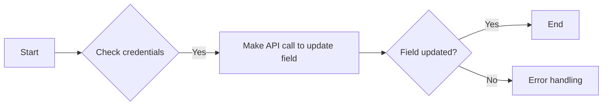

#### 带注释源码

```python
async def run(
    self, input_data: Input, *, credentials: APIKeyCredentials, **kwargs
) -> BlockOutput:
    field_data = await update_field(
        credentials,
        input_data.base_id,
        input_data.table_id,
        input_data.field_id,
        input_data.name,
        input_data.description,
    )

    yield "field", field_data
```


### AirtableListSchemaBlock.__init__

This method initializes the AirtableListSchemaBlock class, setting up its metadata and schema inputs and outputs.

参数：

- `self`：`AirtableListSchemaBlock`，The instance of the class being initialized.

返回值：无

#### 流程图

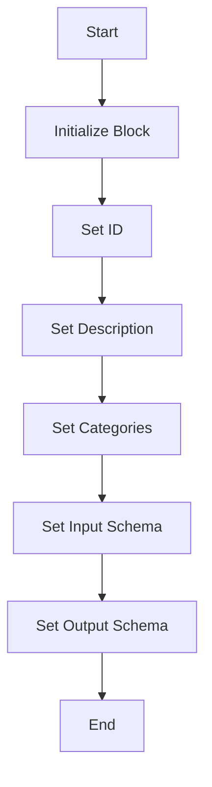

#### 带注释源码

```python
def __init__(self):
    super().__init__(
        id="64291d3c-99b5-47b7-a976-6d94293cdb2d",
        description="Get the complete schema of an Airtable base",
        categories={BlockCategory.DATA},
        input_schema=self.Input,
        output_schema=self.Output,
    )
```


### AirtableListSchemaBlock.run

Retrieves the complete schema of an Airtable base, including all tables, fields, and views.

参数：

- `input_data`：`Input`，The input data for the block, including credentials and base ID.
- `credentials`：`APIKeyCredentials`，The Airtable API credentials.
- `**kwargs`：Any additional keyword arguments.

返回值：`BlockOutput`，The output of the block, including the base schema and tables.

#### 流程图

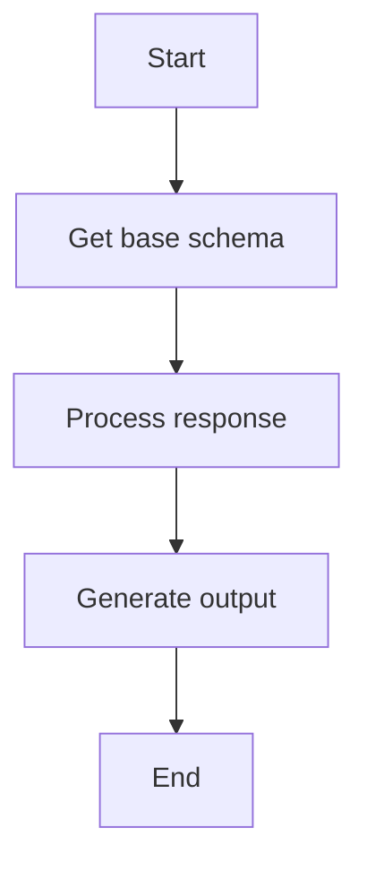

#### 带注释源码

```python
async def run(self, input_data: Input, *, credentials: APIKeyCredentials, **kwargs) -> BlockOutput:
    api_key = credentials.api_key.get_secret_value()

    # Get base schema
    response = await Requests().get(
        f"https://api.airtable.com/v0/meta/bases/{input_data.base_id}/tables",
        headers={"Authorization": f"Bearer {api_key}"},
    )

    data = response.json()

    yield "base_schema", data
    yield "tables", data.get("tables", [])
```


### AirtableCreateTableBlock.__init__

This method initializes the AirtableCreateTableBlock class, setting up its properties and behaviors.

参数：

- `self`：`None`，The instance of the class being initialized.

返回值：`None`，No return value, as it's an initializer method.

#### 流程图

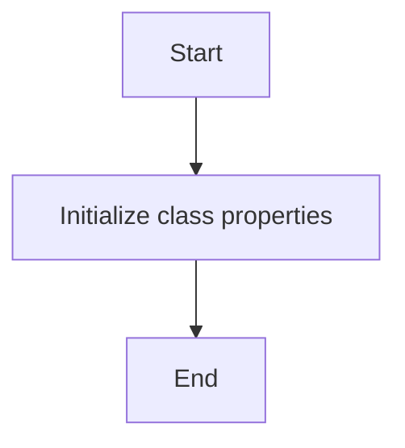

#### 带注释源码

```python
def __init__(self):
    super().__init__(
        id="fcc20ced-d817-42ea-9b40-c35e7bf34b4f",
        description="Create a new table in an Airtable base",
        categories={BlockCategory.DATA},
        input_schema=self.Input,
        output_schema=self.Output,
    )
```


### AirtableCreateTableBlock.run

This method creates a new table in an Airtable base with specified fields and views.

参数：

- `input_data`：`Input`，The input data for creating a table in Airtable.
- `credentials`：`APIKeyCredentials`，The Airtable API credentials.
- `**kwargs`：Any additional keyword arguments.

返回值：`BlockOutput`，The output of the block, containing the created table object and its ID.

#### 流程图

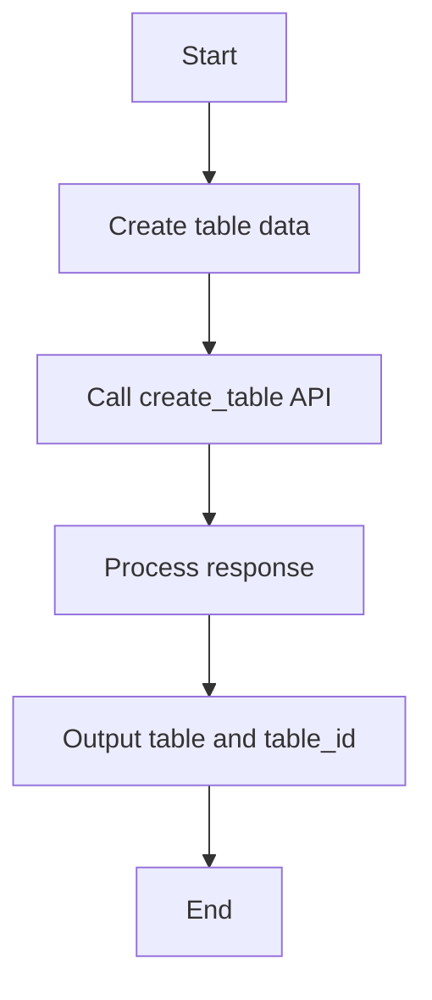

#### 带注释源码

```python
async def run(self, input_data: Input, *, credentials: APIKeyCredentials, **kwargs) -> BlockOutput:
    table_data = await create_table(
        credentials,
        input_data.base_id,
        input_data.table_name,
        input_data.table_fields,
    )

    yield "table", table_data
    yield "table_id", table_data.get("id", "")
```


### AirtableUpdateTableBlock.__init__

This method initializes the AirtableUpdateTableBlock class, setting up its properties and behaviors.

参数：

- `self`：`None`，The instance of the class being initialized.

返回值：`None`，No return value.

#### 流程图


#### 带注释源码

```python
def __init__(self):
    super().__init__(
        id="34077c5f-f962-49f2-9ec6-97c67077013a",
        description="Update table properties",
        categories={BlockCategory.DATA},
        input_schema=self.Input,
        output_schema=self.Output,
    )
```


### AirtableUpdateTableBlock.run

Updates an existing table's properties such as name or description.

参数：

- `input_data`：`Input`，The input data for the block.
- `credentials`：`APIKeyCredentials`，Airtable API credentials.
- `**kwargs`：Any additional keyword arguments.

返回值：`BlockOutput`，The output of the block.

#### 流程图

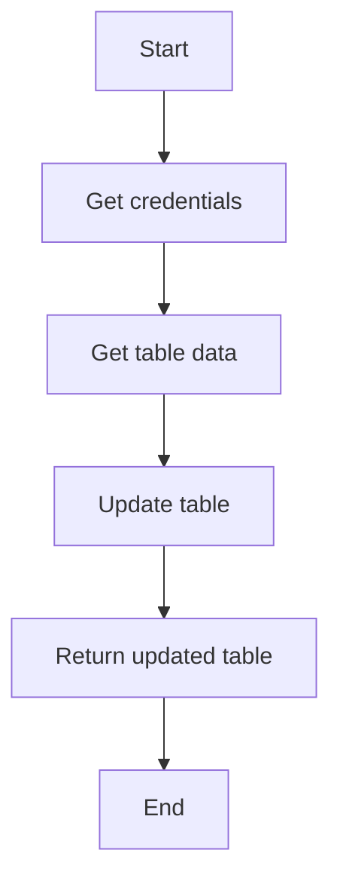

#### 带注释源码

```python
async def run(self, input_data: Input, *, credentials: APIKeyCredentials, **kwargs) -> BlockOutput:
    table_data = await update_table(
        credentials,
        input_data.base_id,
        input_data.table_id,
        input_data.table_name,
        input_data.table_description,
        input_data.date_dependency,
    )

    yield "table", table_data
```


### AirtableCreateFieldBlock.__init__

This method initializes the AirtableCreateFieldBlock class, setting up its properties and behaviors.

参数：

- `self`：`None`，The instance of the class being initialized.

返回值：`None`，No return value, as it's an initializer method.

#### 流程图


#### 带注释源码

```python
def __init__(self):
    super().__init__(
        id="6c98a32f-dbf9-45d8-a2a8-5e97e8326351",
        description="Add a new field to an Airtable table",
        categories={BlockCategory.DATA},
        input_schema=self.Input,
        output_schema=self.Output,
    )
```


### AirtableCreateFieldBlock.run

This method adds a new field (column) to an existing Airtable table.

参数：

- `input_data`：`Input`，The input data for the block, containing the necessary information to create a field in an Airtable table.
- `credentials`：`APIKeyCredentials`，The credentials used to authenticate with the Airtable API.
- `**kwargs`：`Any`，Additional keyword arguments that may be passed to the method.

返回值：`BlockOutput`，The output of the block, containing the created field object and its ID.

#### 流程图

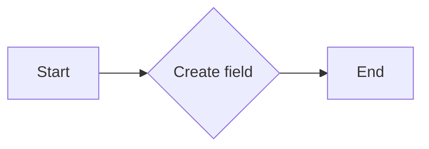

#### 带注释源码

```python
async def run(self, input_data: Input, *, credentials: APIKeyCredentials, **kwargs) -> BlockOutput:
    field_data = await create_field(
        credentials,
        input_data.base_id,
        input_data.table_id,
        input_data.field_type,
        input_data.name,
    )

    yield "field", field_data
    yield "field_id", field_data.get("id", "")
```


### AirtableUpdateFieldBlock.__init__

This method initializes the AirtableUpdateFieldBlock class, setting up its properties and behaviors.

参数：

- `self`：`None`，The instance of the class being initialized.

返回值：`None`，No return value, as it's an initializer method.

#### 流程图


#### 带注释源码

```python
def __init__(self):
    super().__init__(
        id="f46ac716-3b18-4da1-92e4-34ca9a464d48",
        description="Update field properties in an Airtable table",
        categories={BlockCategory.DATA},
        input_schema=self.Input,
        output_schema=self.Output,
    )
```


### AirtableUpdateFieldBlock.run

Updates an existing field's properties in an Airtable table.

参数：

- `input_data`：`Input`，The input data for the block.
- `credentials`：`APIKeyCredentials`，Airtable API credentials.
- `**kwargs`：Any additional keyword arguments.

返回值：`BlockOutput`，The output of the block.

#### 流程图

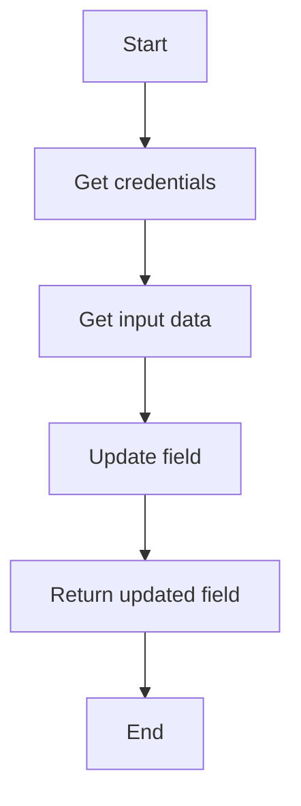

#### 带注释源码

```python
async def run(self, input_data: Input, *, credentials: APIKeyCredentials, **kwargs) -> BlockOutput:
    field_data = await update_field(
        credentials,
        input_data.base_id,
        input_data.table_id,
        input_data.field_id,
        input_data.name,
        input_data.description,
    )

    yield "field", field_data
```

## 关键组件


### 张量索引与惰性加载

张量索引与惰性加载是代码中用于高效处理和访问大型数据集的关键组件。它允许在需要时才加载数据，从而减少内存消耗和提高性能。

### 反量化支持

反量化支持是代码中用于处理和转换量化数据的关键组件。它允许将量化数据转换回原始数据格式，以便进行进一步处理和分析。

### 量化策略

量化策略是代码中用于优化数据存储和计算效率的关键组件。它通过减少数据精度来减少存储空间和计算资源的使用，同时保持足够的精度以满足应用需求。


## 问题及建议


### 已知问题

-   **全局变量和函数依赖性**：代码中存在对全局变量和函数的依赖，如`airtable.credentials_field`和`create_table`、`create_field`、`update_table`、`update_field`等。这些全局变量和函数的实现细节未在代码中展示，可能存在潜在的技术债务。
-   **异常处理**：代码中未展示异常处理机制，对于API调用失败或数据解析错误等情况，缺乏明确的错误处理逻辑。
-   **代码复用性**：多个类中存在相似的代码片段，如`credentials`和`base_id`字段的获取，可以考虑使用继承或封装来提高代码复用性。

### 优化建议

-   **模块化**：将全局变量和函数封装到独立的模块中，提高代码的可维护性和可测试性。
-   **异常处理**：在API调用和数据处理过程中添加异常处理逻辑，确保程序的健壮性。
-   **代码复用**：通过继承或封装，减少代码重复，提高代码的可读性和可维护性。
-   **文档注释**：为每个类、方法和函数添加详细的文档注释，包括参数描述、返回值描述和异常情况说明，方便其他开发者理解和维护代码。
-   **单元测试**：编写单元测试来验证代码的正确性和稳定性，确保代码在修改后仍然符合预期。


## 其它


### 设计目标与约束

- 设计目标：
  - 提供一个模块化的Airtable数据管理解决方案。
  - 支持创建、更新和检索Airtable数据库中的表和字段。
  - 确保API调用安全，使用API密钥进行认证。
  - 提供清晰的接口和文档，方便用户使用。

- 约束：
  - 必须使用Airtable官方API。
  - 代码应遵循异步编程模式，以提高性能。
  - 代码应具有良好的可读性和可维护性。

### 错误处理与异常设计

- 错误处理：
  - 使用try-except块捕获API调用中的异常。
  - 定义自定义异常类，以便更清晰地表示错误。
  - 返回错误信息，以便用户了解失败的原因。

- 异常设计：
  - 定义`AirtableAPIError`异常类，用于处理API调用错误。
  - 定义`AirtableValidationError`异常类，用于处理输入验证错误。

### 数据流与状态机

- 数据流：
  - 用户输入数据，如表名、字段名等。
  - 代码将数据发送到Airtable API。
  - API返回结果，代码处理结果并返回给用户。

- 状态机：
  - 每个块（如`AirtableListSchemaBlock`）都有自己的状态机，用于处理API调用和结果处理。

### 外部依赖与接口契约

- 外部依赖：
  - `backend.sdk`：提供Airtable API的封装。
  - `aiohttp`：用于异步HTTP请求。

- 接口契约：
  - `Block`：定义了块的接口，包括输入、输出和运行方法。
  - `BlockSchemaInput`和`BlockSchemaOutput`：定义了块的输入和输出模式。
  - `APIKeyCredentials`：用于存储和获取API密钥。


    