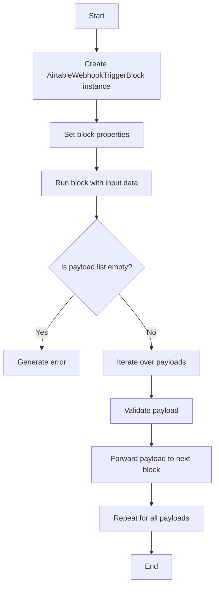
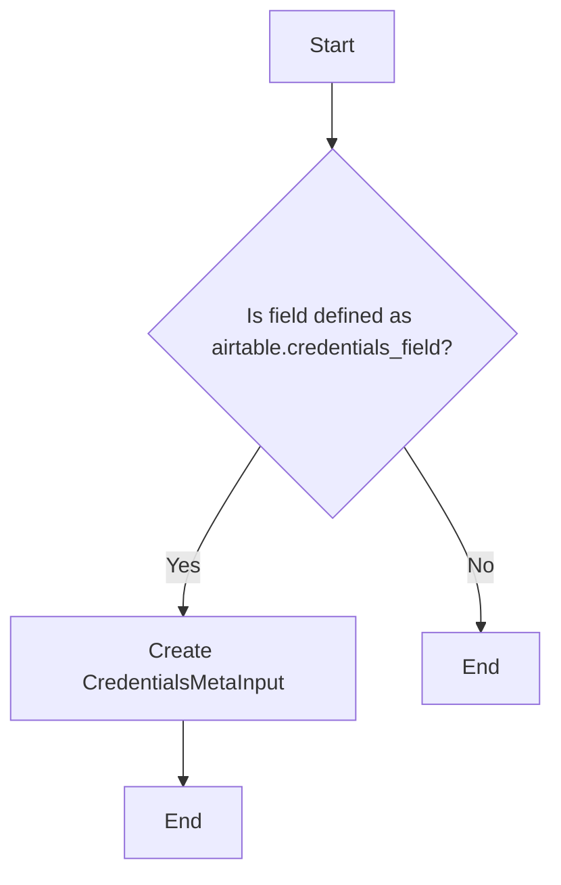
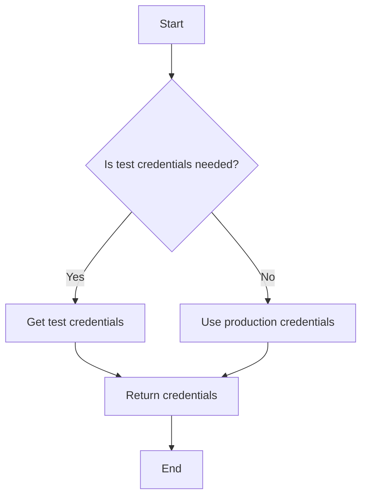
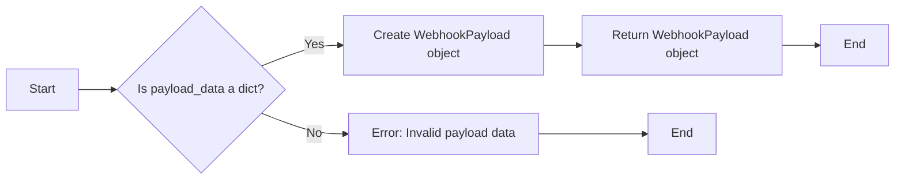
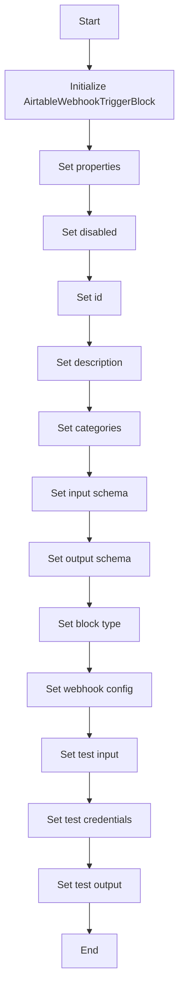

# `.\AutoGPT\autogpt_platform\backend\backend\blocks\airtable\triggers.py` 详细设计文档

The code defines a class that acts as a webhook trigger block for Airtable events, forwarding payloads to the next block in a flow.

## 整体流程



## 类结构

```
AirtableWebhookTriggerBlock (Concrete Block)
├── Input (BlockSchemaInput)
│   ├── credentials (CredentialsMetaInput)
│   ├── base_id (str)
│   ├── table_id_or_name (str)
│   ├── payload (dict)
│   └── events (AirtableEventSelector)
└── Output (BlockSchemaOutput)
    └── payload (WebhookPayload)
```

## 全局变量及字段


### `BaseModel`
    
Base class for all models in the backend SDK.

类型：`class`
    


### `Block`
    
Base class for all blocks in the backend SDK.

类型：`class`
    


### `BlockCategory`
    
Enum for block categories.

类型：`class`
    


### `BlockOutput`
    
Base class for all block outputs in the backend SDK.

类型：`class`
    


### `BlockSchemaInput`
    
Base class for all block schema inputs in the backend SDK.

类型：`class`
    


### `BlockSchemaOutput`
    
Base class for all block schema outputs in the backend SDK.

类型：`class`
    


### `BlockType`
    
Enum for block types.

类型：`class`
    


### `BlockWebhookConfig`
    
Configuration class for webhook blocks in the backend SDK.

类型：`class`
    


### `CredentialsMetaInput`
    
Class for credentials metadata inputs.

类型：`class`
    


### `ProviderName`
    
Enum for provider names.

类型：`class`
    


### `SchemaField`
    
Class for schema fields.

类型：`class`
    


### `WebhookPayload`
    
Class for webhook payloads.

类型：`class`
    


### `airtable`
    
Module for Airtable configurations and utilities.

类型：`module`
    


### `AirtableEventSelector.tableData`
    
Flag to select table data events.

类型：`bool`
    


### `AirtableEventSelector.tableFields`
    
Flag to select table fields events.

类型：`bool`
    


### `AirtableEventSelector.tableMetadata`
    
Flag to select table metadata events.

类型：`bool`
    


### `AirtableWebhookTriggerBlock.disabled`
    
Flag to enable or disable the block.

类型：`bool`
    


### `AirtableWebhookTriggerBlock.id`
    
Unique identifier for the block.

类型：`str`
    


### `AirtableWebhookTriggerBlock.description`
    
Description of the block.

类型：`str`
    


### `AirtableWebhookTriggerBlock.categories`
    
Set of categories the block belongs to.

类型：`set`
    


### `AirtableWebhookTriggerBlock.input_schema`
    
Input schema for the block.

类型：`BlockSchemaInput`
    


### `AirtableWebhookTriggerBlock.output_schema`
    
Output schema for the block.

类型：`BlockSchemaOutput`
    


### `AirtableWebhookTriggerBlock.block_type`
    
Type of the block.

类型：`BlockType`
    


### `AirtableWebhookTriggerBlock.webhook_config`
    
Webhook configuration for the block.

类型：`BlockWebhookConfig`
    


### `AirtableWebhookTriggerBlock.test_input`
    
Test input data for the block.

类型：`dict`
    


### `AirtableWebhookTriggerBlock.test_credentials`
    
Test credentials for the block.

类型：`CredentialsMetaInput`
    


### `AirtableWebhookTriggerBlock.test_output`
    
Test output data for the block.

类型：`list`
    
    

## 全局函数及方法


### airtable.credentials_field

This function is used to define a field in the input schema that requires Airtable API credentials.

参数：

- `description`：`str`，A description of the field.

返回值：`CredentialsMetaInput`，An instance of `CredentialsMetaInput` which is used to represent the Airtable API credentials.

#### 流程图



#### 带注释源码

```python
from backend.sdk import CredentialsMetaInput

def credentials_field(description: str):
    """
    Define a field in the input schema that requires Airtable API credentials.

    :param description: str, A description of the field.
    :return: CredentialsMetaInput, An instance of CredentialsMetaInput which is used to represent the Airtable API credentials.
    """
    return CredentialsMetaInput(description=description)
```


### airtable.get_test_credentials()

获取用于测试的Airtable API凭证。

参数：

- 无

返回值：`CredentialsMetaInput`，用于测试的Airtable API凭证对象

#### 流程图



#### 带注释源码

```python
def get_test_credentials():
    """
    Returns test credentials for Airtable API.
    """
    # Assuming the test credentials are stored in a configuration file or environment variables
    # Here, we are just returning a placeholder object
    return CredentialsMetaInput(
        api_key="test_api_key",
        base_id="test_base_id",
        table_id="test_table_id"
    )
```


### WebhookPayload.model_validate

Validates and returns a single WebhookPayload object from a given payload data.

参数：

- `payload_data`：`dict`，The payload data to validate and convert to a WebhookPayload object.

返回值：`WebhookPayload`，A validated WebhookPayload object.

#### 流程图



#### 带注释源码

```python
from backend.sdk import WebhookPayload

def model_validate(payload_data: dict) -> WebhookPayload:
    # Validate and return a single WebhookPayload object from the given payload data.
    return WebhookPayload.from_dict(payload_data)
```


### AirtableWebhookTriggerBlock.__init__

This method initializes the `AirtableWebhookTriggerBlock` class, setting up its configuration and properties to handle Airtable webhook events.

参数：

- `disabled`：`bool`，Indicates whether the block is disabled or not. This is set to `False` in the example.
- `id`：`str`，Unique identifier for the block.
- `description`：`str`，Description of the block's functionality.
- `categories`：`set`，Set of categories that the block belongs to.
- `input_schema`：`BlockSchemaInput`，Schema for the input data of the block.
- `output_schema`：`BlockSchemaOutput`，Schema for the output data of the block.
- `block_type`：`BlockType`，Type of the block.
- `webhook_config`：`BlockWebhookConfig`，Configuration for the webhook.
- `test_input`：`dict`，Test input data for the block.
- `test_credentials`：`CredentialsMetaInput`，Test credentials for the block.
- `test_output`：`list`，Test output data for the block.

返回值：`None`，This method does not return any value.

#### 流程图



#### 带注释源码

```python
def __init__(self):
    example_payload = {
        "payloads": [
            {
                "timestamp": "2022-02-01T21:25:05.663Z",
                "baseTransactionNumber": 4,
                "actionMetadata": {
                    "source": "client",
                    "sourceMetadata": {
                        "user": {
                            "id": "usr00000000000000",
                            "email": "foo@bar.com",
                            "permissionLevel": "create",
                        }
                    },
                },
                "payloadFormat": "v0",
            }
        ],
        "cursor": 5,
        "mightHaveMore": False,
    }

    super().__init__(
        disabled=False,
        id="d0180ce6-ccb9-48c7-8256-b39e93e62801",
        description="Starts a flow whenever Airtable emits a webhook event",
        categories={BlockCategory.INPUT, BlockCategory.DATA},
        input_schema=self.Input,
        output_schema=self.Output,
        block_type=BlockType.WEBHOOK,
        webhook_config=BlockWebhookConfig(
            provider=ProviderName("airtable"),
            webhook_type="not-used",
            event_filter_input="events",
            event_format="{event}",
            resource_format="{base_id}/{table_id_or_name}",
        ),
        test_input={
            "credentials": airtable.get_test_credentials().model_dump(),
            "base_id": "app1234567890",
            "table_id_or_name": "table1234567890",
            "events": AirtableEventSelector(
                tableData=True,
                tableFields=True,
                tableMetadata=False,
            ).model_dump(),
            "payload": example_payload,
        },
        test_credentials=airtable.get_test_credentials(),
        test_output=[
            (
                "payload",
                WebhookPayload.model_validate(example_payload["payloads"][0]),
            ),
        ],
    )
```


### AirtableWebhookTriggerBlock.run

This method triggers a flow whenever Airtable emits a webhook event and forwards the payloads one at a time to the next block.

参数：

- `input_data`：`Input`，The input data for the block, which includes the Airtable webhook payload.
- `**kwargs`：`Any`，Additional keyword arguments that may be passed to the method.

返回值：`BlockOutput`，The output of the block, which includes the validated webhook payload.

#### 流程图

```mermaid
graph TD
    A[Start] --> B[Check payloads length]
    B -- >|Length > 0| C[Iterate over payloads]
    B --|Length <= 0| D[Error: No valid payloads]
    C --> E[Validate payload]
    E --> F[Forward payload]
    F --> G[End]
    D --> G
```

#### 带注释源码

```python
async def run(self, input_data: Input, **kwargs) -> BlockOutput:
    if len(input_data.payload["payloads"]) > 0:
        for item in input_data.payload["payloads"]:
            yield "payload", WebhookPayload.model_validate(item)
    else:
        yield "error", "No valid payloads found in webhook payload"
```


## 关键组件


### 张量索引与惰性加载

张量索引与惰性加载是代码中用于高效处理和访问数据结构的方法，允许在需要时才加载数据，从而优化内存使用和性能。

### 反量化支持

反量化支持是代码中实现的一种特性，允许在运行时动态调整量化参数，以适应不同的量化需求。

### 量化策略

量化策略是代码中用于优化模型性能和减少模型大小的技术，通过减少模型中使用的数值精度来实现。


## 问题及建议


### 已知问题

-   **代码重复性**：`AirtableWebhookTriggerBlock` 类中的 `example_payload` 字典被硬编码在类初始化方法中，这可能导致代码重复，并且难以维护。如果未来需要更改示例数据，需要在多个地方进行修改。
-   **异常处理**：`run` 方法中只有简单的错误消息输出，没有详细的异常处理逻辑。如果发生异常，可能需要更详细的错误信息来帮助调试。
-   **测试数据**：测试数据 `example_payload` 是硬编码的，这限制了测试的灵活性。应该考虑使用可配置的测试数据或参数来允许不同的测试场景。

### 优化建议

-   **提取示例数据**：将 `example_payload` 提取到一个单独的函数或配置文件中，以便在需要时轻松修改和重用。
-   **增强异常处理**：在 `run` 方法中添加更详细的异常处理逻辑，记录异常信息，并考虑抛出更具体的异常类型。
-   **使用配置文件**：使用配置文件来管理测试数据，这样可以在不同的测试环境中轻松切换数据。
-   **代码注释**：增加代码注释，特别是对于复杂的逻辑和配置选项，以提高代码的可读性和可维护性。
-   **单元测试**：编写单元测试来验证 `AirtableWebhookTriggerBlock` 类的行为，确保代码的正确性和稳定性。
-   **文档化**：为代码和类提供详细的文档，包括如何使用类、配置选项和预期的行为。


## 其它


### 设计目标与约束

- 设计目标：
  - 实现一个能够触发流程的Airtable webhook事件选择器。
  - 确保事件选择器能够根据配置过滤Airtable webhook事件。
  - 提供一个灵活的接口，允许用户指定Airtable的基础ID、表ID或名称以及事件过滤器。
- 约束：
  - 事件选择器必须与Airtable的API兼容。
  - 代码应遵循最佳实践，确保可维护性和可扩展性。

### 错误处理与异常设计

- 错误处理：
  - 在`run`方法中，如果`input_data.payload["payloads"]`为空，则返回错误信息。
  - 使用`yield`语句返回错误信息，以便调用者可以处理这些错误。
- 异常设计：
  - 使用try-except块捕获可能发生的异常，并记录错误信息。

### 数据流与状态机

- 数据流：
  - 当Airtable触发webhook事件时，事件选择器会接收事件数据。
  - 事件选择器根据配置的事件过滤器过滤事件。
  - 如果事件符合过滤器条件，则事件选择器将事件数据传递给下一个块。
- 状态机：
  - 事件选择器没有实现状态机，因为它只是简单地过滤和传递事件。

### 外部依赖与接口契约

- 外部依赖：
  - Airtable API：用于接收和处理webhook事件。
  - `backend.sdk`模块：提供基础块和schema输入/输出类。
- 接口契约：
  - `AirtableEventSelector`类定义了事件过滤器的接口。
  - `AirtableWebhookTriggerBlock`类定义了webhook触发块的接口，包括输入和输出schema。


    