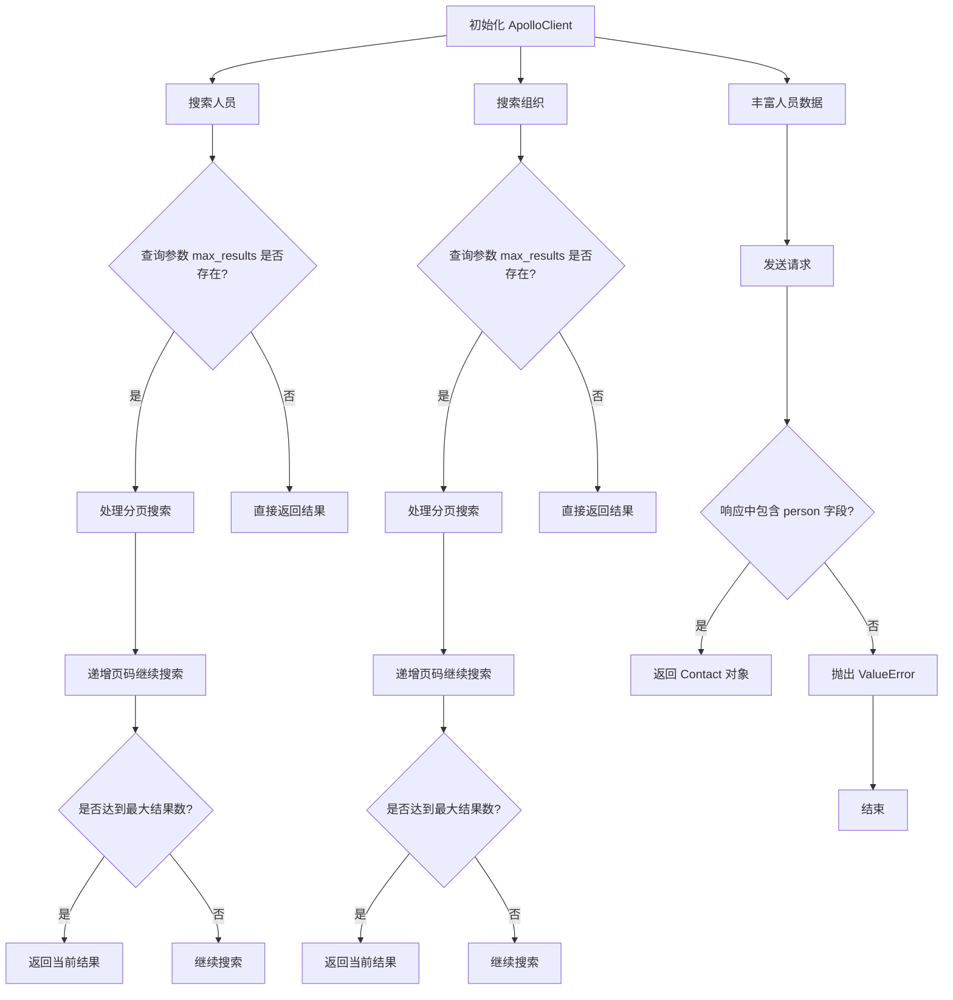
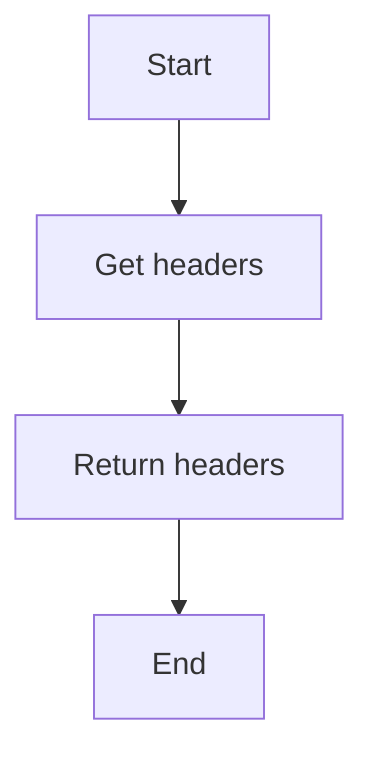
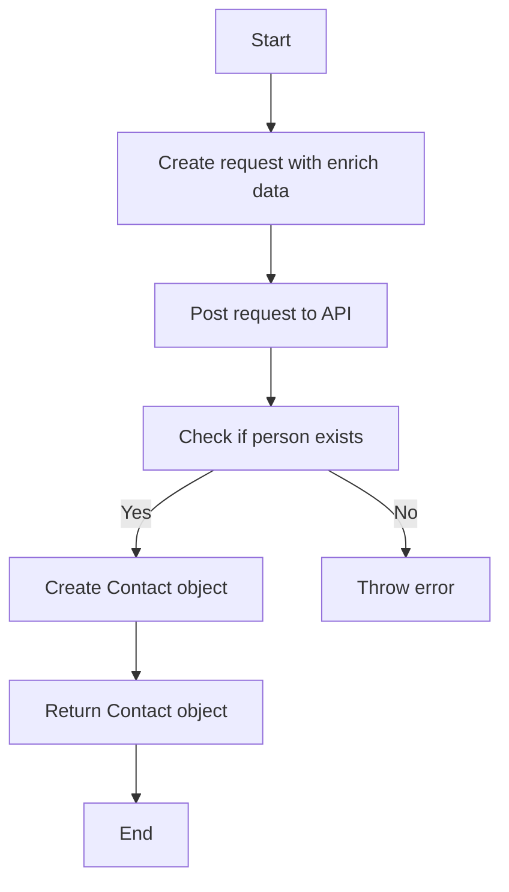
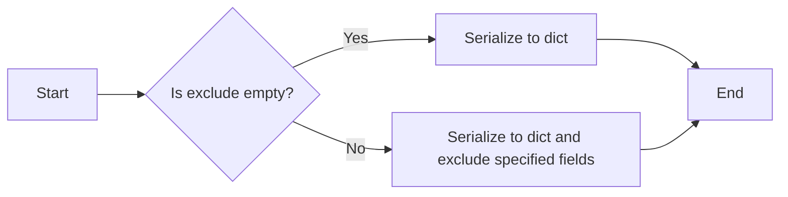
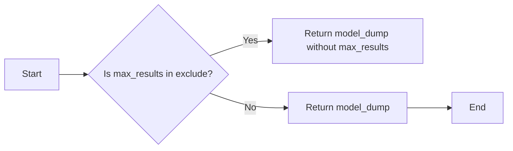
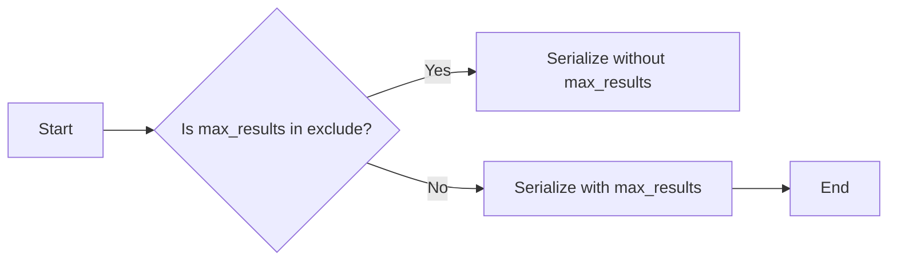
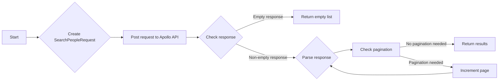

# `.\AutoGPT\autogpt_platform\backend\backend\blocks\apollo\_api.py` 详细设计文档

The ApolloClient class provides functionality to interact with the Apollo API, including searching for people and organizations, and enriching person data.

## 整体流程



## 类结构

```
ApolloClient (客户端类)
├── ApolloCredentials (认证信息)
├── Contact (联系人信息)
├── EnrichPersonRequest (丰富人员请求)
├── Organization (组织信息)
├── SearchOrganizationsRequest (搜索组织请求)
├── SearchOrganizationsResponse (搜索组织响应)
├── SearchPeopleRequest (搜索人员请求)
├── SearchPeopleResponse (搜索人员响应)
└── Requests (请求工具类)
```

## 全局变量及字段


### `logger`
    
Logger instance for logging messages.

类型：`logging.Logger`
    


### `API_URL`
    
Base URL for the Apollo API.

类型：`str`
    


### `Requests`
    
Requests instance for making HTTP requests.

类型：`backend.util.request.Requests`
    


### `ApolloClient.credentials`
    
Credentials for authenticating with the Apollo API.

类型：`ApolloCredentials`
    


### `ApolloClient.requests`
    
Requests instance for making HTTP requests through the ApolloClient.

类型：`Requests`
    


### `ApolloCredentials.api_key`
    
API key for authenticating with the Apollo API.

类型：`str`
    


### `Contact.email`
    
Email address of the contact.

类型：`str`
    


### `Contact.phone`
    
Phone number of the contact.

类型：`str`
    


### `Contact.name`
    
Name of the contact.

类型：`str`
    


### `EnrichPersonRequest.person_id`
    
ID of the person to enrich.

类型：`str`
    


### `SearchOrganizationsRequest.query`
    
Query string for searching organizations.

类型：`str`
    


### `SearchOrganizationsRequest.max_results`
    
Maximum number of results to return.

类型：`int`
    


### `SearchOrganizationsRequest.page`
    
Page number for pagination.

类型：`int`
    


### `SearchOrganizationsResponse.organizations`
    
List of organizations found in the search.

类型：`List[Organization]`
    


### `SearchOrganizationsResponse.pagination`
    
Pagination information for the search response.

类型：`dict`
    


### `SearchPeopleRequest.query`
    
Query string for searching people.

类型：`str`
    


### `SearchPeopleRequest.max_results`
    
Maximum number of results to return.

类型：`int`
    


### `SearchPeopleRequest.page`
    
Page number for pagination.

类型：`int`
    


### `SearchPeopleResponse.people`
    
List of people found in the search.

类型：`List[Contact]`
    


### `SearchPeopleResponse.pagination`
    
Pagination information for the search response.

类型：`dict`
    
    

## 全局函数及方法


### ApolloClient._get_headers

This method retrieves the headers required for making API requests to the Apollo API.

参数：

- `None`：`None`，No parameters are required for this method as it uses the instance's credentials.

返回值：`dict[str, str]`，A dictionary containing the API key header required for authentication.

#### 流程图



#### 带注释源码

```python
def _get_headers(self) -> dict[str, str]:
    return {"x-api-key": self.credentials.api_key.get_secret_value()}
```


### ApolloClient.search_people

Search for people in the Apollo API.

参数：

- `query`：`SearchPeopleRequest`，A request object containing the search criteria and pagination options.

返回值：`List[Contact]`，A list of `Contact` objects representing the people found in the search.

#### 流程图

```mermaid
graph TD
    A[Start] --> B[Create request with headers]
    B --> C[Post request to API]
    C --> D[Parse response]
    D --> E[Check total entries]
    E -->|Total entries > 0| F[Extract people]
    E -->|Total entries = 0| G[Return empty list]
    F --> H[Check max_results]
    H -->|max_results is None or len(people) < max_results| I[Return people]
    H -->|max_results is not None and len(people) >= max_results| J[Handle pagination]
    J --> K[Increment page]
    K --> L[Post request to API]
    L --> M[Parse response]
    M --> N[Extract people]
    N --> O[Check max_results]
    O -->|max_results is None or len(people) < max_results| P[Return people]
    O -->|max_results is not None and len(people) >= max_results| Q[Handle pagination]
    Q --> R[Increment page]
    Q --> S[Post request to API]
    S --> T[Parse response]
    T --> U[Extract people]
    U --> V[Check max_results]
    V -->|max_results is None or len(people) < max_results| W[Return people]
    V -->|max_results is not None and len(people) >= max_results| X[Handle pagination]
    X --> Y[Increment page]
    X --> Z[Post request to API]
    Z --> AA[Parse response]
    AA --> AB[Extract people]
    AB --> AC[Check max_results]
    AC -->|max_results is None or len(people) < max_results| AD[Return people]
    AC -->|max_results is not None and len(people) >= max_results| AE[Handle pagination]
    AE --> AF[Increment page]
    AE --> AG[Post request to API]
    AG --> AH[Parse response]
    AH --> AI[Extract people]
    AI --> AJ[Check max_results]
    AJ -->|max_results is None or len(people) < max_results| AK[Return people]
    AJ -->|max_results is not None and len(people) >= max_results| AL[Handle pagination]
    AL --> AM[Increment page]
    AM --> AN[Post request to API]
    AN --> AO[Parse response]
    AO --> AP[Extract people]
    AP --> AQ[Check max_results]
    AQ -->|max_results is None or len(people) < max_results| AR[Return people]
    AQ -->|max_results is not None and len(people) >= max_results| AS[Handle pagination]
    AS --> AT[Increment page]
    AT --> AU[Post request to API]
    AU --> AV[Parse response]
    AV --> AW[Extract people]
    AW --> AX[Check max_results]
    AX -->|max_results is None or len(people) < max_results| AY[Return people]
    AX -->|max_results is not None and len(people) >= max_results| AZ[Handle pagination]
    AZ --> BA[Increment page]
    BA --> BB[Post request to API]
    BB --> BC[Parse response]
    BC --> BD[Extract people]
    BD --> BE[Check max_results]
    BE -->|max_results is None or len(people) < max_results| BF[Return people]
    BE -->|max_results is not None and len(people) >= max_results| BG[Handle pagination]
    BG --> BH[Increment page]
    BH --> BI[Post request to API]
    BI --> BJ[Parse response]
    BJ --> BK[Extract people]
    BK --> BL[Check max_results]
    BL -->|max_results is None or len(people) < max_results| BM[Return people]
    BL -->|max_results is not None and len(people) >= max_results| BN[Handle pagination]
    BN --> BO[Increment page]
    BO --> BP[Post request to API]
    BP --> BQ[Parse response]
    BQ --> BR[Extract people]
    BR --> BS[Check max_results]
    BS -->|max_results is None or len(people) < max_results| BT[Return people]
    BS -->|max_results is not None and len(people) >= max_results| BU[Handle pagination]
    BU --> BV[Increment page]
    BV --> BW[Post request to API]
    BW --> BX[Parse response]
    BX --> BY[Extract people]
    BY --> BZ[Check max_results]
    BZ -->|max_results is None or len(people) < max_results| CA[Return people]
    BZ -->|max_results is not None and len(people) >= max_results| CB[Handle pagination]
    CB --> CC[Increment page]
    CC --> CD[Post request to API]
    CD --> CE[Parse response]
    CE --> CF[Extract people]
    CF --> CG[Check max_results]
    CG -->|max_results is None or len(people) < max_results| CH[Return people]
    CG -->|max_results is not None and len(people) >= max_results| CI[Handle pagination]
    CI --> CJ[Increment page]
    CJ --> CK[Post request to API]
    CK --> CL[Parse response]
    CL --> CM[Extract people]
    CM --> CN[Check max_results]
    CN -->|max_results is None or len(people) < max_results| CO[Return people]
    CN -->|max_results is not None and len(people) >= max_results| CP[Handle pagination]
    CP --> CQ[Increment page]
    CQ --> CR[Post request to API]
    CR --> CS[Parse response]
    CS --> CT[Extract people]
    CT --> CU[Check max_results]
    CU -->|max_results is None or len(people) < max_results| CV[Return people]
    CU -->|max_results is not None and len(people) >= max_results| CW[Handle pagination]
    CW --> CX[Increment page]
    CX --> CY[Post request to API]
    CY --> CZ[Parse response]
    CZ --> DA[Extract people]
    DA --> DB[Check max_results]
    DB -->|max_results is None or len(people) < max_results| DC[Return people]
    DB -->|max_results is not None and len(people) >= max_results| DD[Handle pagination]
    DD --> DE[Increment page]
    DE --> DF[Post request to API]
    DF --> DG[Parse response]
    DG --> DH[Extract people]
    DH --> DI[Check max_results]
    DI -->|max_results is None or len(people) < max_results| DJ[Return people]
    DI -->|max_results is not None and len(people) >= max_results| DK[Handle pagination]
    DK --> DL[Increment page]
    DL --> DM[Post request to API]
    DM --> DN[Parse response]
    DN --> DO[Extract people]
    DO --> DP[Check max_results]
    DP -->|max_results is None or len(people) < max_results| DQ[Return people]
    DP -->|max_results is not None and len(people) >= max_results| DR[Handle pagination]
    DR --> DS[Increment page]
    DS --> DT[Post request to API]
    DT --> DU[Parse response]
    DU --> DV[Extract people]
    DV --> DW[Check max_results]
    DW -->|max_results is None or len(people) < max_results| DX[Return people]
    DW -->|max_results is not None and len(people) >= max_results| DY[Handle pagination]
    DY --> DZ[Increment page]
    DZ --> EA[Post request to API]
    EA --> EB[Parse response]
    EB --> EC[Extract people]
    EC --> ED[Check max_results]
    ED -->|max_results is None or len(people) < max_results| EE[Return people]
    ED -->|max_results is not None and len(people) >= max_results| EF[Handle pagination]
    EF --> EG[Increment page]
    EG --> EH[Post request to API]
    EH --> EI[Parse response]
    EI --> EJ[Extract people]
    EJ -->EK[Check max_results]
    EK -->|max_results is None or len(people) < max_results| EL[Return people]
    EK -->|max_results is not None and len(people) >= max_results| EM[Handle pagination]
    EM --> EN[Increment page]
    EN --> EO[Post request to API]
    EO --> EP[Parse response]
    EP --> EQ[Extract people]
    EQ --> ER[Check max_results]
    ER -->|max_results is None or len(people) < max_results| ES[Return people]
    ER -->|max_results is not None and len(people) >= max_results| ET[Handle pagination]
    ET --> EU[Increment page]
    EU --> EV[Post request to API]
    EV --> EW[Parse response]
    EW --> EX[Extract people]
    EX --> EY[Check max_results]
    EY -->|max_results is None or len(people) < max_results| EZ[Return people]
    EY -->|max_results is not None and len(people) >= max_results| FA[Handle pagination]
    FA --> FB[Increment page]
    FB --> FC[Post request to API]
    FC --> FD[Parse response]
    FD --> FE[Extract people]
    FE --> FF[Check max_results]
    FF -->|max_results is None or len(people) < max_results| FG[Return people]
    FF -->|max_results is not None and len(people) >= max_results| FH[Handle pagination]
    FH --> FI[Increment page]
    FI --> FJ[Post request to API]
    FJ --> FK[Parse response]
    FK --> FL[Extract people]
    FL --> FM[Check max_results]
    FM -->|max_results is None or len(people) < max_results| FN[Return people]
    FM -->|max_results is not None and len(people) >= max_results| FO[Handle pagination]
    FO --> FP[Increment page]
    FP --> FQ[Post request to API]
    FQ --> FR[Parse response]
    FR --> FS[Extract people]
    FS --> FT[Check max_results]
    FT -->|max_results is None or len(people) < max_results| FU[Return people]
    FT -->|max_results is not None and len(people) >= max_results| FV[Handle pagination]
    FV --> FW[Increment page]
    FW --> FX[Post request to API]
    FX --> FY[Parse response]
    FY --> FZ[Extract people]
    FZ --> GA[Check max_results]
    GA -->|max_results is None or len(people) < max_results| GB[Return people]
    GA -->|max_results is not None and len(people) >= max_results| GC[Handle pagination]
    GC --> GD[Increment page]
    GD --> GE[Post request to API]
    GE --> GF[Parse response]
    GF --> GG[Extract people]
    GG --> GH[Check max_results]
    GH -->|max_results is None or len(people) < max_results| GI[Return people]
    GH -->|max_results is not None and len(people) >= max_results| GJ[Handle pagination]
    GJ --> GK[Increment page]
    GK --> GL[Post request to API]
    GL --> GM[Parse response]
    GM --> GN[Extract people]
    GN --> GO[Check max_results]
    GO -->|max_results is None or len(people) < max_results| GP[Return people]
    GO -->|max_results is not None and len(people) >= max_results| GQ[Handle pagination]
    GQ --> GR[Increment page]
    GR --> GS[Post request to API]
    GS --> GT[Parse response]
    GT --> GU[Extract people]
    GU --> GV[Check max_results]
    GV -->|max_results is None or len(people) < max_results| GW[Return people]
    GV -->|max_results is not None and len(people) >= max_results| GX[Handle pagination]
    GX --> GY[Increment page]
    GY --> GZ[Post request to API]
    GZ --> HA[Parse response]
    HA --> HB[Extract people]
    HB --> HC[Check max_results]
    HC -->|max_results is None or len(people) < max_results| HD[Return people]
    HC -->|max_results is not None and len(people) >= max_results| HE[Handle pagination]
    HE --> HF[Increment page]
    HF --> HG[Post request to API]
    HG --> HH[Parse response]
    HH --> HI[Extract people]
    HI --> HJ[Check max_results]
    HJ -->|max_results is None or len(people) < max_results| HK[Return people]
    HJ -->|max_results is not None and len(people) >= max_results| HL[Handle pagination]
    HL --> HM[Increment page]
    HM --> HN[Post request to API]
    HN --> HO[Parse response]
    HO --> HP[Extract people]
    HP --> HQ[Check max_results]
    HQ -->|max_results is None or len(people) < max_results| HR[Return people]
    HQ -->|max_results is not None and len(people) >= max_results| HS[Handle pagination]
    HS --> HT[Increment page]
    HT --> HU[Post request to API]
    HU --> HV[Parse response]
    HV --> HW[Extract people]
    HW -->HX[Check max_results]
    HX -->|max_results is None or len(people) < max_results| HY[Return people]
    HX -->|max_results is not None and len(people) >= max_results| IJ[Handle pagination]
    IJ --> IK[Increment page]
    IK --> IL[Post request to API]
    IL --> IM[Parse response]
    IM --> IN[Extract people]
    IN --> IO[Check max_results]
    IO -->|max_results is None or len(people) < max_results| IP[Return people]
    IO -->|max_results is not None and len(people) >= max_results| IQ[Handle pagination]
    IQ --> IR[Increment page]
    IR --> IS[Post request to API]
    IS --> IT[Parse response]
    IT --> IU[Extract people]
    IU --> IV[Check max_results]
    IV -->|max_results is None or len(people) < max_results| IW[Return people]
    IV -->|max_results is not None and len(people) >= max_results| IX[Handle pagination]
    IX --> IY[Increment page]
    IY --> IZ[Post request to API]
    IZ --> JA[Parse response]
    JA --> JB[Extract people]
    JB --> JC[Check max_results]
    JC -->|max_results is None or len(people) < max_results| JD[Return people]
    JC -->|max_results is not None and len(people) >= max_results| JE[Handle pagination]
    JE --> JF[Increment page]
    JF --> JG[Post request to API]
    JG --> JH[Parse response]
    JH -->JI[Extract people]
    JI --> JJ[Check max_results]
    JJ -->|max_results is None or len(people) < max_results| JK[Return people]
    JJ -->|max_results is not None and len(people) >= max_results| JL[Handle pagination]
    JL --> JM[Increment page]
    JM --> JN[Post request to API]
    JN --> JO[Parse response]
    JO --> JP[Extract people]
    JP --> JQ[Check max_results]
    JQ -->|max_results is None or len(people) < max_results| JR[Return people]
    JQ -->|max_results is not None and len(people) >= max_results| JS[Handle pagination]
    JS --> JT[Increment page]
    JT --> JU[Post request to API]
    JU --> JV[Parse response]
    JV --> JW[Extract people]
    JW --> JX[Check max_results]
    JX -->|max_results is None or len(people) < max_results| JY[Return people]
    JX -->|max_results is not None and len(people) >= max_results| JZ[Handle pagination]
    JZ --> KA[Increment page]
    KA --> KB[Post request to API]
    KB --> KC[Parse response]
    KC --> KD[Extract people]
    KD --> KE[Check max_results]
    KE -->|max_results is None or len(people) < max_results| KF[Return people]
    KE -->|max_results is not None and len(people) >= max_results| KG[Handle pagination]
    KG --> KH[Increment page]
    KH --> KI[Post request to API]
    KI --> KJ[Parse response]
    KJ --> KK[Extract people]
    KK --> KL[Check max_results]
    KL -->|max_results is None or len(people) < max_results| KM[Return people]
    KL -->|max_results is not None and len(people) >= max_results| KN[Handle pagination]
    KN --> KO[Increment page]
    KO --> KP[Post request to API]
    KP --> KQ[Parse response]
    KQ --> KR[Extract people]
    KR --> KS[Check max_results]
    KS -->|max_results is None or len(people) < max_results| KT[Return people]
    KS -->|max_results is not None and len(people) >= max_results| KU[Handle pagination]
    KU --> KV[Increment page]
    KV --> KW[Post request to API]
    KW --> KX[Parse response]
    KX --> KY[Extract people]
    KY --> KZ[Check max_results]
    KZ -->|max_results is None or len(people) < max_results| LA[Return people]
    KZ -->|max_results is not None and len(people) >= max_results| LB[Handle pagination]
    LB --> LC[Increment page]
    LC --> LD[Post request to API]
    LD --> LE[Parse response]
    LE --> LF[Extract people]
    LF --> LG[Check max_results]
    LG -->|max_results is None or len(people) < max_results| LH[Return people]
    LG -->|max_results is not None and len(people) >= max_results| LI[Handle pagination]
    LI --> LJ[Increment page]
    LJ --> LK[Post request to API]
    LK --> LL


### ApolloClient.search_organizations

Search for organizations in Apollo.

参数：

- `query`：`SearchOrganizationsRequest`，A request object containing the search criteria for organizations.

返回值：`List[Organization]`，A list of organizations that match the search criteria.

#### 流程图

```mermaid
graph LR
A[Start] --> B{Make API Request}
B --> C{Check Total Entries}
C -- Yes --> D[Process Results]
C -- No --> E[End]
D --> F{Check Max Results}
F -- Yes --> G[Truncate List]
F -- No --> H[Return List]
G --> I[End]
H --> I
```

#### 带注释源码

```python
async def search_organizations(self, query: SearchOrganizationsRequest) -> List[Organization]:
    """Search for organizations in Apollo"""
    response = await self.requests.post(
        f"{self.API_URL}/mixed_companies/search",
        headers=self._get_headers(),
        json=query.model_dump(exclude={"max_results"}),
    )
    data = response.json()
    parsed_response = SearchOrganizationsResponse(**data)
    if parsed_response.pagination.total_entries == 0:
        return []

    organizations = parsed_response.organizations

    # handle pagination
    if (
        query.max_results is not None
        and query.max_results < parsed_response.pagination.total_entries
        and len(organizations) < query.max_results
    ):
        while (
            len(organizations) < query.max_results
            and query.page < parsed_response.pagination.total_pages
            and len(parsed_response.organizations) > 0
        ):
            query.page += 1
            response = await self.requests.post(
                f"{self.API_URL}/mixed_companies/search",
                headers=self._get_headers(),
                json=query.model_dump(exclude={"max_results"}),
            )
            data = response.json()
            parsed_response = SearchOrganizationsResponse(**data)
            organizations.extend(
                parsed_response.organizations[
                    : query.max_results - len(organizations)
                ]
            )

    logger.info(f"Found {len(organizations)} organizations")
    return (
        organizations[: query.max_results] if query.max_results else organizations
    )
```


### ApolloClient.enrich_person

Enrich a person's data including email & phone reveal.

参数：

- `query`：`EnrichPersonRequest`，The request object containing the person's data to be enriched.

返回值：`Contact`，The enriched contact information for the person.

#### 流程图



#### 带注释源码

```python
async def enrich_person(self, query: EnrichPersonRequest) -> Contact:
    """Enrich a person's data including email & phone reveal"""
    response = await self.requests.post(
        f"{self.API_URL}/people/match",
        headers=self._get_headers(),
        json=query.model_dump(),
        params={
            "reveal_personal_emails": "true",
        },
    )
    data = response.json()
    if "person" not in data:
        raise ValueError(f"Person not found or enrichment failed: {data}")

    contact = Contact(**data["person"])
    contact.email = contact.email or "-"
    return contact
```


### EnrichPersonRequest.model_dump

This method is used to serialize an `EnrichPersonRequest` object into a dictionary representation, excluding certain fields.

参数：

- `self`：`ApolloClient` 类的实例，用于调用方法。
- `exclude`：`dict`，指定要排除的字段。

返回值：`dict`，包含 `EnrichPersonRequest` 对象的属性，但不包含排除的字段。

#### 流程图



#### 带注释源码

```python
def model_dump(self, exclude=None):
    """
    Serialize the EnrichPersonRequest object to a dictionary representation,
    excluding certain fields if specified.

    :param exclude: dict, fields to exclude from the serialization.
    :return: dict, serialized EnrichPersonRequest object.
    """
    data = self.__dict__.copy()
    if exclude:
        for field in exclude:
            data.pop(field, None)
    return data
```


### SearchOrganizationsRequest.model_dump

This method is used to serialize the `SearchOrganizationsRequest` object into a JSON-serializable dictionary, excluding the `max_results` field.

参数：

- `self`：`ApolloClient` 类的实例，用于访问类属性和方法。
- `exclude`：`dict`，指定要排除的字段。

返回值：`dict`，包含 `SearchOrganizationsRequest` 对象的属性，但不包括 `max_results` 字段。

#### 流程图



#### 带注释源码

```python
def model_dump(self, exclude=None):
    """
    Serialize the SearchOrganizationsRequest object into a JSON-serializable dictionary,
    excluding the max_results field if specified.

    :param exclude: dict, fields to exclude from the model dump
    :return: dict, serialized model dump
    """
    data = self.__dict__.copy()
    if exclude:
        for field in exclude:
            data.pop(field, None)
    return data
```


### SearchPeopleRequest.model_dump

This method is used to serialize the `SearchPeopleRequest` object into a JSON format, excluding the `max_results` field.

参数：

- `self`：`SearchPeopleRequest`，The instance of the `SearchPeopleRequest` object to be serialized.
- `exclude`：`dict[str, str]`，A dictionary specifying which fields to exclude from the serialization.

返回值：`dict[str, any]`，A dictionary representing the serialized `SearchPeopleRequest` object, excluding the specified fields.

#### 流程图



#### 带注释源码

```python
def model_dump(self, exclude: dict[str, str] = None) -> dict[str, any]:
    data = self.__dict__.copy()
    if exclude:
        for key in exclude:
            data.pop(key, None)
    return data
```


### `ApolloClient.search_people`

Search for people in Apollo.

参数：

- `query`：`SearchPeopleRequest`，A request object containing the search criteria for people.

返回值：`List[Contact]`，A list of `Contact` objects representing the search results.

#### 流程图



#### 带注释源码

```python
async def search_people(self, query: SearchPeopleRequest) -> List[Contact]:
    """Search for people in Apollo"""
    response = await self.requests.post(
        f"{self.API_URL}/mixed_people/search",
        headers=self._get_headers(),
        json=query.model_dump(exclude={"max_results"}),
    )
    data = response.json()
    parsed_response = SearchPeopleResponse(**data)
    if parsed_response.pagination.total_entries == 0:
        return []

    people = parsed_response.people

    # handle pagination
    if (
        query.max_results is not None
        and query.max_results < parsed_response.pagination.total_entries
        and len(people) < query.max_results
    ):
        while (
            len(people) < query.max_results
            and query.page < parsed_response.pagination.total_pages
            and len(parsed_response.people) > 0
        ):
            query.page += 1
            response = await self.requests.post(
                f"{self.API_URL}/mixed_people/search",
                headers=self._get_headers(),
                json=query.model_dump(exclude={"max_results"}),
            )
            data = response.json()
            parsed_response = SearchPeopleResponse(**data)
            people.extend(parsed_response.people[: query.max_results - len(people)])

    logger.info(f"Found {len(people)} people")
    return people[: query.max_results] if query.max_results else people
```


## 关键组件


### 张量索引与惰性加载

张量索引与惰性加载是代码中处理数据检索和加载的关键组件，它允许在需要时才加载数据，从而提高性能和资源利用率。

### 反量化支持

反量化支持是代码中用于处理量化数据的关键组件，它确保量化数据在处理过程中保持准确性和一致性。

### 量化策略

量化策略是代码中用于优化数据量化和处理的关键组件，它通过选择合适的量化方法和参数来提高效率和准确性。


## 问题及建议


### 已知问题

-   **异步请求处理**: 代码中使用了异步请求，但没有处理可能的异常，如网络错误或API限制。
-   **日志记录**: 日志记录仅提供了基本信息，没有提供详细的错误信息或请求响应。
-   **代码重复**: `search_people` 和 `search_organizations` 方法中存在大量重复代码，用于处理分页逻辑。
-   **全局变量**: 使用了全局变量 `logger`，这可能导致在多线程环境中出现竞态条件。

### 优化建议

-   **异常处理**: 在异步请求中添加异常处理，确保在出现错误时能够提供详细的错误信息，并采取适当的错误恢复策略。
-   **增强日志记录**: 增强日志记录的详细程度，包括请求和响应的详细信息，以及任何异常或错误。
-   **代码重构**: 重构 `search_people` 和 `search_organizations` 方法，以减少重复代码，并创建一个通用的分页处理函数。
-   **线程安全**: 如果 `logger` 在多线程环境中使用，确保其线程安全，或者考虑使用其他日志记录机制。
-   **参数验证**: 在调用外部API之前，对输入参数进行验证，确保它们符合API的要求。
-   **性能优化**: 考虑使用缓存机制来存储重复的请求结果，以减少不必要的网络请求。


## 其它


### 设计目标与约束

- 设计目标：
  - 提供一个易于使用的客户端接口，用于与Apollo API进行交互。
  - 支持对人员和组织的搜索和丰富功能。
  - 确保API请求的安全性和高效性。

- 约束：
  - 必须使用Apollo API提供的认证机制。
  - 请求和响应必须符合Apollo API的规范。
  - 代码应具有良好的可读性和可维护性。

### 错误处理与异常设计

- 错误处理：
  - 对于API返回的错误，应抛出异常，并在异常信息中包含错误详情。
  - 对于网络请求失败，应捕获异常并返回适当的错误信息。

- 异常设计：
  - 定义自定义异常类，用于处理特定错误情况。
  - 使用try-except块捕获和处理异常。

### 数据流与状态机

- 数据流：
  - 用户通过客户端发起搜索或丰富请求。
  - 客户端将请求发送到Apollo API。
  - Apollo API处理请求并返回响应。
  - 客户端处理响应并返回结果。

- 状态机：
  - 客户端在处理API响应时，可能处于不同的状态，如等待响应、处理响应、处理错误等。

### 外部依赖与接口契约

- 外部依赖：
  - Apollo API。
  - Requests库用于发送HTTP请求。

- 接口契约：
  - Apollo API的认证机制。
  - Apollo API的请求和响应格式。
  - 客户端与外部系统之间的数据交换格式。

    