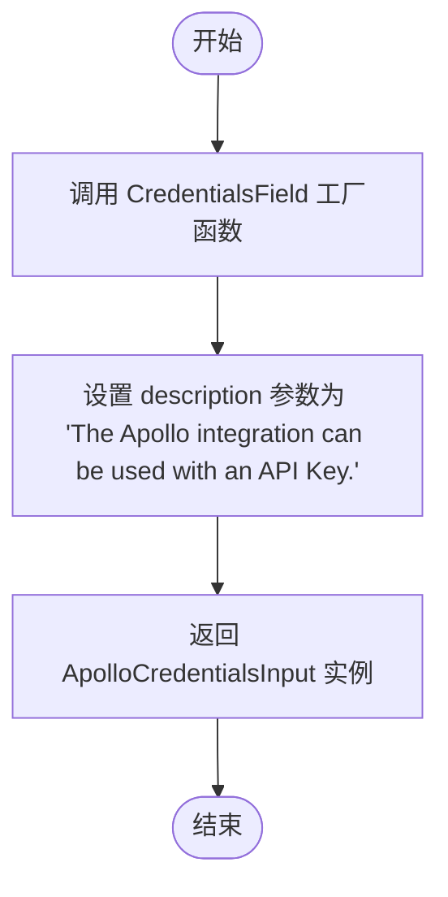

# `AutoGPT\autogpt_platform\backend\backend\blocks\apollo\_auth.py` 详细设计文档

该代码定义了Apollo集成服务所需的凭证模型、测试数据和辅助工厂函数，通过类型别名和泛型特化将基础凭证类适配为Apollo专用结构，实现了凭证数据的封装与输入字段的生成。

## 整体流程


## 类结构

```
APIKeyCredentials (外部依赖)
└── ApolloCredentials (类型别名)
CredentialsMetaInput (外部依赖)
└── ApolloCredentialsInput (泛型特化)
```

## 全局变量及字段


### `TEST_CREDENTIALS`
    
用于测试目的的模拟 Apollo API Key 凭证对象，包含预定义的 ID、Provider 和 API Key。

类型：`APIKeyCredentials`
    


### `TEST_CREDENTIALS_INPUT`
    
用于测试目的的模拟 Apollo 凭证输入数据字典，包含 Provider、ID、类型和标题信息。

类型：`dict`
    


    

## 全局函数及方法


### `ApolloCredentialsField`

该函数用于创建一个 Apollo 凭据输入字段，并将其附加到 Block 上，以便配置 Apollo 集成所需的 API Key。

参数：

-  无

返回值：`ApolloCredentialsInput`，表示生成的 Apollo 凭据输入对象。

#### 流程图



#### 带注释源码

```python
def ApolloCredentialsField() -> ApolloCredentialsInput:
    """
    Creates a Apollo credentials input on a block.
    """
    # 调用 CredentialsField 函数，传入关于 Apollo API Key 的描述信息
    # 返回一个用于在 Block 上配置 Apollo 凭据的输入字段对象
    return CredentialsField(
        description="The Apollo integration can be used with an API Key.",
    )
```


## 关键组件


### ApolloCredentials
定义 Apollo 提供商的凭证类型，本质上是 `APIKeyCredentials` 的类型别名，用于存储 API 密钥相关的凭证信息。

### ApolloCredentialsInput
定义 Apollo 凭证的输入验证模型，通过 Pydantic 的泛型类型限制，确保输入数据的 provider 为 "apollo" 且凭证类型为 "api_key"。

### ApolloCredentialsField
一个工厂函数，用于创建并返回 Apollo 凭证输入字段，该字段用于在集成块中配置和展示 API 密钥输入。

### TEST_CREDENTIALS & TEST_CREDENTIALS_INPUT
用于测试的模拟数据，包含一个预定义的 `APIKeyCredentials` 实例及其对应的字典格式输入，用于开发和测试环境中验证逻辑。


## 问题及建议


### 已知问题

-   **文档语法错误**：函数 `ApolloCredentialsField` 的文档字符串中使用了 "a Apollo"，不符合英语语法规则，应改为 "an Apollo"。
-   **测试数据污染生产代码**：在模块级别定义了 `TEST_CREDENTIALS` 和 `TEST_CREDENTIALS_INPUT`，将模拟/测试数据与核心业务逻辑混在一起，这可能会导致命名空间污染，并在打包或部署时包含不必要的数据。
-   **类型别名缺乏封装**：`ApolloCredentials` 仅仅是 `APIKeyCredentials` 的直接别名，未提供任何针对 Apollo 特定逻辑的验证或封装，若未来 Apollo 需要特定字段（如非 API Key 的认证方式），此设计可能需要重构。

### 优化建议

-   **分离测试数据**：将 `TEST_CREDENTIALS` 和 `TEST_CREDENTIALS_INPUT` 移动到专门的测试文件（如 `test_fixtures.py` 或 `conftest.py`）中，保持业务代码的纯净性和安全性。
-   **显式导出控制**：添加 `__all__` 列表，明确声明模块对外暴露的公共接口（如 `ApolloCredentials`, `ApolloCredentialsField`），避免内部实现细节（如测试常量）被外部导入。
-   **增强文档注释**：修正文档字符串中的语法错误，并补充关于 `ApolloCredentialsField` 返回值类型及其在 Block 中如何使用的更详细说明。


## 其它


### 设计目标与约束

本代码的主要设计目标是构建一套类型安全、可复用且安全的凭证定义系统，用于 Apollo 提供商的集成。具体的设计目标与约束如下：

1.  **类型安全与强约束**：利用 Python 的 `typing` 模块和 Pydantic 的严格类型检查，确保 `provider` 字段严格限定为 "apollo"，`type` 字段限定为 "api_key"，防止运行时因配置错误导致的问题。
2.  **敏感信息保护**：强制规定 API Key 必须使用 `pydantic.SecretStr` 类型封装。该类型确保在日志打印、调试输出或标准字符串表示中，敏感的密钥信息不会被明文显示。
3.  **框架契约一致性**：必须继承或符合 `backend.data.model` 中定义的基础凭证结构（`APIKeyCredentials`），以保证系统能通过统一的接口处理不同提供商的凭证。
4.  **声明式配置**：通过 `ApolloCredentialsField` 函数封装 Pydantic Field 的生成逻辑，隐藏复杂的配置细节，为上层 Block 提供简洁的声明式接口。

### 错误处理与异常设计

本模块作为数据定义层，其错误处理策略主要依赖于 Pydantic 的验证机制，而非显式的 `try-catch` 块：

1.  **验证异常（ValidationError）**：当传入的字典或对象不符合 `ApolloCredentialsInput` 的 Schema 定义时（例如缺少 `api_key`、`provider` 名称错误或类型不匹配），Pydantic 将在实例化时抛出 `pydantic.ValidationError`。
2.  **异常传播**：本模块不捕获该异常，而是将其向上抛出给调用方（如 Block 执行引擎或 API 层），由上层决定如何向用户反馈具体的字段错误信息。
3.  **类型不兼容**：如果尝试将非字符串类型赋值给强类型字段，Pydantic 会尝试进行类型转换，若失败则同样抛出验证错误。

### 数据流与状态机

**数据流**：

1.  **输入阶段**：用户或系统通过 UI/API 输入原始凭证数据（通常是 JSON 字典）。
2.  **验证与转换阶段**：数据传入 `ApolloCredentialsInput` 进行结构验证。通过后，系统利用 `CredentialsField` 生成对应的表单字段或存储模型。
3.  **存储阶段**：验证后的数据被实例化为 `ApolloCredentials` 对象，其中 `api_key` 被转换为 `SecretStr` 对象进行安全存储。
4.  **使用阶段**：在集成块运行时，通过访问凭证对象的属性获取 `api_key`（此时需调用 `get_secret_value()` 解密）以发起外部 API 请求。

**状态机**：

凭证对象本身通常是无状态的，但从生命周期角度看，包含以下状态：
*   **未验证**：原始数据输入，未经过 Schema 检查。
*   **已激活**：通过验证，封装为对象，可供使用。
*   **已过期**：如果 `expires_at` 字段被设置且当前时间已过，该凭证应被视为失效（逻辑层面）。

### 外部依赖与接口契约

**外部依赖**：

1.  **Pydantic (`pydantic`)**：核心依赖，提供 `BaseModel`、`SecretStr` 和数据验证功能。
2.  **内部数据模型 (`backend.data.model`)**：依赖 `APIKeyCredentials` 作为基类，依赖 `CredentialsField` 和 `CredentialsMetaInput` 用于构建输入字段和元数据。
3.  **集成提供者定义 (`backend.integrations.providers`)**：依赖 `ProviderName` 枚举来标准化提供商名称。

**接口契约**：

1.  **`ApolloCredentialsField` 契约**：
    *   **输入**：无参数。
    *   **输出**：返回一个 Pydantic `ModelField` 或兼容的对象，该对象必须包含 `description` 属性，且内部逻辑正确配置了 `CredentialsMetaInput`。
    *   **副作用**：无。
2.  **凭证存储契约**：任何存储 `ApolloCredentials` 的系统必须能够处理 `SecretStr` 类型的序列化和反序列化，通常要求支持 Pydantic 的自定义编码器。

### 安全与合规

1.  **数据保密性**：通过 `SecretStr` 确保 API Key 不会在 Debug 日志、Admin 后台列表展示或 JSON 序列化中意外泄露。只有在显式调用 `.get_secret_value()` 时才会暴露明文。
2.  **测试数据隔离**：`TEST_CREDENTIALS` 和 `TEST_CREDENTIALS_INPUT` 定义为全局常量用于模拟测试，需确保生产环境构建或部署流程中排除这些硬编码的 Mock 数据，避免安全风险。
3.  **最小权限原则**：凭证设计仅包含 API Key，不包含用户名/密码等其它可能泄露更多上下文的信息，符合最小权限原则。

    