# `.\AutoGPT\autogpt_platform\backend\backend\blocks\apollo\models.py` 详细设计文档

The code defines a series of data models using Pydantic's BaseModel for Apollo, a platform for finding and engaging with potential customers and business partners.

## 整体流程

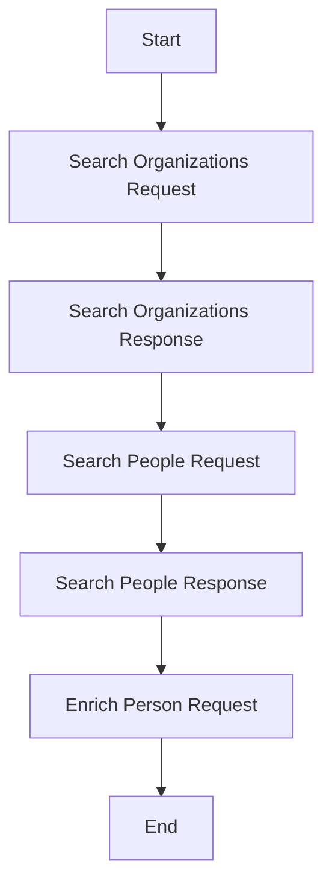

## 类结构

```
BaseModel (抽象基类)
├── PrimaryPhone
├── SenorityLevels (枚举)
├── ContactEmailStatuses (枚举)
├── RuleConfigStatus
├── ContactCampaignStatus
├── Account
├── ContactEmail
├── EmploymentHistory
├── Breadcrumb
├── TypedCustomField
├── Pagination
├── DialerFlags
├── PhoneNumber
├── Organization
├── Contact
├── SearchOrganizationsRequest
├── SearchOrganizationsResponse
├── SearchPeopleRequest
└── SearchPeopleResponse
```

## 全局变量及字段


### `number`
    
The phone number of the primary phone.

类型：`Optional[str]`
    


### `source`
    
The source of the primary phone number.

类型：`Optional[str]`
    


### `sanitized_number`
    
The sanitized phone number of the primary phone.

类型：`Optional[str]`
    


### `PrimaryPhone.number`
    
The phone number of the primary phone.

类型：`Optional[str]`
    


### `PrimaryPhone.source`
    
The source of the primary phone number.

类型：`Optional[str]`
    


### `PrimaryPhone.sanitized_number`
    
The sanitized phone number of the primary phone.

类型：`Optional[str]`
    
    

## 全局函数及方法


### `EnrichPersonRequest`

This class represents a request for Apollo's person enrichment API. It is used to provide information about a person to be enriched with additional data.

参数：

- `person_id`：`Optional[str]`，Apollo person ID to enrich (most accurate method)
- `first_name`：`Optional[str]`，First name of the person to enrich
- `last_name`：`Optional[str]`，Last name of the person to enrich
- `name`：`Optional[str]`，Full name of the person to enrich
- `email`：`Optional[str]`，Email address of the person to enrich
- `domain`：`Optional[str]`，Company domain of the person to enrich
- `company`：`Optional[str]`，Company name of the person to enrich
- `linkedin_url`：`Optional[str]`，LinkedIn URL of the person to enrich
- `organization_id`：`Optional[str]`，Apollo organization ID of the person's company
- `title`：`Optional[str]`，Job title of the person to enrich

返回值：`None`，This class is used for request purposes and does not return a value.

#### 流程图

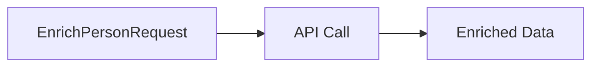

#### 带注释源码

```
class EnrichPersonRequest(BaseModel):
    person_id: Optional[str] = SchemaField(
        description="Apollo person ID to enrich (most accurate method)",
        default="",
    )
    first_name: Optional[str] = SchemaField(
        description="First name of the person to enrich",
        default="",
    )
    last_name: Optional[str] = SchemaField(
        description="Last name of the person to enrich",
        default="",
    )
    name: Optional[str] = SchemaField(
        description="Full name of the person to enrich",
        default="",
    )
    email: Optional[str] = SchemaField(
        description="Email address of the person to enrich",
        default="",
    )
    domain: Optional[str] = SchemaField(
        description="Company domain of the person to enrich",
        default="",
    )
    company: Optional[str] = SchemaField(
        description="Company name of the person to enrich",
        default="",
    )
    linkedin_url: Optional[str] = SchemaField(
        description="LinkedIn URL of the person to enrich",
        default="",
    )
    organization_id: Optional[str] = SchemaField(
        description="Apollo organization ID of the person's company",
        default="",
    )
    title: Optional[str] = SchemaField(
        description="Job title of the person to enrich",
        default="",
    )
```


### BaseModel.model_dump

This method is used to serialize the instance of the BaseModel class into a dictionary, excluding certain fields if specified.

参数：

- `*args`：可变参数，用于传递额外的参数给父类`OriginalBaseModel`的`model_dump`方法。
- `exclude`：`set[str] | None`，指定要排除的字段集合。默认排除`credentials`字段。
- `**kwargs`：关键字参数，用于传递额外的参数给父类`OriginalBaseModel`的`model_dump`方法。

返回值：`dict`，包含模型实例的序列化数据。

#### 流程图

```mermaid
graph LR
A[Start] --> B{Check exclude}
B -->|exclude is None| C[Set exclude to {"credentials"}]
B -->|exclude is not None| C1[Add "credentials" to exclude]
C --> D[Set kwargs]
D --> E[Call super().model_dump]
E --> F[Return serialized data]
F --> G[End]
```

#### 带注释源码

```python
from pydantic import BaseModel as OriginalBaseModel
from pydantic import ConfigDict

class BaseModel(OriginalBaseModel):
    def model_dump(self, *args, exclude: set[str] | None = None, **kwargs):
        if exclude is None:
            exclude = set("credentials")
        else:
            exclude.add("credentials")

        kwargs.setdefault("exclude_none", True)
        kwargs.setdefault("exclude_unset", True)
        kwargs.setdefault("exclude_defaults", True)
        return super().model_dump(*args, exclude=exclude, **kwargs)
```


### `PrimaryPhone`

`PrimaryPhone` 是一个 Pydantic 模型，用于表示 Apollo 中的主要电话信息。

参数：

- `number`：`Optional[str]`，电话号码
- `source`：`Optional[str]`，电话号码来源
- `sanitized_number`：`Optional[str]`，清洗后的电话号码

#### 流程图

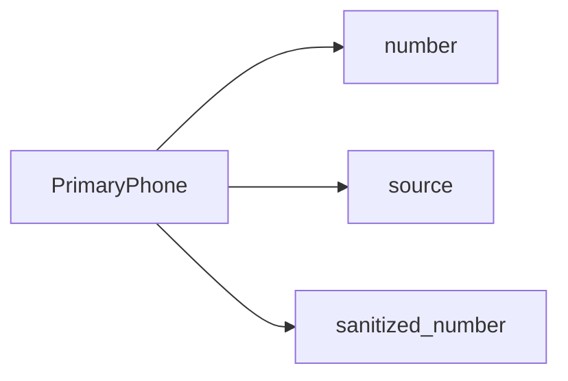

#### 带注释源码

```python
class PrimaryPhone(BaseModel):
    """A primary phone in Apollo"""

    number: Optional[str] = ""
    source: Optional[str] = ""
    sanitized_number: Optional[str] = ""
``` 


### `SenorityLevels`

`SenorityLevels` 是一个继承自 `str` 的枚举类，用于定义 Apollo 平台中的不同职位级别。

参数：

- 无

返回值：`str`，表示 Apollo 平台中的职位级别

#### 流程图


#### 带注释源码

```python
class SenorityLevels(str, Enum):
    """Seniority levels in Apollo"""

    OWNER = "owner"
    FOUNDER = "founder"
    C_SUITE = "c_suite"
    PARTNER = "partner"
    VP = "vp"
    HEAD = "head"
    DIRECTOR = "director"
    MANAGER = "manager"
    SENIOR = "senior"
    ENTRY = "entry"
    INTERN = "intern"
```


### ContactEmailStatuses

ContactEmailStatuses is an enumeration class that defines the possible statuses of a contact email in the Apollo system.

参数：

- 无参数

返回值：`str`，表示联系人的电子邮件状态

#### 流程图

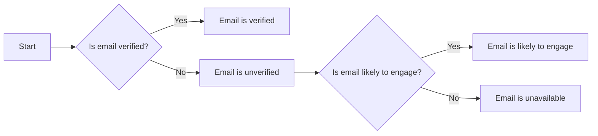

#### 带注释源码

```python
class ContactEmailStatuses(str, Enum):
    """Contact email statuses in Apollo"""

    VERIFIED = "verified"
    UNVERIFIED = "unverified"
    LIKELY_TO_ENGAGE = "likely_to_engage"
    UNAVAILABLE = "unavailable"
```


### RuleConfigStatus

A rule config status in Apollo.

参数：

- `_id`：`Optional[str]`，The unique identifier for the rule config status.
- `created_at`：`Optional[str]`，The timestamp when the rule config status was created.
- `rule_action_config_id`：`Optional[str]`，The identifier for the rule action configuration associated with the rule config status.
- `rule_config_id`：`Optional[str]`，The identifier for the rule configuration associated with the rule config status.
- `status_cd`：`Optional[str]`，The code representing the status of the rule config.
- `updated_at`：`Optional[str]`，The timestamp when the rule config status was last updated.
- `id`：`Optional[str]`，The unique identifier for the rule config status.
- `key`：`Optional[str]`，The key associated with the rule config status.

返回值：`None`，No return value.

#### 流程图

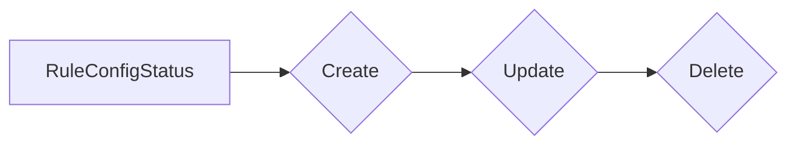

#### 带注释源码

```
class RuleConfigStatus(BaseModel):
    """A rule config status in Apollo"""

    _id: Optional[str] = ""
    created_at: Optional[str] = ""
    rule_action_config_id: Optional[str] = ""
    rule_config_id: Optional[str] = ""
    status_cd: Optional[str] = ""
    updated_at: Optional[str] = ""
    id: Optional[str] = ""
    key: Optional[str] = ""
```


### ContactCampaignStatus

A contact campaign status in Apollo.

参数：

-  `id`：`Optional[str]`，The unique identifier for the contact campaign status.
-  `emailer_campaign_id`：`Optional[str]`，The identifier for the emailer campaign associated with the contact campaign status.
-  `send_email_from_user_id`：`Optional[str]`，The identifier for the user who sent the email.
-  `inactive_reason`：`Optional[str]`，The reason why the contact campaign is inactive.
-  `status`：`Optional[str]`，The status of the contact campaign.
-  `added_at`：`Optional[str]`，The date and time when the contact campaign was added.
-  `added_by_user_id`：`Optional[str]`，The identifier for the user who added the contact campaign.
-  `finished_at`：`Optional[str]`，The date and time when the contact campaign was finished.
-  `paused_at`：`Optional[str]`，The date and time when the contact campaign was paused.
-  `auto_unpause_at`：`Optional[str]`，The date and time when the contact campaign will automatically unpause.
-  `send_email_from_email_address`：`Optional[str]`，The email address from which the email was sent.
-  `send_email_from_email_account_id`：`Optional[str]`，The identifier for the email account from which the email was sent.
-  `manually_set_unpause`：`Optional[str]`，Indicates whether the unpause was manually set.
-  `failure_reason`：`Optional[str]`，The reason for the failure of the contact campaign.
-  `current_step_id`：`Optional[str]`，The identifier for the current step in the contact campaign.
-  `in_response_to_emailer_message_id`：`Optional[str]`，The identifier for the emailer message that triggered the contact campaign.
-  `cc_emails`：`Optional[str]`，The email addresses to CC in the email.
-  `bcc_emails`：`Optional[str]`，The email addresses to BCC in the email.
-  `to_emails`：`Optional[str]`，The email addresses to send the email to.

返回值：`None`，This class does not have a return value.

#### 流程图

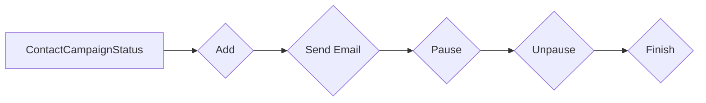

#### 带注释源码

```
class ContactCampaignStatus(BaseModel):
    """A contact campaign status in Apollo"""

    id: Optional[str] = ""
    emailer_campaign_id: Optional[str] = ""
    send_email_from_user_id: Optional[str] = ""
    inactive_reason: Optional[str] = ""
    status: Optional[str] = ""
    added_at: Optional[str] = ""
    added_by_user_id: Optional[str] = ""
    finished_at: Optional[str] = ""
    paused_at: Optional[str] = ""
    auto_unpause_at: Optional[str] = ""
    send_email_from_email_address: Optional[str] = ""
    send_email_from_email_account_id: Optional[str] = ""
    manually_set_unpause: Optional[str] = ""
    failure_reason: Optional[str] = ""
    current_step_id: Optional[str] = ""
    in_response_to_emailer_message_id: Optional[str] = ""
    cc_emails: Optional[str] = ""
    bcc_emails: Optional[str] = ""
    to_emails: Optional[str] = ""
```


### Account

An account in Apollo

参数：

- `id`：`Optional[str]`，The unique identifier for the account
- `name`：`Optional[str]`，The name of the account
- `website_url`：`Optional[str]`，The website URL of the account
- `blog_url`：`Optional[str]`，The blog URL of the account
- `angellist_url`：`Optional[str]`，The AngelList URL of the account
- `linkedin_url`：`Optional[str]`，The LinkedIn URL of the account
- `twitter_url`：`Optional[str]`，The Twitter URL of the account
- `facebook_url`：`Optional[str]`，The Facebook URL of the account
- `primary_phone`：`Optional[PrimaryPhone]`，The primary phone information of the account
- `languages`：`Optional[list[str]]`，The languages spoken by the account
- `alexa_ranking`：`Optional[int]`，The Alexa ranking of the account
- `phone`：`Optional[str]`，The phone number of the account
- `linkedin_uid`：`Optional[str]`，The LinkedIn UID of the account
- `founded_year`：`Optional[int]`，The year the account was founded
- `publicly_traded_symbol`：`Optional[str]`，The publicly traded symbol of the account
- `publicly_traded_exchange`：`Optional[str]`，The publicly traded exchange of the account
- `logo_url`：`Optional[str]`，The logo URL of the account
- `chrunchbase_url`：`Optional[str]`，The Crunchbase URL of the account
- `primary_domain`：`Optional[str]`，The primary domain of the account
- `domain`：`Optional[str]`，The domain of the account
- `team_id`：`Optional[str]`，The team ID associated with the account
- `organization_id`：`Optional[str]`，The organization ID associated with the account
- `account_stage_id`：`Optional[str]`，The account stage ID associated with the account
- `source`：`Optional[str]`，The source of the account
- `original_source`：`Optional[str]`，The original source of the account
- `creator_id`：`Optional[str]`，The ID of the creator of the account
- `owner_id`：`Optional[str]`，The ID of the owner of the account
- `created_at`：`Optional[str]`，The date and time the account was created
- `phone_status`：`Optional[str]`，The status of the phone number
- `hubspot_id`：`Optional[str]`，The HubSpot ID of the account
- `salesforce_id`：`Optional[str]`，The Salesforce ID of the account
- `crm_owner_id`：`Optional[str]`，The CRM owner ID of the account
- `parent_account_id`：`Optional[str]`，The parent account ID of the account
- `sanitized_phone`：`Optional[str]`，The sanitized phone number of the account
- `account_playbook_statues`：`Optional[list[Any]]`，The account playbook statuses
- `account_rule_config_statuses`：`Optional[list[RuleConfigStatus]]`，The account rule config statuses
- `existence_level`：`Optional[str]`，The existence level of the account
- `label_ids`：`Optional[list[str]]`，The label IDs associated with the account
- `typed_custom_fields`：`Optional[Any]`，The typed custom fields of the account
- `custom_field_errors`：`Optional[Any]`，The custom field errors of the account
- `modality`：`Optional[str]`，The modality of the account
- `source_display_name`：`Optional[str]`，The display name of the source
- `salesforce_record_id`：`Optional[str]`，The Salesforce record ID of the account
- `crm_record_url`：`Optional[str]`，The CRM record URL of the account

返回值：`None`，No return value

#### 流程图

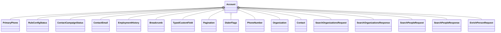

#### 带注释源码

```
class Account(BaseModel):
    """An account in Apollo"""

    id: Optional[str] = ""
    name: Optional[str] = ""
    website_url: Optional[str] = ""
    blog_url: Optional[str] = ""
    angellist_url: Optional[str] = ""
    linkedin_url: Optional[str] = ""
    twitter_url: Optional[str] = ""
    facebook_url: Optional[str] = ""
    primary_phone: Optional[PrimaryPhone] = PrimaryPhone()
    languages: Optional[list[str]] = []
    alexa_ranking: Optional[int] = 0
    phone: Optional[str] = ""
    linkedin_uid: Optional[str] = ""
    founded_year: Optional[int] = 0
    publicly_traded_symbol: Optional[str] = ""
    publicly_traded_exchange: Optional[str] = ""
    logo_url: Optional[str] = ""
    chrunchbase_url: Optional[str] = ""
    primary_domain: Optional[str] = ""
    domain: Optional[str] = ""
    team_id: Optional[str] = ""
    organization_id: Optional[str] = ""
    account_stage_id: Optional[str] = ""
    source: Optional[str] = ""
    original_source: Optional[str] = ""
    creator_id: Optional[str] = ""
    owner_id: Optional[str] = ""
    created_at: Optional[str] = ""
    phone_status: Optional[str] = ""
    hubspot_id: Optional[str] = ""
    salesforce_id: Optional[str] = ""
    crm_owner_id: Optional[str] = ""
    parent_account_id: Optional[str] = ""
    sanitized_phone: Optional[str] = ""
    account_playbook_statues: Optional[list[Any]] = []
    account_rule_config_statuses: Optional[list[RuleConfigStatus]] = []
    existence_level: Optional[str] = ""
    label_ids: Optional[list[str]] = []
    typed_custom_fields: Optional[Any] = {}
    custom_field_errors: Optional[Any] = {}
    modality: Optional[str] = ""
    source_display_name: Optional[str] = ""
    salesforce_record_id: Optional[str] = ""
    crm_record_url: Optional[str] = ""
```


### ContactEmail.email_needs_tickling

This method checks if the email needs to be tickled (i.e., if it needs further processing or verification).

参数：

-  `self`：`ContactEmail` 对象，表示当前联系人电子邮件对象
-  ...

返回值：`bool`，表示电子邮件是否需要被tickled

#### 流程图

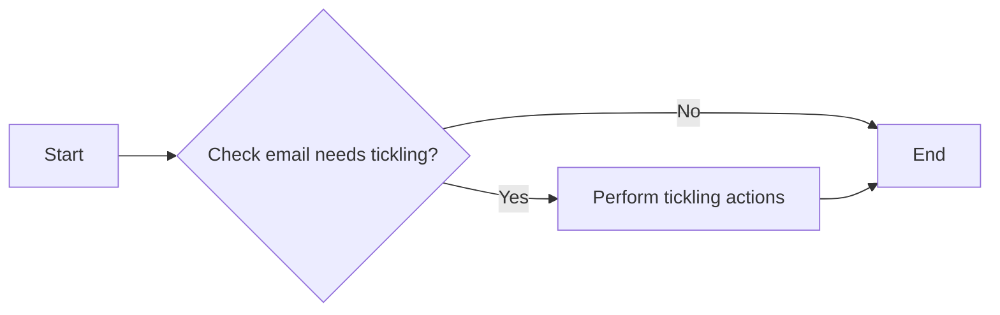

#### 带注释源码

```python
class ContactEmail(BaseModel):
    """A contact email in Apollo"""

    email: Optional[str] = ""
    email_md5: Optional[str] = ""
    email_sha256: Optional[str] = ""
    email_status: Optional[str] = ""
    email_source: Optional[str] = ""
    extrapolated_email_confidence: Optional[str] = ""
    position: Optional[int] = 0
    email_from_customer: Optional[str] = ""
    free_domain: Optional[bool] = True

    def email_needs_tickling(self):
        # Check if the email needs to be tickled
        if self.email_status == "unverified":
            return True
        return False
```


### EmploymentHistory

An employment history in Apollo.

参数：

- `_id`：`Optional[str]`，The unique identifier for the employment history.
- `created_at`：`Optional[str]`，The date and time when the employment history was created.
- `current`：`Optional[bool]`，Indicates whether the employment is the current one.
- `degree`：`Optional[str]`，The degree obtained during the employment.
- `description`：`Optional[str]`，A description of the employment.
- `emails`：`Optional[str]`，Email addresses associated with the employment.
- `end_date`：`Optional[str]`，The end date of the employment.
- `grade_level`：`Optional[str]`，The grade level during the employment.
- `kind`：`Optional[str]`，The kind of employment.
- `major`：`Optional[str]`，The major studied during the employment.
- `organization_id`：`Optional[str]`，The ID of the organization where the employment occurred.
- `organization_name`：`Optional[str]`，The name of the organization where the employment occurred.
- `raw_address`：`Optional[str]`，The raw address of the organization where the employment occurred.
- `start_date`：`Optional[str]`，The start date of the employment.
- `title`：`Optional[str]`，The title of the employment.
- `updated_at`：`Optional[str]`，The date and time when the employment history was last updated.
- `id`：`Optional[str]`，The unique identifier for the employment history.
- `key`：`Optional[str]`，The key associated with the employment history.

返回值：无

#### 流程图

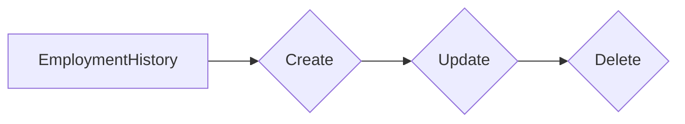

#### 带注释源码

```
class EmploymentHistory(BaseModel):
    """An employment history in Apollo"""

    model_config = ConfigDict(
        extra="allow",
        arbitrary_types_allowed=True,
        from_attributes=True,
        populate_by_name=True,
    )

    _id: Optional[str] = ""
    created_at: Optional[str] = ""
    current: Optional[bool] = False
    degree: Optional[str] = ""
    description: Optional[str] = ""
    emails: Optional[str] = ""
    end_date: Optional[str] = ""
    grade_level: Optional[str] = ""
    kind: Optional[str] = ""
    major: Optional[str] = ""
    organization_id: Optional[str] = ""
    organization_name: Optional[str] = ""
    raw_address: Optional[str] = ""
    start_date: Optional[str] = ""
    title: Optional[str] = ""
    updated_at: Optional[str] = ""
    id: Optional[str] = ""
    key: Optional[str] = ""
```


### Breadcrumb

A breadcrumb in Apollo

参数：

- `label`：`Optional[str]`，The label of the breadcrumb
- `signal_field_name`：`Optional[str]`，The field name of the signal
- `value`：`str | list | None`，The value of the breadcrumb
- `display_name`：`Optional[str]`，The display name of the breadcrumb

返回值：无

#### 流程图

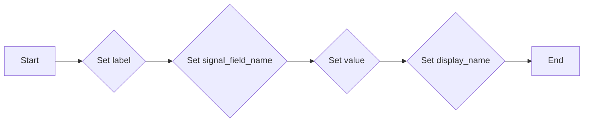

#### 带注释源码

```python
class Breadcrumb(BaseModel):
    """A breadcrumb in Apollo"""

    label: Optional[str] = ""
    signal_field_name: Optional[str] = ""
    value: str | list | None = ""
    display_name: Optional[str] = ""
```


### TypedCustomField

A typed custom field in Apollo.

参数：

-  `id`：`Optional[str]`，The unique identifier for the typed custom field.
-  `value`：`Optional[str]`，The value of the typed custom field.

返回值：无

#### 流程图

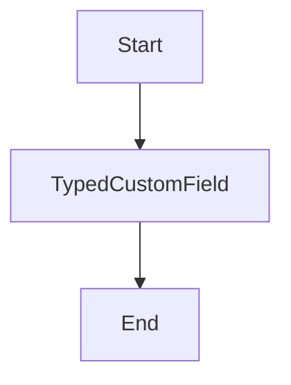

#### 带注释源码

```python
class TypedCustomField(BaseModel):
    """A typed custom field in Apollo"""

    id: Optional[str] = ""
    value: Optional[str] = ""
```


### Pagination

Pagination provides pagination information for a dataset.

参数：

- `page`：`int`，当前页码
- `per_page`：`int`，每页显示的条目数
- `total_entries`：`int`，总条目数
- `total_pages`：`int`，总页数

返回值：`Pagination`，包含分页信息的对象

#### 流程图

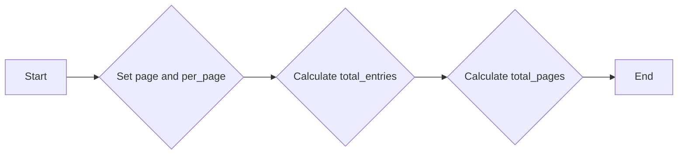

#### 带注释源码

```python
class Pagination(BaseModel):
    """Pagination in Apollo"""

    model_config = ConfigDict(
        extra="allow",
        arbitrary_types_allowed=True,
        from_attributes=True,
        populate_by_name=True,
    )

    page: int = 0
    per_page: int = 0
    total_entries: int = 0
    total_pages: int = 0
```


### DialerFlags

A dialer flags in Apollo

参数：

- `country_name`：`Optional[str]`，Country name for dialer flags
- `country_enabled`：`Optional[bool]`，Flag indicating if country is enabled for dialer
- `high_risk_calling_enabled`：`Optional[bool]`，Flag indicating if high risk calling is enabled for dialer
- `potential_high_risk_number`：`Optional[bool]`，Flag indicating if potential high risk number is enabled for dialer

返回值：无

#### 流程图

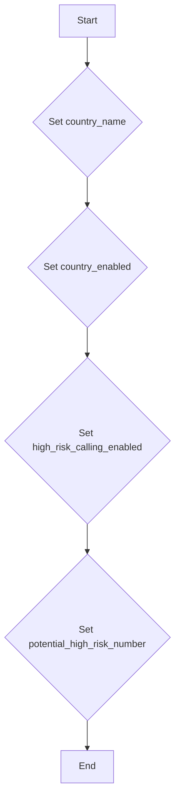

#### 带注释源码

```python
class DialerFlags(BaseModel):
    """A dialer flags in Apollo"""

    country_name: Optional[str] = ""
    country_enabled: Optional[bool] = True
    high_risk_calling_enabled: Optional[bool] = True
    potential_high_risk_number: Optional[bool] = True
```


### PhoneNumber.model_dump

This method is a custom implementation of the `model_dump` method from the `pydantic` library, which is overridden to exclude the `credentials` field from the serialized output.

参数：

- `*args`：可变参数，传递给基类 `model_dump` 方法的参数。
- `exclude`：`set[str]`，一个包含要排除的字段的集合。
- `**kwargs`：关键字参数，传递给基类 `model_dump` 方法的参数。

返回值：`str`，一个包含模型数据的字符串表示。

#### 流程图

```mermaid
graph LR
A[开始] --> B{检查 exclude 是否为 None}
B -- 是 --> C[添加 "credentials" 到 exclude]
B -- 否 --> C
C --> D[调用 super().model_dump(*args, exclude=exclude, **kwargs)]
D --> E[返回结果]
E --> F[结束]
```

#### 带注释源码

```python
from pydantic import BaseModel as OriginalBaseModel
from pydantic import ConfigDict

class PhoneNumber(BaseModel):
    # ... 其他字段和方法 ...

    def model_dump(self, *args, exclude: set[str] | None = None, **kwargs):
        if exclude is None:
            exclude = set("credentials")
        else:
            exclude.add("credentials")

        kwargs.setdefault("exclude_none", True)
        kwargs.setdefault("exclude_unset", True)
        kwargs.setdefault("exclude_defaults", True)
        return super().model_dump(*args, exclude=exclude, **kwargs)
```


### Organization

An organization in Apollo

参数：

-  `id`：`Optional[str]`，The unique identifier for the organization
-  `name`：`Optional[str]`，The name of the organization
-  `website_url`：`Optional[str]`，The website URL of the organization
-  `blog_url`：`Optional[str]`，The blog URL of the organization
-  `angellist_url`：`Optional[str]`，The AngelList URL of the organization
-  `linkedin_url`：`Optional[str]`，The LinkedIn URL of the organization
-  `twitter_url`：`Optional[str]`，The Twitter URL of the organization
-  `facebook_url`：`Optional[str]`，The Facebook URL of the organization
-  `primary_phone`：`Optional[PrimaryPhone]`，The primary phone of the organization
-  `languages`：`Optional[list[str]]`，The languages spoken by the organization
-  `alexa_ranking`：`Optional[int]`，The Alexa ranking of the organization
-  `phone`：`Optional[str]`，The phone number of the organization
-  `linkedin_uid`：`Optional[str]`，The LinkedIn UID of the organization
-  `founded_year`：`Optional[int]`，The year the organization was founded
-  `publicly_traded_symbol`：`Optional[str]`，The publicly traded symbol of the organization
-  `publicly_traded_exchange`：`Optional[str]`，The publicly traded exchange of the organization
-  `logo_url`：`Optional[str]`，The logo URL of the organization
-  `chrunchbase_url`：`Optional[str]`，The Crunchbase URL of the organization
-  `primary_domain`：`Optional[str]`，The primary domain of the organization
-  `sanitized_phone`：`Optional[str]`，The sanitized phone number of the organization
-  `owned_by_organization_id`：`Optional[str]`，The ID of the organization that owns this organization
-  `intent_strength`：`Optional[str]`，The strength of the intent of the organization
-  `show_intent`：`Optional[bool]`，Whether to show the intent of the organization
-  `has_intent_signal_account`：`Optional[bool]`，Whether the organization has an intent signal account
-  `intent_signal_account`：`Optional[str]`，The intent signal account of the organization

返回值：`None`，No return value

#### 流程图

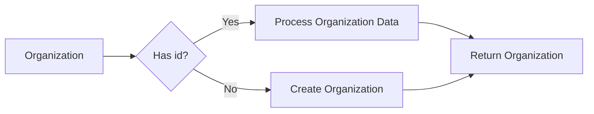

#### 带注释源码

```
class Organization(BaseModel):
    """An organization in Apollo"""

    model_config = ConfigDict(
        extra="allow",
        arbitrary_types_allowed=True,
        from_attributes=True,
        populate_by_name=True,
    )

    id: Optional[str] = ""
    name: Optional[str] = ""
    website_url: Optional[str] = ""
    blog_url: Optional[str] = ""
    angellist_url: Optional[str] = ""
    linkedin_url: Optional[str] = ""
    twitter_url: Optional[str] = ""
    facebook_url: Optional[str] = ""
    primary_phone: Optional[PrimaryPhone] = PrimaryPhone()
    languages: Optional[list[str]] = []
    alexa_ranking: Optional[int] = 0
    phone: Optional[str] = ""
    linkedin_uid: Optional[str] = ""
    founded_year: Optional[int] = 0
    publicly_traded_symbol: Optional[str] = ""
    publicly_traded_exchange: Optional[str] = ""
    logo_url: Optional[str] = ""
    chrunchbase_url: Optional[str] = ""
    primary_domain: Optional[str] = ""
    sanitized_phone: Optional[str] = ""
    owned_by_organization_id: Optional[str] = ""
    intent_strength: Optional[str] = ""
    show_intent: Optional[bool] = True
    has_intent_signal_account: Optional[bool] = True
    intent_signal_account: Optional[str] = ""
```


### `EnrichPersonRequest`

This class represents a request for Apollo's person enrichment API. It is used to provide information about a person to be enriched with additional data.

参数：

- `person_id`：`Optional[str]`，Apollo person ID to enrich (most accurate method)
- `first_name`：`Optional[str]`，First name of the person to enrich
- `last_name`：`Optional[str]`，Last name of the person to enrich
- `name`：`Optional[str]`，Full name of the person to enrich
- `email`：`Optional[str]`，Email address of the person to enrich
- `domain`：`Optional[str]`，Company domain of the person to enrich
- `company`：`Optional[str]`，Company name of the person to enrich
- `linkedin_url`：`Optional[str]`，LinkedIn URL of the person to enrich
- `organization_id`：`Optional[str]`，Apollo organization ID of the person's company
- `title`：`Optional[str]`，Job title of the person to enrich

返回值：`None`，This class is used for constructing requests and does not return any value.

#### 流程图

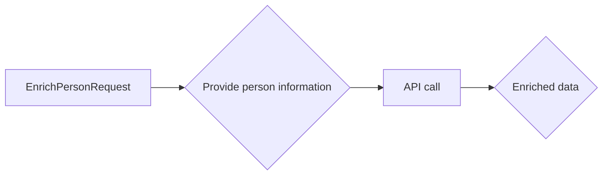

#### 带注释源码

```
class EnrichPersonRequest(BaseModel):
    person_id: Optional[str] = SchemaField(
        description="Apollo person ID to enrich (most accurate method)",
        default="",
    )
    first_name: Optional[str] = SchemaField(
        description="First name of the person to enrich",
        default="",
    )
    last_name: Optional[str] = SchemaField(
        description="Last name of the person to enrich",
        default="",
    )
    name: Optional[str] = SchemaField(
        description="Full name of the person to enrich",
        default="",
    )
    email: Optional[str] = SchemaField(
        description="Email address of the person to enrich",
        default="",
    )
    domain: Optional[str] = SchemaField(
        description="Company domain of the person to enrich",
        default="",
    )
    company: Optional[str] = SchemaField(
        description="Company name of the person to enrich",
        default="",
    )
    linkedin_url: Optional[str] = SchemaField(
        description="LinkedIn URL of the person to enrich",
        default="",
    )
    organization_id: Optional[str] = SchemaField(
        description="Apollo organization ID of the person's company",
        default="",
    )
    title: Optional[str] = SchemaField(
        description="Job title of the person to enrich",
        default="",
    )
```


### SearchOrganizationsRequest

This class represents the request for Apollo's search organizations API. It contains various parameters that can be used to filter and search for organizations based on different criteria.

参数：

- organization_num_employees_range：`list[int]`，The number range of employees working for the company. This enables you to find companies based on headcount. You can add multiple ranges to expand your search results.
- organization_locations：`list[str]`，The location of the company headquarters. You can search across cities, US states, and countries.
- organizations_not_locations：`list[str]`，Exclude companies from search results based on the location of the company headquarters.
- q_organization_keyword_tags：`list[str]`，Filter search results based on keywords associated with companies.
- q_organization_name：`str`，Filter search results to include a specific company name.
- organization_ids：`list[str]`，The Apollo IDs for the companies you want to include in your search results.
- max_results：`int`，The maximum number of results to return.
- page：`int`，The page number of the Apollo data that you want to retrieve.
- per_page：`int`，The number of search results that should be returned for each page.

返回值：`None`，This class does not return any value.

#### 流程图

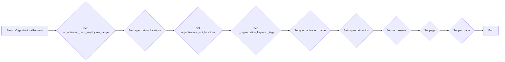

#### 带注释源码

```python
class SearchOrganizationsRequest(BaseModel):
    """Request for Apollo's search organizations API"""

    organization_num_employees_range: Optional[list[int]] = SchemaField(
        description="""The number range of employees working for the company. This enables you to find companies based on headcount. You can add multiple ranges to expand your search results.

Each range you add needs to be a string, with the upper and lower numbers of the range separated only by a comma."""
    )

    organization_locations: Optional[list[str]] = SchemaField(
        description="""The location of the company headquarters. You can search across cities, US states, and countries.

If a company has several office locations, results are still based on the headquarters location. For example, if you search chicago but a company's HQ location is in boston, any Boston-based companies will not appear in your search results, even if they match other parameters.

To exclude companies based on location, use the organization_not_locations parameter."""
    )

    organizations_not_locations: Optional[list[str]] = SchemaField(
        description="""Exclude companies from search results based on the location of the company headquarters. You can use cities, US states, and countries as locations to exclude.

This parameter is useful for ensuring you do not prospect in an undesirable territory. For example, if you use ireland as a value, no Ireland-based companies will appear in your search results."""
    )

    q_organization_keyword_tags: Optional[list[str]] = SchemaField(
        description="""Filter search results based on keywords associated with companies. For example, you can enter mining as a value to return only companies that have an association with the mining industry."""
    )

    q_organization_name: Optional[str] = SchemaField(
        description="""Filter search results to include a specific company name.

If the value you enter for this parameter does not match with a company's name, the company will not appear in search results, even if it matches other parameters. Partial matches are accepted. For example, if you filter by the value marketing, a company called NY Marketing Unlimited would still be eligible as a search result, but NY Market Analysis would not be eligible."""
    )

    organization_ids: Optional[list[str]] = SchemaField(
        description="""The Apollo IDs for the companies you want to include in your search results. Each company in the Apollo database is assigned a unique ID.

To find IDs, identify the values for organization_id when you call this endpoint."""
    )

    max_results: Optional[int] = SchemaField(
        description="""The maximum number of results to return. If you don't specify this parameter, the default is 100."""
    )

    page: int = SchemaField(
        description="""The page number of the Apollo data that you want to retrieve.

Use this parameter in combination with the per_page parameter to make search results for navigable and improve the performance of the endpoint."""
    )

    per_page: int = SchemaField(
        description="""The number of search results that should be returned for each page. Limited the number of results per page improves the endpoint's performance.

Use the page parameter to search the different pages of data."""
    )
```


### SearchOrganizationsResponse

The `SearchOrganizationsResponse` class represents the response from Apollo's search organizations API. It contains information about the search results, including pagination details, a list of organizations, and other related data.

参数：

- `breadcrumbs`：`list[Breadcrumb]`，A list of breadcrumbs that provide context about the search results.
- `partial_results_only`：`bool`，Indicates whether the search results are partial or complete.
- `has_join`：`bool`，Indicates whether the search results include joined data.
- `disable_eu_prospecting`：`bool`，Indicates whether EU prospecting is disabled.
- `partial_results_limit`：`int`，The limit for partial results.
- `pagination`：`Pagination`，Pagination details for the search results.
- `accounts`：`list[Any]`，A list of accounts related to the search results.
- `organizations`：`list[Organization]`，A list of organizations found in the search results.
- `models_ids`：`list[str]`，A list of model IDs related to the search results.
- `num_fetch_result`：`Optional[str]`，The number of results fetched.
- `derived_params`：`Optional[str]`，Derived parameters for the search results.

返回值：`None`，This class does not return any value.

#### 流程图

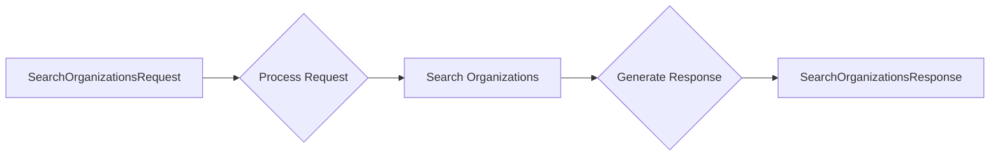

#### 带注释源码

```python
class SearchOrganizationsResponse(BaseModel):
    """Response from Apollo's search organizations API"""

    breadcrumbs: Optional[list[Breadcrumb]] = []
    partial_results_only: Optional[bool] = True
    has_join: Optional[bool] = True
    disable_eu_prospecting: Optional[bool] = True
    partial_results_limit: Optional[int] = 0
    pagination: Pagination = Pagination(
        page=0, per_page=0, total_entries=0, total_pages=0
    )
    accounts: list[Any] = []
    organizations: list[Organization] = []
    models_ids: list[str] = []
    num_fetch_result: Optional[str] = ""
    derived_params: Optional[str] = ""
```


### SearchPeopleRequest

This class represents a request for Apollo's search people API. It allows users to search for people based on various criteria such as job titles, locations, seniority levels, and organization domains.

参数：

- person_titles：`list[str]`，Job titles held by the people you want to find. For a person to be included in search results, they only need to match 1 of the job titles you add. Adding more job titles expands your search results.
- person_locations：`list[str]`，The location where people live. You can search across cities, US states, and countries.
- person_seniorities：`list[SenorityLevels]`，The job seniority that people hold within their current employer. This enables you to find people that currently hold positions at certain reporting levels, such as Director level or senior IC level.
- organization_locations：`list[str]`，The location of the company headquarters for a person's current employer. You can search across cities, US states, and countries.
- q_organization_domains：`list[str]`，The domain name for the person's employer. This can be the current employer or a previous employer. Do not include www., the @ symbol, or similar.
- contact_email_statuses：`list[ContactEmailStatuses]`，The email statuses for the people you want to find. You can add multiple statuses to expand your search.
- organization_ids：`list[str]`，The Apollo IDs for the companies (employers) you want to include in your search results. Each company in the Apollo database is assigned a unique ID.
- organization_num_employees_range：`list[int]`，The number range of employees working for the company. This enables you to find companies based on headcount. You can add multiple ranges to expand your search results.
- q_keywords：`str`，A string of words over which we want to filter the results
- page：`int`，The page number of the Apollo data that you want to retrieve.
- per_page：`int`，The number of search results that should be returned for each page.
- max_results：`int`，The maximum number of results to return.

返回值：`None`，This class is used to construct a request for the search people API and does not return any value.

#### 流程图

```mermaid
graph LR
A[SearchPeopleRequest] --> B[person_titles]
A --> C[person_locations]
A --> D[person_seniorities]
A --> E[organization_locations]
A --> F[q_organization_domains]
A --> G[contact_email_statuses]
A --> H[organization_ids]
A --> I[organization_num_employees_range]
A --> J[q_keywords]
A --> K[page]
A --> L[per_page]
A --> M[max_results]
```

#### 带注释源码

```
class SearchPeopleRequest(BaseModel):
    """Request for Apollo's search people API"""

    person_titles: Optional[list[str]] = SchemaField(
        description="""Job titles held by the people you want to find. For a person to be included in search results, they only need to match 1 of the job titles you add. Adding more job titles expands your search results.
""",
        default_factory=list,
        placeholder="marketing manager",
    )
    person_locations: Optional[list[str]] = SchemaField(
        description="""The location where people live. You can search across cities, US states, and countries.
""",
        default_factory=list,
    )
    person_seniorities: Optional[list[SenorityLevels]] = SchemaField(
        description="""The job seniority that people hold within their current employer. This enables you to find people that currently hold positions at certain reporting levels, such as Director level or senior IC level.
""",
        default_factory=list,
    )
    organization_locations: Optional[list[str]] = SchemaField(
        description="""The location of the company headquarters for a person's current employer. You can search across cities, US states, and countries.
""",
        default_factory=list,
    )
    q_organization_domains: Optional[list[str]] = SchemaField(
        description="""The domain name for the person's employer. This can be the current employer or a previous employer. Do not include www., the @ symbol, or similar.
""",
        default_factory=list,
    )
    contact_email_statuses: Optional[list[ContactEmailStatuses]] = SchemaField(
        description="""The email statuses for the people you want to find. You can add multiple statuses to expand your search.
""",
        default_factory=list,
    )
    organization_ids: Optional[list[str]] = SchemaField(
        description="""The Apollo IDs for the companies (employers) you want to include in your search results. Each company in the Apollo database is assigned a unique ID.
""",
        default_factory=list,
    )
    organization_num_employees_range: Optional[list[int]] = SchemaField(
        description="""The number range of employees working for the company. This enables you to find companies based on headcount. You can add multiple ranges to expand your search results.
""",
        default_factory=list,
    )
    q_keywords: Optional[str] = SchemaField(
        description="""A string of words over which we want to filter the results""",
        default="",
    )
    page: int = SchemaField(
        description="""The page number of the Apollo data that you want to retrieve.
""",
        default=1,
    )
    per_page: int = SchemaField(
        description="""The number of search results that should be returned for each page.
""",
        default=100,
    )
    max_results: Optional[int] = SchemaField(
        description="""The maximum number of results to return.
""",
        default=100,
        ge=1,
        le=50000,
        advanced=True,
    )
```


### SearchPeopleResponse

The `SearchPeopleResponse` class represents the response from Apollo's search people API. It contains information about the search results, including pagination details, a list of contacts, and other relevant data.

参数：

- `breadcrumbs`：`list[Breadcrumb]`，A list of breadcrumbs that provide context for the search results.
- `partial_results_only`：`bool`，Indicates whether the search results are partial or complete.
- `has_join`：`bool`，Indicates whether the search results include joined data.
- `disable_eu_prospecting`：`bool`，Indicates whether EU prospecting is disabled.
- `partial_results_limit`：`int`，The limit for partial results.
- `pagination`：`Pagination`，Pagination details for the search results.
- `contacts`：`list[Contact]`，A list of contacts that match the search criteria.
- `people`：`list[Contact]`，A list of people that match the search criteria.
- `model_ids`：`list[str]`，A list of model IDs associated with the search results.
- `num_fetch_result`：`Optional[str]`，The number of results fetched.
- `derived_params`：`Optional[str]`，Derived parameters for the search results.

返回值：`SearchPeopleResponse`，The response object containing the search results.

#### 流程图

```mermaid
graph LR
A[SearchPeopleRequest] --> B{SearchPeopleResponse}
B --> C[ProcessRequest]
C --> D{ValidateRequest}
D --> E[SearchPeople]
E --> F{FetchResults}
F --> G[FormatResults]
G --> B
```

#### 带注释源码

```python
class SearchPeopleResponse(BaseModel):
    model_config = ConfigDict(
        extra="allow",
        arbitrary_types_allowed=True,
        from_attributes=True,
        populate_by_name=True,
    )

    breadcrumbs: Optional[list[Breadcrumb]] = []
    partial_results_only: Optional[bool] = True
    has_join: Optional[bool] = True
    disable_eu_prospecting: Optional[bool] = True
    partial_results_limit: Optional[int] = 0
    pagination: Pagination = Pagination(
        page=0, per_page=0, total_entries=0, total_pages=0
    )
    contacts: list[Contact] = []
    people: list[Contact] = []
    model_ids: list[str] = []
    num_fetch_result: Optional[str] = ""
    derived_params: Optional[str] = ""
```


### EnrichPersonRequest

This class represents a request for Apollo's person enrichment API. It is used to enrich information about a person by providing various attributes such as person ID, first name, last name, full name, email, domain, company name, LinkedIn URL, organization ID, and job title.

参数：

- person_id：`Optional[str]`，Apollo person ID to enrich (most accurate method)
- first_name：`Optional[str]`，First name of the person to enrich
- last_name：`Optional[str]`，Last name of the person to enrich
- name：`Optional[str]`，Full name of the person to enrich
- email：`Optional[str]`，Email address of the person to enrich
- domain：`Optional[str]`，Company domain of the person to enrich
- company：`Optional[str]`，Company name of the person to enrich
- linkedin_url：`Optional[str]`，LinkedIn URL of the person to enrich
- organization_id：`Optional[str]`，Apollo organization ID of the person's company
- title：`Optional[str]`，Job title of the person to enrich

返回值：无

#### 流程图

```mermaid
graph LR
A[EnrichPersonRequest] --> B{Provide attributes}
B --> C{API call}
C --> D{Enriched data}
```

#### 带注释源码

```python
class EnrichPersonRequest(BaseModel):
    """Request for Apollo's person enrichment API"""

    person_id: Optional[str] = SchemaField(
        description="Apollo person ID to enrich (most accurate method)",
        default="",
    )
    first_name: Optional[str] = SchemaField(
        description="First name of the person to enrich",
        default="",
    )
    last_name: Optional[str] = SchemaField(
        description="Last name of the person to enrich",
        default="",
    )
    name: Optional[str] = SchemaField(
        description="Full name of the person to enrich",
        default="",
    )
    email: Optional[str] = SchemaField(
        description="Email address of the person to enrich",
        default="",
    )
    domain: Optional[str] = SchemaField(
        description="Company domain of the person to enrich",
        default="",
    )
    company: Optional[str] = SchemaField(
        description="Company name of the person to enrich",
        default="",
    )
    linkedin_url: Optional[str] = SchemaField(
        description="LinkedIn URL of the person to enrich",
        default="",
    )
    organization_id: Optional[str] = SchemaField(
        description="Apollo organization ID of the person's company",
        default="",
    )
    title: Optional[str] = SchemaField(
        description="Job title of the person to enrich",
        default="",
    )
```


## 关键组件


### 张量索引与惰性加载

张量索引与惰性加载是代码中用于高效处理大型数据集的关键组件。它允许在需要时才加载数据，从而减少内存消耗并提高性能。

### 反量化支持

反量化支持是代码中用于处理量化数据的关键组件。它允许对量化数据进行反量化处理，以便进行进一步的分析和操作。

### 量化策略

量化策略是代码中用于处理量化数据的关键组件。它定义了如何对数据进行量化，包括量化精度和量化方法等参数。


## 问题及建议


### 已知问题

-   **全局变量和函数缺失**：代码中缺少全局变量和全局函数的定义，这可能导致代码的可读性和可维护性降低。
-   **类型注释不完整**：一些类和方法中的类型注释不完整，例如`SchemaField`的具体类型未给出，这可能导致在使用时出现类型错误。
-   **冗余代码**：代码中存在一些冗余的代码，例如`PrimaryPhone`和`Organization`类具有相似的属性，可以考虑合并或使用继承。
-   **错误处理**：代码中没有明确的错误处理机制，当API调用失败或数据格式不正确时，可能会抛出异常。

### 优化建议

-   **引入全局变量和函数**：定义全局变量和函数，用于处理通用的逻辑和数据操作，提高代码的可读性和可维护性。
-   **完善类型注释**：为所有类和方法添加完整的类型注释，确保代码的类型安全。
-   **重构代码**：对冗余代码进行重构，例如合并`PrimaryPhone`和`Organization`类，减少代码的重复性。
-   **添加错误处理**：在API调用和数据操作中添加错误处理机制，确保代码的健壮性。
-   **使用设计模式**：考虑使用设计模式，例如工厂模式或单例模式，来处理复杂的逻辑和数据结构。
-   **单元测试**：编写单元测试，确保代码的正确性和稳定性。
-   **文档化**：为代码添加详细的文档，包括类、方法和函数的说明，以及代码的运行流程。


## 其它


### 设计目标与约束

- 设计目标：
  - 提供一个通用的数据模型，用于存储和检索Apollo平台上的各种实体，如账户、联系人、组织等。
  - 支持数据验证和序列化，确保数据的一致性和可序列化性。
  - 提供灵活的配置选项，允许用户自定义模型行为。

- 约束：
  - 模型必须遵循Pydantic的BaseModel规范。
  - 模型字段应尽可能使用Optional类型，以支持数据的不完整性。
  - 模型应支持自定义字段和类型，以适应不同的数据需求。

### 错误处理与异常设计

- 错误处理：
  - 使用Pydantic的验证功能来捕获数据验证错误。
  - 在模型方法中捕获和处理可能的异常，如网络请求失败或数据解析错误。

- 异常设计：
  - 定义自定义异常类，用于处理特定类型的错误。
  - 异常类应提供清晰的错误信息和堆栈跟踪。

### 数据流与状态机

- 数据流：
  - 数据从外部源（如API调用）传入模型。
  - 模型验证数据并执行必要的序列化和反序列化操作。
  - 处理后的数据可以用于进一步的处理或存储。

- 状态机：
  - 模型可以包含状态字段，用于表示实体的状态（如验证状态、活动状态等）。
  - 状态字段可以用于控制模型的行为和验证逻辑。

### 外部依赖与接口契约

- 外部依赖：
  - 模型依赖于Pydantic库进行数据验证和序列化。
  - 可能依赖于其他库，如requests或httpx，用于网络请求。

- 接口契约：
  - 模型应遵循API接口的规范，包括数据格式和验证规则。
  - 模型方法应提供清晰的文档，说明其参数和返回值。


    