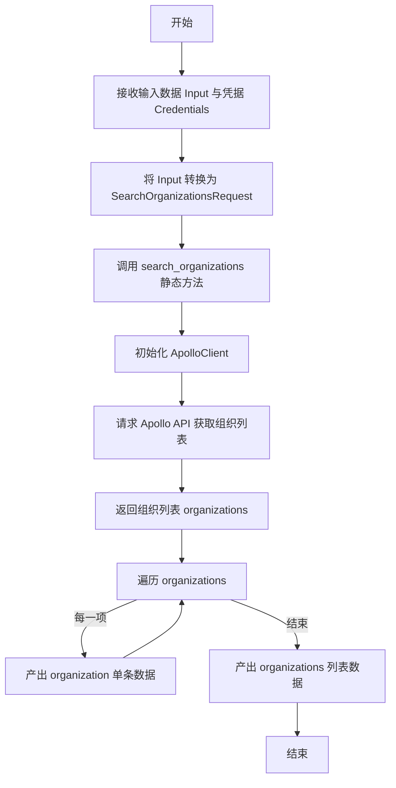
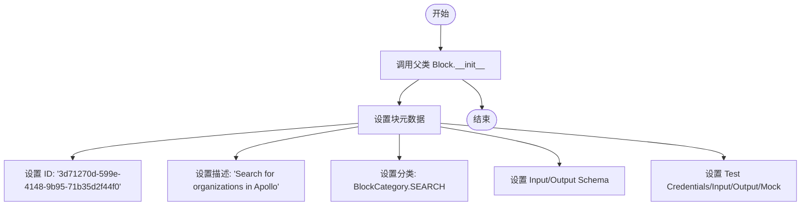
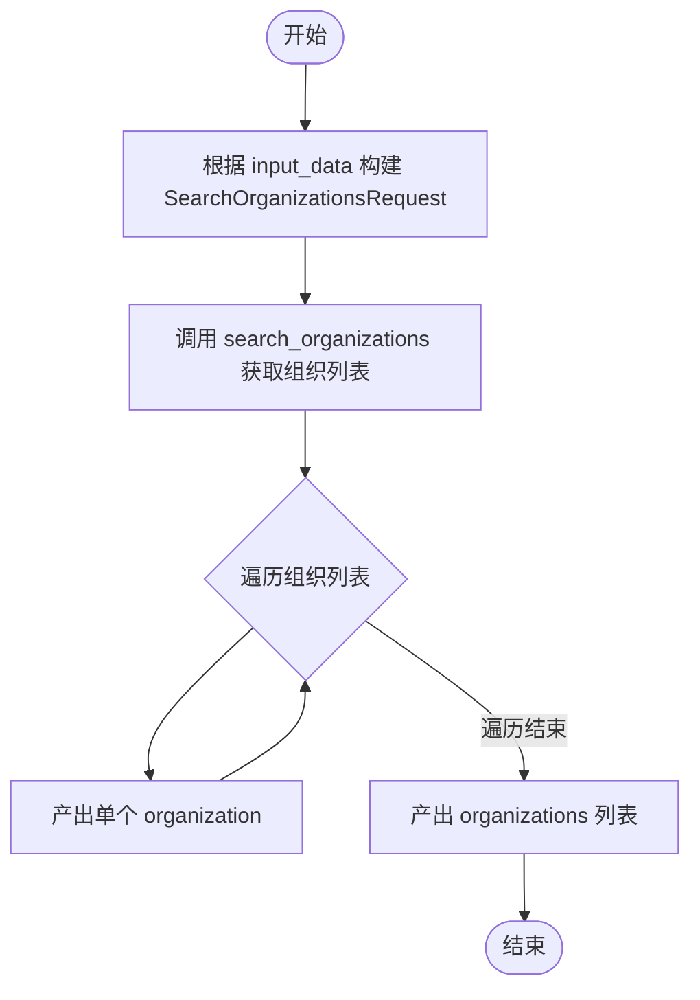

# `AutoGPT\autogpt_platform\backend\backend\blocks\apollo\organization.py` 详细设计文档

该代码实现了一个名为 SearchOrganizationsBlock 的类，用于根据多种条件（如员工数量、地理位置、关键词等）在 Apollo 数据库中搜索组织信息，并以流式方式逐条输出及最终聚合输出结果。

## 整体流程



## 类结构

```
Block (外部依赖基类)
└── SearchOrganizationsBlock
    ├── Input (内部类: 输入 Schema)
    ├── Output (内部类: 输出 Schema)
    ├── __init__ (初始化方法)
    ├── search_organizations (静态方法: 执行搜索)
    └── run (异步方法: 执行逻辑)
```

## 全局变量及字段


### `SearchOrganizationsBlock.Input`
    
Input schema class that defines parameters for searching organizations, including filters like employee range, location, and keywords.

类型：`type[BlockSchemaInput]`
    


### `SearchOrganizationsBlock.Output`
    
Output schema class that defines the structure of search results, including lists of organizations, individual organization entries, and error messages.

类型：`type[BlockSchemaOutput]`
    
    

## 全局函数及方法


### `SearchOrganizationsBlock.__init__`

初始化 `SearchOrganizationsBlock` 实例，配置块的元数据，包括唯一标识符、描述、分类、输入输出模式以及用于测试验证的凭据和模拟数据。

参数：

- `self`：`SearchOrganizationsBlock`，类的实例本身。

返回值：`None`，Python 构造函数默认不返回任何值。

#### 流程图



#### 带注释源码

```python
def __init__(self):
    # 调用父类 Block 的初始化方法，传入块的配置参数
    super().__init__(
        # 块的唯一标识符
        id="3d71270d-599e-4148-9b95-71b35d2f44f0",
        # 块的功能描述
        description="Search for organizations in Apollo",
        # 块所属的分类，这里归为搜索类
        categories={BlockCategory.SEARCH},
        # 定义输入数据的结构，使用内部类 Input
        input_schema=SearchOrganizationsBlock.Input,
        # 定义输出数据的结构，使用内部类 Output
        output_schema=SearchOrganizationsBlock.Output,
        # 用于测试的凭据对象
        test_credentials=TEST_CREDENTIALS,
        # 用于测试的输入数据样例
        test_input={"query": "Google", "credentials": TEST_CREDENTIALS_INPUT},
        # 用于测试的输出数据样例（包含具体的 Organization 对象结构）
        test_output=[
            (
                "organization",
                Organization(
                    id="1",
                    name="Google",
                    # ... 其他字段省略 ...
                ),
            ),
            (
                "organizations",
                [
                    Organization(
                        id="1",
                        name="Google",
                        # ... 其他字段省略 ...
                    ),
                ],
            ),
        ],
        # 用于在测试时模拟 API 响应的配置，避免真实调用
        test_mock={
            "search_organizations": lambda *args, **kwargs: [
                Organization(
                    id="1",
                    name="Google",
                    # ... 其他字段省略 ...
                )
            ]
        },
    )
```


### `SearchOrganizationsBlock.search_organizations`

该静态方法通过提供的凭据初始化 Apollo 客户端，并根据给定的查询请求参数执行组织搜索操作，返回匹配的组织列表。

参数：

-  `query`：`SearchOrganizationsRequest`，封装了组织搜索条件和过滤规则的请求对象。
-  `credentials`：`ApolloCredentials`，用于 API 访问鉴权的凭据对象。

返回值：`list[Organization]`，包含搜索结果的组织对象列表。

#### 流程图

```mermaid
flowchart TD
    Start[开始] --> InitClient[使用credentials初始化ApolloClient]
    InitClient --> CallSearch[调用client.search_organizations传入query]
    CallSearch --> ReturnResult[返回查询结果list[Organization]]
    ReturnResult --> End[结束]
```

#### 带注释源码

```python
    @staticmethod
    async def search_organizations(
        query: SearchOrganizationsRequest, credentials: ApolloCredentials
    ) -> list[Organization]:
        # 使用传入的凭证实例化Apollo客户端
        client = ApolloClient(credentials)
        # 异步调用客户端的搜索组织方法，并传入查询参数，返回结果列表
        return await client.search_organizations(query)
```


### `SearchOrganizationsBlock.run`

执行Apollo组织搜索的核心逻辑，接收输入参数和凭证，通过API获取组织列表，并依次生成单个组织对象及最终的汇总列表。

参数：

-  `input_data`：`SearchOrganizationsBlock.Input`，包含搜索条件的输入数据模型，如员工数量范围、地理位置、关键词等。
-  `credentials`：`ApolloCredentials`，用于连接Apollo API的认证凭证。
-  `**kwargs`：`Any`，扩展用的额外关键字参数。

返回值：`BlockOutput`，一个异步生成器，逐步产出搜索结果，先产出单个组织，最后产出组织列表。

#### 流程图



#### 带注释源码

```python
    async def run(
        self, input_data: Input, *, credentials: ApolloCredentials, **kwargs
    ) -> BlockOutput:
        # 将输入数据模型转换为API请求对象
        query = SearchOrganizationsRequest(**input_data.model_dump())
        
        # 调用辅助方法，使用凭证执行异步搜索请求
        organizations = await self.search_organizations(query, credentials)
        
        # 遍历搜索结果，逐个产出组织对象
        # 这允许下游处理逻辑在获取完整列表前开始处理单个项目
        for organization in organizations:
            yield "organization", organization
            
        # 最后产出完整的组织列表
        yield "organizations", organizations
```


## 关键组件


### 输入模式配置

定义块接收的搜索参数结构，包含公司规模范围、地理位置、关键词过滤及身份验证凭证等字段的规范化描述。

### 输出模式配置

定义块返回的搜索结果结构，设计为既能流式传输单个组织对象，也能返回完整的组织列表。

### Apollo API 集成

封装与外部 Apollo 服务的交互逻辑，通过 ApolloClient 实例执行实际的数据检索请求，处理远程通信细节。

### 执行流控制

核心业务逻辑控制器，负责将输入数据转换为请求模型，协调 API 调用，并通过生成器模式逐个产出搜索结果。


## 问题及建议


### 已知问题

-   **类型与描述不一致**：`organization_num_employees_range` 字段定义为 `list[int]`，但其 `description` 文档明确指出参数值应为字符串格式（如 "lower,upper"）。这会导致在调用下游 API 时可能因数据格式错误而请求失败。
-   **测试数据高度冗余**：`__init__` 方法中的 `test_output` 包含两份完全相同的、结构复杂的 `Organization` 对象数据（一份用于列表，一份用于单项）。这种重复导致代码极其臃肿，增加了维护成本，修改模型时需要同步修改多处。
-   **测试输入字段不匹配**：`test_input` 中定义了 `query` 键，但 `Input` 类中对应的字段是 `q_organization_name`。这使得测试数据在初始化时无法正确映射到输入 Schema，导致测试可能无法按预期执行关键字搜索。
-   **缺乏异常处理机制**：`run` 方法直接调用 `search_organizations` 而未包含 `try-except` 块。尽管 `Output` 中定义了 `error` 字段，但在 API 调用失败（如网络超时、认证无效）时，异常会直接抛出，导致 Block 运行崩溃，而无法产出预期的错误信息。

### 优化建议

-   **提取重复的测试数据**：将 `__init__` 中重复的 `Organization` 对象提取为类级别的常量或独立的 Fixture 函数，在初始化时引用该对象。这样可以显著减少代码行数，提升可读性，并确保测试数据的一致性。
-   **实现健壮的错误捕获**：在 `run` 方法中添加异常捕获逻辑，拦截 API 调用中可能出现的错误，并将错误信息赋值给 `error` 字段进行产出，确保 Block 在遇到错误时能优雅地处理并传递状态，而非直接中断。
-   **修正字段类型与转换逻辑**：根据 Apollo API 的实际契约，修正 `organization_num_employees_range` 的类型注解（例如改为 `list[str]`），或者在 `run` 方法中将输入的整数列表转换为 API 要求的字符串格式，消除文档与实现的不一致。
-   **修正测试输入参数**：将 `test_input` 中的键名从 `query` 修改为 `q_organization_name`，以匹配 `Input` Schema 的定义，确保单元测试和集成测试能正确模拟关键字搜索场景。
-   **优化大结果集的内存占用**：当前代码在遍历结束后一次性产出完整的 `organizations` 列表。如果用户设置的 `max_results` 接近上限 50000，将消耗大量内存。建议评估业务需求，考虑仅保留流式产出（单条 `organization`），或者限制列表产出的最大数量。


## 其它


### 设计目标与约束

该组件的设计目标是提供一个标准化的模块，用于在自动化工作流中集成 Apollo 的组织搜索功能。它允许用户通过配置特定的筛选条件（如员工数量、地理位置、关键词等）来获取目标公司列表。

主要约束包括：
1.  **API 限制**：单次请求返回的最大结果数受限于 `max_results` 参数，上限为 50,000。
2.  **认证依赖**：执行搜索操作必须提供有效的 Apollo 凭证，否则无法建立连接。
3.  **数据格式**：输入参数必须符合 `SearchOrganizationsRequest` 的结构定义，例如员工范围需要为列表格式，地点过滤支持城市、州或国家。
4.  **异步执行**：组件基于 Python `asyncio` 构建，运行环境必须支持异步调用。

### 错误处理与异常设计

当前设计中，虽然 `Output` 类定义了 `error` 字段用于承载错误信息，但在 `run` 方法的实现中并未显式包含 `try-except` 块来捕获 `ApolloClient` 调用期间可能发生的异常。

设计意图与潜在机制如下：
1.  **异常传播**：如果 `ApolloClient` 抛出网络异常或 HTTP 错误（如 401 未授权、429 请求过多、500 服务器错误），该异常将向上传播。
2.  **框架处理**：预期由父类 `Block` 或上层执行框架捕获异常，并将其转换为 `Output` 中的 `error` 字段输出，或者中断整个工作流的执行。
3.  **输入验证**：输入数据的格式验证依赖于 Pydantic 模型（`BlockSchemaInput`），如果输入类型不匹配（例如 `max_results` 不是整数），将在执行前抛出验证错误。

### 数据流与状态机

**数据流：**
1.  **输入阶段**：外部调用方传入符合 `Input` Schema 的字典数据。
2.  **转换阶段**：在 `run` 方法中，输入数据通过 `input_data.model_dump()` 转换为字典，并实例化为 `SearchOrganizationsRequest` 对象。
3.  **交互阶段**：`ApolloClient` 使用凭证发起异步网络请求。
4.  **输出阶段**：获取到 `Organization` 列表后，通过生成器（`yield`）机制，先逐个产出单个组织对象，最后产出完整的组织列表。

**状态机：**
该组件是无状态的。它不维护任何内部变量或会话信息，每次 `run` 调用都是独立的，不依赖于之前的执行历史。

### 外部依赖与接口契约

**外部依赖：**
1.  **`backend.blocks.apollo._api.ApolloClient`**：负责与 Apollo 的后端 API 进行实际通信的核心客户端。必须保证该模块可用且网络通畅。
2.  **`backend.blocks.apollo.models`**：包含数据传输对象（DTO），如 `SearchOrganizationsRequest` 和 `Organization`，用于数据结构的序列化与反序列化。
3.  **`backend.data.block`**：提供基础类 `Block`、输入输出 Schema 定义以及凭证字段类型。

**接口契约：**
1.  **认证接口**：调用方必须提供实现了 `ApolloCredentials` 结构的凭证，包含 API Key 等必要信息。
2.  **异步契约**：`search_organizations` 是一个异步方法，调用方（或运行时环境）必须使用 `await` 关键字来等待结果。
3.  **输出契约**：组件保证产出两条流数据，第一条流数据包含单个组织实体，第二条流数据包含完整的组织列表（即使列表为空也会产出）。

    