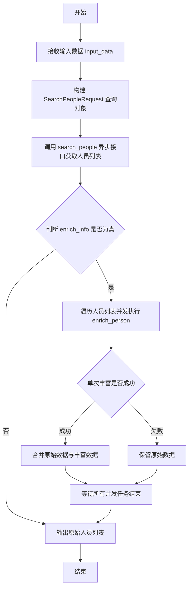
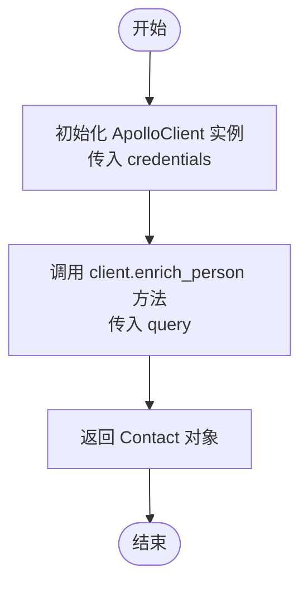
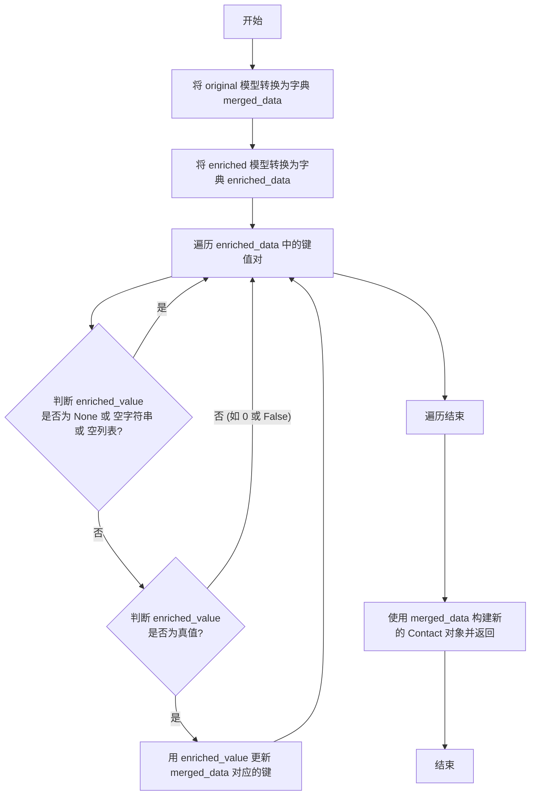
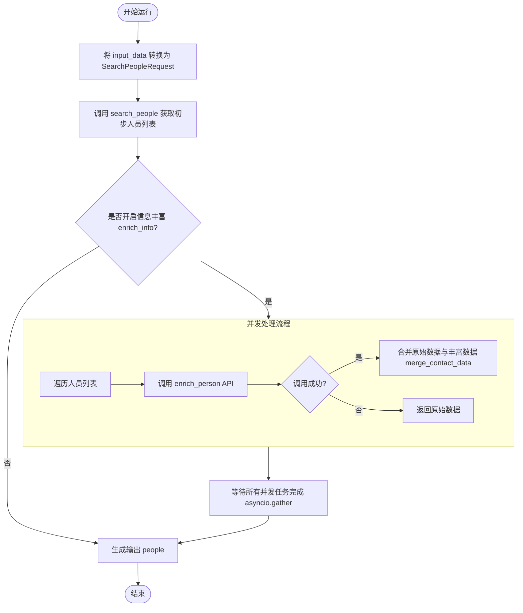

# `AutoGPT\autogpt_platform\backend\backend\blocks\apollo\people.py` 详细设计文档

该代码定义了一个继承自 Block 的 SearchPeopleBlock 类，用于集成 Apollo API 根据职位、地点、资历等条件搜索人员，并提供了可选的数据丰富功能（如获取真实邮箱），通过异步并发处理逻辑来优化大量数据的查询和合并，最终返回匹配的人员列表。

## 整体流程



## 类结构

```
Block (外部依赖)
└── SearchPeopleBlock
    ├── Input (BlockSchemaInput)
    └── Output (BlockSchemaOutput)
```

## 全局变量及字段


### `SearchPeopleBlock.Input`
    
Defines the input schema for the SearchPeopleBlock, specifying various criteria for searching people.

类型：`BlockSchemaInput`
    


### `SearchPeopleBlock.Output`
    
Defines the output schema for the SearchPeopleBlock, containing the list of found people or error messages.

类型：`BlockSchemaOutput`
    


### `SearchPeopleBlock.Input.person_titles`
    
Job titles held by the people you want to find. For a person to be included in search results, they only need to match 1 of the job titles you add. Adding more job titles expands your search results. Results also include job titles with the same terms, even if they are not exact matches. For example, searching for marketing manager might return people with the job title content marketing manager. Use this parameter in combination with the person_seniorities[] parameter to find people based on specific job functions and seniority levels.

类型：`list[str]`
    


### `SearchPeopleBlock.Input.person_locations`
    
The location where people live. You can search across cities, US states, and countries. To find people based on the headquarters locations of their current employer, use the organization_locations parameter.

类型：`list[str]`
    


### `SearchPeopleBlock.Input.person_seniorities`
    
The job seniority that people hold within their current employer. This enables you to find people that currently hold positions at certain reporting levels, such as Director level or senior IC level. For a person to be included in search results, they only need to match 1 of the seniorities you add. Adding more seniorities expands your search results. Searches only return results based on their current job title, so searching for Director-level employees only returns people that currently hold a Director-level title. If someone was previously a Director, but is currently a VP, they would not be included in your search results. Use this parameter in combination with the person_titles[] parameter to find people based on specific job functions and seniority levels.

类型：`list[SenorityLevels]`
    


### `SearchPeopleBlock.Input.organization_locations`
    
The location of the company headquarters for a person's current employer. You can search across cities, US states, and countries. If a company has several office locations, results are still based on the headquarters location. For example, if you search chicago but a company's HQ location is in boston, people that work for the Boston-based company will not appear in your results, even if they match other parameters. To find people based on their personal location, use the person_locations parameter.

类型：`list[str]`
    


### `SearchPeopleBlock.Input.q_organization_domains`
    
The domain name for the person's employer. This can be the current employer or a previous employer. Do not include www., the @ symbol, or similar. You can add multiple domains to search across companies. Examples: apollo.io and microsoft.com

类型：`list[str]`
    


### `SearchPeopleBlock.Input.contact_email_statuses`
    
The email statuses for the people you want to find. You can add multiple statuses to expand your search.

类型：`list[ContactEmailStatuses]`
    


### `SearchPeopleBlock.Input.organization_ids`
    
The Apollo IDs for the companies (employers) you want to include in your search results. Each company in the Apollo database is assigned a unique ID. To find IDs, call the Organization Search endpoint and identify the values for organization_id.

类型：`list[str]`
    


### `SearchPeopleBlock.Input.organization_num_employees_range`
    
The number range of employees working for the company. This enables you to find companies based on headcount. You can add multiple ranges to expand your search results. Each range you add needs to be a string, with the upper and lower numbers of the range separated only by a comma.

类型：`list[int]`
    


### `SearchPeopleBlock.Input.q_keywords`
    
A string of words over which we want to filter the results

类型：`str`
    


### `SearchPeopleBlock.Input.max_results`
    
The maximum number of results to return. If you don't specify this parameter, the default is 25. Limited to 500 to prevent overspending.

类型：`int`
    


### `SearchPeopleBlock.Input.enrich_info`
    
Whether to enrich contacts with detailed information including real email addresses. This will double the search cost.

类型：`bool`
    


### `SearchPeopleBlock.Input.credentials`
    
Apollo credentials

类型：`ApolloCredentialsInput`
    


### `SearchPeopleBlock.Output.people`
    
List of people found

类型：`list[Contact]`
    


### `SearchPeopleBlock.Output.error`
    
Error message if the search failed

类型：`str`
    
    

## 全局函数及方法


### `SearchPeopleBlock.__init__`

该方法用于初始化 `SearchPeopleBlock` 类实例，通过调用父类的初始化方法，配置块的唯一标识符、描述信息、分类、输入输出模式以及用于测试的凭据和模拟数据。

参数：

-   `self`：`SearchPeopleBlock`，类的实例本身。

返回值：`None`，构造函数不返回任何值。

#### 流程图

```mermaid
graph TD
    A[开始初始化 SearchPeopleBlock] --> B[调用 super().__init__]
    B --> C[设置块 ID]
    B --> D[设置描述信息]
    B --> E[设置分类为 SEARCH]
    B --> F[设置输入输出 Schema]
    B --> G[设置测试凭据与输入]
    B --> H[设置测试输出与 Mock 数据]
    C --> I[初始化完成]
    D --> I
    E --> I
    F --> I
    G --> I
    H --> I
```

#### 带注释源码

```python
def __init__(self):
    super().__init__(
        # 块的唯一标识符
        id="c2adb3aa-5aae-488d-8a6e-4eb8c23e2ed6",
        # 块的功能描述
        description="Search for people in Apollo",
        # 块所属的分类，此处为搜索类
        categories={BlockCategory.SEARCH},
        # 定义块的输入数据结构模式
        input_schema=SearchPeopleBlock.Input,
        # 定义块的输出数据结构模式
        output_schema=SearchPeopleBlock.Output,
        # 测试用的凭据信息
        test_credentials=TEST_CREDENTIALS,
        # 测试用的输入数据样例
        test_input={"credentials": TEST_CREDENTIALS_INPUT},
        # 测试用的预期输出数据样例，包含一个模拟的 Contact 列表
        test_output=[
            (
                "people",
                [
                    Contact(
                        # ... (此处省略 Contact 模型的大量字段初始化代码) ...
                    ),
                ],
            ),
        ],
        # 测试用的模拟函数，用于模拟 API 请求返回数据而不进行真实调用
        test_mock={
            "search_people": lambda query, credentials: [
                Contact(
                    # ... (此处省略 Contact 模型的大量字段初始化代码) ...
                ),
            ]
        },
    )
```


### `SearchPeopleBlock.search_people`

根据提供的搜索查询和凭证，使用 Apollo 客户端执行人员搜索操作，并返回匹配的联系人列表。

参数：

-  `query`：`SearchPeopleRequest`，包含搜索条件（如职位头衔、地点、资历等级等）的请求对象。
-  `credentials`：`ApolloCredentials`，用于访问 Apollo API 的身份验证凭证。

返回值：`list[Contact]`，搜索到的联系人对象列表。

#### 流程图

```mermaid
flowchart TD
    Start([开始]) --> Input[输入: query, credentials]
    Input --> CreateClient[创建 ApolloClient 实例<br>client = ApolloClient(credentials)]
    CreateClient --> CallAPI[调用 search_people 方法<br>await client.search_people(query)]
    CallAPI --> ReturnResult([返回: list[Contact]])
```

#### 带注释源码

```python
    @staticmethod
    async def search_people(
        query: SearchPeopleRequest, credentials: ApolloCredentials
    ) -> list[Contact]:
        # 1. 使用传入的凭证初始化 Apollo API 客户端
        client = ApolloClient(credentials)
        # 2. 调用客户端的 search_people 方法发起异步请求，并传入查询参数
        return await client.search_people(query)
```


### SearchPeopleBlock.enrich_person

该方法是一个静态异步方法，用于封装对 Apollo API 的调用。它根据提供的认证凭据初始化客户端，并执行人员信息丰富操作，以获取详细的联系人数据。

参数：

-  `query`：`EnrichPersonRequest`，包含用于识别和丰富人员信息的请求参数（如人员 ID）。
-  `credentials`：`ApolloCredentials`，用于访问 Apollo 服务的有效认证凭据。

返回值：`Contact`，经过 Apollo API 丰富后的联系人详细信息对象。

#### 流程图



#### 带注释源码

```python
    @staticmethod
    async def enrich_person(
        query: EnrichPersonRequest, credentials: ApolloCredentials
    ) -> Contact:
        # 使用提供的凭据实例化 Apollo API 客户端
        client = ApolloClient(credentials)
        # 异步调用客户端的 enrich_person 方法，将查询请求发送给 Apollo 并返回结果
        return await client.enrich_person(query)
```


### `SearchPeopleBlock.merge_contact_data`

该静态方法用于将原始联系人数据与富集后的联系人数据进行合并，策略是使用富集数据中的有效非空值来补充或覆盖原始数据。

参数：

-  `original`：`Contact`，表示从初始搜索中获取的原始联系人对象。
-  `enriched`：`Contact`，表示经过详细接口查询后的富集联系人对象。

返回值：`Contact`，返回合并后的新联系人对象实例。

#### 流程图



#### 带注释源码

```python
    @staticmethod
    def merge_contact_data(original: Contact, enriched: Contact) -> Contact:
        """
        Merge contact data from original search with enriched data.
        Enriched data complements original data, only filling in missing values.
        """
        # 将原始 Contact 对象转换为字典，作为合并的基础
        merged_data = original.model_dump()
        # 将富集后的 Contact 对象转换为字典，用于提取补充信息
        enriched_data = enriched.model_dump()

        # 遍历富集数据中的所有字段
        for key, enriched_value in enriched_data.items():
            # 如果富集字段的值为 None、空字符串或空列表，则跳过，不进行更新
            if enriched_value is None or enriched_value == "" or enriched_value == []:
                continue

            # 如果富集字段的值为真值（非 0、非 False 等），则将其更新到合并数据中
            # 这意味着非空的富集数据会覆盖原始数据中的对应字段
            if enriched_value:
                merged_data[key] = enriched_value

        # 使用合并后的字典重新构造并返回一个 Contact 对象
        return Contact(**merged_data)
```


### `SearchPeopleBlock.run`

执行Apollo人员搜索操作的核心方法。该方法接收搜索参数和凭据，调用Apollo API查找符合条件的联系人，并根据配置决定是否对搜索结果进行详细信息丰富，最后返回处理后的联系人列表。

参数：

- `input_data`：`SearchPeopleBlock.Input`，包含搜索条件的输入数据模型，如职位头衔、地点、是否丰富信息等。
- `credentials`：`ApolloCredentials`，用于访问Apollo API的认证凭据。
- `**kwargs`：`dict`，扩展的关键字参数。

返回值：`BlockOutput`，一个异步生成器，产生包含结果键和对应数据的元组，这里主要产出键为 "people" 的联系人列表。

#### 流程图



#### 带注释源码

```python
    async def run(
        self,
        input_data: Input,
        *,
        credentials: ApolloCredentials,
        **kwargs,
    ) -> BlockOutput:

        # 根据输入数据构建搜索请求对象
        query = SearchPeopleRequest(**input_data.model_dump())
        # 调用静态方法执行搜索，获取初始人员列表
        people = await self.search_people(query, credentials)

        # 检查是否需要丰富联系人详细信息
        if input_data.enrich_info:

            # 定义内部异步函数：处理单个联系人的丰富化
            async def enrich_or_fallback(person: Contact):
                try:
                    # 创建丰富化请求，使用人员ID
                    enrich_query = EnrichPersonRequest(person_id=person.id)
                    # 调用 API 获取详细信息
                    enriched_person = await self.enrich_person(
                        enrich_query, credentials
                    )
                    # 将新获取的信息合并到原始数据中（互补而非覆盖）
                    return self.merge_contact_data(person, enriched_person)
                except Exception:
                    # 如果丰富化过程中出现异常，保留原始人员数据
                    return person  # If enrichment fails, use original person data

            # 使用 asyncio.gather 并发处理列表中所有人员的丰富化操作
            people = await asyncio.gather(
                *(enrich_or_fallback(person) for person in people)
            )

        # 产出处理后的最终人员列表
        yield "people", people
```


## 关键组件


### SearchPeopleBlock
封装 Apollo 人员搜索逻辑、模式定义和执行控制的主要类。

### Input Schema
定义搜索参数结构（如职位、地点、资历）和凭证要求的类。

### Output Schema
定义输出结构以返回联系人列表或错误消息的类。

### Search Execution
静态方法组件，负责将输入数据转换为请求对象，并使用 ApolloClient 异步执行搜索查询。

### Conditional Enrichment
异步流程组件，根据用户请求使用 `asyncio.gather` 并行获取详细的联系人信息（如真实邮箱），并包含异常回退机制。

### Data Merging Strategy
静态方法组件，负责通过用丰富数据填充缺失值的方式，将原始搜索结果与丰富数据进行合并。


## 问题及建议


### 已知问题

-   **字段定义与描述不一致**：`organization_num_employees_range` 字段在 `Input` 类中定义为 `list[int]` 类型，但其 SchemaField 的 `description` 明确说明输入应该是字符串格式（"Each range you add needs to be a string..."）。这种不一致会导致数据验证失败或 API 调用错误。
-   **数据合并逻辑与注释不符**：`merge_contact_data` 方法的实现逻辑是只要 `enriched_value` 有效，就无条件覆盖 `merged_data` 中的值。然而，其代码注释和文档字符串却声称"Only update fields that are None... in original"（仅更新原始数据中为空的字段）。如果意图是补充而非替换，当前实现存在逻辑错误。
-   **错误输出未被使用**：`Output` 类中定义了 `error` 字段用于返回错误信息，但在 `run` 方法中从未产出该字段。如果搜索过程发生异常，用户无法通过输出获取具体的错误详情。
-   **Enrichment 异常被静默吞没**：在 `enrich_or_fallback` 函数中，使用了 `except Exception` 捕获所有异常并仅返回原始数据，没有任何日志记录。这使得当 Enrichment 失败时，难以排查问题原因。

### 优化建议

-   **重构测试数据以减少冗余**：`__init__` 方法中包含大量重复的 `Contact` 对象模拟数据（在 `test_output` 和 `test_mock` 中）。建议将这些数据提取为类级别的常量或辅助生成函数，以提高代码的可读性和可维护性。
-   **添加重试机制**：`enrich_person` 是外部 API 调用，可能因网络波动或不稳定而失败。建议引入重试机制（如 Tenacity 库）来提高 enrichment 步骤的成功率，而不是直接回退到原始数据。
-   **改进日志记录与监控**：在 `enrich_or_fallback` 中捕获异常时，应添加适当的日志记录（如 `logging.error`），记录失败的人员 ID 和具体的异常信息，以便于后续监控和调试。
-   **客户端复用与连接管理**：目前 `ApolloClient` 在每次调用静态方法时都会重新实例化。建议检查客户端是否支持连接池或会话复用，或者将客户端实例化移至类层级或上下文管理器中，以减少建立连接的开销。
-   **引入并发控制（信号量）**：当 `max_results` 较大（如 500）且开启 `enrich_info` 时，`asyncio.gather` 会瞬间发起大量并发请求，可能触发外部 API 的速率限制。建议使用 `asyncio.Semaphore` 限制最大并发数，或对请求进行分批处理。


## 其它


### 设计目标与约束

本组件的设计目标是作为一个可复用的异步逻辑块集成到更大的工作流系统中，用于从 Apollo API 搜索人员信息。

1.  **设计目标**：
    *   **封装性与易用性**：将复杂的 Apollo API 查询参数封装为结构化的输入模式，通过 `BlockSchemaInput` 和 `SchemaField` 提供清晰的接口定义和描述。
    *   **灵活性**：支持多维度的搜索条件（如职位头衔、地点、资历等级、公司域名等）的组合查询。
    *   **数据增强**：提供可选的数据丰富功能，在不改变基础搜索结果的前提下，获取更详细的联系人信息。
    *   **鲁棒性**：在批量处理数据增强时，确保单个条目的失败不会导致整个任务的中断。

2.  **约束**：
    *   **结果数量限制**：为了防止过度消费 API 配额或产生过多费用，硬编码了 `max_results` 的上限为 500。
    *   **异步执行**：组件必须在异步环境中运行（依赖 `asyncio`），以支持高并发的 I/O 操作，特别是在进行数据增强时。
    *   **成本敏感**：明确标识了开启 `enrich_info` 会加倍消耗搜索成本，提醒使用者谨慎使用。
    *   **字段覆盖策略**：数据增强采用“补充而非替换”的策略，即仅当原始数据为空或缺失时，才使用增强数据填充。

### 错误处理与异常设计

本组件采用分层和差异化的错误处理策略，区分了主流程错误和辅助流程错误。

1.  **搜索阶段**：
    *   `search_people` 方法直接调用底层 API 客户端。如果发生网络错误、认证失败或服务端错误，异常将向上抛出，导致整个 Block 的 `run` 方法执行失败。这是Fail-fast策略，确保基础数据的获取是成功的。

2.  **数据增强阶段**：
    *   采用 **Best Effort（尽力而为）** 策略。在 `run` 方法中，`enrich_or_fallback` 内部函数捕获了通用的 `Exception`。
    *   **降级处理**：如果针对某个特定人员的增强请求失败（例如 API 限流、超时或数据不存在），代码捕获异常并返回原始的 `person` 对象。
    *   **容错性**：利用 `asyncio.gather` 并发执行增强任务，单个任务的异常不会中断其他任务的执行，也不会导致整体流程崩溃，保证了最终返回的列表完整性（尽管部分数据可能未增强）。

3.  **数据合并异常**：
    *   `merge_contact_data` 使用 Pydantic 模型的 `model_dump` 和重构机制。如果数据类型不匹配导致无法构造 `Contact` 对象，异常将传播并终止该条数据的处理。

### 数据流与状态机

1.  **数据流**：
    *   **输入阶段**：外部调用者传入符合 `Input` Schema 的字典或对象，经过 Pydantic 验证后生成 `input_data`。
    *   **转换阶段**：`input_data` 被转换为 `SearchPeopleRequest` 查询对象，发送给 Apollo API。
    *   **获取阶段**：API 返回原始 `Contact` 列表。
    *   **分支处理（可选）**：
        *   若 `enrich_info` 为 False：数据流直接进入输出阶段。
        *   若 `enrich_info` 为 True：触发并发增强流程。系统为每个 Contact 并行调用 `enrich_person`，获取增强数据。
    *   **合并阶段**：原始数据和增强数据进入 `merge_contact_data`，根据逻辑（空值填充）生成 `merged_contact`。
    *   **输出阶段**：通过生成器 `yield` 输出最终的 `people` 列表。

2.  **状态机**：
    *   本组件本质上是无状态的，其生命周期包含三个主要状态转换：
        *   `Idle` (初始状态) -> `Searching` (正在搜索)
        *   `Searching` -> `Enriching` (正在增强，条件分支)
        *   `Enriching` (或 `Searching`) -> `Completed` (完成输出)
    *   在 `Enriching` 状态下，内部维护多个并行的子任务状态，但对外表现为一个整体的处理过程。

### 外部依赖与接口契约

1.  **ApolloClient**:
    *   **职责**：负责与 Apollo API 进行底层网络通信。
    *   **接口契约**：
        *   `__init__(credentials: ApolloCredentials)`：接收认证凭证初始化。
        *   `async search_people(query: SearchPeopleRequest) -> list[Contact]`：同步/异步发送搜索请求，返回联系人列表。
        *   `async enrich_person(query: EnrichPersonRequest) -> Contact`：发送单条数据增强请求，返回详细联系人对象。

2.  **Data Models (Pydantic Models)**:
    *   **Contact**：定义了人员数据的完整结构。
    *   **SearchPeopleRequest**：定义了搜索 API 的请求参数结构，需与 `SearchPeopleBlock.Input` 兼容。
    *   **EnrichPersonRequest**：定义了增强 API 的请求参数（通常包含 `person_id`）。

3.  **Block Framework (Inheritance)**:
    *   **基类**：`Block`。
    *   **契约**：子类必须定义 `Input` 和 `Output` 内部类（继承自 `BlockSchemaInput`/`Output`），并实现 `async run(self, input_data: Input, **kwargs) -> BlockOutput` 方法。框架负责调度和执行该方法。

4.  **Asyncio**:
    *   **依赖**：Python 标准库 `asyncio`。
    *   **用途**：用于管理并发任务（`asyncio.gather`），确保 I/O 密集型操作的高效执行。

    