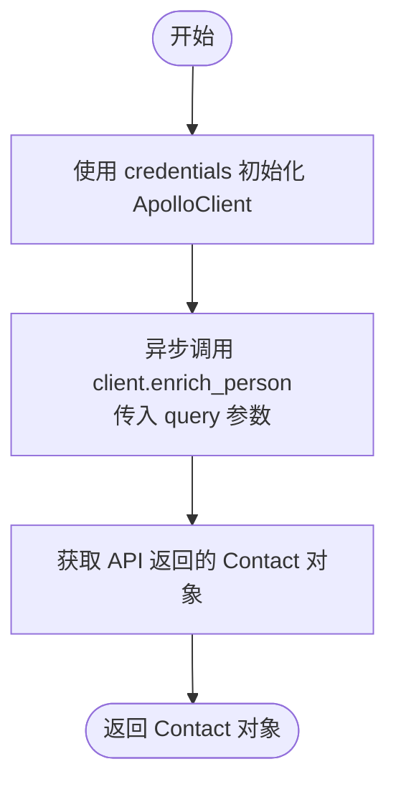

# `AutoGPT\autogpt_platform\backend\backend\blocks\apollo\person.py` 详细设计文档

该代码定义了一个名为 GetPersonDetailBlock 的类，继承自 Block，用于通过 Apollo API 根据提供的多种人员标识（如 ID、姓名、域名等）查询并丰富人员的详细信息（包括邮箱、职位等），最终输出 Contact 对象。

## 整体流程


## 类结构

```
Block (父类)
└── GetPersonDetailBlock
    ├── Input (内部类)
    │   ├── person_id
    │   ├── first_name
    │   ├── ... (其他输入字段)
    │   └── credentials
    └── Output (内部类)
        ├── contact
        └── error
```

## 全局变量及字段


### `GetPersonDetailBlock.Input.person_id`
    
Apollo person ID to enrich (most accurate method)

类型：`str`
    


### `GetPersonDetailBlock.Input.first_name`
    
First name of the person to enrich

类型：`str`
    


### `GetPersonDetailBlock.Input.last_name`
    
Last name of the person to enrich

类型：`str`
    


### `GetPersonDetailBlock.Input.name`
    
Full name of the person to enrich (alternative to first_name + last_name)

类型：`str`
    


### `GetPersonDetailBlock.Input.email`
    
Known email address of the person (helps with matching)

类型：`str`
    


### `GetPersonDetailBlock.Input.domain`
    
Company domain of the person (e.g., 'google.com')

类型：`str`
    


### `GetPersonDetailBlock.Input.company`
    
Company name of the person

类型：`str`
    


### `GetPersonDetailBlock.Input.linkedin_url`
    
LinkedIn URL of the person

类型：`str`
    


### `GetPersonDetailBlock.Input.organization_id`
    
Apollo organization ID of the person's company

类型：`str`
    


### `GetPersonDetailBlock.Input.title`
    
Job title of the person to enrich

类型：`str`
    


### `GetPersonDetailBlock.Input.credentials`
    
Apollo credentials

类型：`ApolloCredentialsInput`
    


### `GetPersonDetailBlock.Output.contact`
    
Enriched contact information

类型：`Contact`
    


### `GetPersonDetailBlock.Output.error`
    
Error message if enrichment failed

类型：`str`
    
    

## 全局函数及方法


### `GetPersonDetailBlock.__init__`

初始化 `GetPersonDetailBlock` 实例，通过调用父类 `Block` 的构造函数并传入特定的元数据、输入输出模式定义以及测试配置来设置该块的基本属性和行为。

参数：

-  `self`：`GetPersonDetailBlock`，表示正在初始化的类实例本身。

返回值：`None`，该方法为构造函数，无返回值。

#### 流程图


#### 带注释源码

```python
    def __init__(self):
        super().__init__(
            # 块的唯一标识符
            id="3b18d46c-3db6-42ae-a228-0ba441bdd176",
            # 块的功能描述
            description="Get detailed person data with Apollo API, including email reveal",
            # 块所属的分类，此处定义为 SEARCH (搜索)
            categories={BlockCategory.SEARCH},
            # 定义输入数据的结构，引用内部类 Input
            input_schema=GetPersonDetailBlock.Input,
            # 定义输出数据的结构，引用内部类 Output
            output_schema=GetPersonDetailBlock.Output,
            # 用于单元测试的默认凭据对象
            test_credentials=TEST_CREDENTIALS,
            # 用于单元测试的输入参数样例
            test_input={
                "credentials": TEST_CREDENTIALS_INPUT,
                "first_name": "John",
                "last_name": "Doe",
                "company": "Google",
            },
            # 用于单元测试的预期输出样例
            test_output=[
                (
                    "contact",
                    Contact(
                        id="1",
                        name="John Doe",
                        first_name="John",
                        last_name="Doe",
                        email="john.doe@gmail.com",
                        title="Software Engineer",
                        organization_name="Google",
                        linkedin_url="https://www.linkedin.com/in/johndoe",
                    ),
                ),
            ],
            # 用于单元测试的 Mock 对象，模拟 enrich_person 方法的返回结果
            test_mock={
                "enrich_person": lambda query, credentials: Contact(
                    id="1",
                    name="John Doe",
                    first_name="John",
                    last_name="Doe",
                    email="john.doe@gmail.com",
                    title="Software Engineer",
                    organization_name="Google",
                    linkedin_url="https://www.linkedin.com/in/johndoe",
                )
            },
        )
```


### `GetPersonDetailBlock.enrich_person`

这是一个静态异步方法，旨在通过实例化 Apollo 客户端并委托其执行请求，从而利用 Apollo API 获取并丰富人员的详细信息。

参数：

- `query`：`EnrichPersonRequest`，包含查询条件（如姓名、公司域名等）的请求对象，用于定位需要丰富的人员。
- `credentials`：`ApolloCredentials`，Apollo API 的认证凭据，用于授权客户端访问接口。

返回值：`Contact`，包含从 API 返回的丰富后的联系人详细信息对象。

#### 流程图



#### 带注释源码

```python
    @staticmethod
    async def enrich_person(
        query: EnrichPersonRequest, credentials: ApolloCredentials
    ) -> Contact:
        # 使用传入的凭证初始化 Apollo 客户端实例
        client = ApolloClient(credentials)
        # 调用客户端的 enrich_person 方法，传入查询参数，
        # 并等待异步操作完成后返回结果（Contact 对象）
        return await client.enrich_person(query)
```


### `GetPersonDetailBlock.run`

执行人员数据信息丰富（enrichment）的主要逻辑，通过将输入数据转换为请求对象，利用 Apollo API 客户端获取详细信息（包括邮箱揭示），并返回结果。

参数：

- `input_data`：`Input`，包含人员查找标准（如姓名、域名、公司、LinkedIn URL等）的输入数据模型。
- `credentials`：`ApolloCredentials`，用于访问 Apollo API 的认证凭证。
- `**kwargs`：`dict`，其他额外的关键字参数。

返回值：`BlockOutput`，生成产出丰富化后的联系信息（`Contact` 对象）的异步生成器。

#### 流程图


#### 带注释源码

```python
async def run(
    self,
    input_data: Input,
    *,
    credentials: ApolloCredentials,
    **kwargs,
) -> BlockOutput:
    # 将输入数据模型转换为字典，并构建 EnrichPersonRequest 请求对象
    query = EnrichPersonRequest(**input_data.model_dump())
    
    # 调用 enrich_person 静态方法执行查询，并产出结果
    # 键为 "contact"，值为从 Apollo API 返回的 Contact 对象
    yield "contact", await self.enrich_person(query, credentials)
```


## 关键组件

### 1. 核心功能概述
该代码实现了一个名为 `GetPersonDetailBlock` 的数据获取模块，用于通过 Apollo API 异步获取并丰富人员详细信息。它支持通过多种标识符（如 Person ID、姓名、邮箱、公司域名等）进行查询，能够返回包含邮箱、职位、LinkedIn URL 等字段的完整联系人对象，并内置了测试用例与 Mock 数据支持。

### 2. 文件的整体运行流程
1.  **初始化阶段**：实例化 `GetPersonDetailBlock`，配置 Block 的 ID、描述、输入/输出 Schema、测试凭据及 Mock 行为。
2.  **执行阶段 (`run`)**：
    *   接收符合 `Input` Schema 的输入数据（包含人员信息及凭据）。
    *   将输入数据通过 `model_dump()` 转换为字典，并构造 `EnrichPersonRequest` 请求对象。
    *   调用静态方法 `enrich_person` 发起异步请求。
3.  **API 交互阶段 (`enrich_person`)**：
    *   使用提供的凭据初始化 `ApolloClient`。
    *   调用客户端的 `enrich_person` 接口与 Apollo 服务通信。
4.  **输出阶段**：将 API 返回的 `Contact` 对象通过生成器产出，完成数据流转。

### 3. 类的详细信息
#### 3.1 `GetPersonDetailBlock`
继承自 `Block`，是核心功能类，负责定义输入输出规范并执行具体的业务逻辑。

#### 3.2 `GetPersonDetailBlock.Input`
继承自 `BlockSchemaInput`，内部类，定义了 Block 的输入参数结构。

#### 3.3 `GetPersonDetailBlock.Output`
继承自 `BlockSchemaOutput`，内部类，定义了 Block 的输出数据结构。

### 4. 字段与变量详细信息
| 名称 | 类型 | 描述 |
| :--- | :--- | :--- |
| `person_id` | `str` | Apollo 人员唯一标识符，最准确的查询方式。 |
| `first_name` | `str` | 待查询人员的名字。 |
| `last_name` | `str` | 待查询人员的姓氏。 |
| `name` | `str` | 待查询人员的全名（作为 first_name + last_name 的替代方案）。 |
| `email` | `str` | 已知的邮箱地址，辅助匹配。 |
| `domain` | `str` | 人员所属公司的域名（如 'google.com'）。 |
| `company` | `str` | 人员所属公司的名称。 |
| `linkedin_url` | `str` | 人员的 LinkedIn 个人资料 URL。 |
| `organization_id` | `str` | Apollo 组织 ID，属于高级参数。 |
| `title` | `str` | 人员的职位头衔，属于高级参数。 |
| `credentials` | `ApolloCredentialsInput` | 用于认证 Apollo API 访问权限的凭据对象。 |
| `contact` | `Contact` | 丰富后的联系人详细信息对象。 |
| `error` | `str` | 如果丰富过程失败，输出的错误信息。 |

### 5. 类方法与全局函数详细信息
#### 5.1 `enrich_person`
**名称**: `enrich_person`  
**参数**:
- `query` (`EnrichPersonRequest`): 构造好的人员查询请求对象。
- `credentials` (`ApolloCredentials`): Apollo API 认证凭据。

**返回值类型**: `Contact`  
**返回值描述**: 包含丰富人员信息的对象。

**Mermaid 流程图**:


**带注释源码**:
```python
    @staticmethod
    async def enrich_person(
        query: EnrichPersonRequest, credentials: ApolloCredentials
    ) -> Contact:
        # 使用提供的凭据初始化 Apollo API 客户端
        client = ApolloClient(credentials)
        # 调用客户端方法执行异步查询并返回结果
        return await client.enrich_person(query)
```

#### 5.2 `run`
**名称**: `run`  
**参数**:
- `input_data` (`Input`): 符合 Input Schema 的输入数据字典/对象。
- `credentials` (`ApolloCredentials`): 注入的认证凭据。
- `**kwargs`: 其他扩展关键字参数。

**返回值类型**: `BlockOutput` (Generator)  
**返回值描述**: 异步生成输出键值对，本例中产出 "contact"。

**Mermaid 流程图**:


**带注释源码**:
```python
    async def run(
        self,
        input_data: Input,
        *,
        credentials: ApolloCredentials,
        **kwargs,
    ) -> BlockOutput:
        # 将 Pydantic 输入模型转换为字典以构造请求对象
        query = EnrichPersonRequest(**input_data.model_dump())
        # 调用静态方法获取数据，并产出 contact 键和结果对象
        yield "contact", await self.enrich_person(query, credentials)
```

### 6. 关键组件信息
- **ApolloClient**: 负责与 Apollo API 进行底层通信的客户端组件，处理认证和请求发送。
- **EnrichPersonRequest**: 数据传输对象（DTO），封装了人员查询所需的所有参数字段。
- **Contact**: 数据模型，定义了从 API 返回的标准化人员信息结构。
- **BlockSchemaInput/Output**: 约束组件，用于定义和验证 Block 的输入输出接口规范。

### 7. 潜在的技术债务或优化空间
- **错误处理缺失**: `run` 方法中没有 `try-except` 块来捕获 API 调用异常。如果 `enrich_person` 失败，程序将直接抛出异常，而没有按照 Output Schema 定义的 `error` 字段返回错误信息。
- **输入清洗**: 代码直接使用 `input_data.model_dump()`，未对输入字符串进行清洗（如去除首尾空格），可能导致匹配精度下降。
- **Mock 数据硬编码**: 测试 Mock 数据硬编码在 `__init__` 中，如果依赖的 Contact 模型结构发生变化，Mock 数据需要手动同步更新。

### 8. 其它项目
- **设计目标与约束**: 设计遵循 Block 模式，要求显式定义 Schema，支持依赖注入，旨在构建可复用的数据获取组件。
- **异步设计**: 全面使用 `async/await` 语法，确保在高并发或网络 I/O 密集型场景下的非阻塞性能。
- **外部依赖与接口契约**: 强依赖 `backend.blocks.apollo._api.ApolloClient` 的接口稳定性，要求其实现 `enrich_person` 方法并返回 `Contact` 类型。

## 问题及建议


### 已知问题

-   **错误处理缺失**：`run` 方法中未包含 `try-except` 异常捕获逻辑。尽管 Output Schema 定义了 `error` 字段，但当 `enrich_person` 调用失败（如网络错误、API 限流、认证失败）时，异常会直接中断 Block 的执行，而不是输出到 `error` 端口。
-   **缺乏输入校验**：所有输入字段均设置了默认为空字符串，且 `run` 方法没有校验是否至少提供了一个有效的查询标识符（如 `person_id`、`email` 或 `name`）。向 API 发送全空的查询请求可能浪费配额或返回无意义数据。
-   **重复字段处理逻辑缺失**：输入同时包含 `name`（全名）和 `first_name`/`last_name`（分名）。代码直接将所有字段透传给 `EnrichPersonRequest`，未处理这两组字段的优先级或组合逻辑，可能导致 API 匹配效果不一致。

### 优化建议

-   **增加异常捕获与错误输出**：在 `run` 方法中增加 `try-except` 块，捕获 `enrich_person` 可能抛出的异常，并将错误详情 `yield` 到 `error` 输出端口，以保证 Block 的健壮性和流程可控性。
-   **实施前置输入验证**：在调用 API 之前，验证输入数据的有效性。确保至少存在 `person_id`、`email` 或非空的 `name`/`first_name` 等关键标识符之一，若否则直接输出错误信息并返回，避免无效 API 调用。
-   **优化字段组合逻辑**：建议在构建 `EnrichPersonRequest` 前，增加对 `name` 和 `first_name`/`last_name` 的清洗逻辑。例如，如果用户输入了 `name`，则优先使用 `name`；否则尝试拼接 `first_name` 和 `last_name`，以提高数据匹配的准确性。
-   **客户端实例管理优化**：虽然 `ApolloClient` 每次初始化的开销取决于具体实现，但如果客户端内部维护了 HTTP 会话（Session），建议在 `Block` 生命周期内复用客户端实例，或者使用连接池，以减少高频调用时的连接建立开销。


## 其它


### 设计目标与约束

1.  **设计目标**：
    *   提供一个标准化的接口组件，用于从 Apollo API 获取并丰富人员详细信息。
    *   支持通过多种标识符（如 Person ID、姓名、邮箱、LinkedIn URL）进行人员查询，以提高匹配成功率。
    *   集成到自动化工作流中，实现无需手动编码即可调用 Apollo 数据获取能力。

2.  **约束条件**：
    *   **API 限制**：受限于 Apollo API 的速率限制和配额，高频调用可能导致请求被拒绝。
    *   **凭据依赖**：必须提供有效的 `ApolloCredentials` 才能成功执行。
    *   **异步执行**：由于 `run` 方法和底层客户端均为异步实现，该 Block 必须在支持 asyncio 的事件循环中运行。
    *   **数据准确性**：依赖输入参数的准确性，若输入信息（如姓名、公司）模糊，返回的匹配结果可能不精确。

### 错误处理与异常设计

1.  **异常传播机制**：
    *   当前 `run` 方法实现中未包含显式的 `try-except` 块。若 `ApolloClient` 抛出网络异常（如连接超时、HTTP 错误）或业务逻辑异常，这些异常将直接向上传播至调用该 Block 的上层执行器或框架，而不会自动填充到 `Output` 的 `error` 字段中。

2.  **错误字段契约**：
    *   `Output` 类中定义了 `error: str` 字段，这表明设计上期望在发生错误时输出错误信息。然而，当前代码逻辑尚未实现捕获异常并赋值给该字段的逻辑。

3.  **改进建议**：
    *   应在 `run` 方法中增加异常捕获逻辑，将捕获到的异常信息转换为字符串并输出到 `error` 端口，确保工作流在失败时能够优雅降级或分支处理，而非直接中断。

### 数据流与状态机

1.  **数据流向**：
    *   **输入阶段**：外部调用者传入 `Input` 数据模型（包含 `person_id`, `first_name` 等字段）及凭据。
    *   **转换阶段**：`run` 方法将 `Input` 模型通过 `model_dump()` 序列化为字典，并实例化为 `EnrichPersonRequest` 对象，作为 API 请求的实体。
    *   **处理阶段**：调用 `ApolloClient.enrich_person` 异步方法，发送请求至 Apollo 服务器并等待响应。
    *   **输出阶段**：将 API 返回的 `Contact` 对象通过生成器产出，映射到 `Output` 的 `contact` 字段。

2.  **状态机**：
    *   该 Block 是无状态的，不维护内部状态。
    *   **Idle（空闲）**：Block 初始化完成，等待 `run` 调用。
    *   **Processing（处理中）**：`run` 方法执行，正在等待 Apollo API 响应。
    *   **Completed（完成）**：成功获取数据并产出 `contact`。
    *   **Failed（失败）**：发生异常（当前实现为抛出异常，未转换为状态输出）。

### 外部依赖与接口契约

1.  **`backend.blocks.apollo._api.ApolloClient`**：
    *   **描述**：底层 HTTP 客户端，负责实际的 API 通信。
    *   **契约**：需实现 `enrich_person(self, query: EnrichPersonRequest, credentials: ApolloCredentials) -> Contact` 方法。要求该方法能够处理网络请求、鉴权以及响应解析。

2.  **`backend.blocks.apollo.models.EnrichPersonRequest`**：
    *   **描述**：请求数据传输对象（DTO）。
    *   **契约**：能够接受通过 `Input` 模型转换而来的字典参数，并包含 Apollo API 所需的查询字段。

3.  **`backend.blocks.apollo.models.Contact`**：
    *   **描述**：响应数据传输对象（DTO）。
    *   **契约**：包含丰富后的联系人属性（如 ID, 姓名, 邮箱等）。

4.  **`backend.data.block.Block` (基类)**：
    *   **描述**：框架基类。
    *   **契约**：子类必须实现 `run` 方法，并在 `__init__` 中提供必要的元数据（id, description, input_schema 等）。

### 并发与性能模型

1.  **并发模型**：
    *   基于 Python 的 `asyncio` 协程实现。通过 `async def` 和 `await` 关键字，使得在等待 I/O 操作（Apollo API 请求）时，能够释放控制权，允许事件循环处理其他任务，从而提高高并发场景下的吞吐量。

2.  **性能考量**：
    *   **I/O 密集型**：主要性能瓶颈在于网络延迟。
    *   **连接复用**：底层 `ApolloClient` 应确保使用高效的 HTTP 连接池（如 `httpx.AsyncClient`），以减少每次请求建立 TCP 连接的开销。

    