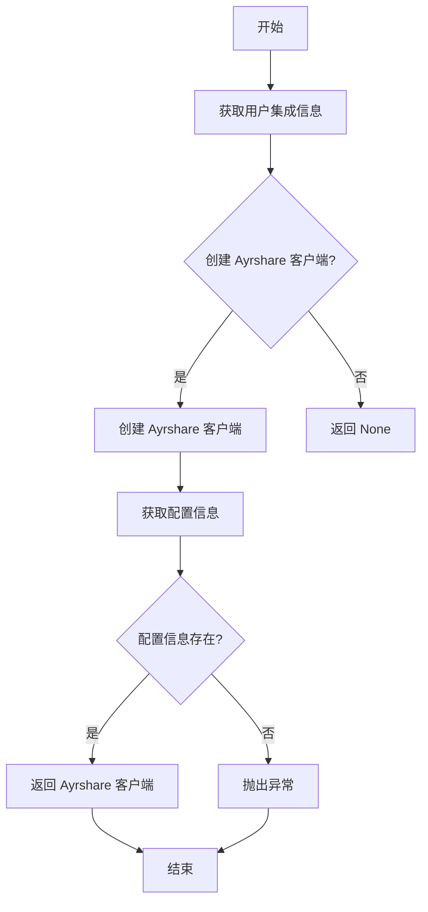
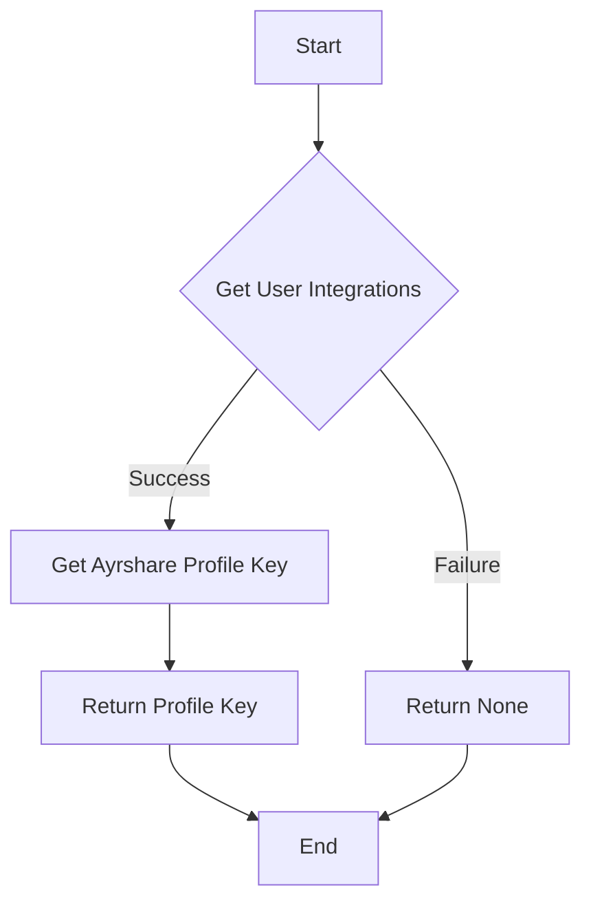
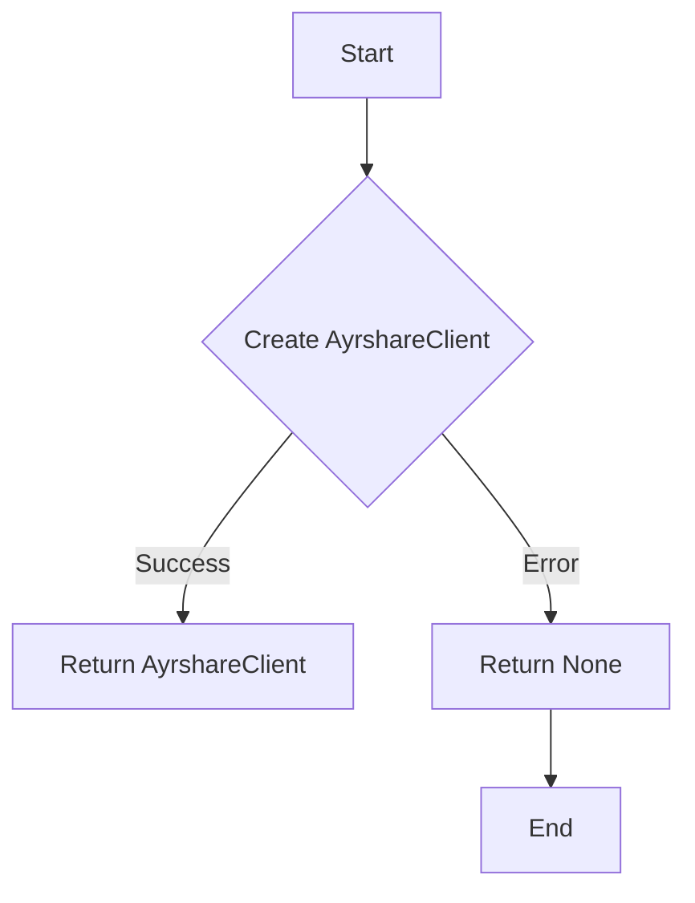

# `.\AutoGPT\autogpt_platform\backend\backend\blocks\ayrshare\_util.py` 详细设计文档

This code provides a set of models and functions for managing social media posts, including input validation, client creation, and user integration retrieval.

## 整体流程



## 类结构

```
BaseAyrshareInput (基类)
├── CarouselItem (轮播图项目模型)
├── CallToAction (调用行动模型)
├── EventDetails (活动详情模型)
├── OfferDetails (优惠详情模型)
├── InstagramUserTag (Instagram 用户标签模型)
├── LinkedInTargeting (LinkedIn 定位模型)
├── PinterestCarouselOption (Pinterest 轮播图选项模型)
└── YouTubeTargeting (YouTube 定位模型)
```

## 全局变量及字段


### `user_integrations`
    
Represents the user's integrations with external services.

类型：`UserIntegrations`
    


### `managed_credentials`
    
Represents the managed credentials for a specific integration.

类型：`ManagedCredentials`
    


### `ayrshare_profile_key`
    
The profile key for Ayrshare integration.

类型：`str`
    


### `post`
    
The post text to be published.

类型：`str`
    


### `media_urls`
    
Optional list of media URLs to include.

类型：`list[str]`
    


### `is_video`
    
Whether the media is a video.

类型：`bool`
    


### `schedule_date`
    
UTC datetime for scheduling.

类型：`Optional[datetime]`
    


### `disable_comments`
    
Whether to disable comments.

类型：`bool`
    


### `shorten_links`
    
Whether to shorten links.

类型：`bool`
    


### `unsplash`
    
Unsplash image configuration.

类型：`Optional[str]`
    


### `requires_approval`
    
Whether to enable approval workflow.

类型：`bool`
    


### `random_post`
    
Whether to generate random post text.

类型：`bool`
    


### `random_media_url`
    
Whether to generate random media.

类型：`bool`
    


### `notes`
    
Additional notes for the post.

类型：`Optional[str]`
    


### `name`
    
The name of the item.

类型：`str`
    


### `link`
    
The link of the item.

类型：`str`
    


### `picture`
    
The picture URL of the item.

类型：`str`
    


### `action_type`
    
Type of action (book, order, shop, learn_more, sign_up, call).

类型：`str`
    


### `url`
    
URL for the action (not required for 'call' action).

类型：`Optional[str]`
    


### `title`
    
Event or offer title.

类型：`str`
    


### `start_date`
    
Event or offer start date (ISO format).

类型：`str`
    


### `end_date`
    
Event or offer end date (ISO format).

类型：`str`
    


### `coupon_code`
    
Coupon code (max 58 characters).

类型：`str`
    


### `redeem_online_url`
    
URL to redeem the offer.

类型：`str`
    


### `terms_conditions`
    
Terms and conditions.

类型：`str`
    


### `username`
    
Instagram username (without @).

类型：`str`
    


### `x`
    
X coordinate (0.0-1.0) for image posts.

类型：`Optional[float]`
    


### `y`
    
Y coordinate (0.0-1.0) for image posts.

类型：`Optional[float]`
    


### `countries`
    
Country codes (e.g., ['US', 'IN', 'DE', 'GB']).

类型：`Optional[list[str]]`
    


### `seniorities`
    
Seniority levels (e.g., ['Senior', 'VP']).

类型：`Optional[list[str]]`
    


### `degrees`
    
Education degrees.

类型：`Optional[list[str]]`
    


### `fields_of_study`
    
Fields of study.

类型：`Optional[list[str]]`
    


### `industries`
    
Industry categories.

类型：`Optional[list[str]]`
    


### `job_functions`
    
Job function categories.

类型：`Optional[list[str]]`
    


### `staff_count_ranges`
    
Company size ranges.

类型：`Optional[list[str]]`
    


### `title`
    
Image title.

类型：`Optional[str]`
    


### `link`
    
External destination link for the image.

类型：`Optional[str]`
    


### `description`
    
Image description.

类型：`Optional[str]`
    


### `block`
    
Country codes to block (e.g., ['US', 'CA']).

类型：`Optional[list[str]]`
    


### `allow`
    
Country codes to allow (e.g., ['GB', 'AU']).

类型：`Optional[list[str]]`
    


### `BaseAyrshareInput.post`
    
The post text to be published.

类型：`str`
    


### `BaseAyrshareInput.media_urls`
    
Optional list of media URLs to include.

类型：`list[str]`
    


### `BaseAyrshareInput.is_video`
    
Whether the media is a video.

类型：`bool`
    


### `BaseAyrshareInput.schedule_date`
    
UTC datetime for scheduling.

类型：`Optional[datetime]`
    


### `BaseAyrshareInput.disable_comments`
    
Whether to disable comments.

类型：`bool`
    


### `BaseAyrshareInput.shorten_links`
    
Whether to shorten links.

类型：`bool`
    


### `BaseAyrshareInput.unsplash`
    
Unsplash image configuration.

类型：`Optional[str]`
    


### `BaseAyrshareInput.requires_approval`
    
Whether to enable approval workflow.

类型：`bool`
    


### `BaseAyrshareInput.random_post`
    
Whether to generate random post text.

类型：`bool`
    


### `BaseAyrshareInput.random_media_url`
    
Whether to generate random media.

类型：`bool`
    


### `BaseAyrshareInput.notes`
    
Additional notes for the post.

类型：`Optional[str]`
    


### `CarouselItem.name`
    
The name of the item.

类型：`str`
    


### `CarouselItem.link`
    
The link of the item.

类型：`str`
    


### `CarouselItem.picture`
    
The picture URL of the item.

类型：`str`
    


### `CallToAction.action_type`
    
Type of action (book, order, shop, learn_more, sign_up, call).

类型：`str`
    


### `CallToAction.url`
    
URL for the action (not required for 'call' action).

类型：`Optional[str]`
    


### `EventDetails.title`
    
Event title.

类型：`str`
    


### `EventDetails.start_date`
    
Event start date (ISO format).

类型：`str`
    


### `EventDetails.end_date`
    
Event end date (ISO format).

类型：`str`
    


### `OfferDetails.title`
    
Offer title.

类型：`str`
    


### `OfferDetails.start_date`
    
Offer start date (ISO format).

类型：`str`
    


### `OfferDetails.end_date`
    
Offer end date (ISO format).

类型：`str`
    


### `OfferDetails.coupon_code`
    
Coupon code (max 58 characters).

类型：`str`
    


### `OfferDetails.redeem_online_url`
    
URL to redeem the offer.

类型：`str`
    


### `OfferDetails.terms_conditions`
    
Terms and conditions.

类型：`str`
    


### `InstagramUserTag.username`
    
Instagram username (without @).

类型：`str`
    


### `InstagramUserTag.x`
    
X coordinate (0.0-1.0) for image posts.

类型：`Optional[float]`
    


### `InstagramUserTag.y`
    
Y coordinate (0.0-1.0) for image posts.

类型：`Optional[float]`
    


### `LinkedInTargeting.countries`
    
Country codes (e.g., ['US', 'IN', 'DE', 'GB']).

类型：`Optional[list[str]]`
    


### `LinkedInTargeting.seniorities`
    
Seniority levels (e.g., ['Senior', 'VP']).

类型：`Optional[list[str]]`
    


### `LinkedInTargeting.degrees`
    
Education degrees.

类型：`Optional[list[str]]`
    


### `LinkedInTargeting.fields_of_study`
    
Fields of study.

类型：`Optional[list[str]]`
    


### `LinkedInTargeting.industries`
    
Industry categories.

类型：`Optional[list[str]]`
    


### `LinkedInTargeting.job_functions`
    
Job function categories.

类型：`Optional[list[str]]`
    


### `LinkedInTargeting.staff_count_ranges`
    
Company size ranges.

类型：`Optional[list[str]]`
    


### `PinterestCarouselOption.title`
    
Image title.

类型：`Optional[str]`
    


### `PinterestCarouselOption.link`
    
External destination link for the image.

类型：`Optional[str]`
    


### `PinterestCarouselOption.description`
    
Image description.

类型：`Optional[str]`
    


### `YouTubeTargeting.block`
    
Country codes to block (e.g., ['US', 'CA']).

类型：`Optional[list[str]]`
    


### `YouTubeTargeting.allow`
    
Country codes to allow (e.g., ['GB', 'AU']).

类型：`Optional[list[str]]`
    
    

## 全局函数及方法


### get_profile_key

获取指定用户的Ayrshare配置文件密钥。

参数：

- `user_id`：`str`，用户ID，用于标识要获取配置文件密钥的用户。

返回值：`Optional[str]`，Ayrshare配置文件密钥，如果用户没有配置则返回None。

#### 流程图



#### 带注释源码

```python
async def get_profile_key(user_id: str):
    # 获取用户集成信息
    user_integrations: UserIntegrations = (
        await get_database_manager_async_client().get_user_integrations(user_id)
    )
    # 返回Ayrshare配置文件密钥
    return user_integrations.managed_credentials.ayrshare_profile_key
```


### create_ayrshare_client()

Create an Ayrshare client instance.

参数：

- 无

返回值：`AyrshareClient` 或 `None`，创建 Ayrshare 客户端实例，如果配置错误则返回 `None`。

#### 流程图



#### 带注释源码

```python
def create_ayrshare_client():
    """Create an Ayrshare client instance."""
    try:
        return AyrshareClient()
    except MissingConfigError:
        return None
```


## 关键组件


### 张量索引与惰性加载

张量索引与惰性加载是代码中处理数据结构的核心组件，用于高效地访问和操作大型数据集，同时减少内存消耗。

### 反量化支持

反量化支持是代码中用于处理量化数据的核心组件，它允许对量化数据进行反量化操作，以便进行进一步的分析和处理。

### 量化策略

量化策略是代码中用于处理数据量化的核心组件，它定义了如何将数据转换为量化形式，以便在特定环境中进行优化和加速处理。


## 问题及建议


### 已知问题

-   **全局函数 `create_ayrshare_client` 的异常处理**: 该函数在创建 AyrshareClient 实例时捕获了 `MissingConfigError` 异常，但没有对异常进行任何处理。这可能导致调用者无法得知配置错误的具体情况。
-   **代码重复**: `BaseAyrshareInput` 类中的 `SchemaField` 使用重复，可以考虑使用继承或配置类来减少重复代码。
-   **全局变量和函数**: 代码中存在全局函数和变量，这可能导致代码难以维护和理解。建议将全局函数和变量封装在类中。

### 优化建议

-   **改进异常处理**: 在 `create_ayrshare_client` 函数中，应该对捕获的异常进行处理，例如记录日志或抛出自定义异常。
-   **减少代码重复**: 通过使用继承或配置类，可以减少 `BaseAyrshareInput` 类中的代码重复。
-   **封装全局函数和变量**: 将全局函数和变量封装在类中，以提高代码的可读性和可维护性。
-   **文档和注释**: 增加代码的文档和注释，以便其他开发者更好地理解代码的功能和结构。
-   **类型注解**: 确保所有函数和方法的参数和返回值都有类型注解，以提高代码的可读性和可维护性。
-   **单元测试**: 编写单元测试来验证代码的功能，确保代码的质量和稳定性。


## 其它


### 设计目标与约束

- 设计目标：
  - 提供一个模块化的社交媒体发布平台，支持多种社交媒体平台。
  - 确保代码的可扩展性和可维护性。
  - 提供灵活的配置选项以满足不同社交媒体平台的需求。

- 约束：
  - 遵循RESTful API设计原则。
  - 使用异步编程模式以提高性能。
  - 代码应易于测试和集成。

### 错误处理与异常设计

- 错误处理：
  - 使用自定义异常类来处理特定错误情况。
  - 异常信息应包含足够的信息以便于调试。

- 异常设计：
  - `MissingConfigError`：当配置信息缺失时抛出。
  - 其他自定义异常可以根据需要定义。

### 数据流与状态机

- 数据流：
  - 用户输入数据通过API传递到后端处理。
  - 后端处理数据，生成社交媒体发布内容。
  - 发布内容通过API发送到社交媒体平台。

- 状态机：
  - 每个社交媒体平台可能有自己的状态机来处理发布流程。

### 外部依赖与接口契约

- 外部依赖：
  - `pydantic`：用于数据验证和模型定义。
  - `datetime`：用于日期和时间处理。
  - `backend.data.block`：用于数据模型定义。
  - `backend.integrations.ayrshare`：用于与Ayrshare API交互。
  - `backend.util.clients`：用于数据库客户端管理。
  - `backend.util.exceptions`：用于异常处理。

- 接口契约：
  - 所有外部接口都应遵循RESTful API规范。
  - 接口应提供清晰的文档说明。


    