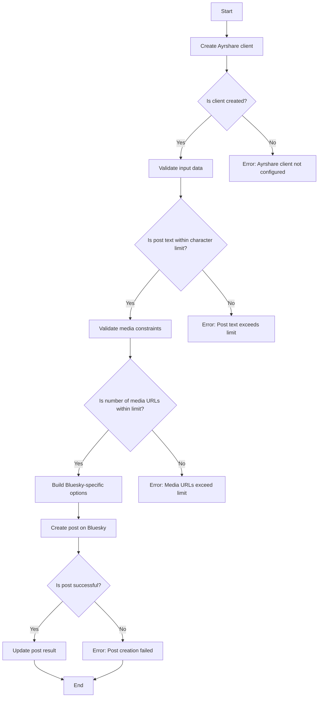
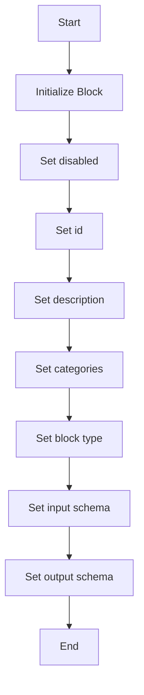
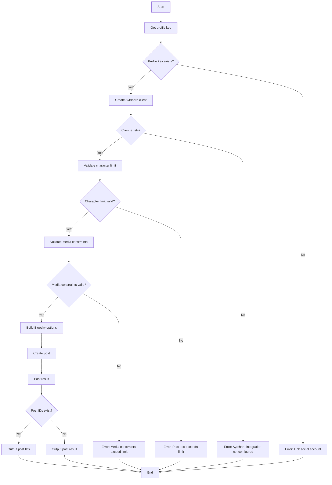

# `.\AutoGPT\autogpt_platform\backend\backend\blocks\ayrshare\post_to_bluesky.py` 详细设计文档

The code defines a class for posting content to the Bluesky social platform using the Ayrshare API, with specific options and validations for Bluesky.

## 整体流程



## 类结构

```
PostToBlueskyBlock (Concrete class)
├── Input (Nested class)
│   ├── post (str)
│   ├── media_urls (list[str])
│   └── alt_text (list[str])
└── Output (Nested class)
    ├── post_result (PostResponse)
    └── post (PostIds)
```

## 全局变量及字段


### `disabled`
    
Indicates whether the block is disabled or not.

类型：`bool`
    


### `id`
    
Unique identifier for the block.

类型：`str`
    


### `description`
    
Description of the block's functionality.

类型：`str`
    


### `categories`
    
Set of categories the block belongs to.

类型：`set[str]`
    


### `block_type`
    
Type of block, derived from the Ayrshare integration.

类型：`BlockType`
    


### `input_schema`
    
Input schema for the block.

类型：`PostToBlueskyBlock.Input`
    


### `output_schema`
    
Output schema for the block.

类型：`PostToBlueskyBlock.Output`
    


### `post`
    
The post text to be published (max 300 characters for Bluesky).

类型：`str`
    


### `media_urls`
    
Optional list of media URLs to include. Bluesky supports up to 4 images or 1 video.

类型：`list[str]`
    


### `alt_text`
    
Alt text for each media item (accessibility).

类型：`list[str]`
    


### `post_result`
    
The result of the post.

类型：`PostResponse`
    


### `post`
    
The result of the post.

类型：`PostIds`
    


### `PostToBlueskyBlock.disabled`
    
Indicates whether the block is disabled or not.

类型：`bool`
    


### `PostToBlueskyBlock.id`
    
Unique identifier for the block.

类型：`str`
    


### `PostToBlueskyBlock.description`
    
Description of the block's functionality.

类型：`str`
    


### `PostToBlueskyBlock.categories`
    
Set of categories the block belongs to.

类型：`set[str]`
    


### `PostToBlueskyBlock.block_type`
    
Type of block, derived from the Ayrshare integration.

类型：`BlockType`
    


### `PostToBlueskyBlock.input_schema`
    
Input schema for the block.

类型：`PostToBlueskyBlock.Input`
    


### `PostToBlueskyBlock.output_schema`
    
Output schema for the block.

类型：`PostToBlueskyBlock.Output`
    


### `Input.post`
    
The post text to be published (max 300 characters for Bluesky).

类型：`str`
    


### `Input.media_urls`
    
Optional list of media URLs to include. Bluesky supports up to 4 images or 1 video.

类型：`list[str]`
    


### `Input.alt_text`
    
Alt text for each media item (accessibility).

类型：`list[str]`
    


### `Output.post_result`
    
The result of the post.

类型：`PostResponse`
    


### `Output.post`
    
The result of the post.

类型：`PostIds`
    
    

## 全局函数及方法


### `PostToBlueskyBlock.__init__`

This method initializes the `PostToBlueskyBlock` class, setting up its properties and configurations.

参数：

- `disabled`：`bool`，Indicates whether the block is disabled or not.
- `id`：`str`，Unique identifier for the block.
- `description`：`str`，Description of the block's functionality.
- `categories`：`set`，Categories to which the block belongs.
- `block_type`：`BlockType`，Type of the block.
- `input_schema`：`PostToBlueskyBlock.Input`，Input schema for the block.
- `output_schema`：`PostToBlueskyBlock.Output`，Output schema for the block.

返回值：`None`，This method does not return any value.

#### 流程图



#### 带注释源码

```python
def __init__(self):
    super().__init__(
        disabled=True,
        id="cbd52c2a-06d2-43ed-9560-6576cc163283",
        description="Post to Bluesky using Ayrshare",
        categories={BlockCategory.SOCIAL},
        block_type=BlockType.AYRSHARE,
        input_schema=PostToBlueskyBlock.Input,
        output_schema=PostToBlueskyBlock.Output,
    )
```


### PostToBlueskyBlock.run

Post to Bluesky with Bluesky-specific options.

参数：

- `input_data`：`PostToBlueskyBlock.Input`，The input data containing the post text, media URLs, and other options for the Bluesky post.
- `user_id`：`str`，The user ID associated with the social account to be used for posting.

返回值：`BlockOutput`，The output containing the result of the post.

#### 流程图



#### 带注释源码

```python
async def run(
    self,
    input_data: "PostToBlueskyBlock.Input",
    *,
    user_id: str,
    **kwargs,
) -> BlockOutput:
    """Post to Bluesky with Bluesky-specific options."""

    profile_key = await get_profile_key(user_id)
    if not profile_key:
        yield "error", "Please link a social account via Ayrshare"
        return

    client = create_ayrshare_client()
    if not client:
        yield "error", "Ayrshare integration is not configured. Please set up the AYRSHARE_API_KEY."
        return

    # Validate character limit for Bluesky
    if len(input_data.post) > 300:
        yield "error", f"Post text exceeds Bluesky's 300 character limit ({len(input_data.post)} characters)"
        return

    # Validate media constraints for Bluesky
    if len(input_data.media_urls) > 4:
        yield "error", "Bluesky supports a maximum of 4 images or 1 video"
        return

    # Convert datetime to ISO format if provided
    iso_date = (
        input_data.schedule_date.isoformat() if input_data.schedule_date else None
    )

    # Build Bluesky-specific options
    bluesky_options = {}
    if input_data.alt_text:
        bluesky_options["altText"] = input_data.alt_text

    response = await client.create_post(
        post=input_data.post,
        platforms=[SocialPlatform.BLUESKY],
        media_urls=input_data.media_urls,
        is_video=input_data.is_video,
        schedule_date=iso_date,
        disable_comments=input_data.disable_comments,
        shorten_links=input_data.shorten_links,
        unsplash=input_data.unsplash,
        requires_approval=input_data.requires_approval,
        random_post=input_data.random_post,
        random_media_url=input_data.random_media_url,
        notes=input_data.notes,
        bluesky_options=bluesky_options if bluesky_options else None,
        profile_key=profile_key.get_secret_value(),
    )
    yield "post_result", response
    if response.postIds:
        for p in response.postIds:
            yield "post", p
``` 


## 关键组件


### 张量索引与惰性加载

用于在处理大型数据集时，延迟加载和索引数据，以优化内存使用和性能。

### 反量化支持

提供对反量化操作的支持，允许在量化过程中进行逆量化，以恢复原始数据。

### 量化策略

定义了量化策略，用于在模型训练和推理过程中对权重和激活进行量化，以减少模型大小和提高推理速度。


## 问题及建议


### 已知问题

-   **代码重复**：`PostToBlueskyBlock.Input` 和 `PostToBlueskyBlock.Output` 类中定义的字段与 `BaseAyrshareInput` 类中定义的字段存在重复，这可能导致维护困难。
-   **错误处理**：错误信息可能不够具体，例如 "Ayrshare integration is not configured. Please set up the AYRSHARE_API_KEY."，没有明确指出是配置文件缺失还是API密钥未设置。
-   **异常处理**：代码中使用了 `yield` 来处理错误，但没有明确处理可能发生的异常，如网络请求失败或API响应错误。
-   **代码可读性**：`run` 方法中的逻辑较为复杂，缺乏注释，难以理解每个步骤的目的。

### 优化建议

-   **减少代码重复**：将重复的字段移至 `BaseAyrshareInput` 类中，并在 `PostToBlueskyBlock.Input` 和 `PostToBlueskyBlock.Output` 类中引用。
-   **增强错误处理**：提供更具体的错误信息，并考虑使用异常处理机制来捕获和处理潜在的错误。
-   **增加代码注释**：在复杂逻辑处添加注释，以提高代码的可读性和可维护性。
-   **代码结构优化**：考虑将 `run` 方法中的逻辑分解为更小的函数，以提高代码的可读性和可测试性。
-   **性能优化**：检查 `run` 方法中的循环和条件判断，确保它们在所有情况下都是高效的。


## 其它


### 设计目标与约束

- 设计目标：确保代码能够高效、可靠地将用户内容发布到Bluesky平台，同时遵守Bluesky平台的特定限制和规范。
- 约束：
  - 代码必须使用Ayrshare SDK进行集成。
  - 必须遵守Bluesky平台的字符限制和媒体上传规则。
  - 代码应具备良好的错误处理和异常管理能力。

### 错误处理与异常设计

- 错误处理：代码中使用了`yield`语句来返回错误信息，确保错误能够被上层处理。
- 异常设计：通过检查API调用结果和输入数据的有效性来避免异常，并在必要时抛出异常。

### 数据流与状态机

- 数据流：用户输入通过`PostToBlueskyBlock.Input`类进行验证和格式化，然后通过Ayrshare SDK发送到Bluesky平台。
- 状态机：代码中没有显式的状态机，但可以通过输入数据和API响应来推断状态变化。

### 外部依赖与接口契约

- 外部依赖：代码依赖于Ayrshare SDK和Bluesky平台的API。
- 接口契约：通过`PostToBlueskyBlock`类和`create_ayrshare_client`函数与外部系统交互，确保接口的一致性和稳定性。


    