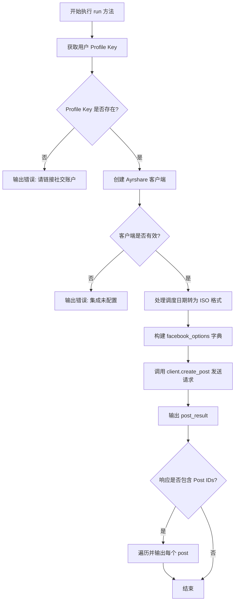
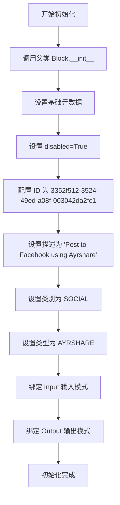
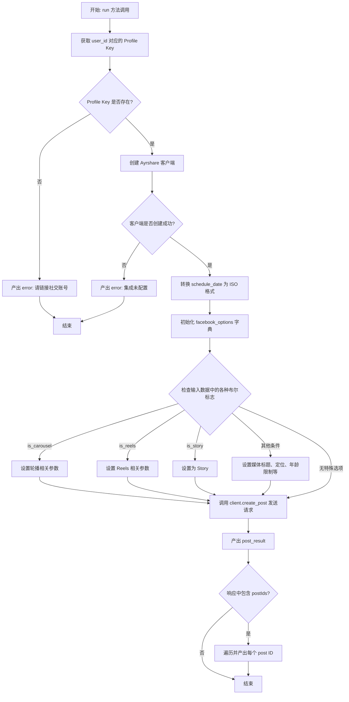

# `AutoGPT\autogpt_platform\backend\backend\blocks\ayrshare\post_to_facebook.py` 详细设计文档

该代码定义了一个专门用于向 Facebook 发布内容的 Block 组件，通过 Ayrshare API 实现了包含轮播、Reels、Story 及目标定位等 Facebook 特定功能的封装，负责处理输入验证、用户配置获取及最终的 API 调用与结果返回。

## 整体流程



## 类结构

```
PostToFacebookBlock (Block)
├── Input (BaseAyrshareInput)
└── Output (BlockSchemaOutput)
```

## 全局变量及字段


### `PostToFacebookBlock.Input.is_carousel`
    
Whether to post a carousel

类型：`bool`
    


### `PostToFacebookBlock.Input.carousel_link`
    
The URL for the 'See More At' button in the carousel

类型：`str`
    


### `PostToFacebookBlock.Input.carousel_items`
    
List of carousel items with name, link and picture URLs. Min 2, max 10 items.

类型：`list[CarouselItem]`
    


### `PostToFacebookBlock.Input.is_reels`
    
Whether to post to Facebook Reels

类型：`bool`
    


### `PostToFacebookBlock.Input.reels_title`
    
Title for the Reels video (max 255 chars)

类型：`str`
    


### `PostToFacebookBlock.Input.reels_thumbnail`
    
Thumbnail URL for Reels video (JPEG/PNG, <10MB)

类型：`str`
    


### `PostToFacebookBlock.Input.is_story`
    
Whether to post as a Facebook Story

类型：`bool`
    


### `PostToFacebookBlock.Input.media_captions`
    
Captions for each media item

类型：`list[str]`
    


### `PostToFacebookBlock.Input.location_id`
    
Facebook Page ID or name for location tagging

类型：`str`
    


### `PostToFacebookBlock.Input.age_min`
    
Minimum age for audience targeting (13,15,18,21,25)

类型：`int`
    


### `PostToFacebookBlock.Input.target_countries`
    
List of country codes to target (max 25)

类型：`list[str]`
    


### `PostToFacebookBlock.Input.alt_text`
    
Alt text for each media item

类型：`list[str]`
    


### `PostToFacebookBlock.Input.video_title`
    
Title for video post

类型：`str`
    


### `PostToFacebookBlock.Input.video_thumbnail`
    
Thumbnail URL for video post

类型：`str`
    


### `PostToFacebookBlock.Input.is_draft`
    
Save as draft in Meta Business Suite

类型：`bool`
    


### `PostToFacebookBlock.Input.scheduled_publish_date`
    
Schedule publish time in Meta Business Suite (UTC)

类型：`str`
    


### `PostToFacebookBlock.Input.preview_link`
    
URL for custom link preview

类型：`str`
    


### `PostToFacebookBlock.Output.post_result`
    
The result of the post

类型：`PostResponse`
    


### `PostToFacebookBlock.Output.post`
    
The result of the post

类型：`PostIds`
    
    

## 全局函数及方法


### `PostToFacebookBlock.__init__`

初始化 Facebook 发布块，配置块的唯一标识、描述、分类、类型以及输入输出的数据结构模式。

参数：

无

返回值：`None`，无返回值

#### 流程图



#### 带注释源码

```python
def __init__(self):
    # 调用父类 Block 的初始化方法，传递配置参数
    super().__init__(
        disabled=True,  # 默认禁用状态
        id="3352f512-3524-49ed-a08f-003042da2fc1",  # 块的唯一标识符
        description="Post to Facebook using Ayrshare",  # 块的功能描述
        categories={BlockCategory.SOCIAL},  # 块所属的分类：社交
        block_type=BlockType.AYRSHARE,  # 块的类型：Ayrshare 集成
        input_schema=PostToFacebookBlock.Input,  # 定义输入数据结构模式
        output_schema=PostToFacebookBlock.Output,  # 定义输出数据结构模式
    )
```


### `PostToFacebookBlock.run`

异步执行向 Facebook 发布内容的操作，包括验证账户绑定、构建 Facebook 特定发布选项（如轮播、Reels、定位等）以及调用 Ayrshare API 完成发布。

参数：

- `self`：`PostToFacebookBlock`，类实例本身。
- `input_data`：`PostToFacebookBlock.Input`，输入数据模型，包含发布内容、媒体文件及 Facebook 特定配置（如轮播、Reels 选项等）。
- `user_id`：`str`，用户的唯一标识符，用于查找对应的 Ayrshare 社交账号配置。
- `**kwargs`：`dict`，额外的关键字参数。

返回值：`BlockOutput`，异步生成器，产出包含发布结果（`PostResponse`）或错误信息的键值对元组。

#### 流程图



#### 带注释源码

```python
    async def run(
        self,
        input_data: "PostToFacebookBlock.Input",
        *,
        user_id: str,
        **kwargs,
    ) -> BlockOutput:
        """Post to Facebook with Facebook-specific options."""
        # 1. 验证用户是否已绑定社交账号
        profile_key = await get_profile_key(user_id)
        if not profile_key:
            yield "error", "Please link a social account via Ayrshare"
            return

        # 2. 验证 Ayrshare 集成是否配置（API Key 是否存在）
        client = create_ayrshare_client()
        if not client:
            yield "error", "Ayrshare integration is not configured. Please set up the AYRSHARE_API_KEY."
            return

        # 3. 如果提供了调度日期，将其转换为 ISO 格式字符串
        iso_date = (
            input_data.schedule_date.isoformat() if input_data.schedule_date else None
        )

        # 4. 构建 Facebook 特定的发布选项字典
        facebook_options = {}
        
        # 处理轮播 选项
        if input_data.is_carousel:
            facebook_options["isCarousel"] = True
            if input_data.carousel_link:
                facebook_options["carouselLink"] = input_data.carousel_link
            if input_data.carousel_items:
                facebook_options["carouselItems"] = [
                    item.dict() for item in input_data.carousel_items
                ]

        # 处理 Reels 选项
        if input_data.is_reels:
            facebook_options["isReels"] = True
            if input_data.reels_title:
                facebook_options["reelsTitle"] = input_data.reels_title
            if input_data.reels_thumbnail:
                facebook_options["reelsThumbnail"] = input_data.reels_thumbnail

        # 处理 Story 选项
        if input_data.is_story:
            facebook_options["isStory"] = True

        # 处理媒体描述、定位、年龄限制、国家定向等高级选项
        if input_data.media_captions:
            facebook_options["mediaCaptions"] = input_data.media_captions

        if input_data.location_id:
            facebook_options["locationId"] = input_data.location_id

        if input_data.age_min > 0:
            facebook_options["ageMin"] = input_data.age_min

        if input_data.target_countries:
            facebook_options["targetCountries"] = input_data.target_countries

        if input_data.alt_text:
            facebook_options["altText"] = input_data.alt_text

        # 处理视频相关选项
        if input_data.video_title:
            facebook_options["videoTitle"] = input_data.video_title

        if input_data.video_thumbnail:
            facebook_options["videoThumbnail"] = input_data.video_thumbnail

        # 处理草稿、定时发布和预览链接
        if input_data.is_draft:
            facebook_options["isDraft"] = True

        if input_data.scheduled_publish_date:
            facebook_options["scheduledPublishDate"] = input_data.scheduled_publish_date

        if input_data.preview_link:
            facebook_options["previewLink"] = input_data.preview_link

        # 5. 调用 Ayrshare 客户端创建帖子
        response = await client.create_post(
            post=input_data.post,
            platforms=[SocialPlatform.FACEBOOK],
            media_urls=input_data.media_urls,
            is_video=input_data.is_video,
            schedule_date=iso_date,
            disable_comments=input_data.disable_comments,
            shorten_links=input_data.shorten_links,
            unsplash=input_data.unsplash,
            requires_approval=input_data.requires_approval,
            random_post=input_data.random_post,
            random_media_url=input_data.random_media_url,
            notes=input_data.notes,
            facebook_options=facebook_options if facebook_options else None,
            profile_key=profile_key.get_secret_value(),
        )
        
        # 6. 产出完整响应对象
        yield "post_result", response
        
        # 7. 如果响应中包含 ID，则单独产出每个 ID
        if response.postIds:
            for p in response.postIds:
                yield "post", p
```


## 关键组件


### PostToFacebookBlock 主类
封装 Facebook 发布功能的核心类，继承自 `Block`，负责定义输入输出 Schema、元数据以及执行发布的主要逻辑。

### Input 输入模型
继承自 `BaseAyrshareInput` 的内部类，定义了包含通用社交媒体参数及 Facebook 特有选项（如轮播、Reels、故事、位置定位、草稿设置等）的输入数据结构。

### Output 输出模型
定义了 API 调用的输出结构，主要包含 Ayrshare 返回的 `PostResponse` 对象和具体的 `PostIds` 列表。

### 业务执行逻辑 (run 方法)
异步执行方法，负责获取用户配置密钥、初始化 Ayrshare 客户端、将输入字段映射为 Facebook API 特定选项字典，并最终调用客户端执行发布操作。


## 问题及建议


### 已知问题

-   缺少输入字段约束验证：代码仅通过文档字符串（如 "Min 2, max 10 items"）描述了约束，但在运行 `run` 方法之前并未强制执行验证。如果用户提交无效数据，错误仅由下游 API 返回，导致用户体验不佳。
-   缺少异常处理机制：`run` 方法中调用 `client.create_post` 时未包裹 `try-except` 块。如果 Ayrshare API 抛出网络错误或 API 错误，未被捕获的异常可能导致 Block 崩溃或产生难以理解的错误信息。
-   代码冗余且不易维护：构建 `facebook_options` 字典的逻辑使用了大量的 `if` 语句来检查字段是否存在并赋值。这种模式导致代码冗长，且如果字段名变更（如 `is_carousel` 对应 API 的 `isCarousel`），维护成本较高。
-   潜在的类型转换风险：代码直接调用 `input_data.schedule_date.isoformat()`，假设该字段一定是 `datetime` 对象。如果输入已经是一个 ISO 格式的字符串，调用此方法会抛出 `AttributeError`。

### 优化建议

-   引入 Pydantic 验证器：在 `Input` 类内部使用 Pydantic 的 `validator` 装饰器，在数据解析阶段即验证 `carousel_items` 的数量（2-10个）、`reels_title` 的长度（255字符）等约束，提前拦截非法输入。
-   封装选项构建逻辑：将 `facebook_options` 的构建逻辑抽取为一个辅助方法或使用映射字典。例如定义一个映射关系 `{'is_carousel': 'isCarousel'}`，利用循环或字典推导式动态生成，减少样板代码，提高可读性。
-   增加异常捕获与日志记录：在调用 `client.create_post` 的地方增加 `try-except` 块，捕获特定异常（如连接超时、认证失败），并通过 `yield "error", ...` 返回标准化的错误信息。同时添加日志记录关键步骤（如 API 请求参数和响应）。
-   增强类型安全与健壮性：对于 `schedule_date` 的处理，应增加类型检查或使用 `isinstance` 判断，确保仅在对象为 `datetime` 时才调用 `.isoformat()`，或者直接依赖 Pydantic 的序列化功能处理日期转换。


## 其它


### 设计目标与约束

**设计目标：**
1.  **功能封装**：将 Ayrshare API 的 Facebook 发布功能封装为独立的 Block，支持文本、图片、视频、轮播、Reels 和快拍等多种内容形式的发布。
2.  **配置灵活性**：提供丰富的 Facebook 特定参数（如受众定位、草稿保存、定时发布、地点标记等），允许用户精细控制发布行为。
3.  **系统集成**：无缝对接现有的 Block 架构，利用统一的身份验证（Profile Key）和客户端管理机制。

**约束条件：**
1.  **依赖配置**：运行依赖于系统环境变量中已配置 `AYRSHARE_API_KEY`，否则 Block 无法正常工作（默认 `disabled=True`）。
2.  **用户权限**：执行前必须确保用户已通过 Ayrshare 关联了 Facebook 账户（即存在有效的 `profile_key`）。
3.  **平台限制**：需遵守 Facebook API 的限制，例如轮播项必须在 2 到 10 个之间，缩略图大小限制（<10MB）以及目标国家数量限制（最多 25 个）。
4.  **数据格式**：输入的时间数据需转换为 ISO 格式字符串，复杂数据结构（如 `carousel_items`）需序列化为字典形式传输。

### 错误处理与异常设计

1.  **处理机制**：
    *   采用 `yield` 机制返回错误信息，而非抛出未捕获的异常，确保流程在遇到错误时能优雅地向用户反馈具体原因。
    *   错误通过特定的键 `"error"` 输出，伴随描述性消息字符串。

2.  **检查点**：
    *   **账户关联检查**：在调用 API 前，检查 `get_profile_key(user_id)` 是否返回有效值。若无效，返回错误提示 "Please link a social account via Ayrshare"。
    *   **集成配置检查**：检查 `create_ayrshare_client()` 是否成功初始化客户端。若失败（通常是因为 API Key 缺失），返回错误提示 "Ayrshare integration is not configured..."。

3.  **异常传播**：
    *   虽然代码中未显式捕获 `client.create_post` 调用期间的异常（如网络超时或 API 返回 500 错误），但假设底层 SDK 会处理或抛出异常。设计上暗示如果发生未捕获异常，应由上层调用栈（Block 运行时环境）统一处理，或者 SDK 会将其封装在 `PostResponse` 的错误字段中。

### 数据流与状态机

**数据流：**
1.  **输入阶段**：接收 `input_data`（包含文本、媒体及 Facebook 特定选项）和 `user_id`。
2.  **初始化阶段**：异步获取用户的 `profile_key`（密钥）并初始化 Ayrshare 客户端。
3.  **数据转换阶段**：
    *   将 `schedule_date` 对象转换为 ISO 8601 字符串。
    *   遍历输入字段，根据布尔标志（如 `is_carousel`, `is_reels`）动态构建 `facebook_options` 字典，仅包含非空或启用的配置项。
    *   将 `CarouselItem` 对象列表转换为字典列表。
4.  **执行阶段**：调用 `client.create_post`，将通用参数与构建好的 `facebook_options` 发送给 Ayrshare API。
5.  **输出阶段**：
    *   首先输出完整的 `post_result` (`PostResponse` 对象)。
    *   遍历响应中的 `postIds`，逐个输出 `post` ID。

**状态机：**
该 Block 本身为无状态服务组件，但在运行时上下文中表现为以下状态流转：
*   **Idle (闲置/禁用)**：初始状态，`disabled=True`，等待系统配置就绪。
*   **Validating (验证中)**：进入 `run` 方法，检查用户 Profile 和 API 配置。
*   **Processing (处理中)**：构建参数并等待网络请求返回。
*   **Completed (完成)**：成功返回 `post_result` 和 `post` IDs。
*   **Error (错误)**：在验证或请求过程中失败，输出 `error` 信息并终止。

### 外部依赖与接口契约

1.  **外部库依赖**：
    *   `backend.sdk`：提供了 `Block`, `BlockOutput`, `BlockSchemaOutput` 等基础抽象类，定义了 Block 的输入输出契约和运行模式。
    *   `backend.integrations.ayrshare`：提供了与社交媒体交互的核心数据结构（`PostIds`, `PostResponse`, `SocialPlatform`）。
    *   `._util`：提供了 `BaseAyrshareInput`（基础输入模式），`create_ayrshare_client`（客户端工厂函数），`get_profile_key`（用户密钥获取函数）。

2.  **接口契约**：
    *   **`create_ayrshare_client()`**：
        *   输入：无（依赖全局配置）。
        *   输出：Ayrshare 客户端实例或 `None`。
    *   **`get_profile_key(user_id: str)`**：
        *   输入：用户 ID。
        *   输出：`SecretStr` 对象或 `None`。
    *   **`client.create_post(...)`**：
        *   输入：包含 `post`, `platforms`, `media_urls`, `facebook_options` 等参数的字典/对象。
        *   输出：`PostResponse` 对象，包含状态、ID 等信息。
    *   **`PostToFacebookBlock.Input`**：
        *   继承自 `BaseAyrshareInput`，强制要求具备基础发布字段，并扩展了 Facebook 特有字段（如 `is_carousel`, `reels_title` 等）。
    *   **`PostToFacebookBlock.Output`**：
        *   约定输出必须包含 `post_result` (完整响应) 和 `post` (具体 ID 列表)。

    