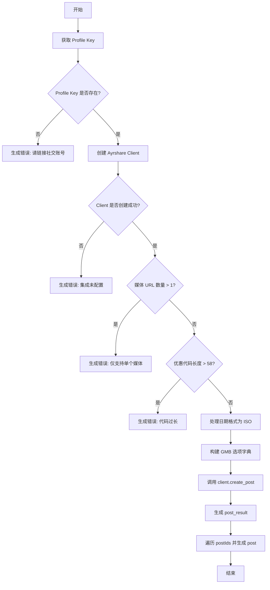
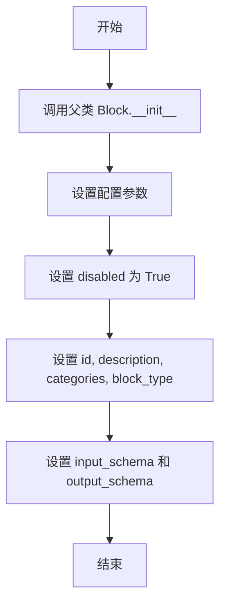
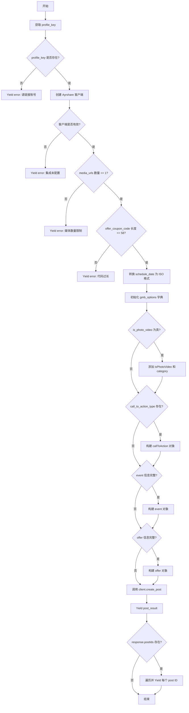

# `AutoGPT\autogpt_platform\backend\backend\blocks\ayrshare\post_to_gmb.py` 详细设计文档

该代码定义了一个 `PostToGMBBlock` 类，继承自 `Block`，旨在通过 Ayrshare API 将内容发布到 Google My Business (GMB)。它处理 GMB 特定的输入模式（如媒体限制、号召性用行动按钮、活动详情和优惠详情），验证约束条件，构建特定的负载，并调用客户端执行发布操作。

## 整体流程



## 类结构

```
PostToGMBBlock (继承自 Block)
├── Input (继承自 BaseAyrshareInput)
│   ├── media_urls
│   ├── is_photo_video
│   ├── photo_category
│   ├── call_to_action_type
│   ├── call_to_action_url
│   ├── event_title
│   ├── event_start_date
│   ├── event_end_date
│   ├── offer_title
│   ├── offer_start_date
│   ├── offer_end_date
│   ├── offer_coupon_code
│   ├── offer_redeem_online_url
│   └── offer_terms_conditions
└── Output (继承自 BlockSchemaOutput)
    ├── post_result
    └── post
```

## 全局变量及字段


### `PostToGMBBlock.Input.media_urls`
    
Optional list of media URLs. GMB supports only one image or video per post.

类型：`list[str]`
    


### `PostToGMBBlock.Input.is_photo_video`
    
Whether this is a photo/video post (appears in Photos section)

类型：`bool`
    


### `PostToGMBBlock.Input.photo_category`
    
Category for photo/video: cover, profile, logo, exterior, interior, product, at_work, food_and_drink, menu, common_area, rooms, teams

类型：`str`
    


### `PostToGMBBlock.Input.call_to_action_type`
    
Type of action button: 'book', 'order', 'shop', 'learn_more', 'sign_up', or 'call'

类型：`str`
    


### `PostToGMBBlock.Input.call_to_action_url`
    
URL for the action button (not required for 'call' action)

类型：`str`
    


### `PostToGMBBlock.Input.event_title`
    
Event title for event posts

类型：`str`
    


### `PostToGMBBlock.Input.event_start_date`
    
Event start date in ISO format (e.g., '2024-03-15T09:00:00Z')

类型：`str`
    


### `PostToGMBBlock.Input.event_end_date`
    
Event end date in ISO format (e.g., '2024-03-15T17:00:00Z')

类型：`str`
    


### `PostToGMBBlock.Input.offer_title`
    
Offer title for promotional posts

类型：`str`
    


### `PostToGMBBlock.Input.offer_start_date`
    
Offer start date in ISO format (e.g., '2024-03-15T00:00:00Z')

类型：`str`
    


### `PostToGMBBlock.Input.offer_end_date`
    
Offer end date in ISO format (e.g., '2024-04-15T23:59:59Z')

类型：`str`
    


### `PostToGMBBlock.Input.offer_coupon_code`
    
Coupon code for the offer (max 58 characters)

类型：`str`
    


### `PostToGMBBlock.Input.offer_redeem_online_url`
    
URL where customers can redeem the offer online

类型：`str`
    


### `PostToGMBBlock.Input.offer_terms_conditions`
    
Terms and conditions for the offer

类型：`str`
    


### `PostToGMBBlock.Output.post_result`
    
The result of the post

类型：`PostResponse`
    


### `PostToGMBBlock.Output.post`
    
The result of the post

类型：`PostIds`
    
    

## 全局函数及方法


### `PostToGMBBlock.__init__`

初始化 Google My Business (GMB) 发布块，通过调用父类构造函数设置其唯一标识符、描述、分类、类型以及输入输出 Schema，并将其默认状态设置为禁用。

参数：

-  `self`：`PostToGMBBlock`，类的实例引用。

返回值：`None`，Python 构造函数无返回值。

#### 流程图



#### 带注释源码

```python
def __init__(self):
    # 调用父类 Block 的构造函数进行初始化
    super().__init__(
        disabled=True,  # 将 Block 初始状态设置为禁用
        id="2c38c783-c484-4503-9280-ef5d1d345a7e",  # Block 的唯一标识符
        description="Post to Google My Business using Ayrshare",  # Block 的功能描述
        categories={BlockCategory.SOCIAL},  # 将 Block 归类为社交媒体类
        block_type=BlockType.AYRSHARE,  # 指定 Block 类型为 AYRSHARE
        input_schema=PostToGMBBlock.Input,  # 指定输入数据结构为内部类 Input
        output_schema=PostToGMBBlock.Output,  # 指定输出数据结构为内部类 Output
    )
```


### `PostToGMBBlock.run`

该方法负责处理向 Google My Business (GMB) 发帖的异步请求。它验证输入数据（如 GMB 特定的限制），构建 GMB 特定的选项（如媒体类型、行动号召、活动详情和优惠详情），通过 Ayrshare 客户端执行发布操作，并返回发布结果。

参数：

- `input_data`：`PostToGMBBlock.Input`，包含帖子内容、媒体链接、调度设置以及 GMB 特定选项（如 Call to Action、Event、Offer 等）的输入数据对象。
- `user_id`：`str`，发起请求的用户的唯一标识符，用于检索关联的社交账号配置。
- `**kwargs`：`dict`，额外的关键字参数，用于扩展或传递上下文信息（当前实现中未直接使用）。

返回值：`BlockOutput`，一个异步生成器，用于逐步返回执行结果。成功时返回发布响应对象和具体的 Post ID，失败时返回错误信息。

#### 流程图



#### 带注释源码

```python
async def run(
    self, input_data: "PostToGMBBlock.Input", *, user_id: str, **kwargs
) -> BlockOutput:
    """Post to Google My Business with GMB-specific options."""
    # 1. 获取用户的 Profile Key
    profile_key = await get_profile_key(user_id)
    if not profile_key:
        yield "error", "Please link a social account via Ayrshare"
        return

    # 2. 初始化 Ayrshare 客户端
    client = create_ayrshare_client()
    if not client:
        yield "error", "Ayrshare integration is not configured. Please set up the AYRSHARE_API_KEY."
        return

    # 3. 验证 GMB 约束：媒体数量限制
    if len(input_data.media_urls) > 1:
        yield "error", "Google My Business supports only one image or video per post"
        return

    # 4. 验证 GMB 约束：优惠优惠券代码长度
    if input_data.offer_coupon_code and len(input_data.offer_coupon_code) > 58:
        yield "error", "GMB offer coupon code cannot exceed 58 characters"
        return

    # 5. 处理调度日期格式
    iso_date = (
        input_data.schedule_date.isoformat() if input_data.schedule_date else None
    )

    # 6. 构建 GMB 特定选项字典
    gmb_options = {}

    # 6.1 处理照片/视频选项
    if input_data.is_photo_video:
        gmb_options["isPhotoVideo"] = True
        if input_data.photo_category:
            gmb_options["category"] = input_data.photo_category

    # 6.2 处理 Call to Action (CTA)
    if input_data.call_to_action_type:
        cta_dict = {"actionType": input_data.call_to_action_type}
        # 'call' 类型不需要 URL
        if (
            input_data.call_to_action_type != "call"
            and input_data.call_to_action_url
        ):
            cta_dict["url"] = input_data.call_to_action_url
        gmb_options["callToAction"] = cta_dict

    # 6.3 处理活动详情
    if (
        input_data.event_title
        and input_data.event_start_date
        and input_data.event_end_date
    ):
        gmb_options["event"] = {
            "title": input_data.event_title,
            "startDate": input_data.event_start_date,
            "endDate": input_data.event_end_date,
        }

    # 6.4 处理优惠详情
    if (
        input_data.offer_title
        and input_data.offer_start_date
        and input_data.offer_end_date
        and input_data.offer_coupon_code
        and input_data.offer_redeem_online_url
        and input_data.offer_terms_conditions
    ):
        gmb_options["offer"] = {
            "title": input_data.offer_title,
            "startDate": input_data.offer_start_date,
            "endDate": input_data.offer_end_date,
            "couponCode": input_data.offer_coupon_code,
            "redeemOnlineUrl": input_data.offer_redeem_online_url,
            "termsConditions": input_data.offer_terms_conditions,
        }

    # 7. 调用客户端创建帖子
    response = await client.create_post(
        post=input_data.post,
        platforms=[SocialPlatform.GOOGLE_MY_BUSINESS],
        media_urls=input_data.media_urls,
        is_video=input_data.is_video,
        schedule_date=iso_date,
        disable_comments=input_data.disable_comments,
        shorten_links=input_data.shorten_links,
        unsplash=input_data.unsplash,
        requires_approval=input_data.requires_approval,
        random_post=input_data.random_post,
        random_media_url=input_data.random_media_url,
        notes=input_data.notes,
        gmb_options=gmb_options if gmb_options else None,
        profile_key=profile_key.get_secret_value(),
    )
    
    # 8. 返回结果
    yield "post_result", response
    if response.postIds:
        for p in response.postIds:
            yield "post", p
```


## 关键组件


### PostToGMBBlock.Input 类

定义了用于 Google My Business 发布的输入模式，继承基础输入并扩展了媒体限制、照片分类、行动号召、事件详情及优惠详情等 GMB 特定字段。

### GMB 约束验证逻辑

在执行发布前对输入数据进行业务规则校验，具体包括限制媒体 URL 数量为 1 个以及验证优惠优惠券代码长度不超过 58 字符。

### GMB 选项映射与组装

负责将扁平化的输入字段（如 CTA、事件、优惠）转换为符合 Ayrshare API 要求的嵌套 `gmb_options` 字典结构，实现数据的格式适配。

### Ayrshare 客户端交互

通过获取用户配置文件密钥并实例化 Ayrshare 客户端，异步调用 `create_post` 接口将内容发布到 Google My Business 平台。


## 问题及建议


### 已知问题

-   **事件和优惠字段的全有或全无逻辑**：在构建 `gmb_options` 时，代码仅当事件的所有 3 个字段（标题、开始日期、结束日期）或优惠的所有 6 个字段均存在时才会包含该选项。如果用户仅提供了部分字段（例如提供了标题但忘记结束日期），代码会静默忽略整个配置，而不是报错或尽可能处理，这可能导致发布的内容与用户预期不符。
-   **Call to Action 的 URL 验证不足**：对于非 `call` 类型的操作按钮（如 `book`, `shop`），通常 URL 是必填的。当前逻辑仅当 URL 存在时才将其加入字典，如果用户选择了 `book` 类型但未提供 URL，代码仍会发送不完整的请求给 API，可能导致 API 报错或发布失败，且没有明确的本地提示。
-   **日期处理类型不一致**：`schedule_date` 被视为 `datetime` 对象并调用 `.isoformat()`，而事件和优惠的开始/结束日期被定义为 `str`。这种类型不一致增加了使用的复杂度，且对字符串格式的日期缺乏运行时校验，可能导致 API 调用时因格式错误而失败。

### 优化建议

-   **引入枚举类约束字段值**：`call_to_action_type` 和 `photo_category` 等字段目前仅通过 `description` 提示可选值。建议使用 `Enum` 或 Pydantic 的 `Literal` 类型来强制约束输入值，减少拼写错误和无效数据的提交。
-   **拆分复杂逻辑到辅助方法**：`run` 方法中包含大量的条件判断和字典构建逻辑（特别是 GMB 选项的组装）。建议将 GMB 选项的构建逻辑提取到私有方法（如 `_build_gmb_options`）中，以提高代码的可读性和可测试性。
-   **增强输入校验与错误反馈**：将字段长度限制（如 `offer_coupon_code` < 58 字符）和必填字段组合的校验逻辑前置到 Schema 层（利用 Pydantic Validators）或在 `run` 方法开始时进行集中校验。对于校验失败的情况，提供更具体的错误信息（如指出具体缺失的字段），而不是简单的通用错误提示。
-   **统一日期处理策略**：建议将所有日期字段（`event_start_date`, `offer_end_date` 等）统一处理，或者在 Schema 层定义为 `datetime` 类型自动转换，或者全部接受字符串并在内部统一验证 ISO 格式，以保持代码的一致性。
-   **使用数据类或字典封装复杂参数**：针对 `CallToAction`、`Event` 和 `Offer` 这种结构化的参数，建议定义内部的 Pydantic 模型或数据类来管理，而不是直接在顶层 Input 类中打平为多个独立字段，这样能更好地管理数据的完整性和逻辑关系。


## 其它


### 设计目标与约束

**设计目标：**
1.  **封装复杂性**：将 Google My Business (GMB) 特有的发布选项（如优惠、活动、号召性用语）封装为结构化的输入 Schema，简化上层调用逻辑。
2.  **统一接口**：作为 `Block` 体系的一部分，提供标准的异步执行接口 (`run`)，以便在自动化工作流中统一调度。
3.  **数据转换**：将用户友好的扁平化输入字段转换为 Ayrshare API 所需的嵌套 JSON 结构（如 `gmb_options`）。

**约束：**
1.  **业务规则限制**：
    *   Google My Business 强制限制每篇帖子只能包含一个媒体资源（图片或视频）。
    *   优惠代码长度不能超过 58 个字符。
2.  **数据格式限制**：
    *   日期时间字段必须符合 ISO 8601 格式（如 `2024-03-15T09:00:00Z`）。
    *   某些 GMB 选项（如优惠详情）是强关联的，若提供标题则必须同时提供起止时间和优惠券代码等。
3.  **外部依赖**：依赖 `AYRSHARE_API_KEY` 的正确配置以及用户已通过 Ayrshare 关联 GMB 账号 (`profile_key`)。

### 错误处理与异常设计

**处理策略：**
该代码采用**快速失败**策略，在执行核心逻辑前进行前置校验，并通过 Python 生成器 (`yield`) 返回错误信息，而非抛出异常，以适应异步流式处理框架。

**错误场景与处理：**
1.  **账号未关联**：若 `get_profile_key` 返回空，产生 `"error"` 键，提示用户 "Please link a social account via Ayrshare"，并终止执行。
2.  **集成未配置**：若 `create_ayrshare_client` 失败（API Key 缺失），产生 `"error"` 键，提示配置环境变量，并终止执行。
3.  **媒体资源超限**：若 `media_urls` 列表长度大于 1，产生 `"error"` 键，提示 GMB 仅支持单个媒体，并终止执行。
4.  **数据长度违规**：若 `offer_coupon_code` 长度超过 58 字符，产生 `"error"` 键，提示长度限制，并终止执行。

**异常传播：**
代码未显式捕获底层网络请求或 Ayrshare SDK 可能抛出的异常（如 `ConnectionError`, `Timeout`）。这些异常将向上传播至框架的全局异常处理器，通常转化为系统级错误日志。

### 数据流与状态机

**数据流：**
1.  **输入阶段**：接收 `PostToGMBBlock.Input` 数据实例，包含文本、媒体及各类 GMB 扩展字段。
2.  **凭证获取**：通过 `user_id` 异步查询获取加密的 `profile_key`。
3.  **校验阶段**：检查媒体数量和优惠代码长度。
4.  **转换阶段**：
    *   将 Python `datetime` 对象转换为 ISO 字符串。
    *   根据 `is_photo_video`、`call_to_action_type` 等标志位，动态构建 `gmb_options` 字典，将扁平字段映射为嵌套结构（如 `offer`, `event`）。
5.  **执行阶段**：调用 `client.create_post` 发送请求到 Ayrshare。
6.  **输出阶段**：解析 `PostResponse`，首先流式输出完整的 `post_result`，随后遍历 `postIds` 逐个输出 `post` ID。

**状态机：**
该 Block 是无状态的，每次调用 (`run`) 都是独立的原子操作。不存在跨请求的内部状态维护。

### 外部依赖与接口契约

**外部依赖：**
1.  **Ayrshare SDK (`backend.integrations.ayrshare`)**：
    *   **依赖项**：`SocialPlatform`, `PostResponse`, `PostIds`。
    *   **功能**：提供与社交媒体交互的抽象层和类型定义。
2.  **Backend SDK (`backend.sdk`)**：
    *   **依赖项**：`Block`, `BlockOutput`, `SchemaField` 等基类和装饰器。
    *   **功能**：定义 Block 的元数据结构和运行时接口。
3.  **内部工具 (`._util`)**：
    *   **依赖项**：`get_profile_key`, `create_ayrshare_client`。
    *   **契约**：`get_profile_key(user_id)` 必须返回包含 `.get_secret_value()` 方法的对象；`create_ayrshare_client()` 必须返回实现了 `create_post` 方法的客户端实例。

**接口契约 (Ayrshare API):**
*   **调用方法**：`client.create_post(...)`
*   **关键参数**：
    *   `platforms`: 必须包含 `[SocialPlatform.GOOGLE_MY_BUSINESS]`。
    *   `gmb_options`: 必须符合 Ayrshare 定义的 GMB POST 对象结构，包含 `postOptions` 等特定字段。
*   **返回契约**：返回一个 `PostResponse` 对象，其中包含 `postIds` 列表（每个元素包含 `id`, `platform`, `status` 等字段）。

### 并发模型

*   **异步 I/O**：该 Block 的 `run` 方法被定义为 `async def`，表明其基于 Python 的 `asyncio` 协程实现。
*   **非阻塞设计**：`get_profile_key`（可能涉及数据库查询）和 `client.create_post`（网络 HTTP 请求）均为异步操作，不会阻塞事件循环。
*   **生成器输出**：使用 `yield` 语法输出结果，支持在单个请求处理过程中流式返回部分数据，适合实时反馈长耗时任务的状态。

    