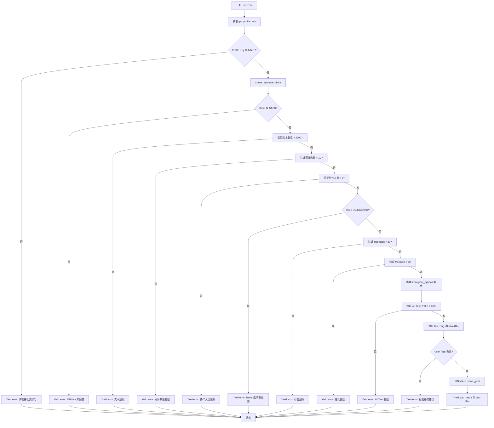
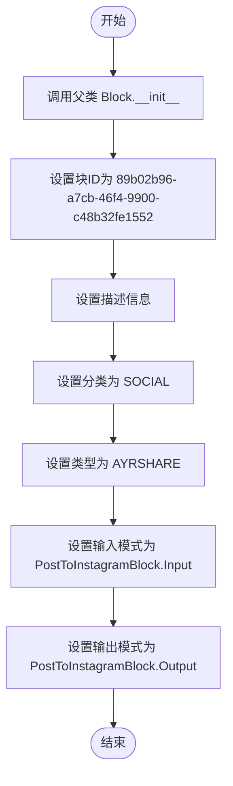
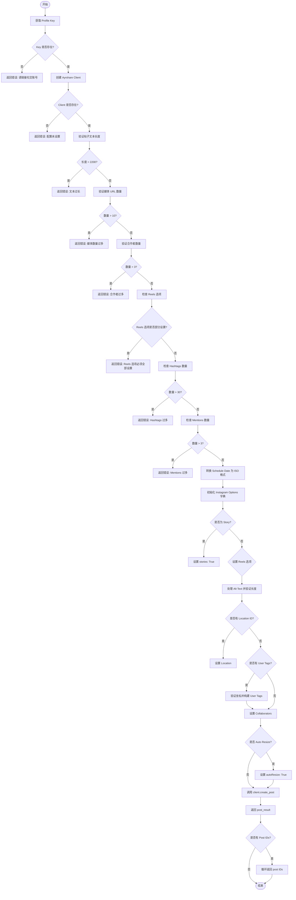

# `AutoGPT\autogpt_platform\backend\backend\blocks\ayrshare\post_to_instagram.py` 详细设计文档

该代码定义了一个 `PostToInstagramBlock` 类，用于通过 Ayrshare API 向 Instagram 发布内容。它封装了 Instagram 特定的输入架构（如 Stories、Reels、轮播、用户标签和协作人员），实现了针对 Instagram 平台限制（如字符数、标签数量、媒体数量）的数据验证逻辑，并负责构建特定的 API 请求参数，最终异步执行发布操作并返回结果。

## 整体流程



## 类结构

```
PostToInstagramBlock (继承自 Block)
├── Input (继承自 BaseAyrshareInput)
└── Output (继承自 BlockSchemaOutput)
```

## 全局变量及字段


### `PostToInstagramBlock.Input.post`
    
The post text (max 2,200 chars, up to 30 hashtags, 3 @mentions)

类型：`str`
    


### `PostToInstagramBlock.Input.media_urls`
    
Optional list of media URLs. Instagram supports up to 10 images/videos in a carousel.

类型：`list[str]`
    


### `PostToInstagramBlock.Input.is_story`
    
Whether to post as Instagram Story (24-hour expiration)

类型：`bool | None`
    


### `PostToInstagramBlock.Input.share_reels_feed`
    
Whether Reel should appear in both Feed and Reels tabs

类型：`bool | None`
    


### `PostToInstagramBlock.Input.audio_name`
    
Audio name for Reels (e.g., 'The Weeknd - Blinding Lights')

类型：`str | None`
    


### `PostToInstagramBlock.Input.thumbnail`
    
Thumbnail URL for Reel video

类型：`str | None`
    


### `PostToInstagramBlock.Input.thumbnail_offset`
    
Thumbnail frame offset in milliseconds (default: 0)

类型：`int | None`
    


### `PostToInstagramBlock.Input.alt_text`
    
Alt text for each media item (up to 1,000 chars each, accessibility feature), each item in the list corresponds to a media item in the media_urls list

类型：`list[str]`
    


### `PostToInstagramBlock.Input.location_id`
    
Facebook Page ID or name for location tagging (e.g., '7640348500' or '@guggenheimmuseum')

类型：`str | None`
    


### `PostToInstagramBlock.Input.user_tags`
    
List of users to tag with coordinates for images

类型：`list[dict[str, Any]]`
    


### `PostToInstagramBlock.Input.collaborators`
    
Instagram usernames to invite as collaborators (max 3, public accounts only)

类型：`list[str]`
    


### `PostToInstagramBlock.Input.auto_resize`
    
Auto-resize images to 1080x1080px for Instagram

类型：`bool | None`
    


### `PostToInstagramBlock.Output.post_result`
    
The result of the post

类型：`PostResponse`
    


### `PostToInstagramBlock.Output.post`
    
The result of the post

类型：`PostIds`
    
    

## 全局函数及方法


### `PostToInstagramBlock.__init__`

该方法是 `PostToInstagramBlock` 类的构造函数，用于初始化块的基本元数据。它定义了块的唯一标识符、描述、分类、类型以及输入和输出的数据模式，通过调用父类 `Block` 的构造函数来完成设置。

参数：

- `self`：`PostToInstagramBlock`，表示类实例自身。

返回值：`None`，该方法为构造函数，无显式返回值。

#### 流程图



#### 带注释源码

```python
def __init__(self):
    # 调用父类 Block 的构造函数以初始化块的核心属性
    super().__init__(
        # 定义该块的唯一标识符 (UUID)
        id="89b02b96-a7cb-46f4-9900-c48b32fe1552",
        # 描述块的功能，说明需要连接的账户类型
        description="Post to Instagram using Ayrshare. Requires a Business or Creator Instagram Account connected with a Facebook Page",
        # 将块归类为 SOCIAL (社交媒体) 类别
        categories={BlockCategory.SOCIAL},
        # 指定块类型为 AYRSHARE，对应特定的集成处理逻辑
        block_type=BlockType.AYRSHARE,
        # 指定输入数据的验证模式为内部类 Input
        input_schema=PostToInstagramBlock.Input,
        # 指定输出数据的结构模式为内部类 Output
        output_schema=PostToInstagramBlock.Output,
    )
```


### `PostToInstagramBlock.run`

使用 Ayrshare 向 Instagram 发布内容，根据 Instagram 的约束和提供的特定选项（如 Reels、Stories、标签等）验证输入，构建 API 请求并返回发布结果。

参数：

-  `input_data`：`PostToInstagramBlock.Input`，包含发布内容、媒体URL以及Instagram特定配置选项（如Reels、Stories、标签等）的输入数据对象。
-  `user_id`：`str`，执行该操作的用户ID，用于检索其Ayrshare profile key。
-  `**kwargs`：`dict`，其他可选关键字参数。

返回值：`BlockOutput`，一个异步生成器，产生包含操作状态（如 "error" 错误信息、"post_result" 发布结果对象、"post" 发布ID）的键值对。

#### 流程图



#### 带注释源码

```python
async def run(
    self,
    input_data: "PostToInstagramBlock.Input",
    *,
    user_id: str,
    **kwargs,
) -> BlockOutput:
    """Post to Instagram with Instagram-specific options."""
    # 获取用户的 Ayrshare profile key
    profile_key = await get_profile_key(user_id)
    if not profile_key:
        yield "error", "Please link a social account via Ayrshare"
        return

    # 创建 Ayrshare 客户端
    client = create_ayrshare_client()
    if not client:
        yield "error", "Ayrshare integration is not configured. Please set up the AYRSHARE_API_KEY."
        return

    # 验证 Instagram 文本长度限制 (2200字符)
    if len(input_data.post) > 2200:
        yield "error", f"Instagram post text exceeds 2,200 character limit ({len(input_data.post)} characters)"
        return

    # 验证 Instagram 媒体数量限制 (10个)
    if len(input_data.media_urls) > 10:
        yield "error", "Instagram supports a maximum of 10 images/videos in a carousel"
        return

    # 验证合作者数量限制 (3个)
    if len(input_data.collaborators) > 3:
        yield "error", "Instagram supports a maximum of 3 collaborators"
        return

    # 验证 Reels 选项的完整性：如果设置了任意一个，则所有相关选项都必须设置
    reel_options = [
        input_data.share_reels_feed,
        input_data.audio_name,
        input_data.thumbnail,
    ]

    if any(reel_options) and not all(reel_options):
        yield "error", "When posting a reel, all reel options must be set: share_reels_feed, audio_name, and either thumbnail or thumbnail_offset"
        return

    # 统计并验证 Hashtags (最多30个) 和 Mentions (最多3个)
    hashtag_count = input_data.post.count("#")
    mention_count = input_data.post.count("@")

    if hashtag_count > 30:
        yield "error", f"Instagram allows maximum 30 hashtags ({hashtag_count} found)"
        return

    if mention_count > 3:
        yield "error", f"Instagram allows maximum 3 @mentions ({mention_count} found)"
        return

    # 如果提供了计划发布时间，转换为 ISO 格式字符串
    iso_date = (
        input_data.schedule_date.isoformat() if input_data.schedule_date else None
    )

    # 构建 Instagram 特定选项字典
    instagram_options = {}

    # Stories 设置
    if input_data.is_story:
        instagram_options["stories"] = True

    # Reels 设置
    if input_data.share_reels_feed is not None:
        instagram_options["shareReelsFeed"] = input_data.share_reels_feed

    if input_data.audio_name:
        instagram_options["audioName"] = input_data.audio_name

    if input_data.thumbnail:
        instagram_options["thumbNail"] = input_data.thumbnail
    elif input_data.thumbnail_offset and input_data.thumbnail_offset > 0:
        instagram_options["thumbNailOffset"] = input_data.thumbnail_offset

    # Alt Text 设置及验证
    if input_data.alt_text:
        for i, alt in enumerate(input_data.alt_text):
            if len(alt) > 1000:
                yield "error", f"Alt text {i+1} exceeds 1,000 character limit ({len(alt)} characters)"
                return
        instagram_options["altText"] = input_data.alt_text

    # Location 设置
    if input_data.location_id:
        instagram_options["locationId"] = input_data.location_id

    # User Tags 设置及坐标验证
    if input_data.user_tags:
        user_tags_list = []
        for tag in input_data.user_tags:
            try:
                tag_obj = InstagramUserTag(**tag)
            except Exception as e:
                yield "error", f"Invalid user tag: {e}, tages need to be a dictionary with a 3 items: username (str), x (float) and y (float)"
                return
            tag_dict: dict[str, float | str] = {"username": tag_obj.username}
            if tag_obj.x is not None and tag_obj.y is not None:
                # 验证坐标范围必须在 0.0 到 1.0 之间
                if not (0.0 <= tag_obj.x <= 1.0) or not (0.0 <= tag_obj.y <= 1.0):
                    yield "error", f"User tag coordinates must be between 0.0 and 1.0 (user: {tag_obj.username})"
                    return
                tag_dict["x"] = tag_obj.x
                tag_dict["y"] = tag_obj.y
            user_tags_list.append(tag_dict)
        instagram_options["userTags"] = user_tags_list

    # Collaborators 设置
    if input_data.collaborators:
        instagram_options["collaborators"] = input_data.collaborators

    # Auto Resize 设置
    if input_data.auto_resize:
        instagram_options["autoResize"] = True

    # 调用 Ayrshare 客户端创建帖子
    response = await client.create_post(
        post=input_data.post,
        platforms=[SocialPlatform.INSTAGRAM],
        media_urls=input_data.media_urls,
        is_video=input_data.is_video,
        schedule_date=iso_date,
        disable_comments=input_data.disable_comments,
        shorten_links=input_data.shorten_links,
        unsplash=input_data.unsplash,
        requires_approval=input_data.requires_approval,
        random_post=input_data.random_post,
        random_media_url=input_data.random_media_url,
        notes=input_data.notes,
        instagram_options=instagram_options if instagram_options else None,
        profile_key=profile_key.get_secret_value(),
    )
    # 返回完整的响应结果
    yield "post_result", response
    # 如果响应中包含 Post IDs，逐个返回
    if response.postIds:
        for p in response.postIds:
            yield "post", p
```


## 关键组件


### 输入模式定义

定义了发布到 Instagram 所需的数据结构，包括通用发布字段（post, media_urls）以及 Instagram 特定功能字段，如 Stories、Reels（audio_name, thumbnail）、位置标签、协作者和辅助功能选项。

### 验证与约束逻辑

包含在 `run` 方法中，用于确保输入数据符合 Instagram 平台限制的逻辑，例如文本长度（2200字符）、媒体数量（10个）、Hashtags（30个）和 Mentions（3个）的数量限制，以及 Reels 选项的完整性校验。

### Instagram 选项映射

负责将验证后的输入数据（如 `is_story`, `user_tags`, `alt_text` 等）转换和映射为 Ayrshare API 所需的 `instagram_options` 字典结构，处理字段名称转换和数据类型适配。

### Ayrshare 客户端集成

通过 `create_ayrshare_client` 创建的客户端组件，负责执行实际的 API 调用，使用用户的 Profile Key 将格式化后的发布请求发送到 Ayrshare 服务以完成 Instagram 的发布操作。


## 问题及建议


### 已知问题

-   **Hashtag 和 Mention 计数逻辑过于简单**: 使用 `post.count("#")` 和 `post.count("@")` 进行计数，无法区分有效的标签/提及与文本中出现的普通符号（如 URL 片段中的 `#` 或邮箱地址中的 `@`），可能导致误报。
-   **Reels 选项校验逻辑不完整**: 在校验 Reels 选项时，`reel_options` 列表中未包含 `thumbnail_offset`。如果用户仅设置了 `thumbnail_offset` 而未设置其他 Reels 选项（或 `thumbnail`），校验可能通过，导致发送包含偏移量但缺少缩略图 URL 的不完整配置，引发 API 调用失败或行为异常。
-   **硬编码的业务限制**: 代码中直接硬编码了 Instagram 的限制数值（如字符数 2200、媒体数 10、标签数 30 等）。一旦 Instagram 更新这些限制，需要修改代码并重新部署，维护成本较高。
-   **验证逻辑位于运行期而非模型层**: 对于用户标签坐标范围 (0.0-1.0)、Alt Text 长度等校验逻辑写在 `run` 方法中，而不是利用数据模型（如 Pydantic）的验证机制。这使得错误处理滞后于业务逻辑入口，且不符合“快速失败”原则。

### 优化建议

-   **引入正则表达式进行精确计数**: 使用正则表达式匹配以 `#` 开头且紧跟有效字符的模式来准确计算 Hashtag 数量，避免误判 URL 或普通文本中的符号。
-   **提取魔法数为常量配置**: 将所有的数值限制（如 2200, 30, 10 等）定义为类常量或配置文件中的变量，提高代码的可读性和可维护性。
-   **利用 Pydantic 验证器**: 将业务规则校验（如坐标范围、列表长度限制）移至 `Input` 类的 `field_validator` 或 `root_validator` 中，利用框架层面的校验机制拦截非法输入，减轻 `run` 方法中的逻辑负担。
-   **完善 Reels 选项的互斥/依赖逻辑**: 明确 `thumbnail` 与 `thumbnail_offset` 的依赖关系，优化校验逻辑，确保在构建请求参数时配置的一致性和完整性。
-   **增强错误信息的结构化**: 目前通过 `yield "error", "..."` 返回字符串错误。建议定义明确的错误类型或结构化错误对象，便于前端或上层调用者进行精确的错误分类和展示。


## 其它


### 设计目标与约束

**设计目标：**
1.  **封装复杂性**：将 Ayrshare API 中针对 Instagram 的复杂参数（如 Reels 选项、用户标签坐标、合作者等）封装为统一的 Python 数据类，简化上层调用逻辑。
2.  **输入安全性**：在发送请求到外部 API 之前，执行严格的前置验证（Fail-fast 原则），确保符合 Instagram 的业务规则（如字符限制、媒体数量限制、坐标范围等），减少无效网络请求和错误反馈的延迟。
3.  **异步执行**：基于 `async/await` 模式构建，以支持高并发的社交媒体发布场景，避免阻塞主线程。

**设计约束：**
1.  **API 限制**：必须遵守 Instagram API 的硬性限制，包括：
    *   文案长度：最大 2,200 字符。
    *   话题标签：最多 30 个。
    *   提及：最多 3 个。
    *   媒体数量：最多 10 个图片/视频。
    *   协作者：最多 3 个。
    *   辅助文本：每个媒体项最多 1,000 字符。
    *   用户标签坐标：必须在 0.0 到 1.0 之间。
2.  **依赖要求**：运行时必须存在有效的 `AYRSHARE_API_KEY` 以及用户必须已通过 Ayrshare 关联 Instagram 账号。
3.  **Reels 逻辑约束**：当启用 Reels 相关功能（如分享到 Feed、设置音频、缩略图）时，相关参数必须成组提供或满足特定逻辑（例如，设置了 Reels 选项必须提供缩略图或偏移量）。

### 错误处理与异常设计

**错误处理策略：**
本代码不抛出传统的 Python 异常（如 `raise ValueError`）来中断程序流，而是遵循 Block 的执行模式，通过 `yield` 机制返回包含错误信息的键值对（`yield "error", "message"`）。

**错误分类与触发场景：**
1.  **配置与授权错误**：
    *   **场景**：无法获取用户的 `profile_key`。
    *   **响应**：`yield "error", "Please link a social account via Ayrshare"`。
    *   **场景**：Ayrshare 客户端初始化失败（通常是因为 API Key 缺失）。
    *   **响应**：`yield "error", "Ayrshare integration is not configured..."`。
2.  **业务规则验证错误**：
    *   **场景**：文案、标签数量、媒体数量、辅助文本长度等超出 Instagram 限制。
    *   **响应**：返回具体的错误原因，例如 `yield "error", "Instagram post text exceeds 2,200 character limit..."`。
    *   **场景**：用户标签坐标超出 0.0-1.0 范围。
    *   **响应**：`yield "error", "User tag coordinates must be between 0.0 and 1.0..."`。
    *   **场景**：Reels 参数设置不完整。
    *   **响应**：`yield "error", "When posting a reel, all reel options must be set..."`。
3.  **数据结构错误**：
    *   **场景**：用户标签字典格式不正确，无法解析为 `InstagramUserTag`。
    *   **响应**：捕获解析异常并返回 `yield "error", "Invalid user tag..."`。

**异常捕获：**
对于用户标签的解析使用了通用的 `except Exception`，旨在防止因单个字段格式错误导致整个 Block 崩溃，并将其转化为用户友好的错误消息。

### 数据流与状态机

**数据流：**
1.  **输入阶段**：接收 `input_data`（包含文案、媒体 URL、Instagram 特定选项）和 `user_id`。
2.  **凭证获取**：调用 `get_profile_key(user_id)` 获取访问凭证。
3.  **数据清洗与转换**：
    *   将 `schedule_date` 转换为 ISO 格式字符串。
    *   将扁平化的输入字段（如 `is_story`, `share_reels_feed`）映射为符合 Ayrshare API 规范的字典结构 `instagram_options`（例如 `shareReelsFeed`）。
4.  **验证阶段**：对转换后的数据和原始输入执行业务规则校验（长度、数量、范围等）。
5.  **执行阶段**：调用 `client.create_post` 将数据发送至外部服务。
6.  **输出阶段**：接收 `PostResponse` 对象，解析 `postIds`，并通过 `yield` 逐步输出结果。

**状态机：**
本 Block 为无状态服务组件，`run` 方法每次调用都是独立的。执行逻辑属于线性流程：
*   `IDLE` (初始化) -> `CHECK_AUTH` (检查凭证) -> `VALIDATE` (验证输入) -> `BUILD_PAYLOAD` (构建载荷) -> `EXECUTE` (调用 API) -> `FINISHED` (输出结果)。
*   任何验证或检查阶段的失败都会直接跳转到 `ERROR` 状态（通过 yield error 输出），终止后续流程。

### 外部依赖与接口契约

**外部依赖库：**
1.  `backend.integrations.ayrshare`: 提供核心的社交媒体集成能力。
    *   `PostIds`, `PostResponse`, `SocialPlatform`: 数据类型定义。
    *   `create_ayrshare_client`: 工厂函数，用于创建配置好的 API 客户端。
2.  `backend.sdk`: 基础框架定义。
    *   `Block`, `BlockOutput`, `BlockSchemaOutput`, `BlockType`, `BlockCategory`, `SchemaField`: 定义 Block 的基础结构和输入输出模式。
3.  `._util`: 内部工具模块。
    *   `BaseAyrshareInput`: 基础输入 Schema，包含通用的社交媒体发布字段（如 `schedule_date`, `media_urls` 等）。
    *   `get_profile_key`: 异步获取用户特定的 API Key 函数。
    *   `InstagramUserTag`: 用于验证用户标签格式的 Pydantic 模型。

**接口契约：**
1.  **`get_profile_key(user_id: str)`**:
    *   输入：用户 ID 字符串。
    *   输出：返回包含 `get_secret_value()` 方法的对象，或在未找到时返回 `None`。
2.  **`create_ayrshare_client()`**:
    *   输入：无（依赖环境配置）。
    *   输出：返回一个 Ayrshare 客户端实例，该实例必须实现 `async create_post(...)` 方法。该方法需接受 `platforms`, `instagram_options`, `post` 等参数，并返回 `PostResponse` 对象。
3.  **`PostResponse` 对象**:
    *   必须包含 `postIds` 属性（列表或类似结构），用于遍历生成独立的 `post` 输出项。

    