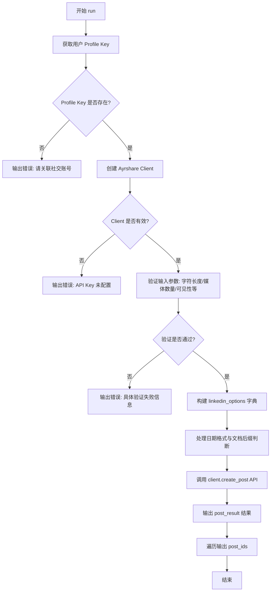
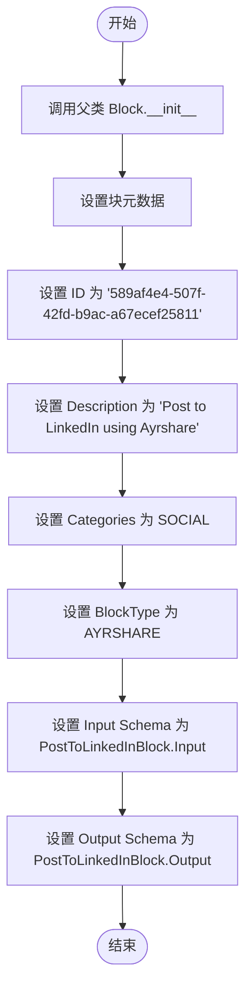
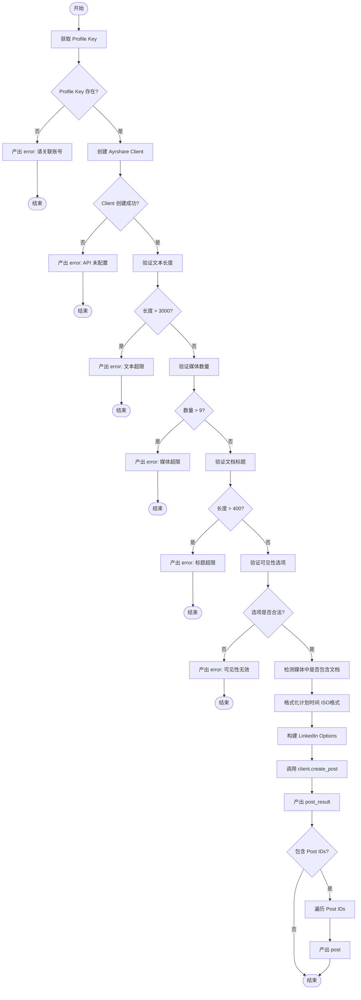

# `AutoGPT\autogpt_platform\backend\backend\blocks\ayrshare\post_to_linkedin.py` 详细设计文档

该代码定义了一个名为 `PostToLinkedInBlock` 的组件，它封装了通过 Ayrshare API 向 LinkedIn 发布帖子的业务逻辑，包括输入验证（如字数限制、媒体数量）、构建 LinkedIn 特定参数（如可见性、定向设置）以及异步执行 API 请求并返回发布结果的功能。

## 整体流程



## 类结构

```
PostToLinkedInBlock (Block)
├── Input (BaseAyrshareInput)
└── Output (BlockSchemaOutput)
```

## 全局变量及字段


### `PostToLinkedInBlock.Input.post`
    
The post text (max 3,000 chars, hashtags supported with #)

类型：`str`
    


### `PostToLinkedInBlock.Input.media_urls`
    
Optional list of media URLs. LinkedIn supports up to 9 images, videos, or documents (PPT, PPTX, DOC, DOCX, PDF <100MB, <300 pages).

类型：`list[str]`
    


### `PostToLinkedInBlock.Input.visibility`
    
Post visibility: 'public' (default), 'connections' (personal only), 'loggedin'

类型：`str`
    


### `PostToLinkedInBlock.Input.alt_text`
    
Alt text for each image (accessibility feature, not supported for videos/documents)

类型：`list[str]`
    


### `PostToLinkedInBlock.Input.titles`
    
Title/caption for each image or video

类型：`list[str]`
    


### `PostToLinkedInBlock.Input.document_title`
    
Title for document posts (max 400 chars, uses filename if not specified)

类型：`str`
    


### `PostToLinkedInBlock.Input.thumbnail`
    
Thumbnail URL for video (PNG/JPG, same dimensions as video, <10MB)

类型：`str`
    


### `PostToLinkedInBlock.Input.targeting_countries`
    
Country codes for targeting (e.g., ['US', 'IN', 'DE', 'GB']). Requires 300+ followers in target audience.

类型：`list[str] | None`
    


### `PostToLinkedInBlock.Input.targeting_seniorities`
    
Seniority levels for targeting (e.g., ['Senior', 'VP']). Requires 300+ followers in target audience.

类型：`list[str] | None`
    


### `PostToLinkedInBlock.Input.targeting_degrees`
    
Education degrees for targeting. Requires 300+ followers in target audience.

类型：`list[str] | None`
    


### `PostToLinkedInBlock.Input.targeting_fields_of_study`
    
Fields of study for targeting. Requires 300+ followers in target audience.

类型：`list[str] | None`
    


### `PostToLinkedInBlock.Input.targeting_industries`
    
Industry categories for targeting. Requires 300+ followers in target audience.

类型：`list[str] | None`
    


### `PostToLinkedInBlock.Input.targeting_job_functions`
    
Job function categories for targeting. Requires 300+ followers in target audience.

类型：`list[str] | None`
    


### `PostToLinkedInBlock.Input.targeting_staff_count_ranges`
    
Company size ranges for targeting. Requires 300+ followers in target audience.

类型：`list[str] | None`
    


### `PostToLinkedInBlock.Output.post_result`
    
The result of the post

类型：`PostResponse`
    


### `PostToLinkedInBlock.Output.post`
    
The result of the post

类型：`PostIds`
    
    

## 全局函数及方法


### `PostToLinkedInBlock.__init__`

初始化 `PostToLinkedInBlock` 实例，配置其元数据（如 ID、描述、类型）以及输入和输出 Schema，使其能够作为 LinkedIn 发布功能的集成块运行。

参数：

无

返回值：`None`，该方法为构造函数，不返回任何值，仅完成对象初始化。

#### 流程图



#### 带注释源码

```python
def __init__(self):
    # 调用父类 Block 的构造函数，传入必要的元数据和配置
    super().__init__(
        # 设置该块在系统中的唯一标识符
        id="589af4e4-507f-42fd-b9ac-a67ecef25811",
        # 设置该块的描述文本
        description="Post to LinkedIn using Ayrshare",
        # 指定该块所属的分类为社交类
        categories={BlockCategory.SOCIAL},
        # 指定该块类型为 AYRSHARE 集成类型
        block_type=BlockType.AYRSHARE,
        # 指定该块的输入数据模型类
        input_schema=PostToLinkedInBlock.Input,
        # 指定该块的输出数据模型类
        output_schema=PostToLinkedInBlock.Output,
    )
```


### `PostToLinkedInBlock.run`

该方法负责执行向 LinkedIn 发布内容的异步操作。它首先验证用户是否已关联 LinkedIn 账号及系统配置，接着对输入数据（如文本长度、媒体数量、可见性等）进行严格校验，然后构建符合 LinkedIn API 要求的参数（包括受众定向和媒体特定选项），最后通过 Ayrshare 客户端发起发布请求并返回结果。

参数：

-  `input_data`：`PostToLinkedInBlock.Input`，包含帖子文本、媒体 URL 及 LinkedIn 特定配置（如可见性、定向、缩略图等）的输入数据对象。
-  `user_id`：`str`，发起操作的用户 ID，用于检索对应的社交账号配置密钥。
-  `**kwargs`：`dict`，接收额外的上下文关键字参数。

返回值：`BlockOutput`，一个异步生成器，用于逐步产出执行结果，包括发布成功的响应对象或具体的错误信息。

#### 流程图



#### 带注释源码

```python
    async def run(
        self,
        input_data: "PostToLinkedInBlock.Input",
        *,
        user_id: str,
        **kwargs,
    ) -> BlockOutput:
        """Post to LinkedIn with LinkedIn-specific options."""
        # 1. 获取用户的 Profile Key，用于验证账号是否已关联
        profile_key = await get_profile_key(user_id)
        if not profile_key:
            yield "error", "Please link a social account via Ayrshare"
            return

        # 2. 初始化 Ayrshare 客户端，验证集成配置是否正确
        client = create_ayrshare_client()
        if not client:
            yield "error", "Ayrshare integration is not configured. Please set up the AYRSHARE_API_KEY."
            return

        # 3. 数据验证：帖子文本长度限制
        if len(input_data.post) > 3000:
            yield "error", f"LinkedIn post text exceeds 3,000 character limit ({len(input_data.post)} characters)"
            return

        # 4. 数据验证：媒体数量限制
        if len(input_data.media_urls) > 9:
            yield "error", "LinkedIn supports a maximum of 9 images/videos/documents"
            return

        # 5. 数据验证：文档标题长度限制
        if input_data.document_title and len(input_data.document_title) > 400:
            yield "error", f"LinkedIn document title exceeds 400 character limit ({len(input_data.document_title)} characters)"
            return

        # 6. 数据验证：可见性选项枚举检查
        valid_visibility = ["public", "connections", "loggedin"]
        if input_data.visibility not in valid_visibility:
            yield "error", f"LinkedIn visibility must be one of: {', '.join(valid_visibility)}"
            return

        # 7. 检查媒体 URL 列表中是否包含特定文档类型的后缀
        document_extensions = [".ppt", ".pptx", ".doc", ".docx", ".pdf"]
        has_documents = any(
            any(url.lower().endswith(ext) for ext in document_extensions)
            for url in input_data.media_urls
        )

        # 8. 将计划发布时间转换为 ISO 格式字符串（如果存在）
        iso_date = (
            input_data.schedule_date.isoformat() if input_data.schedule_date else None
        )

        # 9. 构建 LinkedIn 特定选项字典
        linkedin_options = {}

        # 处理可见性（非默认值时添加）
        if input_data.visibility != "public":
            linkedin_options["visibility"] = input_data.visibility

        # 处理 Alt Text（仅当非文档类型媒体时支持）
        if input_data.alt_text and not has_documents:
            linkedin_options["altText"] = input_data.alt_text

        # 处理标题/说明
        if input_data.titles:
            linkedin_options["titles"] = input_data.titles

        # 处理文档标题（仅当确实包含文档时）
        if input_data.document_title and has_documents:
            linkedin_options["title"] = input_data.document_title

        # 处理视频缩略图
        if input_data.thumbnail:
            linkedin_options["thumbNail"] = input_data.thumbnail

        # 构建受众定向参数
        targeting_dict = {}
        if input_data.targeting_countries:
            targeting_dict["countries"] = input_data.targeting_countries
        if input_data.targeting_seniorities:
            targeting_dict["seniorities"] = input_data.targeting_seniorities
        if input_data.targeting_degrees:
            targeting_dict["degrees"] = input_data.targeting_degrees
        if input_data.targeting_fields_of_study:
            targeting_dict["fieldsOfStudy"] = input_data.targeting_fields_of_study
        if input_data.targeting_industries:
            targeting_dict["industries"] = input_data.targeting_industries
        if input_data.targeting_job_functions:
            targeting_dict["jobFunctions"] = input_data.targeting_job_functions
        if input_data.targeting_staff_count_ranges:
            targeting_dict["staffCountRanges"] = input_data.targeting_staff_count_ranges

        # 将定向参数合并到 LinkedIn 选项中
        if targeting_dict:
            linkedin_options["targeting"] = targeting_dict

        # 10. 调用 Ayrshare 客户端执行发布操作
        response = await client.create_post(
            post=input_data.post,
            platforms=[SocialPlatform.LINKEDIN],
            media_urls=input_data.media_urls,
            is_video=input_data.is_video,
            schedule_date=iso_date,
            disable_comments=input_data.disable_comments,
            shorten_links=input_data.shorten_links,
            unsplash=input_data.unsplash,
            requires_approval=input_data.requires_approval,
            random_post=input_data.random_post,
            random_media_url=input_data.random_media_url,
            notes=input_data.notes,
            linkedin_options=linkedin_options if linkedin_options else None,
            profile_key=profile_key.get_secret_value(),
        )
        
        # 11. 产出完整的响应结果
        yield "post_result", response
        
        # 12. 如果响应中包含 Post IDs，逐个产出
        if response.postIds:
            for p in response.postIds:
                yield "post", p
```


## 关键组件


### Input Schema
定义了针对 LinkedIn 特定的输入结构，包括文本长度限制、媒体处理约束以及可见性、定向投放和辅助功能文本等高级选项。

### Constraint Validator
在调用外部 API 之前执行业务逻辑检查，确保帖子文本长度、媒体数量、文档标题长度和可见性设置符合 LinkedIn 的平台规则。

### Options Transformer
负责将扁平化的输入字段（如定向投放参数、缩略图、辅助功能文本）转换并组装为符合 Ayrshare API 要求的嵌套字典结构 (`linkedin_options`)。

### Service Client Orchestrator
管理与 Ayrshare 外部服务的交互，包括获取用户 Profile Key 和异步执行创建帖子的 API 调用。


## 问题及建议


### 已知问题

-   **基于文件扩展名的文档检测不可靠**：当前代码通过检查 URL 字符串是否以特定后缀（如 `.pdf`, `.doc`）结尾来判断是否为文档。然而，URL 可能包含查询参数、重定向或不包含文件扩展名，这种启发式检测方法容易导致误判，从而错误地应用或移除某些逻辑（如移除 `alt_text`）。
-   **缺失列表长度一致性校验**：代码直接传递了 `alt_text` 和 `titles` 列表给 Ayrshare API，但未校验这些列表的长度是否与 `media_urls` 的长度一致。如果列表长度不匹配（例如上传了3张图但只提供了2条 Alt Text），可能会导致 API 报错或部分媒体元数据丢失。
-   **硬编码的业务限制**：帖子长度（3000字符）、媒体数量（9个）、文档标题长度（400字符）等限制直接硬编码在代码逻辑中。一旦 LinkedIn 或 Ayrshare 更新这些限制，需要手动修改代码，增加了维护成本。

### 优化建议

-   **提取校验逻辑与常量**：将长度限制（如 MAX_CHARS=3000）、有效枚举值（如 VISIBILITY_OPTIONS）提取为模块级常量或配置类。这不仅提高了代码的可读性，也便于后续维护和统一管理约束条件。
-   **增强输入数据的完整性校验**：在调用 API 之前，增加对 `alt_text` 和 `titles` 列表的校验逻辑。确保当这些列表非空时，其长度必须等于 `media_urls` 的长度，或者在字段定义中就显式声明这种映射关系，防止因数据不一致导致的运行时错误。
-   **重构定向选项的构建逻辑**：当前构建 `targeting_dict` 的代码存在大量重复的 `if` 判断。建议使用字典推导式或循环遍历具有特定前缀的字段（如 `targeting_*`），动态构建目标对象，从而减少代码行数并降低拼写错误的风险。
-   **改进错误处理结构**：当前代码在遇到错误时直接 `yield` 并返回。虽然符合 Block 的运行模式，但可以将具体的错误生成逻辑封装为辅助方法（如 `yield_validation_error`），以保持 `run` 方法的整洁和专注于核心流程。


## 其它


### 设计目标与约束

设计目标是封装 Ayrshare API，提供一个标准化的 Block 接口，使用户能够向 LinkedIn 发布帖子、媒体及文档，并支持 LinkedIn 特有的高级选项（如受众定向和可见性设置）。

主要约束包括：
1.  **LinkedIn API 限制**：帖子文本不得超过 3000 个字符；单个帖子最多包含 9 个媒体文件（图片、视频或文档）；文档标题不得超过 400 个字符。
2.  **受众定向门槛**：使用定向选项（如国家、行业等）要求目标受众中至少有 300 名关注者。
3.  **依赖前置条件**：必须配置有效的 Ayrshare API Key（`AYRSHARE_API_KEY`），且用户必须通过 Ayrshare 关联了 LinkedIn 账号（通过 `profile_key` 验证）。

### 错误处理与异常设计

该模块采用同步验证与快速失败的错误处理策略，不抛出异常，而是通过生成器产出错误信息。

1.  **配置检查**：
    *   若 `get_profile_key` 返回空，产出 `error`：“Please link a social account via Ayrshare”。
    *   若 `create_ayrshare_client` 返回空，产出 `error`：“Ayrshare integration is not configured...”。
2.  **业务逻辑验证**：
    *   **文本长度验证**：若 `input_data.post` 长度 > 3000，产出 `error` 并提示具体字符数。
    *   **媒体数量验证**：若 `input_data.media_urls` 数量 > 9，产出 `error`。
    *   **文档标题验证**：若 `input_data.document_title` 长度 > 400，产出 `error`。
    *   **可见性枚举验证**：若 `input_data.visibility` 不在 `['public', 'connections', 'loggedin']` 中，产出 `error` 并列出有效值。
3.  **异常终止**：一旦产出 `error`，方法立即 `return`，终止后续流程。

### 数据流与状态机

**数据流**：
1.  **输入阶段**：接收 `Input` 数据模型，包含基础帖子信息及 LinkedIn 特定参数（定向、可见性等）。
2.  **预处理阶段**：
    *   获取用户的 `profile_key` 和 Ayrshare `client`。
    *   执行数据清洗与转换（如将 `datetime` 转换为 ISO 格式字符串）。
    *   执行逻辑验证（长度、数量、枚举值检查）。
3.  **构建阶段**：将分散的输入字段映射并聚合为 `linkedin_options` 字典结构（扁平化的 `targeting` 字段被重组为嵌套字典）。
4.  **执行阶段**：调用 `client.create_post`，传入标准化参数。
5.  **输出阶段**：解析 API 响应，产出 `post_result` (原始响应) 和 `post` (ID 列表)。

**状态机**：
该 Block 是无状态的，执行过程为线性流转：`Idle` -> `Validating` -> `Processing` -> `Completed` (或 `Error`)。每次调用 `run` 方法都是独立的事务。

### 外部依赖与接口契约

1.  **`backend.sdk`**：
    *   **契约**：必须继承 `Block` 基类，并实现 `run` 方法。依赖 `SchemaField` 进行输入输出的元数据定义。
2.  **`backend.integrations.ayrshare`**：
    *   **契约**：使用 `SocialPlatform.LINKEDIN` 枚举。期望 `PostResponse` 对象包含 `postIds` 属性。
3.  **`._util` (本地模块)**：
    *   **`get_profile_key(user_id: str) -> SecretStr | None`**：异步函数，用于获取特定用户的 Ayrshare Profile Key。
    *   **`create_ayrshare_client()`**：工厂函数，返回配置好的 Ayrshare API 客户端实例，该实例必须实现 `create_post` 异步方法，接受特定的 LinkedIn 参数（`linkedin_options`, `platforms`, `post` 等）。

### 扩展性设计

代码在结构上支持未来扩展其他社交媒体平台的特定功能。当前设计采用了“基类输入 + 平台特定重写”的模式（通过 `BaseAyrshareInput`），若需添加如 Twitter 或 Facebook 的特定 Block，可参照此模式定义各自的 Input Schema 并构建平台特定的 Options 字典，而无需修改核心 API 调用逻辑。

    