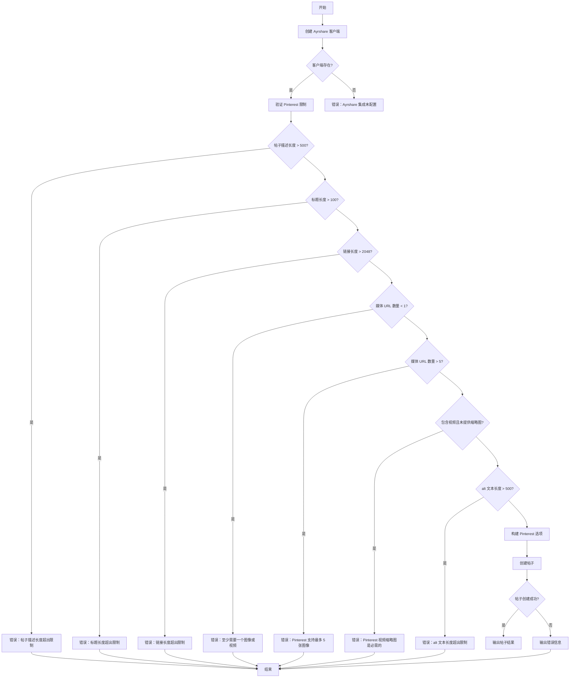
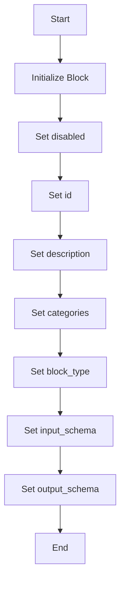
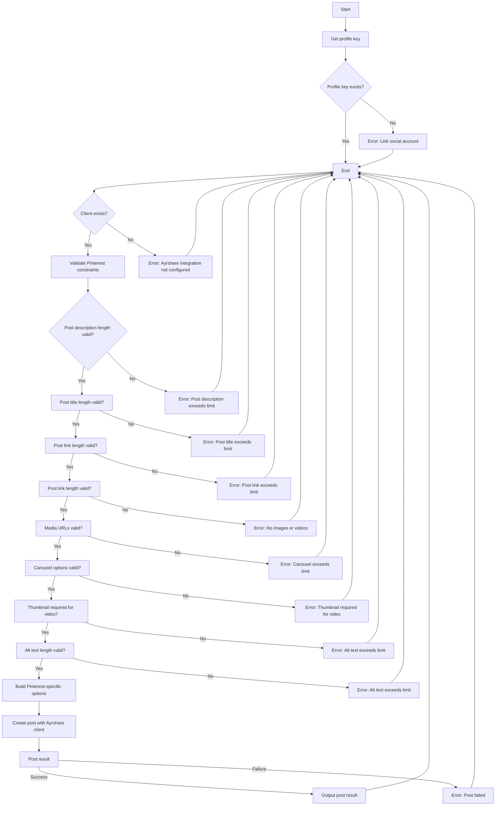

# `.\AutoGPT\autogpt_platform\backend\backend\blocks\ayrshare\post_to_pinterest.py` 详细设计文档

This code defines a class for posting content to Pinterest using the Ayrshare API, with specific options and validations for Pinterest posts.

## 整体流程



## 类结构

```
PostToPinterestBlock (具体类)
├── Input (内部类)
│   ├── post (str)
│   ├── media_urls (list[str])
│   ├── pin_title (str)
│   ├── link (str)
│   ├── board_id (str)
│   ├── note (str)
│   ├── thumbnail (str)
│   ├── carousel_options (list[PinterestCarouselOption])
│   └── alt_text (list[str])
├── Output (内部类)
│   ├── post_result (PostResponse)
│   └── post (PostIds)
└── __init__ (构造函数)
    └── run (async def) - 运行帖子到 Pinterest
```

## 全局变量及字段


### `profile_key`
    
The profile key for the user to be used for posting.

类型：`str`
    


### `client`
    
The Ayrshare client instance used for posting.

类型：`AyrshareClient`
    


### `pinterest_options`
    
The Pinterest-specific options for the post.

类型：`dict`
    


### `carousel_list`
    
The list of carousel options for the Pinterest post.

类型：`list`
    


### `carousel_dict`
    
The dictionary representing a single carousel option for the Pinterest post.

类型：`dict`
    


### `response`
    
The response from the Ayrshare API after posting.

类型：`PostResponse`
    


### `iso_date`
    
The ISO formatted date if a schedule date is provided.

类型：`str`
    


### `input_data`
    
The input data for the Pinterest post.

类型：`PostToPinterestBlock.Input`
    


### `user_id`
    
The user ID for which the post is being created.

类型：`str`
    


### `kwargs`
    
Additional keyword arguments passed to the function.

类型：`dict`
    


### `pinterest_options`
    
The Pinterest-specific options for the post.

类型：`dict`
    


### `Input.post`
    
Pin description (max 500 chars, links not clickable - use link field instead)

类型：`str`
    


### `Input.media_urls`
    
Required image/video URLs. Pinterest requires at least one image. Videos need thumbnail. Up to 5 images for carousel.

类型：`list[str]`
    


### `Input.pin_title`
    
Pin title displayed in 'Add your title' section (max 100 chars)

类型：`str`
    


### `Input.link`
    
Clickable destination URL when users click the pin (max 2048 chars)

类型：`str`
    


### `Input.board_id`
    
Pinterest Board ID to post to (from /user/details endpoint, uses default board if not specified)

类型：`str`
    


### `Input.note`
    
Private note for the pin (only visible to you and board collaborators)

类型：`str`
    


### `Input.thumbnail`
    
Required thumbnail URL for video pins (must have valid image Content-Type)

类型：`str`
    


### `Input.carousel_options`
    
Options for each image in carousel (title, link, description per image)

类型：`list[PinterestCarouselOption]`
    


### `Input.alt_text`
    
Alt text for each image/video (max 500 chars each, accessibility feature)

类型：`list[str]`
    


### `Output.post_result`
    
The result of the post

类型：`PostResponse`
    


### `Output.post`
    
The result of the post

类型：`PostIds`
    
    

## 全局函数及方法


### PostToPinterestBlock.__init__

This method initializes the `PostToPinterestBlock` class, setting up its properties and configurations.

参数：

- `disabled`：`bool`，Indicates whether the block is disabled or not.
- `id`：`str`，Unique identifier for the block.
- `description`：`str`，Description of the block.
- `categories`：`set`，Categories to which the block belongs.
- `block_type`：`BlockType`，Type of the block.
- `input_schema`：`PostToPinterestBlock.Input`，Input schema for the block.
- `output_schema`：`PostToPinterestBlock.Output`，Output schema for the block.

返回值：`None`，This method does not return any value.

#### 流程图



#### 带注释源码

```python
def __init__(self):
    super().__init__(
        disabled=True,
        id="3ca46e05-dbaa-4afb-9e95-5a429c4177e6",
        description="Post to Pinterest using Ayrshare",
        categories={BlockCategory.SOCIAL},
        block_type=BlockType.AYRSHARE,
        input_schema=PostToPinterestBlock.Input,
        output_schema=PostToPinterestBlock.Output,
    )
```


### PostToPinterestBlock.run

This method is responsible for posting content to Pinterest using the Ayrshare API, with specific options tailored for Pinterest.

参数：

- `input_data`：`PostToPinterestBlock.Input`，The input data containing the details of the post to be made on Pinterest.
- `user_id`：`str`，The user ID associated with the social account to be used for posting.

返回值：`BlockOutput`，The output containing the result of the post operation.

#### 流程图



#### 带注释源码

```python
async def run(
    self,
    input_data: "PostToPinterestBlock.Input",
    *,
    user_id: str,
    **kwargs,
) -> BlockOutput:
    """Post to Pinterest with Pinterest-specific options."""
    profile_key = await get_profile_key(user_id)
    if not profile_key:
        yield "error", "Please link a social account via Ayrshare"
        return

    client = create_ayrshare_client()
    if not client:
        yield "error", "Ayrshare integration is not configured. Please set up the AYRSHARE_API_KEY."
        return

    # Validate Pinterest constraints
    if len(input_data.post) > 500:
        yield "error", f"Pinterest pin description exceeds 500 character limit ({len(input_data.post)} characters)"
        return

    if len(input_data.pin_title) > 100:
        yield "error", f"Pinterest pin title exceeds 100 character limit ({len(input_data.pin_title)} characters)"
        return

    if len(input_data.link) > 2048:
        yield "error", f"Pinterest link URL exceeds 2048 character limit ({len(input_data.link)} characters)"
        return

    if len(input_data.media_urls) == 0:
        yield "error", "Pinterest requires at least one image or video"
        return

    if len(input_data.media_urls) > 5:
        yield "error", "Pinterest supports a maximum of 5 images in a carousel"
        return

    # Check if video is included and thumbnail is provided
    video_extensions = [".mp4", ".mov", ".avi", ".mkv", ".wmv", ".flv", ".webm"]
    has_video = any(
        any(url.lower().endswith(ext) for ext in video_extensions)
        for url in input_data.media_urls
    )

    if (has_video or input_data.is_video) and not input_data.thumbnail:
        yield "error", "Pinterest video pins require a thumbnail URL"
        return

    # Validate alt text length
    for i, alt in enumerate(input_data.alt_text):
        if len(alt) > 500:
            yield "error", f"Pinterest alt text {i+1} exceeds 500 character limit ({len(alt)} characters)"
            return

    # Convert datetime to ISO format if provided
    iso_date = (
        input_data.schedule_date.isoformat() if input_data.schedule_date else None
    )

    # Build Pinterest-specific options
    pinterest_options = {}

    # Pin title
    if input_data.pin_title:
        pinterest_options["title"] = input_data.pin_title

    # Clickable link
    if input_data.link:
        pinterest_options["link"] = input_data.link

    # Board ID
    if input_data.board_id:
        pinterest_options["boardId"] = input_data.board_id

    # Private note
    if input_data.note:
        pinterest_options["note"] = input_data.note

    # Video thumbnail
    if input_data.thumbnail:
        pinterest_options["thumbNail"] = input_data.thumbnail

    # Carousel options
    if input_data.carousel_options:
        carousel_list = []
        for option in input_data.carousel_options:
            carousel_dict = {}
            if option.title:
                carousel_dict["title"] = option.title
            if option.link:
                carousel_dict["link"] = option.link
            if option.description:
                carousel_dict["description"] = option.description
            if carousel_dict:  # Only add if not empty
                carousel_list.append(carousel_dict)
        if carousel_list:
            pinterest_options["carouselOptions"] = carousel_list

    # Alt text
    if input_data.alt_text:
        pinterest_options["altText"] = input_data.alt_text

    response = await client.create_post(
        post=input_data.post,
        platforms=[SocialPlatform.PINTEREST],
        media_urls=input_data.media_urls,
        is_video=input_data.is_video,
        schedule_date=iso_date,
        disable_comments=input_data.disable_comments,
        shorten_links=input_data.shorten_links,
        unsplash=input_data.unsplash,
        requires_approval=input_data.requires_approval,
        random_post=input_data.random_post,
        random_media_url=input_data.random_media_url,
        notes=input_data.notes,
        pinterest_options=pinterest_options if pinterest_options else None,
        profile_key=profile_key.get_secret_value(),
    )
    yield "post_result", response
    if response.postIds:
        for p in response.postIds:
            yield "post", p
```


## 关键组件


### 张量索引与惰性加载

用于在 Pinterest 块中处理图像和视频的索引，以及延迟加载以优化性能。

### 反量化支持

提供对 Pinterest 特定量化策略的支持，以优化内容发布。

### 量化策略

实现 Pinterest 特定的量化策略，以确保内容发布符合平台要求。


## 问题及建议


### 已知问题

-   **代码重复性**：`PostToPinterestBlock.Input` 类中多次使用 `SchemaField` 来定义字段，这可能导致维护困难，如果字段定义发生变化，需要修改多个地方。
-   **错误处理**：错误信息可能不够具体，例如 "Please link a social account via Ayrshare" 并没有明确指出是哪个社交账户需要链接。
-   **异常处理**：代码中使用了 `yield` 来产生错误信息，但没有明确处理可能出现的异常，例如网络请求失败或API调用错误。
-   **代码可读性**：代码中存在一些缩进不一致的情况，这可能会影响代码的可读性。

### 优化建议

-   **使用继承和组合**：将共用的字段定义提取到一个基类中，减少重复代码。
-   **增强错误信息**：提供更具体的错误信息，帮助用户快速定位问题。
-   **异常处理**：添加异常处理逻辑，确保在出现错误时能够捕获并处理。
-   **代码格式化**：使用代码格式化工具来确保代码风格的一致性，提高代码可读性。
-   **单元测试**：编写单元测试来验证代码的正确性，确保在修改代码时不会引入新的错误。
-   **日志记录**：添加日志记录功能，记录关键操作和错误信息，方便问题追踪和调试。
-   **代码审查**：定期进行代码审查，确保代码质量。
-   **性能优化**：如果发现代码中有性能瓶颈，进行相应的优化。
-   **文档更新**：更新文档，确保文档与代码保持一致。


## 其它


### 设计目标与约束

- 设计目标：
  - 实现一个能够将内容发布到Pinterest的模块。
  - 提供Pinterest特定的选项，如标题、链接、板ID等。
  - 确保遵守Pinterest的API限制和规范。
  - 提供错误处理和反馈机制。

- 约束：
  - Pinterest API的限制，如字符长度、媒体数量等。
  - 用户必须通过Ayrshare链接社交账户。
  - 需要配置Ayrshare API密钥。

### 错误处理与异常设计

- 错误处理：
  - 检查用户是否已通过Ayrshare链接社交账户。
  - 检查Ayrshare集成是否配置。
  - 验证Pinterest特定字段的长度限制。
  - 检查媒体URL的数量是否符合Pinterest的要求。
  - 检查视频内容是否有提供缩略图URL。

- 异常设计：
  - 使用yield语句返回错误信息。
  - 异常信息应包含足够的信息以帮助用户解决问题。

### 数据流与状态机

- 数据流：
  - 用户输入数据通过PostToPinterestBlock.Input类传递。
  - 数据经过验证和格式化后，通过Ayrshare API发送到Pinterest。
  - API响应通过PostToPinterestBlock.Output类返回。

- 状态机：
  - 状态包括：初始化、验证、发布、错误。

### 外部依赖与接口契约

- 外部依赖：
  - Ayrshare API。
  - Pinterest API。

- 接口契约：
  - Ayrshare API提供创建帖子的接口。
  - Pinterest API提供发布帖子的接口。

### 安全性与隐私

- 安全性：
  - 确保Ayrshare API密钥安全存储。
  - 使用HTTPS协议与API通信。

- 隐私：
  - 确保用户数据安全。
  - 不存储敏感信息。

### 性能与可伸缩性

- 性能：
  - 确保API调用高效。
  - 优化数据传输和存储。

- 可伸缩性：
  - 设计应支持高并发请求。
  - 确保系统可扩展以处理增长。

### 可维护性与可测试性

- 可维护性：
  - 代码结构清晰，易于维护。
  - 使用文档和注释。

- 可测试性：
  - 单元测试覆盖关键功能。
  - 集成测试确保系统整体功能正常。

### 用户界面与用户体验

- 用户界面：
  - 提供直观的用户界面。
  - 显示清晰的错误消息。

- 用户体验：
  - 确保用户流程简单。
  - 提供反馈和进度指示。

### 项目管理

- 项目管理：
  - 使用敏捷开发方法。
  - 定期进行代码审查和测试。

### 部署与监控

- 部署：
  - 自动化部署流程。
  - 确保部署过程可靠。

- 监控：
  - 监控系统性能和健康状态。
  - 及时响应问题。


    