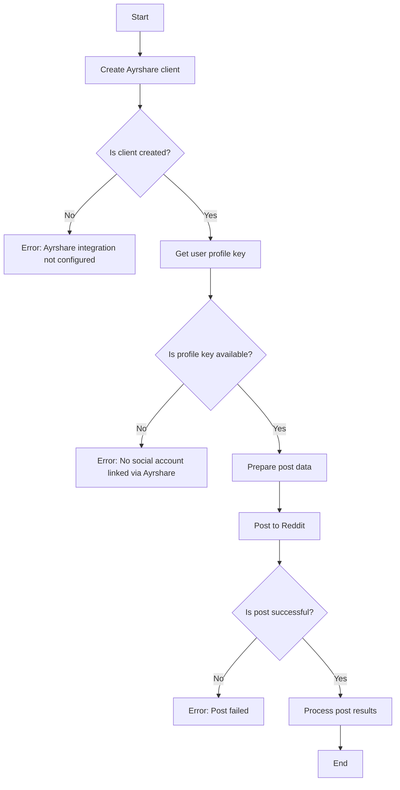
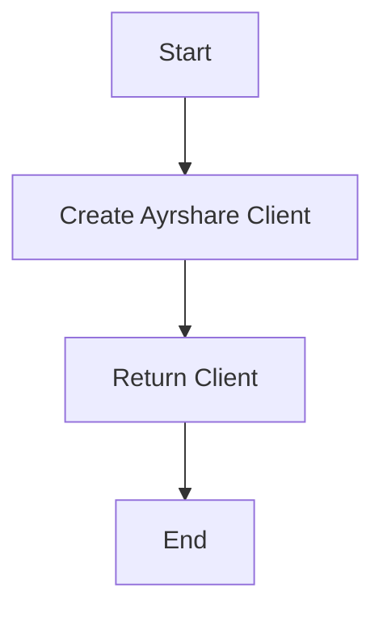
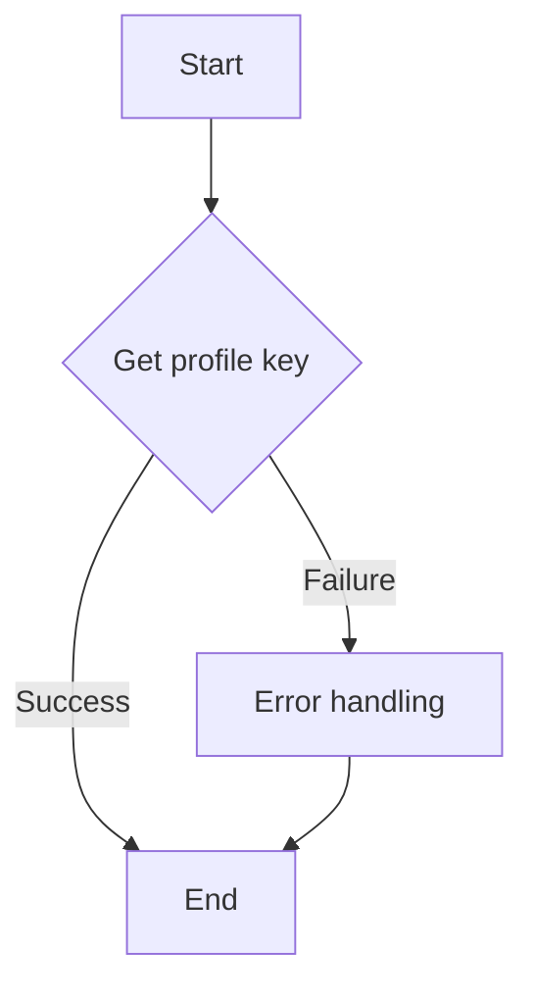
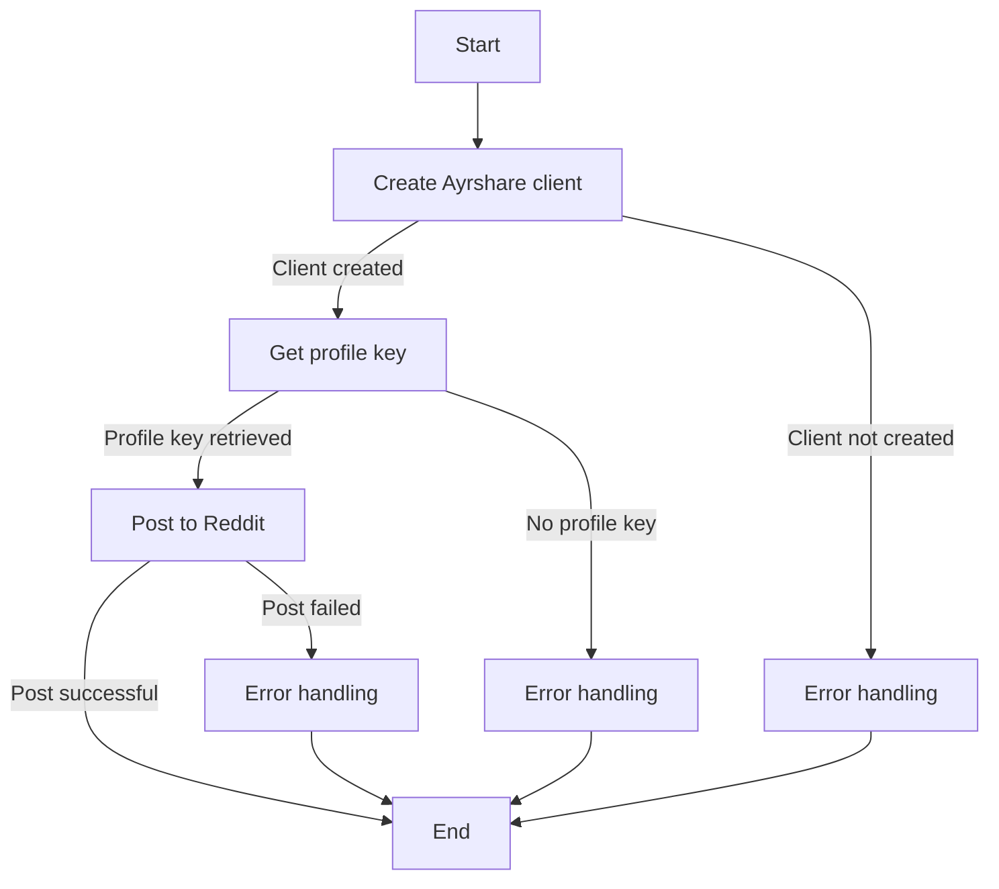
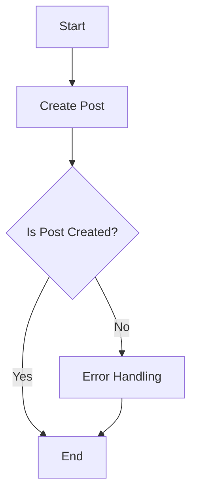
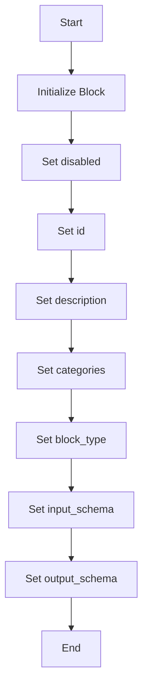
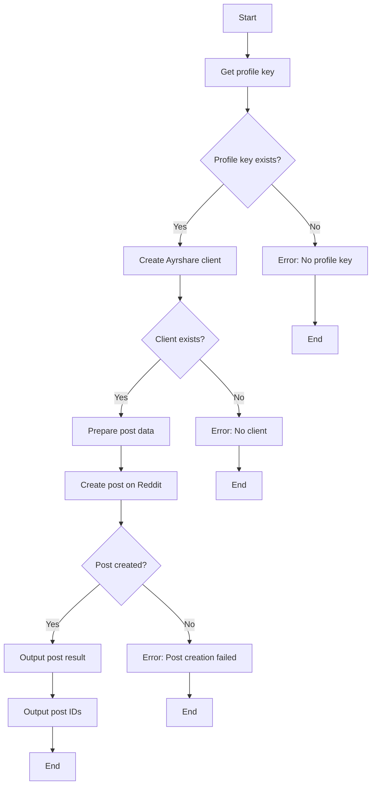

# `.\AutoGPT\autogpt_platform\backend\backend\blocks\ayrshare\post_to_reddit.py` 详细设计文档

The code defines a class `PostToRedditBlock` that integrates with Ayrshare to post content to Reddit. It handles input validation, client creation, and interaction with the Ayrshare API to post content and handle responses.

## 整体流程



## 类结构

```
PostToRedditBlock (Concrete Block)
├── Input (Subclass of BaseAyrshareInput)
│   └── Output (Subclass of BlockSchemaOutput)
```

## 全局变量及字段


### `profile_key`
    
The profile key for the user, used for authentication with Ayrshare.

类型：`str`
    


### `client`
    
The Ayrshare client instance used to interact with the Ayrshare API.

类型：`AyrshareClient`
    


### `iso_date`
    
The ISO formatted date string for scheduling posts, if provided.

类型：`str`
    


### `response`
    
The response object from the Ayrshare API, containing the result of the post operation.

类型：`PostResponse`
    


### `disabled`
    
Indicates whether the block is disabled or not.

类型：`bool`
    


### `id`
    
The unique identifier for the block.

类型：`str`
    


### `description`
    
The description of the block.

类型：`str`
    


### `categories`
    
The categories to which the block belongs.

类型：`set`
    


### `block_type`
    
The type of the block, indicating its functionality.

类型：`BlockType`
    


### `input_schema`
    
The input schema for the block.

类型：`PostToRedditBlock.Input`
    


### `output_schema`
    
The output schema for the block.

类型：`PostToRedditBlock.Output`
    


### `post_result`
    
The result of the post operation.

类型：`PostResponse`
    


### `post`
    
The post IDs created by the operation.

类型：`PostIds`
    


### `PostToRedditBlock.disabled`
    
Indicates whether the block is disabled or not.

类型：`bool`
    


### `PostToRedditBlock.id`
    
The unique identifier for the block.

类型：`str`
    


### `PostToRedditBlock.description`
    
The description of the block.

类型：`str`
    


### `PostToRedditBlock.categories`
    
The categories to which the block belongs.

类型：`set`
    


### `PostToRedditBlock.block_type`
    
The type of the block, indicating its functionality.

类型：`BlockType`
    


### `PostToRedditBlock.input_schema`
    
The input schema for the block.

类型：`PostToRedditBlock.Input`
    


### `PostToRedditBlock.output_schema`
    
The output schema for the block.

类型：`PostToRedditBlock.Output`
    


### `Output.post_result`
    
The result of the post operation.

类型：`PostResponse`
    


### `Output.post`
    
The post IDs created by the operation.

类型：`PostIds`
    
    

## 全局函数及方法


### create_ayrshare_client()

创建一个用于与Ayrshare API交互的客户端实例。

参数：

- 无

返回值：`client`：`Block`，Ayrshare API客户端实例，用于执行API调用。

#### 流程图



#### 带注释源码

```python
def create_ayrshare_client():
    # Import necessary modules
    from backend.integrations.ayrshare import AyrshareClient

    # Create and return a new AyrshareClient instance
    return AyrshareClient()
```


### get_profile_key

获取用户在Ayrshare上的配置密钥。

参数：

- `user_id`：`str`，用户ID，用于查找用户的配置密钥。

返回值：`str`，Ayrshare配置密钥。

#### 流程图



#### 带注释源码

```python
# from backend._util import BaseAyrshareInput, create_ayrshare_client, get_profile_key

def get_profile_key(user_id: str) -> str:
    # Assume get_profile_key is implemented to retrieve the profile key from Ayrshare
    # This is a placeholder for the actual implementation
    return "profile_key_for_user_" + user_id
```


### PostToRedditBlock.run

运行Reddit帖子发布块。

参数：

- `input_data`：`PostToRedditBlock.Input`，Reddit帖子输入数据。
- `user_id`：`str`，用户ID，用于获取Ayrshare配置密钥。

返回值：`BlockOutput`，包含帖子发布结果。

#### 流程图



#### 带注释源码

```python
async def run(
    self, input_data: "PostToRedditBlock.Input", *, user_id: str, **kwargs
) -> BlockOutput:
    profile_key = await get_profile_key(user_id)
    if not profile_key:
        yield "error", "Please link a social account via Ayrshare"
        return
    client = create_ayrshare_client()
    if not client:
        yield "error", "Ayrshare integration is not configured."
        return
    iso_date = (
        input_data.schedule_date.isoformat() if input_data.schedule_date else None
    )
    response = await client.create_post(
        post=input_data.post,
        platforms=[SocialPlatform.REDDIT],
        media_urls=input_data.media_urls,
        is_video=input_data.is_video,
        schedule_date=iso_date,
        disable_comments=input_data.disable_comments,
        shorten_links=input_data.shorten_links,
        unsplash=input_data.unsplash,
        requires_approval=input_data.requires_approval,
        random_post=input_data.random_post,
        random_media_url=input_data.random_media_url,
        notes=input_data.notes,
        profile_key=profile_key.get_secret_value(),
    )
    yield "post_result", response
    if response.postIds:
        for p in response.postIds:
            yield "post", p
```


### client.create_post

This function is responsible for creating a post on Reddit using the Ayrshare API.

参数：

- `post`：`PostIds`，The post content to be created.
- `platforms`：`SocialPlatform`，The social platform(s) where the post should be created. In this case, it is specifically Reddit.
- `media_urls`：`list`，A list of URLs for media files to be associated with the post.
- `is_video`：`bool`，Indicates whether the post is a video.
- `schedule_date`：`str`，The date and time when the post should be scheduled to be published.
- `disable_comments`：`bool`，Indicates whether comments should be disabled for the post.
- `shorten_links`：`bool`，Indicates whether links should be shortened.
- `unsplash`：`bool`，Indicates whether to use Unsplash for images.
- `requires_approval`：`bool`，Indicates whether the post requires approval.
- `random_post`：`bool`，Indicates whether to create a random post.
- `random_media_url`：`str`，The URL for a random media file to be associated with the post.
- `notes`：`str`，Additional notes for the post.
- `profile_key`：`str`，The profile key for authentication with the Ayrshare API.

返回值：`PostResponse`，The response from the Ayrshare API containing the result of the post creation.

#### 流程图



#### 带注释源码

```
response = await client.create_post(
    post=input_data.post,
    platforms=[SocialPlatform.REDDIT],
    media_urls=input_data.media_urls,
    is_video=input_data.is_video,
    schedule_date=iso_date,
    disable_comments=input_data.disable_comments,
    shorten_links=input_data.shorten_links,
    unsplash=input_data.unsplash,
    requires_approval=input_data.requires_approval,
    random_post=input_data.random_post,
    random_media_url=input_data.random_media_url,
    notes=input_data.notes,
    profile_key=profile_key.get_secret_value(),
)
```


### `PostToRedditBlock.__init__`

This method initializes the `PostToRedditBlock` class, setting up its properties and configurations.

参数：

- `disabled`：`bool`，Indicates whether the block is disabled or not.
- `id`：`str`，Unique identifier for the block.
- `description`：`str`，Description of the block's functionality.
- `categories`：`set`，Categories to which the block belongs.
- `block_type`：`BlockType`，Type of the block.
- `input_schema`：`PostToRedditBlock.Input`，Input schema for the block.
- `output_schema`：`PostToRedditBlock.Output`，Output schema for the block.

返回值：`None`，This method does not return any value.

#### 流程图



#### 带注释源码

```
def __init__(self):
    super().__init__(
        disabled=True,
        id="c7733580-3c72-483e-8e47-a8d58754d853",
        description="Post to Reddit using Ayrshare",
        categories={BlockCategory.SOCIAL},
        block_type=BlockType.AYRSHARE,
        input_schema=PostToRedditBlock.Input,
        output_schema=PostToRedditBlock.Output,
    )
```


### PostToRedditBlock.run

This method is responsible for posting content to Reddit using the Ayrshare integration.

参数：

- `input_data`：`PostToRedditBlock.Input`，The input data containing the post details.
- `user_id`：`str`，The user ID associated with the social account to be used for posting.

返回值：`BlockOutput`，The output containing the result of the post operation.

#### 流程图



#### 带注释源码

```python
async def run(
    self, input_data: "PostToRedditBlock.Input", *, user_id: str, **kwargs
) -> BlockOutput:
    profile_key = await get_profile_key(user_id)
    if not profile_key:
        yield "error", "Please link a social account via Ayrshare"
        return
    client = create_ayrshare_client()
    if not client:
        yield "error", "Ayrshare integration is not configured."
        return
    iso_date = (
        input_data.schedule_date.isoformat() if input_data.schedule_date else None
    )
    response = await client.create_post(
        post=input_data.post,
        platforms=[SocialPlatform.REDDIT],
        media_urls=input_data.media_urls,
        is_video=input_data.is_video,
        schedule_date=iso_date,
        disable_comments=input_data.disable_comments,
        shorten_links=input_data.shorten_links,
        unsplash=input_data.unsplash,
        requires_approval=input_data.requires_approval,
        random_post=input_data.random_post,
        random_media_url=input_data.random_media_url,
        notes=input_data.notes,
        profile_key=profile_key.get_secret_value(),
    )
    yield "post_result", response
    if response.postIds:
        for p in response.postIds:
            yield "post", p
```


## 关键组件


### 张量索引与惰性加载

用于延迟加载和索引张量，以优化内存使用和性能。

### 反量化支持

提供对反量化操作的支持，以适应不同的量化需求。

### 量化策略

定义量化策略，用于调整和优化模型参数的量化过程。


## 问题及建议


### 已知问题

-   **代码复用性低**：`PostToRedditBlock` 类中的 `Input` 和 `Output` 类直接继承自 `BaseAyrshareInput` 和 `BlockSchemaOutput`，没有添加额外的逻辑或字段，导致代码复用性低。
-   **错误处理不全面**：代码中只处理了 `profile_key` 和 `client` 为空的情况，但没有处理其他可能的异常，如网络请求失败、API限制等。
-   **异步代码缺乏超时处理**：`run` 方法中使用了异步请求，但没有设置超时处理，可能导致长时间等待响应。
-   **日志记录不足**：代码中没有添加日志记录，难以追踪错误和调试。

### 优化建议

-   **增加自定义输入和输出**：在 `Input` 和 `Output` 类中添加自定义字段和逻辑，提高代码复用性。
-   **完善错误处理**：添加对网络请求失败、API限制等异常的处理，确保程序的健壮性。
-   **设置异步请求超时**：为异步请求设置超时时间，避免长时间等待响应。
-   **添加日志记录**：在关键操作处添加日志记录，方便调试和问题追踪。
-   **考虑使用更高级的异常处理库**：如 `aiohttp`，它提供了更丰富的异常处理功能。
-   **优化代码结构**：将一些重复的代码提取到函数中，提高代码可读性和可维护性。
-   **考虑使用配置文件**：将一些配置信息，如 API 密钥、超时时间等，存储在配置文件中，方便管理和修改。
-   **进行单元测试**：编写单元测试，确保代码的正确性和稳定性。


## 其它


### 设计目标与约束

- 设计目标：实现一个能够将帖子发布到Reddit的模块，使用Ayrshare作为后端服务。
- 约束条件：必须使用Ayrshare提供的API进行帖子发布，确保用户认证和权限管理。

### 错误处理与异常设计

- 错误处理：在获取用户配置文件密钥、创建帖子时，如果出现错误，将返回相应的错误信息。
- 异常设计：使用`yield`语句返回错误信息，并在必要时终止执行。

### 数据流与状态机

- 数据流：用户输入数据 -> 输入验证 -> 创建帖子请求 -> 响应处理 -> 输出结果。
- 状态机：无状态机，流程线性执行。

### 外部依赖与接口契约

- 外部依赖：Ayrshare API，用于帖子发布。
- 接口契约：遵循Ayrshare API的规范进行接口调用。

### 安全性与隐私

- 安全性：确保用户认证信息的安全传输和存储。
- 隐私：遵守相关隐私法规，不泄露用户个人信息。

### 性能考量

- 性能考量：优化API调用，减少不必要的网络请求，提高响应速度。

### 可维护性与可扩展性

- 可维护性：代码结构清晰，易于理解和维护。
- 可扩展性：易于添加新的社交媒体平台支持。

### 测试与验证

- 测试：编写单元测试和集成测试，确保代码质量和功能正确性。

### 文档与帮助

- 文档：提供详细的API文档和用户手册。
- 帮助：提供在线帮助和FAQ，方便用户解决问题。


    