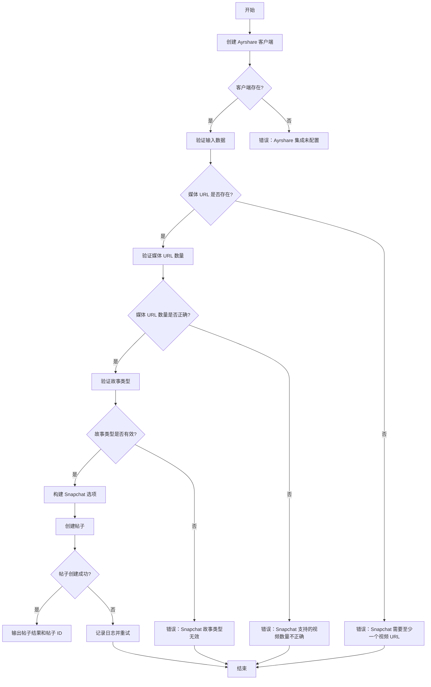
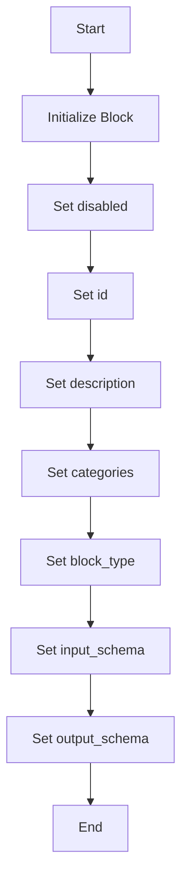
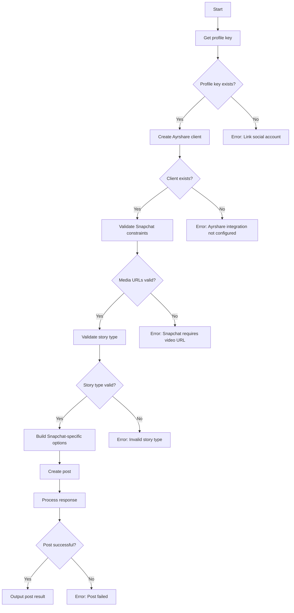

# `.\AutoGPT\autogpt_platform\backend\backend\blocks\ayrshare\post_to_snapchat.py` 详细设计文档

This code defines a class for posting content to Snapchat using the Ayrshare API, with specific options for Snapchat content.

## 整体流程



## 类结构

```
PostToSnapchatBlock (类)
├── Input (内部类)
│   ├── post (str)
│   ├── media_urls (list[str])
│   ├── story_type (str)
│   ├── video_thumbnail (str)
│   └── ...
├── Output (内部类)
│   ├── post_result (PostResponse)
│   └── post (PostIds)
└── ... (继承自 Block)
```

## 全局变量及字段


### `disabled`
    
Indicates whether the block is disabled or not.

类型：`bool`
    


### `id`
    
Unique identifier for the block.

类型：`str`
    


### `description`
    
Description of the block's functionality.

类型：`str`
    


### `categories`
    
Set of categories the block belongs to.

类型：`set[str]`
    


### `block_type`
    
Type of the block.

类型：`BlockType`
    


### `input_schema`
    
Input schema for the block.

类型：`PostToSnapchatBlock.Input`
    


### `output_schema`
    
Output schema for the block.

类型：`PostToSnapchatBlock.Output`
    


### `post`
    
The post text for Snapchat posts (optional for video-only content).

类型：`str`
    


### `media_urls`
    
Required video URL for Snapchat posts. Snapchat only supports video content.

类型：`list[str]`
    


### `story_type`
    
Type of Snapchat content: 'story', 'saved_story', or 'spotlight'.

类型：`str`
    


### `video_thumbnail`
    
Thumbnail URL for video content (optional, auto-generated if not provided).

类型：`str`
    


### `post_result`
    
The result of the post.

类型：`PostResponse`
    


### `post`
    
The result of the post.

类型：`PostIds`
    


### `PostToSnapchatBlock.disabled`
    
Indicates whether the block is disabled or not.

类型：`bool`
    


### `PostToSnapchatBlock.id`
    
Unique identifier for the block.

类型：`str`
    


### `PostToSnapchatBlock.description`
    
Description of the block's functionality.

类型：`str`
    


### `PostToSnapchatBlock.categories`
    
Set of categories the block belongs to.

类型：`set[str]`
    


### `PostToSnapchatBlock.block_type`
    
Type of the block.

类型：`BlockType`
    


### `PostToSnapchatBlock.input_schema`
    
Input schema for the block.

类型：`PostToSnapchatBlock.Input`
    


### `PostToSnapchatBlock.output_schema`
    
Output schema for the block.

类型：`PostToSnapchatBlock.Output`
    


### `Input.post`
    
The post text for Snapchat posts (optional for video-only content).

类型：`str`
    


### `Input.media_urls`
    
Required video URL for Snapchat posts. Snapchat only supports video content.

类型：`list[str]`
    


### `Input.story_type`
    
Type of Snapchat content: 'story', 'saved_story', or 'spotlight'.

类型：`str`
    


### `Input.video_thumbnail`
    
Thumbnail URL for video content (optional, auto-generated if not provided).

类型：`str`
    


### `Output.post_result`
    
The result of the post.

类型：`PostResponse`
    


### `Output.post`
    
The result of the post.

类型：`PostIds`
    
    

## 全局函数及方法


### PostToSnapchatBlock.__init__

This method initializes the `PostToSnapchatBlock` class, setting up its properties and configurations for posting to Snapchat.

参数：

- `disabled`: `bool`，Indicates whether the block is disabled.
- `id`: `str`，Unique identifier for the block.
- `description`: `str`，Description of the block's functionality.
- `categories`: `set`，Categories to which the block belongs.
- `block_type`: `BlockType`，Type of block.
- `input_schema`: `PostToSnapchatBlock.Input`，Input schema for the block.
- `output_schema`: `PostToSnapchatBlock.Output`，Output schema for the block.

返回值：`None`，This method does not return a value.

#### 流程图



#### 带注释源码

```python
def __init__(self):
    super().__init__(
        disabled=True,
        id="a9d7f854-2c83-4e96-b3a1-7f2e9c5d4b8e",
        description="Post to Snapchat using Ayrshare",
        categories={BlockCategory.SOCIAL},
        block_type=BlockType.AYRSHARE,
        input_schema=PostToSnapchatBlock.Input,
        output_schema=PostToSnapchatBlock.Output,
    )
```


### PostToSnapchatBlock.run

Post to Snapchat with Snapchat-specific options.

参数：

- `input_data`：`PostToSnapchatBlock.Input`，The input data for the Snapchat post.
- `user_id`：`str`，The user ID for which the post is being made.

返回值：`BlockOutput`，The output of the block, which includes the result of the post.

#### 流程图



#### 带注释源码

```python
async def run(
    self,
    input_data: "PostToSnapchatBlock.Input",
    *,
    user_id: str,
    **kwargs,
) -> BlockOutput:
    """Post to Snapchat with Snapchat-specific options."""
    profile_key = await get_profile_key(user_id)
    if not profile_key:
        yield "error", "Please link a social account via Ayrshare"
        return

    client = create_ayrshare_client()
    if not client:
        yield "error", "Ayrshare integration is not configured. Please set up the AYRSHARE_API_KEY."
        return

    # Validate Snapchat constraints
    if not input_data.media_urls:
        yield "error", "Snapchat requires at least one video URL"
        return

    if len(input_data.media_urls) > 1:
        yield "error", "Snapchat supports only one video per post"
        return

    # Validate story type
    valid_story_types = ["story", "saved_story", "spotlight"]
    if input_data.story_type not in valid_story_types:
        yield "error", f"Snapchat story type must be one of: {', '.join(valid_story_types)}"
        return

    # Convert datetime to ISO format if provided
    iso_date = (
        input_data.schedule_date.isoformat() if input_data.schedule_date else None
    )

    # Build Snapchat-specific options
    snapchat_options = {}

    # Story type
    if input_data.story_type != "story":
        snapchat_options["storyType"] = input_data.story_type

    # Video thumbnail
    if input_data.video_thumbnail:
        snapchat_options["videoThumbnail"] = input_data.video_thumbnail

    response = await client.create_post(
        post=input_data.post,
        platforms=[SocialPlatform.SNAPCHAT],
        media_urls=input_data.media_urls,
        is_video=True,  # Snapchat only supports video
        schedule_date=iso_date,
        disable_comments=input_data.disable_comments,
        shorten_links=input_data.shorten_links,
        unsplash=input_data.unsplash,
        requires_approval=input_data.requires_approval,
        random_post=input_data.random_post,
        random_media_url=input_data.random_media_url,
        notes=input_data.notes,
        snapchat_options=snapchat_options if snapchat_options else None,
        profile_key=profile_key.get_secret_value(),
    )
    yield "post_result", response
    if response.postIds:
        for p in response.postIds:
            yield "post", p
```


## 关键组件


### 张量索引与惰性加载

用于实现高效的数据访问和延迟加载，以减少内存占用和提高性能。

### 反量化支持

提供对量化策略的支持，允许在运行时动态调整量化参数。

### 量化策略

定义了量化操作的规则和算法，用于优化模型性能和资源使用。


## 问题及建议


### 已知问题

-   **代码重复性**：`PostToSnapchatBlock.Input` 和 `PostToSnapchatBlock.Output` 类中存在与 `BaseAyrshareInput` 和 `BlockSchemaOutput` 类的重复字段定义。这可能导致维护困难，因为任何对基类字段定义的更改都需要在所有子类中重复。
-   **错误处理**：错误消息可能不够具体，例如 "Please link a social account via Ayrshare" 并没有明确指出是哪个社交平台需要链接。
-   **异常处理**：代码中使用了 `yield` 来处理错误，但没有明确处理可能发生的异常，如网络请求失败或API限制。
-   **代码可读性**：`run` 方法中的逻辑较为复杂，缺乏注释，难以理解每个步骤的目的和作用。

### 优化建议

-   **减少代码重复**：考虑使用继承或组合来减少重复代码，例如，可以创建一个专门的 `SnapchatInput` 和 `SnapchatOutput` 类来继承自 `BaseAyrshareInput` 和 `BlockSchemaOutput`。
-   **改进错误消息**：提供更具体的错误消息，以便用户可以快速定位问题，例如 "Please link your Snapchat account via Ayrshare."
-   **异常处理**：添加异常处理来捕获和处理可能发生的错误，例如使用 `try-except` 块来捕获网络请求异常。
-   **代码重构**：重构 `run` 方法，添加注释，使代码更易于理解和维护。
-   **代码测试**：编写单元测试来验证代码的正确性和健壮性，确保在未来的更改中不会引入新的错误。
-   **性能优化**：考虑性能优化，例如减少不必要的网络请求或数据库查询。


## 其它


### 设计目标与约束

- 设计目标：
  - 实现一个能够将内容发布到Snapchat的Block。
  - 提供Snapchat特定的选项，如故事类型、视频缩略图等。
  - 确保内容符合Snapchat的发布要求。
- 约束：
  - Snapchat只支持视频内容。
  - 每个帖子只能有一个视频。
  - 故事类型必须是预定义的选项之一。

### 错误处理与异常设计

- 错误处理：
  - 如果用户未通过Ayrshare链接社交账户，则返回错误消息。
  - 如果Ayrshare集成未配置，则返回错误消息。
  - 如果缺少视频URL，则返回错误消息。
  - 如果提供的视频URL超过一个，则返回错误消息。
  - 如果故事类型不是有效选项，则返回错误消息。
- 异常设计：
  - 使用异步函数处理网络请求，以处理可能的网络异常。
  - 使用try-except块捕获并处理可能的异常。

### 数据流与状态机

- 数据流：
  - 用户输入数据通过输入schema传递到Block。
  - Block验证输入数据并构建Snapchat帖子选项。
  - Block通过Ayrshare客户端发送帖子请求。
  - Ayrshare返回帖子响应，Block处理响应并返回结果。
- 状态机：
  - Block在运行过程中没有明确的状态机，但通过一系列的验证步骤确保帖子符合Snapchat的要求。

### 外部依赖与接口契约

- 外部依赖：
  - Ayrshare API：用于发送帖子到Snapchat。
  - SchemaField：用于定义输入和输出schema。
- 接口契约：
  - Ayrshare API的接口契约定义了如何发送帖子以及预期的响应格式。
  - SchemaField的接口契约定义了如何定义schema字段及其属性。


    