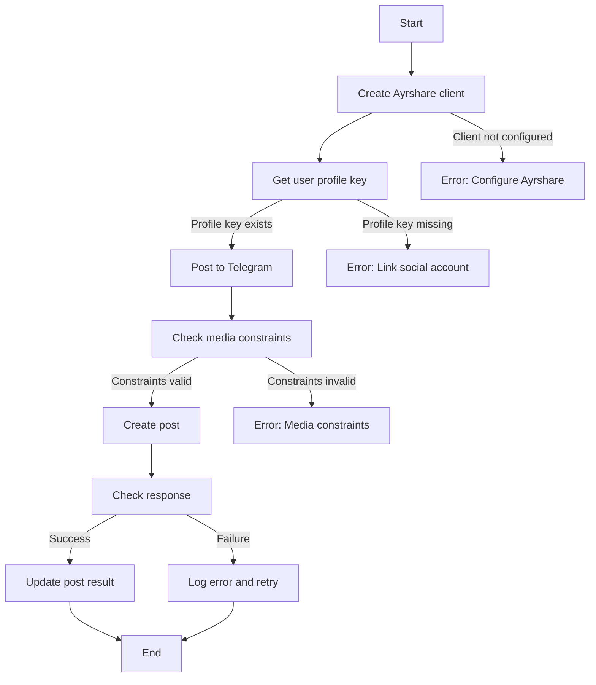
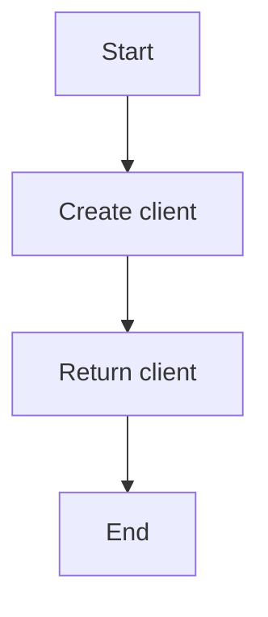
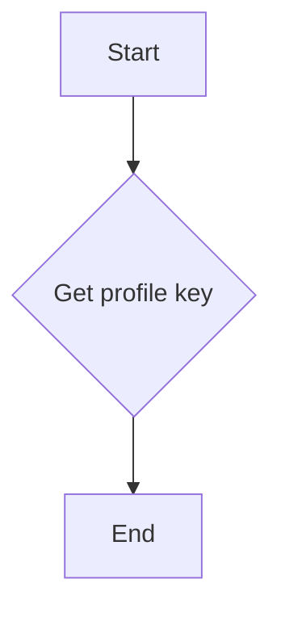
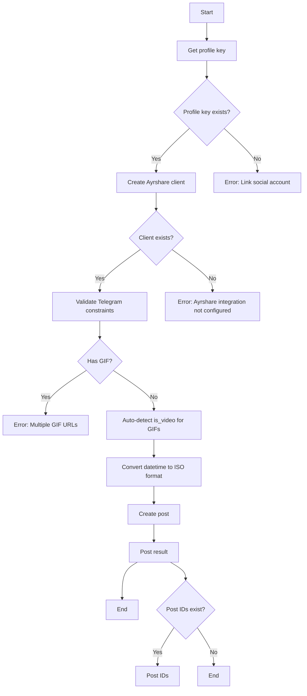
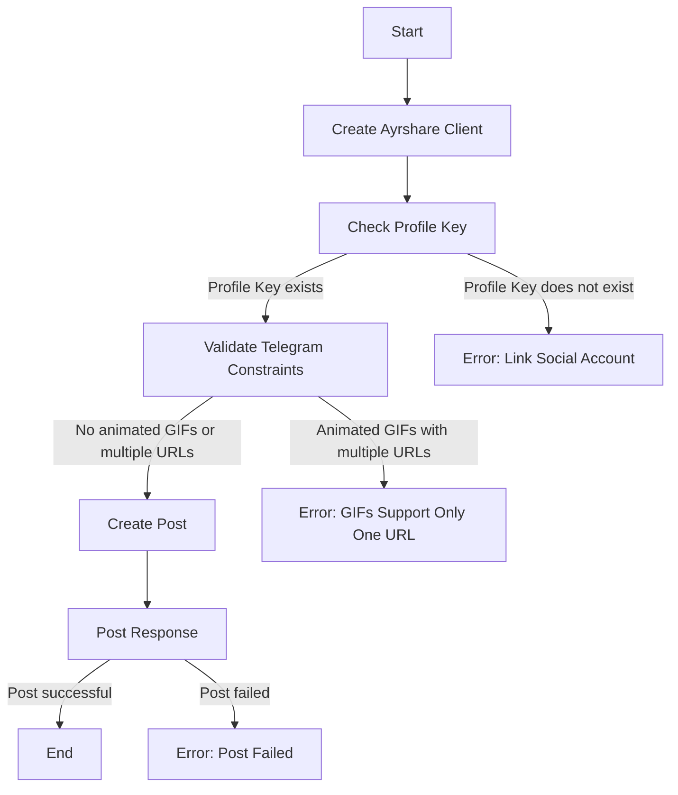
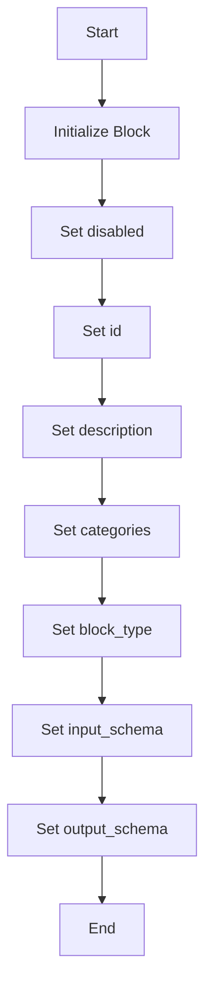
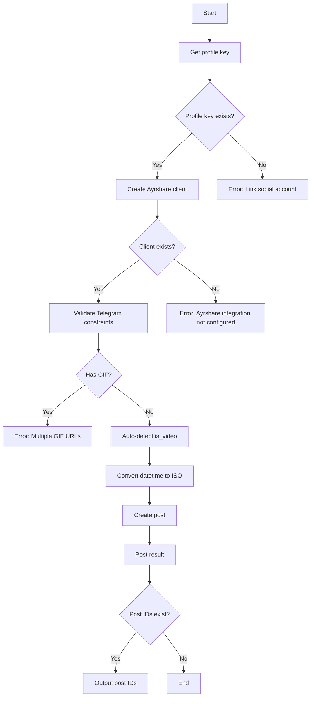

# `.\AutoGPT\autogpt_platform\backend\backend\blocks\ayrshare\post_to_telegram.py` 详细设计文档

The code defines a class `PostToTelegramBlock` that integrates with the Ayrshare API to post messages and media to Telegram. It includes input validation, error handling, and interaction with the Ayrshare client.

## 整体流程



## 类结构

```
PostToTelegramBlock (Concrete Block)
├── Input (Subclass of BaseAyrshareInput)
│   ├── post (str)
│   ├── media_urls (list[str])
│   └── is_video (bool)
└── Output (Subclass of BlockSchemaOutput)
    └── post_result (PostResponse)
    └── post (PostIds)
```

## 全局变量及字段


### `profile_key`
    
The profile key for the user, used for authentication with Ayrshare.

类型：`str`
    


### `client`
    
The Ayrshare client instance used to interact with the Ayrshare API.

类型：`AyrshareClient`
    


### `gif_extensions`
    
List of file extensions for GIFs.

类型：`list[str]`
    


### `has_gif`
    
Flag indicating if any of the media URLs are for animated GIFs.

类型：`bool`
    


### `detected_is_video`
    
Flag indicating if the media is a video, used for animated GIFs without proper extension.

类型：`bool`
    


### `iso_date`
    
ISO formatted date string for scheduling posts.

类型：`str`
    


### `response`
    
The response object from the Ayrshare API post operation.

类型：`PostResponse`
    


### `disabled`
    
Flag indicating if the block is disabled.

类型：`bool`
    


### `id`
    
Unique identifier for the block.

类型：`str`
    


### `description`
    
Description of the block.

类型：`str`
    


### `categories`
    
Set of categories the block belongs to.

类型：`set[BlockCategory]`
    


### `block_type`
    
Type of the block.

类型：`BlockType`
    


### `input_schema`
    
Input schema for the block.

类型：`PostToTelegramBlock.Input`
    


### `output_schema`
    
Output schema for the block.

类型：`PostToTelegramBlock.Output`
    


### `post`
    
The post text for the Telegram message.

类型：`str`
    


### `media_urls`
    
List of media URLs to be attached to the Telegram message.

类型：`list[str]`
    


### `is_video`
    
Flag indicating if the media is a video.

类型：`bool`
    


### `post_result`
    
The result of the post operation.

类型：`PostResponse`
    


### `post`
    
The post IDs returned from the Ayrshare API.

类型：`PostIds`
    


### `PostToTelegramBlock.disabled`
    
Flag indicating if the block is disabled.

类型：`bool`
    


### `PostToTelegramBlock.id`
    
Unique identifier for the block.

类型：`str`
    


### `PostToTelegramBlock.description`
    
Description of the block.

类型：`str`
    


### `PostToTelegramBlock.categories`
    
Set of categories the block belongs to.

类型：`set[BlockCategory]`
    


### `PostToTelegramBlock.block_type`
    
Type of the block.

类型：`BlockType`
    


### `PostToTelegramBlock.input_schema`
    
Input schema for the block.

类型：`PostToTelegramBlock.Input`
    


### `PostToTelegramBlock.output_schema`
    
Output schema for the block.

类型：`PostToTelegramBlock.Output`
    


### `PostToTelegramBlock.Input.post`
    
The post text for the Telegram message.

类型：`str`
    


### `PostToTelegramBlock.Input.media_urls`
    
List of media URLs to be attached to the Telegram message.

类型：`list[str]`
    


### `PostToTelegramBlock.Input.is_video`
    
Flag indicating if the media is a video.

类型：`bool`
    


### `PostToTelegramBlock.Output.post_result`
    
The result of the post operation.

类型：`PostResponse`
    


### `PostToTelegramBlock.Output.post`
    
The post IDs returned from the Ayrshare API.

类型：`PostIds`
    
    

## 全局函数及方法


### create_ayrshare_client()

创建一个用于与Ayrshare API交互的客户端实例。

参数：

- 无

返回值：`client`：`Block`，Ayrshare API客户端实例，用于发送请求到Ayrshare API。

#### 流程图



#### 带注释源码

```python
def create_ayrshare_client():
    # Import necessary modules
    from backend.integrations.ayrshare import AyrshareClient

    # Create a new AyrshareClient instance
    client = AyrshareClient()

    # Return the client instance
    return client
```


### `get_profile_key`

获取指定用户的配置文件密钥。

参数：

- `user_id`：`str`，用户的唯一标识符。

返回值：`str`，配置文件密钥。

#### 流程图



#### 带注释源码

```python
# from backend._util import BaseAyrshareInput, create_ayrshare_client, get_profile_key

def get_profile_key(user_id: str) -> str:
    # Implementation details are not shown here as they are not provided in the given code snippet.
    # This function would typically interact with a database or an API to retrieve the profile key for the given user_id.
    pass
```


### `PostToTelegramBlock.run`

This function is responsible for posting content to the Telegram platform using the Ayrshare API. It performs validation on the input data, configures the Ayrshare client, and sends the post request.

参数：

- `input_data`：`PostToTelegramBlock.Input`，The input data containing the post text, media URLs, and other Telegram-specific options.
- `user_id`：`str`，The user ID associated with the social account to be used for posting.

返回值：`BlockOutput`，The output containing the result of the post operation.

#### 流程图



#### 带注释源码

```python
async def run(
    self,
    input_data: "PostToTelegramBlock.Input",
    *,
    user_id: str,
    **kwargs,
) -> BlockOutput:
    """Post to Telegram with Telegram-specific validation."""
    profile_key = await get_profile_key(user_id)
    if not profile_key:
        yield "error", "Please link a social account via Ayrshare"
        return

    client = create_ayrshare_client()
    if not client:
        yield "error", "Ayrshare integration is not configured. Please set up the AYRSHARE_API_KEY."
        return

    # Validate Telegram constraints
    # Check for animated GIFs - only one URL allowed
    gif_extensions = [".gif", ".GIF"]
    has_gif = any(
        any(url.endswith(ext) for ext in gif_extensions)
        for url in input_data.media_urls
    )

    if has_gif and len(input_data.media_urls) > 1:
        yield "error", "Telegram animated GIFs support only one URL per post"
        return

    # Auto-detect if we need to set is_video for GIFs without proper extension
    detected_is_video = input_data.is_video
    if input_data.media_urls and not has_gif and not input_data.is_video:
        # Check if this might be a GIF without proper extension
        # This is just informational - user needs to set is_video manually
        pass

    # Convert datetime to ISO format if provided
    iso_date = (
        input_data.schedule_date.isoformat() if input_data.schedule_date else None
    )

    response = await client.create_post(
        post=input_data.post,
        platforms=[SocialPlatform.TELEGRAM],
        media_urls=input_data.media_urls,
        is_video=detected_is_video,
        schedule_date=iso_date,
        disable_comments=input_data.disable_comments,
        shorten_links=input_data.shorten_links,
        unsplash=input_data.unsplash,
        requires_approval=input_data.requires_approval,
        random_post=input_data.random_post,
        random_media_url=input_data.random_media_url,
        notes=input_data.notes,
        profile_key=profile_key.get_secret_value(),
    )
    yield "post_result", response
    if response.postIds:
        for p in response.postIds:
            yield "post", p
```


### `create_post`

This function is responsible for creating a post on the Telegram platform using the Ayrshare API.

参数：

- `post`：`str`，The text content of the post to be created.
- `platforms`：`list[SocialPlatform]`，A list of social platforms where the post should be created.
- `media_urls`：`list[str]`，An optional list of media URLs to be associated with the post.
- `is_video`：`bool`，Indicates whether the media is a video. Set to true for animated GIFs that don't end in .gif/.GIF extension.
- `schedule_date`：`datetime`，The date and time when the post should be scheduled to be published.
- `disable_comments`：`bool`，Indicates whether comments should be disabled for the post.
- `shorten_links`：`bool`，Indicates whether links should be shortened.
- `unsplash`：`bool`，Indicates whether the post should use Unsplash images.
- `requires_approval`：`bool`，Indicates whether the post requires approval.
- `random_post`：`bool`，Indicates whether a random post should be selected.
- `random_media_url`：`bool`，Indicates whether a random media URL should be selected.
- `notes`：`str`，Additional notes for the post.
- `profile_key`：`str`，The profile key for the user's Ayrshare account.

返回值：`PostResponse`，The response from the Ayrshare API indicating the result of the post creation.

#### 流程图



#### 带注释源码

```python
async def create_post(
    self,
    post: str,
    platforms: list[SocialPlatform],
    media_urls: list[str],
    is_video: bool,
    schedule_date: datetime,
    disable_comments: bool,
    shorten_links: bool,
    unsplash: bool,
    requires_approval: bool,
    random_post: bool,
    random_media_url: bool,
    notes: str,
    profile_key: str,
):
    response = await client.create_post(
        post=input_data.post,
        platforms=[SocialPlatform.TELEGRAM],
        media_urls=input_data.media_urls,
        is_video=detected_is_video,
        schedule_date=iso_date,
        disable_comments=input_data.disable_comments,
        shorten_links=input_data.shorten_links,
        unsplash=input_data.unsplash,
        requires_approval=input_data.requires_approval,
        random_post=input_data.random_post,
        random_media_url=input_data.random_media_url,
        notes=input_data.notes,
        profile_key=profile_key.get_secret_value(),
    )
    yield "post_result", response
    if response.postIds:
        for p in response.postIds:
            yield "post", p
```


### PostToTelegramBlock.__init__

This method initializes the `PostToTelegramBlock` class, setting up its properties and configurations.

参数：

- `disabled`: `bool`，Indicates whether the block is disabled or not.
- `id`: `str`，Unique identifier for the block.
- `description`: `str`，Description of the block's functionality.
- `categories`: `set`，Set of categories the block belongs to.
- `block_type`: `BlockType`，Type of the block.
- `input_schema`: `PostToTelegramBlock.Input`，Input schema for the block.
- `output_schema`: `PostToTelegramBlock.Output`，Output schema for the block.

返回值：`None`，This method does not return any value.

#### 流程图



#### 带注释源码

```python
def __init__(self):
    super().__init__(
        disabled=True,
        id="47bc74eb-4af2-452c-b933-af377c7287df",
        description="Post to Telegram using Ayrshare",
        categories={BlockCategory.SOCIAL},
        block_type=BlockType.AYRSHARE,
        input_schema=PostToTelegramBlock.Input,
        output_schema=PostToTelegramBlock.Output,
    )
```


### PostToTelegramBlock.run

This method is responsible for posting content to the Telegram platform using the Ayrshare API. It performs validation on the input data, configures the client, and sends the post.

参数：

- `input_data`：`PostToTelegramBlock.Input`，The input data containing the post text, media URLs, and other Telegram-specific options.
- `user_id`：`str`，The user ID for which the post is being made.
- `**kwargs`：`dict`，Additional keyword arguments that may be used for future extensions.

返回值：`BlockOutput`，The output containing the result of the post.

#### 流程图



#### 带注释源码

```python
async def run(
    self,
    input_data: "PostToTelegramBlock.Input",
    *,
    user_id: str,
    **kwargs,
) -> BlockOutput:
    """Post to Telegram with Telegram-specific validation."""
    profile_key = await get_profile_key(user_id)
    if not profile_key:
        yield "error", "Please link a social account via Ayrshare"
        return

    client = create_ayrshare_client()
    if not client:
        yield "error", "Ayrshare integration is not configured. Please set up the AYRSHARE_API_KEY."
        return

    # Validate Telegram constraints
    # Check for animated GIFs - only one URL allowed
    gif_extensions = [".gif", ".GIF"]
    has_gif = any(
        any(url.endswith(ext) for ext in gif_extensions)
        for url in input_data.media_urls
    )

    if has_gif and len(input_data.media_urls) > 1:
        yield "error", "Telegram animated GIFs support only one URL per post"
        return

    # Auto-detect if we need to set is_video for GIFs without proper extension
    detected_is_video = input_data.is_video
    if input_data.media_urls and not has_gif and not input_data.is_video:
        # Check if this might be a GIF without proper extension
        # This is just informational - user needs to set is_video manually
        pass

    # Convert datetime to ISO format if provided
    iso_date = (
        input_data.schedule_date.isoformat() if input_data.schedule_date else None
    )

    response = await client.create_post(
        post=input_data.post,
        platforms=[SocialPlatform.TELEGRAM],
        media_urls=input_data.media_urls,
        is_video=detected_is_video,
        schedule_date=iso_date,
        disable_comments=input_data.disable_comments,
        shorten_links=input_data.shorten_links,
        unsplash=input_data.unsplash,
        requires_approval=input_data.requires_approval,
        random_post=input_data.random_post,
        random_media_url=input_data.random_media_url,
        notes=input_data.notes,
        profile_key=profile_key.get_secret_value(),
    )
    yield "post_result", response
    if response.postIds:
        for p in response.postIds:
            yield "post", p
```


## 关键组件


### 张量索引与惰性加载

用于延迟加载和索引张量，以优化内存使用和性能。

### 反量化支持

提供对反量化操作的支持，以适应不同的量化需求。

### 量化策略

实现量化策略，用于优化模型性能和资源使用。


## 问题及建议


### 已知问题

-   **代码重复性**：`PostToTelegramBlock.Input` 类中，`post`、`media_urls` 和 `is_video` 字段与基类 `BaseAyrshareInput` 中的字段重复，这可能导致维护困难。
-   **异常处理**：代码中存在多个 `yield "error", "..."` 调用，但没有统一的异常处理机制，这可能导致错误信息不一致或难以追踪。
-   **GIF 检测逻辑**：GIF 检测逻辑仅提供信息，没有强制用户设置 `is_video`，这可能导致不符合 Telegram 规范的帖子。
-   **依赖注入**：`create_ayrshare_client` 函数的调用没有使用依赖注入，这可能导致测试困难。

### 优化建议

-   **减少代码重复**：将 `PostToTelegramBlock.Input` 中的重复字段移除，并使用继承或组合的方式处理 Telegram 特定的字段。
-   **统一异常处理**：引入异常处理机制，例如使用自定义异常类，以统一错误处理逻辑。
-   **增强 GIF 检测逻辑**：强制用户在检测到 GIF 时设置 `is_video` 字段，以确保帖子符合 Telegram 规范。
-   **使用依赖注入**：将 `create_ayrshare_client` 函数的调用改为依赖注入，以便于测试和配置管理。
-   **代码注释**：增加必要的代码注释，以提高代码的可读性和可维护性。
-   **单元测试**：编写单元测试以覆盖关键功能，确保代码的稳定性和可靠性。
-   **日志记录**：增加日志记录，以便于问题追踪和调试。


## 其它


### 设计目标与约束

- 设计目标：
  - 实现一个模块，用于将帖子发布到Telegram平台。
  - 提供Telegram特定的选项和验证。
  - 与Ayrshare集成，以使用其API进行发布操作。

- 约束：
  - 必须遵循Ayrshare API的使用规范。
  - 需要处理Telegram特定的媒体和帖子约束。
  - 确保用户已通过Ayrshare链接社交账户。

### 错误处理与异常设计

- 错误处理：
  - 如果用户未通过Ayrshare链接社交账户，则返回错误消息。
  - 如果Ayrshare集成未配置，则返回错误消息。
  - 如果媒体URL违反Telegram的动画GIF约束，则返回错误消息。

- 异常设计：
  - 使用`yield`语句在异步函数中返回错误消息。
  - 异常应被捕获并转换为适当的错误消息。

### 数据流与状态机

- 数据流：
  - 输入数据通过`PostToTelegramBlock.Input`类传递。
  - 输入数据经过验证和转换。
  - 输入数据通过Ayrshare API发送到Telegram。

- 状态机：
  - 状态包括：初始化、验证、发布、错误。

### 外部依赖与接口契约

- 外部依赖：
  - Ayrshare API。
  - Ayrshare客户端库。

- 接口契约：
  - Ayrshare API的调用规范。
  - 输入和输出数据结构的定义。
  - 异步函数的调用规范。


    