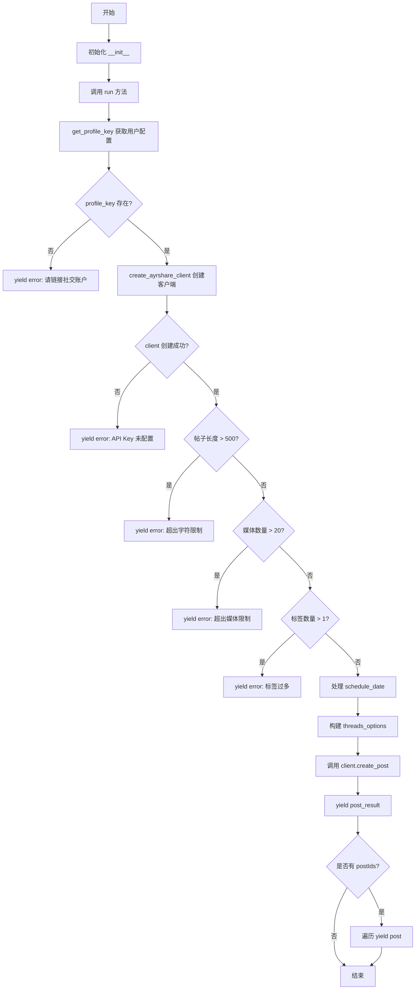
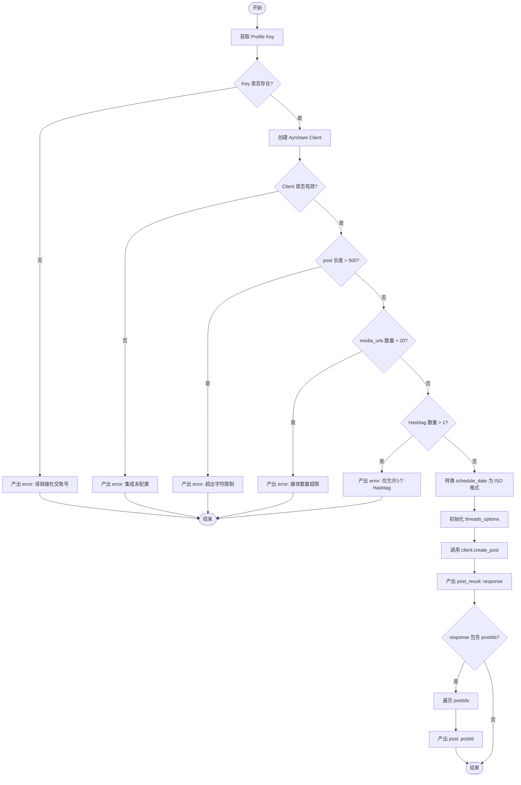

# `AutoGPT\autogpt_platform\backend\backend\blocks\ayrshare\post_to_threads.py` 详细设计文档

该代码定义了一个用于通过 Ayrshare API 在 Threads 社交平台发布内容的 Block 类，包含针对 Threads 的特定输入输出模式定义、帖子内容验证（如字数、媒体数量限制）以及异步发布执行的逻辑。

## 整体流程



## 类结构

```
Block
└── PostToThreadsBlock
    ├── Input (BaseAyrshareInput)
    └── Output (BlockSchemaOutput)
```

## 全局变量及字段


### `PostToThreadsBlock.Input.post`
    
The post text (max 500 chars, empty string allowed). Only 1 hashtag allowed. Use @handle to mention users.

类型：`str`
    


### `PostToThreadsBlock.Input.media_urls`
    
Optional list of media URLs. Supports up to 20 images/videos in a carousel. Auto-preview links unless media is included.

类型：`list[str]`
    


### `PostToThreadsBlock.Output.post_result`
    
The result of the post

类型：`PostResponse`
    


### `PostToThreadsBlock.Output.post`
    
The result of the post

类型：`PostIds`
    
    

## 全局函数及方法


### `PostToThreadsBlock.__init__`

`PostToThreadsBlock` 类的构造函数，用于初始化该功能块。通过调用父类 `Block` 的初始化方法，配置该块的元数据，包括唯一标识符、描述、分类、类型以及输入和输出的数据结构定义。

参数：

-  `self`：`PostToThreadsBlock`，表示正在初始化的类实例本身

返回值：`None`，构造函数不返回任何值

#### 流程图

```mermaid
graph TD
    A[开始: PostToThreadsBlock.__init__] --> B[调用父类初始化 super().__init__]
    B --> C[配置块元数据]
    C --> C1[disabled: True]
    C --> C2[id: f8c3b2e1-9d4a-4e5f-8c7b-6a9e8d2f1c3b]
    C --> C3[description: Post to Threads using Ayrshare]
    C --> C4[categories: BlockCategory.SOCIAL]
    C --> C5[block_type: BlockType.AYRSHARE]
    C --> C6[input_schema: PostToThreadsBlock.Input]
    C --> C7[output_schema: PostToThreadsBlock.Output]
    C1 & C2 & C3 & C4 & C5 & C6 & C7 --> D[结束: 实例化完成]
```

#### 带注释源码

```python
def __init__(self):
    # 调用父类 Block 的构造函数以注册该块的配置信息
    super().__init__(
        disabled=True,  # 状态标志，表示该块默认为禁用状态
        id="f8c3b2e1-9d4a-4e5f-8c7b-6a9e8d2f1c3b",  # 块的全局唯一标识符 (UUID)
        description="Post to Threads using Ayrshare",  # 块的功能描述文本
        categories={BlockCategory.SOCIAL},  # 归类为社交媒体类别
        block_type=BlockType.AYRSHARE,  # 指定集成类型为 Ayrshare
        input_schema=PostToThreadsBlock.Input,  # 定义输入数据的验证 Schema，使用内部类 Input
        output_schema=PostToThreadsBlock.Output,  # 定义输出数据的验证 Schema，使用内部类 Output
    )
```


### `PostToThreadsBlock.run`

该方法负责处理向 Threads 社交媒体平台发布内容的异步逻辑。它执行前置条件检查，包括验证用户配置文件、初始化 Ayrshare 客户端、校验 Threads 特定的内容限制（如字数限制、媒体数量和 Hashtag 数量），并最终调用 API 完成发布。

参数：

-  `self`：`PostToThreadsBlock`，类的实例引用。
-  `input_data`：`PostToThreadsBlock.Input`，包含发布内容的输入数据，如帖子文本、媒体链接、调度时间及各种发布选项。
-  `user_id`：`str`，发起请求的用户标识符。
-  `**kwargs`：`Any`，接收额外的关键字参数。

返回值：`BlockOutput`（生成器），异步产出包含执行结果或错误信息的元组，如 `("post_result", response)` 或 `("error", message)`。

#### 流程图



#### 带注释源码

```python
async def run(
    self,
    input_data: "PostToThreadsBlock.Input",
    *,
    user_id: str,
    **kwargs,
) -> BlockOutput:
    """Post to Threads with Threads-specific validation."""
    # 1. 获取用户的 Profile Key，用于身份验证
    profile_key = await get_profile_key(user_id)
    if not profile_key:
        yield "error", "Please link a social account via Ayrshare"
        return

    # 2. 创建 Ayrshare API 客户端
    client = create_ayrshare_client()
    if not client:
        yield "error", "Ayrshare integration is not configured. Please set up the AYRSHARE_API_KEY."
        return

    # 3. 验证 Threads 约束：帖子文本长度不得超过 500 字符
    if len(input_data.post) > 500:
        yield "error", f"Threads post text exceeds 500 character limit ({len(input_data.post)} characters)"
        return

    # 4. 验证 Threads 约束：媒体数量不得超过 20 个
    if len(input_data.media_urls) > 20:
        yield "error", "Threads supports a maximum of 20 images/videos in a carousel"
        return

    # 5. 验证 Threads 约束：Hashtag 数量不得超过 1 个
    hashtag_count = input_data.post.count("#")
    if hashtag_count > 1:
        yield "error", f"Threads allows only 1 hashtag per post ({hashtag_count} found)"
        return

    # 6. 处理调度时间，如果存在则转换为 ISO 格式字符串
    iso_date = (
        input_data.schedule_date.isoformat() if input_data.schedule_date else None
    )

    # 7. 构建 Threads 特定选项（当前为空字典）
    threads_options = {}
    # Note: Based on the documentation, Threads doesn't seem to have specific options
    # beyond the standard ones. The main constraints are validation-based.

    # 8. 调用 Ayrshare 客户端执行发布操作
    response = await client.create_post(
        post=input_data.post,
        platforms=[SocialPlatform.THREADS],
        media_urls=input_data.media_urls,
        is_video=input_data.is_video,
        schedule_date=iso_date,
        disable_comments=input_data.disable_comments,
        shorten_links=input_data.shorten_links,
        unsplash=input_data.unsplash,
        requires_approval=input_data.requires_approval,
        random_post=input_data.random_post,
        random_media_url=input_data.random_media_url,
        notes=input_data.notes,
        threads_options=threads_options if threads_options else None,
        profile_key=profile_key.get_secret_value(),
    )
    
    # 9. 产出完整的 API 响应结果
    yield "post_result", response
    
    # 10. 如果响应中包含帖子 ID，逐个产出
    if response.postIds:
        for p in response.postIds:
            yield "post", p
```


## 关键组件


### PostToThreadsBlock Class

核心控制类，负责封装发布到 Threads 的逻辑、输入输出模式定义以及与外部服务的交互。

### Input Schema

输入模式定义，包含针对 Threads 平台的字段限制（如字数、话题标签数量、媒体数量）。

### Threads Constraints Validation

验证逻辑模块，用于检查输入内容是否符合 Threads 平台的特定规则（500字符限制、仅1个话题标签、最多20个媒体）。

### Ayrshare Client Integration

外部服务集成组件，负责创建客户端并调用 API 执行实际的发布操作。

### Output Schema

输出模式定义，封装了 API 响应结果及生成的帖子 ID。


## 问题及建议


### 已知问题

-   **Block 默认禁用状态**：在 `__init__` 方法中，`disabled` 参数被硬编码为 `True`，这将导致该 Block 在实例化后默认无法运行，除非在运行时被显式启用，这可能是遗留的开发调试代码或配置错误。
-   **Hashtag 验证逻辑缺陷**：使用 `input_data.post.count("#")` 统计话题标签数量过于简单，会错误地计算出现在 URL（如 `https://example.com#anchor`）或其他非话题标签上下文中的 `#` 符号，导致误报。
-   **输出模式与 Yield 行为不一致**：Output 类中定义 `post` 字段的类型为 `PostIds`，通常暗示这是一个包含所有 ID 的对象或列表。然而，`run` 方法中对 `response.postIds` 进行了循环遍历，多次 yield 名为 `"post"` 的键值。这导致输出流中包含多个 `"post"` 键，可能与期望的单次输出结构冲突，增加了下游处理的复杂度。
-   **硬编码的 UUID**：Block 的 ID (`f8c3b2e1-9d4a-4e5f-8c7b-6a9e8d2f1c3b`) 被硬编码在类中，不利于代码的版本控制、多实例部署或动态生成。

### 优化建议

-   **提升验证逻辑的准确性**：建议使用正则表达式来精确匹配 Threads 的话题标签格式（例如匹配空格后的 `#` 加上有效字符），排除 URL 中的锚点部分，以提高验证的准确性。
-   **简化空选项处理逻辑**：代码中创建 `threads_options = {}` 字典并在调用 API 时检查其是否为空，可以直接传入 `None` 或移除该中间变量，因为 Ayrshare API 通常接受 `None` 表示未传递该参数，从而减少不必要的变量创建和条件判断。
-   **利用 Schema 层进行校验**：如果基于 Pydantic 或类似的数据验证库，建议将 `post` 字符串长度、话题标签数量限制等验证逻辑通过 `field_validator` 或 `root_validator` 移至 `Input` Schema 类中。这样可以利用框架的原生能力在数据进入 `run` 方法前就拦截非法输入，使业务逻辑更纯粹。
-   **明确输出流契约**：重新审视 Output Schema 的定义，确定 `"post"` 端口是应该输出一个完整的 `PostIds` 列表对象，还是流式输出单个 ID。如果是流式输出，应确保 Schema 或文档清晰说明了这一点；如果是列表对象，则应直接 yield `response.postIds`。


## 其它


### 设计目标与约束

**设计目标：**
封装通过 Ayrshare API 向 Threads 社交平台发布内容的逻辑，提供一个标准化的 Block 组件，支持文本、媒体发布、定时发布及高级配置（如评论控制、链接缩短等）。

**设计约束：**
1.  **平台特定限制**：必须遵守 Threads 的平台规则。
    *   文本长度不得超过 500 字符。
    *   每篇帖子最多允许包含 1 个话题标签（#）。
    *   媒体（图片/视频）数量上限为 20 个。
2.  **依赖约束**：运行时必须具备有效的 Ayrshare API Key（已配置集成）以及用户必须已链接有效的社交账号 Profile Key。
3.  **异步约束**：该 Block 运行在异步环境中，所有 I/O 操作（获取配置、调用 API）必须使用 `async/await` 模式。

### 错误处理与异常设计

**处理策略：**
采用“快速失败”和“产出式错误”策略。代码不抛出传统的 Python 异常来中断流程，而是通过生成器 `yield` 一个包含 "error" 键的消息来通知上层框架执行失败，并立即返回。

**错误场景：**
1.  **配置缺失**：如果 Ayrshare API Key 未配置，产出错误信息 "Ayrshare integration is not configured..."。
2.  **认证缺失**：如果用户未链接社交账号（`profile_key` 为空），产出错误信息 "Please link a social account via Ayrshare"。
3.  **业务校验失败**：
    *   文本超限：输出当前字符数和限制。
    *   媒体超限：提示最大支持数量。
    *   话题标签超限：提示检测到的数量和限制。

**异常传播：**
代码显式捕获了业务逻辑层面的错误，但对于 `client.create_post` 调用可能抛出的底层网络异常或 API 内部错误，当前代码未显式包裹 `try/except`，依赖框架的全局异常处理机制或 Ayrshare 客户端内部的错误处理逻辑。

### 数据流与状态机

**数据流：**
1.  **输入阶段**：接收 `input_data`，包含帖子文本、媒体 URL 列表及各种布尔配置项。
2.  **上下文加载阶段**：
    *   调用 `get_profile_key(user_id)` 获取用户凭证。
    *   调用 `create_ayrshare_client()` 初始化 API 客户端。
3.  **本地校验阶段**：
    *   检查文本长度。
    *   检查话题标签数量。
    *   检查媒体列表长度。
4.  **数据转换阶段**：将 `schedule_date` (datetime 对象) 转换为 ISO 格式字符串；构建空的 `threads_options` 字典（当前版本未使用特定选项）。
5.  **执行阶段**：调用 Ayrshare 客户端的 `create_post` 方法，传递规范化后的参数。
6.  **输出阶段**：
    *   首先产出完整的响应对象 (`post_result`)。
    *   如果响应中包含 `postIds`，遍历产出每一个 ID (`post`)。

**状态机：**
该组件是一个无状态的计算单元，运行过程是线性的，没有持久化的内部状态转换。
*   **Idle (空闲)**: 等待 `run` 调用。
*   **Validating (校验中)**: 检查输入和前置条件。若失败 -> **Error (结束)**；若成功 -> **Transforming (转换中)**。
*   **Executing (执行中)**: 发起网络请求。
*   **Completed (完成)**: 产出结果并结束。

### 外部依赖与接口契约

**1. Backend SDK (`backend.sdk`)**
*   **依赖组件**：`Block`, `BlockSchemaOutput`, `SchemaField` 等。
*   **契约**：
    *   必须继承 `Block` 类。
    *   必须定义 `Input` 和 `Output` 内部类作为数据契约。
    *   `run` 方法必须是一个异步生成器，接收 `input_data` 和 `user_id`，并产生键值对数据。

**2. Ayrshare Integration (`backend.integrations.ayrshare`)**
*   **依赖组件**：`PostResponse`, `PostIds`, `SocialPlatform`, Ayrshare Client 实例。
*   **契约**：
    *   `create_ayrshare_client()`: 返回一个可用的客户端实例，若未配置应返回 `None` 或抛出异常。
    *   `get_profile_key(user_id)`: 异步获取用户密钥，返回类型应支持 `.get_secret_value()` 方法。
    *   `client.create_post()`:
        *   **输入**：`post` (str), `platforms` (List[SocialPlatform]), `media_urls` (List[str]), `schedule_date` (str/None), `threads_options` (dict/None) 等。
        *   **输出**：返回一个 `PostResponse` 对象，该对象必须包含 `postIds` 属性（列表）。

**3. Python 标准库**
*   **datetime**: 用于处理日期时间的转换和 ISO 格式化。

### 安全性与隐私设计

**敏感数据处理：**
*   **Profile Key**: 使用了 `profile_key.get_secret_value()` 方法来提取实际的 API 密钥，表明 `profile_key` 对象本身是对敏感信息进行了封装的（可能是 pydantic 的 `SecretStr` 或类似类型），防止在日志打印时意外泄露。
*   **API Key**: Ayrshare 的 API Key 由环境或全局配置管理，不在代码中硬编码。

**输入验证：**
*   在数据发送到外部 API 之前，在本地执行了严格的长度和格式验证，防止恶意构造的请求绕过业务逻辑限制直接攻击第三方 API。

### 性能指标与扩展性

**性能指标：**
*   **延迟**：主要延迟来自网络 I/O（获取配置 + 调用 Ayrshare API），代码设计为异步非阻塞，适合高并发环境。
*   **超时**：当前代码未显式设置超时，依赖底层 HTTP 客户端的默认超时设置。

**扩展性：**
*   **平台特定选项**：虽然当前 `threads_options` 为空，但代码结构已支持传入字典以适应未来 Threads API 可能增加的特定字段。
*   **媒体处理**：支持媒体 URL 列表，能够适应从单图到轮播图的各种场景。

### 测试策略建议

**单元测试：**
*   **验证逻辑**：模拟输入数据，验证文本长度 > 500、话题标签 > 1 等场景是否正确产出 "error"。
*   **数据转换**：验证 `datetime` 对象是否正确转换为 ISO 字符串。

**集成测试：**
*   **Mock Client**：模拟 `create_ayrshare_client` 返回的 Mock 对象，验证 `run` 方法是否正确调用了 `create_post` 并传入了预期的参数结构（如 `SocialPlatform.THREADS`）。
*   **Missing Config**：测试在 `profile_key` 缺失或客户端创建失败时的错误流。

**端到端测试：**
*   在测试环境中配置真实的 Ayrshare API Key，发送测试帖子并验证是否成功发布到 Threads（需注意清理测试数据）。

    