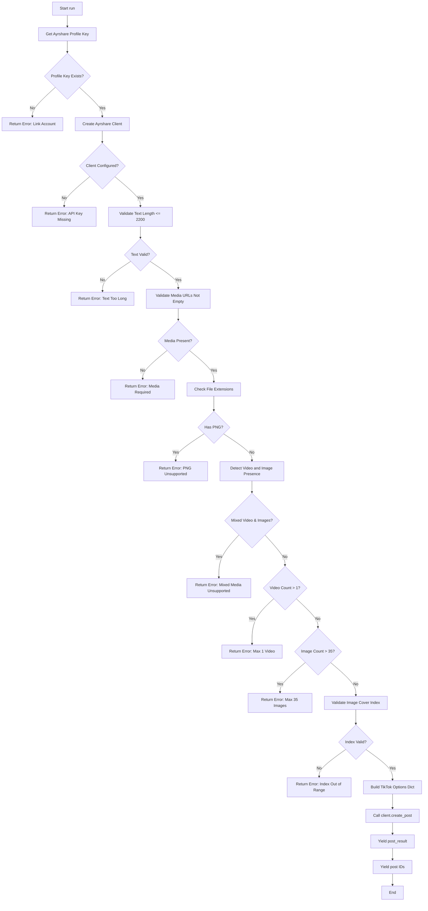
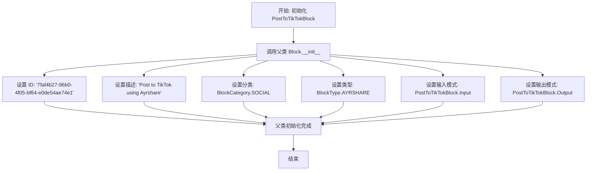
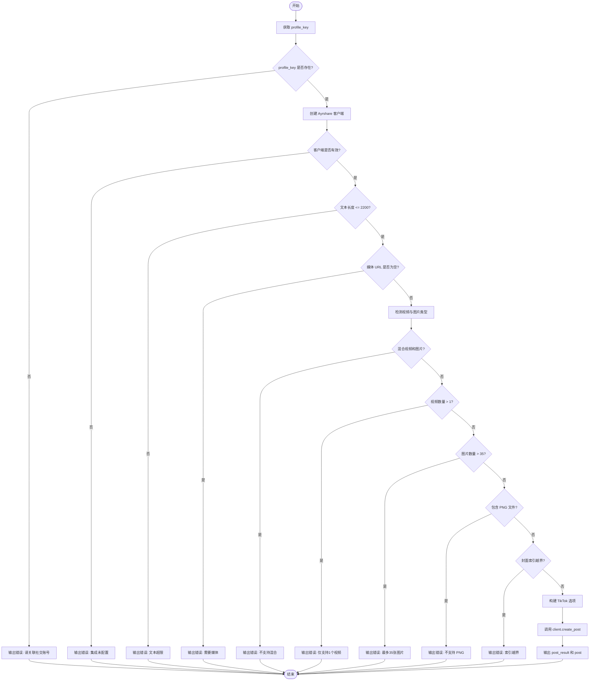

# `AutoGPT\autogpt_platform\backend\backend\blocks\ayrshare\post_to_tiktok.py` 详细设计文档

The code defines a `PostToTikTokBlock` class that integrates with the Ayrshare API to post content to TikTok. It handles TikTok-specific input validation (such as media constraints, character limits, and file types), constructs platform-specific posting options (like visibility, music, and AI labeling), and asynchronously executes the posting workflow with comprehensive error handling.

## 整体流程



## 类结构

```
TikTokVisibility (Enum)
PostToTikTokBlock (Block)
├── Input (BaseAyrshareInput)
└── Output (BlockSchemaOutput)
```

## 全局变量及字段


### `PUBLIC`
    
Represents a public visibility setting for a TikTok post.

类型：`TikTokVisibility`
    


### `PRIVATE`
    
Represents a private visibility setting for a TikTok post.

类型：`TikTokVisibility`
    


### `FOLLOWERS`
    
Represents a followers-only visibility setting for a TikTok post.

类型：`TikTokVisibility`
    


### `PostToTikTokBlock.Input`
    
Input schema for TikTok posts.

类型：`BaseAyrshareInput`
    


### `PostToTikTokBlock.Output`
    
Output schema for TikTok post results.

类型：`BlockSchemaOutput`
    


### `PostToTikTokBlock.Input.post`
    
The post text (max 2,200 chars, empty string allowed). Use @handle to mention users. Line breaks will be ignored.

类型：`str`
    


### `PostToTikTokBlock.Input.media_urls`
    
Required media URLs. Either 1 video OR up to 35 images (JPG/JPEG/WEBP only). Cannot mix video and images.

类型：`list[str]`
    


### `PostToTikTokBlock.Input.auto_add_music`
    
Whether to automatically add recommended music to the post. If you set this field to true, you can change the music later in the TikTok app.

类型：`bool`
    


### `PostToTikTokBlock.Input.disable_comments`
    
Disable comments on the published post

类型：`bool`
    


### `PostToTikTokBlock.Input.disable_duet`
    
Disable duets on published video (video only)

类型：`bool`
    


### `PostToTikTokBlock.Input.disable_stitch`
    
Disable stitch on published video (video only)

类型：`bool`
    


### `PostToTikTokBlock.Input.is_ai_generated`
    
If you enable the toggle, your video will be labeled as “Creator labeled as AI-generated” once posted and can’t be changed. The “Creator labeled as AI-generated” label indicates that the content was completely AI-generated or significantly edited with AI.

类型：`bool`
    


### `PostToTikTokBlock.Input.is_branded_content`
    
Whether to enable the Branded Content toggle. If this field is set to true, the video will be labeled as Branded Content, indicating you are in a paid partnership with a brand. A “Paid partnership” label will be attached to the video.

类型：`bool`
    


### `PostToTikTokBlock.Input.is_brand_organic`
    
Whether to enable the Brand Organic Content toggle. If this field is set to true, the video will be labeled as Brand Organic Content, indicating you are promoting yourself or your own business. A “Promotional content” label will be attached to the video.

类型：`bool`
    


### `PostToTikTokBlock.Input.image_cover_index`
    
Index of image to use as cover (0-based, image posts only)

类型：`int`
    


### `PostToTikTokBlock.Input.title`
    
Title for image posts

类型：`str`
    


### `PostToTikTokBlock.Input.thumbnail_offset`
    
Video thumbnail frame offset in milliseconds (video only)

类型：`int`
    


### `PostToTikTokBlock.Input.visibility`
    
Post visibility: 'public', 'private', 'followers', or 'friends'

类型：`TikTokVisibility`
    


### `PostToTikTokBlock.Input.draft`
    
Create as draft post (video only)

类型：`bool`
    


### `PostToTikTokBlock.Output.post_result`
    
The result of the post

类型：`PostResponse`
    


### `PostToTikTokBlock.Output.post`
    
The result of the post

类型：`PostIds`
    
    

## 全局函数及方法


### `PostToTikTokBlock.__init__`

该方法是 `PostToTikTokBlock` 类的构造函数，负责初始化发布到 TikTok 的功能块。它通过设置唯一的标识符、描述信息、分类、类型以及输入输出模式，将此块注册到系统中。

参数：

-  `self`：`PostToTikTokBlock`，类的实例引用，用于访问当前对象的属性和方法。

返回值：`None`，无返回值。

#### 流程图



#### 带注释源码

```python
def __init__(self):
    # 调用父类 Block 的构造函数以注册块的元数据和架构
    super().__init__(
        # 块的唯一标识符 (UUID)
        id="7faf4b27-96b0-4f05-bf64-e0de54ae74e1",
        # 块的功能描述
        description="Post to TikTok using Ayrshare",
        # 块所属的分类，此处为社交 (SOCIAL)
        categories={BlockCategory.SOCIAL},
        # 块的类型，此处为 AYRSHARE 集成类型
        block_type=BlockType.AYRSHARE,
        # 定义块的输入数据模式，绑定内部类 Input
        input_schema=PostToTikTokBlock.Input,
        # 定义块的输出数据模式，绑定内部类 Output
        output_schema=PostToTikTokBlock.Output,
    )
```


### `PostToTikTokBlock.run`

发布到 TikTok，并进行 TikTok 特定的验证和选项设置。

参数：

-  `input_data`：`PostToTikTokBlock.Input`，包含帖子文本、媒体 URL 和 TikTok 特定选项的输入数据。
-  `user_id`：`str`，用于检索配置文件的密钥的用户 ID。
-  `**kwargs`：`dict`，额外的关键字参数（通常用于传递上下文信息）。

返回值：`BlockOutput`，一个异步生成器，成功时产出 API 响应和帖子 ID，失败时产出错误信息。

#### 流程图



#### 带注释源码

```python
    async def run(
        self, input_data: "PostToTikTokBlock.Input", *, user_id: str, **kwargs
    ) -> BlockOutput:
        """Post to TikTok with TikTok-specific validation and options."""
        # 获取用户的 Ayrshare profile key
        profile_key = await get_profile_key(user_id)
        if not profile_key:
            yield "error", "Please link a social account via Ayrshare"
            return

        # 初始化 Ayrshare 客户端
        client = create_ayrshare_client()
        if not client:
            yield "error", "Ayrshare integration is not configured. Please set up the AYRSHARE_API_KEY."
            return

        # 验证 TikTok 帖子文本长度限制（2200字符）
        if len(input_data.post) > 2200:
            yield "error", f"TikTok post text exceeds 2,200 character limit ({len(input_data.post)} characters)"
            return

        # 验证媒体 URL 是否存在
        if not input_data.media_urls:
            yield "error", "TikTok requires at least one media URL (either 1 video or up to 35 images)"
            return

        # 检查媒体类型：视频 vs 图片
        video_extensions = [".mp4", ".mov", ".avi", ".mkv", ".wmv", ".flv", ".webm"]
        image_extensions = [".jpg", ".jpeg", ".webp"]

        has_video = input_data.is_video or any(
            any(url.lower().endswith(ext) for ext in video_extensions)
            for url in input_data.media_urls
        )

        has_images = any(
            any(url.lower().endswith(ext) for ext in image_extensions)
            for url in input_data.media_urls
        )

        # 验证：不支持混合视频和图片
        if has_video and has_images:
            yield "error", "TikTok does not support mixing video and images in the same post"
            return

        # 验证：仅支持 1 个视频
        if has_video and len(input_data.media_urls) > 1:
            yield "error", "TikTok supports only 1 video per post"
            return

        # 验证：最多支持 35 张图片
        if has_images and len(input_data.media_urls) > 35:
            yield "error", "TikTok supports a maximum of 35 images per post"
            return

        # 验证：图片封面索引必须在有效范围内
        if has_images and input_data.image_cover_index >= len(input_data.media_urls):
            yield "error", f"Image cover index {input_data.image_cover_index} is out of range (max: {len(input_data.media_urls) - 1})"
            return

        # 检查：不支持 PNG 格式
        has_png = any(url.lower().endswith(".png") for url in input_data.media_urls)
        if has_png:
            yield "error", "TikTok does not support PNG files. Please use JPG, JPEG, or WEBP for images."
            return

        # 将日期时间转换为 ISO 格式（如果提供了计划发布时间）
        iso_date = (
            input_data.schedule_date.isoformat() if input_data.schedule_date else None
        )

        # 构建 TikTok 特定选项字典
        tiktok_options = {}

        # 通用选项
        if input_data.auto_add_music and has_images:
            tiktok_options["autoAddMusic"] = True

        if input_data.disable_comments:
            tiktok_options["disableComments"] = True

        if input_data.is_branded_content:
            tiktok_options["isBrandedContent"] = True

        if input_data.is_brand_organic:
            tiktok_options["isBrandOrganic"] = True

        # 视频专用选项
        if has_video:
            if input_data.disable_duet:
                tiktok_options["disableDuet"] = True

            if input_data.disable_stitch:
                tiktok_options["disableStitch"] = True

            if input_data.is_ai_generated:
                tiktok_options["isAIGenerated"] = True

            if input_data.thumbnail_offset > 0:
                tiktok_options["thumbNailOffset"] = input_data.thumbnail_offset

            if input_data.draft:
                tiktok_options["draft"] = True

        # 图片专用选项
        if has_images:
            if input_data.image_cover_index > 0:
                tiktok_options["imageCoverIndex"] = input_data.image_cover_index

            if input_data.title:
                tiktok_options["title"] = input_data.title

            if input_data.visibility != TikTokVisibility.PUBLIC:
                tiktok_options["visibility"] = input_data.visibility.value

        # 调用 Ayrshare 客户端创建帖子
        response = await client.create_post(
            post=input_data.post,
            platforms=[SocialPlatform.TIKTOK],
            media_urls=input_data.media_urls,
            is_video=has_video,
            schedule_date=iso_date,
            disable_comments=input_data.disable_comments,
            shorten_links=input_data.shorten_links,
            unsplash=input_data.unsplash,
            requires_approval=input_data.requires_approval,
            random_post=input_data.random_post,
            random_media_url=input_data.random_media_url,
            notes=input_data.notes,
            tiktok_options=tiktok_options if tiktok_options else None,
            profile_key=profile_key.get_secret_value(),
        )
        # 输出结果
        yield "post_result", response
        if response.postIds:
            for p in response.postIds:
                yield "post", p
```


## 关键组件


### TikTok Input Schema
继承自基础输入模式，定义了用于发布到 TikTok 的完整数据结构，包括帖子文本、媒体 URL 以及 TikTok 特定的配置字段（如可见性、草稿模式、禁用评论/合拍/混剪、AI 生成标识等）。

### Media Constraints Validation
位于 `run` 方法中的验证逻辑，用于强制执行 TikTok 的平台限制，包括字符数限制、强制要求媒体、禁止混合视频和图片、数量限制（1个视频或最多35张图片）、不支持 PNG 格式以及封面索引的边界检查。

### TikTok Options Builder
根据输入数据和检测到的媒体类型（视频或图片）动态构建 `tiktok_options` 字典的组件，负责有条件地包含平台特定参数（如视频的缩略图偏移、图片的标题和可见性设置），以确保只发送有效的 API 选项。

### Ayrshare Client Execution
处理与外部服务交互的执行组件，负责检索用户的 Profile Key、初始化 Ayrshare 客户端实例，并将所有经过验证和格式化的数据（包括 TikTok 特定选项）通过异步调用发送到 `create_post` 接口。


## 问题及建议


### 已知问题

-   **硬编码的文件扩展名列表**：`video_extensions` 和 `image_extensions` 列表被硬编码在 `run` 方法内部，如果未来支持的媒体格式增加或修改，需要改动多处代码，维护性较差。
-   **URL 扩展名检测逻辑脆弱**：代码直接使用字符串的 `endswith` 方法检测 URL 后缀。如果 URL 包含查询参数（例如 `http://example.com/image.jpg?token=xyz`），这种检测方式可能会失效，导致错误的媒体类型判断。
-   **输出 Schema 存在冗余**：`Output` 类中同时定义了 `post_result`（包含完整响应）和 `post`（仅包含 ID）。由于 `PostResponse` 对象通常已经包含了 `PostIds` 信息，这种设计造成了数据输出的重复，可能会增加下游处理数据的复杂度。
-   **验证逻辑与业务逻辑耦合**：针对 TikTok 的特定验证逻辑（如字符长度、媒体数量限制、格式限制）直接写在 `run` 方法中，导致方法过长且职责不单一，难以复用和测试。

### 优化建议

-   **提取常量和配置**：将字数限制（2200）、最大图片数量（35）以及支持的文件扩展名列表提取为模块级别的常量或配置类，便于统一管理和修改。
-   **利用 Pydantic 模型验证**：将数据合法性校验逻辑（如文本长度、媒体 URL 格式、视频图片互斥逻辑）移至 `Input` 类的 `field_validator` 中。利用 Pydantic 的验证机制在数据进入 `run` 方法前就拦截非法输入，保持业务流程的整洁。
-   **增强 URL 解析健壮性**：在检测文件类型前，使用 `urllib.parse.urlparse` 解析 URL，仅对路径部分（`path`）进行后缀匹配，以正确处理带有查询参数或哈希片段的媒体链接。
-   **抽象媒体类型检测逻辑**：将判断媒体是视频还是图片、以及检查扩展名的逻辑提取到 `_util.py` 或独立的工具函数中。如果其他社交媒体块（如 Instagram）有类似需求，可直接复用该逻辑。
-   **简化条件判断构建选项字典**：构建 `tiktok_options` 的部分使用了多层嵌套的 `if` 语句。可以通过构建一个配置映射或在 Schema 中排除空值的方式，使代码更加扁平化和易读。


## 其它


### 设计目标与约束

**设计目标**：
该模块旨在提供一个可复用的 Block 组件，用于通过 Ayrshare 集成将内容发布到 TikTok。设计目标是封装 TikTok API 的复杂性，为上层应用提供清晰的输入输出接口，并支持 TikTok 特有的高级功能（如品牌内容标签、AI 生成标签、草稿模式等）。

**设计约束**：
1.  **业务规则约束**：必须遵守 TikTok 的发布限制。
    *   文本长度：不得超过 2,200 个字符。
    *   媒体类型：视频（最多 1 个）和图片（最多 35 个）不能混发。
    *   图片格式：仅支持 JPG、JPEG、WEBP，不支持 PNG。
    *   视频格式：支持 .mp4, .mov, .avi 等常见视频格式。
2.  **技术约束**：
    *   组件必须继承自 `Block` 基类。
    *   执行逻辑必须为异步 (`async def run`)。
    *   错误处理必须通过 `yield "error", message` 机制进行，而不是抛出异常。
    *   必须依赖 Ayrshare 客户端进行实际的网络请求操作。

### 错误处理与异常设计

**处理策略**：
采用“前置验证”策略，在调用外部 API 之前对所有业务规则和输入参数进行严格校验。一旦发现错误，立即通过生成器返回错误信息并终止执行，避免无效的网络请求。

**错误场景与处理机制**：
1.  **配置与鉴权错误**：
    *   若 `get_profile_key` 返回空，产出错误："Please link a social account via Ayrshare"。
    *   若 `create_ayrshare_client` 失败，产出错误："Ayrshare integration is not configured..."。
2.  **内容校验错误**：
    *   文本超长：计算字符数并产出具体错误信息。
    *   缺少媒体：检查 `media_urls` 列表是否为空。
    *   媒体混用：检测 URL 后缀，判断是否同时包含视频和图片扩展名。
    *   数量超限：视频数量 >1 或图片数量 >35。
    *   格式不支持：检测到 `.png` 后缀时报错。
    *   索引越界：检查 `image_cover_index` 是否大于图片列表长度。
3.  **异常传递**：
    *   代码中不使用 `try-except` 捕获底层网络或系统异常（假设由框架层或 Ayrshare 客户端处理），仅处理业务逻辑层面的校验错误。

### 数据流与状态机

**数据流**：
1.  **输入阶段**：接收 `PostToTikTokBlock.Input` 数据结构，包含帖子文本、媒体链接及各种布尔开关。
2.  **预处理阶段**：
    *   获取用户的 Profile Key（用于鉴权）。
    *   初始化 Ayrshare 客户端。
    *   将输入的 `datetime` 对象转换为 ISO 格式字符串。
3.  **验证阶段**：执行上述“错误处理”部分定义的一系列逻辑检查。
4.  **转换阶段**：将输入的 Python 对象字段映射为 Ayrshare API 所需的字典结构 (`tiktok_options`)，根据是视频还是图片动态添加特定字段（如视频才加 `disableDuet`，图片才加 `title`）。
5.  **执行阶段**：调用 `client.create_post` 发送异步请求。
6.  **输出阶段**：遍历响应对象，依次产出 `post_result` 和具体的 `post` ID。

**状态机**：
该 Block 是无状态的，但其 `run` 方法的执行生命周期可视为以下状态转换：
*   **Idle**：等待调用。
*   **Authenticating**：获取 Profile Key 和 Client。
*   **Validating**：检查输入数据合法性（若失败 -> Terminated）。
*   **Transforming**：构造 API 参数。
*   **Posting**：等待 API 响应。
*   **Completed**：返回结果或错误。

### 外部依赖与接口契约

**外部依赖**：
1.  `backend.integrations.ayrshare`：依赖 `PostIds`, `PostResponse`, `SocialPlatform` 等数据传输对象（DTO）和枚举。
2.  `backend.sdk`：依赖核心框架类 `Block`, `BlockOutput`, `SchemaField` 等，用于实现组件化架构。
3.  `._util`：依赖工具函数 `get_profile_key`（获取用户令牌）和 `create_ayrshare_client`（获取 API 客户端实例）。

**接口契约**：
*   **Input 契约 (`PostToTikTokBlock.Input`)**：
    *   `post`: string，必填，TikTok 帖子文本。
    *   `media_urls`: list[str]，必填，媒体资源地址列表。
    *   `tiktok_options`: 隐式契约，由 Input 类中的多个字段（如 `auto_add_music`, `visibility`）映射而来，用于控制 TikTok 特定行为。
*   **Output 契约 (`PostToTikTokBlock.Output`)**：
    *   `post_result`: `PostResponse`，包含完整的 API 响应对象。
    *   `post`: `PostIds`，包含发布成功的 ID 列表。
*   **Ayrshare Client 契约**：
    *   必须实现 `create_post` 方法，接受 `platforms` (必须包含 TikTok)、`media_urls`、`tiktok_options` 等参数，并返回一个 awaitable 对象。

    