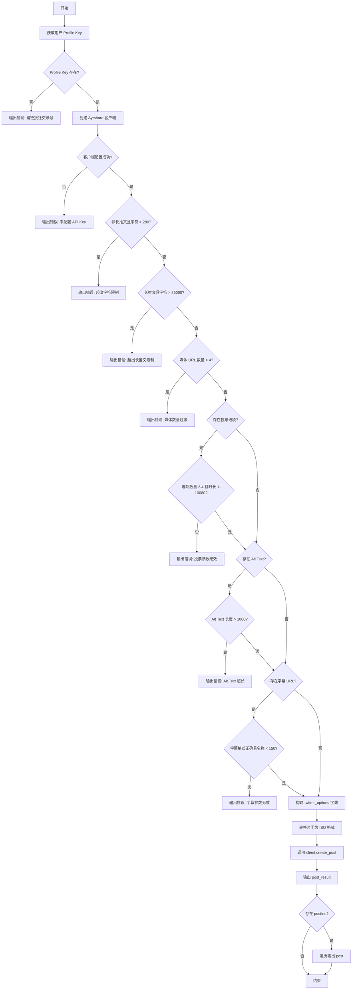
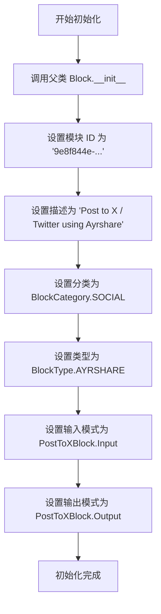
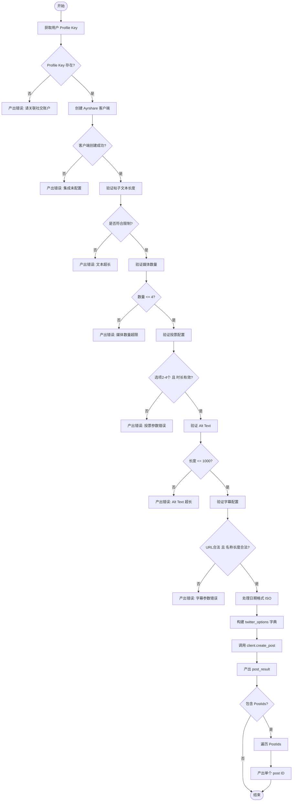

# `AutoGPT\autogpt_platform\backend\backend\blocks\ayrshare\post_to_x.py` 详细设计文档

该代码实现了一个名为 PostToXBlock 的功能块，用于通过 Ayrshare 集成将内容发布到 X (Twitter)。它定义了详细的输入 Schema（包含帖子文本、媒体、回复设置、投票、长推文等选项）和输出 Schema。run 方法负责执行严格的输入验证（如字符限制、媒体数量、投票参数等），构建 X 特定的配置选项，并调用 Ayrshare 客户端执行异步发布操作。

## 整体流程



## 类结构

```
PostToXBlock (Block)
├── Input (BaseAyrshareInput)
│   ├── post (str)
│   ├── media_urls (list[str])
│   ├── reply_to_id (str | None)
│   ├── quote_tweet_id (str | None)
│   ├── poll_options (list[str])
│   ├── poll_duration (int)
│   ├── alt_text (list[str])
│   ├── is_thread (bool)
│   ├── thread_number (bool)
│   ├── thread_media_urls (list[str])
│   ├── long_post (bool)
│   ├── long_video (bool)
│   ├── subtitle_url (str)
│   ├── subtitle_language (str)
│   └── subtitle_name (str)
├── Output (BlockSchemaOutput)
│   ├── post_result (PostResponse)
│   └── post (PostIds)
├── __init__
└── run
```

## 全局变量及字段


### `PostToXBlock.Input`
    
Input schema for X / Twitter posts.

类型：`PostToXBlock.Input`
    


### `PostToXBlock.Output`
    
Output schema for the block.

类型：`PostToXBlock.Output`
    


### `PostToXBlock.Input.post`
    
The post text (max 280 chars, up to 25,000 for Premium users). Use @handle to mention users. Use \n\n for thread breaks.

类型：`str`
    


### `PostToXBlock.Input.media_urls`
    
Optional list of media URLs. X supports up to 4 images or videos per tweet. Auto-preview links unless media is included.

类型：`list[str]`
    


### `PostToXBlock.Input.reply_to_id`
    
ID of the tweet to reply to

类型：`str | None`
    


### `PostToXBlock.Input.quote_tweet_id`
    
ID of the tweet to quote (low-level Tweet ID)

类型：`str | None`
    


### `PostToXBlock.Input.poll_options`
    
Poll options (2-4 choices)

类型：`list[str]`
    


### `PostToXBlock.Input.poll_duration`
    
Poll duration in minutes (1-10080)

类型：`int`
    


### `PostToXBlock.Input.alt_text`
    
Alt text for each image (max 1,000 chars each, not supported for videos)

类型：`list[str]`
    


### `PostToXBlock.Input.is_thread`
    
Whether to automatically break post into thread based on line breaks

类型：`bool`
    


### `PostToXBlock.Input.thread_number`
    
Add thread numbers (1/n format) to each thread post

类型：`bool`
    


### `PostToXBlock.Input.thread_media_urls`
    
Media URLs for thread posts (one per thread, use 'null' to skip)

类型：`list[str]`
    


### `PostToXBlock.Input.long_post`
    
Force long form post (requires Premium X account)

类型：`bool`
    


### `PostToXBlock.Input.long_video`
    
Enable long video upload (requires approval and Business/Enterprise plan)

类型：`bool`
    


### `PostToXBlock.Input.subtitle_url`
    
URL to SRT subtitle file for videos (must be HTTPS and end in .srt)

类型：`str`
    


### `PostToXBlock.Input.subtitle_language`
    
Language code for subtitles (default: 'en')

类型：`str`
    


### `PostToXBlock.Input.subtitle_name`
    
Name of caption track (max 150 chars, default: 'English')

类型：`str`
    


### `PostToXBlock.Output.post_result`
    
The result of the post

类型：`PostResponse`
    


### `PostToXBlock.Output.post`
    
The result of the post

类型：`PostIds`
    
    

## 全局函数及方法


### `PostToXBlock.__init__`

该方法用于初始化 `PostToXBlock` 类实例。它通过调用父类 `Block` 的构造函数，配置模块的元数据，包括唯一标识符、功能描述、所属分类、模块类型以及输入输出数据的结构定义。

参数：

- `self`：`PostToXBlock`，表示类实例本身。

返回值：`None`，该方法是类的构造函数，不返回任何值。

#### 流程图



#### 带注释源码

```python
def __init__(self):
    # 调用父类 Block 的构造函数，传入定义好的模块元数据
    super().__init__(
        # 模块的唯一标识符 (UUID)
        id="9e8f844e-b4a5-4b25-80f2-9e1dd7d67625",
        # 模块的功能描述，说明这是一个通过 Ayrshare 发布到 X/Twitter 的模块
        description="Post to X / Twitter using Ayrshare",
        # 模块所属的分类，此处归为社交媒体 (SOCIAL) 类
        categories={BlockCategory.SOCIAL},
        # 模块的特定类型，标识为 Ayrshare 集成类型
        block_type=BlockType.AYRSHARE,
        # 定义模块的输入数据结构，使用内部类 Input
        input_schema=PostToXBlock.Input,
        # 定义模块的输出数据结构，使用内部类 Output
        output_schema=PostToXBlock.Output,
    )
```


### `PostToXBlock.run`

该方法是 `PostToXBlock` 类的核心执行逻辑，负责接收输入数据，进行X（Twitter）平台特定的参数校验，构建符合 Ayrshare API 要求的请求负载，并最终调用客户端发布社交媒体帖子。

参数：

-  `input_data`：`PostToXBlock.Input`，包含帖子文本、媒体链接、发布设置及X平台特有选项（如引用、投票、长文等）的输入数据对象。
-  `user_id`：`str`，当前操作用户的唯一标识，用于查找关联的社交媒体账户配置。
-  `**kwargs`：`dict`，接收任意额外的关键字参数（当前未使用，预留扩展）。

返回值：`BlockOutput`，异步生成器类型，产出包含操作状态或结果的元组。通常产出格式为 `(key, value)`，如 `("post_result", response)` 或 `("post", post_id)`，在出错时产出 `("error", message)`。

#### 流程图



#### 带注释源码

```python
async def run(
    self,
    input_data: "PostToXBlock.Input",
    *,
    user_id: str,
    **kwargs,
) -> BlockOutput:
    """Post to X / Twitter with enhanced X-specific options."""
    # 1. 获取用户的 Profile Key，用于授权具体的社交媒体账户
    profile_key = await get_profile_key(user_id)
    if not profile_key:
        yield "error", "Please link a social account via Ayrshare"
        return

    # 2. 初始化 Ayrshare 客户端
    client = create_ayrshare_client()
    if not client:
        yield "error", "Ayrshare integration is not configured. Please set up the AYRSHARE_API_KEY."
        return

    # 3. 验证 X 平台的内容限制
    
    # 验证普通推文和长推文的字符限制
    if not input_data.long_post and len(input_data.post) > 280:
        yield "error", f"X post text exceeds 280 character limit ({len(input_data.post)} characters). Enable 'long_post' for Premium accounts."
        return

    if input_data.long_post and len(input_data.post) > 25000:
        yield "error", f"X long post text exceeds 25,000 character limit ({len(input_data.post)} characters)"
        return

    # 验证媒体数量限制（最多4个）
    if len(input_data.media_urls) > 4:
        yield "error", "X supports a maximum of 4 images or videos per tweet"
        return

    # 验证投票设置：选项数量和持续时间
    if input_data.poll_options:
        if len(input_data.poll_options) < 2 or len(input_data.poll_options) > 4:
            yield "error", "X polls require 2-4 options"
            return

        if input_data.poll_duration < 1 or input_data.poll_duration > 10080:
            yield "error", "X poll duration must be between 1 and 10,080 minutes (7 days)"
            return

    # 验证图片 Alt Text 长度限制
    if input_data.alt_text:
        for i, alt in enumerate(input_data.alt_text):
            if len(alt) > 1000:
                yield "error", f"X alt text {i+1} exceeds 1,000 character limit ({len(alt)} characters)"
                return

    # 验证字幕设置：URL 格式和名称长度
    if input_data.subtitle_url:
        if not input_data.subtitle_url.startswith(
            "https://"
        ) or not input_data.subtitle_url.endswith(".srt"):
            yield "error", "Subtitle URL must start with https:// and end with .srt"
            return

        if len(input_data.subtitle_name) > 150:
            yield "error", f"Subtitle name exceeds 150 character limit ({len(input_data.subtitle_name)} characters)"
            return

    # 4. 数据预处理
    # 如果提供了计划发布时间，将其转换为 ISO 格式字符串
    iso_date = (
        input_data.schedule_date.isoformat() if input_data.schedule_date else None
    )

    # 5. 构建 X 平台特有的 API 选项字典
    twitter_options = {}

    # 基础交互选项（回复、引用）
    if input_data.reply_to_id:
        twitter_options["replyToId"] = input_data.reply_to_id

    if input_data.quote_tweet_id:
        twitter_options["quoteTweetId"] = input_data.quote_tweet_id

    # 长内容选项
    if input_data.long_post:
        twitter_options["longPost"] = True

    if input_data.long_video:
        twitter_options["longVideo"] = True

    # 投票配置
    if input_data.poll_options:
        twitter_options["poll"] = {
            "duration": input_data.poll_duration,
            "options": input_data.poll_options,
        }

    # Alt Text 配置
    if input_data.alt_text:
        twitter_options["altText"] = input_data.alt_text

    # 话题/线程 配置
    if input_data.is_thread:
        twitter_options["thread"] = True

        if input_data.thread_number:
            twitter_options["threadNumber"] = True

        if input_data.thread_media_urls:
            twitter_options["mediaUrls"] = input_data.thread_media_urls

    # 视频字幕配置
    if input_data.subtitle_url:
        twitter_options["subTitleUrl"] = input_data.subtitle_url
        twitter_options["subTitleLanguage"] = input_data.subtitle_language
        twitter_options["subTitleName"] = input_data.subtitle_name

    # 6. 调用 Ayrshare 客户端发送请求
    response = await client.create_post(
        post=input_data.post,
        platforms=[SocialPlatform.TWITTER],
        media_urls=input_data.media_urls,
        is_video=input_data.is_video,
        schedule_date=iso_date,
        disable_comments=input_data.disable_comments,
        shorten_links=input_data.shorten_links,
        unsplash=input_data.unsplash,
        requires_approval=input_data.requires_approval,
        random_post=input_data.random_post,
        random_media_url=input_data.random_media_url,
        notes=input_data.notes,
        twitter_options=twitter_options if twitter_options else None,
        profile_key=profile_key.get_secret_value(),
    )
    
    # 7. 产出结果
    # 首先产出完整的响应对象
    yield "post_result", response
    
    # 如果响应中包含 PostIds，逐个产出，方便下游处理
    if response.postIds:
        for p in response.postIds:
            yield "post", p
```


## 关键组件


### PostToXBlock.Input Schema
定义用于发布到 X/Twitter 的输入数据结构，包括推文内容、媒体链接、回复与引用设置、投票选项、自动分线程功能及视频字幕配置。

### Constraint Validation Logic
在执行发布前，对输入数据进行特定于 X 平台的约束校验，包括字符长度限制（普通推文280字与长推文25000字）、媒体数量上限（4个）、投票选项数量与时长、以及字幕 URL 合法性。

### Twitter Options Mapper
负责将经过验证的高级输入字段（如投票、线程、字幕等）转换并构建为符合 Ayrshare API 要求的 `twitter_options` 字典结构。

### Ayrshare Client Integration
处理与 Ayrshare 服务的集成，包括客户端初始化、获取用户 Profile Key 以及异步调用 `create_post` 接口将数据最终发布到社交平台。


## 问题及建议


### 已知问题

-   **业务逻辑与校验逻辑耦合**：`run` 方法中包含大量硬编码的过程式校验逻辑（如字符长度限制、URL格式检查），使得主业务流程臃肿，且违反了单一职责原则。
-   **魔法数字泛滥**：代码中直接使用了大量硬编码的数字（如 280, 25000, 4, 1000 等），缺乏语义化的常量定义，降低了代码的可读性，且当 API 限制变更时修改成本较高。
-   **缺乏 API 调用的异常处理**：在调用 `client.create_post` 时未包含显式的 `try-except` 块，无法捕获网络异常、超时或 Ayrshare API 返回的 4xx/5xx 错误，可能导致 Block 运行时崩溃或产生未捕获的异常。
-   **媒体参数传递的潜在歧义**：代码既向 `client.create_post` 传递了通用的 `media_urls`，又可能在 `twitter_options` 中传递 `thread_media_urls`，两者之间的关系（是否会冲突或覆盖）在代码中未明确体现，存在逻辑隐患。
-   **输出逻辑的潜在不确定性**：代码末尾通过 `for` 循环对 `response.postIds` 进行多次 `yield "post"`，如果某些情况下返回多个 ID（例如线程发帖），下游消费者可能无法准确处理该流式输出结构。

### 优化建议

-   **引入声明式校验**：建议利用 Pydantic 的 `Field` 参数（如 `max_length`）或 `@field_validator` 装饰器，将字符限制、数量限制等校验规则移至 `Input` 类中，使数据模型自我完备，从而简化 `run` 方法。
-   **提取配置常量**：将 X 平台的各项限制（如 `MAX_TWEET_CHARS = 280`, `MAX_MEDIA_COUNT = 4` 等）提取为类属性或模块级常量，统一管理并提升代码可维护性。
-   **增强异常处理机制**：在 `client.create_post` 调用外层增加异常捕获逻辑，针对 Ayrshare 的特定异常或通用请求异常进行捕获，并转化为标准的 `yield "error", "..."` 格式输出，确保流程健壮性。
-   **使用标准 URL 类型**：对于 `subtitle_url` 等字段，建议使用 Pydantic 的 `HttpUrl` 或 `AnyUrl` 类型进行定义，利用框架内置的强大解析和校验能力，替代手动的字符串 `startswith` 和 `endswith` 检查。
-   **重构选项构建逻辑**：将 `twitter_options` 字典的构建逻辑抽取为一个独立的私有方法（如 `_build_twitter_options`），以减少 `run` 方法的复杂度，并提高代码的可读性与可测试性。


## 其它


### 设计目标与约束

**设计目标：**
1. **功能封装**：封装通过 Ayrshare API 向 X (Twitter) 发布帖子的逻辑，提供一个标准化的 Block 接口。
2. **特性支持**：全面支持 X 平台的高级特性，包括但不限于长推文、推文串、引用回复、投票、媒体上传、视频字幕以及 Alt Text。
3. **输入验证**：在执行 API 调用前，严格验证输入数据是否符合 X 平台的约束条件（如字符数限制、媒体数量、投票选项等），防止无效请求。

**约束条件：**
1. **平台限制**：
   * 普通推文最大字符数为 280 个，Premium 用户可达 25,000 个。
   * 每条推文最多支持 4 个图片或视频 URL。
   * 投票必须包含 2-4 个选项，时长需在 1-10,080 分钟之间。
   * 视频字幕 URL 必须为 HTTPS 且以 `.srt` 结尾。
2. **依赖要求**：
   * 必须正确配置 `AYRSHARE_API_KEY` 环境变量以初始化客户端。
   * 用户必须通过 Ayrshare 关联社交账号（即 `profile_key` 必须存在）。
3. **运行模式**：该 Block 设计为异步执行 (`async`)，依赖于 Python `asyncio` 运行时环境。

### 错误处理与异常设计

本模块采用**早返回**策略进行错误处理，并不抛出 Python 异常，而是通过生成器 `yield` 特定的错误信息流。

**错误处理机制：**
1. **配置缺失检查**：
   * 在执行前检查 `profile_key` 是否存在，若不存在则 `yield "error", "Please link a social account via Ayrshare"` 并终止。
   * 检查 Ayrshare 客户端是否成功创建，若失败则 `yield "error", "Ayrshare integration is not configured..."` 并终止。

2. **业务逻辑验证**：
   * **文本长度验证**：根据 `long_post` 标志检查文本长度是否超过 280 或 25,000 字符限制。
   * **媒体数量验证**：检查 `media_urls` 数量是否超过 4 个。
   * **投票参数验证**：检查 `poll_options` 数量是否为 2-4 个，`poll_duration` 是否在有效范围内。
   * **辅助文本验证**：遍历 `alt_text` 列表，确保每项不超过 1000 字符。
   * **字幕配置验证**：验证字幕 URL 的协议（HTTPS）和后缀（.srt），以及字幕名称长度。

3. **错误输出格式**：所有错误均通过 `yield "error", "<error_message_string>"` 的形式输出，确保调用方能够统一捕获并展示给用户。

### 数据流与状态机

**数据流：**
1. **输入阶段**：接收 `input_data` (PostToXBlock.Input) 和 `user_id`。
2. **预处理与状态获取**：
   * 调用 `get_profile_key(user_id)` 获取用户配置状态。
   * 调用 `create_ayrshare_client()` 获取 API 客户端状态。
3. **验证阶段**：静态分析 `input_data` 各字段，若违反约束则中断数据流向错误输出。
4. **数据转换阶段**：
   * 将 `schedule_date` 转换为 ISO 格式字符串。
   * 将分散的 X 特定字段（如 `reply_to_id`, `poll_options` 等）聚合构建为 `twitter_options` 字典。
5. **交互阶段**：将转换后的数据和选项传递给 `client.create_post`，发起网络请求。
6. **输出阶段**：接收 `PostResponse` 对象，解析其中的 `postIds`，依次 `yield` `post_result` 和 `post`。

**状态说明：**
该 Block 是无状态的，每次调用 (`run`) 都是独立的执行实例。内部不存在持久化的状态机，但在单次执行流程中，数据流是单向且不可逆的（输入 -> 验证 -> 转换 -> 输出）。

### 外部依赖与接口契约

**外部依赖：**
1. **`backend.integrations.ayrshare`**：
   * **`SocialPlatform`**：枚举类型，指定发布平台为 `TWITTER`。
   * **`PostResponse` / `PostIds`**：数据传输对象 (DTO)，用于承载 API 返回结果。
2. **`backend.sdk`**：
   * **`Block`, `BlockOutput`, `BlockSchemaOutput`**：基类和类型别名，定义组件的骨架和产出类型。
   * **`SchemaField`**：用于声明和校验输入输出字段的元数据。
3. **`._util`**：
   * **`get_profile_key`**：异步函数，输入 `user_id`，返回用户的密钥配置或 `None`。
   * **`create_ayrshare_client`**：工厂函数，返回配置好的 Ayrshare API 客户端实例。

**接口契约：**
1. **输入契约 (`Input` Class)**：
   * 必须包含 `post` (文本) 字段。
   * 可选字段包括媒体列表、回复 ID、投票配置等，所有字段均受 `SchemaField` 约束。
2. **输出契约 (`Output` Class)**：
   * 成功时产出 `post_result`：类型为 `PostResponse`，包含完整的 API 响应。
   * 成功时产出 `post`：类型为 `PostIds`，包含生成的帖子 ID 列表。
   * 失败时产出 `error`：类型为 `str`，描述具体的验证或配置错误。
3. **API 交互契约**：
   * 调用 `client.create_post` 时需确保传入 `platforms=[SocialPlatform.TWITTER]` 及构建正确的 `twitter_options` 映射。

    