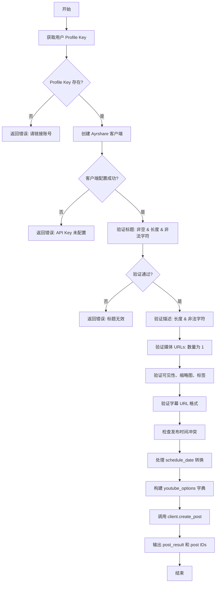
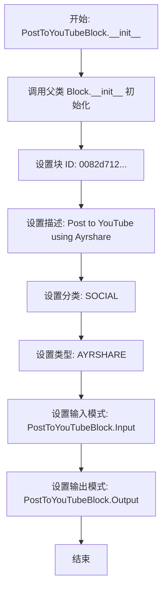
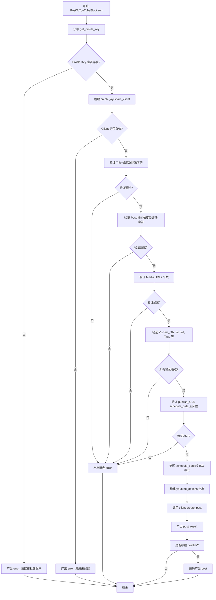

# `AutoGPT\autogpt_platform\backend\backend\blocks\ayrshare\post_to_youtube.py` 详细设计文档

该代码定义了一个 PostToYouTubeBlock 类，用于通过 Ayrshare API 将视频发布到 YouTube，包含 YouTube 特定的输入验证（如标题长度、媒体限制、缩略图格式等）、选项构建以及异步执行逻辑。

## 整体流程



## 类结构

```
YouTubeVisibility (Enum)
PostToYouTubeBlock (Block)
├── Input (BaseAyrshareInput)
│   ├── post
│   ├── media_urls
│   ├── title
│   ├── ... (other fields)
├── Output (BlockSchemaOutput)
│   ├── post_result
│   └── post
├── __init__
└── run
```

## 全局变量及字段


### `YouTubeVisibility.PRIVATE`
    
表示视频的私有可见性设置，仅用户自己可见

类型：`YouTubeVisibility`
    


### `YouTubeVisibility.PUBLIC`
    
表示视频的公开可见性设置，所有人可查看

类型：`YouTubeVisibility`
    


### `YouTubeVisibility.UNLISTED`
    
表示视频的不公开可见性设置，拥有链接的人可查看

类型：`YouTubeVisibility`
    
    

## 全局函数及方法


### `PostToYouTubeBlock.__init__`

初始化 `PostToYouTubeBlock` 实例，配置块的唯一标识符、描述、分类、类型以及输入输出架构，以便集成到 Ayrshare YouTube 发布流程中。

参数：

-  `self`：`PostToYouTubeBlock`，表示实例本身。

返回值：`None`，无返回值。

#### 流程图



#### 带注释源码

```python
def __init__(self):
    super().__init__(
        id="0082d712-ff1b-4c3d-8a8d-6c7721883b83",  # 块的唯一标识符
        description="Post to YouTube using Ayrshare",  # 块功能的文本描述
        categories={BlockCategory.SOCIAL},             # 将块归类为社交媒体类别
        block_type=BlockType.AYRSHARE,                  # 指定块类型为 AYRSHARE 集成
        input_schema=PostToYouTubeBlock.Input,         # 定义输入数据的验证和结构模式
        output_schema=PostToYouTubeBlock.Output,       # 定义输出数据的结构模式
    )
```


### `PostToYouTubeBlock.run`

该方法是 `PostToYouTubeBlock` 类的核心执行逻辑，负责处理发布视频到 YouTube 的完整流程。它首先验证用户配置和集成环境，随后对输入的标题、描述、媒体链接、标签及字幕等数据进行严格的合规性校验，确保符合 YouTube 的 API 限制。校验通过后，构建 YouTube 特定的参数字典，调用 Ayrshare 客户端异步发布视频，并最终返回发布结果或错误信息。

参数：

-  `input_data`: `PostToYouTubeBlock.Input`, 包含视频标题、描述、媒体链接及各类 YouTube 特定设置（如可见性、标签、缩略图等）的输入数据对象。
-  `user_id`: `str`, 用于检索用户关联的社交账户配置密钥的标识符。
-  `**kwargs`: `dict`, 其他由调用框架传入的额外关键字参数。

返回值：`BlockOutput`, 异步生成器，产出 `post_result`（包含 API 响应对象）或 `post`（包含发布 ID），以及在验证或执行失败时产出 `error`。

#### 流程图



#### 带注释源码

```python
async def run(
    self,
    input_data: "PostToYouTubeBlock.Input",
    *,
    user_id: str,
    **kwargs,
) -> BlockOutput:
    """Post to YouTube with YouTube-specific validation and options."""

    # 1. 获取用户的 Profile Key，用于验证账户关联
    profile_key = await get_profile_key(user_id)
    if not profile_key:
        yield "error", "Please link a social account via Ayrshare"
        return

    # 2. 初始化 Ayrshare 客户端
    client = create_ayrshare_client()
    if not client:
        yield "error", "Ayrshare integration is not configured. Please set up the AYRSHARE_API_KEY."
        return

    # 3. 验证 YouTube 约束条件
    
    # 检查标题必填及长度限制
    if not input_data.title:
        yield "error", "YouTube requires a video title"
        return

    if len(input_data.title) > 100:
        yield "error", f"YouTube title exceeds 100 character limit ({len(input_data.title)} characters)"
        return

    # 检查描述长度限制
    if len(input_data.post) > 5000:
        yield "error", f"YouTube description exceeds 5,000 character limit ({len(input_data.post)} characters)"
        return

    # 检查非法字符 (< 和 >)
    forbidden_chars = ["<", ">"]
    for char in forbidden_chars:
        if char in input_data.title:
            yield "error", f"YouTube title cannot contain '{char}' character"
            return
        if char in input_data.post:
            yield "error", f"YouTube description cannot contain '{char}' character"
            return

    # 检查媒体 URL（必须有一个且只能有一个视频）
    if not input_data.media_urls:
        yield "error", "YouTube requires exactly one video URL"
        return

    if len(input_data.media_urls) > 1:
        yield "error", "YouTube supports only 1 video per post"
        return

    # 验证可见性选项是否合法
    valid_visibility = ["private", "public", "unlisted"]
    if input_data.visibility not in valid_visibility:
        yield "error", f"YouTube visibility must be one of: {', '.join(valid_visibility)}"
        return

    # 验证缩略图 URL 格式
    if input_data.thumbnail:
        valid_extensions = [".png", ".jpg", ".jpeg"]
        if not any(
            input_data.thumbnail.lower().endswith(ext) for ext in valid_extensions
        ):
            yield "error", "YouTube thumbnail must end in .png, .jpg, or .jpeg"
            return

    # 验证标签长度及单个标签长度
    if input_data.tags:
        total_tag_length = sum(len(tag) for tag in input_data.tags)
        if total_tag_length > 500:
            yield "error", f"YouTube tags total length exceeds 500 characters ({total_tag_length} characters)"
            return

        for tag in input_data.tags:
            if len(tag) < 2:
                yield "error", f"YouTube tag '{tag}' is too short (minimum 2 characters)"
                return

    # 验证字幕 URL 协议及格式
    if input_data.subtitle_url:
        if not input_data.subtitle_url.startswith("https://"):
            yield "error", "YouTube subtitle URL must start with https://"
            return

        valid_subtitle_extensions = [".srt", ".sbv"]
        if not any(
            input_data.subtitle_url.lower().endswith(ext)
            for ext in valid_subtitle_extensions
        ):
            yield "error", "YouTube subtitle URL must end in .srt or .sbv"
            return

    if input_data.subtitle_name and len(input_data.subtitle_name) > 150:
        yield "error", f"YouTube subtitle name exceeds 150 character limit ({len(input_data.subtitle_name)} characters)"
        return

    # 验证发布时间互斥性
    if input_data.publish_at and input_data.schedule_date:
        yield "error", "Cannot use both 'publish_at' and 'schedule_date'. Use 'publish_at' for YouTube-controlled publishing."
        return

    # 处理调度日期格式化
    iso_date = None
    if not input_data.publish_at and input_data.schedule_date:
        iso_date = input_data.schedule_date.isoformat()

    # 4. 构建 YouTube 特定选项字典
    youtube_options: dict[str, Any] = {"title": input_data.title}

    # 基础选项映射
    if input_data.visibility != "private":
        youtube_options["visibility"] = input_data.visibility

    if input_data.thumbnail:
        youtube_options["thumbNail"] = input_data.thumbnail

    if input_data.playlist_id:
        youtube_options["playListId"] = input_data.playlist_id

    if input_data.tags:
        youtube_options["tags"] = input_data.tags

    if input_data.made_for_kids:
        youtube_options["madeForKids"] = True

    if input_data.is_shorts:
        youtube_options["shorts"] = True

    if not input_data.notify_subscribers:
        youtube_options["notifySubscribers"] = False

    if input_data.category_id and input_data.category_id > 0:
        youtube_options["categoryId"] = input_data.category_id

    if input_data.contains_synthetic_media:
        youtube_options["containsSyntheticMedia"] = True

    if input_data.publish_at:
        youtube_options["publishAt"] = input_data.publish_at

    # 国家/地区定向设置
    targeting_dict = {}
    if input_data.targeting_block_countries:
        targeting_dict["block"] = input_data.targeting_block_countries
    if input_data.targeting_allow_countries:
        targeting_dict["allow"] = input_data.targeting_allow_countries

    if targeting_dict:
        youtube_options["targeting"] = targeting_dict

    # 字幕设置
    if input_data.subtitle_url:
        youtube_options["subTitleUrl"] = input_data.subtitle_url
        youtube_options["subTitleLanguage"] = input_data.subtitle_language
        youtube_options["subTitleName"] = input_data.subtitle_name

    # 5. 调用 Ayrshare 客户端创建帖子
    response = await client.create_post(
        post=input_data.post,
        platforms=[SocialPlatform.YOUTUBE],
        media_urls=input_data.media_urls,
        is_video=True,  # YouTube only supports videos
        schedule_date=iso_date,
        disable_comments=input_data.disable_comments,
        shorten_links=input_data.shorten_links,
        unsplash=input_data.unsplash,
        requires_approval=input_data.requires_approval,
        random_post=input_data.random_post,
        random_media_url=input_data.random_media_url,
        notes=input_data.notes,
        youtube_options=youtube_options,
        profile_key=profile_key.get_secret_value(),
    )
    # 6. 产出结果
    yield "post_result", response
    if response.postIds:
        for p in response.postIds:
            yield "post", p
```


## 关键组件


### PostToYouTubeBlock
定义与 YouTube 集成的核心类，封装了块的元数据、输入输出模式定义以及执行逻辑。

### Input Schema
定义输入数据的结构模型，包含视频标题、描述、媒体链接、可见性、缩略图、字幕及目标定位等 YouTube 特定字段的详细约束。

### Output Schema
定义输出数据的结构模型，包含 API 响应结果 (`PostResponse`) 和生成的帖子 ID (`PostIds`)。

### YouTubeVisibility Enum
枚举类型，定义了 YouTube 视频的三种可见性状态：私有、公开和非公开。

### Validation Logic
包含一系列严格的验证规则，用于检查标题和描述的字符限制、禁止字符、媒体数量、缩略图与字幕 URL 格式、标签长度以及调度参数的互斥性。

### YouTube Options Mapping
负责将输入 Schema 中的字段转换为符合 Ayrshare API 要求的 `youtube_options` 字典结构，处理字段映射（如驼峰命名转换）和条件包含逻辑。

### Ayrshare Client Integration
负责集成逻辑，包括获取用户 Profile Key、初始化 Ayrshare 客户端以及调用 `create_post` 方法异步执行视频发布任务。


## 问题及建议


### 已知问题

-   **代码耦合度高**：`run` 方法中包含了大量的参数验证逻辑（如长度检查、字符黑名单检查、URL格式检查等），导致方法体过长，违反了单一职责原则，使得代码难以维护和测试。
-   **硬编码约束**：业务约束（如标题长度 100、描述长度 5000、禁止字符 `< >`、文件后缀 `.png/.jpg` 等）直接硬编码在逻辑中。如果 YouTube API 限制发生变更，需要深入代码逻辑进行修改，增加了维护成本。
-   **类型安全使用不当**：尽管定义了 `YouTubeVisibility` 枚举类型，但在验证时仍然使用了字符串列表 `valid_visibility` 进行比对，未充分利用枚举提供的类型安全和一致性保证。
-   **冗余的手动映射**：构建 `youtube_options` 字典时，手动将 Python 风格的蛇形命名（snake_case）字段（如 `made_for_kids`）转换为 API 需要的驼峰命名（camelCase）或特定键名，这种方式繁琐且容易遗漏或拼写错误。

### 优化建议

-   **引入 Pydantic 验证器**：利用 Pydantic 的 `field_validator` 或 `model_validator` 将验证逻辑（长度限制、格式校验、互斥逻辑如 `publish_at` 与 `schedule_date`）移入 `Input` 类定义中。这样可以在数据进入 `run` 方法前就完成清洗和验证，简化 `run` 方法。
-   **提取配置常量**：将魔法数字（如 100, 5000, 2MB）、文件扩展名列表、错误消息模板提取为类级别的常量或配置文件，便于统一管理和修改。
-   **利用枚举进行验证**：在验证 `visibility` 字段时，直接检查输入值是否属于 `YouTubeVisibility` 枚举的成员，或者让 Pydantic 自动处理枚举转换，消除手动字符串比对。
-   **自动化字段映射**：使用字典推导式或辅助函数处理 `youtube_options` 的构建，特别是针对常见的命名转换（如 `thumbNail`, `playListId`），以减少重复的 `if` 赋值语句。
-   **标准化错误处理**：考虑定义一个统一的验证错误收集机制，而不是在每一步检查中都 `yield "error"`，这样可以一次性返回所有验证错误，提升用户体验（尽管在当前的 Block 流程中可能需要保持即时失败）。


## 其它


### 设计目标与约束

**设计目标**
提供一个标准化、可复用的代码块，用于通过 Ayrshare 第三方集成服务向 YouTube 发布视频内容。该模块旨在抽象底层 API 细节，为上层业务逻辑提供清晰的输入 Schema 和响应结构，同时支持 YouTube 的高级功能（如缩略图、字幕、定向投放等）。

**约束条件**
1.  **内容长度限制**：
    *   视频标题：最多 100 个字符。
    *   视频描述：最多 5,000 个字符。
    *   字幕名称：最多 150 个字符。
    *   标签：每个标签至少 2 个字符，总长度不超过 500 个字符。
2.  **格式限制**：
    *   禁止字符：标题和描述中不能包含 `<` 或 `>` 字符。
    *   媒体限制：每次发布必须且只能包含 1 个视频 URL。
    *   缩略图：必须为 JPEG/PNG 格式，扩展名必须为 `.png`、`.jpg` 或 `.jpeg`。
    *   字幕：必须为 HTTPS 链接，扩展名必须为 `.srt` 或 `.sbv`。
3.  **发布调度冲突**：不能同时使用 `publish_at`（YouTube 控制的发布时间）和 `schedule_date`（Ayrshare 通用调度时间），优先使用 `publish_at`。
4.  **可见性选项**：仅限于 `private`、`public`、`unlisted` 三种。

### 错误处理与异常设计

**处理策略**
采用 "快速失败" 策略，在执行实际的 API 调用前进行严格的前置验证。所有错误均通过生成器 `yield` 以特定格式返回，而非抛出异常，以确保流程控制的一致性。

**错误处理机制**
1.  **配置与权限校验**：
    *   如果 `user_id` 对应的 `profile_key` 不存在，返回错误提示需关联社交账号。
    *   如果 Ayrshare 客户端初始化失败（API Key 未配置），返回配置错误提示。
2.  **数据校验**：
    *   对输入字段进行逐一校验（如长度、格式、必填项）。
    *   一旦发现校验失败，立即 `yield "error", "错误描述"` 并终止函数执行（`return`）。
3.  **特定错误场景**：
    *   标题缺失或超长。
    *   描述超长或包含非法字符。
    *   媒体 URL 数量不为 1。
    *   缩略图或字幕 URL 格式不正确。
    *   标签长度违规。
    *   `publish_at` 与 `schedule_date` 同时存在。

### 外部依赖与接口契约

**外部依赖**
1.  **Ayrshare SDK/Integration**：
    *   依赖 `backend.integrations.ayrshare` 模块中的 `PostIds`, `PostResponse`, `SocialPlatform` 等数据结构。
    *   依赖 `_util` 模块中的 `create_ayrshare_client`（创建客户端）和 `get_profile_key`（获取用户凭证）。
2.  **Backend SDK**：
    *   依赖 `backend.sdk` 中的核心基类 `Block` 以及辅助类 `BlockCategory`, `BlockOutput`, `SchemaField` 等，用于定义 Block 的元数据和 Schema。
3.  **标准库**：`enum` (枚举), `typing` (类型注解)。

**接口契约**
1.  **`get_profile_key(user_id: str)`**：
    *   契约：接收用户 ID，返回包含 API Key 的 SecretString 对象，如果未关联则返回 `None`。
2.  **`create_ayrshare_client()`**：
    *   契约：返回一个可用的 Ayrshare 客户端实例，如果全局配置缺失则返回 `None`。
3.  **`client.create_post(...)`**：
    *   契约：异步方法。接收帖子内容、平台列表（必须包含 `SocialPlatform.YOUTUBE`）、媒体 URLs、以及 YouTube 特定的选项字典（`youtube_options`）。返回 `PostResponse` 对象。

### 数据流与状态机

**数据流**
1.  **输入阶段**：接收 `input_data` (PostToYouTubeBlock.Input 实例) 和 `user_id`。
2.  **凭证解析阶段**：调用 `get_profile_key` 将 `user_id` 转换为 Ayrshare API 所需的 `profile_key`。
3.  **清洗与转换阶段**：
    *   遍历并验证 `input_data` 的字段。
    *   将 Python 风格的字段名（snake_case，如 `targeting_block_countries`）映射并转换为 Ayrshare API 要求的字典结构（部分需转换为 camelCase，如 `thumbNail`）。
    *   构造 `youtube_options` 字典，聚合所有 YouTube 特定参数。
4.  **执行阶段**：调用 `client.create_post` 发送请求。
5.  **输出阶段**：
    *   首先输出完整的 `post_result` (PostResponse 对象)。
    *   随后遍历 `response.postIds`，逐个输出 `post` ID。

**状态机**
该 Block 是无状态的。每次 `run` 方法的调用都是独立的，不保留历史执行状态。内部流程主要是一个线性验证与转换的过程：

*   `Start` -> `Check Profile Key` -> (If Fail) -> `End`
*   `Check Profile Key` -> (If Success) -> `Check Client Config` -> (If Fail) -> `End`
*   `Check Client Config` -> (If Success) -> `Validate Inputs` -> (If Fail) -> `End`
*   `Validate Inputs` -> (If Success) -> `Build Options` -> `Call API` -> `Yield Results` -> `End`

### 安全与合规

**敏感数据处理**
*   使用 `.get_secret_value()` 处理 `profile_key`，确保 API Key 在传递过程中作为敏感数据处理。
*   对用户输入进行严格过滤，移除标题和描述中的 `<` 和 `>` 字符，防止潜在的 HTML 注入或脚本注入风险。

**合规性控制**
*   **儿童内容声明**：通过 `made_for_kids` 字段支持 COPPA（儿童在线隐私保护法）合规的内容声明。
*   **合成媒体披露**：通过 `contains_synthetic_media` 字段支持对 AI 生成内容的披露要求，符合平台关于真实性的政策。
*   **地区定向**：提供 `targeting_block_countries` 和 `targeting_allow_countries`，支持内容的地域合规性控制。

    