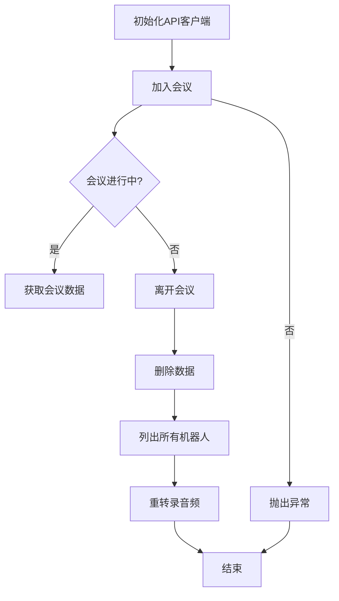
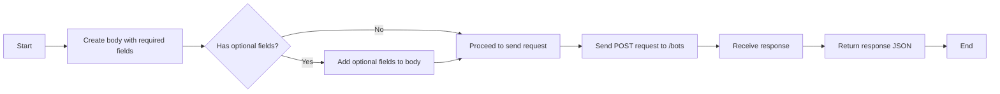
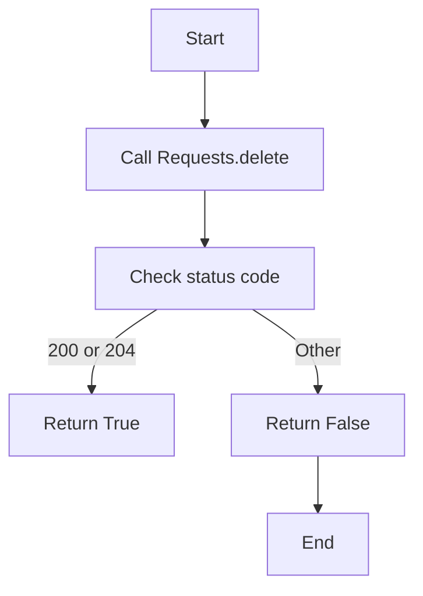
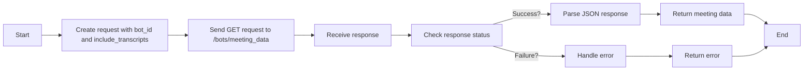
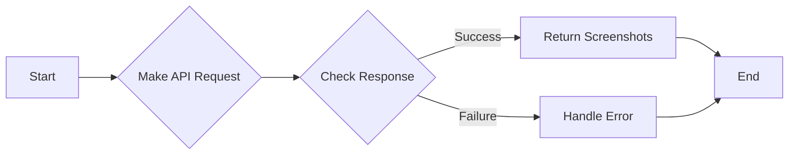
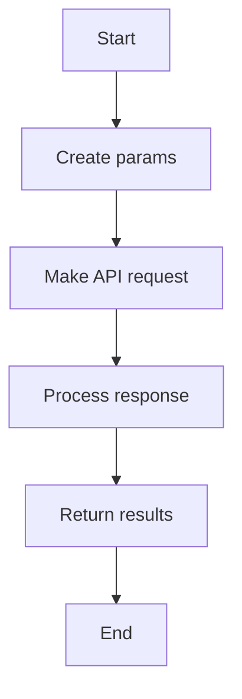

# `.\AutoGPT\autogpt_platform\backend\backend\blocks\baas\_api.py` 详细设计文档

This module provides a client for the Meeting BaaS API, allowing for the management of bots in meetings, including joining, leaving, retranscribing, and retrieving data.

## 整体流程



## 类结构

```
MeetingBaasAPI (API客户端类)
├── join_meeting (加入会议)
│   ├── leave_meeting (离开会议)
│   ├── retranscribe (重转录音频)
│   ├── get_meeting_data (获取会议数据)
│   ├── get_screenshots (获取截图)
│   ├── delete_data (删除数据)
│   └── list_bots_with_metadata (列出所有机器人)
```

## 全局变量及字段


### `BASE_URL`
    
The base URL for the Meeting BaaS API endpoints.

类型：`str`
    


### `api_key`
    
The API key used for authentication with the Meeting BaaS API.

类型：`str`
    


### `headers`
    
The headers used for all API requests to include the API key.

类型：`Dict[str, str]`
    


### `requests`
    
The Requests object used to make HTTP requests to the API endpoints.

类型：`Requests`
    


### `MeetingBaasAPI.api_key`
    
The API key used for authentication with the Meeting BaaS API.

类型：`str`
    


### `MeetingBaasAPI.headers`
    
The headers used for all API requests to include the API key.

类型：`Dict[str, str]`
    


### `MeetingBaasAPI.requests`
    
The Requests object used to make HTTP requests to the API endpoints.

类型：`Requests`
    
    

## 全局函数及方法


### MeetingBaasAPI.join_meeting

Deploy a bot to join and record a meeting.

参数：

- `bot_name`：`str`，The name of the bot to be deployed.
- `meeting_url`：`str`，The URL of the meeting to join.
- `reserved`：`bool`，Optional; indicates if the bot is reserved for a specific meeting.
- `bot_image`：`Optional[str]`，Optional; the image to be displayed for the bot.
- `entry_message`：`Optional[str]`，Optional; the message to be displayed when the bot enters the meeting.
- `start_time`：`Optional[int]`，Optional; the start time of the meeting in Unix timestamp.
- `speech_to_text`：`Optional[Dict[str, Any]]`，Optional; configuration for speech-to-text.
- `webhook_url`：`Optional[str]`，Optional; the webhook URL for notifications.
- `automatic_leave`：`Optional[Dict[str, Any]]`，Optional; configuration for automatic leave.
- `extra`：`Optional[Dict[str, Any]]`，Optional; additional configuration.
- `recording_mode`：`str`，The mode of recording (e.g., "speaker_view").
- `streaming`：`Optional[Dict[str, Any]]`，Optional; configuration for streaming.
- `deduplication_key`：`Optional[str]`，Optional; deduplication key for the meeting.
- `zoom_sdk_id`：`Optional[str]`，Optional; SDK ID for Zoom integration.
- `zoom_sdk_pwd`：`Optional[str]`，Optional; SDK password for Zoom integration.

返回值：`Dict[str, Any]`，The JSON response from the API.

#### 流程图



#### 带注释源码

```python
async def join_meeting(
    self,
    bot_name: str,
    meeting_url: str,
    reserved: bool = False,
    bot_image: Optional[str] = None,
    entry_message: Optional[str] = None,
    start_time: Optional[int] = None,
    speech_to_text: Optional[Dict[str, Any]] = None,
    webhook_url: Optional[str] = None,
    automatic_leave: Optional[Dict[str, Any]] = None,
    extra: Optional[Dict[str, Any]] = None,
    recording_mode: str = "speaker_view",
    streaming: Optional[Dict[str, Any]] = None,
    deduplication_key: Optional[str] = None,
    zoom_sdk_id: Optional[str] = None,
    zoom_sdk_pwd: Optional[str] = None,
) -> Dict[str, Any]:
    """
    Deploy a bot to join and record a meeting.

    POST /bots
    """
    body = {
        "bot_name": bot_name,
        "meeting_url": meeting_url,
        "reserved": reserved,
        "recording_mode": recording_mode,
    }

    # Add optional fields if provided
    if bot_image is not None:
        body["bot_image"] = bot_image
    if entry_message is not None:
        body["entry_message"] = entry_message
    if start_time is not None:
        body["start_time"] = start_time
    if speech_to_text is not None:
        body["speech_to_text"] = speech_to_text
    if webhook_url is not None:
        body["webhook_url"] = webhook_url
    if automatic_leave is not None:
        body["automatic_leave"] = automatic_leave
    if extra is not None:
        body["extra"] = extra
    if streaming is not None:
        body["streaming"] = streaming
    if deduplication_key is not None:
        body["deduplication_key"] = deduplication_key
    if zoom_sdk_id is not None:
        body["zoom_sdk_id"] = zoom_sdk_id
    if zoom_sdk_pwd is not None:
        body["zoom_sdk_pwd"] = zoom_sdk_pwd

    response = await self.requests.post(
        f"{self.BASE_URL}/bots",
        headers=self.headers,
        json=body,
    )
    return response.json()
```


### MeetingBaasAPI.leave_meeting

Remove a bot from an ongoing meeting.

参数：

- `bot_id`：`str`，The unique identifier of the bot to be removed from the meeting.

返回值：`bool`，Indicates whether the bot was successfully removed from the meeting.

#### 流程图



#### 带注释源码

```python
async def leave_meeting(self, bot_id: str) -> bool:
    """
    Remove a bot from an ongoing meeting.

    DELETE /bots/{uuid}
    """
    response = await self.requests.delete(
        f"{self.BASE_URL}/bots/{bot_id}",
        headers=self.headers,
    )
    return response.status in [200, 204]
```


### MeetingBaasAPI.retranscribe

Re-run transcription on a bot's audio.

参数：

- `bot_uuid`：`str`，The unique identifier of the bot.
- `speech_to_text`：`Optional[Dict[str, Any]]`，Optional settings for speech-to-text processing.
- `webhook_url`：`Optional[str]`，Optional webhook URL for notifications.

返回值：`Dict[str, Any]`，A dictionary containing the response from the API.

#### 流程图

```mermaid
graph TD
    A[Start] --> B[Call POST /bots/retranscribe]
    B --> C[Check response status]
    C -->|202| D[Return {"accepted": True}]
    C -->|Other| E[Return API response]
    E --> F[End]
```

#### 带注释源码

```python
async def retranscribe(
    self,
    bot_uuid: str,
    speech_to_text: Optional[Dict[str, Any]] = None,
    webhook_url: Optional[str] = None,
) -> Dict[str, Any]:
    """
    Re-run transcription on a bot's audio.

    POST /bots/retranscribe
    """
    body: Dict[str, Any] = {"bot_uuid": bot_uuid}

    if speech_to_text is not None:
        body["speech_to_text"] = speech_to_text
    if webhook_url is not None:
        body["webhook_url"] = webhook_url

    response = await self.requests.post(
        f"{self.BASE_URL}/bots/retranscribe",
        headers=self.headers,
        json=body,
    )

    if response.status == 202:
        return {"accepted": True}
    return response.json()
```


### MeetingBaasAPI.get_meeting_data

Retrieve meeting data including recording and transcripts.

参数：

- `bot_id`：`str`，The unique identifier for the bot in the meeting.
- `include_transcripts`：`bool`，Optional; whether to include transcripts in the response. Defaults to `True`.

返回值：`Dict[str, Any]`，A dictionary containing the meeting data including recording and transcripts.

#### 流程图



#### 带注释源码

```python
async def get_meeting_data(
    self, bot_id: str, include_transcripts: bool = True
) -> Dict[str, Any]:
    """
    Retrieve meeting data including recording and transcripts.

    GET /bots/meeting_data
    """
    params = {
        "bot_id": bot_id,
        "include_transcripts": str(include_transcripts).lower(),
    }

    response = await self.requests.get(
        f"{self.BASE_URL}/bots/meeting_data",
        headers=self.headers,
        params=params,
    )
    return response.json()
```


### MeetingBaasAPI.get_screenshots

Retrieve screenshots captured during a meeting.

参数：

- `bot_id`：`str`，The unique identifier of the bot that captured the screenshots.

返回值：`List[Dict[str, Any]]`，A list of dictionaries, each representing a screenshot captured during the meeting.

#### 流程图



#### 带注释源码

```python
async def get_screenshots(self, bot_id: str) -> List[Dict[str, Any]]:
    """
    Retrieve screenshots captured during a meeting.

    GET /bots/{uuid}/screenshots
    """
    response = await self.requests.get(
        f"{self.BASE_URL}/bots/{bot_id}/screenshots",
        headers=self.headers,
    )
    result = response.json()
    # Ensure we return a list
    if isinstance(result, list):
        return result
    return []
```


### MeetingBaasAPI.delete_data

Delete a bot's recorded data.

参数：

- `bot_id`：`str`，The unique identifier of the bot whose data is to be deleted.

返回值：`bool`，Indicates whether the deletion was successful.

#### 流程图

```mermaid
graph TD
    A[Start] --> B[Make API request to /bots/{bot_id}/delete_data]
    B --> C[Check response status]
    C -->|Status 200| D[Return True]
    C -->|Status 204| D[Return True]
    C -->|Other status| E[Return False]
    D --> F[End]
    E --> F[End]
```

#### 带注释源码

```python
async def delete_data(self, bot_id: str) -> bool:
    """
    Delete a bot's recorded data.

    POST /bots/{uuid}/delete_data
    """
    response = await self.requests.post(
        f"{self.BASE_URL}/bots/{bot_id}/delete_data",
        headers=self.headers,
    )
    return response.status == 200
```


### MeetingBaasAPI.list_bots_with_metadata

List bots with metadata including IDs, names, and meeting details.

参数：

- `limit`：`Optional[int]`，The maximum number of bots to return.
- `offset`：`Optional[int]`，The offset from the start of the list to return results from.
- `sort_by`：`Optional[str]`，The field to sort the results by.
- `sort_order`：`Optional[str]`，The order to sort the results in, either "asc" or "desc".
- `filter_by`：`Optional[Dict[str, Any]]`，A dictionary of filters to apply to the results.

返回值：`Dict[str, Any]`，A dictionary containing the list of bots with metadata.

#### 流程图



#### 带注释源码

```python
async def list_bots_with_metadata(
    self,
    limit: Optional[int] = None,
    offset: Optional[int] = None,
    sort_by: Optional[str] = None,
    sort_order: Optional[str] = None,
    filter_by: Optional[Dict[str, Any]] = None,
) -> Dict[str, Any]:
    """
    List bots with metadata including IDs, names, and meeting details.

    GET /bots/bots_with_metadata
    """
    params = {}
    if limit is not None:
        params["limit"] = limit
    if offset is not None:
        params["offset"] = offset
    if sort_by is not None:
        params["sort_by"] = sort_by
    if sort_order is not None:
        params["sort_order"] = sort_order
    if filter_by is not None:
        params.update(filter_by)

    response = await self.requests.get(
        f"{self.BASE_URL}/bots/bots_with_metadata",
        headers=self.headers,
        params=params,
    )
    return response.json()
```


## 关键组件


### 张量索引与惰性加载

用于高效地索引和访问大型数据集，同时延迟加载数据以减少内存消耗。

### 反量化支持

提供对反量化操作的支持，允许在量化过程中进行逆量化以恢复原始数据。

### 量化策略

定义了不同的量化策略，用于在模型训练和推理过程中调整模型的精度和性能。


## 问题及建议


### 已知问题

-   **异步编程模型**: 代码使用了异步编程模型，这要求调用者也使用异步编程，这可能会增加代码的复杂性。
-   **参数数量**: `join_meeting` 方法接受大量的参数，这可能导致方法难以使用和维护。
-   **错误处理**: 代码中没有明确的错误处理机制，可能会在遇到网络错误或API错误时导致程序崩溃。
-   **全局变量**: `BASE_URL` 是一个全局变量，这可能会在多线程环境中导致问题。
-   **类型注解**: 代码中使用了类型注解，但没有使用类型检查工具，这可能导致类型错误。

### 优化建议

-   **使用同步包装器**: 对于需要同步调用的场景，可以考虑使用同步包装器来简化调用。
-   **参数分组**: 将 `join_meeting` 方法的参数分组，例如必填参数和可选参数，可以提高方法的可读性和可维护性。
-   **错误处理**: 实现一个错误处理机制，例如使用 try-except 块来捕获和处理异常。
-   **使用配置文件**: 将 `BASE_URL` 放入配置文件中，以便在不同的环境中可以轻松更改。
-   **类型检查**: 使用类型检查工具（如 mypy）来确保类型安全，并提前发现潜在的类型错误。
-   **代码重构**: 考虑将一些重复的代码提取到单独的函数中，以提高代码的可重用性和可维护性。
-   **文档**: 为每个方法提供详细的文档，包括参数描述、返回值描述和示例代码。


## 其它


### 设计目标与约束

- 设计目标：
  - 提供一个统一的接口来访问Meeting BaaS API的所有端点。
  - 确保API调用的一致性和可维护性。
  - 支持异步操作以提高性能。
  - 提供详细的错误处理和异常管理。

- 约束：
  - 必须使用提供的API密钥进行身份验证。
  - API调用必须遵循RESTful架构。
  - 异步操作必须使用`async`和`await`关键字。

### 错误处理与异常设计

- 错误处理：
  - API响应中的错误状态码将被捕获并转换为异常。
  - 自定义异常类将被定义以提供更具体的错误信息。

- 异常设计：
  - `APIException`：用于处理所有API相关的错误。
  - `AuthenticationException`：用于处理身份验证错误。
  - `ResourceNotFoundException`：用于处理资源未找到的错误。

### 数据流与状态机

- 数据流：
  - 用户通过API客户端发起请求。
  - 请求被发送到Meeting BaaS API。
  - API返回响应，客户端处理响应并返回结果。

- 状态机：
  - 无状态设计：API客户端不维护任何状态信息。

### 外部依赖与接口契约

- 外部依赖：
  - `Requests`库：用于发送HTTP请求。
  - `typing`库：用于类型注解。

- 接口契约：
  - API客户端必须遵循Meeting BaaS API的接口规范。
  - API客户端必须处理所有可能的HTTP响应状态码。

### 安全性与认证

- 安全性：
  - API密钥必须安全存储和传输。
  - API调用必须使用HTTPS协议。

- 认证：
  - 使用API密钥进行身份验证。
  - API密钥必须在初始化时提供。

### 性能与可伸缩性

- 性能：
  - 异步操作可以提高API调用的性能。
  - API客户端应优化以减少不必要的网络请求。

- 可伸缩性：
  - API客户端应设计为可扩展的，以支持未来的功能扩展。

### 测试与文档

- 测试：
  - 单元测试和集成测试应覆盖所有API端点。
  - 测试应包括异常情况和边界条件。

- 文档：
  - API客户端的文档应详细说明如何使用每个端点。
  - 文档应包括示例代码和错误代码解释。

### 维护与更新

- 维护：
  - API客户端应定期更新以适应Meeting BaaS API的更改。
  - 维护应包括错误修复和性能改进。

- 更新：
  - API客户端的更新应遵循版本控制。
  - 更新应包括变更日志和迁移指南。


    