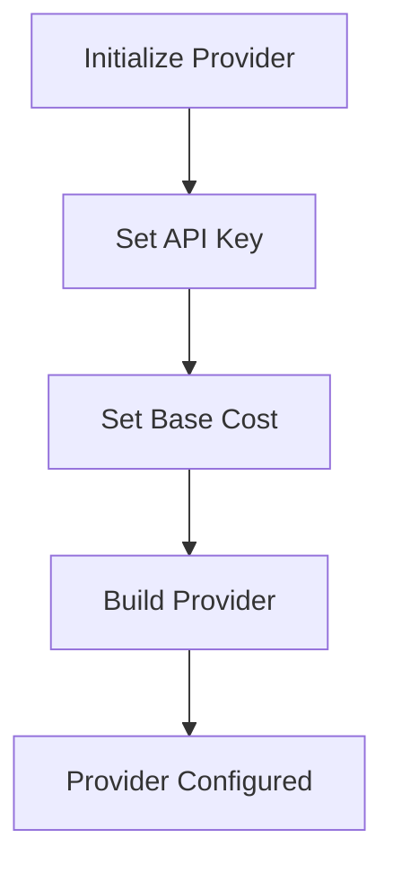
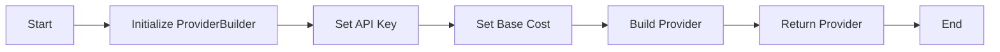

# `.\AutoGPT\autogpt_platform\backend\backend\blocks\baas\_config.py` 详细设计文档

This code configures a Meeting BaaS provider using the SDK pattern, setting up API key authentication and base cost for meeting recording services.

## 整体流程



## 类结构

```
ProviderBuilder (类)
├── baas (实例)
```

## 全局变量及字段


### `baas`
    
The configured Meeting BaaS provider with API key authentication.

类型：`ProviderBuilder`
    


### `BlockCostType`
    
Module containing cost types for Meeting BaaS blocks.

类型：`module`
    


### `ProviderBuilder`
    
Class for building Meeting BaaS providers using the SDK pattern.

类型：`class`
    


### `ProviderBuilder.name`
    
The name of the provider being built.

类型：`str`
    


### `ProviderBuilder.config`
    
The configuration dictionary for the provider.

类型：`dict`
    


### `ProviderBuilder.MEETING_BAAS_API_KEY`
    
The API key for the Meeting BaaS provider.

类型：`str`
    


### `BlockCostType.BlockCostType.RUN`
    
The cost type for the running block in Meeting BaaS.

类型：`str`
    
    

## 全局函数及方法


### ProviderBuilder.with_api_key

This method is used to configure the Meeting BaaS provider with an API key for authentication.

参数：

- `api_key`：`str`，The API key provided by the Meeting BaaS service.
- `description`：`str`，A description of the API key.

返回值：`None`，This method does not return a value; it configures the provider object.

#### 流程图

```mermaid
graph LR
A[Start] --> B[ProviderBuilder("baas")]
B --> C{with_api_key("MEETING_BAAS_API_KEY", "Meeting BaaS API Key")}
C --> D[with_base_cost(5, BlockCostType.RUN)]
D --> E[build()]
E --> F[baas configured]
F --> G[End]
```

#### 带注释源码

```
# Configure the Meeting BaaS provider with API key authentication
baas = (
    ProviderBuilder("baas")
    .with_api_key("MEETING_BAAS_API_KEY", "Meeting BaaS API Key")  # Set the API key for authentication
    .with_base_cost(5, BlockCostType.RUN)  # Higher cost for meeting recording service
    .build()  # Build the provider object with the configured settings
)
``` 


### ProviderBuilder.with_base_cost

This method is used to set the base cost for a specific block within the Meeting BaaS provider.

参数：

- `cost`：`int`，The base cost value for the block.
- `cost_type`：`BlockCostType`，The type of cost associated with the block.

返回值：`None`，This method does not return a value; it configures the base cost internally.

#### 流程图

```mermaid
graph TD
    A[Start] --> B[ProviderBuilder.with_base_cost(cost: int, cost_type: BlockCostType)]
    B --> C[Set base cost internally]
    C --> D[Return to build method]
    D --> E[Build provider]
    E --> F[End]
```

#### 带注释源码

```
from backend.sdk import BlockCostType, ProviderBuilder

# Configure the Meeting BaaS provider with API key authentication
baas = (
    ProviderBuilder("baas")
    .with_api_key("MEETING_BAAS_API_KEY", "Meeting BaaS API Key")
    .with_base_cost(5, BlockCostType.RUN)  # Higher cost for meeting recording service
    .build()
)
```


### ProviderBuilder.build

The `ProviderBuilder.build` method is used to configure and build a Meeting BaaS provider instance with specific settings.

参数：

- `self`：`ProviderBuilder`，The instance of the ProviderBuilder class itself, used to access its methods and properties.
- ...

返回值：`MeetingBaaSProvider`，A configured instance of the MeetingBaaSProvider class representing the Meeting BaaS provider.

#### 流程图



#### 带注释源码

```python
"""
Shared configuration for all Meeting BaaS blocks using the SDK pattern.
"""

from backend.sdk import BlockCostType, ProviderBuilder

# Configure the Meeting BaaS provider with API key authentication
baas = (
    ProviderBuilder("baas")
    .with_api_key("MEETING_BAAS_API_KEY", "Meeting BaaS API Key")
    .with_base_cost(5, BlockCostType.RUN)  # Higher cost for meeting recording service
    .build()
)
```


## 关键组件


### 张量索引与惰性加载

支持对张量的索引操作，并在需要时才加载张量数据，以优化内存使用和性能。

### 反量化支持

提供对反量化操作的支持，允许在量化过程中进行逆量化处理。

### 量化策略

定义了不同的量化策略，用于在模型训练和推理过程中对权重和激活进行量化。


## 问题及建议


### 已知问题

-   {问题1} 缺乏错误处理机制：代码中没有对API密钥或基础费用设置错误进行捕获和处理。
-   {问题2} 缺乏配置验证：代码中没有对API密钥或基础费用参数进行验证，例如检查它们是否为有效的数字。
-   {问题3} 缺乏日志记录：代码中没有记录配置设置的过程，这可能会在调试和问题追踪时造成困难。

### 优化建议

-   {建议1} 实现错误处理：在配置设置过程中添加异常处理，确保在出现错误时能够提供有用的反馈。
-   {建议2} 添加配置验证：在设置API密钥和基础费用之前，验证它们是否为有效的值。
-   {建议3} 添加日志记录：记录配置设置的过程，以便于调试和问题追踪。
-   {建议4} 使用环境变量：将API密钥存储在环境变量中，而不是硬编码在代码中，以提高安全性。
-   {建议5} 提供配置选项：允许用户自定义基础费用，而不是使用默认值。


## 其它


### 设计目标与约束

- 设计目标：
  - 提供统一的配置接口，方便所有使用Meeting BaaS块的SDK进行配置。
  - 确保配置信息的正确性和安全性。
  - 提高代码的可维护性和可扩展性。

- 约束条件：
  - 必须使用API密钥进行认证。
  - 基础费用设置为5，适用于会议录制服务。

### 错误处理与异常设计

- 错误处理：
  - 在配置过程中，如果API密钥无效或配置信息错误，应抛出异常。
  - 异常应提供清晰的错误信息，以便于调试和用户理解。

### 数据流与状态机

- 数据流：
  - 用户通过API密钥和基础费用配置Meeting BaaS提供者。
  - 配置信息通过ProviderBuilder进行封装和构建。

### 外部依赖与接口契约

- 外部依赖：
  - `backend.sdk.BlockCostType`：定义费用类型。
  - `backend.sdk.ProviderBuilder`：用于构建提供者实例。

- 接口契约：
  - `ProviderBuilder`应提供统一的接口来配置提供者。
  - `BlockCostType`应定义所有可能的费用类型，以便于配置。


    