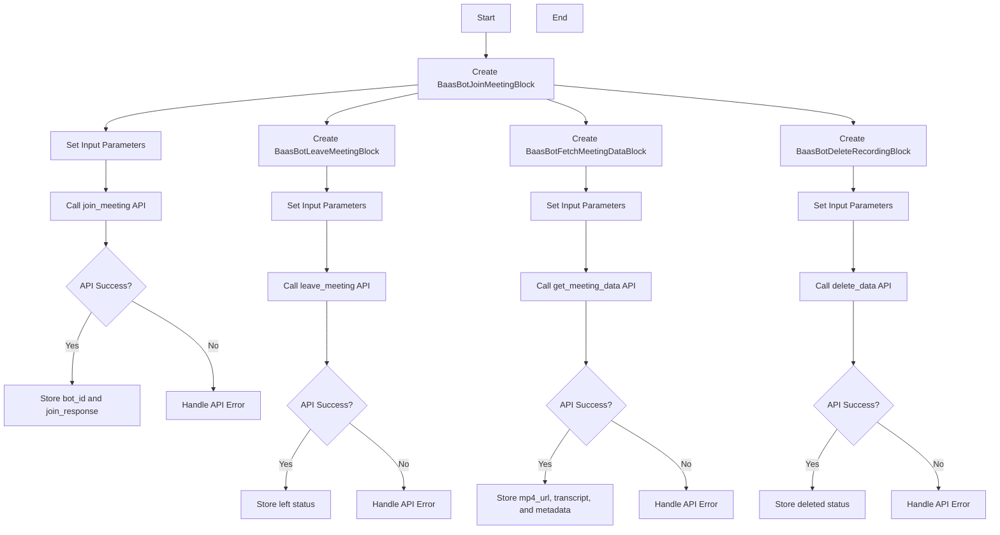
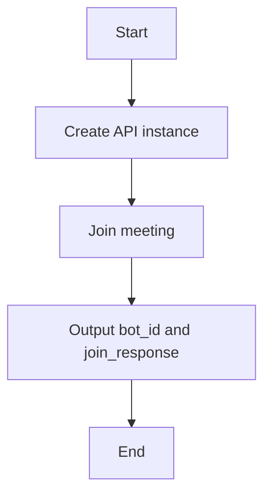
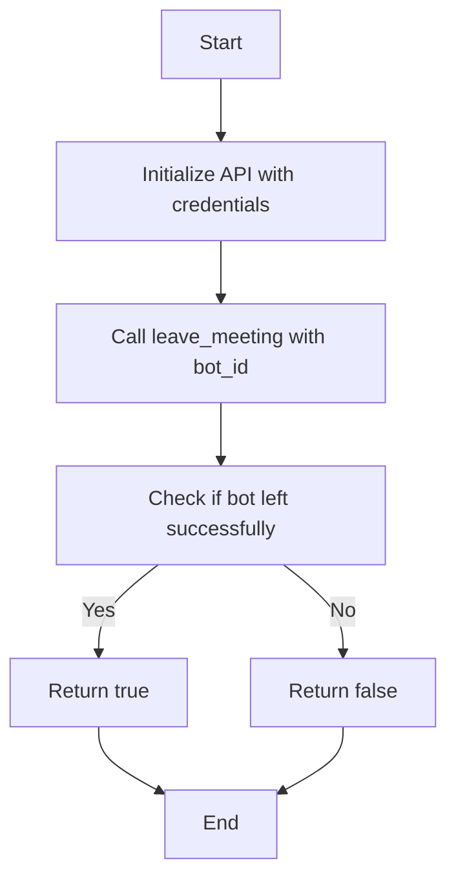
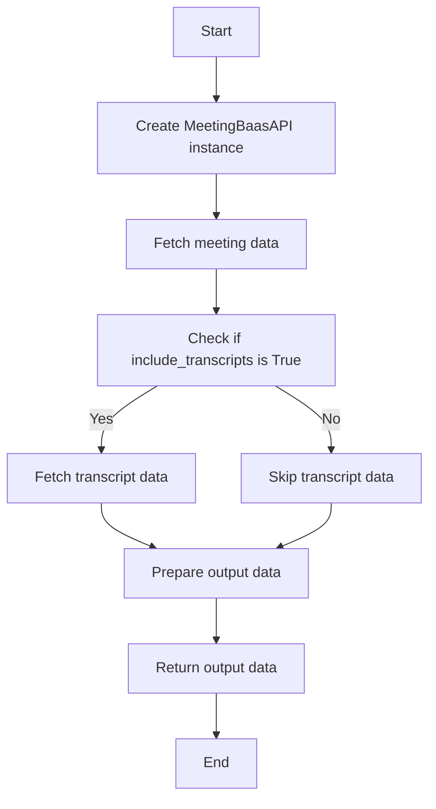
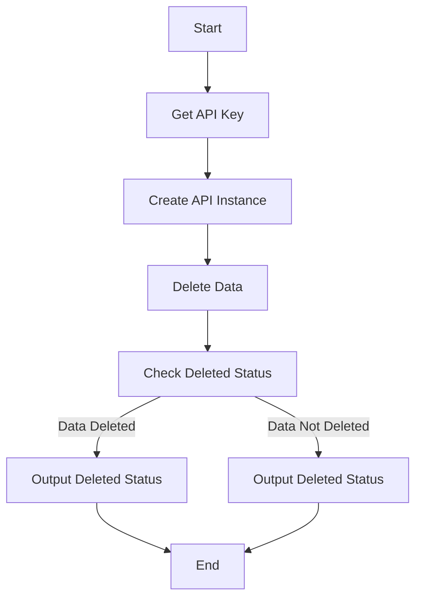

# `.\AutoGPT\autogpt_platform\backend\backend\blocks\baas\bots.py` 详细设计文档

This code defines a set of blocks for a Meeting BaaS bot, including joining meetings, leaving meetings, fetching meeting data, and deleting recorded data.

## 整体流程



## 类结构

```
BaasBotJoinMeetingBlock
├── Input
│   ├── credentials
│   ├── meeting_url
│   ├── bot_name
│   ├── bot_image
│   ├── entry_message
│   ├── reserved
│   ├── start_time
│   ├── webhook_url
│   ├── timeouts
│   └── extra
│   └── Output
│       ├── bot_id
│       └── join_response
BaasBotLeaveMeetingBlock
├── Input
│   ├── credentials
│   └── bot_id
│   └── Output
│       └── left
BaasBotFetchMeetingDataBlock
├── Input
│   ├── credentials
│   └── bot_id
│   └── Output
│       ├── mp4_url
│       └── transcript
│       └── metadata
BaasBotDeleteRecordingBlock
├── Input
│   ├── credentials
│   └── bot_id
│   └── Output
│       └── deleted
```

## 全局变量及字段


### `baas`
    
Configuration object for Meeting BaaS API settings

类型：`BaasConfig`
    


### `BaasBotJoinMeetingBlock.credentials`
    
Meeting BaaS API credentials

类型：`CredentialsMetaInput`
    


### `BaasBotJoinMeetingBlock.meeting_url`
    
The URL of the meeting the bot should join

类型：`str`
    


### `BaasBotJoinMeetingBlock.bot_name`
    
Display name for the bot in the meeting

类型：`str`
    


### `BaasBotJoinMeetingBlock.bot_image`
    
URL to an image for the bot's avatar (16:9 ratio recommended)

类型：`str`
    


### `BaasBotJoinMeetingBlock.entry_message`
    
Chat message the bot will post upon entry

类型：`str`
    


### `BaasBotJoinMeetingBlock.reserved`
    
Use a reserved bot slot (joins 4 min before meeting)

类型：`bool`
    


### `BaasBotJoinMeetingBlock.start_time`
    
Unix timestamp (ms) when bot should join

类型：`Optional[int]`
    


### `BaasBotJoinMeetingBlock.webhook_url`
    
URL to receive webhook events for this bot

类型：`str | None`
    


### `BaasBotJoinMeetingBlock.timeouts`
    
Automatic leave timeouts configuration

类型：`dict`
    


### `BaasBotJoinMeetingBlock.extra`
    
Custom metadata to attach to the bot

类型：`dict`
    


### `BaasBotLeaveMeetingBlock.credentials`
    
Meeting BaaS API credentials

类型：`CredentialsMetaInput`
    


### `BaasBotLeaveMeetingBlock.bot_id`
    
UUID of the bot to remove from meeting

类型：`str`
    


### `BaasBotFetchMeetingDataBlock.credentials`
    
Meeting BaaS API credentials

类型：`CredentialsMetaInput`
    


### `BaasBotFetchMeetingDataBlock.bot_id`
    
UUID of the bot whose data to fetch

类型：`str`
    


### `BaasBotFetchMeetingDataBlock.include_transcripts`
    
Include transcript data in response

类型：`bool`
    


### `BaasBotDeleteRecordingBlock.credentials`
    
Meeting BaaS API credentials

类型：`CredentialsMetaInput`
    


### `BaasBotDeleteRecordingBlock.bot_id`
    
UUID of the bot whose data to delete

类型：`str`
    
    

## 全局函数及方法


### BaasBotJoinMeetingBlock.run

Deploy a bot to join and record a meeting.

参数：

- `input_data`：`Input`，The input data for the block.
- `credentials`：`APIKeyCredentials`，The API credentials for the Meeting BaaS API.
- `**kwargs`：Any additional keyword arguments.

返回值：`BlockOutput`，The output of the block.

#### 流程图



#### 带注释源码

```python
async def run(self, input_data: Input, *, credentials: APIKeyCredentials, **kwargs) -> BlockOutput:
    api_key = credentials.api_key.get_secret_value()
    api = MeetingBaasAPI(api_key)

    # Call API with all parameters
    data = await api.join_meeting(
        bot_name=input_data.bot_name,
        meeting_url=input_data.meeting_url,
        reserved=input_data.reserved,
        bot_image=input_data.bot_image if input_data.bot_image else None,
        entry_message=(
            input_data.entry_message if input_data.entry_message else None
        ),
        start_time=input_data.start_time,
        speech_to_text={"provider": "Default"},
        webhook_url=input_data.webhook_url if input_data.webhook_url else None,
        automatic_leave=input_data.timeouts if input_data.timeouts else None,
        extra=input_data.extra if input_data.extra else None,
    )

    yield "bot_id", data.get("bot_id", "")
    yield "join_response", data
```


### BaasBotLeaveMeetingBlock.run

This function is responsible for forcing the bot to exit the call.

参数：

- `input_data`：`Input`，The input data for the block, containing the bot's credentials and the bot ID to remove from the meeting.
- `credentials`：`APIKeyCredentials`，The credentials used to authenticate with the Meeting BaaS API.
- `**kwargs`：`Any`，Additional keyword arguments that may be passed to the function.

返回值：`BlockOutput`，The output of the block, indicating whether the bot successfully left the meeting.

#### 流程图



#### 带注释源码

```python
async def run(self, input_data: Input, *, credentials: APIKeyCredentials, **kwargs) -> BlockOutput:
    api_key = credentials.api_key.get_secret_value()
    api = MeetingBaasAPI(api_key)

    # Leave meeting
    left = await api.leave_meeting(input_data.bot_id)

    yield "left", left
```


### BaasBotFetchMeetingDataBlock.run

Retrieve recorded meeting data.

参数：

- `input_data`：`Input`，The input data for the block.
- `credentials`：`APIKeyCredentials`，The API credentials for the Meeting BaaS API.
- `**kwargs``：`Any additional keyword arguments`，Additional keyword arguments that may be passed to the function.

返回值：`BlockOutput`，The output data from the block.

#### 流程图



#### 带注释源码

```python
async def run(self, input_data: Input, *, credentials: APIKeyCredentials, **kwargs) -> BlockOutput:
    api_key = credentials.api_key.get_secret_value()
    api = MeetingBaasAPI(api_key)

    # Fetch meeting data
    data = await api.get_meeting_data(
        bot_id=input_data.bot_id,
        include_transcripts=input_data.include_transcripts,
    )

    yield "mp4_url", data.get("mp4", "")
    yield "transcript", data.get("bot_data", {}).get("transcripts", [])
    yield "metadata", data.get("bot_data", {}).get("bot", {})
```


### BaasBotDeleteRecordingBlock.run

This function is responsible for permanently deleting the recorded data of a meeting for privacy or storage management purposes.

参数：

- `input_data`：`Input`，The input data for the block, which includes the credentials and bot ID.
- `credentials`：`APIKeyCredentials`，The API credentials for the Meeting BaaS API.

返回值：`BlockOutput`，The output of the block, indicating whether the data was successfully deleted.

#### 流程图



#### 带注释源码

```python
async def run(self, input_data: Input, *, credentials: APIKeyCredentials, **kwargs) -> BlockOutput:
    api_key = credentials.api_key.get_secret_value()  # Get the API key from the credentials
    api = MeetingBaasAPI(api_key)  # Create an instance of the MeetingBaasAPI with the API key

    # Delete recording data
    deleted = await api.delete_data(input_data.bot_id)  # Call the delete_data method of the API instance

    yield "deleted", deleted  # Output the deleted status
```

## 关键组件


### 张量索引与惰性加载

用于高效地索引和访问大型数据集，同时延迟加载数据以减少内存消耗。

### 反量化支持

提供对反量化操作的支持，允许在量化过程中进行反向操作。

### 量化策略

定义了量化策略，用于在模型训练和推理过程中调整模型参数的精度。


## 问题及建议


### 已知问题

-   **全局变量和函数依赖性**：代码中使用了全局变量 `baas`，这可能导致代码的可移植性和可维护性降低。全局变量和函数的使用应该最小化，以避免潜在的命名冲突和难以追踪的依赖关系。
-   **异常处理**：代码中没有显示异常处理机制。在实际运行中，如果API调用失败或输入数据无效，应该有适当的异常处理来确保系统的稳定性和错误追踪。
-   **代码重复**：在 `BaasBotJoinMeetingBlock` 和 `BaasBotLeaveMeetingBlock` 中，有重复的代码用于获取API密钥和创建API实例。这可以通过提取公共方法来减少代码重复。

### 优化建议

-   **重构全局变量**：将全局变量 `baas` 移除，改为通过构造函数或配置文件传入，以提高代码的可移植性和可维护性。
-   **添加异常处理**：在API调用和数据处理的地方添加异常处理，确保在出现错误时能够给出清晰的错误信息，并采取适当的恢复措施。
-   **提取公共方法**：将获取API密钥和创建API实例的代码提取到一个公共方法中，减少代码重复，并提高代码的可读性和可维护性。
-   **代码注释**：在代码中添加必要的注释，解释复杂逻辑和关键步骤，以便其他开发者能够更好地理解代码。
-   **单元测试**：编写单元测试来验证每个块的功能，确保代码的质量和稳定性。
-   **日志记录**：添加日志记录功能，记录关键操作和错误信息，以便于问题追踪和调试。


## 其它


### 设计目标与约束

- **设计目标**:
  - 提供一个模块化的会议机器人服务，支持会议的加入、记录、数据检索和删除。
  - 确保API调用安全，使用API密钥进行认证。
  - 提供清晰的输入和输出格式，便于集成和使用。
  - 支持异步操作，提高处理效率。

- **约束**:
  - 必须使用Meeting BaaS API进行操作。
  - API密钥和会议URL等敏感信息需要妥善处理，避免泄露。
  - 代码应遵循Python异步编程的最佳实践。

### 错误处理与异常设计

- **错误处理**:
  - API调用失败时，应捕获异常并返回错误信息。
  - 对于输入数据验证失败，应返回相应的错误信息。

- **异常设计**:
  - 使用try-except块捕获API调用中可能出现的异常。
  - 定义自定义异常类，以便于错误信息的传递和处理。

### 数据流与状态机

- **数据流**:
  - 输入数据通过API密钥、会议URL等参数传递给API。
  - API返回的数据通过输出字段返回给调用者。

- **状态机**:
  - 每个块（如加入会议、离开会议等）可以视为一个状态，状态之间通过API调用进行转换。

### 外部依赖与接口契约

- **外部依赖**:
  - Meeting BaaS API。
  - Python异步编程库。

- **接口契约**:
  - API密钥和会议URL等参数的输入格式。
  - API返回数据的输出格式。


    