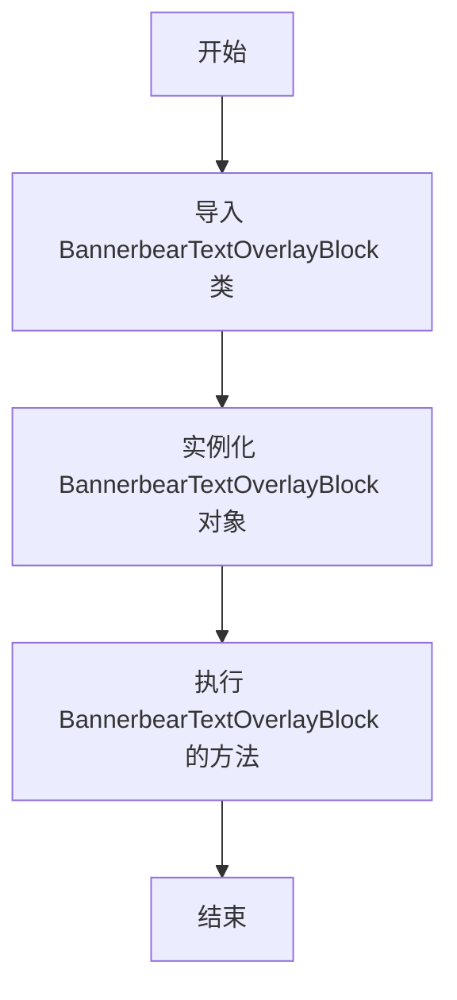

# `.\AutoGPT\autogpt_platform\backend\backend\blocks\bannerbear\__init__.py` 详细设计文档

The code defines a class BannerbearTextOverlayBlock, which is likely used to handle text overlay functionalities for Bannerbear, a text overlay service.

## 整体流程



## 类结构

```
BannerbearTextOverlayBlock (类)
```

## 全局变量及字段


### `BannerbearTextOverlayBlock.BannerbearTextOverlayBlock`
    
A class representing a text overlay block from the Bannerbear library.

类型：`class`
    
    

## 全局函数及方法


## 关键组件


### 张量索引与惰性加载

张量索引与惰性加载机制，用于高效地处理大规模数据集，通过延迟计算和索引优化，减少内存占用和计算时间。

### 反量化支持

反量化支持功能，允许代码在运行时动态调整量化参数，以适应不同的量化需求和环境。

### 量化策略

量化策略组件，负责将浮点数数据转换为低精度表示，以减少模型大小和提高推理速度。


## 问题及建议


### 已知问题

-   **代码复用性低**：代码中只导入了单个类，且没有其他逻辑或功能，这表明代码可能只用于特定场景，缺乏通用性。
-   **文档缺失**：代码中没有提供任何文档说明，这使得其他开发者难以理解代码的目的和使用方法。
-   **依赖性**：代码依赖于`text_overlay`模块中的`BannerbearTextOverlayBlock`类，但该模块的具体功能和依赖关系未在文档中说明。

### 优化建议

-   **增加代码复用性**：考虑将`BannerbearTextOverlayBlock`类及其相关功能抽象成一个更通用的模块或库，以便在其他项目中复用。
-   **编写文档**：为代码编写详细的文档，包括类和方法的功能、参数、返回值以及如何使用该代码。
-   **模块依赖说明**：在文档中详细说明`text_overlay`模块的功能和依赖，以便其他开发者了解整个系统的架构。
-   **单元测试**：为`BannerbearTextOverlayBlock`类编写单元测试，以确保代码的稳定性和可靠性。
-   **代码注释**：在代码中添加必要的注释，以提高代码的可读性和可维护性。


## 其它


### 设计目标与约束

- 设计目标：确保代码模块化，易于维护和扩展。
- 约束条件：遵循Python编程规范，兼容Python 3.x版本。

### 错误处理与异常设计

- 异常处理：定义自定义异常类，用于处理特定错误情况。
- 错误日志：记录错误信息，便于问题追踪和调试。

### 数据流与状态机

- 数据流：描述数据在系统中的流动路径和转换过程。
- 状态机：定义系统可能的状态和状态转换条件。

### 外部依赖与接口契约

- 外部依赖：列出所有外部依赖库及其版本要求。
- 接口契约：定义模块间接口的规范，确保模块间交互的一致性。

### 测试与验证

- 单元测试：编写单元测试用例，确保代码功能正确。
- 集成测试：进行集成测试，验证模块间交互的正确性。

### 性能优化

- 性能分析：使用性能分析工具，找出性能瓶颈。
- 优化策略：根据性能分析结果，提出优化方案。

### 安全性考虑

- 安全漏洞：识别潜在的安全风险，提出解决方案。
- 安全规范：遵循安全编码规范，确保代码安全。

### 维护与更新策略

- 维护计划：制定代码维护计划，确保代码长期可用。
- 更新策略：制定代码更新策略，确保兼容性和稳定性。

### 文档与注释

- 文档规范：遵循文档编写规范，确保文档质量。
- 注释规范：编写清晰、规范的代码注释，提高代码可读性。

### 用户手册与帮助文档

- 用户手册：编写用户手册，指导用户使用代码。
- 帮助文档：编写帮助文档，提供代码使用示例和常见问题解答。

### 项目管理

- 项目计划：制定项目计划，明确项目目标、进度和资源分配。
- 项目跟踪：跟踪项目进度，确保项目按时完成。

### 部署与运维

- 部署方案：制定部署方案，确保代码顺利部署到生产环境。
- 运维策略：制定运维策略，确保系统稳定运行。


    