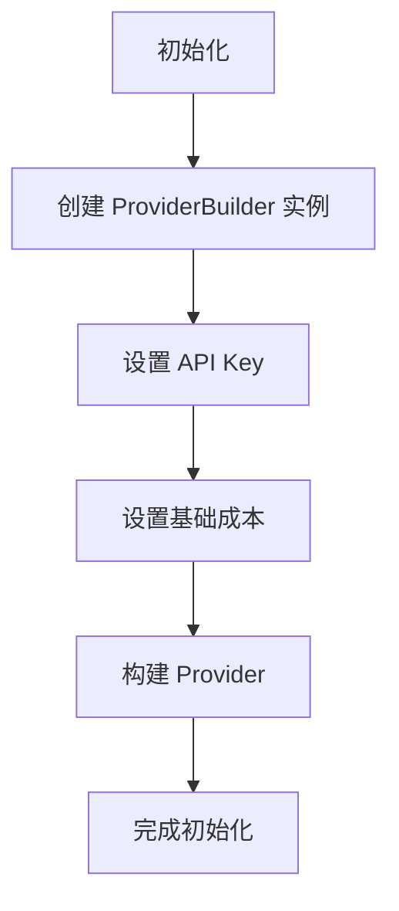
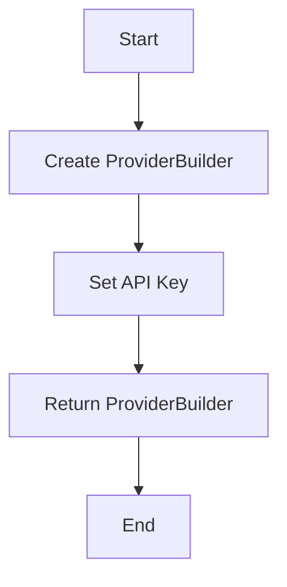
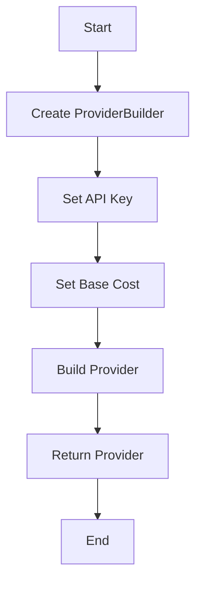
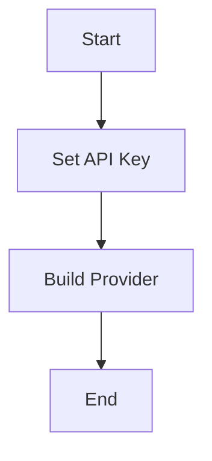
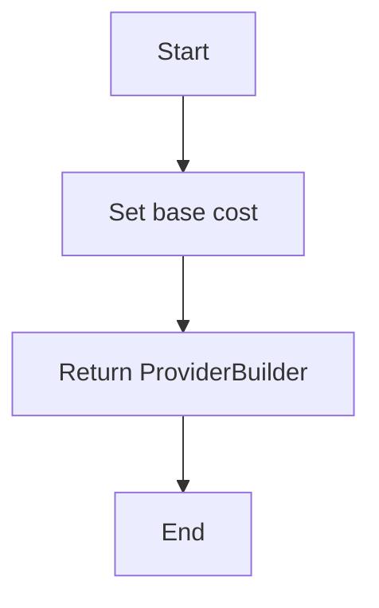
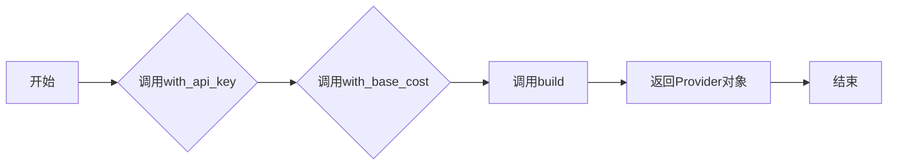

# `.\AutoGPT\autogpt_platform\backend\backend\blocks\bannerbear\_config.py` 详细设计文档

The code configures and initializes a Bannerbear provider for API usage with specified API key and base cost settings.

## 整体流程



## 类结构

```
ProviderBuilder (类)
```

## 全局变量及字段


### `bannerbear`
    
An instance of ProviderBuilder configured with Bannerbear API details and cost settings.

类型：`ProviderBuilder`
    


### `ProviderBuilder.api_key`
    
The API key for the Bannerbear service.

类型：`str`
    


### `ProviderBuilder.base_cost`
    
The base cost for the Bannerbear service, specified in blocks.

类型：`int`
    


### `ProviderBuilder.block_cost_type`
    
The cost type for the Bannerbear service, indicating whether the cost is per run or per block.

类型：`BlockCostType`
    
    

## 全局函数及方法


### ProviderBuilder.with_api_key

该函数用于设置ProviderBuilder实例的API密钥。

参数：

- `api_key`：`str`，API密钥的名称
- `value`：`str`，API密钥的实际值

返回值：`ProviderBuilder`，返回修改后的ProviderBuilder实例

#### 流程图



#### 带注释源码

```python
from backend.sdk import ProviderBuilder

bannerbear = (
    ProviderBuilder("bannerbear")
    .with_api_key("BANNERBEAR_API_KEY", "Bannerbear API Key")
    .with_base_cost(1, BlockCostType.RUN)
    .build()
)
```


### ProviderBuilder.with_base_cost

该函数用于设置ProviderBuilder实例的基本成本。

参数：

- `cost`：`int`，基本成本值
- `cost_type`：`BlockCostType`，成本类型枚举

返回值：`ProviderBuilder`，返回修改后的ProviderBuilder实例

#### 流程图


#### 带注释源码

```python
from backend.sdk import ProviderBuilder, BlockCostType

bannerbear = (
    ProviderBuilder("bannerbear")
    .with_api_key("BANNERBEAR_API_KEY", "Bannerbear API Key")
    .with_base_cost(1, BlockCostType.RUN)
    .build()
)
```


### ProviderBuilder.build

该函数用于构建ProviderBuilder实例，并返回最终的Provider对象。

参数：无

返回值：`Provider`，构建后的Provider对象

#### 流程图



#### 带注释源码

```python
from backend.sdk import ProviderBuilder

bannerbear = (
    ProviderBuilder("bannerbear")
    .with_api_key("BANNERBEAR_API_KEY", "Bannerbear API Key")
    .with_base_cost(1, BlockCostType.RUN)
    .build()
)
```


### `with_api_key`

`with_api_key` 方法用于设置 API 密钥。

参数：

- `api_key`：`str`，API 密钥的名称。
- `value`：`str`，API 密钥的实际值。

返回值：`ProviderBuilder`，返回修改后的 `ProviderBuilder` 对象。

#### 流程图



#### 带注释源码

```python
from backend.sdk import BlockCostType, ProviderBuilder

bannerbear = (
    ProviderBuilder("bannerbear")
    .with_api_key("BANNERBEAR_API_KEY", "Bannerbear API Key")
    .with_base_cost(1, BlockCostType.RUN)
    .build()
)
```


### `with_base_cost`

`with_base_cost` 方法用于设置基础成本。

参数：

- `cost`：`int`，基础成本值，表示每个运行块的成本。
- `cost_type`：`BlockCostType`，成本类型枚举，表示成本的计算方式。

返回值：`ProviderBuilder`，返回修改后的 `ProviderBuilder` 对象。

#### 流程图



#### 带注释源码

```python
from backend.sdk import BlockCostType, ProviderBuilder

# 设置基础成本
def with_base_cost(self, cost, cost_type):
    # 设置基础成本值
    self.base_cost = cost
    # 设置成本类型
    self.cost_type = cost_type
    # 返回修改后的 ProviderBuilder 对象
    return self
```


### `build`

该函数负责创建一个`ProviderBuilder`实例，并使用提供的配置信息构建一个`Provider`对象。

参数：

- `self`：`ProviderBuilder`实例，表示正在构建的`Provider`。
- `...`：一系列配置方法调用的结果，如`.with_api_key()`和`.with_base_cost()`。

返回值：`Provider`对象，表示构建完成的`Provider`。

#### 流程图

```mermaid
graph TD
    A[Start] --> B[ProviderBuilder("bannerbear")]
    B --> C{with_api_key("BANNERBEAR_API_KEY", "Bannerbear API Key")}
    C --> D{with_base_cost(1, BlockCostType.RUN)}
    D --> E[build]
    E --> F[Provider Object]
    F --> G[End]
```

#### 带注释源码

```python
from backend.sdk import BlockCostType, ProviderBuilder

# 创建ProviderBuilder实例
bannerbear = ProviderBuilder("bannerbear")

# 配置API密钥
bannerbear = bannerbear.with_api_key("BANNERBEAR_API_KEY", "Bannerbear API Key")

# 设置基础成本
bannerbear = bannerbear.with_base_cost(1, BlockCostType.RUN)

# 构建Provider对象
bannerbear = bannerbear.build()
```


### ProviderBuilder.with_api_key

该函数用于设置ProviderBuilder实例的API密钥。

参数：

- `api_key`：`str`，API密钥的名称
- `value`：`str`，API密钥的实际值

返回值：`ProviderBuilder`，返回修改后的ProviderBuilder实例

#### 流程图

```mermaid
graph TD
    A[Start] --> B[ProviderBuilder("bannerbear")]
    B --> C[with_api_key("BANNERBEAR_API_KEY", "Bannerbear API Key")]
    C --> D[with_base_cost(1, BlockCostType.RUN)]
    D --> E[build()]
    E --> F[End]
```

#### 带注释源码

```
from backend.sdk import BlockCostType, ProviderBuilder

bannerbear = (
    ProviderBuilder("bannerbear")
    .with_api_key("BANNERBEAR_API_KEY", "Bannerbear API Key")  # 设置API密钥
    .with_base_cost(1, BlockCostType.RUN)  # 设置基础成本
    .build()  # 构建Provider实例
)
```


### ProviderBuilder.with_base_cost

该函数用于设置基础成本，它是ProviderBuilder类的一个方法，用于在构建Provider实例时指定基础成本。

参数：

- `cost`：`int`，基础成本值，表示每个操作的成本。
- `cost_type`：`BlockCostType`，成本类型，表示成本的计算方式。

返回值：`None`，该方法不返回任何值，它直接修改ProviderBuilder实例的状态。

#### 流程图

```mermaid
graph TD
    A[Start] --> B[ProviderBuilder("bannerbear")]
    B --> C[with_api_key("BANNERBEAR_API_KEY", "Bannerbear API Key")]
    C --> D[with_base_cost(1, BlockCostType.RUN)]
    D --> E[build()]
    E --> F[Provider instance]
    F --> G[End]
```

#### 带注释源码

```
from backend.sdk import BlockCostType, ProviderBuilder

# 创建ProviderBuilder实例
bannerbear = ProviderBuilder("bannerbear")

# 设置API密钥
bannerbear = bannerbear.with_api_key("BANNERBEAR_API_KEY", "Bannerbear API Key")

# 设置基础成本
bannerbear = bannerbear.with_base_cost(1, BlockCostType.RUN)

# 构建Provider实例
bannerbear = bannerbear.build()
```


### ProviderBuilder.build

该函数用于构建一个Provider对象，配置了API密钥和基础成本。

参数：

- `self`：`ProviderBuilder`，当前构建器实例
- ...

返回值：`Provider`，构建好的Provider对象

#### 流程图



#### 带注释源码

```
from backend.sdk import ProviderBuilder

# 假设ProviderBuilder类定义如下
class ProviderBuilder:
    def __init__(self, name):
        self.name = name
        self.api_key = None
        self.base_cost = None
        self.block_cost_type = None

    def with_api_key(self, key, description):
        self.api_key = key
        return self

    def with_base_cost(self, cost, cost_type):
        self.base_cost = cost
        self.block_cost_type = cost_type
        return self

    def build(self):
        # 构建Provider对象
        provider = Provider(name=self.name, api_key=self.api_key, base_cost=self.base_cost, block_cost_type=self.block_cost_type)
        return provider

# 使用ProviderBuilder构建Provider对象
bannerbear = (
    ProviderBuilder("bannerbear")
    .with_api_key("BANNERBEAR_API_KEY", "Bannerbear API Key")
    .with_base_cost(1, BlockCostType.RUN)
    .build()
)
```


## 关键组件


### 张量索引与惰性加载

张量索引与惰性加载是深度学习框架中用于高效处理大型数据集的关键技术，它允许在需要时才计算数据，从而减少内存消耗和提高计算效率。

### 反量化支持

反量化支持是针对量化计算的一种优化技术，它允许在量化过程中保留部分非量化数据，以减少量化误差，提高模型的精度。

### 量化策略

量化策略是模型压缩技术的一部分，它通过将模型中的浮点数参数转换为低精度整数来减少模型大小和计算量，同时尽量保持模型的性能。


## 问题及建议


### 已知问题

-   {问题1}：代码中使用了硬编码的API密钥（"BANNERBEAR_API_KEY"），这可能导致密钥泄露的风险，尤其是在代码库被公开的情况下。
-   {问题2}：代码没有实现错误处理机制，如果API调用失败或配置错误，程序可能会崩溃或产生不可预测的行为。
-   {问题3}：代码没有提供任何日志记录或监控机制，这会使得问题追踪和调试变得困难。

### 优化建议

-   {建议1}：将API密钥存储在环境变量或配置文件中，而不是硬编码在代码中，以增强安全性。
-   {建议2}：实现错误处理逻辑，捕获可能的异常，并记录错误信息，以便于问题追踪和调试。
-   {建议3}：引入日志记录机制，记录关键操作和错误信息，以便于监控和审计。
-   {建议4}：考虑使用依赖注入来管理依赖项，这样可以在测试时更容易地替换或模拟依赖项。
-   {建议5}：如果API调用频繁，可以考虑实现缓存机制，减少不必要的网络请求，提高性能。


## 其它


### 设计目标与约束

- 设计目标：确保代码能够高效、稳定地与Bannerbear API交互，同时保持代码的可维护性和可扩展性。
- 约束条件：遵循RESTful API规范，确保API调用安全，使用环境变量存储敏感信息。

### 错误处理与异常设计

- 错误处理：捕获并处理API调用过程中可能出现的异常，如网络错误、认证失败等。
- 异常设计：定义自定义异常类，以便于在代码中统一处理不同类型的错误。

### 数据流与状态机

- 数据流：从配置文件读取API密钥，通过ProviderBuilder构建Provider实例，然后使用该实例进行API调用。
- 状态机：无状态设计，所有操作都是瞬时的，没有中间状态。

### 外部依赖与接口契约

- 外部依赖：依赖于backend.sdk模块中的BlockCostType和ProviderBuilder类。
- 接口契约：遵循RESTful API规范，确保与Bannerbear API的交互符合预期。

### 安全性与认证

- 安全性：使用HTTPS协议进行API调用，确保数据传输安全。
- 认证：通过API密钥进行认证，确保只有授权用户可以访问API。

### 性能优化

- 性能优化：考虑使用缓存机制减少API调用次数，提高系统响应速度。

### 测试与部署

- 测试：编写单元测试和集成测试，确保代码质量和功能正确性。
- 部署：提供部署指南，确保代码可以顺利部署到生产环境。

### 维护与监控

- 维护：定期更新依赖库，修复已知问题，确保系统稳定运行。
- 监控：实现日志记录和性能监控，及时发现并解决问题。


    