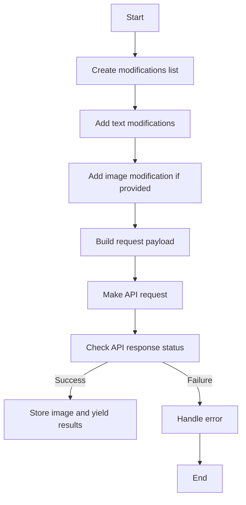
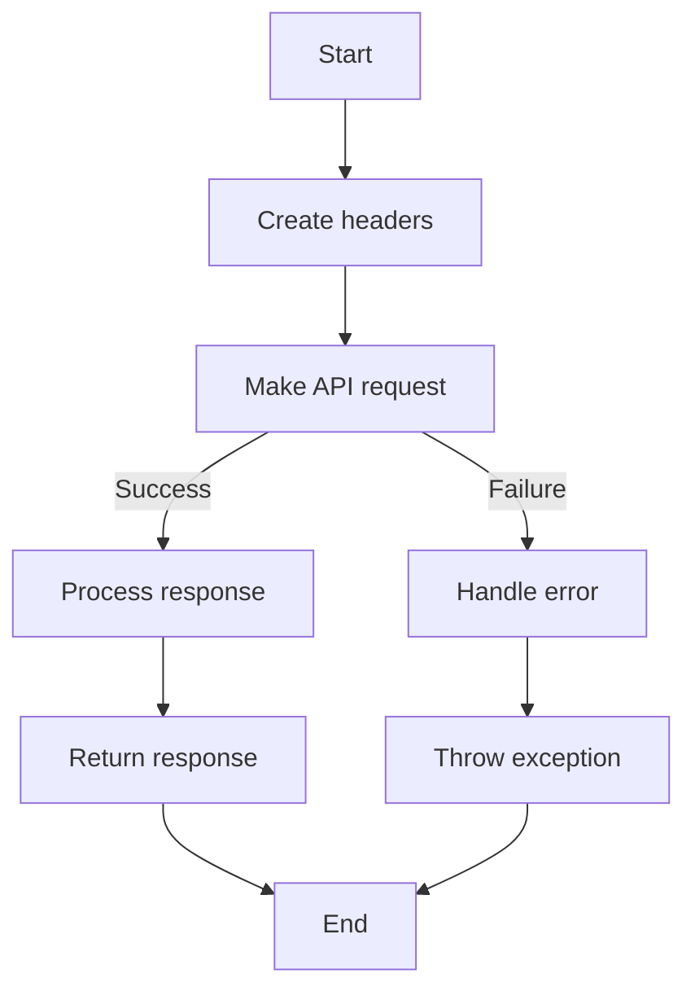
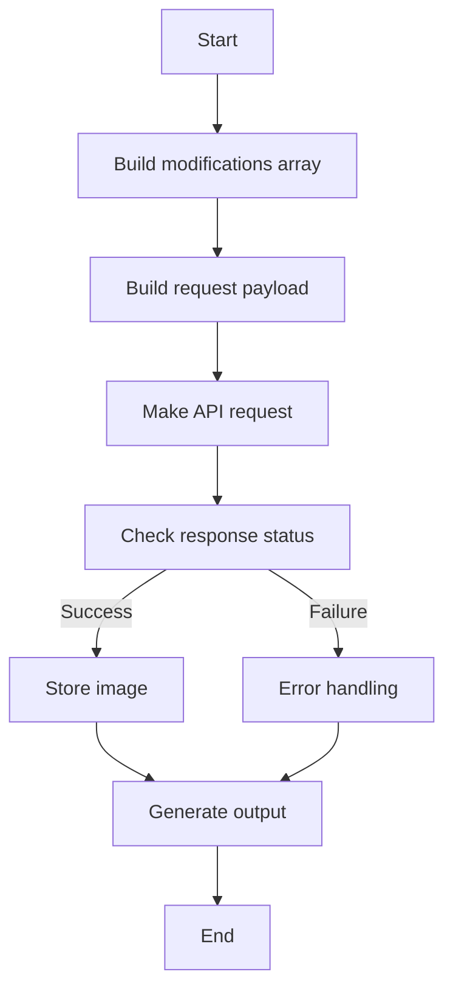
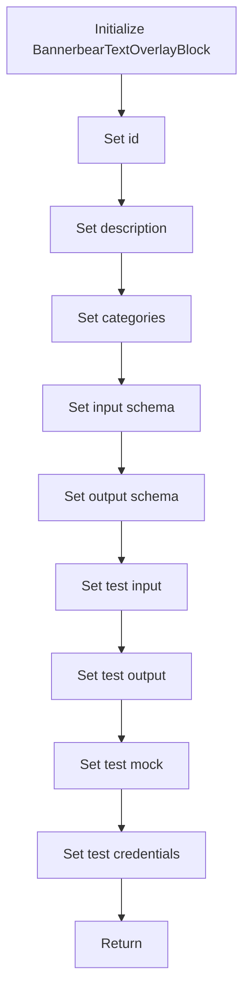
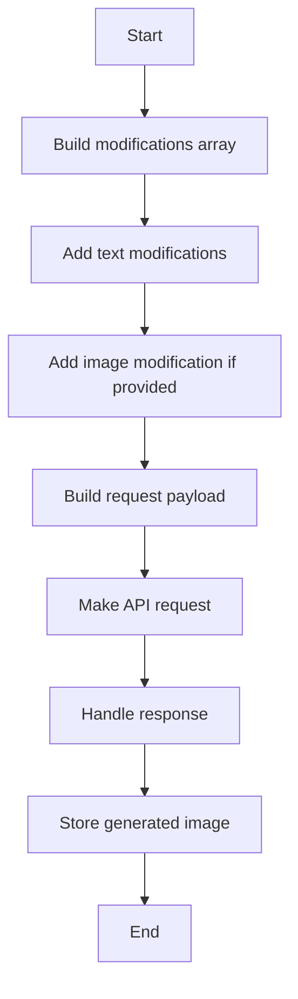

# `.\AutoGPT\autogpt_platform\backend\backend\blocks\bannerbear\text_overlay.py` 详细设计文档

The code provides functionality to add text overlays to images using Bannerbear templates, allowing for the creation of social media graphics, marketing materials, and dynamic image content.

## 整体流程



## 类结构

```
BannerbearTextOverlayBlock (Concrete Block)
├── Input (BlockSchemaInput)
│   ├── credentials (CredentialsMetaInput)
│   ├── template_id (str)
│   ├── project_id (str)
│   ├── text_modifications (List[TextModification])
│   ├── image_url (str)
│   ├── image_layer_name (str)
│   ├── webhook_url (str)
│   └── metadata (str)
└── Output (BlockSchemaOutput)
    ├── success (bool)
    ├── image_url (str)
    ├── uid (str)
    └── status (str)
```

## 全局变量及字段


### `TEST_CREDENTIALS`
    
API credentials for Bannerbear

类型：`APIKeyCredentials`
    


### `TextModification.name`
    
The name of the layer to modify in the template

类型：`str`
    


### `TextModification.text`
    
The text content to add to this layer

类型：`str`
    


### `TextModification.color`
    
Hex color code for the text (e.g., '#FF0000')

类型：`str`
    


### `TextModification.font_family`
    
Font family to use for the text

类型：`str`
    


### `TextModification.font_size`
    
Font size in pixels

类型：`int`
    


### `TextModification.font_weight`
    
Font weight (e.g., 'bold', 'normal')

类型：`str`
    


### `TextModification.text_align`
    
Text alignment (left, center, right)

类型：`str`
    


### `TextModification.name`
    
The name of the layer to modify in the template

类型：`str`
    


### `TextModification.text`
    
The text content to add to this layer

类型：`str`
    


### `TextModification.color`
    
Hex color code for the text (e.g., '#FF0000')

类型：`str`
    


### `TextModification.font_family`
    
Font family to use for the text

类型：`str`
    


### `TextModification.font_size`
    
Font size in pixels

类型：`int`
    


### `TextModification.font_weight`
    
Font weight (e.g., 'bold', 'normal')

类型：`str`
    


### `TextModification.text_align`
    
Text alignment (left, center, right)

类型：`str`
    
    

## 全局函数及方法


### `_make_api_request`

Make the actual API request to Bannerbear. This is separated for easy mocking in tests.

参数：

- `payload`：`dict`，The data payload to be sent to the Bannerbear API.
- `api_key`：`str`，The API key to be used for authentication.

返回值：`dict`，The JSON response from the Bannerbear API.

#### 流程图



#### 带注释源码

```python
async def _make_api_request(self, payload: dict, api_key: str) -> dict:
    """Make the actual API request to Bannerbear. This is separated for easy mocking in tests."""
    headers = {
        "Authorization": f"Bearer {api_key}",
        "Content-Type": "application/json",
    }

    response = await Requests().post(
        "https://sync.api.bannerbear.com/v2/images",
        headers=headers,
        json=payload,
    )

    if response.status in [200, 201, 202]:
        return response.json()
    else:
        error_msg = f"API request failed with status {response.status}"
        if response.text:
            try:
                error_data = response.json()
                error_msg = (
                    f"{error_msg}: {error_data.get('message', response.text)}"
                )
            except Exception:
                error_msg = f"{error_msg}: {response.text}"
        raise Exception(error_msg)
```


### `BannerbearTextOverlayBlock.run`

This method runs the BannerbearTextOverlayBlock, which adds text overlay to images using Bannerbear templates.

参数：

- `input_data`：`Input`，The input data for the block, including text modifications, template ID, and other optional parameters.
- `credentials`：`APIKeyCredentials`，API credentials for Bannerbear.
- `execution_context`：`ExecutionContext`，The execution context for the block.

返回值：`BlockOutput`，The output of the block, including success status, image URL, unique identifier, and status of the image generation.

#### 流程图



#### 带注释源码

```python
async def run(
    self,
    input_data: Input,
    *,
    credentials: APIKeyCredentials,
    execution_context: ExecutionContext,
    **kwargs,
) -> BlockOutput:
    # Build the modifications array
    modifications = []

    # Add text modifications
    for text_mod in input_data.text_modifications:
        mod_data: Dict[str, Any] = {
            "name": text_mod.name,
            "text": text_mod.text,
        }

        # Add optional text styling parameters only if they have values
        if text_mod.color and text_mod.color.strip():
            mod_data["color"] = text_mod.color
        if text_mod.font_family and text_mod.font_family.strip():
            mod_data["font_family"] = text_mod.font_family
        if text_mod.font_size and text_mod.font_size > 0:
            mod_data["font_size"] = text_mod.font_size
        if text_mod.font_weight and text_mod.font_weight.strip():
            mod_data["font_weight"] = text_mod.font_weight
        if text_mod.text_align and text_mod.text_align.strip():
            mod_data["text_align"] = text_mod.text_align

        modifications.append(mod_data)

    # Add image modification if provided and not empty
    if input_data.image_url and input_data.image_url.strip():
        modifications.append(
            {
                "name": input_data.image_layer_name,
                "image_url": input_data.image_url,
            }
        )

    # Build the request payload - only include non-empty optional fields
    payload = {
        "template": input_data.template_id,
        "modifications": modifications,
    }

    # Add project_id if provided (required for Master API keys)
    if input_data.project_id and input_data.project_id.strip():
        payload["project_id"] = input_data.project_id

    if input_data.webhook_url and input_data.webhook_url.strip():
        payload["webhook_url"] = input_data.webhook_url
    if input_data.metadata and input_data.metadata.strip():
        payload["metadata"] = input_data.metadata

    # Make the API request using the private method
    data = await self._make_api_request(
        payload, credentials.api_key.get_secret_value()
    )

    # Synchronous request - image should be ready
    yield "success", True

    # Store the generated image to workspace for persistence
    image_url = data.get("image_url", "")
    if image_url:
        stored_url = await store_media_file(
            file=MediaFileType(image_url),
            execution_context=execution_context,
            return_format="for_block_output",
        )
        yield "image_url", stored_url
    else:
        yield "image_url", ""

    yield "uid", data.get("uid", "")
    yield "status", data.get("status", "completed")
```


### `BannerbearTextOverlayBlock.__init__`

This method initializes the `BannerbearTextOverlayBlock` class, setting up its properties and configurations.

参数：

- `id`：`str`，Unique identifier for the block.
- `description`：`str`，Description of the block's functionality.
- `categories`：`set`，Set of categories the block belongs to.
- `input_schema`：`BlockSchemaInput`，Schema for the input data.
- `output_schema`：`BlockSchemaOutput`，Schema for the output data.
- `test_input`：`dict`，Sample input data for testing.
- `test_output`：`list`，Sample output data for testing.
- `test_mock`：`dict`，Mock data for testing.
- `test_credentials`：`APIKeyCredentials`，Test credentials for the API.

返回值：`None`，This method does not return any value.

#### 流程图



#### 带注释源码

```python
def __init__(self):
    super().__init__(
        id="c7d3a5c2-05fc-450e-8dce-3b0e04626009",
        description="Add text overlay to images using Bannerbear templates. Perfect for creating social media graphics, marketing materials, and dynamic image content.",
        categories={BlockCategory.PRODUCTIVITY, BlockCategory.AI},
        input_schema=self.Input,
        output_schema=self.Output,
        test_input={
            "template_id": "jJWBKNELpQPvbX5R93Gk",
            "text_modifications": [
                {
                    "name": "headline",
                    "text": "Amazing Product Launch!",
                    "color": "#FF0000",
                },
                {
                    "name": "subtitle",
                    "text": "50% OFF Today Only",
                },
            ],
            "credentials": {
                "provider": "bannerbear",
                "id": str(uuid.uuid4()),
                "type": "api_key",
            },
        },
        test_output=[
            ("success", True),
            # Output will be a workspace ref or data URI depending on context
            ("image_url", lambda x: x.startswith(("workspace://", "data:"))),
            ("uid", "test-uid-123"),
            ("status", "completed"),
        ],
        test_mock={
            # Use data URI to avoid HTTP requests during tests
            "_make_api_request": lambda *args, **kwargs: {
                "uid": "test-uid-123",
                "status": "completed",
                "image_url": "data:image/jpeg;base64,/9j/4AAQSkZJRgABAQAAAQABAAD/2wBDAAgGBgcGBQgHBwcJCQgKDBQNDAsLDBkSEw8UHRofHh0aHBwgJC4nICIsIxwcKDcpLDAxNDQ0Hyc5PTgyPC4zNDL/wAALCAABAAEBAREA/8QAHwAAAQUBAQEBAQEAAAAAAAAAAAECAwQFBgcICQoL/8QAtRAAAgEDAwIEAwUFBAQAAAF9AQIDAAQRBRIhMUEGE1FhByJxFDKBkaEII0KxwRVS0fAkM2JyggkKFhcYGRolJicoKSo0NTY3ODk6Q0RFRkdISUpTVFVWV1hZWmNkZWZnaGlqc3R1dnd4eXqDhIWGh4iJipKTlJWWl5iZmqKjpKWmp6ipqrKztLW2t7i5usLDxMXGx8jJytLT1NXW19jZ2uHi4+Tl5ufo6erx8vP09fb3+Pn6/9oACAEBAAA/APn+v//Z",
            }
        },
        test_credentials=TEST_CREDENTIALS,
    )
```


### `_make_api_request`

Make the actual API request to Bannerbear. This is separated for easy mocking in tests.

参数：

- `payload`：`dict`，The data payload to be sent to the Bannerbear API.
- `api_key`：`str`，The API key to be used for authentication.

返回值：`dict`，The JSON response from the Bannerbear API.

#### 流程图


#### 带注释源码

```python
async def _make_api_request(self, payload: dict, api_key: str) -> dict:
    """Make the actual API request to Bannerbear. This is separated for easy mocking in tests."""
    headers = {
        "Authorization": f"Bearer {api_key}",
        "Content-Type": "application/json",
    }

    response = await Requests().post(
        "https://sync.api.bannerbear.com/v2/images",
        headers=headers,
        json=payload,
    )

    if response.status in [200, 201, 202]:
        return response.json()
    else:
        error_msg = f"API request failed with status {response.status}"
        if response.text:
            try:
                error_data = response.json()
                error_msg = (
                    f"{error_msg}: {error_data.get('message', response.text)}"
                )
            except Exception:
                error_msg = f"{error_msg}: {response.text}"
        raise Exception(error_msg)
```


### BannerbearTextOverlayBlock.run

This method runs the BannerbearTextOverlayBlock, which adds text overlay to images using Bannerbear templates.

参数：

- `input_data`：`Input`，The input data for the block, including credentials, template ID, text modifications, image URL, image layer name, webhook URL, and metadata.
- `credentials`：`APIKeyCredentials`，API credentials for Bannerbear.
- `execution_context`：`ExecutionContext`，The execution context for the block.

返回值：`BlockOutput`，The output of the block, including success status, image URL, unique identifier for the generated image, and status of the image generation.

#### 流程图



#### 带注释源码

```python
async def run(
    self,
    input_data: Input,
    *,
    credentials: APIKeyCredentials,
    execution_context: ExecutionContext,
    **kwargs,
) -> BlockOutput:
    # Build the modifications array
    modifications = []

    # Add text modifications
    for text_mod in input_data.text_modifications:
        mod_data: Dict[str, Any] = {
            "name": text_mod.name,
            "text": text_mod.text,
        }

        # Add optional text styling parameters only if they have values
        if text_mod.color and text_mod.color.strip():
            mod_data["color"] = text_mod.color
        if text_mod.font_family and text_mod.font_family.strip():
            mod_data["font_family"] = text_mod.font_family
        if text_mod.font_size and text_mod.font_size > 0:
            mod_data["font_size"] = text_mod.font_size
        if text_mod.font_weight and text_mod.font_weight.strip():
            mod_data["font_weight"] = text_mod.font_weight
        if text_mod.text_align and text_mod.text_align.strip():
            mod_data["text_align"] = text_mod.text_align

        modifications.append(mod_data)

    # Add image modification if provided and not empty
    if input_data.image_url and input_data.image_url.strip():
        modifications.append(
            {
                "name": input_data.image_layer_name,
                "image_url": input_data.image_url,
            }
        )

    # Build the request payload - only include non-empty optional fields
    payload = {
        "template": input_data.template_id,
        "modifications": modifications,
    }

    # Add project_id if provided (required for Master API keys)
    if input_data.project_id and input_data.project_id.strip():
        payload["project_id"] = input_data.project_id

    if input_data.webhook_url and input_data.webhook_url.strip():
        payload["webhook_url"] = input_data.webhook_url
    if input_data.metadata and input_data.metadata.strip():
        payload["metadata"] = input_data.metadata

    # Make the API request using the private method
    data = await self._make_api_request(
        payload, credentials.api_key.get_secret_value()
    )

    # Synchronous request - image should be ready
    yield "success", True

    # Store the generated image to workspace for persistence
    image_url = data.get("image_url", "")
    if image_url:
        stored_url = await store_media_file(
            file=MediaFileType(image_url),
            execution_context=execution_context,
            return_format="for_block_output",
        )
        yield "image_url", stored_url
    else:
        yield "image_url", ""

    yield "uid", data.get("uid", "")
    yield "status", data.get("status", "completed")
```


## 关键组件


### 张量索引与惰性加载

张量索引与惰性加载是用于高效处理大型数据集的关键组件，它允许在需要时才加载数据，从而减少内存消耗和提高性能。

### 反量化支持

反量化支持是用于将量化后的模型转换回未量化的模型，以便进行进一步的分析或训练，确保模型性能不受量化过程的影响。

### 量化策略

量化策略是用于优化模型性能和减少模型大小的方法，通过减少模型中使用的数值范围来降低模型的复杂度。


## 问题及建议


### 已知问题

-   **API Key Management**: The code uses a hardcoded `TEST_CREDENTIALS` for testing purposes. In a production environment, this should be managed more securely, possibly using environment variables or a secrets management system.
-   **Error Handling**: The `_make_api_request` method raises a generic `Exception` when an API request fails. It would be beneficial to provide more specific error handling to differentiate between different types of errors (e.g., network issues, invalid credentials, etc.).
-   **Optional Parameters**: The code checks for non-empty strings before adding optional parameters to the payload. This could be simplified by using the `get` method of dictionaries, which returns `None` if the key is not present.
-   **Testing**: The test cases in the code are basic and do not cover all possible scenarios. More comprehensive testing, including edge cases, should be implemented to ensure robustness.
-   **Documentation**: The code lacks detailed docstrings for methods and classes, which are essential for maintainability and understanding the code's purpose and usage.

### 优化建议

-   **Implement a Secure API Key Management System**: Use environment variables or a secrets management system to store API keys securely, especially in a production environment.
-   **Enhance Error Handling**: Implement more granular error handling to provide meaningful error messages and handle different types of errors appropriately.
-   **Simplify Optional Parameters**: Use the `get` method of dictionaries to simplify the code and make it more readable.
-   **Expand Test Coverage**: Write more comprehensive test cases to cover various scenarios, including edge cases, to ensure the code behaves as expected.
-   **Add Detailed Documentation**: Add detailed docstrings to methods and classes to improve code readability and maintainability.
-   **Consider Asynchronous Execution**: If the image generation process is time-consuming, consider using asynchronous execution to improve the user experience by not blocking the main thread.
-   **Implement Logging**: Add logging to the code to track the flow of execution and to help with debugging and monitoring in a production environment.


## 其它


### 设计目标与约束

- 设计目标：
  - 提供一个模块化的文本叠加功能，允许用户在图像上添加文本。
  - 支持多种文本样式，如颜色、字体、大小、加粗等。
  - 支持图像叠加，允许用户在模板中添加图像。
  - 支持Webhook通知，当图像生成完成时通知用户。
  - 确保API请求的安全性和错误处理。

- 约束：
  - 必须使用Bannerbear API进行图像生成。
  - 必须处理API请求失败的情况。
  - 必须确保生成的图像存储在用户的工作空间中。

### 错误处理与异常设计

- 错误处理：
  - 当API请求失败时，抛出异常，并提供错误信息。
  - 当输入数据无效时，抛出异常，并提供错误信息。

- 异常设计：
  - 使用try-except块捕获可能发生的异常，并记录错误信息。
  - 异常信息应包含足够的信息，以便用户和开发者能够了解问题的原因。

### 数据流与状态机

- 数据流：
  - 用户输入数据通过API发送到Bannerbear。
  - Bannerbear生成图像，并将图像URL返回给API。
  - API将图像URL存储在用户的工作空间中。

- 状态机：
  - 初始状态：等待用户输入。
  - 处理状态：处理用户输入，构建请求，发送到Bannerbear。
  - 完成状态：图像生成完成，存储图像URL。

### 外部依赖与接口契约

- 外部依赖：
  - Bannerbear API：用于图像生成和存储。
  - pydantic：用于数据验证和模型定义。
  - asyncio：用于异步编程。

- 接口契约：
  - APIKeyCredentials：用于存储API密钥。
  - Block：用于定义图像处理块。
  - Requests：用于发送HTTP请求。
  - store_media_file：用于存储媒体文件。
  - MediaFileType：用于定义媒体文件类型。
  - ExecutionContext：用于执行上下文。


    