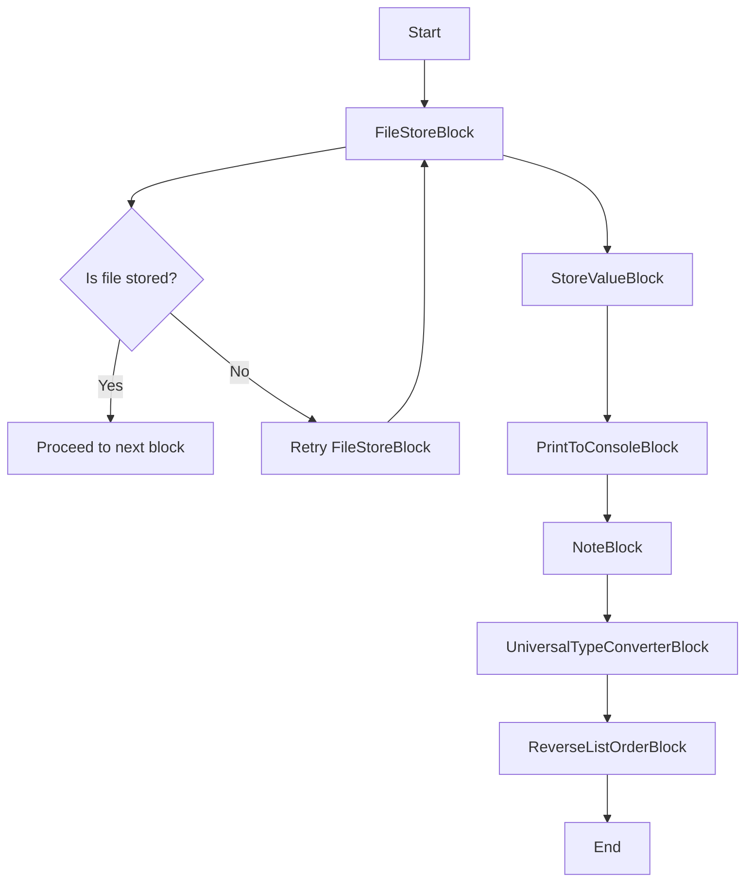
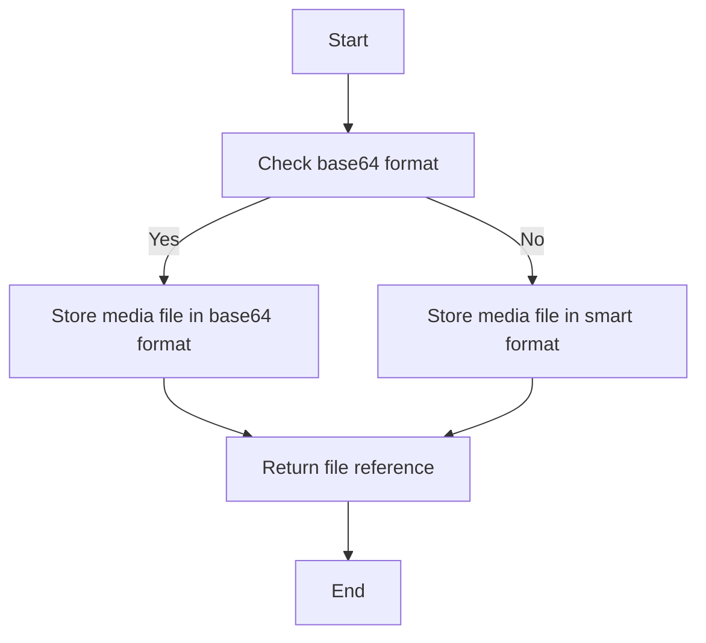
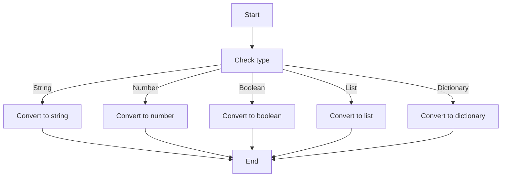
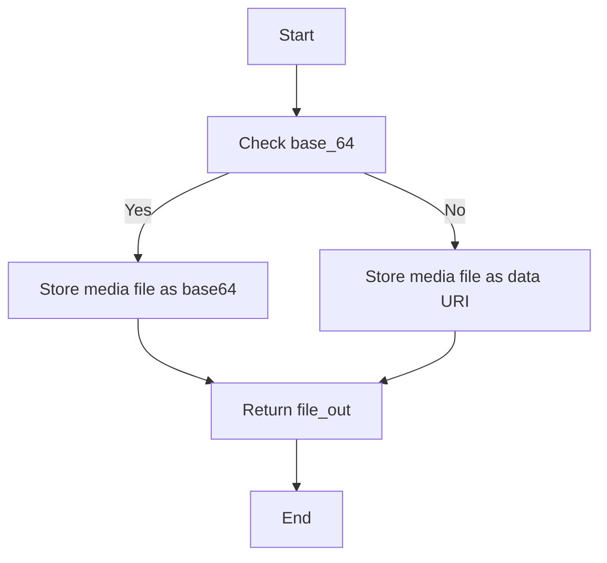
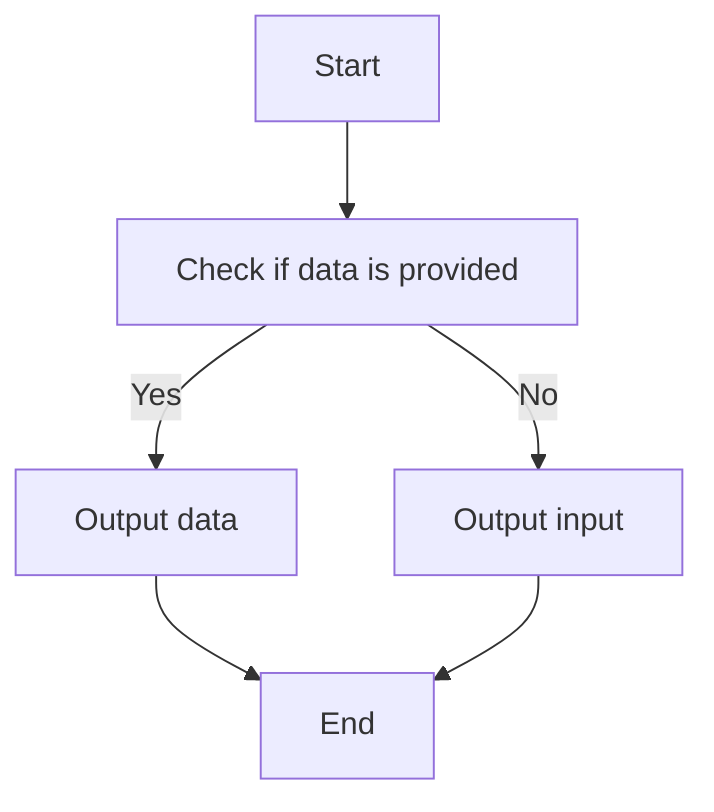
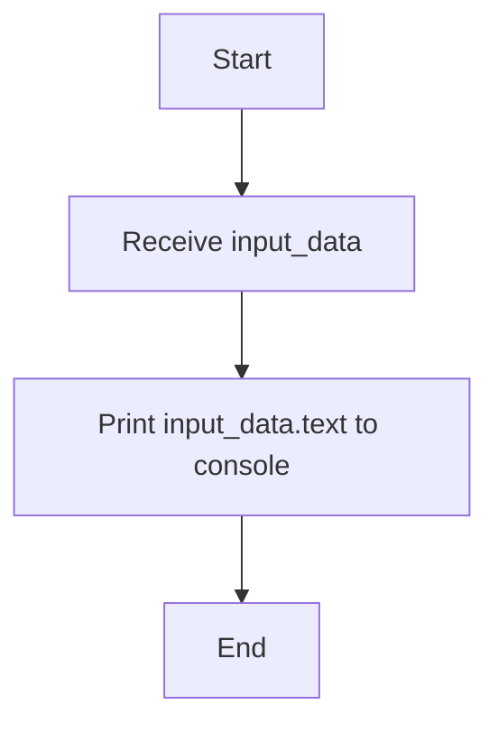
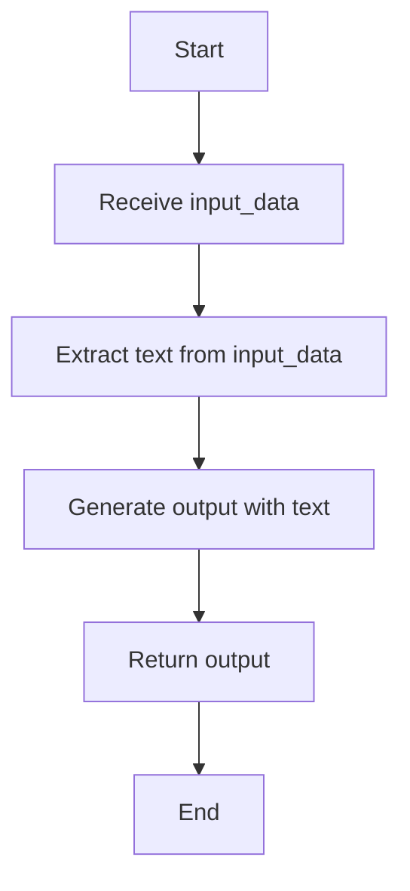
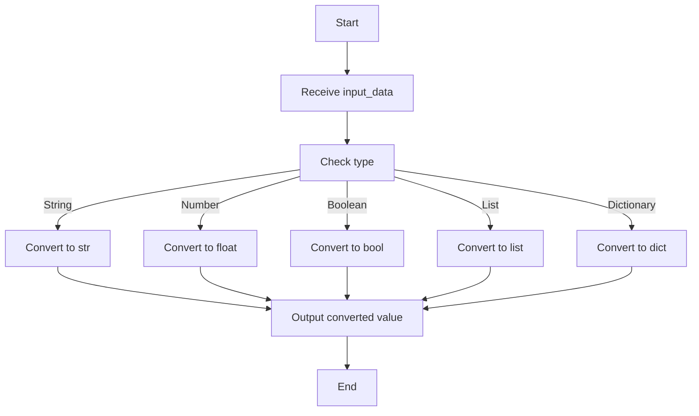
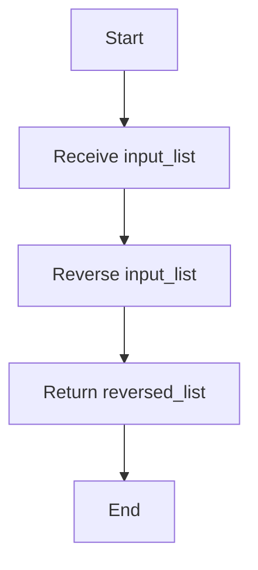

# `.\AutoGPT\autogpt_platform\backend\backend\blocks\basic.py` 详细设计文档

This code defines a set of blocks for a workflow management system, each with specific functionalities such as file storage, value storage, console output, note annotation, type conversion, and list reversal.

## 整体流程



## 类结构

```
FileStoreBlock
├── Input
│   ├── file_in
│   └── base_64
└── Output
    └── file_out
StoreValueBlock
├── Input
│   ├── input
│   └── data
└── Output
    └── output
PrintToConsoleBlock
├── Input
│   └── text
└── Output
    ├── output
    └── status
NoteBlock
├── Input
│   └── text
└── Output
    └── output
UniversalTypeConverterBlock
├── Input
│   ├── value
│   └── type
└── Output
    └── value
ReverseListOrderBlock
├── Input
│   └── input_list
└── Output
    └── reversed_list
```

## 全局变量及字段


### `file_in`
    
The file to download and store. Can be a URL (https://...), data URI, or local path.

类型：`MediaFileType`
    


### `base_64`
    
Whether to produce output in base64 format (not recommended, you can pass the file reference across blocks).

类型：`bool`
    


### `input`
    
Trigger the block to produce the output. The value is only used when `data` is None.

类型：`Any`
    


### `data`
    
The constant data to be retained in the block. This value is passed as `output`.

类型：`Any`
    


### `text`
    
The data to print to the console.

类型：`str`
    


### `value`
    
The value to convert to a universal type.

类型：`Any`
    


### `type`
    
The type to convert the value to.

类型：`TypeOptions`
    


### `input_list`
    
The list to reverse

类型：`list[Any]`
    


### `FileStoreBlock.file_in`
    
The file to download and store. Can be a URL (https://...), data URI, or local path.

类型：`MediaFileType`
    


### `FileStoreBlock.base_64`
    
Whether to produce output in base64 format (not recommended, you can pass the file reference across blocks).

类型：`bool`
    


### `StoreValueBlock.input`
    
Trigger the block to produce the output. The value is only used when `data` is None.

类型：`Any`
    


### `StoreValueBlock.data`
    
The constant data to be retained in the block. This value is passed as `output`.

类型：`Any`
    


### `PrintToConsoleBlock.text`
    
The data to print to the console.

类型：`str`
    


### `UniversalTypeConverterBlock.value`
    
The value to convert to a universal type.

类型：`Any`
    


### `UniversalTypeConverterBlock.type`
    
The type to convert the value to.

类型：`TypeOptions`
    


### `ReverseListOrderBlock.input_list`
    
The list to reverse

类型：`list[Any]`
    
    

## 全局函数及方法


### `FileStoreBlock.run`

This method is responsible for downloading and storing a file from a URL, data URI, or local path.

参数：

- `input_data`：`Input`，The input data for the block, containing the file to download and store.
- `execution_context`：`ExecutionContext`，The execution context for the block.

返回值：`BlockOutput`，The output of the block, containing the reference to the stored file.

#### 流程图



#### 带注释源码

```python
async def run(
    self,
    input_data: Input,
    *,
    execution_context: ExecutionContext,
    **kwargs,
) -> BlockOutput:
    # Determine return format based on user preference
    # for_external_api: always returns data URI (base64) - honors "Produce Base64 Output"
    # for_block_output: smart format - workspace:// in CoPilot, data URI in graphs
    return_format = "for_external_api" if input_data.base_64 else "for_block_output"

    yield "file_out", await store_media_file(
        file=input_data.file_in,
        execution_context=execution_context,
        return_format=return_format,
    )
```


### convert

This function is a utility function used to convert a value to a specified type.

参数：

- `value`：`Any`，The value to convert.
- `type`：`TypeOptions`，The type to convert the value to.

返回值：`Any`，The converted value.

#### 流程图



#### 带注释源码

```python
def convert(value: Any, type: TypeOptions) -> Any:
    try:
        converted_value = {
            TypeOptions.STRING: str,
            TypeOptions.NUMBER: float,
            TypeOptions.BOOLEAN: bool,
            TypeOptions.LIST: list,
            TypeOptions.DICTIONARY: dict,
        }[type](value)
        return converted_value
    except Exception as e:
        raise Exception(f"Failed to convert value: {str(e)}")
```


### FileStoreBlock.run

This method is responsible for downloading and storing a file from a URL, data URI, or local path. It determines the return format based on user preference and yields the reference to the stored file.

参数：

- `input_data`：`Input`，The input data containing the file to download and store.
- `execution_context`：`ExecutionContext`，The execution context for the block.

返回值：`BlockOutput`，The output containing the reference to the stored file.

#### 流程图



#### 带注释源码

```python
async def run(self, input_data: Input, *, execution_context: ExecutionContext, **kwargs) -> BlockOutput:
    # Determine return format based on user preference
    # for_external_api: always returns data URI (base64) - honors "Produce Base64 Output"
    # for_block_output: smart format - workspace:// in CoPilot, data URI in graphs
    return_format = "for_external_api" if input_data.base_64 else "for_block_output"

    yield "file_out", await store_media_file(
        file=input_data.file_in,
        execution_context=execution_context,
        return_format=return_format,
    )
```


### StoreValueBlock.run

This method runs the StoreValueBlock, which stores and forwards a value throughout workflows, allowing it to be reused without changes across multiple blocks.

参数：

- `input_data`：`Input`，The input data for the block, which includes the `input` and `data` fields.

返回值：`BlockOutput`，The output of the block, which is the stored data retained in the block.

#### 流程图



#### 带注释源码

```python
async def run(self, input_data: Input, **kwargs) -> BlockOutput:
    # Check if data is provided
    yield "output", input_data.data or input_data.input
```


### PrintToConsoleBlock.run

This method prints the provided text to the console for monitoring and troubleshooting workflow execution.

参数：

- `input_data.text`：`Any`，The data to print to the console.

返回值：`Any`，The data printed to the console.

#### 流程图



#### 带注释源码

```python
async def run(self, input_data: Input, **kwargs) -> BlockOutput:
    yield "output", input_data.text
    yield "status", "printed"
```


### NoteBlock.run

This method is used to display a sticky note in the workflow editor with the provided text.

参数：

- `input_data`：`Input`，The text to display in the sticky note.

返回值：`BlockOutput`，The text to display in the sticky note.

#### 流程图



#### 带注释源码

```python
async def run(self, input_data: Input, **kwargs) -> BlockOutput:
    # Extract the text from the input data
    text = input_data.text
    
    # Generate the output with the text
    output = BlockOutput(output=text)
    
    # Return the output
    yield "output", output
```


### UniversalTypeConverterBlock.run

This method is used to convert a value to a specified universal type.

参数：

- `input_data`：`Input`，The input data containing the value to convert and the type to convert to.
- `**kwargs`：Any additional keyword arguments.

返回值：`BlockOutput`，The converted value.

#### 流程图



#### 带注释源码

```python
async def run(self, input_data: Input, **kwargs) -> BlockOutput:
    try:
        converted_value = convert(
            input_data.value,
            {
                TypeOptions.STRING: str,
                TypeOptions.NUMBER: float,
                TypeOptions.BOOLEAN: bool,
                TypeOptions.LIST: list,
                TypeOptions.DICTIONARY: dict,
            }[input_data.type],
        )
        yield "value", converted_value
    except Exception as e:
        yield "error", f"Failed to convert value: {str(e)}"
```


### ReverseListOrderBlock.run

This method reverses the order of elements in a list.

参数：

- `input_list`：`list[Any]`，The list to reverse

返回值：`list[Any]`，The list in reversed order

#### 流程图



#### 带注释源码

```python
async def run(self, input_data: Input, **kwargs) -> BlockOutput:
    reversed_list = list(input_data.input_list)
    reversed_list.reverse()
    yield "reversed_list", reversed_list
```


## 关键组件


### 张量索引与惰性加载

张量索引与惰性加载是代码中处理数据结构的核心组件，用于高效地访问和操作大型数据集。

### 反量化支持

反量化支持是代码中用于处理量化数据的核心组件，确保数据在量化过程中的准确性和效率。

### 量化策略

量化策略是代码中用于优化数据存储和计算的核心组件，通过调整数据精度来减少资源消耗。


## 问题及建议


### 已知问题

-   **全局变量和函数的缺失**：代码中没有使用全局变量或全局函数，这可能导致代码的可重用性和模块化程度较低。
-   **异常处理**：代码中在`UniversalTypeConverterBlock`的`run`方法中使用了简单的异常捕获，但没有提供详细的错误信息或恢复机制。
-   **代码复用**：一些功能，如文件存储和类型转换，在多个块中重复实现，可以考虑提取为共享函数或类以减少代码冗余。

### 优化建议

-   **引入全局变量和函数**：对于一些通用的功能，如日志记录或配置管理，可以考虑引入全局变量或函数以提高代码的可维护性和可重用性。
-   **增强异常处理**：在异常处理中，可以提供更详细的错误信息，并考虑实现错误恢复机制，例如重试逻辑或错误日志记录。
-   **提取共享功能**：将重复的功能，如文件存储和类型转换，提取为共享函数或类，可以减少代码冗余并提高代码的可维护性。
-   **代码注释和文档**：增加代码注释和文档，以帮助其他开发者理解代码的功能和结构。
-   **单元测试**：为每个块编写单元测试，以确保代码的正确性和稳定性。
-   **性能优化**：对于性能敏感的部分，如文件操作和类型转换，可以考虑进行性能优化，例如使用缓存或更高效的算法。


## 其它


### 设计目标与约束

- 设计目标：
  - 提供一组基础块，用于构建复杂的流程和工作流。
  - 确保块之间的数据传递和交互简单直观。
  - 提供灵活的数据转换和格式化选项。
  - 确保块的可重用性和可维护性。

- 约束：
  - 块必须遵循统一的接口和规范。
  - 块的实现应尽可能高效，以适应实时工作流。
  - 块应提供适当的错误处理和异常管理机制。

### 错误处理与异常设计

- 错误处理：
  - 每个块应捕获并处理可能发生的异常。
  - 异常信息应包含足够的信息，以便于调试和问题追踪。
  - 异常处理应遵循统一的错误响应格式。

- 异常设计：
  - 定义一组预定义的异常类型，用于表示不同的错误情况。
  - 异常类型应具有明确的语义，以便于用户理解错误原因。

### 数据流与状态机

- 数据流：
  - 数据流应遵循块之间的输入和输出接口。
  - 数据流应支持异步处理，以提高效率。

- 状态机：
  - 每个块可以被视为状态机，具有不同的状态和转换。
  - 状态机的设计应确保块的稳定性和可预测性。

### 外部依赖与接口契约

- 外部依赖：
  - 明确列出所有外部依赖项，包括库、服务和API。
  - 确保外部依赖项的版本兼容性。

- 接口契约：
  - 定义清晰的接口契约，包括输入、输出和错误处理。
  - 确保接口契约的一致性和稳定性。


    