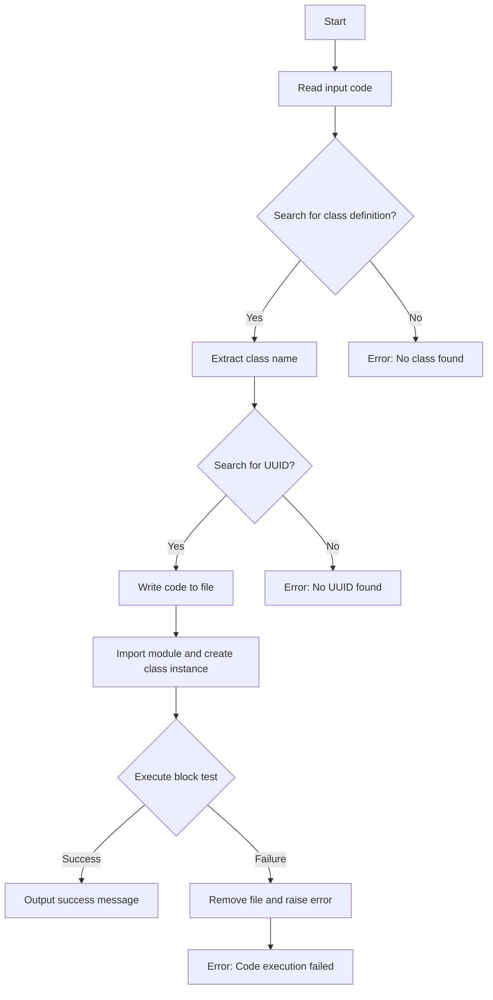
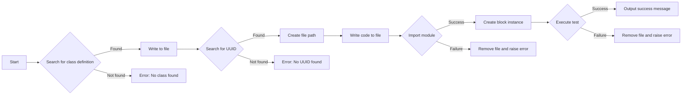
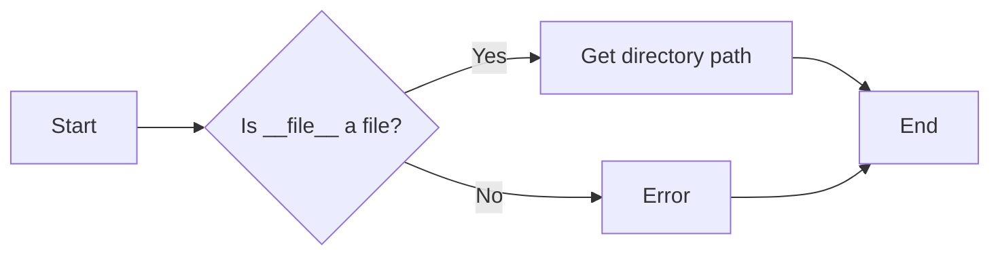
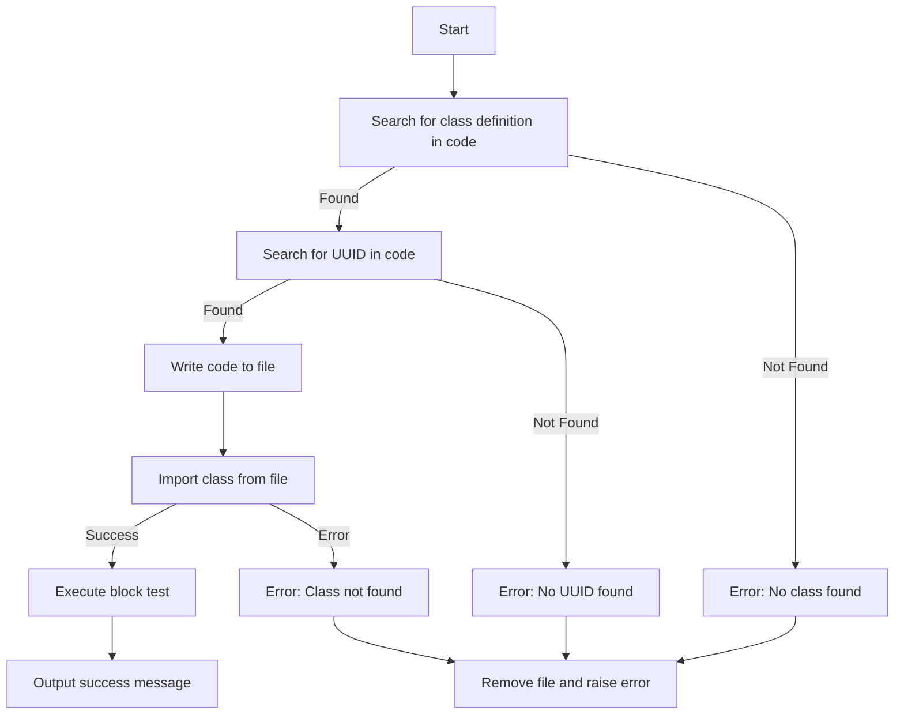
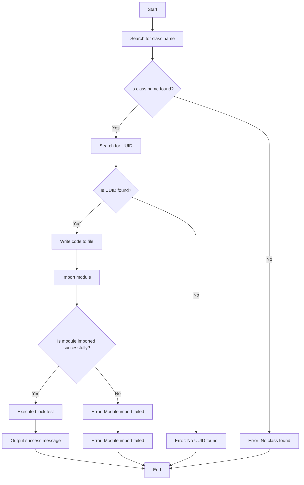
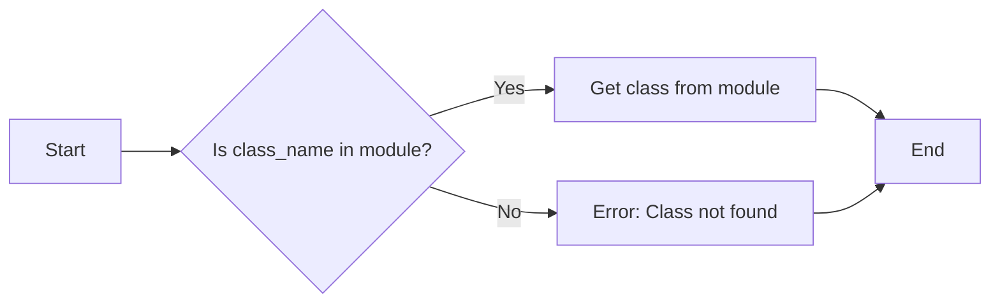
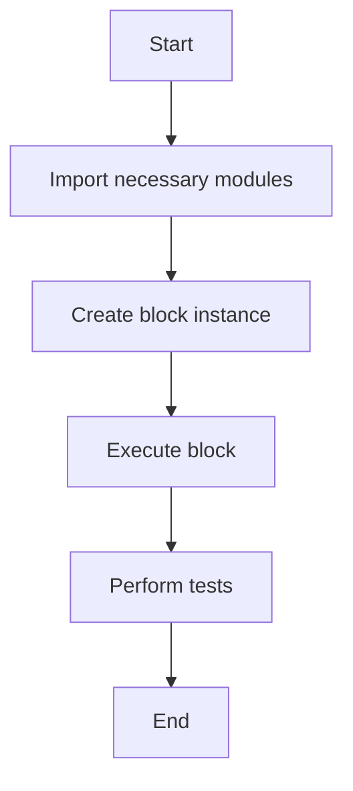
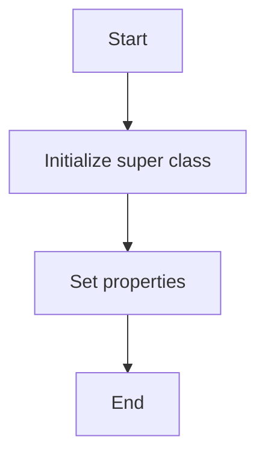
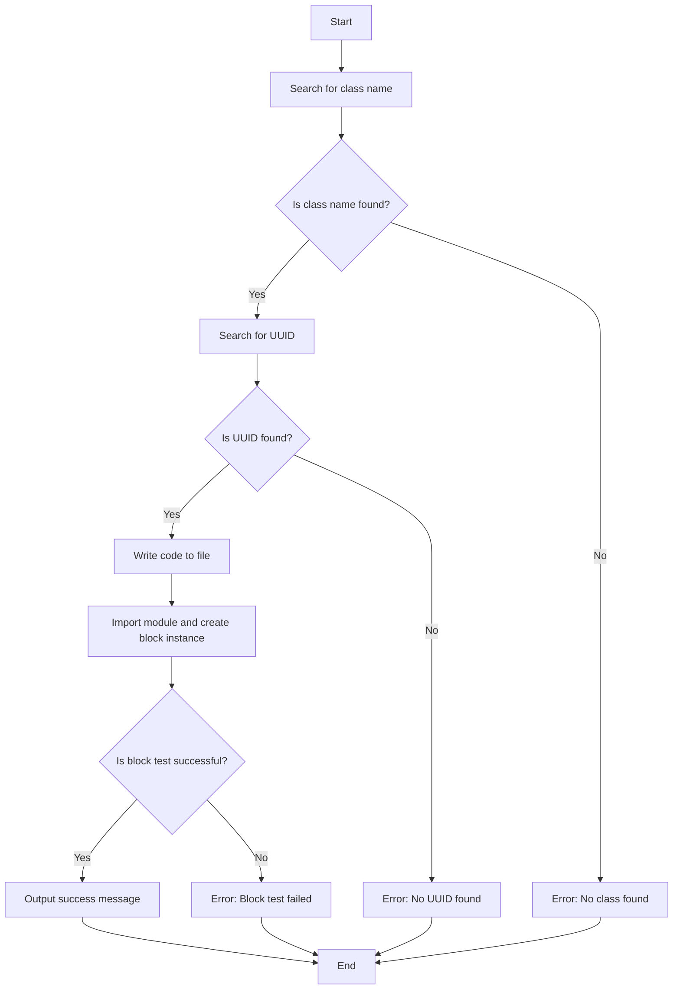

# `.\AutoGPT\autogpt_platform\backend\backend\blocks\block.py` 详细设计文档

The code allows the verification and installation of other blocks in the system by executing Python code provided as input.

## 整体流程



## 类结构

```
BlockInstallationBlock (Concrete Block)
├── Input (Class SchemaInput)
│   ├── code (str)
└── Output (Class SchemaOutput)
    ├── success (str)
    └── error (str)
```

## 全局变量及字段


### `id`
    
Unique identifier for the block installation block.

类型：`str`
    


### `description`
    
Description of the block installation block.

类型：`str`
    


### `categories`
    
Set of categories the block installation block belongs to.

类型：`set`
    


### `input_schema`
    
Input schema for the block installation block.

类型：`BlockSchemaInput`
    


### `output_schema`
    
Output schema for the block installation block.

类型：`BlockSchemaOutput`
    


### `disabled`
    
Flag indicating whether the block installation block is disabled or not.

类型：`bool`
    


### `code`
    
Python code of the block to be installed.

类型：`str`
    


### `success`
    
Success message if the block is installed successfully.

类型：`str`
    


### `error`
    
Error message if the block installation fails.

类型：`str`
    


### `BlockInstallationBlock.id`
    
Unique identifier for the block installation block.

类型：`str`
    


### `BlockInstallationBlock.description`
    
Description of the block installation block.

类型：`str`
    


### `BlockInstallationBlock.categories`
    
Set of categories the block installation block belongs to.

类型：`set`
    


### `BlockInstallationBlock.input_schema`
    
Input schema for the block installation block.

类型：`BlockSchemaInput`
    


### `BlockInstallationBlock.output_schema`
    
Output schema for the block installation block.

类型：`BlockSchemaOutput`
    


### `BlockInstallationBlock.disabled`
    
Flag indicating whether the block installation block is disabled or not.

类型：`bool`
    


### `Input.code`
    
Python code of the block to be installed.

类型：`str`
    


### `Output.success`
    
Success message if the block is installed successfully.

类型：`str`
    


### `Output.error`
    
Error message if the block installation fails.

类型：`str`
    
    

## 全局函数及方法


### `BlockInstallationBlock.run`

This method runs the installation process for a block given a code string. It searches for a class definition within the code, writes it to a file, imports the class, and executes a test on the block.

参数：

- `input_data`：`Input`，The input data containing the code to be installed.
- `**kwargs`：`Any`，Additional keyword arguments that may be passed to the method.

返回值：`BlockOutput`，The output of the block installation process, which includes a success message or an error message.

#### 流程图



#### 带注释源码

```python
async def run(self, input_data: Input, **kwargs) -> BlockOutput:
    code = input_data.code

    if search := re.search(r"class (\w+)\(Block\):", code):
        class_name = search.group(1)
    else:
        raise RuntimeError("No class found in the code.")

    if search := re.search(r"id=\"(\w+-\w+-\w+-\w+-\w+)\"", code):
        file_name = search.group(1)
    else:
        raise RuntimeError("No UUID found in the code.")

    block_dir = os.path.dirname(__file__)
    file_path = f"{block_dir}/{file_name}.py"
    module_name = f"backend.blocks.{file_name}"
    with open(file_path, "w") as f:
        f.write(code)

    try:
        module = __import__(module_name, fromlist=[class_name])
        block_class: Type[Block] = getattr(module, class_name)
        block = block_class()

        from backend.util.test import execute_block_test

        await execute_block_test(block)
        yield "success", "Block installed successfully."
    except Exception as e:
        os.remove(file_path)
        raise RuntimeError(f"[Code]\n{code}\n\n[Error]\n{str(e)}")
```


### os.path.dirname(__file__)

获取当前文件的目录路径。

参数：

- `__file__`：`str`，当前文件的路径。

返回值：`str`，当前文件的目录路径。

#### 流程图



#### 带注释源码

```python
import os

def os_path_dirname(file_path: str) -> str:
    """
    Get the directory path of the given file path.

    :param file_path: str, the path of the file
    :return: str, the directory path of the file
    """
    return os.path.dirname(file_path)
```


### `BlockInstallationBlock.run`

This method runs the installation process for a block given a code string. It searches for a class definition within the code, writes it to a file, imports the class, and executes a test on the block.

参数：

- `input_data`：`Input`，The input data containing the code to be installed.
- `**kwargs`：`Any`，Additional keyword arguments that may be passed to the method.

返回值：`BlockOutput`，The output of the block installation process, which includes a success message or an error message.

#### 流程图



#### 带注释源码

```python
async def run(self, input_data: Input, **kwargs) -> BlockOutput:
    code = input_data.code

    if search := re.search(r"class (\w+)\(Block\):", code):
        class_name = search.group(1)
    else:
        raise RuntimeError("No class found in the code.")

    if search := re.search(r"id=\"(\w+-\w+-\w+-\w+-\w+)\"", code):
        file_name = search.group(1)
    else:
        raise RuntimeError("No UUID found in the code.")

    block_dir = os.path.dirname(__file__)
    file_path = f"{block_dir}/{file_name}.py"
    module_name = f"backend.blocks.{file_name}"
    with open(file_path, "w") as f:
        f.write(code)

    try:
        module = __import__(module_name, fromlist=[class_name])
        block_class: Type[Block] = getattr(module, class_name)
        block = block_class()

        from backend.util.test import execute_block_test

        await execute_block_test(block)
        yield "success", "Block installed successfully."
    except Exception as e:
        os.remove(file_path)
        raise RuntimeError(f"[Code]\n{code}\n\n[Error]\n{str(e)}")
```


### `BlockInstallationBlock.run`

This method runs the `BlockInstallationBlock` class, which is responsible for verifying and installing a block code into the system.

参数：

- `input_data`：`Input`，The input data containing the Python code of the block to be installed.

返回值：`BlockOutput`，The output containing the success or error message after the block installation.

#### 流程图



#### 带注释源码

```python
async def run(self, input_data: Input, **kwargs) -> BlockOutput:
    code = input_data.code

    if search := re.search(r"class (\w+)\(Block\):", code):
        class_name = search.group(1)
    else:
        raise RuntimeError("No class found in the code.")

    if search := re.search(r"id=\"(\w+-\w+-\w+-\w+-\w+)\"", code):
        file_name = search.group(1)
    else:
        raise RuntimeError("No UUID found in the code.")

    block_dir = os.path.dirname(__file__)
    file_path = f"{block_dir}/{file_name}.py"
    module_name = f"backend.blocks.{file_name}"
    with open(file_path, "w") as f:
        f.write(code)

    try:
        module = __import__(module_name, fromlist=[class_name])
        block_class: Type[Block] = getattr(module, class_name)
        block = block_class()

        from backend.util.test import execute_block_test

        await execute_block_test(block)
        yield "success", "Block installed successfully."
    except Exception as e:
        os.remove(file_path)
        raise RuntimeError(f"[Code]\n{code}\n\n[Error]\n{str(e)}")
```


### getattr(module, class_name)

获取模块中指定名称的类。

参数：

- `module`：`Module`，模块对象，表示导入的模块。
- `class_name`：`str`，类名，指定要获取的类的名称。

参数描述：

- `module`：指定要从中获取类的模块对象。
- `class_name`：指定要获取的类的名称。

返回值：`Type[Block]`，类类型，表示获取到的类。

返回值描述：

- 返回指定模块中指定名称的类。

#### 流程图



#### 带注释源码

```python
try:
    module = __import__(module_name, fromlist=[class_name])
    block_class: Type[Block] = getattr(module, class_name)
    block = block_class()
    from backend.util.test import execute_block_test
    await execute_block_test(block)
    yield "success", "Block installed successfully."
except Exception as e:
    os.remove(file_path)
    raise RuntimeError(f"[Code]\n{code}\n\n[Error]\n{str(e)}")
```


### `execute_block_test`

This function is designed to execute a block instance and perform tests on it.

参数：

- `block`：`Block`，The block instance to be tested.
- ...

返回值：`None`，This function does not return a value but performs tests on the block instance.

#### 流程图



#### 带注释源码

```python
from backend.util.test import execute_block_test

async def execute_block_test(block: Block):
    # This is a placeholder for the actual test implementation.
    # The actual implementation would depend on the specific tests required for the block.
    pass
```

Note: The actual implementation of `execute_block_test` is not provided in the given code snippet, so the source code is a placeholder indicating where the test logic would be implemented.


### BlockInstallationBlock.__init__

This method initializes the BlockInstallationBlock class, setting up its properties and configurations.

参数：

- `self`：`BlockInstallationBlock`，The instance of the BlockInstallationBlock class.

返回值：无

#### 流程图



#### 带注释源码

```python
def __init__(self):
    super().__init__(
        id="45e78db5-03e9-447f-9395-308d712f5f08",
        description="Given a code string, this block allows the verification and installation of a block code into the system.",
        categories={BlockCategory.BASIC},
        input_schema=BlockInstallationBlock.Input,
        output_schema=BlockInstallationBlock.Output,
        disabled=True,
    )
```


### BlockInstallationBlock.run

This method runs the `run` method of the `BlockInstallationBlock` class, which is responsible for verifying and installing a block code into the system.

参数：

- `input_data`：`Input`，The input data containing the Python code of the block to be installed.

返回值：`BlockOutput`，The output containing the success or error message after the block installation process.

#### 流程图



#### 带注释源码

```python
async def run(self, input_data: Input, **kwargs) -> BlockOutput:
    code = input_data.code

    if search := re.search(r"class (\w+)\(Block\):", code):
        class_name = search.group(1)
    else:
        raise RuntimeError("No class found in the code.")

    if search := re.search(r"id=\"(\w+-\w+-\w+-\w+-\w+)\"", code):
        file_name = search.group(1)
    else:
        raise RuntimeError("No UUID found in the code.")

    block_dir = os.path.dirname(__file__)
    file_path = f"{block_dir}/{file_name}.py"
    module_name = f"backend.blocks.{file_name}"
    with open(file_path, "w") as f:
        f.write(code)

    try:
        module = __import__(module_name, fromlist=[class_name])
        block_class: Type[Block] = getattr(module, class_name)
        block = block_class()

        from backend.util.test import execute_block_test

        await execute_block_test(block)
        yield "success", "Block installed successfully."
    except Exception as e:
        os.remove(file_path)
        raise RuntimeError(f"[Code]\n{code}\n\n[Error]\n{str(e)}")
```


## 关键组件


### 张量索引与惰性加载

支持对张量的索引操作，并在需要时才加载张量数据，以优化内存使用和性能。

### 反量化支持

提供对反量化操作的支持，允许在量化过程中进行逆量化处理。

### 量化策略

实现多种量化策略，以适应不同的应用场景和性能需求。


## 问题及建议


### 已知问题

-   **安全风险**：该代码允许远程代码执行，这是一个严重的安全风险，因为它允许用户上传任意代码到服务器上执行。这应该仅限于开发环境，并且需要严格的权限控制。
-   **错误处理**：异常处理不够详细，仅捕获了通用异常，没有针对特定错误进行捕获和处理，这可能导致难以调试的问题。
-   **文件操作**：在发生异常时，代码尝试删除文件，但如果没有成功导入模块，则文件可能不会被删除，导致文件残留。
-   **代码重复**：`search`变量在代码中被重复使用，这可能导致逻辑错误，如果`search`未成功执行，后续代码可能会尝试访问未定义的属性。

### 优化建议

-   **安全措施**：移除或限制远程代码执行功能，或者确保只有经过验证的用户才能使用此功能。
-   **详细错误处理**：增加针对特定错误的异常处理，例如，如果无法找到类或UUID，则抛出更具体的异常。
-   **文件清理**：确保在所有异常路径中都有适当的文件清理逻辑，避免文件残留。
-   **代码重构**：避免代码重复，使用更清晰和一致的方法来处理搜索和异常。
-   **日志记录**：增加日志记录，以便在发生错误时提供更多上下文信息，有助于调试和问题追踪。
-   **单元测试**：为该功能编写单元测试，以确保在各种情况下都能正确处理。


## 其它


### 设计目标与约束

- 设计目标：
  - 实现一个模块，用于验证和安装系统中的其他模块。
  - 确保代码的安全性，仅限于开发环境使用。
- 约束条件：
  - 代码安装过程应避免潜在的安全风险。
  - 代码安装应支持Python代码块。
  - 代码安装应记录成功或失败的消息。

### 错误处理与异常设计

- 错误处理：
  - 如果代码中没有找到类定义，抛出`RuntimeError`。
  - 如果代码中没有找到UUID，抛出`RuntimeError`。
  - 如果文件写入失败，抛出`IOError`。
  - 如果模块导入失败，抛出`ImportError`。
  - 如果代码执行测试失败，抛出`RuntimeError`。
- 异常设计：
  - 使用`try-except`块捕获并处理可能发生的异常。
  - 在异常信息中包含错误代码和错误描述，以便于调试。

### 数据流与状态机

- 数据流：
  - 输入：包含Python代码的字符串。
  - 处理：解析代码，生成文件路径，写入文件，导入模块，执行测试。
  - 输出：成功或失败的消息。
- 状态机：
  - 初始状态：等待输入。
  - 处理状态：解析代码，执行安装。
  - 成功状态：输出成功消息。
  - 失败状态：输出错误消息。

### 外部依赖与接口契约

- 外部依赖：
  - `os`：用于文件操作。
  - `re`：用于正则表达式匹配。
  - `backend.data.block`：用于块的数据结构。
  - `backend.data.model`：用于模型字段。
  - `backend.util.test`：用于执行代码测试。
- 接口契约：
  - `Block`：块的基本接口。
  - `BlockSchemaInput`：输入数据结构。
  - `BlockSchemaOutput`：输出数据结构。
  - `execute_block_test`：执行代码测试的函数。

    