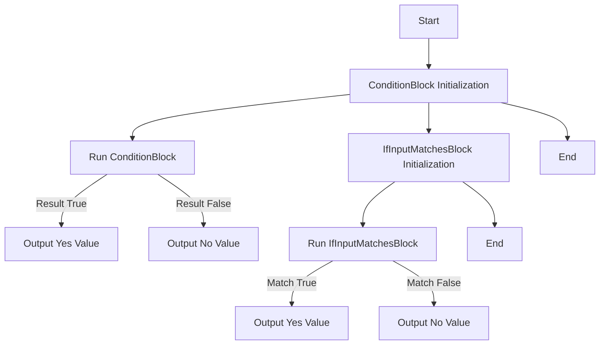
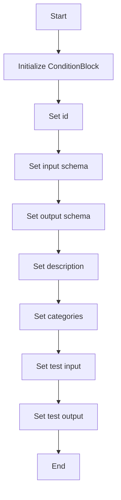
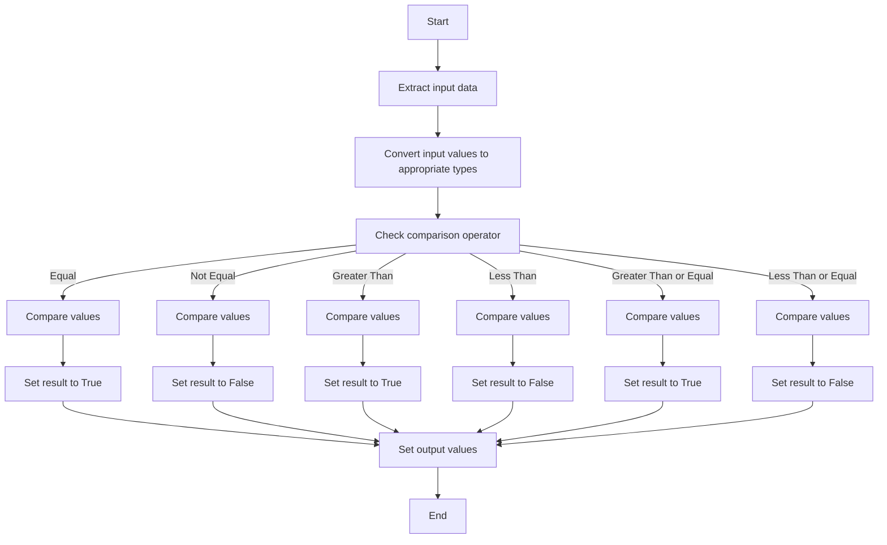
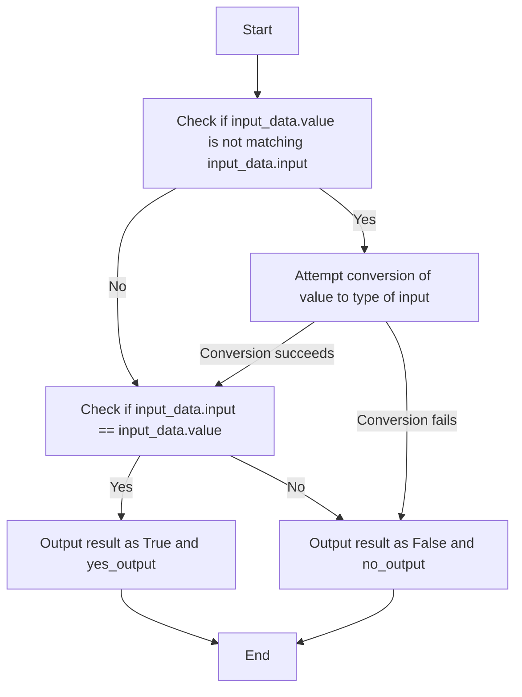

# `.\AutoGPT\autogpt_platform\backend\backend\blocks\branching.py` 详细设计文档

This code defines two classes for handling conditional logic in a data processing pipeline, using comparison operators and matching input values.

## 整体流程



## 类结构

```
Block (抽象基类)
├── ConditionBlock
│   ├── Input (内部类)
│   ├── Output (内部类)
└── IfInputMatchesBlock
    ├── Input (内部类)
    └── Output (内部类)
```

## 全局变量及字段


### `id`
    
Unique identifier for the ConditionBlock instance

类型：`str`
    


### `input_schema`
    
Schema for the input data of the ConditionBlock

类型：`BlockSchemaInput`
    


### `output_schema`
    
Schema for the output data of the ConditionBlock

类型：`BlockSchemaOutput`
    


### `description`
    
Description of the ConditionBlock's functionality

类型：`str`
    


### `categories`
    
Set of categories that the ConditionBlock belongs to

类型：`set`
    


### `test_input`
    
Test input data for the ConditionBlock

类型：`dict`
    


### `test_output`
    
Test output data for the ConditionBlock

类型：`list`
    


### `value1`
    
First value for comparison

类型：`Any`
    


### `operator`
    
Comparison operator to use

类型：`ComparisonOperator`
    


### `value2`
    
Second value for comparison

类型：`Any`
    


### `yes_value`
    
Value to output if the condition is true

类型：`Any`
    


### `no_value`
    
Value to output if the condition is false

类型：`Any`
    


### `result`
    
Result of the condition evaluation

类型：`bool`
    


### `yes_output`
    
Output value if the condition is true

类型：`Any`
    


### `no_output`
    
Output value if the condition is false

类型：`Any`
    


### `input`
    
Input to match against

类型：`Any`
    


### `value`
    
Value to output if the input matches

类型：`Any`
    


### `yes_value`
    
Value to output if the input matches

类型：`Any`
    


### `no_value`
    
Value to output if the input does not match

类型：`Any`
    


### `ConditionBlock.id`
    
Unique identifier for the ConditionBlock instance

类型：`str`
    


### `ConditionBlock.input_schema`
    
Schema for the input data of the ConditionBlock

类型：`BlockSchemaInput`
    


### `ConditionBlock.output_schema`
    
Schema for the output data of the ConditionBlock

类型：`BlockSchemaOutput`
    


### `ConditionBlock.description`
    
Description of the ConditionBlock's functionality

类型：`str`
    


### `ConditionBlock.categories`
    
Set of categories that the ConditionBlock belongs to

类型：`set`
    


### `ConditionBlock.test_input`
    
Test input data for the ConditionBlock

类型：`dict`
    


### `ConditionBlock.test_output`
    
Test output data for the ConditionBlock

类型：`list`
    


### `ConditionBlock.Input.value1`
    
First value for comparison

类型：`Any`
    


### `ConditionBlock.Input.operator`
    
Comparison operator to use

类型：`ComparisonOperator`
    


### `ConditionBlock.Input.value2`
    
Second value for comparison

类型：`Any`
    


### `ConditionBlock.Input.yes_value`
    
Value to output if the condition is true

类型：`Any`
    


### `ConditionBlock.Input.no_value`
    
Value to output if the condition is false

类型：`Any`
    


### `ConditionBlock.Output.result`
    
Result of the condition evaluation

类型：`bool`
    


### `ConditionBlock.Output.yes_output`
    
Output value if the condition is true

类型：`Any`
    


### `ConditionBlock.Output.no_output`
    
Output value if the condition is false

类型：`Any`
    


### `IfInputMatchesBlock.Input.input`
    
Input to match against

类型：`Any`
    


### `IfInputMatchesBlock.Input.value`
    
Value to output if the input matches

类型：`Any`
    


### `IfInputMatchesBlock.Input.yes_value`
    
Value to output if the input matches

类型：`Any`
    


### `IfInputMatchesBlock.Input.no_value`
    
Value to output if the input does not match

类型：`Any`
    
    

## 全局函数及方法


### ConditionBlock.__init__

This method initializes a ConditionBlock instance with the necessary schema and configuration.

参数：

- `id`: `str`，The unique identifier for the block.
- `input_schema`: `BlockSchemaInput`，The schema for the input data.
- `output_schema`: `BlockSchemaOutput`，The schema for the output data.
- `description`: `str`，A description of the block's functionality.
- `categories`: `set`，A set of categories that the block belongs to.
- `test_input`: `dict`，A sample input data for testing the block.
- `test_output`: `list`，A sample output data for testing the block.

返回值：`None`，This method does not return any value.

#### 流程图



#### 带注释源码

```python
def __init__(self, id: str, input_schema: BlockSchemaInput, output_schema: BlockSchemaOutput, description: str, categories: set, test_input: dict, test_output: list):
    super().__init__(
        id=id,
        input_schema=input_schema,
        output_schema=output_schema,
        description=description,
        categories=categories,
        test_input=test_input,
        test_output=test_output,
    )
```


### ConditionBlock.run

This method evaluates a condition based on comparison operators and yields the result along with the corresponding output values.

参数：

- `input_data`：`Input`，The input data containing the values and comparison operator for the condition.

返回值：`BlockOutput`，The output data containing the result of the condition evaluation and the corresponding output values.

#### 流程图



#### 带注释源码

```python
async def run(self, input_data: Input, **kwargs) -> BlockOutput:
    operator = input_data.operator

    value1 = input_data.value1
    if isinstance(value1, str):
        try:
            value1 = float(value1.strip())
        except ValueError:
            value1 = value1.strip()

    value2 = input_data.value2
    if isinstance(value2, str):
        try:
            value2 = float(value2.strip())
        except ValueError:
            value2 = value2.strip()

    yes_value = input_data.yes_value if input_data.yes_value is not None else value1
    no_value = input_data.no_value if input_data.no_value is not None else value2

    comparison_funcs = {
        ComparisonOperator.EQUAL: lambda a, b: a == b,
        ComparisonOperator.NOT_EQUAL: lambda a, b: a != b,
        ComparisonOperator.GREATER_THAN: lambda a, b: a > b,
        ComparisonOperator.LESS_THAN: lambda a, b: a < b,
        ComparisonOperator.GREATER_THAN_OR_EQUAL: lambda a, b: a >= b,
        ComparisonOperator.LESS_THAN_OR_EQUAL: lambda a, b: a <= b,
    }

    try:
        result = comparison_funcs[operator](value1, value2)
    except Exception as e:
        raise ValueError(f"Comparison failed: {e}") from e

    yield "result", result

    if result:
        yield "yes_output", yes_value
    else:
        yield "no_output", no_value
```


### IfInputMatchesBlock.__init__

This method initializes the `IfInputMatchesBlock` class, setting up its schema, description, categories, and test input/output data.

参数：

- `id`: `str`，The unique identifier for the block.
- `input_schema`: `BlockSchemaInput`，The schema for the input data of the block.
- `output_schema`: `BlockSchemaOutput`，The schema for the output data of the block.
- `description`: `str`，A description of the block's functionality.
- `categories`: `set`，A set of categories that the block belongs to.
- `test_input`: `dict` or `list`，Test input data for the block.
- `test_output`: `list`，Test output data for the block.

返回值：无

#### 流程图

```mermaid
classDiagram
    IfInputMatchesBlock <|-- Input: input schema
    IfInputMatchesBlock <|-- Output: output schema
    IfInputMatchesBlock <|-- Block: base class
    IfInputMatchesBlock {
        id
        input_schema
        output_schema
        description
        categories
        test_input
        test_output
    }
```

#### 带注释源码

```python
def __init__(self):
    super().__init__(
        id="6dbbc4b3-ca6c-42b6-b508-da52d23e13f2",
        input_schema=IfInputMatchesBlock.Input,
        output_schema=IfInputMatchesBlock.Output,
        description="Handles conditional logic based on comparison operators",
        categories={BlockCategory.LOGIC},
        test_input=[
            {
                "input": 10,
                "value": 10,
                "yes_value": "Greater",
                "no_value": "Not greater",
            },
            {
                "input": 10,
                "value": 20,
                "yes_value": "Greater",
                "no_value": "Not greater",
            },
            {
                "input": 10,
                "value": "None",
                "yes_value": "Yes",
                "no_value": "No",
            },
        ],
        test_output=[
            ("result", True),
            ("yes_output", "Greater"),
            ("result", False),
            ("no_output", "Not greater"),
            ("result", False),
            ("no_output", "No"),
            # ("result", True),
            # ("yes_output", "Yes"),
        ],
    )
```


### IfInputMatchesBlock.run

This method handles conditional logic based on comparison operators, checking if the input matches a specified value and yielding the appropriate output.

参数：

- `input_data`：`Input`，The input data containing the input to match against, the value to output if the input matches, and the value to output if the input does not match.

返回值：`BlockOutput`，The output data containing the result of the condition evaluation (True or False), the output value if the condition is true, and the output value if the condition is false.

#### 流程图



#### 带注释源码

```python
async def run(self, input_data: Input, **kwargs) -> BlockOutput:
    # If input_data.value is not matching input_data.input, convert value to type of input
    if (
        input_data.input != input_data.value
        and input_data.input is not input_data.value
    ):
        try:
            # Only attempt conversion if input is not None and value is not None
            if input_data.input is not None and input_data.value is not None:
                input_type = type(input_data.input)
                # Avoid converting if input_type is Any or object
                if input_type not in (Any, object):
                    input_data.value = convert(input_data.value, input_type)
        except Exception:
            pass  # If conversion fails, just leave value as is

    if input_data.input == input_data.value:
        yield "result", True
        yield "yes_output", input_data.yes_value
    else:
        yield "result", False
        yield "no_output", input_data.no_value
```


## 关键组件


### 张量索引与惰性加载

张量索引与惰性加载是代码中处理数据块和模型数据的关键组件，它允许在处理大型数据集时只加载所需的部分，从而提高效率和性能。

### 反量化支持

反量化支持是代码中用于处理量化数据的关键组件，它允许在量化过程中将数据转换回原始精度，以便进行进一步的处理或分析。

### 量化策略

量化策略是代码中用于优化模型性能的关键组件，它通过减少模型中使用的精度来减少模型的复杂性和计算需求，从而提高模型的运行速度和效率。


## 问题及建议


### 已知问题

-   **类型转换的健壮性**：在`ConditionBlock`的`run`方法中，对字符串到数字的转换使用了`try-except`结构，这可能导致异常处理不够健壮。如果输入的字符串无法转换为数字，程序可能会抛出异常，而不是给出一个合理的默认值或错误信息。
-   **全局变量和函数的使用**：代码中未使用全局变量和全局函数，因此不存在此类问题。
-   **代码重复**：`IfInputMatchesBlock`类中的`test_input`和`test_output`定义了相同的测试用例，这可能导致维护困难。如果测试用例需要更新，需要同时在两个地方进行修改。

### 优化建议

-   **改进类型转换**：在`ConditionBlock`中，可以增加一个更健壮的类型转换逻辑，例如使用`ast.literal_eval`来安全地转换字符串到相应的数据类型，或者提供一个默认值，以便在转换失败时使用。
-   **合并测试用例**：将`IfInputMatchesBlock`中的重复测试用例合并，以简化代码并减少维护工作。
-   **异常处理**：在`run`方法中，可以增加更详细的异常处理，以便在发生错误时提供更清晰的错误信息，而不是简单地抛出`ValueError`。
-   **代码注释**：增加代码注释，以解释复杂逻辑和关键步骤，提高代码的可读性和可维护性。
-   **单元测试**：编写单元测试来验证每个类的方法，确保代码的正确性和健壮性。


## 其它


### 设计目标与约束

- 设计目标：
  - 实现基于比较运算符的条件逻辑处理。
  - 提供灵活的输入和输出配置选项。
  - 确保代码的可扩展性和可维护性。

- 约束条件：
  - 输入和输出类型需符合预定义的Schema。
  - 异常处理需确保系统的稳定性和健壮性。

### 错误处理与异常设计

- 错误处理：
  - 在数值转换过程中，如果输入值无法转换为预期类型，将抛出`ValueError`。
  - 在比较运算过程中，如果发生异常，将捕获异常并重新抛出`ValueError`。

### 数据流与状态机

- 数据流：
  - 输入数据通过`run`方法进行处理。
  - 处理结果通过`yield`语句输出。

- 状态机：
  - 无状态机设计，逻辑处理基于条件判断。

### 外部依赖与接口契约

- 外部依赖：
  - `backend.data.block`模块中的`Block`类。
  - `backend.data.model`模块中的`SchemaField`类。
  - `backend.util.type`模块中的`convert`函数。

- 接口契约：
  - `Block`类需实现`run`方法，该方法接受输入数据并返回处理结果。
  - `SchemaField`类用于定义输入和输出字段的Schema。
  - `convert`函数用于类型转换。


    