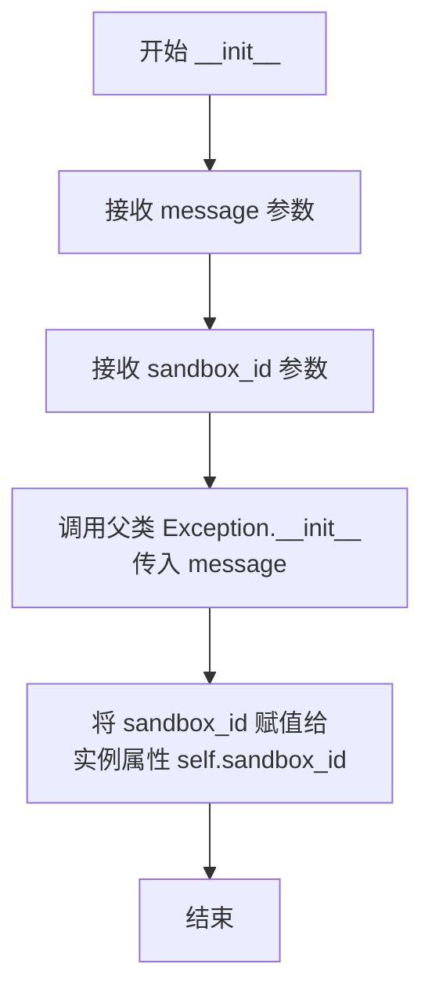
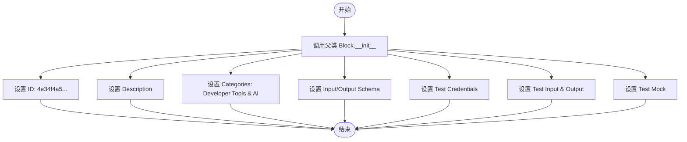
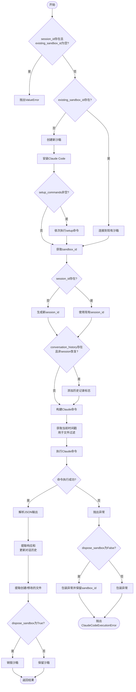
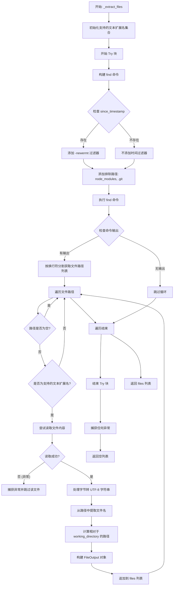
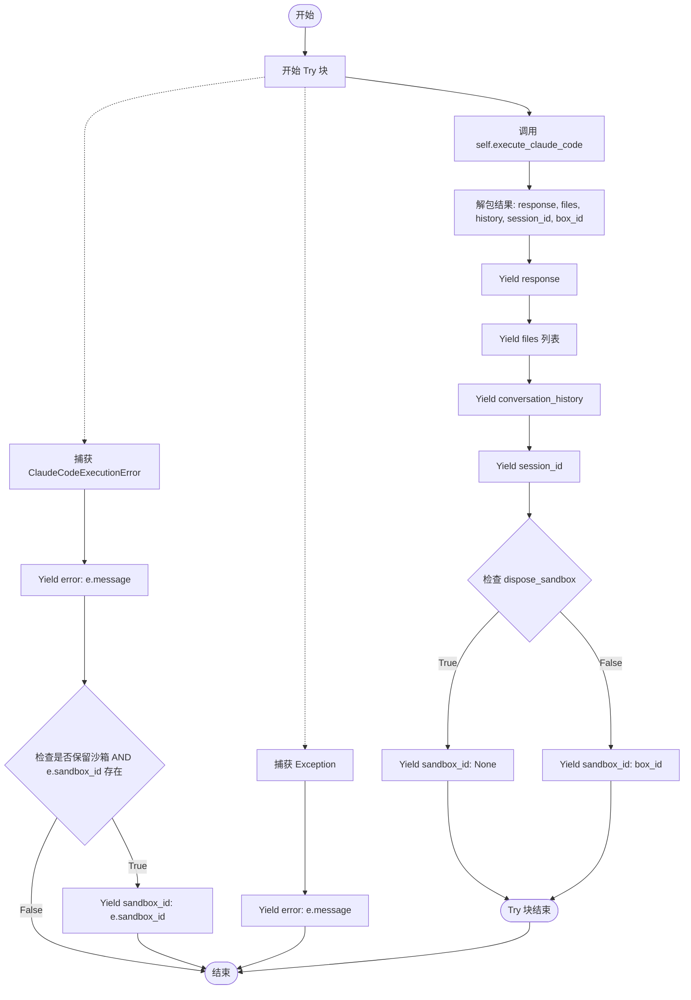

# `AutoGPT\autogpt_platform\backend\backend\blocks\claude_code.py` 详细设计文档

该代码实现了一个 `ClaudeCodeBlock` 类，用于在安全的 E2B 沙箱环境中通过 Anthropic API 执行 AI 编程任务。它支持创建和复用沙箱会话、安装依赖、执行 Claude Code 指令、提取生成的文件以及处理对话历史记录，同时提供了完整的错误处理和测试数据定义。

## 整体流程

```mermaid
graph TD
    A[开始: run 方法被调用] --> B[提取 API Keys 和输入参数]
    B --> C[调用 execute_claude_code]
    C --> D{是否存在 existing_sandbox_id?}
    D -- 是 --> E[连接到现有 E2B Sandbox]
    D -- 否 --> F[创建新的 E2B Sandbox]
    F --> G[安装 Claude Code (npm)]
    G --> H[执行用户自定义 setup_commands]
    E --> I[设置环境变量与工作目录]
    H --> I
    I --> J[构建 Claude Code 命令]
    J --> K[在 Sandbox 中执行命令]
    K --> L[解析命令输出 JSON/文本]
    L --> M[提取修改/创建的文件]
    M --> N[返回 response, files, history, IDs]
    N --> O{dispose_sandbox 是否为 True?}
    O -- 是 --> P[销毁 Sandbox]
    O -- 否 --> Q[保留 Sandbox]
    P --> R[yield 输出结果]
    Q --> R
    K --> S[执行过程中发生异常?]
    S -- 是 --> T[抛出 ClaudeCodeExecutionError (附带 sandbox_id)]
    T --> U[捕获异常并 yield error 信息]
```

## 类结构

```
ClaudeCodeExecutionError (Exception)
ClaudeCodeBlock (Block)
├── Input (BlockSchemaInput)
├── FileOutput (BaseModel)
└── Output (BlockSchemaOutput)
```

## 全局变量及字段


### `TEST_E2B_CREDENTIALS`
    
Mock API key credentials used for testing E2B integration.

类型：`APIKeyCredentials`
    


### `TEST_E2B_CREDENTIALS_INPUT`
    
Dictionary representation of mock E2B credentials input for testing.

类型：`dict`
    


### `TEST_ANTHROPIC_CREDENTIALS`
    
Mock API key credentials used for testing Anthropic integration.

类型：`APIKeyCredentials`
    


### `TEST_ANTHROPIC_CREDENTIALS_INPUT`
    
Dictionary representation of mock Anthropic credentials input for testing.

类型：`dict`
    


### `ClaudeCodeExecutionError.sandbox_id`
    
The ID of the sandbox associated with the execution error for cleanup purposes.

类型：`str`
    


### `ClaudeCodeBlock.Input.e2b_credentials`
    
API key credentials for the E2B platform to create the sandbox.

类型：`CredentialsMetaInput`
    


### `ClaudeCodeBlock.Input.anthropic_credentials`
    
API key credentials for Anthropic to power Claude Code.

类型：`CredentialsMetaInput`
    


### `ClaudeCodeBlock.Input.prompt`
    
The task or instruction for Claude Code to execute.

类型：`str`
    


### `ClaudeCodeBlock.Input.timeout`
    
Sandbox timeout in seconds for the execution.

类型：`int`
    


### `ClaudeCodeBlock.Input.setup_commands`
    
Optional list of shell commands to run before executing Claude Code.

类型：`list[str]`
    


### `ClaudeCodeBlock.Input.working_directory`
    
Working directory for Claude Code to operate in.

类型：`str`
    


### `ClaudeCodeBlock.Input.session_id`
    
Session ID to resume a previous conversation.

类型：`str`
    


### `ClaudeCodeBlock.Input.sandbox_id`
    
Sandbox ID to reconnect to an existing sandbox instance.

类型：`str`
    


### `ClaudeCodeBlock.Input.conversation_history`
    
Previous conversation history to continue from on a fresh sandbox.

类型：`str`
    


### `ClaudeCodeBlock.Input.dispose_sandbox`
    
Flag indicating whether to dispose of the sandbox after execution.

类型：`bool`
    


### `ClaudeCodeBlock.FileOutput.path`
    
The absolute path of the file in the sandbox.

类型：`str`
    


### `ClaudeCodeBlock.FileOutput.relative_path`
    
The path of the file relative to the working directory.

类型：`str`
    


### `ClaudeCodeBlock.FileOutput.name`
    
The name of the file.

类型：`str`
    


### `ClaudeCodeBlock.FileOutput.content`
    
The text content of the file.

类型：`str`
    


### `ClaudeCodeBlock.Output.response`
    
The output or response text from Claude Code execution.

类型：`str`
    


### `ClaudeCodeBlock.Output.files`
    
List of text files created or modified during execution.

类型：`list[FileOutput]`
    


### `ClaudeCodeBlock.Output.conversation_history`
    
Full conversation history including the current interaction.

类型：`str`
    


### `ClaudeCodeBlock.Output.session_id`
    
Session ID for the current conversation.

类型：`str`
    


### `ClaudeCodeBlock.Output.sandbox_id`
    
ID of the sandbox instance, None if disposed.

类型：`Optional[str]`
    


### `ClaudeCodeBlock.Output.error`
    
Error message if execution failed.

类型：`str`
    


### `ClaudeCodeBlock.DEFAULT_TEMPLATE`
    
The default template name used for creating new E2B sandboxes.

类型：`str`
    
    

## 全局函数及方法


### `ClaudeCodeExecutionError.__init__`

ClaudeCode执行失败时抛出的自定义异常类的初始化方法，用于携带错误消息和沙盒ID，以便在 dispose_sandbox=False 时将沙盒ID返回给用户进行清理。

参数：

-  `message`：`str`，描述执行失败的错误消息
-  `sandbox_id`：`str`，关联的沙盒实例ID，用于后续清理，默认为空字符串

返回值：`None`，该方法是初始化方法，不返回任何值

#### 流程图



#### 带注释源码

```python
def __init__(self, message: str, sandbox_id: str = ""):
    # 调用父类 Exception 的初始化方法，传入错误消息
    super().__init__(message)
    # 将 sandbox_id 存储为实例属性
    # 这样当 dispose_sandbox=False 时，调用者可以获取到沙盒ID进行清理
    self.sandbox_id = sandbox_id
```


### `ClaudeCodeBlock.__init__`

初始化 Claude 代码块，配置其唯一标识符、描述、分类、输入输出模式以及测试相关的配置数据（包括凭证、输入、输出和模拟函数）。

参数：

- `self`：`ClaudeCodeBlock`，类实例的引用。

返回值：`None`，无返回值，仅完成实例的初始化配置。

#### 流程图



#### 带注释源码

```python
def __init__(self):
    # 调用父类 Block 的初始化方法，传入该代码块的元数据和配置
    super().__init__(
        id="4e34f4a5-9b89-4326-ba77-2dd6750b7194",  # 代码块的唯一标识符
        description=(
            "Execute tasks using Claude Code in an E2B sandbox. "
            "Claude Code can create files, install tools, run commands, "
            "and perform complex coding tasks autonomously."
        ),  # 代码块的功能描述
        categories={BlockCategory.DEVELOPER_TOOLS, BlockCategory.AI},  # 所属分类：开发者工具和AI
        input_schema=ClaudeCodeBlock.Input,  # 输入数据模式定义
        output_schema=ClaudeCodeBlock.Output,  # 输出数据模式定义
        test_credentials={  # 测试环境所需的凭证配置
            "e2b_credentials": TEST_E2B_CREDENTIALS,
            "anthropic_credentials": TEST_ANTHROPIC_CREDENTIALS,
        },
        test_input={  # 用于测试的模拟输入数据
            "e2b_credentials": TEST_E2B_CREDENTIALS_INPUT,
            "anthropic_credentials": TEST_ANTHROPIC_CREDENTIALS_INPUT,
            "prompt": "Create a hello world HTML file",
            "timeout": 300,
            "setup_commands": [],
            "working_directory": "/home/user",
            "session_id": "",
            "sandbox_id": "",
            "conversation_history": "",
            "dispose_sandbox": True,
        },
        test_output=[  # 期望的测试输出结果
            ("response", "Created index.html with hello world content"),
            (
                "files",
                [
                    {
                        "path": "/home/user/index.html",
                        "relative_path": "index.html",
                        "name": "index.html",
                        "content": "<html>Hello World</html>",
                    }
                ],
            ),
            (
                "conversation_history",
                "User: Create a hello world HTML file\n"
                "Claude: Created index.html with hello world content",
            ),
            ("session_id", str),
            ("sandbox_id", None),  # 因为测试输入中 dispose_sandbox=True
        ],
        test_mock={  # 测试时用于模拟核心执行逻辑的 lambda 函数
            "execute_claude_code": lambda *args, **kwargs: (
                "Created index.html with hello world content",  # response
                [
                    ClaudeCodeBlock.FileOutput(
                        path="/home/user/index.html",
                        relative_path="index.html",
                        name="index.html",
                        content="<html>Hello World</html>",
                    )
                ],  # files
                "User: Create a hello world HTML file\n"
                "Claude: Created index.html with hello world content",  # conversation_history
                "test-session-id",  # session_id
                "sandbox_id",  # sandbox_id
            ),
        },
    )
```


### `ClaudeCodeBlock.execute_claude_code`

在E2B沙箱中执行Claude Code任务，支持创建新会话或恢复现有会话，安装Claude Code工具，运行用户指定的命令，并提取生成的文件和对话历史。

参数：

-  `e2b_api_key`：`str`，E2B平台的API密钥，用于创建或连接沙箱
-  `anthropic_api_key`：`str`，Anthropic的API密钥，用于Claude Code功能
-  `prompt`：`str`，给Claude Code执行的任务或指令
-  `timeout`：`int`，沙箱超时时间（秒），仅在创建新沙箱时生效
-  `setup_commands`：`list[str]`，在执行Claude Code之前运行的shell命令列表，用于环境配置
-  `working_directory`：`str`，Claude Code操作的工作目录路径
-  `session_id`：`str`，会话ID，用于恢复之前的对话；空字符串表示新会话
-  `existing_sandbox_id`：`str`，已存在的沙箱ID，用于重新连接；空字符串表示创建新沙箱
-  `conversation_history`：`str`，之前的对话历史，用于在新沙箱上恢复上下文
-  `dispose_sandbox`：`bool`，执行后是否立即销毁沙箱；False则保留沙箱以便后续继续对话

返回值：`tuple[str, list["ClaudeCodeBlock.FileOutput"], str, str, str]`，包含五个元素的元组：Claude Code的响应文本、本次执行创建/修改的文件列表、包含当前轮的完整对话历史、当前会话ID、沙箱实例ID

#### 流程图



#### 带注释源码

```python
async def execute_claude_code(
    self,
    e2b_api_key: str,
    anthropic_api_key: str,
    prompt: str,
    timeout: int,
    setup_commands: list[str],
    working_directory: str,
    session_id: str,
    existing_sandbox_id: str,
    conversation_history: str,
    dispose_sandbox: bool,
) -> tuple[str, list["ClaudeCodeBlock.FileOutput"], str, str, str]:
    """
    Execute Claude Code in an E2B sandbox.

    Returns:
        Tuple of (response, files, conversation_history, session_id, sandbox_id)
    """

    # 验证：恢复会话时必须提供sandbox_id
    if session_id and not existing_sandbox_id:
        raise ValueError(
            "sandbox_id is required when resuming a session with session_id. "
            "The session state is stored in the original sandbox. "
            "If the sandbox has timed out, use conversation_history instead "
            "to restore context on a fresh sandbox."
        )

    sandbox = None
    sandbox_id = ""

    try:
        # 根据是否提供existing_sandbox_id决定连接现有沙箱还是创建新沙箱
        if existing_sandbox_id:
            # 连接到现有沙箱以继续对话
            sandbox = await BaseAsyncSandbox.connect(
                sandbox_id=existing_sandbox_id,
                api_key=e2b_api_key,
            )
        else:
            # 创建新沙箱
            sandbox = await BaseAsyncSandbox.create(
                template=self.DEFAULT_TEMPLATE,
                api_key=e2b_api_key,
                timeout=timeout,
                envs={"ANTHROPIC_API_KEY": anthropic_api_key},
            )

            # 从npm安装Claude Code（确保获取最新版本）
            install_result = await sandbox.commands.run(
                "npm install -g @anthropic-ai/claude-code@latest",
                timeout=120,  # 安装超时2分钟
            )
            if install_result.exit_code != 0:
                raise Exception(
                    f"Failed to install Claude Code: {install_result.stderr}"
                )

            # 运行用户提供的设置命令
            for cmd in setup_commands:
                setup_result = await sandbox.commands.run(cmd)
                if setup_result.exit_code != 0:
                    raise Exception(
                        f"Setup command failed: {cmd}\n"
                        f"Exit code: {setup_result.exit_code}\n"
                        f"Stdout: {setup_result.stdout}\n"
                        f"Stderr: {setup_result.stderr}"
                    )

        # 立即捕获sandbox_id，以便在错误恢复时可用
        sandbox_id = sandbox.sandbox_id

        # 生成或使用提供的会话ID
        current_session_id = session_id if session_id else str(uuid.uuid4())

        # 构建基础Claude标志
        base_flags = "-p --dangerously-skip-permissions --output-format json"

        # 如果提供了对话历史（用于新沙箱继续），添加历史标志
        history_flag = ""
        if conversation_history and not session_id:
            # 通过系统提示注入之前的对话上下文
            escaped_history = self._escape_prompt(
                f"Previous conversation context: {conversation_history}"
            )
            history_flag = f" --append-system-prompt {escaped_history}"

        # 根据是恢复还是新建会话构建Claude命令
        # 使用shlex.quote防止注入
        safe_working_dir = shlex.quote(working_directory)
        if session_id:
            # 恢复现有会话（沙箱仍然存活）
            safe_session_id = shlex.quote(session_id)
            claude_command = (
                f"cd {safe_working_dir} && "
                f"echo {self._escape_prompt(prompt)} | "
                f"claude --resume {safe_session_id} {base_flags}"
            )
        else:
            # 带有特定ID的新会话
            safe_current_session_id = shlex.quote(current_session_id)
            claude_command = (
                f"cd {safe_working_dir} && "
                f"echo {self._escape_prompt(prompt)} | "
                f"claude --session-id {safe_current_session_id} {base_flags}{history_flag}"
            )

        # 在运行Claude Code之前捕获时间戳，以便后续过滤文件
        # 捕获1秒前的时间戳以避免与文件创建的竞态条件
        timestamp_result = await sandbox.commands.run(
            "date -u -d '1 second ago' +%Y-%m-%dT%H:%M:%S"
        )
        if timestamp_result.exit_code != 0:
            raise RuntimeError(
                f"Failed to capture timestamp: {timestamp_result.stderr}"
            )
        start_timestamp = (
            timestamp_result.stdout.strip() if timestamp_result.stdout else None
        )

        result = await sandbox.commands.run(
            claude_command,
            timeout=0,  # 无命令超时 - 让沙箱超时处理
        )

        # 检查命令失败
        if result.exit_code != 0:
            error_msg = result.stderr or result.stdout or "Unknown error"
            raise Exception(
                f"Claude Code command failed with exit code {result.exit_code}:\n"
                f"{error_msg}"
            )

        raw_output = result.stdout or ""

        # 解析JSON输出以提取响应并构建对话历史
        response = ""
        new_conversation_history = conversation_history or ""

        try:
            # JSON输出包含结果
            output_data = json.loads(raw_output)
            response = output_data.get("result", raw_output)

            # 构建对话历史条目
            turn_entry = f"User: {prompt}\nClaude: {response}"
            if new_conversation_history:
                new_conversation_history = (
                    f"{new_conversation_history}\n\n{turn_entry}"
                )
            else:
                new_conversation_history = turn_entry

        except json.JSONDecodeError:
            # 如果不是有效JSON，使用原始输出
            response = raw_output
            turn_entry = f"User: {prompt}\nClaude: {response}"
            if new_conversation_history:
                new_conversation_history = (
                    f"{new_conversation_history}\n\n{turn_entry}"
                )
            else:
                new_conversation_history = turn_entry

        # 提取在此运行期间创建/修改的文件
        files = await self._extract_files(
            sandbox, working_directory, start_timestamp
        )

        return (
            response,
            files,
            new_conversation_history,
            current_session_id,
            sandbox_id,
        )

    except Exception as e:
        # 用sandbox_id包装异常，以便调用者可以在dispose_sandbox=False时访问/清理保留的沙箱
        raise ClaudeCodeExecutionError(str(e), sandbox_id) from e

    finally:
        # 根据配置决定是否销毁沙箱
        if dispose_sandbox and sandbox:
            await sandbox.kill()
```


### `ClaudeCodeBlock._extract_files`

提取在 Claude Code 执行期间创建或修改的文本文件。该方法递归扫描指定的工作目录，根据时间戳和文件扩展名（仅限支持的文本文件）进行过滤，排除 `node_modules` 和 `.git` 等目录，读取文件内容，并返回包含路径、相对路径、名称和内容的结构化文件对象列表。

参数：

-  `sandbox`：`BaseAsyncSandbox`，E2B sandbox 实例，用于执行文件系统操作。
-  `working_directory`：`str`，搜索文件的根目录路径。
-  `since_timestamp`：`str | None`，ISO 格式的时间戳。如果提供，仅返回在此时间之后被修改的文件。

返回值：`list["ClaudeCodeBlock.FileOutput"]`，包含文件详细信息（路径、相对路径、名称、内容）的对象列表。

#### 流程图



#### 带注释源码

```python
async def _extract_files(
    self,
    sandbox: BaseAsyncSandbox,
    working_directory: str,
    since_timestamp: str | None = None,
) -> list["ClaudeCodeBlock.FileOutput"]:
    """
    Extract text files created/modified during this Claude Code execution.

    Args:
        sandbox: The E2B sandbox instance
        working_directory: Directory to search for files
        since_timestamp: ISO timestamp - only return files modified after this time

    Returns:
        List of FileOutput objects with path, relative_path, name, and content
    """
    files: list[ClaudeCodeBlock.FileOutput] = []

    # 定义可以安全作为文本读取的文件扩展名集合
    text_extensions = {
        ".txt", ".md", ".html", ".htm", ".css", ".js", ".ts", ".jsx", ".tsx",
        ".json", ".xml", ".yaml", ".yml", ".toml", ".ini", ".cfg", ".conf",
        ".py", ".rb", ".php", ".java", ".c", ".cpp", ".h", ".hpp", ".cs",
        ".go", ".rs", ".swift", ".kt", ".scala", ".sh", ".bash", ".zsh",
        ".sql", ".graphql", ".env", ".gitignore", ".dockerfile", "Dockerfile",
        ".vue", ".svelte", ".astro", ".mdx", ".rst", ".tex", ".csv", ".log",
    }

    try:
        # 使用 find 命令递归列出文件
        # 排除 node_modules 和 .git 目录，但允许 .env 和 .gitignore 等隐藏文件
        # (这些文件稍后会被 text_extensions 过滤掉)
        # 根据时间戳过滤，仅获取本次运行期间创建/修改的文件
        safe_working_dir = shlex.quote(working_directory)
        timestamp_filter = ""
        if since_timestamp:
            timestamp_filter = f"-newermt {shlex.quote(since_timestamp)} "
        
        # 构建并执行查找命令
        find_result = await sandbox.commands.run(
            f"find {safe_working_dir} -type f "
            f"{timestamp_filter}"
            f"-not -path '*/node_modules/*' "
            f"-not -path '*/.git/*' "
            f"2>/dev/null"
        )

        # 如果命令有输出，处理文件列表
        if find_result.stdout:
            for file_path in find_result.stdout.strip().split("\n"):
                if not file_path:
                    continue

                # 检查是否为我们可以读取的文本文件
                is_text = any(
                    file_path.endswith(ext) for ext in text_extensions
                ) or file_path.endswith("Dockerfile")

                if is_text:
                    try:
                        # 读取文件内容
                        content = await sandbox.files.read(file_path)
                        # 处理字节或字符串
                        if isinstance(content, bytes):
                            content = content.decode("utf-8", errors="replace")

                        # 从路径中提取文件名
                        file_name = file_path.split("/")[-1]

                        # 通过剥离工作目录计算相对路径
                        relative_path = file_path
                        if file_path.startswith(working_directory):
                            relative_path = file_path[len(working_directory) :]
                            # 如果存在前导斜杠则移除
                            if relative_path.startswith("/"):
                                relative_path = relative_path[1:]

                        # 构建文件输出对象并添加到列表
                        files.append(
                            ClaudeCodeBlock.FileOutput(
                                path=file_path,
                                relative_path=relative_path,
                                name=file_name,
                                content=content,
                            )
                        )
                    except Exception:
                        # 跳过无法读取的文件
                        pass

    except Exception:
        # 如果文件提取失败，返回空结果
        pass

    return files
```


### `ClaudeCodeBlock._escape_prompt`

Escape the prompt for safe shell execution by wrapping it in single quotes and escaping any embedded single quotes.

参数：

-  `prompt`：`str`，The original prompt string that needs to be escaped for safe shell execution

返回值：`str`，The escaped prompt string wrapped in single quotes, suitable for safe shell command execution

#### 流程图

```mermaid
flowchart TD
    A[Start] --> B[Input: prompt string]
    B --> C[Replace all single quotes ' with ''"'"'']
    C --> D[Wrap the escaped string with single quotes]
    D --> E[Output: escaped prompt]
    E --> F[End]
```

#### 带注释源码

```python
def _escape_prompt(self, prompt: str) -> str:
    """Escape the prompt for safe shell execution."""
    
    # Replace any single quotes in the prompt with the sequence:
    # ' + " + ' + " + '
    # This effectively "breaks out" of the single quotes temporarily,
    # adds a literal single quote via double quotes, then re-enters single quotes
    # Example: It's great -> 'It'"'"'s great'
    escaped = prompt.replace("'", "'\"'\"'")
    
    # Wrap the entire escaped string in single quotes to prevent
    # shell expansion, variable substitution, and command injection
    return f"'{escaped}'"
```


### `ClaudeCodeBlock.run`

该方法是 `ClaudeCodeBlock` 的核心执行入口，负责接收输入数据和凭证，调用内部逻辑执行 Claude Code 任务，并将执行结果（包括响应、生成的文件、会话状态等）作为块输出流式返回。它还处理了异常捕获，确保在发生错误时能返回错误信息以及必要的沙箱ID以便清理。

参数：

- `input_data`：`ClaudeCodeBlock.Input`，包含执行所需的所有输入参数，如提示词、超时设置、工作目录、会话ID等。
- `e2b_credentials`：`APIKeyCredentials`，用于访问 E2B 沙盒服务的 API 密钥凭证。
- `anthropic_credentials`：`APIKeyCredentials`，用于访问 Anthropic Claude 服务的 API 密钥凭证。
- `**kwargs`：`dict`，额外的关键字参数（当前未在方法体内显式使用）。

返回值：`BlockOutput`，一个异步生成器，产生包含执行结果的元组（键名, 值）。可能的输出键包括 `response`（响应内容）、`files`（生成的文件列表）、`conversation_history`（对话历史）、`session_id`（会话ID）、`sandbox_id`（沙箱ID）以及 `error`（错误信息）。

#### 流程图



#### 带注释源码

```python
    async def run(
        self,
        input_data: Input,
        *,
        e2b_credentials: APIKeyCredentials,
        anthropic_credentials: APIKeyCredentials,
        **kwargs,
    ) -> BlockOutput:
        try:
            # 调用核心执行方法，传入解包后的 API 密钥和输入数据参数
            (
                response,
                files,
                conversation_history,
                session_id,
                sandbox_id,
            ) = await self.execute_claude_code(
                e2b_api_key=e2b_credentials.api_key.get_secret_value(),
                anthropic_api_key=anthropic_credentials.api_key.get_secret_value(),
                prompt=input_data.prompt,
                timeout=input_data.timeout,
                setup_commands=input_data.setup_commands,
                working_directory=input_data.working_directory,
                session_id=input_data.session_id,
                existing_sandbox_id=input_data.sandbox_id,
                conversation_history=input_data.conversation_history,
                dispose_sandbox=input_data.dispose_sandbox,
            )

            # 输出 Claude Code 的文本响应
            yield "response", response
            # 输出本次执行生成或修改的文件列表（将 FileOutput 对象转换为字典）
            yield "files", [f.model_dump() for f in files]
            # 输出更新后的完整对话历史，用于上下文恢复
            yield "conversation_history", conversation_history
            # 输出会话 ID，用于后续继续对话
            yield "session_id", session_id
            # 根据 dispose_sandbox 标志决定是否输出 sandbox_id
            # 如果选择保留沙箱，则返回 ID；否则返回 None
            yield "sandbox_id", sandbox_id if not input_data.dispose_sandbox else None

        except ClaudeCodeExecutionError as e:
            # 捕获自定义执行错误
            yield "error", str(e)
            # 如果设置了保留沙箱但发生了错误，仍然返回 sandbox_id 以便用户进行清理或重连
            if not input_data.dispose_sandbox and e.sandbox_id:
                yield "sandbox_id", e.sandbox_id
        except Exception as e:
            # 捕获其他通用异常并输出错误信息
            yield "error", str(e)
```


## 关键组件


### E2B Sandbox Lifecycle Management
Manages the creation, reconnection, and disposal of E2B sandboxes, including environment configuration for API keys, global installation of the Claude Code npm package, and execution of user-defined setup commands within the container.

### Claude Code Execution Engine
Constructs secure shell commands to execute Claude Code tasks, handling prompt escaping, session resumption versus new session initialization, and parsing JSON outputs to extract results and update conversation history.

### Incremental File Extraction System
Identifies and retrieves text-based files created or modified during execution by utilizing timestamp-based filtering and extension allow-lists, while excluding system directories like node_modules to return only relevant artifacts.

### Session Persistence & State Recovery
Facilitates multi-turn conversations by managing session IDs for live sandbox connections and conversation history strings to restore context on new sandboxes if previous instances have timed out or been disposed.


## 问题及建议


### 已知问题

-   **冷启动性能开销大**：每次创建新的沙箱时，都会执行 `npm install -g @anthropic-ai/claude-code@latest`。这引入了显著的延迟（通常需要 1-2 分钟），增加了超时风险，并消耗不必要的网络带宽和计算资源。
-   **时间戳检测机制不可靠**：代码使用 `date -u -d '1 second ago'` 作为启发式方法来获取基准时间戳，以避免竞态条件。这种方法依赖于文件系统的时钟精度和执行速度，存在遗漏新创建文件或错误包含旧文件的风险。
-   **文件扫描效率低下**：`_extract_files` 方法使用 `find` 命令递归扫描整个工作目录（排除 node_modules），对于包含大量文件的大型项目，这会在执行后产生显著的性能开销。
-   **同步阻塞式执行**：`execute_claude_code` 等待整个命令执行完毕后才返回结果。在长时间运行的任务中，用户无法获得中间反馈或日志，导致用户体验较差。
-   **硬编码的文本扩展名列表**：`_extract_files` 中包含一个硬编码的文本文件扩展名集合。这使得支持新的文件类型或适应特定项目需求需要修改代码，缺乏灵活性。
-   **命令行注入风险与长度限制**：尽管使用了 `shlex.quote` 和自定义转义，但通过 `echo ... | claude` 传递 Prompt 的方式在处理包含复杂特殊字符的输入时可能仍有风险。此外，超长的 Prompt 可能会触及 Shell 命令行长度限制。

### 优化建议

-   **使用自定义 E2B 沙箱镜像**：创建一个预装了 `@anthropic-ai/claude-code` 和常用依赖的 E2B 沙箱模板。这将消除运行时安装步骤，显著减少启动延迟，提高执行速度。
-   **实现流式输出**：利用 E2B SDK 的流式接口实时捕获标准输出和标准错误，将 Claude Code 的日志和中间结果即时推送给前端，提升用户对长时间任务的感知和掌控。
-   **优化变更文件检测策略**：考虑使用 `inotify`（通过沙箱内的辅助进程）来监控文件系统事件，或者依赖 Claude CLI 的输出（如果支持）来明确列出变更的文件，从而避免全盘扫描并提高准确性。
-   **配置化文件过滤**：将需要提取的文件扩展名、排除的目录（如 node_modules, .git）等规则移至输入参数或配置文件中，允许用户根据具体项目自定义提取逻辑。
-   **增强二进制文件支持**：目前的逻辑仅读取文本文件。建议增加对二进制文件的处理逻辑，例如将它们打包压缩或仅返回元数据（路径、大小），而不是静默跳过。
-   **改进 Prompt 传递方式**：避免通过 Shell 管道传递大段文本。建议将 Prompt 写入沙箱内的临时文件，然后让 Claude CLI 读取该文件，这样可以绕过命令行长度限制并进一步降低 Shell 注入风险。
-   **资源清理与超时控制**：为沙箱内部的 `claude` 命令执行添加更细粒度的超时控制，而不仅仅依赖 E2B 沙箱层面的超时，以防止个别命令挂起导致整个会话僵死。


## 其它


### 设计目标与约束

*   **核心目标**：提供一个封装块，允许用户利用 Claude Code (Anthropic AI) 在隔离的 E2B 沙箱环境中安全地执行复杂的编码任务（如创建文件、安装依赖、运行命令），并支持任务的持续性（会话恢复）和结果的提取（文件内容、对话历史）。
*   **环境约束**：代码必须在异步环境中运行（基于 `async/await`），依赖于 E2B 提供的 Linux 沙箱环境。
*   **会话管理约束**：
    *   **新建会话**：每次运行默认创建新的沙箱，除非提供 `sandbox_id`。
    *   **会话恢复**：若要恢复之前的对话，必须同时提供有效的 `sandbox_id` 和 `session_id`。如果沙箱已过期但需要保留上下文，必须使用 `conversation_history` 在新沙箱中重建。
*   **资源约束**：沙箱具有生命周期超时（由 `timeout` 参数控制），且文件提取仅限于预定义的文本文件扩展名集合，二进制文件或大型文件不被支持读取。
*   **安全约束**：所有传递给沙箱 Shell 的用户输入（路径、提示词、ID）必须经过转义处理，以防止命令注入攻击。

### 错误处理与异常设计

*   **自定义异常**：定义了 `ClaudeCodeExecutionError`，该异常不仅携带错误信息，还保存了 `sandbox_id`。这是为了在执行失败且 `dispose_sandbox=False` 时，允许调用者获取沙箱 ID 以便进行手动清理或调试，避免资源泄漏。
*   **异常捕获与转换**：
    *   在 `run` 方法中，捕获 `ClaudeCodeExecutionError` 和其他通用 `Exception`。
    *   捕获到的异常不会导致程序崩溃，而是转化为 Block 输出流中的 `error` 字段，确保工作流的下游可以感知并处理错误。
*   **资源清理保证**：使用 `try...finally` 结构确保无论执行成功与否，只要 `dispose_sandbox` 为 True，沙箱实例都会被正确销毁（`kill`）。
*   **前置校验**：在执行逻辑开始前，校验 `session_id` 和 `sandbox_id` 的组合有效性（例如：有 session_id 但无 sandbox_id 时抛出 ValueError），以尽早发现配置错误。

### 数据流与状态机

*   **数据流向**：
    1.  **输入阶段**：接收用户凭证、提示词、配置参数及可选的会话状态（ID、历史）。
    2.  **初始化阶段**：根据输入决定是新建沙箱还是连接现有沙箱，配置环境变量，安装工具。
    3.  **执行阶段**：构建并转义 Shell 命令，在沙箱内执行 Claude Code，捕获标准输出和错误流。
    4.  **处理阶段**：解析 JSON 响应，更新对话历史，根据时间戳筛选并读取变更的文件。
    5.  **输出阶段**：通过生成器产生响应文本、文件列表、更新后的会话 ID 及沙箱 ID。
*   **状态机（会话生命周期）**：
    *   **Idle (初始)**：等待输入。
    *   **Initializing (初始化)**：创建或连接 E2B 沙箱。
    *   **SettingUp (环境准备)**：安装依赖，运行 setup_commands。
    *   **Executing (执行中)**：运行 Claude Code 命令。
    *   **Extracting (提取中)**：扫描并读取文件变更。
    *   **Finalized (结束)**：根据 `dispose_sandbox` 决定是保持沙箱运行还是销毁，返回最终状态。
    *   **Failed (失败)**：发生错误，返回错误信息及残留沙箱 ID（如有）。

### 外部依赖与接口契约

*   **E2B Sandbox SDK (`e2b.AsyncSandbox`)**：
    *   **契约**：提供异步的容器管理能力。
    *   **依赖方法**：`create()` (创建实例), `connect()` (重连实例), `commands.run()` (执行 Shell 命令), `files.read()` (读取文件内容), `kill()` (销毁实例)。
    *   **环境要求**：沙箱镜像必须支持 `npm` 和基本的 Linux shell 命令（如 `find`, `date`）。
*   **Claude Code CLI (`@anthropic-ai/claude-code`)**：
    *   **契约**：命令行工具，接受特定参数（如 `--output-format json`）并通过标准输入或参数接收任务。
    *   **环境变量**：依赖 `ANTHROPIC_API_KEY` 环境变量进行认证。
    *   **输出格式**：期望返回 JSON 格式的字符串，包含 `result` 字段。
*   **内部框架 (`backend.data.block`)**：
    *   **契约**：必须继承 `Block` 基类，实现 `run` 方法，并定义符合 Pydantic 规范的 `Input` 和 `Output` 类。
    *   **凭证处理**：必须使用 `CredentialsMetaInput` 和 `APIKeyCredentials` 类型来安全处理敏感信息。

### 安全性设计

*   **命令注入防护**：
    *   使用 `shlex.quote` 对所有传入 Shell 的动态参数（如路径、Session ID）进行转义。
    *   实现 `_escape_prompt` 方法，通过单引号包裹和内部单引号转义来处理用户输入的 Prompt，防止恶意 Shell 命令执行。
*   **凭证隔离**：API Key 不作为命令行参数传递（防止 `ps` 命令窥探），而是通过 E2B 的 `envs` 参数注入为环境变量。
*   **沙箱隔离**：所有代码执行均发生在 E2B 提供的临时虚拟机中，与宿主机环境完全隔离，防止恶意代码破坏宿主系统。
*   **权限控制**：代码中使用了 `--dangerously-skip-permissions` 标志，这在设计上是一个信任假设，即用户输入的 Prompt 是可信的，或者是用户愿意承担在沙箱内执行任意代码的风险。这是一个基于用例（AI 自动编程）的权衡。

    