# `.\AutoGPT\autogpt_platform\backend\backend\blocks\code_executor.py` 详细设计文档

The code provides a framework for executing code in a sandbox environment with internet access, supporting various programming languages and handling different execution scenarios.

## 整体流程

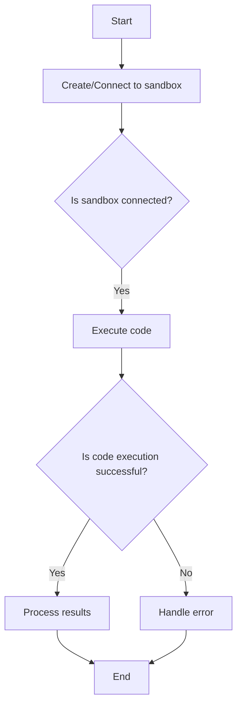

## 类结构

```
BaseE2BExecutorMixin (Mixin class)
├── ExecuteCodeBlock (Block class)
│   ├── Input (Input schema)
│   └── Output (Output schema)
├── InstantiateCodeSandboxBlock (Block class)
│   ├── Input (Input schema)
│   └── Output (Output schema)
└── ExecuteCodeStepBlock (Block class)
    ├── Input (Input schema)
    └── Output (Output schema)
```

## 全局变量及字段


### `TEST_CREDENTIALS`
    
A test API key credentials object for the E2B platform.

类型：`APIKeyCredentials`
    


### `TEST_CREDENTIALS_INPUT`
    
A test input dictionary for the E2B API key credentials.

类型：`dict`
    


### `ProviderName`
    
An enum representing the provider name for the E2B platform.

类型：`Literal[ProviderName.E2B]`
    


### `ProgrammingLanguage`
    
An enum representing different programming languages.

类型：`Enum`
    


### `MainCodeExecutionResult`
    
A Pydantic model representing the main code execution result.

类型：`BaseModel`
    


### `CodeExecutionResult`
    
A Pydantic model representing the code execution result.

类型：`BaseModel`
    


### `AsyncSandbox`
    
A class representing an asynchronous sandbox for code execution.

类型：`class`
    


### `E2BExecutionResult`
    
A class representing the execution result of code in the E2B platform.

类型：`class`
    


### `E2BExecutionResultChart`
    
A class representing a chart in the E2B execution result.

类型：`class`
    


### `APIKeyCredentials`
    
A class representing API key credentials for the E2B platform.

类型：`class`
    


### `CredentialsField`
    
A class representing a credentials field for the E2B platform.

类型：`class`
    


### `CredentialsMetaInput`
    
A class representing a credentials meta input for the E2B platform.

类型：`class`
    


### `SchemaField`
    
A class representing a schema field for the E2B platform.

类型：`class`
    


### `Block`
    
A base class for blocks in the E2B platform.

类型：`class`
    


### `BlockCategory`
    
A class representing a block category in the E2B platform.

类型：`class`
    


### `BlockOutput`
    
A class representing the output of a block in the E2B platform.

类型：`class`
    


### `BlockSchemaInput`
    
A class representing the input schema for a block in the E2B platform.

类型：`class`
    


### `BlockSchemaOutput`
    
A class representing the output schema for a block in the E2B platform.

类型：`class`
    


### `SecretStr`
    
A class representing a secret string for the E2B platform.

类型：`class`
    


### `JsonValue`
    
A class representing a JSON value for the E2B platform.

类型：`class`
    


### `APIKeyCredentials.id`
    
The ID of the API key credentials.

类型：`str`
    


### `APIKeyCredentials.provider`
    
The provider of the API key credentials.

类型：`str`
    


### `APIKeyCredentials.api_key`
    
The API key for the E2B platform.

类型：`SecretStr`
    


### `APIKeyCredentials.title`
    
The title of the API key credentials.

类型：`str`
    


### `APIKeyCredentials.expires_at`
    
The expiration date of the API key credentials.

类型：`Optional[datetime]`
    


### `CredentialsMetaInput.provider`
    
The provider of the credentials.

类型：`Literal[ProviderName.E2B]`
    


### `CredentialsMetaInput.type`
    
The type of the credentials.

类型：`Literal['api_key']`
    


### `MainCodeExecutionResult.text`
    
The text result of the code execution.

类型：`Optional[str]`
    


### `MainCodeExecutionResult.html`
    
The HTML result of the code execution.

类型：`Optional[str]`
    


### `MainCodeExecutionResult.markdown`
    
The markdown result of the code execution.

类型：`Optional[str]`
    


### `MainCodeExecutionResult.svg`
    
The SVG result of the code execution.

类型：`Optional[str]`
    


### `MainCodeExecutionResult.png`
    
The PNG result of the code execution.

类型：`Optional[str]`
    


### `MainCodeExecutionResult.jpeg`
    
The JPEG result of the code execution.

类型：`Optional[str]`
    


### `MainCodeExecutionResult.pdf`
    
The PDF result of the code execution.

类型：`Optional[str]`
    


### `MainCodeExecutionResult.latex`
    
The LaTeX result of the code execution.

类型：`Optional[str]`
    


### `MainCodeExecutionResult.json_data`
    
The JSON data result of the code execution.

类型：`Optional[JsonValue]`
    


### `MainCodeExecutionResult.javascript`
    
The JavaScript result of the code execution.

类型：`Optional[str]`
    


### `MainCodeExecutionResult.data`
    
The data result of the code execution.

类型：`Optional[dict]`
    


### `MainCodeExecutionResult.chart`
    
The chart result of the code execution.

类型：`Optional[Chart]`
    


### `MainCodeExecutionResult.extra`
    
Extra data that can be included in the result.

类型：`Optional[dict]`
    


### `CodeExecutionResult.is_main_result`
    
Whether this data is the main result of the cell.

类型：`bool`
    


### `AsyncSandbox.sandbox_id`
    
The ID of the sandbox.

类型：`str`
    


### `AsyncSandbox.api_key`
    
The API key for the E2B platform.

类型：`str`
    


### `AsyncSandbox.template`
    
The template for the sandbox.

类型：`str`
    


### `AsyncSandbox.timeout`
    
The timeout for the sandbox.

类型：`int`
    


### `AsyncSandbox.logs`
    
The logs for the sandbox.

类型：`Logs`
    


### `E2BExecutionResult.error`
    
The error message from the code execution.

类型：`str`
    


### `E2BExecutionResult.results`
    
The results from the code execution.

类型：`list[E2BExecutionResult]`
    


### `E2BExecutionResult.formats`
    
The formats of the results from the code execution.

类型：`list[str]`
    


### `E2BExecutionResult.extra`
    
Extra data that can be included in the result.

类型：`dict`
    


### `E2BExecutionResult.is_main_result`
    
Whether this data is the main result of the cell.

类型：`bool`
    


### `E2BExecutionResultChart.formats`
    
The formats of the chart.

类型：`list[str]`
    


### `E2BExecutionResultChart.extra`
    
Extra data that can be included in the chart.

类型：`dict`
    
    

## 全局函数及方法


### `execute_code`

Unified code execution method that handles all three use cases: 
1. Create new sandbox and execute 
2. Create new sandbox, execute, and return sandbox_id 
3. Connect to existing sandbox and execute

参数：

- `api_key`：`str`，API key for the E2B platform
- `code`：`str`，Code to execute in the sandbox
- `language`：`ProgrammingLanguage`，Programming language to execute
- `template_id`：`str`，ID of the E2B sandbox template to use
- `setup_commands`：`Optional[list[str]]`，Shell commands to set up the sandbox before running the code
- `timeout`：`Optional[int]`，Execution timeout in seconds
- `sandbox_id`：`Optional[str]`，ID of the existing sandbox to connect to
- `dispose_sandbox`：`bool`，Whether to dispose of the sandbox immediately after execution

返回值：`tuple`，(results, text_output, stdout_logs, stderr_logs, sandbox_id)

#### 流程图

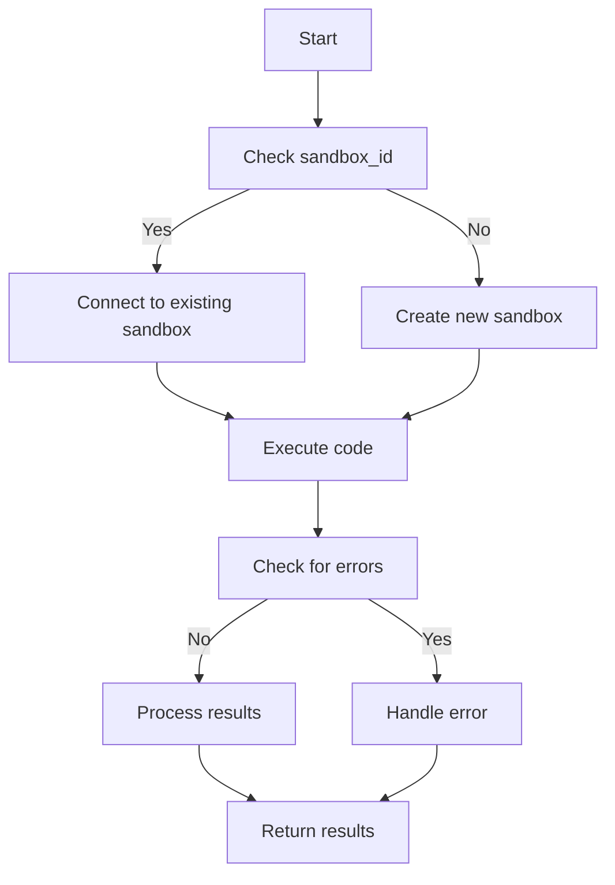

#### 带注释源码

```python
async def execute_code(
    self,
    api_key: str,
    code: str,
    language: ProgrammingLanguage,
    template_id: str = "",
    setup_commands: Optional[list[str]] = None,
    timeout: Optional[int] = None,
    sandbox_id: Optional[str] = None,
    dispose_sandbox: bool = False,
):
    sandbox = None
    try:
        if sandbox_id:
            # Connect to existing sandbox (ExecuteCodeStepBlock case)
            sandbox = await AsyncSandbox.connect(
                sandbox_id=sandbox_id, api_key=api_key
            )
        else:
            # Create new sandbox (ExecuteCodeBlock/InstantiateCodeSandboxBlock case)
            sandbox = await AsyncSandbox.create(
                api_key=api_key, template=template_id, timeout=timeout
            )
            if setup_commands:
                for cmd in setup_commands:
                    await sandbox.commands.run(cmd)

        # Execute the code
        execution = await sandbox.run_code(
            code,
            language=language.value,
            on_error=lambda e: sandbox.kill(),  # Kill the sandbox on error
        )

        if execution.error:
            raise Exception(execution.error)

        results = execution.results
        text_output = execution.text
        stdout_logs = "".join(execution.logs.stdout)
        stderr_logs = "".join(execution.logs.stderr)

        return results, text_output, stdout_logs, stderr_logs, sandbox.sandbox_id
    finally:
        # Dispose of sandbox if requested to reduce usage costs
        if dispose_sandbox and sandbox:
            await sandbox.kill()
```


### process_execution_results

Process and filter execution results.

参数：

- `results`：`list[E2BExecutionResult]`，A list of execution results to be processed.

返回值：`tuple[dict[str, Any] | None, list[dict[str, Any]]]`，A tuple containing the main result and a list of processed results.

#### 流程图

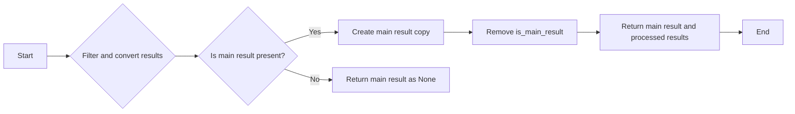

#### 带注释源码

```python
def process_execution_results(self, results: list[E2BExecutionResult]) -> tuple[dict[str, Any] | None, list[dict[str, Any]]]:
    """Process and filter execution results."""
    # Filter out empty formats and convert to dicts
    processed_results = [
        {
            f: value
            for f in [*r.formats(), "extra", "is_main_result"]
            if (value := getattr(r, f, None)) is not None
        }
        for r in results
    ]
    if main_result := next(
        (r for r in processed_results if r.get("is_main_result")), None
    ):
        # Make main_result a copy we can modify & remove is_main_result
        (main_result := {**main_result}).pop("is_main_result")

    return main_result, processed_results
```


### ExecuteCodeBlock.run

Executes code in a sandbox environment with internet access.

参数：

- `input_data`：`Input`，The input data for the block, containing the code to execute, the programming language, and other configurations.
- `credentials`：`APIKeyCredentials`，The credentials used to authenticate with the E2B platform.
- `**kwargs`：`Any`，Additional keyword arguments that may be passed to the method.

返回值：`BlockOutput`，The output of the block, containing the results of the code execution, including the main result, other results, text output, and logs.

#### 流程图

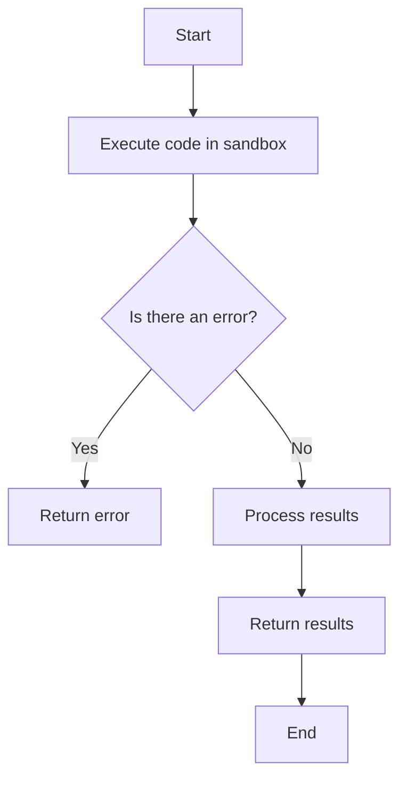

#### 带注释源码

```python
async def run(self, input_data: Input, *, credentials: APIKeyCredentials, **kwargs) -> BlockOutput:
    try:
        results, text_output, stdout, stderr, _ = await self.execute_code(
            api_key=credentials.api_key.get_secret_value(),
            code=input_data.code,
            language=input_data.language,
            template_id=input_data.template_id,
            setup_commands=input_data.setup_commands,
            timeout=input_data.timeout,
            dispose_sandbox=input_data.dispose_sandbox,
        )

        # Determine result object shape & filter out empty formats
        main_result, results = self.process_execution_results(results)
        if main_result:
            yield "main_result", main_result
        yield "results", results
        if text_output:
            yield "response", text_output
        if stdout:
            yield "stdout_logs", stdout
        if stderr:
            yield "stderr_logs", stderr
    except Exception as e:
        yield "error", str(e)
```


### `ExecuteCodeBlock.__init__`

This method initializes the `ExecuteCodeBlock` class, setting up its properties and configurations.

参数：

- `self`：`ExecuteCodeBlock` 类的实例
- `id`：`str`，块的唯一标识符
- `description`：`str`，块的描述信息
- `categories`：`set`，块的分类
- `input_schema`：`BlockSchemaInput`，块的输入模式
- `output_schema`：`BlockSchemaOutput`，块的输出模式
- `test_credentials`：`APIKeyCredentials`，用于测试的凭据
- `test_input`：`dict`，用于测试的输入数据
- `test_output`：`list`，用于测试的输出数据
- `test_mock`：`dict`，用于测试的模拟数据

返回值：无

#### 流程图

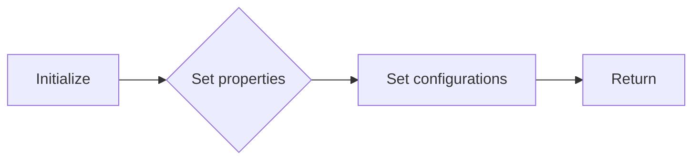

#### 带注释源码

```python
def __init__(self, id: str, description: str, categories: set, input_schema, output_schema,
             test_credentials: APIKeyCredentials, test_input: dict, test_output: list,
             test_mock: dict):
    super().__init__(
        id=id,
        description=description,
        categories=categories,
        input_schema=input_schema,
        output_schema=output_schema,
        test_credentials=test_credentials,
        test_input=test_input,
        test_output=test_output,
        test_mock=test_mock,
    )
```


### `BaseE2BExecutorMixin.execute_code`

Unified code execution method that handles all three use cases:
1. Create new sandbox and execute (ExecuteCodeBlock)
2. Create new sandbox, execute, and return sandbox_id (InstantiateCodeSandboxBlock)
3. Connect to existing sandbox and execute (ExecuteCodeStepBlock)

参数：

- `api_key`：`str`，API key for the E2B platform
- `code`：`str`，Code to execute in the sandbox
- `language`：`ProgrammingLanguage`，Programming language to execute
- `template_id`：`str`，ID of the E2B sandbox template to use
- `setup_commands`：`Optional[list[str]]`，Shell commands to set up the sandbox before running the code
- `timeout`：`Optional[int]`，Execution timeout in seconds
- `sandbox_id`：`Optional[str]`，ID of the existing sandbox to connect to
- `dispose_sandbox`：`bool`，Whether to dispose of the sandbox immediately after execution

返回值：`tuple`，(results, text_output, stdout_logs, stderr_logs, sandbox_id)

#### 流程图

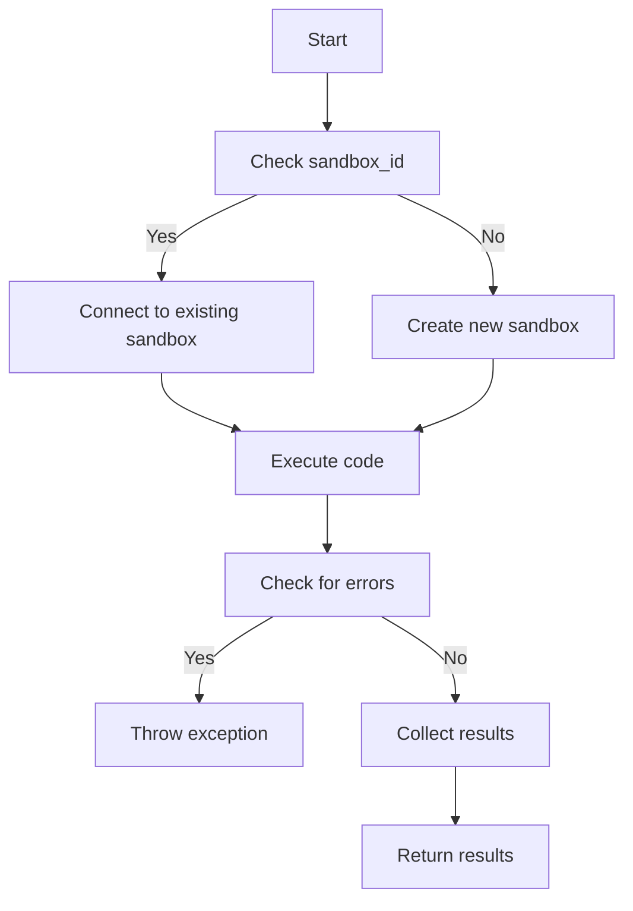

#### 带注释源码

```python
async def execute_code(
    self,
    api_key: str,
    code: str,
    language: ProgrammingLanguage,
    template_id: str = "",
    setup_commands: Optional[list[str]] = None,
    timeout: Optional[int] = None,
    sandbox_id: Optional[str] = None,
    dispose_sandbox: bool = False,
):
    sandbox = None
    try:
        if sandbox_id:
            # Connect to existing sandbox (ExecuteCodeStepBlock case)
            sandbox = await AsyncSandbox.connect(
                sandbox_id=sandbox_id, api_key=api_key
            )
        else:
            # Create new sandbox (ExecuteCodeBlock/InstantiateCodeSandboxBlock case)
            sandbox = await AsyncSandbox.create(
                api_key=api_key, template=template_id, timeout=timeout
            )
            if setup_commands:
                for cmd in setup_commands:
                    await sandbox.commands.run(cmd)

        # Execute the code
        execution = await sandbox.run_code(
            code,
            language=language.value,
            on_error=lambda e: sandbox.kill(),  # Kill the sandbox on error
        )

        if execution.error:
            raise Exception(execution.error)

        results = execution.results
        text_output = execution.text
        stdout_logs = "".join(execution.logs.stdout)
        stderr_logs = "".join(execution.logs.stderr)

        return results, text_output, stdout_logs, stderr_logs, sandbox.sandbox_id
    finally:
        # Dispose of sandbox if requested to reduce usage costs
        if dispose_sandbox and sandbox:
            await sandbox.kill()
```


### BaseE2BExecutorMixin.process_execution_results

Process and filter execution results.

参数：

- `results`：`list[E2BExecutionResult]`，A list of execution results to be processed.

返回值：`tuple[dict[str, Any] | None, list[dict[str, Any]]]`，A tuple containing the main result and a list of processed results.

#### 流程图

```mermaid
graph LR
A[Start] --> B{Filter and convert results}
B --> C{Is main result present?}
C -- Yes --> D[Create main result copy]
C -- No --> E[Return main result as None]
D --> F[Remove "is_main_result" from main result]
F --> G[Return main result and processed results]
G --> H[End]
```

#### 带注释源码

```python
def process_execution_results(self, results: list[E2BExecutionResult]) -> tuple[dict[str, Any] | None, list[dict[str, Any]]]:
    """Process and filter execution results."""
    # Filter out empty formats and convert to dicts
    processed_results = [
        {
            f: value
            for f in [*r.formats(), "extra", "is_main_result"]
            if (value := getattr(r, f, None)) is not None
        }
        for r in results
    ]
    if main_result := next(
        (r for r in processed_results if r.get("is_main_result")), None
    ):
        # Make main_result a copy we can modify & remove is_main_result
        (main_result := {**main_result}).pop("is_main_result")

    return main_result, processed_results
```


### ExecuteCodeBlock.__init__

This method initializes an instance of the `ExecuteCodeBlock` class, setting up its properties and configurations.

参数：

- `id`：`str`，The unique identifier for the block.
- `description`：`str`，A description of the block's functionality.
- `categories`：`set`，A set of categories that the block belongs to.
- `input_schema`：`BlockSchemaInput`，The schema for the input data of the block.
- `output_schema`：`BlockSchemaOutput`，The schema for the output data of the block.
- `test_credentials`：`APIKeyCredentials`，The credentials used for testing the block.
- `test_input`：`dict`，The test input data for the block.
- `test_output`：`list`，The expected test output data for the block.
- `test_mock`：`dict`，Mock data for testing the block.

返回值：`None`，This method does not return any value.

#### 流程图

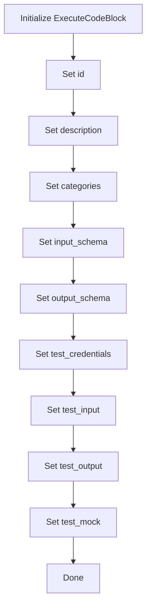

#### 带注释源码

```python
def __init__(self):
    super().__init__(
        id="0b02b072-abe7-11ef-8372-fb5d162dd712",
        description="Executes code in a sandbox environment with internet access.",
        categories={BlockCategory.DEVELOPER_TOOLS},
        input_schema=ExecuteCodeBlock.Input,
        output_schema=ExecuteCodeBlock.Output,
        test_credentials=TEST_CREDENTIALS,
        test_input={
            "credentials": TEST_CREDENTIALS_INPUT,
            "code": "print('Hello World')",
            "language": ProgrammingLanguage.PYTHON.value,
            "setup_commands": [],
            "timeout": 300,
            "template_id": "",
        },
        test_output=[
            ("results", []),
            ("response", "Hello World"),
            ("stdout_logs", "Hello World\n"),
        ],
        test_mock={
            "execute_code": lambda api_key, code, language, template_id, setup_commands, timeout, dispose_sandbox: (
                [],  # results
                "Hello World",  # text_output
                "Hello World\n",  # stdout_logs
                "",  # stderr_logs
                "sandbox_id",  # sandbox_id
            ),
        },
    )
```


### ExecuteCodeBlock.run

This method executes code in a sandbox environment with internet access and returns the results.

参数：

- `input_data`：`Input`，The input data for the block, containing the code to execute, the programming language, and other settings.
- `credentials`：`APIKeyCredentials`，The credentials for the E2B platform, including the API key.
- `**kwargs`：Additional keyword arguments that may be passed to the method.

返回值：`BlockOutput`，The output of the block, containing the results of the code execution.

#### 流程图

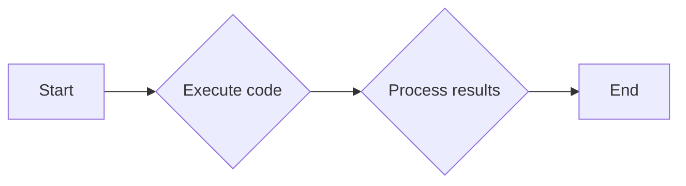

#### 带注释源码

```python
async def run(self, input_data: Input, *, credentials: APIKeyCredentials, **kwargs) -> BlockOutput:
    try:
        results, text_output, stdout, stderr, _ = await self.execute_code(
            api_key=credentials.api_key.get_secret_value(),
            code=input_data.code,
            language=input_data.language,
            template_id=input_data.template_id,
            setup_commands=input_data.setup_commands,
            timeout=input_data.timeout,
            dispose_sandbox=input_data.dispose_sandbox,
        )

        # Determine result object shape & filter out empty formats
        main_result, results = self.process_execution_results(results)
        if main_result:
            yield "main_result", main_result
        yield "results", results
        if text_output:
            yield "response", text_output
        if stdout:
            yield "stdout_logs", stdout
        if stderr:
            yield "stderr_logs", stderr
    except Exception as e:
        yield "error", str(e)
```


### InstantiateCodeSandboxBlock.__init__

This method initializes the InstantiateCodeSandboxBlock class, setting up the block with necessary configurations and metadata.

参数：

- `self`：`None`，The instance of the class being initialized.
- `id`：`str`，The unique identifier for the block.
- `description`：`str`，A brief description of the block's functionality.
- `categories`：`set`，A set of categories that the block belongs to.
- `input_schema`：`BlockSchemaInput`，The schema for the input data of the block.
- `output_schema`：`BlockSchemaOutput`，The schema for the output data of the block.
- `test_credentials`：`APIKeyCredentials`，The credentials used for testing the block.
- `test_input`：`dict`，The test input data for the block.
- `test_output`：`list`，The expected test output data for the block.
- `test_mock`：`dict`，Mock data for testing the block.

返回值：`None`，No return value.

#### 流程图

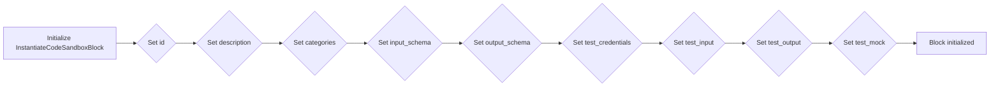

#### 带注释源码

```python
class InstantiateCodeSandboxBlock(Block, BaseE2BExecutorMixin):
    def __init__(self):
        super().__init__(
            id="ff0861c9-1726-4aec-9e5b-bf53f3622112",
            description=(
                "Instantiate a sandbox environment with internet access "
                "in which you can execute code with the Execute Code Step block."
            ),
            categories={BlockCategory.DEVELOPER_TOOLS},
            input_schema=InstantiateCodeSandboxBlock.Input,
            output_schema=InstantiateCodeSandboxBlock.Output,
            test_credentials=TEST_CREDENTIALS,
            test_input={
                "credentials": TEST_CREDENTIALS_INPUT,
                "setup_code": "print('Hello World')",
                "language": ProgrammingLanguage.PYTHON.value,
                "setup_commands": [],
                "timeout": 300,
                "template_id": "",
            },
            test_output=[
                ("sandbox_id", str),
                ("response", "Hello World"),
                ("stdout_logs", "Hello World\n"),
            ],
            test_mock={
                "execute_code": lambda api_key, code, language, template_id, setup_commands, timeout: (  # noqa
                    [],  # results
                    "Hello World",  # text_output
                    "Hello World\n",  # stdout_logs
                    "",  # stderr_logs
                    "sandbox_id",  # sandbox_id
                ),
            },
        )
```


### InstantiateCodeSandboxBlock.run

This method instantiates a sandbox environment with internet access and sets up the environment by executing a given setup code. It returns the ID of the sandbox instance.

参数：

- `input_data`：`Input`，The input data for the block, containing the setup code, language, and other configurations.
- `credentials`：`APIKeyCredentials`，The credentials for accessing the E2B platform.

返回值：`BlockOutput`，A dictionary containing the sandbox ID, text result, standard output logs, and standard error logs.

#### 流程图

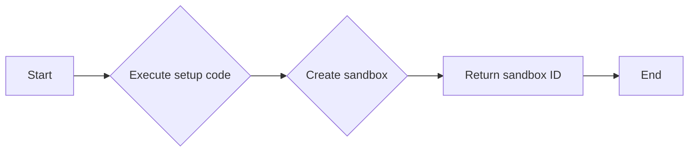

#### 带注释源码

```python
async def run(self, input_data: Input, *, credentials: APIKeyCredentials, **kwargs) -> BlockOutput:
    try:
        _, text_output, stdout, stderr, sandbox_id = await self.execute_code(
            api_key=credentials.api_key.get_secret_value(),
            code=input_data.setup_code,
            language=input_data.language,
            template_id=input_data.template_id,
            setup_commands=input_data.setup_commands,
            timeout=input_data.timeout,
        )
        if sandbox_id:
            yield "sandbox_id", sandbox_id
        else:
            yield "error", "Sandbox ID not found"

        if text_output:
            yield "response", text_output
        if stdout:
            yield "stdout_logs", stdout
        if stderr:
            yield "stderr_logs", stderr
    except Exception as e:
        yield "error", str(e)
```


### ExecuteCodeStepBlock.__init__

This method initializes an instance of the `ExecuteCodeStepBlock` class, which is responsible for executing code in a previously instantiated sandbox.

参数：

- `self`：`None`，The instance of the class being initialized.
- `id`：`str`，The unique identifier for the block.
- `description`：`str`，A description of the block's functionality.
- `categories`：`set`，A set of categories that the block belongs to.
- `input_schema`：`BlockSchemaInput`，The schema for the input data of the block.
- `output_schema`：`BlockSchemaOutput`，The schema for the output data of the block.
- `test_credentials`：`APIKeyCredentials`，The credentials used for testing the block.
- `test_input`：`dict`，The test input data for the block.
- `test_output`：`list`，The expected test output data for the block.
- `test_mock`：`dict`，Mock data for testing the block.

返回值：`None`，No return value is specified.

#### 流程图

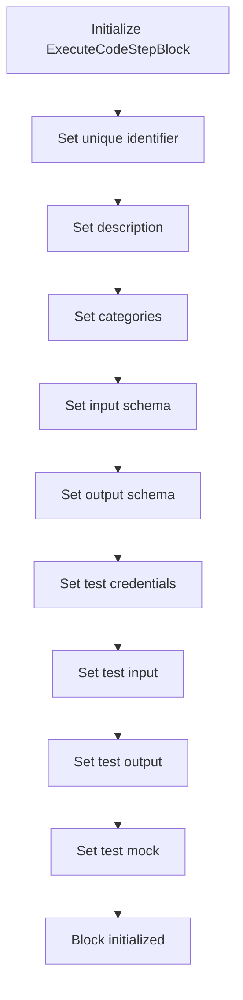

#### 带注释源码

```python
def __init__(self):
    super().__init__(
        id="82b59b8e-ea10-4d57-9161-8b169b0adba6",
        description="Execute code in a previously instantiated sandbox.",
        categories={BlockCategory.DEVELOPER_TOOLS},
        input_schema=ExecuteCodeStepBlock.Input,
        output_schema=ExecuteCodeStepBlock.Output,
        test_credentials=TEST_CREDENTIALS,
        test_input={
            "credentials": TEST_CREDENTIALS_INPUT,
            "sandbox_id": "sandbox_id",
            "step_code": "print('Hello World')",
            "language": ProgrammingLanguage.PYTHON.value,
        },
        test_output=[
            ("results", []),
            ("response", "Hello World"),
            ("stdout_logs", "Hello World\n"),
        ],
        test_mock={
            "execute_code": lambda api_key, code, language, sandbox_id, dispose_sandbox: (
                [],  # results
                "Hello World",  # text_output
                "Hello World\n",  # stdout_logs
                "",  # stderr_logs
                sandbox_id,  # sandbox_id
            ),
        },
    )
```


### ExecuteCodeStepBlock.run

This method executes a code step within a previously instantiated sandbox.

参数：

- `input_data`: `Input`，The input data for the block, containing the sandbox ID, code to execute, language, and whether to dispose of the sandbox after execution.
- `credentials`: `APIKeyCredentials`，The credentials for accessing the E2B platform.

返回值：`BlockOutput`，The output of the block, containing the main result, results, text output, standard output logs, and standard error logs.

#### 流程图

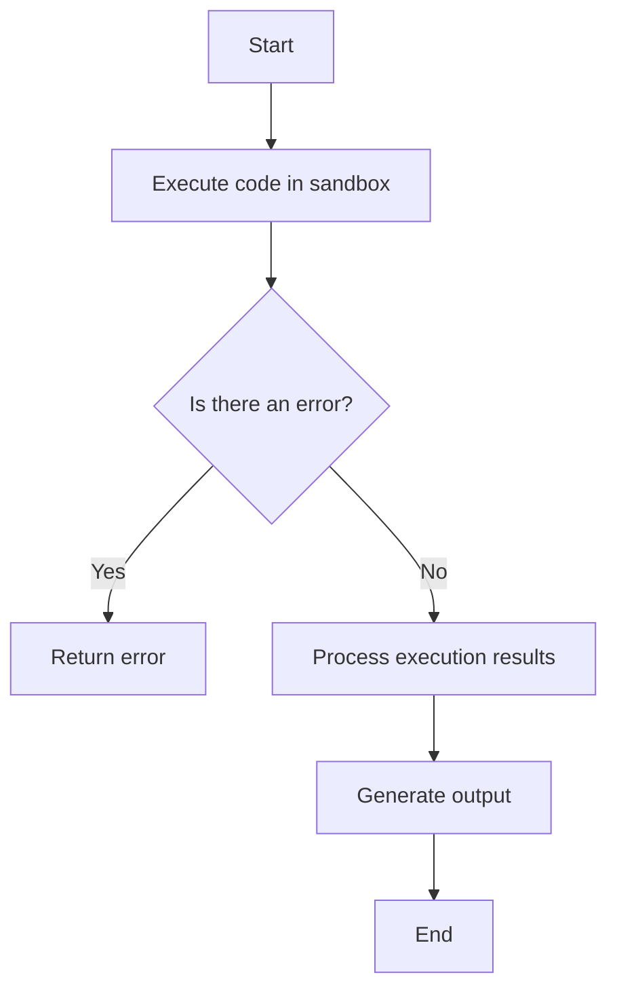

#### 带注释源码

```python
async def run(self, input_data: Input, *, credentials: APIKeyCredentials, **kwargs) -> BlockOutput:
    try:
        results, text_output, stdout, stderr, _ = await self.execute_code(
            api_key=credentials.api_key.get_secret_value(),
            code=input_data.step_code,
            language=input_data.language,
            sandbox_id=input_data.sandbox_id,
            dispose_sandbox=input_data.dispose_sandbox,
        )

        # Determine result object shape & filter out empty formats
        main_result, results = self.process_execution_results(results)
        if main_result:
            yield "main_result", main_result
        yield "results", results
        if text_output:
            yield "response", text_output
        if stdout:
            yield "stdout_logs", stdout
        if stderr:
            yield "stderr_logs", stderr
    except Exception as e:
        yield "error", str(e)
```


## 关键组件


### 张量索引与惰性加载

张量索引与惰性加载是代码中用于高效处理大型数据集的关键组件。它允许在需要时才加载数据，从而减少内存消耗并提高性能。

### 反量化支持

反量化支持是代码中用于处理量化数据的关键组件。它允许将量化数据转换回原始数据类型，以便进行进一步处理和分析。

### 量化策略

量化策略是代码中用于优化模型性能的关键组件。它通过减少模型中使用的精度来减少模型大小和计算需求，从而提高模型在资源受限环境中的效率。


## 问题及建议


### 已知问题

-   **代码重复**: `BaseE2BExecutorMixin` 类中的 `execute_code` 方法在 `ExecuteCodeBlock`, `InstantiateCodeSandboxBlock`, 和 `ExecuteCodeStepBlock` 中被重复使用。这可能导致维护困难，如果方法需要更新，需要在多个地方进行修改。
-   **异常处理**: 代码中的异常处理主要集中在捕获异常并返回错误信息，但没有提供更详细的错误处理逻辑，例如区分不同类型的异常或提供更具体的错误信息。
-   **测试覆盖率**: 代码中包含了一些测试用例，但可能没有覆盖所有可能的执行路径和边界条件，这可能导致在真实环境中出现未预料的问题。
-   **文档不足**: 代码注释较少，特别是对于复杂的逻辑和算法，这可能会影响其他开发者理解和维护代码。

### 优化建议

-   **重构代码**: 将 `execute_code` 方法提取到一个单独的模块或服务中，以减少代码重复，并提高代码的可维护性。
-   **增强异常处理**: 实现更详细的异常处理逻辑，例如区分不同类型的异常，并提供更具体的错误信息，以便于调试和修复。
-   **提高测试覆盖率**: 扩展测试用例，确保覆盖所有可能的执行路径和边界条件，以提高代码的可靠性和稳定性。
-   **完善文档**: 添加更多的代码注释，特别是对于复杂的逻辑和算法，以便于其他开发者理解和维护代码。
-   **性能优化**: 分析代码的性能瓶颈，并采取相应的优化措施，例如使用更高效的数据结构或算法。
-   **安全性考虑**: 对敏感数据进行加密处理，例如 API 密钥，以防止数据泄露。
-   **代码风格一致性**: 确保代码风格的一致性，例如使用一致的命名约定和代码格式。


## 其它


### 设计目标与约束

- 设计目标：
  - 提供一个模块化、可扩展的代码执行环境。
  - 支持多种编程语言和执行环境。
  - 确保代码执行的安全性，防止恶意代码执行。
  - 提供清晰的错误处理和日志记录机制。
- 约束：
  - 代码执行时间限制。
  - 代码执行资源限制（CPU、内存）。
  - 代码执行环境限制（例如，只能访问特定的库和API）。

### 错误处理与异常设计

- 错误处理：
  - 捕获并处理代码执行过程中可能出现的异常。
  - 记录详细的错误信息，包括错误类型、错误描述、堆栈跟踪等。
  - 向用户返回清晰的错误信息，帮助用户定位问题。
- 异常设计：
  - 定义自定义异常类，用于处理特定的错误情况。
  - 异常类应包含错误代码、错误描述、相关数据等信息。

### 数据流与状态机

- 数据流：
  - 用户输入代码和配置信息。
  - 系统创建执行环境，执行代码。
  - 系统返回执行结果。
- 状态机：
  - 初始化状态：系统启动，准备就绪。
  - 执行状态：系统正在执行代码。
  - 完成状态：代码执行完成，返回结果。
  - 错误状态：代码执行过程中出现错误。

### 外部依赖与接口契约

- 外部依赖：
  - E2B代码解释器。
  - Pydantic数据验证库。
  - AsyncSandbox异步沙箱环境。
- 接口契约：
  - E2B代码解释器API接口。
  - Pydantic模型定义。
  - AsyncSandbox沙箱环境API接口。

    