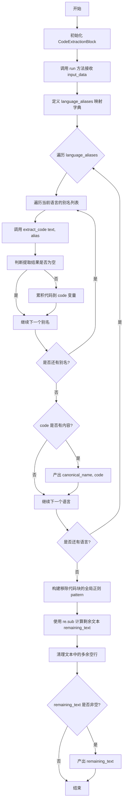
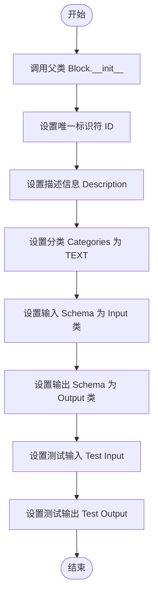
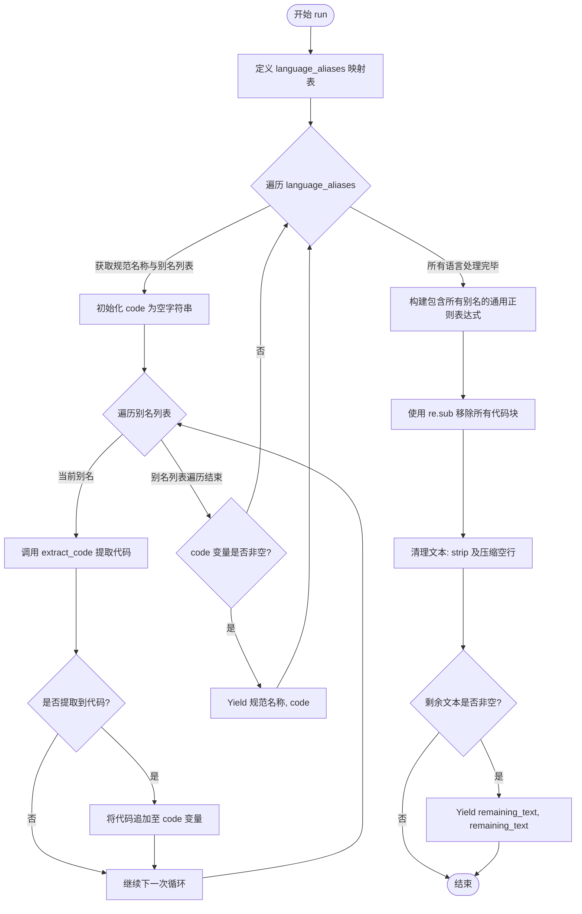

# `AutoGPT\autogpt_platform\backend\backend\blocks\code_extraction_block.py` 详细设计文档

该代码定义了一个名为 CodeExtractionBlock 的类，旨在从输入文本中识别并提取 Markdown 格式的代码块，支持多种编程语言（如 Python, HTML, JS 等），并将提取出的代码按语言分类输出，同时返回移除代码块后的剩余文本。

## 整体流程



## 类结构

```
CodeExtractionBlock (Block)
├── Input (BlockSchemaInput)
└── Output (BlockSchemaOutput)
```

## 全局变量及字段


### `CodeExtractionBlock.Input.text`
    
Text containing code blocks to extract (e.g., AI response)

类型：`str`
    


### `CodeExtractionBlock.Output.html`
    
Extracted HTML code

类型：`str`
    


### `CodeExtractionBlock.Output.css`
    
Extracted CSS code

类型：`str`
    


### `CodeExtractionBlock.Output.javascript`
    
Extracted JavaScript code

类型：`str`
    


### `CodeExtractionBlock.Output.python`
    
Extracted Python code

类型：`str`
    


### `CodeExtractionBlock.Output.sql`
    
Extracted SQL code

类型：`str`
    


### `CodeExtractionBlock.Output.java`
    
Extracted Java code

类型：`str`
    


### `CodeExtractionBlock.Output.cpp`
    
Extracted C++ code

类型：`str`
    


### `CodeExtractionBlock.Output.csharp`
    
Extracted C# code

类型：`str`
    


### `CodeExtractionBlock.Output.json_code`
    
Extracted JSON code

类型：`str`
    


### `CodeExtractionBlock.Output.bash`
    
Extracted Bash code

类型：`str`
    


### `CodeExtractionBlock.Output.php`
    
Extracted PHP code

类型：`str`
    


### `CodeExtractionBlock.Output.ruby`
    
Extracted Ruby code

类型：`str`
    


### `CodeExtractionBlock.Output.yaml`
    
Extracted YAML code

类型：`str`
    


### `CodeExtractionBlock.Output.markdown`
    
Extracted Markdown code

类型：`str`
    


### `CodeExtractionBlock.Output.typescript`
    
Extracted TypeScript code

类型：`str`
    


### `CodeExtractionBlock.Output.xml`
    
Extracted XML code

类型：`str`
    


### `CodeExtractionBlock.Output.remaining_text`
    
Remaining text after code extraction

类型：`str`
    
    

## 全局函数及方法


### `CodeExtractionBlock.__init__`

初始化代码提取块实例，设置其唯一的ID、描述信息、所属分类、输入输出Schema定义以及用于验证功能的测试数据。

参数：

-  `self`：`CodeExtractionBlock`，表示类实例本身，用于访问类属性和方法。

返回值：`None`，构造函数不返回任何值。

#### 流程图



#### 带注释源码

```python
def __init__(self):
    # 调用父类 Block 的初始化方法，配置块的基本元数据和结构
    super().__init__(
        # 块的唯一标识符 (UUID)
        id="d3a7d896-3b78-4f44-8b4b-48fbf4f0bcd8",
        # 块的功能描述：从文本中提取代码块并识别其编程语言
        description="Extracts code blocks from text and identifies their programming languages",
        # 块所属的分类：文本处理
        categories={BlockCategory.TEXT},
        # 定义输入数据的 Schema，使用内部类 Input
        input_schema=CodeExtractionBlock.Input,
        # 定义输出数据的 Schema，使用内部类 Output
        output_schema=CodeExtractionBlock.Output,
        # 定义用于测试的输入数据示例，包含 Python 和 HTML 代码块
        test_input={
            "text": "Here's a Python example:\n```python\nprint('Hello World')\n```\nAnd some HTML:\n```html\n<h1>Title</h1>\n```"
        },
        # 定义预期的测试输出结果，验证代码提取和剩余文本提取逻辑
        test_output=[
            ("html", "<h1>Title</h1>"),
            ("python", "print('Hello World')"),
            ("remaining_text", "Here's a Python example:\nAnd some HTML:"),
        ],
    )
```


### `CodeExtractionBlock.run`

该方法负责从输入的文本中识别并提取特定编程语言的代码块（基于Markdown格式的代码围栏），将不同别名的语言归类到规范名称下，并输出提取后的代码以及去除了代码块后的剩余文本。

参数：

- `input_data`：`CodeExtractionBlock.Input`，包含待处理的文本数据，主要属性为 `text`。
- `**kwargs`：`dict`，扩展的关键字参数，用于传递额外的上下文信息（本方法中未直接使用）。

返回值：`BlockOutput`（异步生成器），产出的元组包含（输出键名，内容），键名对应支持的语言名称或 "remaining_text"。

#### 流程图



#### 带注释源码

```python
    async def run(self, input_data: Input, **kwargs) -> BlockOutput:
        # 定义支持的语言及其别名映射，用于规范化输出键名
        language_aliases = {
            "html": ["html", "htm"],
            "css": ["css"],
            "javascript": ["javascript", "js"],
            "python": ["python", "py"],
            "sql": ["sql"],
            "java": ["java"],
            "cpp": ["cpp", "c++"],
            "csharp": ["csharp", "c#", "cs"],
            "json_code": ["json"],
            "bash": ["bash", "shell", "sh"],
            "php": ["php"],
            "ruby": ["ruby", "rb"],
            "yaml": ["yaml", "yml"],
            "markdown": ["markdown", "md"],
            "typescript": ["typescript", "ts"],
            "xml": ["xml"],
        }

        # 遍历每种语言的规范名称及其对应的别名列表
        for canonical_name, aliases in language_aliases.items():
            code = ""
            # 对该语言的每一个别名进行尝试匹配，以捕获所有可能的变体
            for alias in aliases:
                code_for_alias = self.extract_code(input_data.text, alias)
                # 如果提取到代码，则追加到总代码字符串中（用换行符分隔）
                if code_for_alias:
                    code = code + "\n\n" + code_for_alias if code else code_for_alias

            # 如果该语言类别下有提取到的代码，则产出结果
            if code:
                yield canonical_name, code

        # 构建正则表达式模式，用于匹配所有已定义语言的代码块
        # 模式格式为 ```(alias1|alias2|...)...```
        pattern = (
            r"```(?:"
            + "|".join(
                re.escape(alias)
                for aliases in language_aliases.values()
                for alias in aliases
            )
            + r")[ \t]*\n[\s\S]*?```"
        )

        # 从原文中移除所有匹配的代码块，得到剩余文本
        remaining_text = re.sub(pattern, "", input_data.text).strip()
        # 清理多余的空行，使剩余文本更紧凑
        remaining_text = re.sub(r"\n\s*\n", "\n", remaining_text)

        # 如果存在剩余文本，则产出结果
        if remaining_text:
            yield "remaining_text", remaining_text
```


### `CodeExtractionBlock.extract_code`

该方法负责从输入的文本字符串中提取特定编程语言的代码块。它通过构建正则表达式来匹配 Markdown 格式的代码围栏（即 \`\`\`language），并将所有匹配到的代码内容拼接后返回。

参数：

- `text`：`str`，包含待提取代码块的原始文本（通常为包含 Markdown 语法的字符串）。
- `language`：`str`，目标编程语言的标识符（例如 "python", "html"），用于匹配代码块前的标记。

返回值：`str`，提取出的代码内容。如果有多个匹配项，它们之间会用双换行符连接；如果未找到匹配项，则返回空字符串。

#### 流程图

```mermaid
flowchart TD
    A[开始: 接收 text 和 language 参数] --> B[使用 re.escape 转义 language 字符串]
    B --> C[编译正则表达式 pattern<br/>模式: ```language\\n(.*?)\\n```<br/>标志: re.DOTALL | re.IGNORECASE]
    C --> D[调用 pattern.finditer 在 text 中查找所有匹配]
    D --> E{是否存在匹配项 matches?}
    E -- 否 --> F[返回空字符串 ""]
    E -- 是 --> G[遍历 matches 提取 group 1 内容<br/>并去除首尾空白字符]
    G --> H[使用 \\n\\n 拼接所有提取到的代码块]
    H --> I[返回拼接后的完整代码字符串]
```

#### 带注释源码

```python
def extract_code(self, text: str, language: str) -> str:
    # 对语言标识符进行正则转义，防止其中包含的特殊字符（如 '+'、'*'）破坏正则结构
    language = re.escape(language)
    
    # 构建正则表达式模式：
    # ```{language}      匹配代码块开始标记，允许后面跟空格或制表符
    # \n                 匹配换行符
    # (.*?)             非贪婪匹配任意字符（代码内容），捕获为 group 1
    # \n```              匹配换行符后跟代码块结束标记
    # re.DOTALL          使 '.' 匹配包括换行符在内的所有字符
    # re.IGNORECASE      使匹配忽略大小写
    pattern = re.compile(
        rf"```{language}[ \t]*\n(.*?)\n```", re.DOTALL | re.IGNORECASE
    )
    
    # 在文本中查找所有符合该模式的非重叠匹配项
    matches = pattern.finditer(text)
    
    # 列表推导式：提取每个匹配项中的代码内容（group 1），并去除首尾的空白字符
    code_blocks = [match.group(1).strip() for match in matches]
    
    # 如果存在代码块，则用双换行符连接；否则返回空字符串
    return "\n\n".join(code_blocks) if code_blocks else ""
```


## 关键组件


### Input/Output Schema Definition (输入/输出模式定义)

继承自 `BlockSchemaInput` 和 `BlockSchemaOutput` 的嵌套类结构，严格定义了包含输入文本及多种编程语言代码输出的数据契约。

### Language Alias Mapping (语言别名映射)

在 `run` 方法内部定义的字典数据结构，将规范化的语言名称映射到其对应的别名列表（如将 "js" 映射至 "javascript"），以支持多种代码块标记格式。

### Regex-based Extraction Strategy (基于正则的提取策略)

由 `extract_code` 方法实现的逻辑组件，利用正则表达式（支持多行匹配与忽略大小写）来定位 Markdown 格式的代码块边界并捕获其中的代码内容。

### Main Processing Logic (主处理逻辑)

`run` 方法中的核心控制流，负责遍历语言映射、协调整合提取结果、输出代码块以及通过过滤已识别代码块来计算剩余文本。


## 问题及建议


### 已知问题

-   **运行时性能损耗**：在 `run` 方法中，用于提取剩余文本的复杂正则表达式（`pattern`）是在每次函数调用时动态构建的。由于支持的语言别名列表是静态的，这种每次运行都重新编译正则的行为造成了不必要的 CPU 开销。
-   **配置作用域不当**：`language_aliases` 字典被定义在 `run` 方法内部。这导致每次执行该方法时都会重新创建该字典，增加了内存分配开销，且不利于在类级别复用或单元测试中直接访问配置。
-   **正则匹配过于严格（鲁棒性问题）**：代码提取逻辑依赖的正则模式 ````{language}[ \\t]*\\n` 强制要求语言标记后必须紧跟换行符。如果遇到 ````python print('hi') ``` ` 这种没有立即换行的情况，代码将无法提取。
-   **低效的文本遍历算法**：当前实现对输入文本进行了多次扫描。对于每一种支持的语言（及其别名），都会调用 `extract_code` 对全文进行一次正则匹配。随着支持语言数量的增加，处理时间将线性增长，对于大文本处理效率较低。
-   **`json_code` 字段的不一致性**：输出 Schema 定义的字段名为 `json_code`，但通常在代码上下文中 JSON 更常被称为 `json`。虽然内部通过别名映射处理了这个问题，但这种不一致增加了维护的心智负担。

### 优化建议

-   **预编译正则表达式**：将 `language_aliases` 提升为类变量，并在 `__init__` 方法或类加载时预编译所有需要的正则表达式（包括用于提取代码的模式和用于清理剩余文本的模式），存储为实例变量或类变量。
-   **采用单次遍历策略**：改写提取逻辑，使用一个通用的正则表达式（如 ````(\\w+)?[ \\t]*\\n([\\s\\S]*?)``` `）一次性捕获文本中所有的代码块及其对应的语言标识。然后，遍历匹配结果，根据语言标识映射到规范化的输出键。这将算法复杂度从 O(N*M) 降低到 O(N)（N 为文本长度，M 为语言数量）。
-   **增强 Markdown 解析的容错性**：调整正则表达式，放宽对语言标记后空白字符的要求。允许语言标记后直接跟代码内容，或仅跟任意数量的空格/制表符，而不强制要求换行，以兼容更多非标准 Markdown 格式的输入。
-   **引入专用 Markdown 解析器**：考虑到正则表达式处理嵌套结构或边缘情况（如代码块内包含反引号）的局限性，建议引入成熟的 Markdown 解析库（如 `markdown-it-py`）。通过 AST（抽象语法树）遍历来提取代码块，虽然增加了依赖，但能显著提高解析的准确性和健壮性。
-   **规范化字段命名**：将输出 Schema 中的 `json_code` 重命名为 `json`，以符合通用命名习惯，或者确保文档中明确解释该命名的由来，减少开发者困惑。


## 其它


### 设计目标与约束

**设计目标**：
1.  **精准提取**：能够从非结构化文本（如 AI 生成的回复）中，依据 Markdown 标准语法（即 ``` 代码块标记）精准识别并提取特定编程语言的代码片段。
2.  **多语言支持**：通过别名映射机制，支持常见编程语言及其常用缩写（如 `js` 映射到 `javascript`, `py` 映射到 `python`），覆盖 HTML, CSS, JavaScript, Python, SQL, Java, C++, C#, JSON, Bash, PHP, Ruby, YAML, Markdown, TypeScript, XML 等 15 种语言。
3.  **文本清洗**：在提取代码的同时，能够保留并清理剩余的非代码文本，去除代码块占位符，还原文本流。

**设计约束**：
1.  **正则表达式限制**：代码解析完全基于正则表达式，不构建完整的语法分析树（AST）。这意味着它无法处理嵌套的代码块或非标准的 Markdown 代码块变体（例如使用不同数量反引号的变体）。
2.  **依赖标准 Markdown 格式**：输入文本必须严格遵循 ````lang` 的格式，且语言标识符必须紧跟在起始反引号之后。
3.  **无状态性**：组件设计为无状态处理，每次调用仅处理当前输入的文本，不维护历史会话或上下文状态。
4.  **性能考量**：由于对每种语言别名都进行正则扫描，当文本极长且语言别名列表较多时，可能会存在一定的性能开销，但考虑到文本处理通常是非实时的批量处理，这是可接受的权衡。

### 错误处理与异常设计

**错误处理机制**：
1.  **输入容错**：`run` 方法接收 `input_data` 时，假设其已通过父类 `Block` 的 Schema 验证（即 `text` 字段必然存在且为字符串）。如果 `text` 为空字符串，代码逻辑（如 `re.sub` 和 `finditer`）能安全处理并返回空结果，不会抛出异常。
2.  **正则安全**：在构造正则表达式时，使用 `re.escape(language)` 对语言别名进行转义，防止用户输入或动态别名中包含特殊正则元字符导致解析错误或匹配失败。
3.  **空值过滤**：在 `yield` 结果前，会检查提取到的 `code` 或 `remaining_text` 是否为空。如果未找到特定语言的代码或清理后无剩余文本，则不会输出该键值对，避免下游处理收到无意义的空字符串。

**异常传播**：
1.  **底层异常**：代码本身未显式捕获 `re` 模块可能抛出的异常（如内存溢出等极端情况）。此类异常将向上传播至框架层（如 `backend.data.block` 的执行器），由全局错误处理器记录日志并标记 Block 执行失败。
2.  **类型安全**：依赖 Python 类型提示（`Input`, `BlockOutput`）和 Pydantic/Schema 机制保证运行时数据类型的正确性，避免因类型错误导致的逻辑崩溃。

### 数据流与状态机

**数据流**：
1.  **输入阶段**：外部系统传入包含 `text` 字段的数据对象。
2.  **映射与扫描阶段**：
    *   系统初始化 `language_aliases` 映射表。
    *   遍历映射表，针对每个 `canonical_name`，调用 `extract_code` 方法。
    *   `extract_code` 内部利用正则 `finditer` 扫描全文本，匹配所有符合当前语言别名的代码块，并拼接返回。
3.  **输出生成阶段（代码）**：
    *   如果成功提取到代码，通过 `yield` 异步生成 `(canonical_name, code_str)` 键值对。
4.  **清洗与剩余输出阶段**：
    *   构建一个包含所有语言别名的“全局排除正则”。
    *   使用 `re.sub` 将文本中所有匹配的代码块替换为空字符串。
    *   对剩余文本进行二次正则清洗（去除多余换行符）。
    *   如果剩余文本不为空，通过 `yield` 输出 `("remaining_text", remaining_text)`。

**状态机**：
该 Block 是一个无状态的函数式转换器，不存在复杂的内部状态转换。其执行过程可视为单次通过：
*   **Idle (空闲)** -> **Processing (处理中)**：接收到 `run` 调用。
*   **Processing (处理中)**：执行正则匹配、提取、清洗逻辑。
*   **Processing (处理中)** -> **Completed (完成)**：所有 `yield` 操作执行完毕，协程结束。

### 外部依赖与接口契约

**外部依赖**：
1.  **标准库**：`re`（Python 标准正则表达式库），用于字符串的模式匹配与替换。
2.  **内部模块**：
    *   `backend.data.block`：依赖基类 `Block`、枚举 `BlockCategory`、类型 `BlockOutput` 及 Schema 基类 `BlockSchemaInput`/`BlockSchemaOutput`。
    *   `backend.data.model`：依赖 `SchemaField` 用于定义输入输出的元数据结构。

**接口契约**：
1.  **继承契约**：必须继承自 `backend.data.block.Block`，并实现 `__init__`（调用 `super().__init__` 注册元数据）和 `run` 方法。
2.  **异步执行契约**：
    *   方法签名：`async def run(self, input_data: Input, **kwargs) -> BlockOutput`
    *   `input_data`：必须是符合 `CodeExtractionBlock.Input` Schema 定义的对象实例。
    *   返回值：`BlockOutput`，实际上是一个生成器，每次 `yield` 一个 `(key: str, value: str)` 元组。键必须属于 `CodeExtractionBlock.Output` 中定义的字段名。
3.  **Schema 契约**：
    *   **输入**：必须包含名为 `text` 的字符串字段。
    *   **输出**：必须包含 `html`, `python`, `remaining_text` 等 16 个特定命名的字符串字段。
4.  **元数据契约**：`__init__` 中必须提供唯一的 `id`、描述、类别以及用于测试的 `test_input` 和 `test_output`，确保自动化测试框架能验证其正确性。

    