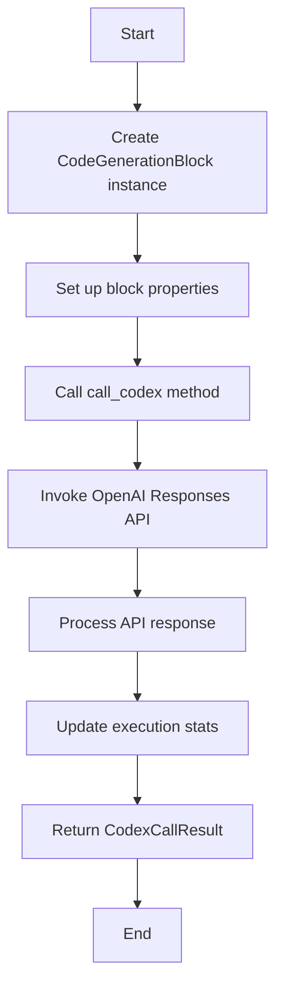
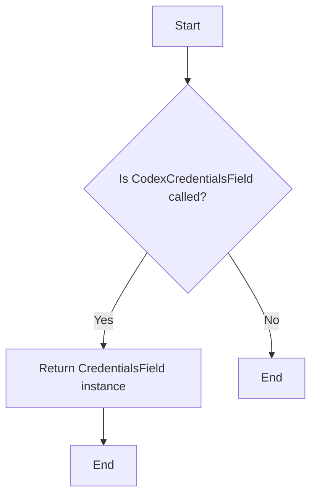
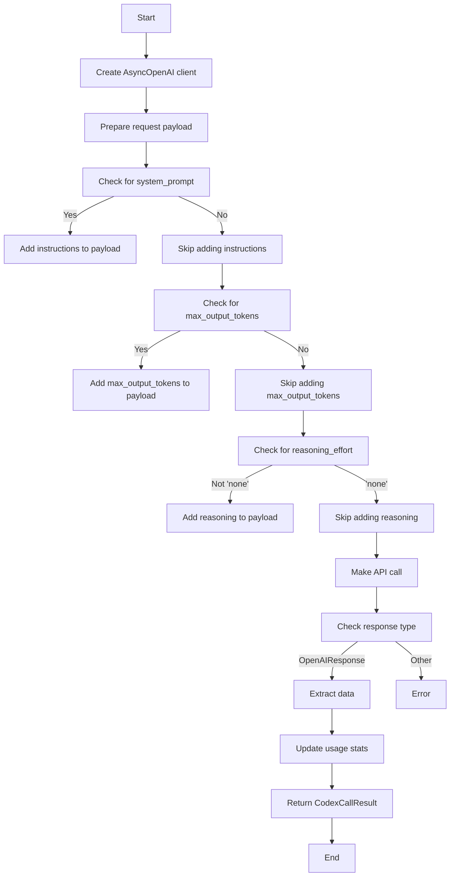

# `.\AutoGPT\autogpt_platform\backend\backend\blocks\codex.py` 详细设计文档

This code defines a block that interfaces with OpenAI's Codex model through the Responses API to generate or refactor code.

## 整体流程



## 类结构

```
CodeGenerationBlock (Concrete Block)
├── Input (BlockSchemaInput)
│   ├── prompt (str)
│   ├── system_prompt (str)
│   ├── model (CodexModel)
│   ├── reasoning_effort (CodexReasoningEffort)
│   └── max_output_tokens (int | None)
│   └── credentials (CodexCredentials)
├── Output (BlockSchemaOutput)
│   ├── response (str)
│   ├── reasoning (str)
│   └── response_id (str)
└── execution_stats (NodeExecutionStats)
```

## 全局变量及字段


### `TEST_CREDENTIALS`
    
Mock OpenAI API key credentials.

类型：`APIKeyCredentials`
    


### `TEST_CREDENTIALS_INPUT`
    
Input data for testing CodexCredentials.

类型：`dict`
    


### `CodexCredentials`
    
Type for Codex API credentials.

类型：`CredentialsMetaInput[Literal[ProviderName.OPENAI], Literal["api_key"]]`
    


### `CodexCredentialsField`
    
Field for Codex API credentials.

类型：`CredentialsField`
    


### `CodexCallResult.response`
    
Response text from Codex model.

类型：`str`
    


### `CodexCallResult.reasoning`
    
Reasoning summary from Codex model.

类型：`str`
    


### `CodexCallResult.response_id`
    
ID of the Responses API call.

类型：`str`
    


### `CodeGenerationBlock.id`
    
Unique identifier for the CodeGenerationBlock.

类型：`str`
    


### `CodeGenerationBlock.description`
    
Description of the CodeGenerationBlock.

类型：`str`
    


### `CodeGenerationBlock.categories`
    
Categories to which the CodeGenerationBlock belongs.

类型：`set`
    


### `CodeGenerationBlock.input_schema`
    
Input schema for the CodeGenerationBlock.

类型：`BlockSchemaInput`
    


### `CodeGenerationBlock.output_schema`
    
Output schema for the CodeGenerationBlock.

类型：`BlockSchemaOutput`
    


### `CodeGenerationBlock.test_input`
    
Test input data for the CodeGenerationBlock.

类型：`list`
    


### `CodeGenerationBlock.test_output`
    
Test output data for the CodeGenerationBlock.

类型：`list`
    


### `CodeGenerationBlock.test_mock`
    
Mock data for testing the CodeGenerationBlock.

类型：`dict`
    


### `CodeGenerationBlock.test_credentials`
    
Test credentials for the CodeGenerationBlock.

类型：`APIKeyCredentials`
    


### `CodeGenerationBlock.execution_stats`
    
Execution statistics for the CodeGenerationBlock.

类型：`NodeExecutionStats`
    


### `CodexCallResult.response`
    
Structured response returned by Codex invocations.

类型：`str`
    


### `CodexCallResult.reasoning`
    
Structured reasoning returned by Codex invocations.

类型：`str`
    


### `CodexCallResult.response_id`
    
Structured response ID returned by Codex invocations.

类型：`str`
    


### `CodeGenerationBlock.id`
    
Unique identifier for the CodeGenerationBlock.

类型：`str`
    


### `CodeGenerationBlock.description`
    
Description of the CodeGenerationBlock.

类型：`str`
    


### `CodeGenerationBlock.categories`
    
Categories to which the CodeGenerationBlock belongs.

类型：`set`
    


### `CodeGenerationBlock.input_schema`
    
Input schema for the CodeGenerationBlock.

类型：`BlockSchemaInput`
    


### `CodeGenerationBlock.output_schema`
    
Output schema for the CodeGenerationBlock.

类型：`BlockSchemaOutput`
    


### `CodeGenerationBlock.test_input`
    
Test input data for the CodeGenerationBlock.

类型：`list`
    


### `CodeGenerationBlock.test_output`
    
Test output data for the CodeGenerationBlock.

类型：`list`
    


### `CodeGenerationBlock.test_mock`
    
Mock data for testing the CodeGenerationBlock.

类型：`dict`
    


### `CodeGenerationBlock.test_credentials`
    
Test credentials for the CodeGenerationBlock.

类型：`APIKeyCredentials`
    


### `CodeGenerationBlock.execution_stats`
    
Execution statistics for the CodeGenerationBlock.

类型：`NodeExecutionStats`
    
    

## 全局函数及方法


### CodexCredentialsField()

返回一个 `CredentialsField` 实例，用于表示 OpenAI API key 的凭据。

参数：

- 无

返回值：`CredentialsField`，表示 OpenAI API key 的凭据。

#### 流程图



#### 带注释源码

```python
def CodexCredentialsField() -> CodexCredentials:
    return CredentialsField(
        description="OpenAI API key with access to Codex models (Responses API).",
    )
```


### CodeGenerationBlock.__init__

This method initializes a `CodeGenerationBlock` instance, setting up its properties and configurations.

参数：

- `id`: `str`，A unique identifier for the block.
- `description`: `str`，A description of the block's functionality.
- `categories`: `set`，A set of categories that the block belongs to.
- `input_schema`: `BlockSchemaInput`，The schema for the block's input data.
- `output_schema`: `BlockSchemaOutput`，The schema for the block's output data.
- `test_input`: `list`，Sample input data for testing the block.
- `test_output`: `list`，Sample output data for testing the block.
- `test_mock`: `dict`，Mock data for testing the block's functionality.
- `test_credentials`: `APIKeyCredentials`，Credentials for testing the block.

返回值：`None`，This method does not return any value.

#### 流程图

```mermaid
graph TD
    A[Start] --> B{Initialize CodeGenerationBlock}
    B --> C[Set id]
    C --> D[Set description]
    D --> E[Set categories]
    E --> F[Set input_schema]
    F --> G[Set output_schema]
    G --> H[Set test_input]
    H --> I[Set test_output]
    I --> J[Set test_mock]
    J --> K[Set test_credentials]
    K --> L[Call super().__init__]
    L --> M[End]
```

#### 带注释源码

```python
def __init__(self):
    super().__init__(
        id="86a2a099-30df-47b4-b7e4-34ae5f83e0d5",
        description="Generate or refactor code using OpenAI's Codex (Responses API).",
        categories={BlockCategory.AI, BlockCategory.DEVELOPER_TOOLS},
        input_schema=CodeGenerationBlock.Input,
        output_schema=CodeGenerationBlock.Output,
        test_input=[
            {
                "prompt": "Write a TypeScript function that deduplicates an array.",
                "credentials": TEST_CREDENTIALS_INPUT,
            }
        ],
        test_output=[
            ("response", str),
            ("reasoning", str),
            ("response_id", str),
        ],
        test_mock={
            "call_codex": lambda *_args, **_kwargs: CodexCallResult(
                response="function dedupe<T>(items: T[]): T[] { return [...new Set(items)]; }",
                reasoning="Used Set to remove duplicates in O(n).",
                response_id="resp_test",
            )
        },
        test_credentials=TEST_CREDENTIALS,
    )
    self.execution_stats = NodeExecutionStats()
```


### CodeGenerationBlock.call_codex

Invoke the OpenAI Responses API to generate or refactor code.

参数：

- `credentials`：`APIKeyCredentials`，OpenAI API credentials containing the API key.
- `model`：`CodexModel`，The Codex model to use for the API call.
- `prompt`：`str`，The primary coding request passed to the Codex model.
- `system_prompt`：`str`，Optional instructions injected via the Responses API instructions field.
- `max_output_tokens`：`int | None`，Upper bound for generated tokens (hard limit 128,000). Leave blank to let OpenAI decide.
- `reasoning_effort`：`CodexReasoningEffort`，Controls the Responses API reasoning budget. Select 'none' to skip reasoning configs.

返回值：`CodexCallResult`，Structured response returned by Codex invocations.

#### 流程图



#### 带注释源码

```python
async def call_codex(
    self,
    *,
    credentials: APIKeyCredentials,
    model: CodexModel,
    prompt: str,
    system_prompt: str,
    max_output_tokens: int | None,
    reasoning_effort: CodexReasoningEffort,
) -> CodexCallResult:
    """Invoke the OpenAI Responses API."""
    client = AsyncOpenAI(api_key=credentials.api_key.get_secret_value())

    request_payload: dict[str, Any] = {
        "model": model.value,
        "input": prompt,
    }
    if system_prompt:
        request_payload["instructions"] = system_prompt
    if max_output_tokens is not None:
        request_payload["max_output_tokens"] = max_output_tokens
    if reasoning_effort != CodexReasoningEffort.NONE:
        request_payload["reasoning"] = {"effort": reasoning_effort.value}

    response = await client.responses.create(**request_payload)
    if not isinstance(response, OpenAIResponse):
        raise TypeError(f"Expected OpenAIResponse, got {type(response).__name__}")

    # Extract data directly from typed response
    text_output = response.output_text or ""
    reasoning_summary = (
        str(response.reasoning.summary)
        if response.reasoning and response.reasoning.summary
        else ""
    )
    response_id = response.id or ""

    # Update usage stats
    self.execution_stats.input_token_count = (
        response.usage.input_tokens if response.usage else 0
    )
    self.execution_stats.output_token_count = (
        response.usage.output_tokens if response.usage else 0
    )
    self.execution_stats.llm_call_count += 1

    return CodexCallResult(
        response=text_output,
        reasoning=reasoning_summary,
        response_id=response_id,
    )
``` 


### CodeGenerationBlock.run

This method is responsible for invoking the OpenAI Responses API to generate or refactor code based on the provided input data.

参数：

- `input_data`：`Input`，The input data containing the primary coding request and other parameters to be passed to the Codex model.
- `credentials`：`APIKeyCredentials`，The credentials required to authenticate with the OpenAI Responses API.

返回值：`BlockOutput`，A structured response containing the code-focused response from the Codex model, reasoning summary, and the ID of the Responses API call.

#### 流程图

```mermaid
graph LR
A[Start] --> B{Call call_codex()}
B --> C[Process response]
C --> D[End]
```

#### 带注释源码

```python
async def run(
    self,
    input_data: Input,
    *,
    credentials: APIKeyCredentials,
    **_kwargs,
) -> BlockOutput:
    result = await self.call_codex(
        credentials=credentials,
        model=input_data.model,
        prompt=input_data.prompt,
        system_prompt=input_data.system_prompt,
        max_output_tokens=input_data.max_output_tokens,
        reasoning_effort=input_data.reasoning_effort,
    )

    yield "response", result.response
    yield "reasoning", result.reasoning
    yield "response_id", result.response_id
```


## 关键组件


### 张量索引与惰性加载

张量索引与惰性加载是代码中用于高效处理和访问大型数据结构（如张量）的机制。

### 反量化支持

反量化支持是代码中实现的一种功能，允许在量化过程中对某些操作进行反量化处理，以保持精度和性能。

### 量化策略

量化策略是代码中用于优化模型性能和减少模型大小的策略，通过将模型中的浮点数参数转换为低精度表示来实现。


## 问题及建议


### 已知问题

-   **API Key 安全性**：代码中硬编码了 OpenAI API 密钥，这可能导致密钥泄露的风险。建议使用环境变量或配置文件来存储敏感信息。
-   **错误处理**：代码中没有明确的错误处理机制，例如在调用 OpenAI API 时发生网络错误或 API 限制时。建议添加异常处理来确保程序的健壮性。
-   **代码重复**：`call_codex` 方法中的代码重复出现在 `run` 方法中。建议提取重复代码到一个单独的函数中，以提高代码的可维护性。
-   **测试覆盖率**：代码中只包含了一个测试用例，这不足以保证代码的全面测试。建议增加更多的测试用例来覆盖不同的输入和边缘情况。

### 优化建议

-   **使用环境变量**：将 OpenAI API 密钥存储在环境变量中，而不是硬编码在代码中。
-   **添加异常处理**：在调用外部 API 时添加异常处理，以处理可能的错误情况。
-   **提取重复代码**：将 `call_codex` 方法中的重复代码提取到一个单独的函数中，以减少代码重复并提高可维护性。
-   **增加测试覆盖率**：编写更多的测试用例，包括不同的输入和边缘情况，以确保代码的稳定性和可靠性。
-   **日志记录**：添加日志记录功能，以便于调试和监控程序的运行情况。
-   **代码格式化**：使用代码格式化工具来确保代码风格的一致性。
-   **文档化**：为代码添加详细的文档注释，以便其他开发者能够更好地理解代码的功能和结构。


## 其它


### 设计目标与约束

- 设计目标：
  - 实现一个能够通过OpenAI的Codex模型生成或重构代码的模块。
  - 提供一个用户友好的接口，允许用户指定代码生成请求的参数。
  - 确保生成的代码符合最佳实践和性能标准。
- 约束：
  - 必须使用OpenAI的Codex模型和Responses API。
  - 代码生成模块必须能够处理大量的请求，并保持高性能。
  - 用户界面应简洁直观，易于使用。

### 错误处理与异常设计

- 错误处理：
  - 当API调用失败时，应捕获异常并返回错误信息。
  - 对于无效的输入参数，应返回相应的错误消息。
  - 对于API限制或配额问题，应提供适当的反馈。
- 异常设计：
  - 定义自定义异常类，以处理特定于模块的错误情况。
  - 使用try-except块来捕获和处理异常。

### 数据流与状态机

- 数据流：
  - 用户输入请求参数，如提示、系统提示、模型和推理努力级别。
  - 模块将请求参数传递给OpenAI的Codex模型。
  - 模型返回代码生成结果。
  - 模块将结果返回给用户。
- 状态机：
  - 模块的状态包括空闲、请求中、完成和错误。
  - 状态转换由用户输入和API响应触发。

### 外部依赖与接口契约

- 外部依赖：
  - OpenAI的Codex模型和Responses API。
  - 数据类和模型。
- 接口契约：
  - 定义清晰的接口，包括输入和输出参数。
  - 确保所有外部依赖都遵循相同的接口规范。
  - 提供文档，说明如何使用模块和API。


    