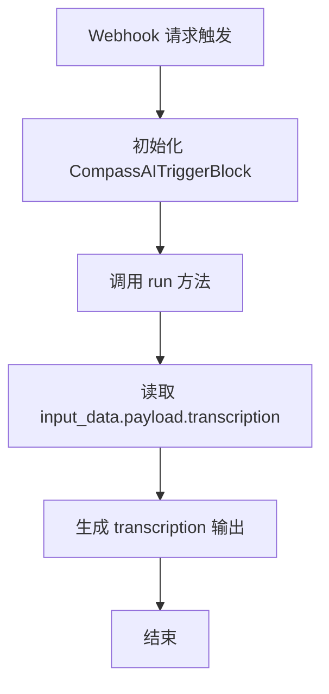
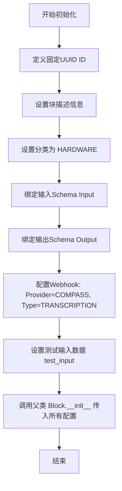
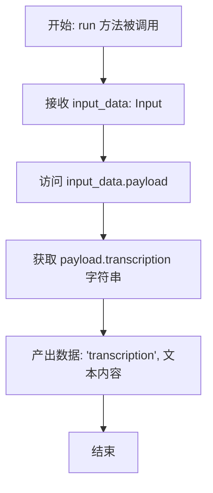

# `AutoGPT\autogpt_platform\backend\backend\blocks\compass\triggers.py` 详细设计文档

该代码实现了一个名为 `CompassAITriggerBlock` 的 Webhook 触发块，用于集成 Compass AI 服务，接收语音转录数据（`TranscriptionDataModel`），并通过异步方法将转录文本提取并输出到工作流中。

## 整体流程



## 类结构

```
Transcription (Pydantic BaseModel)
├── fields: text, speaker, end, start, duration
TranscriptionDataModel (Pydantic BaseModel)
├── fields: date, transcription, transcriptions
CompassAITriggerBlock (继承自 Block)
├── Input (内部类, 继承 BlockSchemaInput)
│   └── payload: TranscriptionDataModel
├── Output (内部类, 继承 BlockSchemaOutput)
│   └── transcription: str
├── __init__
└── run (异步方法)
```

## 全局变量及字段


### `Transcription.text`
    
The text content of the speech segment.

类型：`str`
    


### `Transcription.speaker`
    
The identifier for the speaker.

类型：`str`
    


### `Transcription.end`
    
The end timestamp of the speech segment.

类型：`float`
    


### `Transcription.start`
    
The start timestamp of the speech segment.

类型：`float`
    


### `Transcription.duration`
    
The duration of the speech segment.

类型：`float`
    


### `TranscriptionDataModel.date`
    
The date when the transcription occurred.

类型：`str`
    


### `TranscriptionDataModel.transcription`
    
The full text content of the transcription.

类型：`str`
    


### `TranscriptionDataModel.transcriptions`
    
A list of detailed Transcription objects.

类型：`list[Transcription]`
    
    

## 全局函数及方法


### `CompassAITriggerBlock.__init__`

该方法用于初始化 `CompassAITriggerBlock` 实例。它配置了块的基本元数据（如ID、描述、分类），定义了输入输出的数据模型，并设置了特定于Compass转录Webhook的集成配置及测试数据。

参数：

-  `self`：`CompassAITriggerBlock`，类的实例本身

返回值：`None`，无返回值

#### 流程图



#### 带注释源码

```python
def __init__(self):
    super().__init__(
        # 块的唯一标识符
        id="9464a020-ed1d-49e1-990f-7f2ac924a2b7",
        # 块的功能描述，说明该块用于输出Compass转录内容
        description="This block will output the contents of the compass transcription.",
        # 将块归类为硬件类别
        categories={BlockCategory.HARDWARE},
        # 指定输入数据的Schema模型，包含隐藏的payload字段
        input_schema=CompassAITriggerBlock.Input,
        # 指定输出数据的Schema模型，包含transcription字段
        output_schema=CompassAITriggerBlock.Output,
        # 配置Webhook，指定提供商为COMPASS，类型为TRANSCRIPTION
        webhook_config=BlockManualWebhookConfig(
            provider=ProviderName.COMPASS,
            webhook_type=CompassWebhookType.TRANSCRIPTION,
        ),
        # 预定义的测试输入用例，用于验证逻辑
        test_input=[
            {"input": "Hello, World!"},
            {"input": "Hello, World!", "data": "Existing Data"},
        ],
        # test_output=[...], # 测试输出配置（当前被注释）
    )
```


### `CompassAITriggerBlock.run`

该方法是 `CompassAITriggerBlock` 类的核心执行逻辑，作为一个异步生成器，它接收经过 Pydantic 模型验证的输入数据，从载荷中提取转录文本，并将其作为块输出进行生成。

参数：

- `input_data`: `CompassAITriggerBlock.Input`, 包含触发块的输入数据，其中包含一个隐藏字段 `payload`，该字段类型为 `TranscriptionDataModel`，存储了从 Webhook 接收到的实际转录数据。
- `**kwargs`: `Any`, 额外的关键字参数，用于扩展传递上下文或其他可选信息（本方法中未直接使用）。

返回值：`BlockOutput`, 一个异步生成器，产出包含输出名称和对应值的元组，此处产出为 `("transcription", <文本内容>)`。

#### 流程图



#### 带注释源码

```python
    async def run(self, input_data: Input, **kwargs) -> BlockOutput:
        # 从 input_data 的 payload 属性中提取 transcription 字段
        # 并使用 yield 语句将结果作为块的输出返回，键名为 "transcription"
        yield "transcription", input_data.payload.transcription
```


## 关键组件

### 1. 核心功能描述

该代码定义了一个基于 Pydantic 的数据处理块（Block），用于接收并处理来自 Compass AI 的转录 Webhook 数据，将接收到的结构化转录信息解析并输出为纯文本格式。

### 2. 文件的整体运行流程

文件首先定义了用于数据验证的 `Transcription` 和 `TranscriptionDataModel` Pydantic 模型。接着定义了 `CompassAITriggerBlock` 类，该类继承自 `Block`。在初始化阶段，它配置了输入输出模式、Webhook 触发器配置及元数据。当系统接收到匹配的 Webhook 请求时，`run` 方法被异步调用，从输入数据的隐藏字段 `payload` 中提取转录文本，并通过生成器将其作为输出结果传递。

### 3. 类的详细信息

#### 3.1 类：Transcription
*   **描述**：表示单个转录片段的数据模型，包含文本内容、说话者及时间信息。
*   **类字段**：
    *   `text` (str): 转录的文本内容。
    *   `speaker` (str): 说话者标识。
    *   `end` (float): 片段结束时间。
    *   `start` (float): 片段开始时间。
    *   `duration` (float): 片段持续时间。
*   **类方法**：无。

#### 3.2 类：TranscriptionDataModel
*   **描述**：表示 Webhook 接收到的完整载荷数据模型，包含日期和转录列表。
*   **类字段**：
    *   `date` (str): 转录发生的日期。
    *   `transcription` (str): 完整的转录文本字符串。
    *   `transcriptions` (list[Transcription]): 详细的转录片段列表。
*   **类方法**：无。

#### 3.3 类：CompassAITriggerBlock
*   **描述**：核心处理块，负责监听 Compass Webhook 并输出转录内容。
*   **类字段**：无显式定义的字段（主要依赖父类和内部配置类）。
*   **内部类 Input**：
    *   `payload` (TranscriptionDataModel): 隐藏的输入载荷，包含转录数据。
*   **内部类 Output**：
    *   `transcription` (str): 输出的转录文本内容。
*   **类方法**：
    *   `__init__`: 构造函数，配置块的基本信息、Schema 和 Webhook 设置。
    *   `run`: 异步运行方法，处理输入数据并产生输出。

#### 3.4 全局变量和全局函数
*   无。

### 4. 字段与变量的详细信息

#### Transcription 类字段
*   **名称**: `text`
*   **类型**: `str`
*   **描述**: 存储该片段的具体文本内容。

*   **名称**: `speaker`
*   **类型**: `str`
*   **描述**: 标识该片段对应的说话人。

*   **名称**: `end`
*   **类型**: `float`
*   **描述**: 标记该语音片段的结束时间点。

*   **名称**: `start`
*   **类型**: `float`
*   **描述**: 标记该语音片段的开始时间点。

*   **名称**: `duration`
*   **类型**: `float`
*   **描述**: 表示该语音片段持续的时长。

#### TranscriptionDataModel 类字段
*   **名称**: `date`
*   **类型**: `str`
*   **描述**: 转录数据产生的日期字符串。

*   **名称**: `transcription`
*   **类型**: `str`
*   **描述**: 完整的、合并后的转录文本结果。

*   **名称**: `transcriptions`
*   **类型**: `list[Transcription]`
*   **描述**: 包含详细时间戳和说话人信息的片段对象列表。

#### CompassAITriggerBlock.Input 类字段
*   **名称**: `payload`
*   **类型**: `TranscriptionDataModel`
*   **描述**: 从 Webhook 接收到的隐藏数据载荷对象。

#### CompassAITriggerBlock.Output 类字段
*   **名称**: `transcription`
*   **类型**: `str`
*   **描述**: 描述符为 "The contents of the compass transcription." 的输出字段。

### 5. 方法与函数的详细信息

#### CompassAITriggerBlock.__init__

*   **名称**: `__init__`
*   **参数名称**: `self`
*   **参数类型**: `CompassAITriggerBlock`
*   **参数描述**: 类实例自身。
*   **返回值类型**: `None`
*   **返回值描述**: 无返回值，仅初始化配置。
*   **Mermaid 流程图**:
    ```mermaid
    flowchart TD
        Start[Start __init__] --> SuperInit[Call super().__init__]
        SuperInit --> SetID[Set Block ID]
        SetID --> SetDesc[Set Description]
        SetDesc --> SetCategory[Set Category to HARDWARE]
        SetCategory --> SetSchemas[Set Input and Output Schemas]
        SetSchemas --> SetWebhook[Configure Compass Webhook]
        SetWebhook --> SetTest[Set Test Inputs]
        SetTest --> End[End]
    ```
*   **带注释源码**:
    ```python
    def __init__(self):
        super().__init__(
            # 定义该块在系统中的唯一标识符
            id="9464a020-ed1d-49e1-990f-7f2ac924a2b7",
            # 描述该块的功能：输出 Compass 转录内容
            description="This block will output the contents of the compass transcription.",
            # 归类为硬件相关块
            categories={BlockCategory.HARDWARE},
            # 绑定输入输出 Schema 类
            input_schema=CompassAITriggerBlock.Input,
            output_schema=CompassAITriggerBlock.Output,
            # 配置 Webhook，指定提供商为 COMPASS，类型为 TRANSCRIPTION
            webhook_config=BlockManualWebhookConfig(
                provider=ProviderName.COMPASS,
                webhook_type=CompassWebhookType.TRANSCRIPTION,
            ),
            # 定义用于测试的模拟输入数据
            test_input=[
                {"input": "Hello, World!"},
                {"input": "Hello, World!", "data": "Existing Data"},
            ],
        )
    ```

#### CompassAITriggerBlock.run

*   **名称**: `run`
*   **参数名称**: `input_data`, `**kwargs`
*   **参数类型**: `Input`, `dict`
*   **参数描述**: `input_data` 为经过 Pydantic 验证的输入对象；`kwargs` 为扩展关键字参数。
*   **返回值类型**: `BlockOutput`
*   **返回值描述**: 异步生成器，产生包含输出键值对的元组。
*   **Mermaid 流程图**:
    ```mermaid
    flowchart TD
        Start[Start run] --> AccessPayload[Access input_data.payload]
        AccessPayload --> ExtractField[Extract transcription field]
        ExtractField --> YieldResult[Yield 'transcription', text]
        YieldResult --> End[End]
    ```
*   **带注释源码**:
    ```python
    async def run(self, input_data: Input, **kwargs) -> BlockOutput:
        # 从输入载荷中提取 transcription 字段
        # 并将其作为名为 "transcription" 的输出产出
        yield "transcription", input_data.payload.transcription
    ```

### 6. 关键组件信息

### Transcription
定义转录片段的基础数据结构，包含时间戳和说话人信息。

### TranscriptionDataModel
封装完整的 Webhook 载荷结构，用于后端验证数据格式。

### CompassAITriggerBlock
作为 Webhook 触发器，连接外部 Compass AI 服务与内部工作流，负责数据的提取与转发。

### 7. 潜在的技术债务或优化空间

1.  **数据利用率不足**：`TranscriptionDataModel` 中包含详细的 `transcriptions` 列表（包含时间戳和说话人），但 `run` 方法仅输出了扁平化的 `transcription` 字符串。未来可扩展输出结构以支持分段、说话人分离或时间轴分析。
2.  **错误处理缺失**：`run` 方法中直接访问 `input_data.payload.transcription`，如果数据结构不符合预期（尽管有 Pydantic 验证，但 `transcription` 字段可能为空或 None），可能会抛出 AttributeError。建议增加显式的检查或异常捕获。
3.  **硬编码配置**：`test_input` 和 `id` 字段硬编码在类中，降低了配置的灵活性，建议移至配置文件或依赖注入。

### 8. 其它项目

#### 设计目标与约束
设计目标是实现一个松耦合的集成模块，能够接收外部 Compass AI 服务的事件并标准化输出。约束包括必须继承 `Block` 基类并实现特定的 `run` 异步接口。

#### 错误处理与异常设计
主要依赖 Pydantic 模型进行输入数据的结构校验（类型检查、必填字段检查）。业务逻辑层（`run` 方法）未实现额外的容错机制，依赖上层调用者捕获生成器抛出的异常。

#### 数据流与状态机
数据流是单向的：外部 Webhook 请求 -> `Input` Schema 解析 -> `run` 逻辑处理 -> `Output` Schema 生成 -> 下游节点。该组件是无状态的，不保存运行时上下文。

#### 外部依赖与接口契约
依赖于 `backend.data.block` 框架提供的基类和类型定义，以及 `backend.integrations.providers` 中定义的 Compass 提供商枚举。契约遵循 `Block` 接口，即必须实现 `Input`、`Output` 内部类和 `run` 方法。

## 问题及建议


### 已知问题

-   **数据模型字段命名歧义**：`TranscriptionDataModel` 中同时存在 `transcription`（字符串）和 `transcriptions`（列表）字段，当前代码仅输出了字符串字段。这导致模型中包含的详细信息（如发言人、时间戳、分段列表）被忽略，且字段命名相似容易引起开发者的混淆。
-   **块分类错误**：该块被归类为 `BlockCategory.HARDWARE`，但从其功能和 Webhook 配置（`ProviderName.COMPASS`）来看，它是一个基于 Webhook 的软件集成触发器，应归类为集成类或 API 类，而非硬件类。
-   **测试数据与 Schema 不匹配**：`__init__` 方法中定义的 `test_input` 使用了简单的字典结构（如 `{"input": "Hello, World!"}`），但这与 `Input` 类定义的 Schema（`payload: TranscriptionDataModel`）不匹配，导致现有的测试用例实际上无法通过验证。
-   **缺乏容错机制**：`run` 方法直接返回 `input_data.payload.transcription`，如果该字段为空字符串或 None，代码没有提供任何降级处理或异常捕获逻辑。

### 优化建议

-   **增强输出灵活性**：建议重构输出 Schema，增加配置选项允许用户选择输出格式。例如，可以提供“纯文本模式”（当前行为）和“详细 JSON 模式”（输出包含说话人、时间戳的完整结构化数据），以满足更复杂的业务需求。
-   **实现数据回退逻辑**：在 `run` 方法中增加逻辑判断，当 `transcription` 字段为空时，自动尝试将 `transcriptions` 列表中的文本拼接并返回，从而最大化利用接收到的数据。
-   **修正类别与测试定义**：将 `categories` 修改为正确的分类（如 `BlockCategory.INTEGRATIONS`），并重写 `test_input` 以确保其符合 `TranscriptionDataModel` 的结构要求，保证自动化测试的有效性。
-   **增加日志与监控**：在 Webhook 触发和数据处理的关键节点添加日志记录（如记录接收到的载荷大小、处理耗时），以便于在生产环境中排查集成问题。
-   **输入验证增强**：在 `TranscriptionDataModel` 中利用 Pydantic 的 `Field` 增加校验器，确保 `date` 格式正确或 `duration` 为正数，提前过滤无效数据。


## 其它


### 设计目标与约束

该模块旨在作为 Compass AI 提供者的 Webhook 触发器块，专门用于接收和处理硬件设备产生的语音转录数据。设计约束包括必须继承自 `Block` 基类，使用 Pydantic 模型进行数据校验，以及符合后端框架的异步执行和 Webhook 配置规范。该块被归类为 `HARDWARE` 类别，表明其处理物理设备的输入，且 `payload` 被设计为隐藏字段，意味着对用户不可见，仅由系统内部通过 Webhook 注入。

### 数据流与状态机

**数据流**:
1. 外部 Compass 服务通过 Webhook 发送转录数据。
2. 后端基础设施接收请求，并将 JSON 负载解析并填充到 `Input` 类的 `payload` 字段（类型为 `TranscriptionDataModel`）。
3. `run` 异步方法被调用，接收 `input_data`。
4. 方法提取 `input_data.payload.transcription` 字段。
5. 处理后的数据通过 `yield` 生成器机制输出到 `Output` 的 `transcription` 字段。

**状态机**:
该组件本质上是一个事件驱动的无状态处理器。
- **空闲**: 等待外部 Webhook 请求。
- **处理**: 接收到有效请求后，执行 `run` 方法进行数据提取。
- **完成**: 数据提取并输出后，任务即刻结束，回到空闲状态。

### 外部依赖与接口契约

**外部依赖**:
- `pydantic`: 用于定义 `Transcription`、`TranscriptionDataModel` 数据模型，提供运行时数据验证。
- `backend.data.block`: 依赖 `Block` 基类、`BlockSchemaInput`、`BlockSchemaOutput` 等核心抽象，定义了组件的基本行为和元数据结构。
- `backend.integrations.providers` & `webhooks`: 依赖 `ProviderName` 和 `CompassWebhookType` 枚举，以正确注册和路由 Webhook 事件。

**接口契约**:
- **输入契约**: 调用方（通常是 Webhook 接收器）必须提供一个包含 `date`、`transcription` 和 `transcriptions` 列表的 JSON 对象。`transcription` 字段必须存在且为字符串。
- **输出契约**: `run` 方法必须生成一个元组 `("transcription", <string_value>)`。
- **配置契约**: 必须配置为手动 Webhook 模式 (`BlockManualWebhookConfig`)，明确指定提供者为 `COMPASS` 且类型为 `TRANSCRIPTION`。

### 错误处理与异常设计

**当前设计**:
- **验证阶段**: 依赖 Pydantic 的 `BaseModel` 进行输入数据的结构验证。如果 Webhook 传入的数据不符合 `TranscriptionDataModel` 的定义（例如缺少字段或类型错误），系统将在进入 `run` 方法前抛出 `ValidationError`，由上层框架捕获并处理。
- **执行阶段**: `run` 方法内部当前未实现显式的 `try-except` 异常捕获。它直接访问 `input_data.payload.transcription`。这假设 Pydantic 已经保证了该字段的存在和类型正确。

**潜在异常场景**:
- 如果 `transcription` 字段在验证通过后但逻辑上仍为 `None` 或空字符串，代码会将其原样输出，下游组件需具备处理空值的能力。
- 任何未预料的运行时错误（如内存不足、并发问题）将导致异步协程崩溃，异常将向上抛出至任务调度器。


    