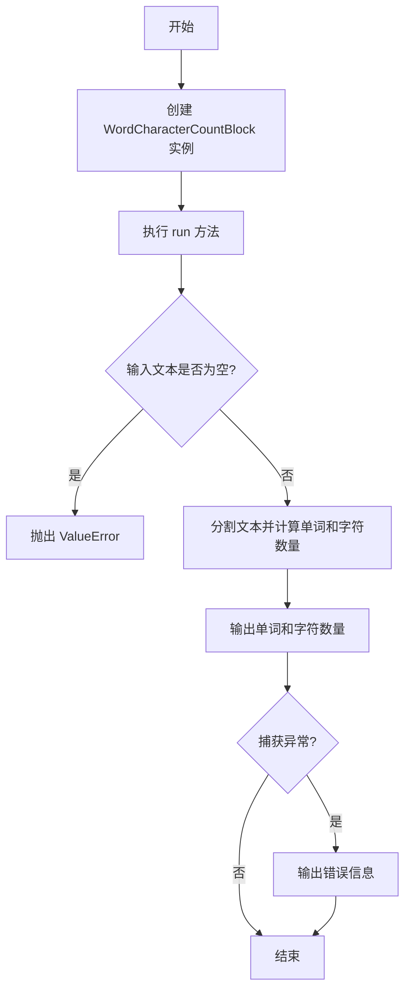
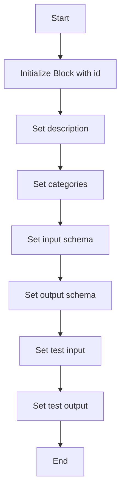
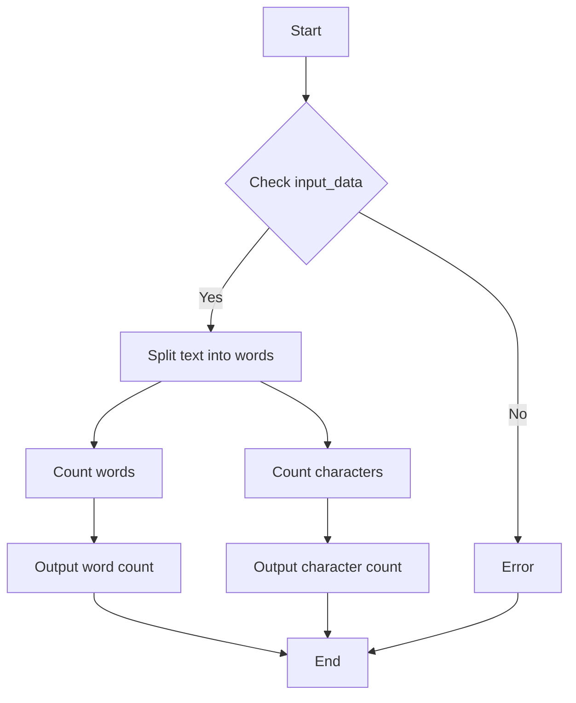

# `.\AutoGPT\autogpt_platform\backend\backend\blocks\count_words_and_char_block.py` 详细设计文档

This code defines a WordCharacterCountBlock class that counts the number of words and characters in a given text and handles exceptions that may occur during the counting process.

## 整体流程



## 类结构

```
WordCharacterCountBlock (具体类)
├── Input (内部类)
│   ├── text (str)
└── Output (内部类)
    ├── word_count (int)
    ├── character_count (int)
    └── error (str)
```

## 全局变量及字段


### `id`
    
Unique identifier for the block

类型：`str`
    


### `description`
    
Description of the block's functionality

类型：`str`
    


### `categories`
    
Set of categories the block belongs to

类型：`set`
    


### `input_schema`
    
Schema for the input data of the block

类型：`Input`
    


### `output_schema`
    
Schema for the output data of the block

类型：`Output`
    


### `test_input`
    
Test input data for the block

类型：`dict`
    


### `test_output`
    
Test output data for the block

类型：`list`
    


### `Input.text`
    
Input text to count words and characters

类型：`str`
    


### `Output.word_count`
    
Number of words in the input text

类型：`int`
    


### `Output.character_count`
    
Number of characters in the input text

类型：`int`
    


### `Output.error`
    
Error message if the counting operation failed

类型：`str`
    
    

## 全局函数及方法


### WordCharacterCountBlock.__init__

This method initializes the WordCharacterCountBlock class, setting up its properties and configurations.

参数：

- `self`：`WordCharacterCountBlock`，The instance of the class being initialized.

返回值：无，This method does not return any value.

#### 流程图



#### 带注释源码

```python
def __init__(self):
    super().__init__(
        id="ab2a782d-22cf-4587-8a70-55b59b3f9f90",
        description="Counts the number of words and characters in a given text.",
        categories={BlockCategory.TEXT},
        input_schema=WordCharacterCountBlock.Input,
        output_schema=WordCharacterCountBlock.Output,
        test_input={"text": "Hello, how are you?"},
        test_output=[("word_count", 4), ("character_count", 19)],
    )
```


### WordCharacterCountBlock.run

This method counts the number of words and characters in the provided text.

参数：

- `input_data`：`Input`，The input data containing the text to be analyzed.

返回值：`BlockOutput`，The output containing the word count, character count, and any error message.

#### 流程图



#### 带注释源码

```python
async def run(self, input_data: Input, **kwargs) -> BlockOutput:
    try:
        text = input_data.text
        word_count = len(text.split())
        character_count = len(text)

        yield "word_count", word_count
        yield "character_count", character_count

    except Exception as e:
        yield "error", str(e)
```


## 关键组件


### 张量索引与惰性加载

用于高效地索引和访问张量数据，支持惰性加载以减少内存消耗。

### 反量化支持

提供对反量化操作的支持，允许在量化过程中进行反向量化。

### 量化策略

定义了量化策略，用于在模型训练和推理过程中对权重和激活进行量化。


## 问题及建议


### 已知问题

-   {问题1}：代码中使用了`yield`关键字，这表明`run`方法可能被设计为生成器。然而，`BlockOutput`类型没有明确指定是否支持生成器，这可能导致在使用时出现类型错误或不兼容。
-   {问题2}：异常处理中捕获了所有异常，这可能导致一些非预期的异常被静默处理，而没有给出明确的错误信息。
-   {问题3}：`test_input`和`test_output`仅用于测试，但在实际应用中可能需要更详细的测试用例来覆盖更多的边界情况和异常情况。

### 优化建议

-   {建议1}：检查`BlockOutput`类型是否支持生成器，如果不支持，则应修改`run`方法以返回一个包含结果的列表，而不是使用生成器。
-   {建议2}：在异常处理中，应该针对可能发生的特定异常进行捕获和处理，而不是捕获所有异常。这样可以提供更具体的错误信息，帮助调试和错误追踪。
-   {建议3}：扩展测试用例，包括空字符串、特殊字符、多行文本等不同情况，以确保代码在各种输入下都能正确运行。
-   {建议4}：考虑将错误处理逻辑封装到一个单独的方法中，以提高代码的可读性和可维护性。
-   {建议5}：如果`BlockOutput`类型支持，可以考虑使用更高级的异步编程模式，如`async for`循环，来处理输出结果。


## 其它


### 设计目标与约束

- 设计目标：实现一个高效、可扩展的文本字符和单词计数功能，能够集成到更大的数据处理系统中。
- 约束条件：确保代码的健壮性，能够处理异常输入，并提供清晰的错误信息。

### 错误处理与异常设计

- 错误处理：通过捕获异常并返回错误信息，确保在输入数据无效或处理过程中出现问题时，系统能够优雅地处理。
- 异常设计：定义了`error`字段来存储错误信息，以便在输出中提供详细的错误描述。

### 数据流与状态机

- 数据流：输入文本通过`run`方法进行处理，输出单词和字符计数以及可能的错误信息。
- 状态机：该类没有实现状态机，但`run`方法可以视为一个处理流程，从输入到输出的转换。

### 外部依赖与接口契约

- 外部依赖：依赖于`backend.data.block`和`backend.data.model`模块中的类和函数。
- 接口契约：通过继承`Block`类并实现`run`方法，遵循了接口契约，确保与其他块组件的兼容性。

### 测试与验证

- 测试：提供测试输入和预期输出，确保`WordCharacterCountBlock`按预期工作。
- 验证：通过单元测试和集成测试来验证代码的正确性和性能。

### 安全性与隐私

- 安全性：确保输入数据在处理过程中不会被泄露或篡改。
- 隐私：不涉及敏感数据，因此隐私保护不是主要考虑因素。

### 性能考量

- 性能：优化字符串处理和计数操作，确保在处理大量文本时保持高效。

### 可维护性与可扩展性

- 可维护性：代码结构清晰，易于理解和维护。
- 可扩展性：设计允许轻松添加新的功能或处理不同的文本格式。

### 文档与注释

- 文档：提供详细的设计文档和代码注释，以便其他开发者能够理解和使用该代码。
- 注释：在代码中添加必要的注释，解释复杂逻辑和设计决策。

### 代码风格与规范

- 代码风格：遵循Python代码风格指南，确保代码的可读性和一致性。
- 规范：使用PEP 8等规范来确保代码质量。


    