# `AutoGPT\autogpt_platform\backend\backend\blocks\data_manipulation.py` 详细设计文档

该文件定义了一系列用于处理字典和列表数据结构的异步操作块，通过继承基类 Block 实现了创建、添加、查找、移除、替换及检查空值等基本数据操作功能，为数据处理工作流提供了原子化的逻辑组件。

## 整体流程

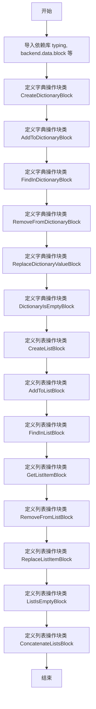

## 类结构

```
Block (基类)
├── CreateDictionaryBlock
├── AddToDictionaryBlock
├── FindInDictionaryBlock
├── RemoveFromDictionaryBlock
├── ReplaceDictionaryValueBlock
├── DictionaryIsEmptyBlock
├── CreateListBlock
├── AddToListBlock
├── FindInListBlock
├── GetListItemBlock
├── RemoveFromListBlock
├── ReplaceListItemBlock
├── ListIsEmptyBlock
└── ConcatenateListsBlock
```

## 全局变量及字段


### `CreateDictionaryBlock.values`
    
Key-value pairs to create the dictionary with

类型：`dict[str, Any]`
    


### `CreateDictionaryBlock.dictionary`
    
The created dictionary containing the specified key-value pairs

类型：`dict[str, Any]`
    


### `CreateDictionaryBlock.error`
    
Error message if dictionary creation failed

类型：`str`
    


### `AddToDictionaryBlock.dictionary`
    
The dictionary to add the entry to. If not provided, a new dictionary will be created.

类型：`dict[Any, Any]`
    


### `AddToDictionaryBlock.key`
    
The key for the new entry.

类型：`str`
    


### `AddToDictionaryBlock.value`
    
The value for the new entry.

类型：`Any`
    


### `AddToDictionaryBlock.entries`
    
The entries to add to the dictionary. This is the batch version of the `key` and `value` fields.

类型：`dict[Any, Any]`
    


### `AddToDictionaryBlock.updated_dictionary`
    
The dictionary with the new entry added.

类型：`dict`
    


### `FindInDictionaryBlock.input`
    
Dictionary to lookup from

类型：`Any`
    


### `FindInDictionaryBlock.key`
    
Key to lookup in the dictionary

类型：`str | int`
    


### `FindInDictionaryBlock.output`
    
Value found for the given key

类型：`Any`
    


### `FindInDictionaryBlock.missing`
    
Value of the input that missing the key

类型：`Any`
    


### `RemoveFromDictionaryBlock.dictionary`
    
The dictionary to modify.

类型：`dict[Any, Any]`
    


### `RemoveFromDictionaryBlock.key`
    
Key to remove from the dictionary.

类型：`str | int`
    


### `RemoveFromDictionaryBlock.return_value`
    
Whether to return the removed value.

类型：`bool`
    


### `RemoveFromDictionaryBlock.updated_dictionary`
    
The dictionary after removal.

类型：`dict[Any, Any]`
    


### `RemoveFromDictionaryBlock.removed_value`
    
The removed value if requested.

类型：`Any`
    


### `ReplaceDictionaryValueBlock.dictionary`
    
The dictionary to modify.

类型：`dict[Any, Any]`
    


### `ReplaceDictionaryValueBlock.key`
    
Key to replace the value for.

类型：`str | int`
    


### `ReplaceDictionaryValueBlock.value`
    
The new value for the given key.

类型：`Any`
    


### `ReplaceDictionaryValueBlock.updated_dictionary`
    
The dictionary after replacement.

类型：`dict[Any, Any]`
    


### `ReplaceDictionaryValueBlock.old_value`
    
The value that was replaced.

类型：`Any`
    


### `DictionaryIsEmptyBlock.dictionary`
    
The dictionary to check.

类型：`dict[Any, Any]`
    


### `DictionaryIsEmptyBlock.is_empty`
    
True if the dictionary is empty.

类型：`bool`
    


### `CreateListBlock.values`
    
A list of values to be combined into a new list.

类型：`List[Any]`
    


### `CreateListBlock.max_size`
    
Maximum size of the list. If provided, the list will be yielded in chunks of this size.

类型：`int | None`
    


### `CreateListBlock.max_tokens`
    
Maximum tokens for the list. If provided, the list will be yielded in chunks that fit within this token limit.

类型：`int | None`
    


### `CreateListBlock.list`
    
The created list containing the specified values.

类型：`List[Any]`
    


### `AddToListBlock.list`
    
The list to add the entry to. If not provided, a new list will be created.

类型：`List[Any]`
    


### `AddToListBlock.entry`
    
The entry to add to the list. Can be of any type (string, int, dict, etc.).

类型：`Any`
    


### `AddToListBlock.entries`
    
The entries to add to the list. This is the batch version of the `entry` field.

类型：`List[Any]`
    


### `AddToListBlock.position`
    
The position to insert the new entry. If not provided, the entry will be appended to the end of the list.

类型：`int | None`
    


### `AddToListBlock.updated_list`
    
The list with the new entry added.

类型：`List[Any]`
    


### `FindInListBlock.list`
    
The list to search in.

类型：`List[Any]`
    


### `FindInListBlock.value`
    
The value to search for.

类型：`Any`
    


### `FindInListBlock.index`
    
The index of the value in the list.

类型：`int`
    


### `FindInListBlock.found`
    
Whether the value was found in the list.

类型：`bool`
    


### `FindInListBlock.not_found_value`
    
The value that was not found in the list.

类型：`Any`
    


### `GetListItemBlock.list`
    
The list to get the item from.

类型：`List[Any]`
    


### `GetListItemBlock.index`
    
The 0-based index of the item (supports negative indices).

类型：`int`
    


### `GetListItemBlock.item`
    
The item at the specified index.

类型：`Any`
    


### `RemoveFromListBlock.list`
    
The list to modify.

类型：`List[Any]`
    


### `RemoveFromListBlock.value`
    
Value to remove from the list.

类型：`Any`
    


### `RemoveFromListBlock.index`
    
Index of the item to pop (supports negative indices).

类型：`int | None`
    


### `RemoveFromListBlock.return_item`
    
Whether to return the removed item.

类型：`bool`
    


### `RemoveFromListBlock.updated_list`
    
The list after removal.

类型：`List[Any]`
    


### `RemoveFromListBlock.removed_item`
    
The removed item if requested.

类型：`Any`
    


### `ReplaceListItemBlock.list`
    
The list to modify.

类型：`List[Any]`
    


### `ReplaceListItemBlock.index`
    
Index of the item to replace (supports negative indices).

类型：`int`
    


### `ReplaceListItemBlock.value`
    
The new value for the given index.

类型：`Any`
    


### `ReplaceListItemBlock.updated_list`
    
The list after replacement.

类型：`List[Any]`
    


### `ReplaceListItemBlock.old_item`
    
The item that was replaced.

类型：`Any`
    


### `ListIsEmptyBlock.list`
    
The list to check.

类型：`List[Any]`
    


### `ListIsEmptyBlock.is_empty`
    
True if the list is empty.

类型：`bool`
    


### `ConcatenateListsBlock.lists`
    
A list of lists to concatenate together. All lists will be combined in order into a single list.

类型：`List[List[Any]]`
    


### `ConcatenateListsBlock.concatenated_list`
    
The concatenated list containing all elements from all input lists in order.

类型：`List[Any]`
    


### `ConcatenateListsBlock.error`
    
Error message if concatenation failed due to invalid input types.

类型：`str`
    
    

## 全局函数及方法


### `CreateDictionaryBlock.__init__`

该方法用于初始化 `CreateDictionaryBlock` 实例。它通过设置块ID、描述、分类、输入/输出模式以及测试用例来配置块的元数据，并调用父类 `Block` 的构造函数来完成注册。

参数：

-  `self`：`CreateDictionaryBlock`，类的实例本身。

返回值：`None`，该方法不返回任何值，仅用于初始化对象状态。

#### 流程图

```mermaid
flowchart TD
    A([开始]) --> B[调用 super().__init__ 并传入块配置参数]
    B --> C{父类初始化成功?}
    C -- 是 --> D([结束])
    C -- 否 --> E[抛出异常]
```

#### 带注释源码

```python
def __init__(self):
    super().__init__(
        # 定义块的唯一标识符
        id="b924ddf4-de4f-4b56-9a85-358930dcbc91",
        # 定义块的描述文本，说明其功能和使用场景
        description="Creates a dictionary with the specified key-value pairs. Use this when you know all the values you want to add upfront.",
        # 定义块所属的分类，此处为 DATA 类
        categories={BlockCategory.DATA},
        # 定义块的输入模式，使用内部类 Input 指定输入结构
        input_schema=CreateDictionaryBlock.Input,
        # 定义块的输出模式，使用内部类 Output 指定输出结构
        output_schema=CreateDictionaryBlock.Output,
        # 定义测试输入样本，用于验证块的逻辑
        test_input=[
            {
                "values": {"name": "Alice", "age": 25, "city": "New York"},
            },
            {
                "values": {"numbers": [1, 2, 3], "active": True, "score": 95.5},
            },
        ],
        # 定义预期的测试输出结果，与测试输入一一对应
        test_output=[
            (
                "dictionary",
                {"name": "Alice", "age": 25, "city": "New York"},
            ),
            (
                "dictionary",
                {"numbers": [1, 2, 3], "active": True, "score": 95.5},
            ),
        ],
    )
```


### `CreateDictionaryBlock.run`

该方法是 `CreateDictionaryBlock` 的核心执行逻辑，负责接收包含键值对的输入数据，并将其作为字典输出，同时处理可能出现的异常。

参数：

- `input_data`：`CreateDictionaryBlock.Input`，包含输入数据的对象，其中 `values` 字段存储了用于创建字典的键值对。
- `**kwargs`：`Any`，额外的关键字参数（通常用于上下文传递，本方法中未直接使用）。

返回值：`BlockOutput`，一个生成器，产生包含输出名称（"dictionary" 或 "error"）和对应数据的元组。

#### 流程图

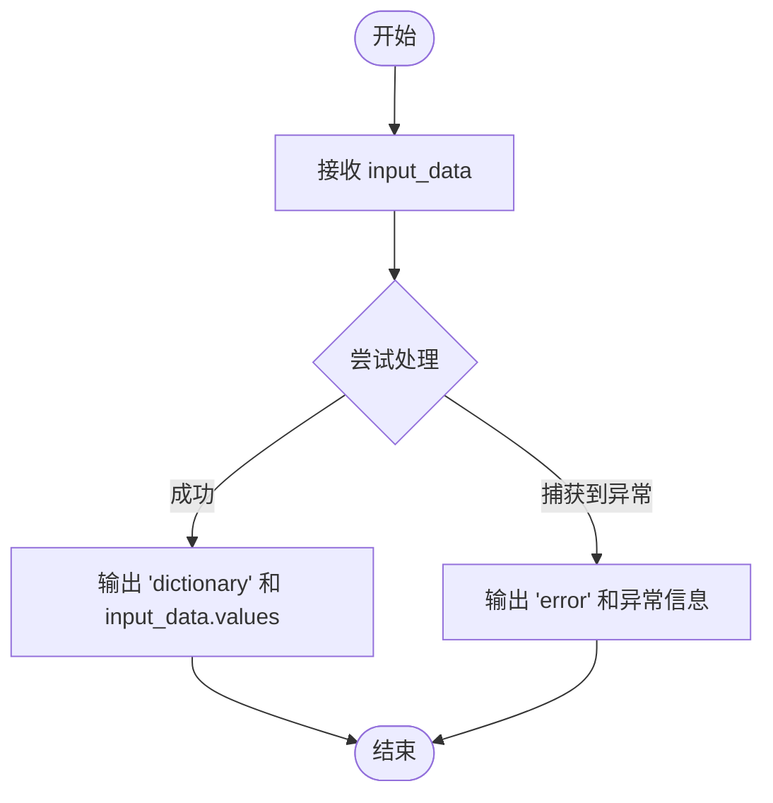

#### 带注释源码

```python
async def run(self, input_data: Input, **kwargs) -> BlockOutput:
    try:
        # The values are already validated by Pydantic schema
        # 直接输出输入数据中的 values 字段，因为 Pydantic 已经在 Schema 层面完成了验证
        yield "dictionary", input_data.values
    except Exception as e:
        # 如果在处理过程中发生任何意外错误，输出错误信息
        yield "error", f"Failed to create dictionary: {str(e)}"
```


### `AddToDictionaryBlock.__init__`

初始化 `AddToDictionaryBlock` 实例。该方法通过调用父类 `Block` 的构造函数，配置该块的元数据，包括其唯一 ID、描述文本、所属分类、输入输出 Schema 定义以及用于测试的输入输出示例数据。

参数：

-  `self`：`AddToDictionaryBlock`，类的实例引用。

返回值：`None`，无返回值。

#### 流程图

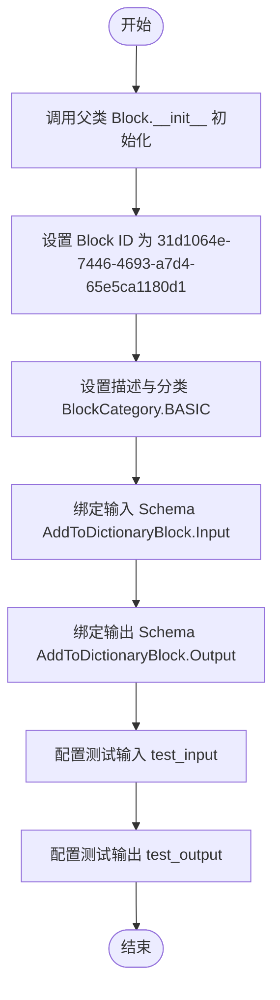

#### 带注释源码

```python
    def __init__(self):
        # 调用父类 Block 的初始化方法，配置块的静态元数据和架构
        super().__init__(
            # 块的唯一标识符
            id="31d1064e-7446-4693-a7d4-65e5ca1180d1",
            # 块的功能描述：向字典添加键值对，如果未提供字典则创建新字典
            description="Adds a new key-value pair to a dictionary. If no dictionary is provided, a new one is created.",
            # 块所属的分类：基础
            categories={BlockCategory.BASIC},
            # 定义输入数据的 Schema 结构
            input_schema=AddToDictionaryBlock.Input,
            # 定义输出数据的 Schema 结构
            output_schema=AddToDictionaryBlock.Output,
            # 定义测试输入用例，包含添加单对键值、创建新字典、批量添加条目等场景
            test_input=[
                {
                    "dictionary": {"existing_key": "existing_value"},
                    "key": "new_key",
                    "value": "new_value",
                },
                {"key": "first_key", "value": "first_value"},
                {
                    "dictionary": {"existing_key": "existing_value"},
                    "entries": {"new_key": "new_value", "first_key": "first_value"},
                },
            ],
            # 定义预期的测试输出结果，与 test_input 一一对应
            test_output=[
                (
                    "updated_dictionary",
                    {"existing_key": "existing_value", "new_key": "new_value"},
                ),
                ("updated_dictionary", {"first_key": "first_value"}),
                (
                    "updated_dictionary",
                    {
                        "existing_key": "existing_value",
                        "new_key": "new_value",
                        "first_key": "first_value",
                    },
                ),
            ],
        )
```


### `AddToDictionaryBlock.run`

将新的键值对或一组条目添加到指定的字典中。如果未提供字典，则创建一个新字典。

参数：

-  `input_data`：`AddToDictionaryBlock.Input`，包含输入字典、单个键值对以及批量条目的数据对象。
-  `**kwargs`：`Any`，其他关键字参数。

返回值：`BlockOutput`，生成器，产出包含更新后字典的元组。

#### 流程图

```mermaid
flowchart TD
    A[开始: AddToDictionaryBlock.run] --> B[复制输入字典至 updated_dict]
    B --> C{检查 input_data.value 是否非空<br/>且 input_data.key 是否存在}
    C -- 是 --> D[updated_dict[input_data.key] = input_data.value]
    C -- 否 --> E[遍历 input_data.entries]
    D --> E
    E --> F[循环: updated_dict[k] = v]
    F --> G[产出: updated_dictionary, updated_dict]
    G --> H[结束]
```

#### 带注释源码

```python
async def run(self, input_data: Input, **kwargs) -> BlockOutput:
        # 复制输入字典以避免修改原始数据
        updated_dict = input_data.dictionary.copy()

        # 检查是否提供了单个键值对 (value不为None且key不为空字符串)
        if input_data.value is not None and input_data.key:
            updated_dict[input_data.key] = input_data.value

        # 遍历批量条目 (entries) 并添加到字典中
        for key, value in input_data.entries.items():
            updated_dict[key] = value

        # 产出最终的更新后字典
        yield "updated_dictionary", updated_dict
```


### `FindInDictionaryBlock.__init__`

初始化 FindInDictionaryBlock 实例，配置块的唯一标识、描述信息、输入输出模式、测试数据及分类。

参数：

- `self`：`FindInDictionaryBlock`，类实例本身

返回值：`None`，无（构造函数用于初始化对象配置）

#### 流程图

```mermaid
flowchart TD
    Start([开始]) --> InitCall[调用父类构造函数 super().__init__]
    InitCall --> SetID[设置 ID: 0e50422c-6dee-4145-83d6-3a5a392f65de]
    InitCall --> SetDesc[设置描述: 在字典、列表或对象中查找值]
    InitCall --> SetSchemas[设置输入/输出模式 Schema]
    InitCall --> SetTests[设置测试输入和输出数据]
    InitCall --> SetCategory[设置分类: BlockCategory.BASIC]
    SetID --> End([结束])
    SetDesc --> End
    SetSchemas --> End
    SetTests --> End
    SetCategory --> End
```

#### 带注释源码

```python
def __init__(self):
    # 调用父类 Block 的构造函数，初始化块的基本属性
    super().__init__(
        # 块的唯一标识符
        id="0e50422c-6dee-4145-83d6-3a5a392f65de",
        # 块的功能描述，说明其支持通过键或索引在字典、列表或对象中查找值
        description="A block that looks up a value in a dictionary, list, or object by key or index and returns the corresponding value.",
        # 指定输入数据的验证模式，使用内部类 Input 定义
        input_schema=FindInDictionaryBlock.Input,
        # 指定输出数据的验证模式，使用内部类 Output 定义
        output_schema=FindInDictionaryBlock.Output,
        # 定义测试用例输入，包含字典、列表、MockObject 等多种场景
        test_input=[
            {"input": {"apple": 1, "banana": 2, "cherry": 3}, "key": "banana"},
            {"input": {"x": 10, "y": 20, "z": 30}, "key": "w"},
            {"input": [1, 2, 3], "key": 1},
            {"input": [1, 2, 3], "key": 3},
            {"input": MockObject(value="!!", key="key"), "key": "key"},
            {"input": [{"k1": "v1"}, {"k2": "v2"}, {"k1": "v3"}], "key": "k1"},
        ],
        # 定义测试用例的预期输出，与 test_input 一一对应
        test_output=[
            ("output", 2),
            ("missing", {"x": 10, "y": 20, "z": 30}),
            ("output", 2),
            ("missing", [1, 2, 3]),
            ("output", "key"),
            ("output", ["v1", "v3"]),
        ],
        # 设置块的分类为 BASIC（基础类型）
        categories={BlockCategory.BASIC},
    )
```


### `FindInDictionaryBlock.run`

根据输入的键在字典、列表或对象中查找对应的值。支持通过字典键、列表索引或对象属性进行查找，如果输入是JSON字符串会自动解析。若未找到匹配项，则返回原始输入。

参数：

- `input_data`：`FindInDictionaryBlock.Input`，包含要查找的对象（`input`）和查找键（`key`）的数据对象。
- `**kwargs`：`Any`，扩展用的关键字参数。

返回值：`BlockOutput`，异步生成器，生成包含输出名称和值的元组。成功时生成 `("output", value)`，失败时生成 `("missing", input)`。

#### 流程图

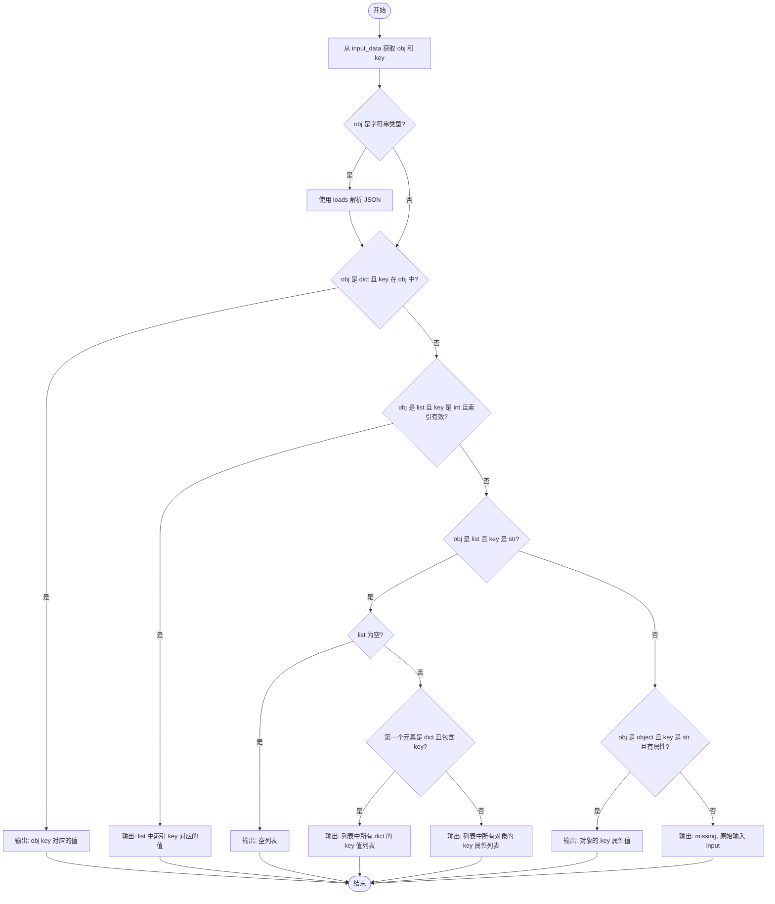

#### 带注释源码

```python
    async def run(self, input_data: Input, **kwargs) -> BlockOutput:
        # 获取输入对象和查找键
        obj = input_data.input
        key = input_data.key

        # 如果输入对象是字符串，尝试将其解析为 JSON 字典
        if isinstance(obj, str):
            obj = loads(obj)

        # 情况1: 对象是字典且键存在 -> 返回对应的值
        if isinstance(obj, dict) and key in obj:
            yield "output", obj[key]
        
        # 情况2: 对象是列表且键是整数且索引有效 -> 返回索引对应的元素
        elif isinstance(obj, list) and isinstance(key, int) and 0 <= key < len(obj):
            yield "output", obj[key]
        
        # 情况3: 对象是列表且键是字符串 -> 查找列表中元素的字段或属性
        elif isinstance(obj, list) and isinstance(key, str):
            if len(obj) == 0:
                # 列表为空，返回空列表
                yield "output", []
            elif isinstance(obj[0], dict) and key in obj[0]:
                # 假设列表元素均为字典，提取所有字典中该键的值
                yield "output", [item[key] for item in obj if key in item]
            else:
                # 假设列表元素均为对象，提取所有对象中该属性的值
                yield "output", [getattr(val, key) for val in obj if hasattr(val, key)]
        
        # 情况4: 对象是普通对象且键是字符串且对象有该属性 -> 返回属性值
        elif isinstance(obj, object) and isinstance(key, str) and hasattr(obj, key):
            yield "output", getattr(obj, key)
        
        # 情况5: 未找到匹配项 -> 返回原始输入标记为 missing
        else:
            yield "missing", input_data.input
```


### `RemoveFromDictionaryBlock.__init__`

该方法是 `RemoveFromDictionaryBlock` 类的构造函数，用于初始化块的基本属性，包括唯一标识符、功能描述、所属类别、输入输出模式定义以及用于验证功能的测试样本数据。

参数：

-   `self`：`RemoveFromDictionaryBlock`，类的实例对象本身。

返回值：`None`，构造函数不返回任何值。

#### 流程图

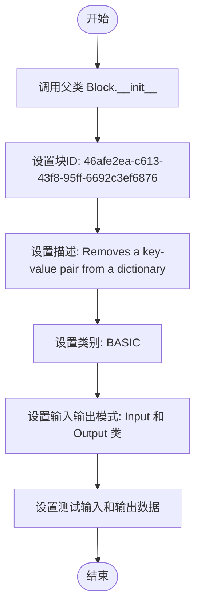

#### 带注释源码

```python
def __init__(self):
    # 调用父类 Block 的初始化方法，配置块的元数据和 schema
    super().__init__(
        # 块的唯一标识符
        id="46afe2ea-c613-43f8-95ff-6692c3ef6876",
        # 块的功能描述
        description="Removes a key-value pair from a dictionary.",
        # 块所属的分类，这里归为基础功能块 (BASIC)
        categories={BlockCategory.BASIC},
        # 定义输入数据的 Schema，引用内部类 Input，规范字典、键和返回值标志
        input_schema=RemoveFromDictionaryBlock.Input,
        # 定义输出数据的 Schema，引用内部类 Output，规范更新后的字典和被移除的值
        output_schema=RemoveFromDictionaryBlock.Output,
        # 定义测试用例的输入数据，用于验证块的功能逻辑
        test_input=[
            {
                "dictionary": {"a": 1, "b": 2, "c": 3},
                "key": "b",
                "return_value": True,
            },
            {"dictionary": {"x": "hello", "y": "world"}, "key": "x"},
        ],
        # 定义测试用例对应的预期输出数据
        test_output=[
            ("updated_dictionary", {"a": 1, "c": 3}),
            ("removed_value", 2),
            ("updated_dictionary", {"y": "world"}),
        ],
    )
```


### `RemoveFromDictionaryBlock.run`

从给定的字典中移除指定的键，并可选择返回被移除的值。

参数：

-  `input_data`：`RemoveFromDictionaryBlock.Input`，包含待修改的字典、要移除的键以及是否返回被移除值的标志。
-  `**kwargs`：`Any`，用于扩展的额外关键字参数。

返回值：`BlockOutput`，异步生成器，产生包含操作结果（如更新后的字典、被移除的值或错误信息）的元组。

#### 流程图

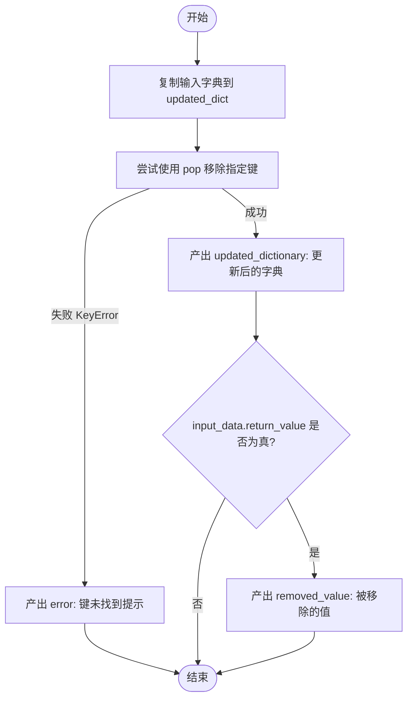

#### 带注释源码

```python
    async def run(self, input_data: Input, **kwargs) -> BlockOutput:
        # 复制输入字典，避免直接修改原始数据
        updated_dict = input_data.dictionary.copy()
        try:
            # 尝试从字典中移除指定的键，并获取对应的值
            removed_value = updated_dict.pop(input_data.key)
            # 产出更新后的字典
            yield "updated_dictionary", updated_dict
            # 如果设置了 return_value 标志为 True，则产出被移除的值
            if input_data.return_value:
                yield "removed_value", removed_value
        except KeyError:
            # 如果指定的键不存在于字典中，捕获异常并产出错误信息
            yield "error", f"Key '{input_data.key}' not found in dictionary"
```


### `ReplaceDictionaryValueBlock.__init__`

初始化字典值替换块，配置其唯一标识符、描述、类别、输入输出模式以及测试用例，通过调用父类 `Block` 的构造函数完成注册。

参数：

-  `无`：该构造函数不接受除 `self` 以外的参数，所有配置均硬编码在方法内部。

返回值：`None`，构造函数不返回值，仅完成对象的初始化。

#### 流程图

```mermaid
graph TD
    A[开始初始化 __init__] --> B[定义块ID: 27e31876...]
    B --> C[设置描述: 替换字典指定键的值]
    C --> D[设置分类: BASIC]
    D --> E[绑定输入模式 Input]
    E --> F[绑定输出模式 Output]
    F --> G[定义测试输入数据]
    G --> H[定义测试输出数据]
    H --> I[调用 super().__init__ 传递所有配置参数]
    I --> J[结束]
```

#### 带注释源码

```python
    def __init__(self):
        # 调用父类 Block 的构造函数，注册块的元数据和配置
        super().__init__(
            # 块的唯一标识符
            id="27e31876-18b6-44f3-ab97-f6226d8b3889",
            # 块的功能描述文本
            description="Replaces the value for a specified key in a dictionary.",
            # 块所属的分类，此处为基础功能块
            categories={BlockCategory.BASIC},
            # 指定输入数据的结构模式，验证字典、键和新值
            input_schema=ReplaceDictionaryValueBlock.Input,
            # 指定输出数据的结构模式，包含更新后的字典和旧值
            output_schema=ReplaceDictionaryValueBlock.Output,
            # 定义测试输入用例，用于验证逻辑正确性
            test_input=[
                {"dictionary": {"a": 1, "b": 2, "c": 3}, "key": "b", "value": 99},
                {
                    "dictionary": {"x": "hello", "y": "world"},
                    "key": "y",
                    "value": "universe",
                },
            ],
            # 定义对应的预期测试输出结果
            test_output=[
                ("updated_dictionary", {"a": 1, "b": 99, "c": 3}),
                ("old_value", 2),
                ("updated_dictionary", {"x": "hello", "y": "universe"}),
                ("old_value", "world"),
            ],
        )
```


### `ReplaceDictionaryValueBlock.run`

该方法负责接收一个字典、一个键和一个新值，尝试将字典中指定键对应的值替换为新值，并返回更新后的字典以及被替换的旧值。

参数：

-  `input_data`：`ReplaceDictionaryValueBlock.Input`，包含要修改的字典 (`dictionary`)、目标键 (`key`) 和新值 (`value`) 的输入数据对象。
-  `**kwargs`：`Any`，扩展关键字参数，通常用于传递运行时上下文或额外配置（本方法中未使用）。

返回值：`BlockOutput`，一个生成器，按顺序产出更新后的字典 (`updated_dictionary`)、被替换的旧值 (`old_value`)，或者在键未找到时产出错误信息 (`error`)。

#### 流程图

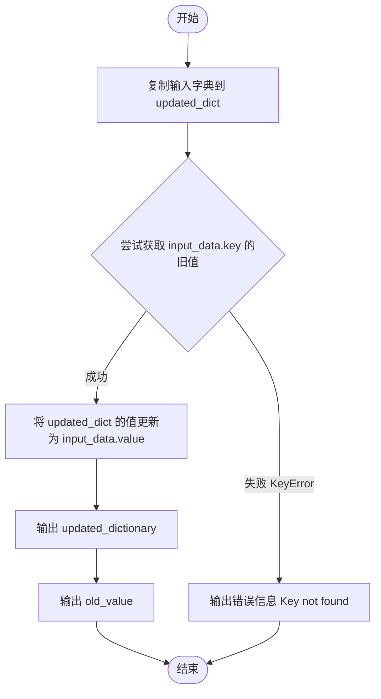

#### 带注释源码

```python
    async def run(self, input_data: Input, **kwargs) -> BlockOutput:
        # 复制输入字典以避免直接修改原始数据
        updated_dict = input_data.dictionary.copy()
        try:
            # 获取键对应的旧值，如果键不存在将抛出 KeyError
            old_value = updated_dict[input_data.key]
            # 更新字典中指定键的值
            updated_dict[input_data.key] = input_data.value
            # 产出更新后的字典
            yield "updated_dictionary", updated_dict
            # 产出被替换掉的旧值
            yield "old_value", old_value
        except KeyError:
            # 如果键不存在，产出错误信息
            yield "error", f"Key '{input_data.key}' not found in dictionary"
```


### `DictionaryIsEmptyBlock.__init__`

该方法用于初始化 `DictionaryIsEmptyBlock` 类的实例。它通过调用父类的初始化方法，配置了该块的基本元数据（如ID、描述）、输入输出Schema以及用于验证功能的测试用例，具体功能是检查输入的字典是否为空。

参数：

-  `self`：`DictionaryIsEmptyBlock`，类的实例引用。

返回值：`None`，无返回值。

#### 流程图

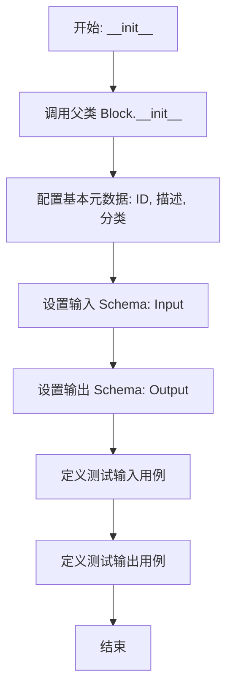

#### 带注释源码

```python
def __init__(self):
    # 调用父类 Block 的初始化方法，配置块的各种属性
    super().__init__(
        # 块的唯一标识符
        id="a3cf3f64-6bb9-4cc6-9900-608a0b3359b0",
        # 块的功能描述
        description="Checks if a dictionary is empty.",
        # 块所属的分类，这里标记为 BASIC (基础)
        categories={BlockCategory.BASIC},
        # 定义块的输入数据结构，包含 dictionary 字段
        input_schema=DictionaryIsEmptyBlock.Input,
        # 定义块的输出数据结构，包含 is_empty 字段
        output_schema=DictionaryIsEmptyBlock.Output,
        # 定义测试输入，包含空字典和非空字典两种情况
        test_input=[{"dictionary": {}}, {"dictionary": {"a": 1}}],
        # 定义对应的预期输出，True 表示空，False 表示非空
        test_output=[("is_empty", True), ("is_empty", False)],
    )
```


### `DictionaryIsEmptyBlock.run`

该方法用于检查输入的字典是否为空，并通过生成器返回一个布尔值，指示字典是否包含任何键值对。

参数：

- `input_data`：`DictionaryIsEmptyBlock.Input`，包含待检查的字典数据的输入对象，其中 `dictionary` 字段为必检项。
- `**kwargs`：`Any`，额外的关键字参数，用于传递上下文或其他运行时信息（当前方法未使用）。

返回值：`BlockOutput`，一个生成器，产生键为 "is_empty" 的输出，其值为布尔类型，True 表示字典为空，False 表示字典非空。

#### 流程图

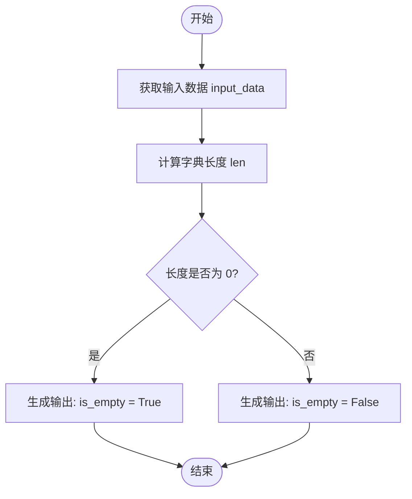

#### 带注释源码

```python
    async def run(self, input_data: Input, **kwargs) -> BlockOutput:
        # 计算输入字典的长度，并判断是否等于 0
        # 如果等于 0，说明字典为空，返回 True；否则返回 False
        yield "is_empty", len(input_data.dictionary) == 0
```


### `CreateListBlock.__init__`

初始化 CreateListBlock 实例，通过元数据（如 ID、描述、输入输出模式和测试用例）配置 Block 基类。

参数：

- `self`：`CreateListBlock`，类实例的引用

返回值：`None`，构造函数不返回任何值

#### 流程图

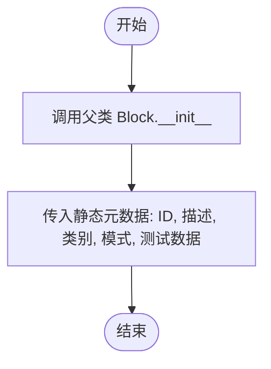

#### 带注释源码

```python
def __init__(self):
    # 调用父类 Block 的初始化方法，注册该 Block 的元数据和配置
    super().__init__(
        # 定义该 Block 的唯一标识符
        id="a912d5c7-6e00-4542-b2a9-8034136930e4",
        # 定义该 Block 的功能描述，说明了基本用途以及分块处理的能力
        description="Creates a list with the specified values. Use this when you know all the values you want to add upfront. This block can also yield the list in batches based on a maximum size or token limit.",
        # 定义该 Block 所属的分类，这里为 DATA 类别
        categories={BlockCategory.DATA},
        # 定义该 Block 的输入数据模式，使用内部类 Input 指定预期输入字段
        input_schema=CreateListBlock.Input,
        # 定义该 Block 的输出数据模式，使用内部类 Output 指定输出字段
        output_schema=CreateListBlock.Output,
        # 定义测试用例输入列表，用于验证 Block 的逻辑
        test_input=[
            {
                "values": ["Alice", 25, True],
            },
            {
                "values": [1, 2, 3, "four", {"key": "value"}],
            },
        ],
        # 定义预期的测试用例输出列表，与 test_input 一一对应
        test_output=[
            (
                "list",
                ["Alice", 25, True],
            ),
            (
                "list",
                [1, 2, 3, "four", {"key": "value"}],
            ),
        ],
    )
```


### `CreateListBlock.run`

该方法负责根据提供的输入值创建一个列表。它支持基于最大数量或最大Token数将列表分割成多个块（Chunk）进行输出。

参数：

- `input_data`：`CreateListBlock.Input`，包含输入数据，其中 `values` 是待处理的值列表，`max_size` 是每个分块的最大元素数量，`max_tokens` 是每个分块的最大Token限制。
- `**kwargs`：`Any`，额外的关键字参数，通常用于传递执行上下文。

返回值：`BlockOutput`，一个生成器，产出包含键 "list" 和对应的列表块（List Chunk）的元组。

#### 流程图

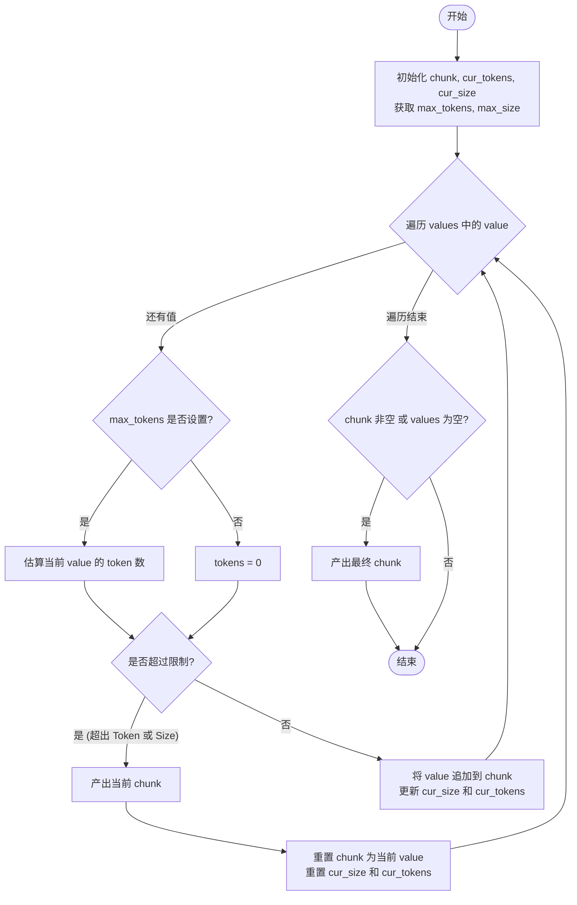

#### 带注释源码

```python
    async def run(self, input_data: Input, **kwargs) -> BlockOutput:
        # 初始化当前块和计数器
        chunk = []
        cur_tokens, max_tokens = 0, input_data.max_tokens
        cur_size, max_size = 0, input_data.max_size

        # 遍历输入的所有值
        for value in input_data.values:
            # 如果设置了最大Token限制，估算当前值的Token数
            if max_tokens:
                tokens = estimate_token_count_str(value)
            else:
                tokens = 0

            # 检查添加当前值是否会超过预设的Token限制或数量限制
            if (max_tokens and (cur_tokens + tokens > max_tokens)) or (
                max_size and (cur_size + 1 > max_size)
            ):
                # 如果超过限制，先产出当前已收集的块
                yield "list", chunk
                # 开启新块，包含当前值，并重置计数器
                chunk = [value]
                cur_size, cur_tokens = 1, tokens
            else:
                # 未超过限制，将值添加到当前块，并更新计数器
                chunk.append(value)
                cur_size, cur_tokens = cur_size + 1, cur_tokens + tokens

        # 如果还有剩余的值未产出，或者输入为空（产出空列表），则产出最终块
        if chunk or not input_data.values:
            yield "list", chunk
```


### `AddToListBlock.__init__`

初始化 `AddToListBlock` 类的实例，配置块的唯一标识符、描述、分类、输入输出模式以及用于验证功能的测试用例。

参数：

- `self`：`AddToListBlock`，类的当前实例。

返回值：`None`，构造函数不返回任何值。

#### 流程图

```mermaid
graph TD
    A[开始: __init__] --> B[调用 super().__init__]
    B --> C[设置 ID: aeb08fc1-2fc1-4141-bc8e-f758f183a822]
    B --> D[设置 Description]
    B --> E[设置 Categories: BASIC]
    B --> F[设置 Input Schema]
    B --> G[设置 Output Schema]
    B --> H[设置 Test Input]
    B --> I[设置 Test Output]
    C & D & E & F & G & H & I --> J[块初始化完成]
    J --> K[结束]
```

#### 带注释源码

```python
def __init__(self):
    # 调用父类 Block 的初始化方法，配置块的元数据和测试数据
    super().__init__(
        # 块的唯一标识符
        id="aeb08fc1-2fc1-4141-bc8e-f758f183a822",
        # 块的功能描述，说明其用途是向列表添加条目
        description="Adds a new entry to a list. The entry can be of any type. If no list is provided, a new one is created.",
        # 块所属的分类，这里归类为“基础”块
        categories={BlockCategory.BASIC},
        # 定义输入数据结构的 Schema
        input_schema=AddToListBlock.Input,
        # 定义输出数据结构的 Schema
        output_schema=AddToListBlock.Output,
        # 定义测试输入数据，用于验证逻辑正确性
        # 包含场景：指定位置插入、仅添加条目、添加到现有列表、批量添加和位置指定
        test_input=[
            {
                "list": [1, "string", {"existing_key": "existing_value"}],
                "entry": {"new_key": "new_value"},
                "position": 1,
            },
            {"entry": "first_entry"},
            {"list": ["a", "b", "c"], "entry": "d"},
            {
                "entry": "e",
                "entries": ["f", "g"],
                "list": ["a", "b"],
                "position": 1,
            },
        ],
        # 定义预期的测试输出结果，与 test_input 一一对应
        test_output=[
            (
                "updated_list",
                [
                    1,
                    {"new_key": "new_value"},
                    "string",
                    {"existing_key": "existing_value"},
                ],
            ),
            ("updated_list", ["first_entry"]),
            ("updated_list", ["a", "b", "c", "d"]),
            ("updated_list", ["a", "f", "g", "e", "b"]),
        ],
    )
```


### `AddToListBlock.run`

该方法用于将单个或多个条目添加到现有列表中。如果未提供列表，则创建一个新列表。它支持指定插入位置，若未指定位置，则默认追加到列表末尾。

参数：

- `input_data`：`AddToListBlock.Input`，包含输入数据的数据对象，具体字段包括待修改的列表、要添加的单个条目、批量添加的条目列表以及可选的插入位置。
- `**kwargs`：`Any`，额外的关键字参数。

返回值：`BlockOutput`，一个异步生成器，产生包含更新后列表的键值对。

#### 流程图

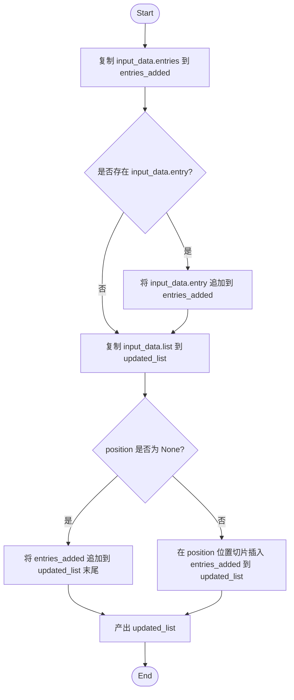

#### 带注释源码

```python
    async def run(self, input_data: Input, **kwargs) -> BlockOutput:
        # 复制批量条目列表，避免直接修改输入数据
        entries_added = input_data.entries.copy()
        
        # 如果存在单个条目 (entry)，将其添加到待添加的条目列表中
        if input_data.entry:
            entries_added.append(input_data.entry)

        # 复制原始列表，以确保输入数据的不可变性
        updated_list = input_data.list.copy()
        
        # 检查是否指定了插入位置
        if (pos := input_data.position) is not None:
            # 如果指定了位置，通过列表切片在指定位置插入新条目
            updated_list = updated_list[:pos] + entries_added + updated_list[pos:]
        else:
            # 如果未指定位置，将新条目追加到列表末尾
            updated_list += entries_added

        # 产出更新后的列表
        yield "updated_list", updated_list
```


### `FindInListBlock.__init__`

该方法是 `FindInListBlock` 类的构造函数，负责初始化块的基本配置，包括设置唯一的块 ID、描述信息、所属分类、输入输出数据结构 Schema 以及用于验证功能的测试用例。

参数：

-  `self`：`FindInListBlock`，类的实例本身

返回值：`None`，无返回值

#### 流程图

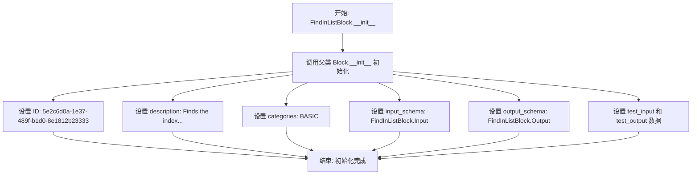

#### 带注释源码

```python
    def __init__(self):
        # 调用父类 Block 的构造函数，传入该块的元数据和配置
        super().__init__(
            # 定义该块的唯一标识符
            id="5e2c6d0a-1e37-489f-b1d0-8e1812b23333",
            # 描述该块的功能：在列表中查找值的索引
            description="Finds the index of the value in the list.",
            # 定义该块的分类，属于基础块
            categories={BlockCategory.BASIC},
            # 绑定输入数据的 Schema，定义输入字段 list 和 value
            input_schema=FindInListBlock.Input,
            # 绑定输出数据的 Schema，定义输出字段 index, found 和 not_found_value
            output_schema=FindInListBlock.Output,
            # 定义测试输入用例，用于验证逻辑（包含找到值和未找到值的情况）
            test_input=[
                {"list": [1, 2, 3, 4, 5], "value": 3},
                {"list": [1, 2, 3, 4, 5], "value": 6},
            ],
            # 定义对应的期望输出用例
            test_output=[
                ("index", 2),
                ("found", True),
                ("found", False),
                ("not_found_value", 6),
            ],
        )
```


### `FindInListBlock.run`

Finds the index of the value in the list.

参数：

-  `input_data`：`FindInListBlock.Input`，包含输入数据，包括要搜索的列表 (`list`) 和要查找的值 (`value`)。
-  `**kwargs`：`Any`，额外的关键字参数，默认为空。

返回值：`BlockOutput`，一个异步生成器，产生查找结果，包括找到时的索引、是否找到的布尔状态以及未找到时的原始值。

#### 流程图

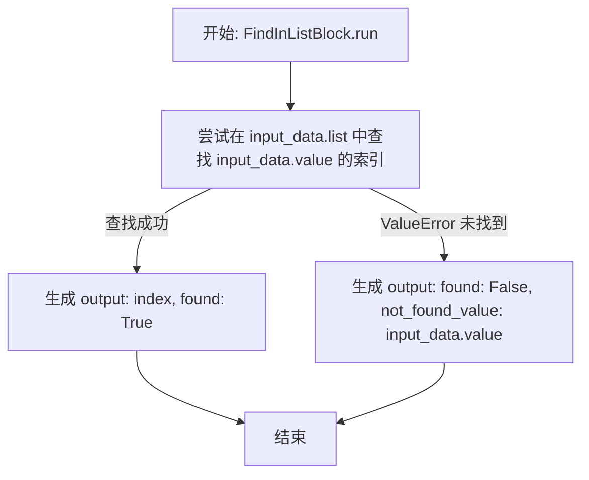

#### 带注释源码

```python
    async def run(self, input_data: Input, **kwargs) -> BlockOutput:
        try:
            # 尝试获取值在列表中的索引
            yield "index", input_data.list.index(input_data.value)
            # 成功找到，输出找到状态为 True
            yield "found", True
        except ValueError:
            # 如果值不在列表中，index 方法会抛出 ValueError
            yield "found", False
            # 输出未找到的原始值
            yield "not_found_value", input_data.value
```


### `GetListItemBlock.__init__`

该方法用于初始化 `GetListItemBlock` 实例，主要配置块的基本元数据、输入输出模式以及测试用例。它将块的 ID、描述、分类和预定义的测试数据传递给父类 `Block` 进行注册和初始化。

参数：

-  `self`：`GetListItemBlock`，表示类实例本身。

返回值：`None`，构造函数不返回任何值。

#### 流程图

```mermaid
graph TD
    A[Start] --> B[Call super().__init__]
    B --> C[Set block ID]
    C --> D[Set description]
    D --> E[Set categories to BlockCategory.BASIC]
    E --> F[Set input_schema to GetListItemBlock.Input]
    F --> G[Set output_schema to GetListItemBlock.Output]
    G --> H[Set test_input examples]
    H --> I[Set test_output examples]
    I --> J[End]
```

#### 带注释源码

```python
def __init__(self):
    # 调用父类 Block 的初始化方法，注册块的元数据和配置
    super().__init__(
        # 块的唯一标识符
        id="262ca24c-1025-43cf-a578-534e23234e97",
        # 块的功能描述，说明该块用于获取给定索引处的元素
        description="Returns the element at the given index.",
        # 块所属的分类，此处为基础操作类别
        categories={BlockCategory.BASIC},
        # 定义输入数据的 Schema，指定需要 'list' 和 'index' 字段
        input_schema=GetListItemBlock.Input,
        # 定义输出数据的 Schema，指定输出为 'item' 字段
        output_schema=GetListItemBlock.Output,
        # 定义测试输入样本，包含正常索引和负数索引的情况
        test_input=[
            {"list": [1, 2, 3], "index": 1},
            {"list": [1, 2, 3], "index": -1},
        ],
        # 定义预期的测试输出结果
        test_output=[
            ("item", 2),
            ("item", 3),
        ],
    )
```


### `GetListItemBlock.run`

该方法用于从提供的列表中根据指定索引获取元素。它处理标准的正索引和 Python 风格的负索引，并捕获索引越界异常以返回错误信息。

参数：

-   `input_data`：`Input`，输入数据对象，包含 `list`（要操作的源列表）和 `index`（用于获取元素的 0 基准索引，支持负索引）字段。
-   `**kwargs`：`Any`，扩展关键字参数，通常由执行框架传入，当前方法未直接使用。

返回值：`BlockOutput`，异步生成器，成功时产出包含 `item` 的元组，索引越界时产出包含 `error` 的元组。

#### 流程图

```mermaid
flowchart TD
    Start([开始]) --> TryAccess{尝试通过索引访问列表元素}
    
    TryAccess -- 成功 --> YieldSuccess[Yield 'item', element]
    TryAccess -- 失败/IndexError --> YieldError[Yield 'error', 'Index out of range']
    
    YieldSuccess --> End([结束])
    YieldError --> End
```

#### 带注释源码

```python
    async def run(self, input_data: Input, **kwargs) -> BlockOutput:
        try:
            # 尝试使用提供的索引从列表中获取元素。
            # input_data.list 是源列表，input_data.index 是目标索引。
            # Python 列表访问操作支持负索引（例如 -1 表示最后一个元素）。
            yield "item", input_data.list[input_data.index]
        except IndexError:
            # 如果索引超出列表范围（例如列表长度为 3，索引为 5），捕获 IndexError 异常。
            # 产出标准化的错误信息，而不是抛出未处理的异常。
            yield "error", "Index out of range"
```


### `RemoveFromListBlock.__init__`

该方法用于初始化 `RemoveFromListBlock` 类，通过调用父类 `Block` 的初始化方法并传入特定的配置参数（如唯一ID、描述、输入输出Schema及测试用例），将当前类配置为一个能够通过值或索引从列表中移除项目的功能块。

参数：

-  `无`

返回值：`None`，该方法为构造函数，不返回任何值。

#### 流程图

```mermaid
graph TD
    A[开始: __init__] --> B[调用父类 Block.__init__]
    B --> C[设置块 ID: d93c5a93-ac7e-41c1-ae5c-ef67e6e9b826]
    B --> D[设置描述: Removes an item from a list by value or index]
    B --> E[设置分类: BlockCategory.BASIC]
    B --> F[设置输入模式: RemoveFromListBlock.Input]
    B --> G[设置输出模式: RemoveFromListBlock.Output]
    B --> H[设置测试输入数据 test_input]
    B --> I[设置预期输出数据 test_output]
    I --> J[结束: 初始化完成]
```

#### 带注释源码

```python
def __init__(self):
    # 调用父类 Block 的初始化方法，配置块的基本属性和行为
    super().__init__(
        # 块的唯一标识符 (UUID)
        id="d93c5a93-ac7e-41c1-ae5c-ef67e6e9b826",
        # 块的功能描述，解释其作用
        description="Removes an item from a list by value or index.",
        # 块所属的分类，这里归为基础功能块
        categories={BlockCategory.BASIC},
        # 指定输入数据的验证 Schema，使用内部定义的 Input 类
        input_schema=RemoveFromListBlock.Input,
        # 指定输出数据的验证 Schema，使用内部定义的 Output 类
        output_schema=RemoveFromListBlock.Output,
        # 定义测试用例的输入数据，用于验证块的功能
        test_input=[
            {"list": [1, 2, 3], "index": 1, "return_item": True},
            {"list": ["a", "b", "c"], "value": "b"},
        ],
        # 定义测试用例对应的预期输出数据
        test_output=[
            ("updated_list", [1, 3]),
            ("removed_item", 2),
            ("updated_list", ["a", "c"]),
        ],
    )
```


### `RemoveFromListBlock.run`

该方法是 `RemoveFromListBlock` 的核心执行逻辑，用于通过索引或值从列表中移除指定的项目。它会复制原始列表以避免副作用，根据输入参数选择移除方式，并可选择性地返回被移除的项目。

参数：

-   `input_data`：`RemoveFromListBlock.Input`，包含输入数据结构，其中 `list` 为待修改的列表，`value` 为要移除的值，`index` 为要移除的索引，`return_item` 为是否返回被移除项目的布尔标志。
-   `**kwargs`：`Any`，额外的关键字参数，用于扩展上下文或传递额外信息。

返回值：`BlockOutput`，一个生成器，产出 `updated_list`（修改后的列表）、`removed_item`（如果请求返回被移除项目）或 `error`（错误信息）。

#### 流程图

```mermaid
flowchart TD
    Start([开始]) --> CopyList[复制输入列表 input_data.list 到 lst]
    CopyList --> InitRemoved[初始化 removed 为 None]
    InitRemoved --> TryBlock[开始 try 异常处理块]

    TryBlock --> CheckIndex{input_data.index 是否不为 None?}
    CheckIndex -- 是 --> PopIndex[removed = lst.pop index]
    PopIndex --> YieldSuccess
    CheckIndex -- 否 --> CheckValue{input_data.value 是否不为 None?}
    CheckValue -- 是 --> RemoveValue[lst.remove input_data.value]
    RemoveValue --> AssignRemoved[removed = input_data.value]
    AssignRemoved --> YieldSuccess
    CheckValue -- 否 --> RaiseError[抛出 ValueError]

    YieldSuccess[产出 updated_list: lst] --> CheckReturn{input_data.return_item 是否为 True?}
    CheckReturn -- 是 --> YieldRemoved[产出 removed_item: removed]
    CheckReturn -- 否 --> End([结束])
    YieldRemoved --> End

    RaiseError -.-> CatchError[捕获 IndexError 或 ValueError]
    PopIndex -.-> CatchError
    RemoveValue -.-> CatchError

    CatchError --> YieldError[产出 error: 'Index or value not found']
    YieldError --> Stop([停止运行])
```

#### 带注释源码

```python
    async def run(self, input_data: Input, **kwargs) -> BlockOutput:
        # 复制输入列表以避免修改原始数据
        lst = input_data.list.copy()
        removed = None
        
        try:
            # 优先检查是否提供了索引，如果是，则通过索引弹出元素
            if input_data.index is not None:
                removed = lst.pop(input_data.index)
            # 其次检查是否提供了值，如果是，则通过值移除元素
            elif input_data.value is not None:
                lst.remove(input_data.value)
                removed = input_data.value
            # 如果既没有索引也没有值，则抛出错误
            else:
                raise ValueError("No index or value provided for removal")
        except (IndexError, ValueError):
            # 捕获索引越界或值不存在的异常，输出错误信息并结束
            yield "error", "Index or value not found"
            return

        # 产出更新后的列表
        yield "updated_list", lst
        
        # 如果参数要求返回被移除的项目，则产出该项目
        if input_data.return_item:
            yield "removed_item", removed
```


### `ReplaceListItemBlock.__init__`

初始化 `ReplaceListItemBlock` 类，设置块的唯一标识符、描述、输入输出架构、所属类别以及测试用例，通过调用父类构造函数完成注册。

参数：

-  `self`：`ReplaceListItemBlock`，类实例本身，指向当前对象。

返回值：`None`，构造函数不返回任何值。

#### 流程图

```mermaid
flowchart TD
    Start([开始]) --> DefineConfig[定义块配置参数<br>ID, 描述, 类别, Schema, 测试数据]
    DefineConfig --> CallSuper[调用父类 Block.__init__]
    CallSuper --> End([结束])
```

#### 带注释源码

```python
def __init__(self):
    # 调用父类 Block 的构造函数，传入块的元数据和配置
    super().__init__(
        # 块的唯一标识符
        id="fbf62922-bea1-4a3d-8bac-23587f810b38",
        # 块的功能描述
        description="Replaces an item at the specified index.",
        # 块所属的分类，此处为基础操作
        categories={BlockCategory.BASIC},
        # 定义输入数据的 Schema，引用内部类 Input
        input_schema=ReplaceListItemBlock.Input,
        # 定义输出数据的 Schema，引用内部类 Output
        output_schema=ReplaceListItemBlock.Output,
        # 定义测试输入数据，用于验证逻辑
        test_input=[
            {"list": [1, 2, 3], "index": 1, "value": 99},
            {"list": ["a", "b"], "index": -1, "value": "c"},
        ],
        # 定义预期的测试输出结果
        test_output=[
            ("updated_list", [1, 99, 3]),
            ("old_item", 2),
            ("updated_list", ["a", "c"]),
            ("old_item", "b"),
        ],
    )
```


### `ReplaceListItemBlock.run`

替换列表中指定索引处的项目为新值，并返回更新后的列表以及被替换的项目。如果索引超出范围，则返回错误信息。

参数：

- `input_data`：`ReplaceListItemBlock.Input`，包含待修改的列表、目标索引和新值的输入数据对象。
- `**kwargs`：`dict`，额外的可选关键字参数。

返回值：`BlockOutput`，一个异步生成器，产生包含更新后的列表、被替换的项目或错误信息的元组。

#### 流程图

```mermaid
flowchart TD
    A[开始] --> B[复制 input_data.list 到 lst]
    B --> C{尝试访问 lst[index]}
    C -->|发生 IndexError| E[生成 error, Index out of range]
    E --> F[结束]
    C -->|成功| D[保存旧值 old = lst[index]<br>更新 lst[index] = input_data.value]
    D --> G[生成 updated_list, lst]
    G --> H[生成 old_item, old]
    H --> F
```

#### 带注释源码

```python
async def run(self, input_data: Input, **kwargs) -> BlockOutput:
    # 复制输入列表以避免修改原始数据
    lst = input_data.list.copy()
    try:
        # 尝试获取指定索引处的旧值
        old = lst[input_data.index]
        # 将新值赋给指定索引
        lst[input_data.index] = input_data.value
    except IndexError:
        # 如果索引越界，输出错误信息并结束
        yield "error", "Index out of range"
        return

    # 输出更新后的列表
    yield "updated_list", lst
    # 输出被替换掉的旧值
    yield "old_item", old
```


### `ListIsEmptyBlock.__init__`

该方法是 `ListIsEmptyBlock` 类的构造函数，负责初始化该块的基本属性，包括其唯一标识符、描述、所属类别、输入输出模式定义以及用于验证功能的测试输入输出数据。

参数：

-  `self`：`ListIsEmptyBlock`，类的实例本身

返回值：`None`，构造函数不返回任何值

#### 流程图

```mermaid
flowchart TD
    A[开始: ListIsEmptyBlock.__init__] --> B[调用父类 Block.__init__]
    B --> C[配置块属性: ID, 描述, 类别]
    C --> D[设置输入模式: ListIsEmptyBlock.Input]
    D --> E[设置输出模式: ListIsEmptyBlock.Output]
    E --> F[配置测试用例: test_input, test_output]
    F --> G[结束: 初始化完成]
```

#### 带注释源码

```python
    def __init__(self):
        # 调用父类 Block 的构造函数以注册块的元数据和配置
        super().__init__(
            # 块的唯一标识符 (UUID)
            id="896ed73b-27d0-41be-813c-c1c1dc856c03",
            # 块的功能描述，用于 UI 展示或文档说明
            description="Checks if a list is empty.",
            # 块所属的分类，这里归类为基础功能
            categories={BlockCategory.BASIC},
            # 定义该块的输入数据模式，使用内部类 Input
            input_schema=ListIsEmptyBlock.Input,
            # 定义该块的输出数据模式，使用内部类 Output
            output_schema=ListIsEmptyBlock.Output,
            # 定义测试输入用例，包含空列表和非空列表两种情况
            test_input=[{"list": []}, {"list": [1]}],
            # 定义预期的测试输出结果，对应上述输入用例
            test_output=[("is_empty", True), ("is_empty", False)],
        )
```


### `ListIsEmptyBlock.run`

检查给定的列表是否为空，并返回布尔值结果。

参数：

-  `input_data`：`ListIsEmptyBlock.Input`，输入数据对象，包含需要检查的列表（`list` 字段）。
-  `**kwargs`：`Any`，额外的关键字参数，用于执行上下文扩展。

返回值：`BlockOutput`，一个生成器，产出包含检查结果的键值对（键名为 `is_empty`，值为布尔值）。

#### 流程图

```mermaid
flowchart TD
    Start([开始]) --> GetList[获取 input_data.list]
    GetList --> CheckCondition{列表长度是否为 0?}
    CheckCondition -- 是 --> YieldTrue[输出: is_empty = True]
    CheckCondition -- 否 --> YieldFalse[输出: is_empty = False]
    YieldTrue --> End([结束])
    YieldFalse --> End
```

#### 带注释源码

```python
    async def run(self, input_data: Input, **kwargs) -> BlockOutput:
        # 获取输入列表的长度，并判断是否等于 0
        # 如果长度为 0，结果为 True，否则为 False
        # 将结果通过生成器 yield 出去，键名为 "is_empty"
        yield "is_empty", len(input_data.list) == 0
```


### `ConcatenateListsBlock.__init__`

初始化 `ConcatenateListsBlock` 实例，配置块的唯一标识符、描述、所属分类、输入输出模式以及测试用例。

参数：

-  `self`：`ConcatenateListsBlock`，类的实例引用。

返回值：`None`，无返回值。

#### 流程图

```mermaid
flowchart TD
    Start([开始]) --> CallSuper[调用父类 Block.__init__]
    CallSuper --> PassConfig[传入 id, description, categories 等配置]
    PassConfig --> PassSchema[传入 input_schema 和 output_schema]
    PassSchema --> PassTests[传入 test_input 和 test_output]
    PassTests --> End([结束])
```

#### 带注释源码

```python
def __init__(self):
    # 调用父类 Block 的初始化方法，配置块的基本属性
    super().__init__(
        # 块的唯一标识符
        id="3cf9298b-5817-4141-9d80-7c2cc5199c8e",
        # 块的功能描述：将多个列表合并为一个列表
        description="Concatenates multiple lists into a single list. All elements from all input lists are combined in order.",
        # 块所属的分类，这里归类为基础功能块
        categories={BlockCategory.BASIC},
        # 指定输入数据的模式（Schema），引用内部类 Input
        input_schema=ConcatenateListsBlock.Input,
        # 指定输出数据的模式（Schema），引用内部类 Output
        output_schema=ConcatenateListsBlock.Output,
        # 定义测试用例输入数据，包含不同情况的列表组合
        test_input=[
            {"lists": [[1, 2, 3], [4, 5, 6]]},
            {"lists": [["a", "b"], ["c"], ["d", "e", "f"]]},
            {"lists": [[1, 2], []]},
            {"lists": []},
        ],
        # 定义测试用例期望输出数据，与输入一一对应
        test_output=[
            ("concatenated_list", [1, 2, 3, 4, 5, 6]),
            ("concatenated_list", ["a", "b", "c", "d", "e", "f"]),
            ("concatenated_list", [1, 2]),
            ("concatenated_list", []),
        ],
    )
```


### `ConcatenateListsBlock.run`

该方法负责接收一个包含多个列表的输入数据，验证每个元素的类型，并将它们按顺序合并为一个单一的列表，同时处理可能出现的非列表类型错误。

参数：

-  `input_data`：`ConcatenateListsBlock.Input`，包含待连接列表的输入数据对象，其中 `lists` 字段为列表的列表。
-  `**kwargs`：`Any`，额外的关键字参数。

返回值：`BlockOutput`，一个异步生成器，产生包含连接后的列表的元组 `("concatenated_list", List[Any])`，或在类型检查失败时产生错误信息元组 `("error", str)`。

#### 流程图

```mermaid
flowchart TD
    A([开始]) --> B[初始化空列表 concatenated]
    B --> C[遍历 input_data.lists 中的 lst]
    C --> D{lst 是否为 None?}
    D -- 是 --> C
    D -- 否 --> E{isinstance lst, list?}
    E -- 否 --> F[生成 error 信息]
    F --> G([返回/结束])
    E -- 是 --> H[将 lst 扩展到 concatenated]
    H --> C
    C --> I[遍历结束]
    I --> J[生成 concatenated_list 与 concatenated]
    J --> K([结束])
```

#### 带注释源码

```python
    async def run(self, input_data: Input, **kwargs) -> BlockOutput:
        # 初始化一个空列表用于存放最终结果
        concatenated = []
        # 遍历输入的列表中的每一个元素
        for idx, lst in enumerate(input_data.lists):
            # 如果元素为 None，跳过以避免错误
            if lst is None:
                # Skip None values to avoid errors
                continue
            # 检查元素是否为列表类型
            if not isinstance(lst, list):
                # Type validation: each item must be a list
                # 字符串是可迭代的，会导致 extend() 逐字符迭代
                # 不可迭代类型会引发 TypeError
                yield "error", (
                    f"Invalid input at index {idx}: expected a list, got {type(lst).__name__}. "
                    f"All items in 'lists' must be lists (e.g., [[1, 2], [3, 4]])."
                )
                return
            # 将当前列表的所有元素追加到结果列表中
            concatenated.extend(lst)
        # 输出最终的合并列表
        yield "concatenated_list", concatenated
```


## 关键组件


### CreateDictionaryBlock
Creates a dictionary object using a set of provided key-value pairs.

### AddToDictionaryBlock
Adds a single key-value pair or a batch of entries to an existing or new dictionary.

### FindInDictionaryBlock
Retrieves a value from a dictionary, list, or object using a key or index, supporting JSON string parsing and attribute lookup.

### RemoveFromDictionaryBlock
Removes a specific key-value pair from a dictionary, with an option to return the removed value.

### ReplaceDictionaryValueBlock
Updates the value associated with a specific key in a dictionary and returns the old value.

### DictionaryIsEmptyBlock
Checks whether a given dictionary contains no elements.

### CreateListBlock
Constructs a list from provided values, with advanced support for chunking output based on list size or token count limits.

### AddToListBlock
Inserts a single entry or a batch of entries into a list, either at the end or at a specified position.

### FindInListBlock
Searches for a value within a list and returns its index if found.

### GetListItemBlock
Retrieves an element from a list based on a 0-based or negative index.

### RemoveFromListBlock
Removes an item from a list by its value or index, optionally returning the removed item.

### ReplaceListItemBlock
Replaces the element at a specific index in a list with a new value.

### ListIsEmptyBlock
Checks whether a given list contains no elements.

### ConcatenateListsBlock
Combines multiple input lists into a single list while performing type validation.


## 问题及建议


### 已知问题

-   **浅拷贝导致的数据隔离风险**：在 `AddToDictionaryBlock`、`RemoveFromDictionaryBlock` 等多个 Block 中，使用 `input_data.dictionary.copy()` 和 `input_data.list.copy()` 进行数据复制。这只是浅拷贝，如果字典或列表中包含嵌套的可变对象（如子字典或子列表），修改嵌套对象仍会影响原始输入数据，可能导致副作用。
-   **FindInDictionaryBlock 的逻辑脆弱性**：该 Block 在处理列表类型时，通过检查 `isinstance(obj[0], dict)` 来决定后续是按字典还是按对象属性处理。这假设列表元素类型是同质的。如果列表包含混合类型（例如第一个是字典，第二个是普通对象），针对后续元素的查找逻辑可能出错。此外，直接对字符串输入执行 `loads(obj)` 若遇到非 JSON 格式字符串会抛出异常。
-   **AddToDictionaryBlock 无法显式设置 None 值**：代码中逻辑 `if input_data.value is not None and input_data.key:` 意味着用户无法显式地将某个键的值设置为 `None`，因为 `None` 值会被忽略。
-   **异步方法中的同步阻塞**：所有 Block 的 `run` 方法均声明为 `async`，但内部逻辑（如字典复制、列表切片、循环遍历）均为同步 CPU 密集型操作。处理大型数据结构时会阻塞事件循环，影响系统并发性能。
-   **ConcatenateListsBlock 的类型校验冗余**：该 Block 的输入 Schema 已经定义为 `List[List[Any]]`，Pydantic 应当在数据进入 `run` 方法前完成类型校验。代码中再次手动检查 `isinstance(lst, list)` 显得冗余，除非是为了防御性编程处理绕过 Schema 的情况。

### 优化建议

-   **使用深拷贝确保数据隔离**：建议将所有涉及数据修改的 Block 中的 `.copy()` 替换为 `copy.deepcopy()`，以彻底切断输入数据与输出数据之间的引用关系，防止因嵌套对象修改产生的意外副作用。
-   **重构 FindInDictionaryBlock 的查找逻辑**：改进列表查找逻辑，不再仅依赖第一个元素的类型进行推断，而是逐个检查元素类型并分别处理（例如使用 `getattr` 处理对象，`getitem` 处理字典）。同时，为字符串解析增加 `try-except` 块以优雅处理非 JSON 字符串输入。
-   **支持显式 None 值设置**：修改 `AddToDictionaryBlock`，允许通过显式参数（如 `allow_none`）或直接检测 `key` 是否存在来区分“未提供值”和“值为 None”的情况，从而支持将字典键值设为 `None`。
-   **使用 run_in_executor 处理繁重计算**：对于可能涉及大数据集操作的 Block（如 `CreateListBlock` 中的 Token 计算循环、列表拼接等），建议使用 `asyncio.to_thread` 或 `loop.run_in_executor` 将同步计算任务分发到线程池执行，保持事件循环畅通。
-   **统一错误处理与流程控制**：确保所有 Block 在发生错误并 `yield "error"` 后立即 `return`，防止生成器继续执行产生无效数据或状态混乱。考虑引入统一的错误处理中间件或装饰器。


## 其它


### 设计目标与约束

该模块旨在提供原子化、可组合的数据操作原语，用于构建数据处理工作流。核心设计目标与约束如下：

1.  **原子性**：每个 Block 仅负责单一且明确的逻辑（如创建字典、查找列表项），确保功能单一、易于测试和维护。
2.  **不可变性与副作用控制**：大多数修改操作（如 `AddToDictionaryBlock`, `ReplaceListItemBlock`）均通过 `.copy()` 方法对输入数据进行浅拷贝，避免直接修改原始输入数据，从而减少不可预期的副作用。
3.  **流式处理支持**：`CreateListBlock` 设计了特殊的输出机制，允许根据 `max_size` 或 `max_tokens` 参数将大数据集切分为多个片段（Chunk）流式输出，以适应下游处理能力的限制。
4.  **Schema 驱动验证**：严格遵循 Pydantic 模型定义的输入输出接口，利用 `SchemaField` 进行类型约束和元数据描述，确保数据结构在运行时的正确性。
5.  **异步执行约束**：所有业务逻辑必须在 `async def run` 方法中实现，以适配异步事件循环架构，虽然当前逻辑多为 CPU 密集型操作，但接口层面必须保持异步兼容。

### 错误处理与异常设计

该模块采用“错误数据化”的策略，而非抛出异常中断流程，以保证工作流的鲁棒性。具体设计如下：

1.  **捕获与转换**：在 `run` 方法内部，针对特定操作可能抛出的异常（如字典的 `KeyError`、列表的 `IndexError`/`ValueError`）进行捕获。
2.  **错误输出通道**：当发生错误时，Block 不会崩溃，而是 yield 一个特定的输出键（通常为 `"error"`）并附带错误信息字符串。例如，`RemoveFromDictionaryBlock` 在键不存在时 yield `"error"`。
3.  **容错逻辑**：
    *   `ConcatenateListsBlock` 包含显式类型检查，防止非列表类型（如字符串）被意外迭代，若发现类型错误则返回详细的错误信息。
    *   `FindInDictionaryBlock` 处理多种输入类型（Dict, List, Object），在匹配失败时 yield `"missing"` 或 `"not_found_value"`，视为正常的业务逻辑分支而非错误。
4.  **通用异常兜底**：如 `CreateDictionaryBlock` 使用 `try...except Exception` 捕获未知错误，确保极端情况下也能有错误输出。

### 数据流

数据在 Block 内部的流转遵循标准的输入-处理-输出模式，同时支持分片流：

1.  **输入解析**：
    *   数据通过 Pydantic 模型（`Input` 类）进入，自动完成反序列化和基础校验。
    *   `FindInDictionaryBlock` 具备特殊的数据预处理能力，能自动将 JSON 字符串（`str`）解析为字典对象。
2.  **核心转换逻辑**：
    *   **字典流**：通常涉及创建输入字典的副本 -> 根据键定位数据 -> 更新/删除/读取值 -> 产出新字典。
    *   **列表流**：通常涉及创建输入列表的副本 -> 索引定位或遍历 -> 插入/删除/替换元素 -> 产出新列表。
    *   **特殊流（Chunking）**：在 `CreateListBlock` 中，数据流是循环迭代的。代码维护当前的缓冲区（`chunk`）和计数器（tokens/size），当缓冲区达到阈值时，立即 yield 一个输出块并重置缓冲区，最后再 yield 剩余数据。这使得单个 Block 可以产生多个输出。
3.  **输出产出**：
    *   使用 Python `yield` 机制生成 `BlockOutput`。
    *   输出不仅包含主要结果（如 `updated_dictionary`），往往还包含辅助信息（如 `old_value`, `removed_item`, `is_empty`），以供下游逻辑做分支判断。

### 外部依赖与接口契约

该模块依赖于特定的内部框架和工具库，并严格遵守定义的接口契约：

1.  **外部依赖**：
    *   **核心框架**：`backend.data.block.Block` (所有组件的基类), `BlockCategory`, `BlockOutput` 等类型定义。
    *   **数据模型**：`backend.data.model.SchemaField` (用于声明输入输出字段的描述和验证规则)。
    *   **工具库**：
        *   `backend.util.json.loads`：用于 JSON 字符串解析。
        *   `backend.util.prompt.estimate_token_count_str`：用于估算文本的 Token 数量，以支持分块逻辑。
        *   `backend.util.mock.MockObject`：用于支持对象属性查找的测试模拟。
2.  **接口契约**：
    *   **继承契约**：所有可见类必须继承自 `Block`。
    *   **Schema 定义**：必须定义内部类 `Input` 和 `Output`，并分别继承 `BlockSchemaInput` 和 `BlockSchemaOutput`。
    *   **元数据契约**：构造函数 `__init__` 必须调用 `super().__init__` 并传入唯一 ID、描述、分类、输入输出 schema 类以及测试用例（`test_input`, `test_output`）。
    *   **执行契约**：必须实现 `async def run(self, input_data: Input, **kwargs) -> BlockOutput` 方法，且必须通过 `yield` 返回数据，返回的键名必须严格匹配 `Output` 类中定义的字段名。

### 并发与性能考量

虽然代码逻辑简单，但在高并发或大数据量场景下需注意以下性能特征：

1.  **并发模型**：代码完全基于 `async/await` 语法，适合在 `asyncio` 事件循环中运行。然而，大部分操作（字典复制、列表遍历、查找）属于 CPU 密集型任务，而非 I/O 密集型。在单线程事件循环中，处理超大规模数据结构可能会阻塞其他任务的执行。
2.  **内存开销**：为了确保数据不可变性，代码频繁使用 `.copy()` 进行浅拷贝。在处理大型字典或列表时，这会显著增加内存消耗和 GC（垃圾回收）压力。
3.  **算法复杂度**：
    *   `FindInListBlock`：使用 `list.index()` 进行线性查找，时间复杂度为 O(N)。对于需要频繁查找的大型列表，这是一个性能瓶颈，建议在进入 Block 前将数据转为字典。
    *   `RemoveFromListBlock` (按值删除)：使用 `list.remove()`，同样为 O(N)。
4.  **Token 估算开销**：`CreateListBlock` 在每个元素入块时调用 `estimate_token_count_str`。若列表元素极多且该函数内部计算复杂（例如调用 NLP 模型），会显著降低处理速度。

    