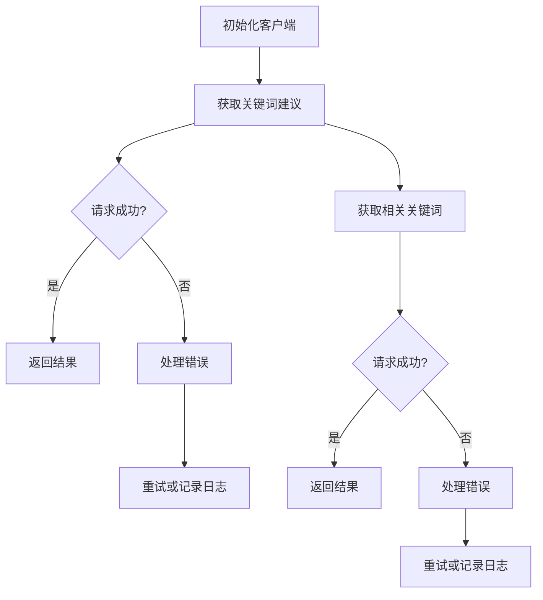
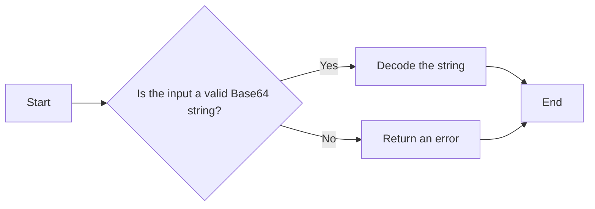
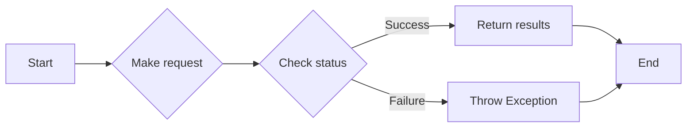
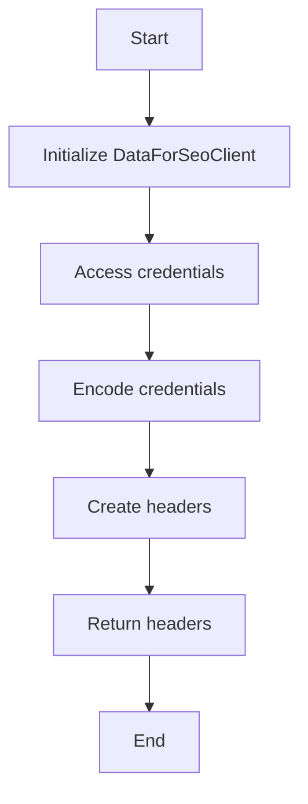
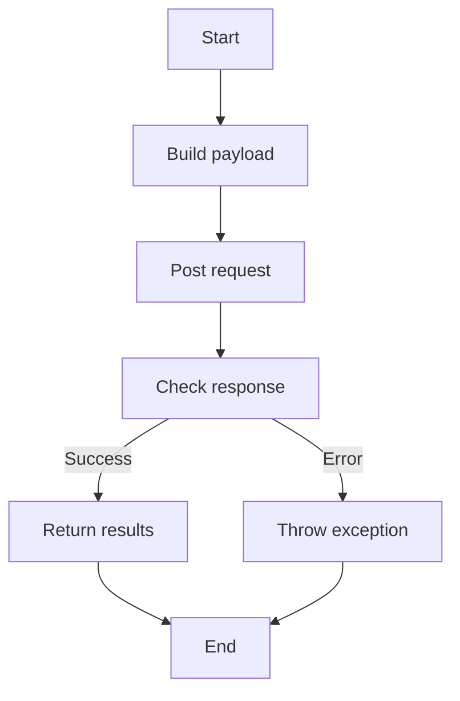

# `.\AutoGPT\autogpt_platform\backend\backend\blocks\dataforseo\_api.py` 详细设计文档

The file implements an asynchronous client for the DataForSEO API, providing methods to fetch keyword suggestions and related keywords with various filtering options.

## 整体流程



## 类结构

```
DataForSeoClient (客户端类)
├── UserPasswordCredentials (用户凭据类)
└── Requests (请求类)
```

## 全局变量及字段


### `API_URL`
    
The base URL for the DataForSEO API.

类型：`str`
    


### `username`
    
The username for the DataForSEO API credentials.

类型：`str`
    


### `password`
    
The password for the DataForSEO API credentials.

类型：`str`
    


### `encoded`
    
The base64 encoded credentials string for the API header.

类型：`str`
    


### `credentials_str`
    
The credentials string in plain text format.

类型：`str`
    


### `task_data`
    
The payload data for the API request.

类型：`dict`
    


### `payload`
    
The list of task data to be sent in the API request.

类型：`list`
    


### `response`
    
The response object from the API request.

类型：`response object`
    


### `data`
    
The JSON data extracted from the API response.

类型：`dict`
    


### `error_message`
    
The error message from the API response in case of an error.

类型：`str`
    


### `error_msg`
    
The error message from the DataForSEO task in case of an error.

类型：`str`
    


### `DataForSeoClient.API_URL`
    
The base URL for the DataForSEO API.

类型：`str`
    


### `DataForSeoClient.credentials`
    
The credentials for authenticating with the DataForSEO API.

类型：`UserPasswordCredentials`
    


### `DataForSeoClient.requests`
    
The Requests object for making HTTP requests to the DataForSEO API.

类型：`Requests`
    


### `UserPasswordCredentials.username`
    
The username for the DataForSEO API credentials.

类型：`str`
    


### `UserPasswordCredentials.password`
    
The password for the DataForSEO API credentials.

类型：`str`
    


### `Requests.trusted_origins`
    
The list of trusted origins for the Requests object.

类型：`list`
    


### `Requests.raise_for_status`
    
Whether to raise an HTTPError for bad responses.

类型：`bool`
    
    

## 全局函数及方法


### base64.b64encode

`base64.b64encode` 是一个全局函数，用于将字节字符串编码为 Base64 字符串。

参数：

- `input`：`bytes`，需要编码的字节字符串。

返回值：`bytes`，编码后的 Base64 字符串。

#### 流程图


#### 带注释源码

```python
import base64

def b64encode(input: bytes) -> bytes:
    """
    Encode a byte string using Base64.

    Args:
        input: The byte string to encode.

    Returns:
        The encoded Base64 byte string.
    """
    return base64.b64encode(input)
```


### base64.b64decode

This function decodes a Base64 encoded string.

参数：

- `encoded_str`：`str`，The Base64 encoded string to be decoded.

返回值：`str`，The decoded string.

#### 流程图



#### 带注释源码

```python
import base64

def base64_b64decode(encoded_str: str) -> str:
    """
    Decodes a Base64 encoded string.

    Args:
        encoded_str: The Base64 encoded string to be decoded.

    Returns:
        The decoded string.
    """
    try:
        decoded_bytes = base64.b64decode(encoded_str)
        return decoded_bytes.decode("ascii")
    except (base64.binascii.Error, UnicodeDecodeError) as e:
        raise ValueError(f"Invalid Base64 string: {e}")
```


### `DataForSeoClient.related_keywords`

Get related keywords from DataForSEO Labs.

参数：

- `keyword`：`str`，Seed keyword
- `location_code`：`Optional[int]`，Location code for targeting
- `language_code`：`Optional[str]`，Language code (e.g., "en")
- `include_seed_keyword`：`Optional[bool]`，Include seed keyword in results
- `include_serp_info`：`Optional[bool]`，Include SERP data
- `include_clickstream_data`：`Optional[bool]`，Include clickstream metrics
- `limit`：`Optional[int]`，Maximum number of results (up to 3000)
- `depth`：`Optional[int]`，Keyword search depth (0-4), controls number of returned keywords

返回值：`List[Dict[str, Any]]`，API response with related keywords

#### 流程图



#### 带注释源码

```python
async def related_keywords(
    self,
    keyword: str,
    location_code: Optional[int] = None,
    language_code: Optional[str] = None,
    include_seed_keyword: bool = True,
    include_serp_info: bool = False,
    include_clickstream_data: bool = False,
    limit: int = 100,
    depth: Optional[int] = None,
) -> List[Dict[str, Any]]:
    """
    Get related keywords from DataForSEO Labs.

    Args:
        keyword: Seed keyword
        location_code: Location code for targeting
        language_code: Language code (e.g., "en")
        include_seed_keyword: Include seed keyword in results
        include_serp_info: Include SERP data
        include_clickstream_data: Include clickstream metrics
        limit: Maximum number of results (up to 3000)
        depth: Keyword search depth (0-4), controls number of returned keywords

    Returns:
        API response with related keywords
    """
    endpoint = f"{self.API_URL}/v3/dataforseo_labs/google/related_keywords/live"

    # Build payload only with non-None values to avoid sending null fields
    task_data: dict[str, Any] = {
        "keyword": keyword,
    }

    if location_code is not None:
        task_data["location_code"] = location_code
    if language_code is not None:
        task_data["language_code"] = language_code
    if include_seed_keyword is not None:
        task_data["include_seed_keyword"] = include_seed_keyword
    if include_serp_info is not None:
        task_data["include_serp_info"] = include_serp_info
    if include_clickstream_data is not None:
        task_data["include_clickstream_data"] = include_clickstream_data
    if limit is not None:
        task_data["limit"] = limit
    if depth is not None:
        task_data["depth"] = depth

    payload = [task_data]

    response = await self.requests.post(
        endpoint,
        headers=self._get_headers(),
        json=payload,
    )

    data = response.json()

    # Check for API errors
    if response.status != 200:
        error_message = data.get("status_message", "Unknown error")
        raise Exception(
            f"DataForSEO API error ({response.status}): {error_message}"
        )

    # Extract the results from the response
    if data.get("tasks") and len(data["tasks"]) > 0:
        task = data["tasks"][0]
        if task.get("status_code") == 20000:  # Success code
            return task.get("result", [])
        else:
            error_msg = task.get("status_message", "Task failed")
            raise Exception(f"DataForSEO task error: {error_msg}")

    return []
```


### `DataForSeoClient.related_keywords`

Get related keywords from DataForSEO Labs.

参数：

- `keyword`：`str`，Seed keyword
- `location_code`：`Optional[int]`，Location code for targeting
- `language_code`：`Optional[str]`，Language code (e.g., "en")
- `include_seed_keyword`：`Optional[bool]`，Include seed keyword in results
- `include_serp_info`：`Optional[bool]`，Include SERP data
- `include_clickstream_data`：`Optional[bool]`，Include clickstream metrics
- `limit`：`Optional[int]`，Maximum number of results (up to 3000)
- `depth`：`Optional[int]`，Keyword search depth (0-4), controls number of returned keywords

返回值：`List[Dict[str, Any]]`，API response with related keywords

#### 流程图


#### 带注释源码

```python
async def related_keywords(
    self,
    keyword: str,
    location_code: Optional[int] = None,
    language_code: Optional[str] = None,
    include_seed_keyword: bool = True,
    include_serp_info: bool = False,
    include_clickstream_data: bool = False,
    limit: int = 100,
    depth: Optional[int] = None,
) -> List[Dict[str, Any]]:
    """
    Get related keywords from DataForSEO Labs.

    Args:
        keyword: Seed keyword
        location_code: Location code for targeting
        language_code: Language code (e.g., "en")
        include_seed_keyword: Include seed keyword in results
        include_serp_info: Include SERP data
        include_clickstream_data: Include clickstream metrics
        limit: Maximum number of results (up to 3000)
        depth: Keyword search depth (0-4), controls number of returned keywords

    Returns:
        API response with related keywords
    """
    endpoint = f"{self.API_URL}/v3/dataforseo_labs/google/related_keywords/live"

    # Build payload only with non-None values to avoid sending null fields
    task_data: dict[str, Any] = {
        "keyword": keyword,
    }

    if location_code is not None:
        task_data["location_code"] = location_code
    if language_code is not None:
        task_data["language_code"] = language_code
    if include_seed_keyword is not None:
        task_data["include_seed_keyword"] = include_seed_keyword
    if include_serp_info is not None:
        task_data["include_serp_info"] = include_serp_info
    if include_clickstream_data is not None:
        task_data["include_clickstream_data"] = include_clickstream_data
    if limit is not None:
        task_data["limit"] = limit
    if depth is not None:
        task_data["depth"] = depth

    payload = [task_data]

    response = await self.requests.post(
        endpoint,
        headers=self._get_headers(),
        json=payload,
    )

    data = response.json()

    # Check for API errors
    if response.status != 200:
        error_message = data.get("status_message", "Unknown error")
        raise Exception(
            f"DataForSEO API error ({response.status}): {error_message}"
        )

    # Extract the results from the response
    if data.get("tasks") and len(data["tasks"]) > 0:
        task = data["tasks"][0]
        if task.get("status_code") == 20000:  # Success code
            return task.get("result", [])
        else:
            error_msg = task.get("status_message", "Task failed")
            raise Exception(f"DataForSEO task error: {error_msg}")

    return []
```


### `DataForSeoClient.keyword_suggestions`

Get keyword suggestions from DataForSEO Labs.

参数：

- `keyword`：`str`，Seed keyword
- `location_code`：`Optional[int]`，Location code for targeting
- `language_code`：`Optional[str]`，Language code (e.g., "en")
- `include_seed_keyword`：`Optional[bool]`，Include seed keyword in results
- `include_serp_info`：`Optional[bool]`，Include SERP data
- `include_clickstream_data`：`Optional[bool]`，Include clickstream metrics
- `limit`：`Optional[int]`，Maximum number of results (up to 3000)

返回值：`List[Dict[str, Any]]`，API response with keyword suggestions

#### 流程图


#### 带注释源码

```python
async def keyword_suggestions(
    self,
    keyword: str,
    location_code: Optional[int] = None,
    language_code: Optional[str] = None,
    include_seed_keyword: bool = True,
    include_serp_info: bool = False,
    include_clickstream_data: bool = False,
    limit: int = 100,
) -> List[Dict[str, Any]]:
    """
    Get keyword suggestions from DataForSEO Labs.

    Args:
        keyword: Seed keyword
        location_code: Location code for targeting
        language_code: Language code (e.g., "en")
        include_seed_keyword: Include seed keyword in results
        include_serp_info: Include SERP data
        include_clickstream_data: Include clickstream metrics
        limit: Maximum number of results (up to 3000)

    Returns:
        API response with keyword suggestions
    """
    endpoint = f"{self.API_URL}/v3/dataforseo_labs/google/keyword_suggestions/live"

    # Build payload only with non-None values to avoid sending null fields
    task_data: dict[str, Any] = {
        "keyword": keyword,
    }

    if location_code is not None:
        task_data["location_code"] = location_code
    if language_code is not None:
        task_data["language_code"] = language_code
    if include_seed_keyword is not None:
        task_data["include_seed_keyword"] = include_seed_keyword
    if include_serp_info is not None:
        task_data["include_serp_info"] = include_serp_info
    if include_clickstream_data is not None:
        task_data["include_clickstream_data"] = include_clickstream_data
    if limit is not None:
        task_data["limit"] = limit

    payload = [task_data]

    response = await self.requests.post(
        endpoint,
        headers=self._get_headers(),
        json=payload,
    )

    data = response.json()

    # Check for API errors
    if response.status != 200:
        error_message = data.get("status_message", "Unknown error")
        raise Exception(
            f"DataForSEO API error ({response.status}): {error_message}"
        )

    # Extract the results from the response
    if data.get("tasks") and len(data["tasks"]) > 0:
        task = data["tasks"][0]
        if task.get("status_code") == 20000:  # Success code
            return task.get("result", [])
        else:
            error_msg = task.get("status_message", "Task failed")
            raise Exception(f"DataForSEO task error: {error_msg}")

    return []
```


### `DataForSeoClient.related_keywords`

Get related keywords from DataForSEO Labs.

参数：

- `keyword`：`str`，Seed keyword
- `location_code`：`Optional[int]`，Location code for targeting
- `language_code`：`Optional[str]`，Language code (e.g., "en")
- `include_seed_keyword`：`Optional[bool]`，Include seed keyword in results
- `include_serp_info`：`Optional[bool]`，Include SERP data
- `include_clickstream_data`：`Optional[bool]`，Include clickstream metrics
- `limit`：`Optional[int]`，Maximum number of results (up to 3000)
- `depth`：`Optional[int]`，Keyword search depth (0-4), controls number of returned keywords

返回值：`List[Dict[str, Any]]`，API response with related keywords

#### 流程图


#### 带注释源码

```python
async def related_keywords(
    self,
    keyword: str,
    location_code: Optional[int] = None,
    language_code: Optional[str] = None,
    include_seed_keyword: bool = True,
    include_serp_info: bool = False,
    include_clickstream_data: bool = False,
    limit: int = 100,
    depth: Optional[int] = None,
) -> List[Dict[str, Any]]:
    """
    Get related keywords from DataForSEO Labs.

    Args:
        keyword: Seed keyword
        location_code: Location code for targeting
        language_code: Language code (e.g., "en")
        include_seed_keyword: Include seed keyword in results
        include_serp_info: Include SERP data
        include_clickstream_data: Include clickstream metrics
        limit: Maximum number of results (up to 3000)
        depth: Keyword search depth (0-4), controls number of returned keywords

    Returns:
        API response with related keywords
    """
    endpoint = f"{self.API_URL}/v3/dataforseo_labs/google/related_keywords/live"

    # Build payload only with non-None values to avoid sending null fields
    task_data: dict[str, Any] = {
        "keyword": keyword,
    }

    if location_code is not None:
        task_data["location_code"] = location_code
    if language_code is not None:
        task_data["language_code"] = language_code
    if include_seed_keyword is not None:
        task_data["include_seed_keyword"] = include_seed_keyword
    if include_serp_info is not None:
        task_data["include_serp_info"] = include_serp_info
    if include_clickstream_data is not None:
        task_data["include_clickstream_data"] = include_clickstream_data
    if limit is not None:
        task_data["limit"] = limit
    if depth is not None:
        task_data["depth"] = depth

    payload = [task_data]

    response = await self.requests.post(
        endpoint,
        headers=self._get_headers(),
        json=payload,
    )

    data = response.json()

    # Check for API errors
    if response.status != 200:
        error_message = data.get("status_message", "Unknown error")
        raise Exception(
            f"DataForSEO API error ({response.status}): {error_message}"
        )

    # Extract the results from the response
    if data.get("tasks") and len(data["tasks"]) > 0:
        task = data["tasks"][0]
        if task.get("status_code") == 20000:  # Success code
            return task.get("result", [])
        else:
            error_msg = task.get("status_message", "Task failed")
            raise Exception(f"DataForSEO task error: {error_msg}")

    return []
```


### `DataForSeoClient.keyword_suggestions`

Get keyword suggestions from DataForSEO Labs.

参数：

- `keyword`：`str`，Seed keyword
- `location_code`：`Optional[int]`，Location code for targeting
- `language_code`：`Optional[str]`，Language code (e.g., "en")
- `include_seed_keyword`：`Optional[bool]`，Include seed keyword in results
- `include_serp_info`：`Optional[bool]`，Include SERP data
- `include_clickstream_data`：`Optional[bool]`，Include clickstream metrics
- `limit`：`Optional[int]`，Maximum number of results (up to 3000)

返回值：`List[Dict[str, Any]]`，API response with keyword suggestions

#### 流程图


#### 带注释源码

```python
async def keyword_suggestions(
    self,
    keyword: str,
    location_code: Optional[int] = None,
    language_code: Optional[str] = None,
    include_seed_keyword: bool = True,
    include_serp_info: bool = False,
    include_clickstream_data: bool = False,
    limit: int = 100,
) -> List[Dict[str, Any]]:
    """
    Get keyword suggestions from DataForSEO Labs.

    Args:
        keyword: Seed keyword
        location_code: Location code for targeting
        language_code: Language code (e.g., "en")
        include_seed_keyword: Include seed keyword in results
        include_serp_info: Include SERP data
        include_clickstream_data: Include clickstream metrics
        limit: Maximum number of results (up to 3000)

    Returns:
        API response with keyword suggestions
    """
    endpoint = f"{self.API_URL}/v3/dataforseo_labs/google/keyword_suggestions/live"

    # Build payload only with non-None values to avoid sending null fields
    task_data: dict[str, Any] = {
        "keyword": keyword,
    }

    if location_code is not None:
        task_data["location_code"] = location_code
    if language_code is not None:
        task_data["language_code"] = language_code
    if include_seed_keyword is not None:
        task_data["include_seed_keyword"] = include_seed_keyword
    if include_serp_info is not None:
        task_data["include_serp_info"] = include_serp_info
    if include_clickstream_data is not None:
        task_data["include_clickstream_data"] = include_clickstream_data
    if limit is not None:
        task_data["limit"] = limit

    payload = [task_data]

    response = await self.requests.post(
        endpoint,
        headers=self._get_headers(),
        json=payload,
    )

    data = response.json()

    # Check for API errors
    if response.status != 200:
        error_message = data.get("status_message", "Unknown error")
        raise Exception(
            f"DataForSEO API error ({response.status}): {error_message}"
        )

    # Extract the results from the response
    if data.get("tasks") and len(data["tasks"]) > 0:
        task = data["tasks"][0]
        if task.get("status_code") == 20000:  # Success code
            return task.get("result", [])
        else:
            error_msg = task.get("status_message", "Task failed")
            raise Exception(f"DataForSEO task error: {error_msg}")

    return []
```


### `DataForSeoClient.related_keywords`

Get related keywords from DataForSEO Labs.

参数：

- `keyword`：`str`，Seed keyword
- `location_code`：`Optional[int]`，Location code for targeting
- `language_code`：`Optional[str]`，Language code (e.g., "en")
- `include_seed_keyword`：`Optional[bool]`，Include seed keyword in results
- `include_serp_info`：`Optional[bool]`，Include SERP data
- `include_clickstream_data`：`Optional[bool]`，Include clickstream metrics
- `limit`：`Optional[int]`，Maximum number of results (up to 3000)
- `depth`：`Optional[int]`，Keyword search depth (0-4), controls number of returned keywords

返回值：`List[Dict[str, Any]]`，API response with related keywords

#### 流程图


#### 带注释源码

```python
async def related_keywords(
    self,
    keyword: str,
    location_code: Optional[int] = None,
    language_code: Optional[str] = None,
    include_seed_keyword: bool = True,
    include_serp_info: bool = False,
    include_clickstream_data: bool = False,
    limit: int = 100,
    depth: Optional[int] = None,
) -> List[Dict[str, Any]]:
    """
    Get related keywords from DataForSEO Labs.

    Args:
        keyword: Seed keyword
        location_code: Location code for targeting
        language_code: Language code (e.g., "en")
        include_seed_keyword: Include seed keyword in results
        include_serp_info: Include SERP data
        include_clickstream_data: Include clickstream metrics
        limit: Maximum number of results (up to 3000)
        depth: Keyword search depth (0-4), controls number of returned keywords

    Returns:
        API response with related keywords
    """
    endpoint = f"{self.API_URL}/v3/dataforseo_labs/google/related_keywords/live"

    # Build payload only with non-None values to avoid sending null fields
    task_data: dict[str, Any] = {
        "keyword": keyword,
    }

    if location_code is not None:
        task_data["location_code"] = location_code
    if language_code is not None:
        task_data["language_code"] = language_code
    if include_seed_keyword is not None:
        task_data["include_seed_keyword"] = include_seed_keyword
    if include_serp_info is not None:
        task_data["include_serp_info"] = include_serp_info
    if include_clickstream_data is not None:
        task_data["include_clickstream_data"] = include_clickstream_data
    if limit is not None:
        task_data["limit"] = limit
    if depth is not None:
        task_data["depth"] = depth

    payload = [task_data]

    response = await self.requests.post(
        endpoint,
        headers=self._get_headers(),
        json=payload,
    )

    data = response.json()

    # Check for API errors
    if response.status != 200:
        error_message = data.get("status_message", "Unknown error")
        raise Exception(
            f"DataForSEO API error ({response.status}): {error_message}"
        )

    # Extract the results from the response
    if data.get("tasks") and len(data["tasks"]) > 0:
        task = data["tasks"][0]
        if task.get("status_code") == 20000:  # Success code
            return task.get("result", [])
        else:
            error_msg = task.get("status_message", "Task failed")
            raise Exception(f"DataForSEO task error: {error_msg}")

    return []
```


### DataForSeoClient.__init__

This method initializes a new instance of the `DataForSeoClient` class, setting up the necessary credentials and request handler for making API calls to the DataForSEO service.

参数：

- `credentials`：`UserPasswordCredentials`，The credentials object containing the username and password for authentication with the DataForSEO API.

返回值：无

#### 流程图

```mermaid
graph TD
    A[Start] --> B{Initialize DataForSeoClient}
    B --> C[Set API_URL to "https://api.dataforseo.com"]
    B --> D[Create Requests instance]
    D --> E[Set trusted_origins to ["https://api.dataforseo.com"]]
    D --> F[Set raise_for_status to False]
    B --> G[Set self.credentials to credentials]
    B --> H[End]
```

#### 带注释源码

```
def __init__(self, credentials: UserPasswordCredentials):
    self.credentials = credentials  # Store the credentials for later use
    self.requests = Requests(  # Create a new Requests instance
        trusted_origins=["https://api.dataforseo.com"],  # Set trusted origins
        raise_for_status=False,  # Do not raise an exception for HTTP errors
    )
```


### `_get_headers`

Generate the authorization header using Basic Auth.

参数：

- `None`：`None`，No parameters are passed directly to this method. It uses instance variables from the `DataForSeoClient` class.

返回值：`Dict[str, str]`，A dictionary containing the authorization header and content type.

#### 流程图



#### 带注释源码

```
def _get_headers(self) -> Dict[str, str]:
    """Generate the authorization header using Basic Auth."""
    username = self.credentials.username.get_secret_value()
    password = self.credentials.password.get_secret_value()
    credentials_str = f"{username}:{password}"
    encoded = base64.b64encode(credentials_str.encode("ascii")).decode("ascii")
    return {
        "Authorization": f"Basic {encoded}",
        "Content-Type": "application/json",
    }
```


### DataForSeoClient.keyword_suggestions

Get keyword suggestions from DataForSEO Labs.

参数：

- `keyword`：`str`，Seed keyword
- `location_code`：`Optional[int]`，Location code for targeting
- `language_code`：`Optional[str]`，Language code (e.g., "en")
- `include_seed_keyword`：`Optional[bool]`，Include seed keyword in results
- `include_serp_info`：`Optional[bool]`，Include SERP data
- `include_clickstream_data`：`Optional[bool]`，Include clickstream metrics
- `limit`：`Optional[int]`，Maximum number of results (up to 3000)

返回值：`List[Dict[str, Any]]`，API response with keyword suggestions

#### 流程图



#### 带注释源码

```python
async def keyword_suggestions(
    self,
    keyword: str,
    location_code: Optional[int] = None,
    language_code: Optional[str] = None,
    include_seed_keyword: bool = True,
    include_serp_info: bool = False,
    include_clickstream_data: bool = False,
    limit: int = 100,
) -> List[Dict[str, Any]]:
    """
    Get keyword suggestions from DataForSEO Labs.

    Args:
        keyword: Seed keyword
        location_code: Location code for targeting
        language_code: Language code (e.g., "en")
        include_seed_keyword: Include seed keyword in results
        include_serp_info: Include SERP data
        include_clickstream_data: Include clickstream metrics
        limit: Maximum number of results (up to 3000)

    Returns:
        API response with keyword suggestions
    """
    endpoint = f"{self.API_URL}/v3/dataforseo_labs/google/keyword_suggestions/live"

    # Build payload only with non-None values to avoid sending null fields
    task_data: dict[str, Any] = {
        "keyword": keyword,
    }

    if location_code is not None:
        task_data["location_code"] = location_code
    if language_code is not None:
        task_data["language_code"] = language_code
    if include_seed_keyword is not None:
        task_data["include_seed_keyword"] = include_seed_keyword
    if include_serp_info is not None:
        task_data["include_serp_info"] = include_serp_info
    if include_clickstream_data is not None:
        task_data["include_clickstream_data"] = include_clickstream_data
    if limit is not None:
        task_data["limit"] = limit

    payload = [task_data]

    response = await self.requests.post(
        endpoint,
        headers=self._get_headers(),
        json=payload,
    )

    data = response.json()

    # Check for API errors
    if response.status != 200:
        error_message = data.get("status_message", "Unknown error")
        raise Exception(
            f"DataForSEO API error ({response.status}): {error_message}"
        )

    # Extract the results from the response
    if data.get("tasks") and len(data["tasks"]) > 0:
        task = data["tasks"][0]
        if task.get("status_code") == 20000:  # Success code
            return task.get("result", [])
        else:
            error_msg = task.get("status_message", "Task failed")
            raise Exception(f"DataForSEO task error: {error_msg}")

    return []
```


### DataForSeoClient.related_keywords

Get related keywords from DataForSEO Labs.

参数：

- `keyword`：`str`，Seed keyword
- `location_code`：`Optional[int]`，Location code for targeting
- `language_code`：`Optional[str]`，Language code (e.g., "en")
- `include_seed_keyword`：`Optional[bool]`，Include seed keyword in results
- `include_serp_info`：`Optional[bool]`，Include SERP data
- `include_clickstream_data`：`Optional[bool]`，Include clickstream metrics
- `limit`：`Optional[int]`，Maximum number of results (up to 3000)
- `depth`：`Optional[int]`，Keyword search depth (0-4), controls number of returned keywords

返回值：`List[Dict[str, Any]]`，API response with related keywords

#### 流程图


#### 带注释源码

```
async def related_keywords(
    self,
    keyword: str,
    location_code: Optional[int] = None,
    language_code: Optional[str] = None,
    include_seed_keyword: bool = True,
    include_serp_info: bool = False,
    include_clickstream_data: bool = False,
    limit: int = 100,
    depth: Optional[int] = None,
) -> List[Dict[str, Any]]:
    """
    Get related keywords from DataForSEO Labs.

    Args:
        keyword: Seed keyword
        location_code: Location code for targeting
        language_code: Language code (e.g., "en")
        include_seed_keyword: Include seed keyword in results
        include_serp_info: Include SERP data
        include_clickstream_data: Include clickstream metrics
        limit: Maximum number of results (up to 3000)
        depth: Keyword search depth (0-4), controls number of returned keywords

    Returns:
        API response with related keywords
    """
    endpoint = f"{self.API_URL}/v3/dataforseo_labs/google/related_keywords/live"

    # Build payload only with non-None values to avoid sending null fields
    task_data: dict[str, Any] = {
        "keyword": keyword,
    }

    if location_code is not None:
        task_data["location_code"] = location_code
    if language_code is not None:
        task_data["language_code"] = language_code
    if include_seed_keyword is not None:
        task_data["include_seed_keyword"] = include_seed_keyword
    if include_serp_info is not None:
        task_data["include_serp_info"] = include_serp_info
    if include_clickstream_data is not None:
        task_data["include_clickstream_data"] = include_clickstream_data
    if limit is not None:
        task_data["limit"] = limit
    if depth is not None:
        task_data["depth"] = depth

    payload = [task_data]

    response = await self.requests.post(
        endpoint,
        headers=self._get_headers(),
        json=payload,
    )

    data = response.json()

    # Check for API errors
    if response.status != 200:
        error_message = data.get("status_message", "Unknown error")
        raise Exception(
            f"DataForSEO API error ({response.status}): {error_message}"
        )

    # Extract the results from the response
    if data.get("tasks") and len(data["tasks"]) > 0:
        task = data["tasks"][0]
        if task.get("status_code") == 20000:  # Success code
            return task.get("result", [])
        else:
            error_msg = task.get("status_message", "Task failed")
            raise Exception(f"DataForSEO task error: {error_msg}")

    return []
```


## 关键组件


### 张量索引与惰性加载

用于高效地处理和索引大型数据集，通过延迟加载数据以减少内存消耗。

### 反量化支持

提供对反量化操作的支持，允许在量化过程中进行逆量化处理。

### 量化策略

定义了不同的量化策略，以优化模型在特定硬件上的性能和精度。


## 问题及建议


### 已知问题

-   **全局变量和函数的复用性低**：`_get_headers` 方法在 `keyword_suggestions` 和 `related_keywords` 方法中被重复调用，可以考虑将其提升为类方法或全局函数以提高复用性。
-   **异常处理过于简单**：在 `keyword_suggestions` 和 `related_keywords` 方法中，异常处理仅限于抛出异常，可以考虑添加更详细的错误信息或错误日志记录。
-   **参数验证不足**：方法参数如 `location_code`、`language_code`、`limit` 等没有进行有效性验证，可能导致调用错误或异常。
-   **代码风格不一致**：代码中存在一些不一致的命名约定和缩进，这可能会影响代码的可读性和可维护性。

### 优化建议

-   **提升全局变量和函数的复用性**：将 `_get_headers` 方法提升为类方法或全局函数，并在需要的地方调用。
-   **增强异常处理**：在异常处理中添加更详细的错误信息，并考虑记录错误日志。
-   **添加参数验证**：在方法参数中使用类型检查或范围检查，确保参数的有效性。
-   **统一代码风格**：遵循一致的命名约定和缩进规则，以提高代码的可读性和可维护性。
-   **考虑使用异步编程的最佳实践**：例如，使用 `asyncio` 库提供的 `run_until_complete` 或 `asyncio.create_task` 来管理异步任务，以提高代码的效率和可读性。
-   **优化数据传输**：考虑使用更高效的数据传输格式，如 Protobuf 或 Avro，以减少数据传输的负载。
-   **增加单元测试**：编写单元测试以确保代码的正确性和稳定性，并帮助在未来的开发中避免回归错误。


## 其它


### 设计目标与约束

- 设计目标：
  - 提供一个异步的DataForSEO API客户端，支持使用SDK模式。
  - 确保客户端能够处理API响应并抛出适当的异常。
  - 提供灵活的参数配置，允许用户自定义请求的细节。
- 约束：
  - 必须使用异步请求库。
  - API响应处理必须遵循DataForSEO API规范。
  - 代码应保持简洁且易于维护。

### 错误处理与异常设计

- 错误处理：
  - API响应状态码非200时，抛出异常，包含错误信息。
  - API任务状态码非20000时，抛出异常，包含错误信息。
- 异常设计：
  - 定义自定义异常类，如`DataForSEOApiException`，用于封装API错误。
  - 使用try-except块捕获和处理异常。

### 数据流与状态机

- 数据流：
  - 用户调用`keyword_suggestions`或`related_keywords`方法。
  - 方法构建请求参数，发送异步POST请求到DataForSEO API。
  - 接收API响应，解析结果或错误信息。
  - 将结果返回给用户或抛出异常。
- 状态机：
  - 无需状态机，因为方法直接处理请求和响应。

### 外部依赖与接口契约

- 外部依赖：
  - `base64`库用于编码认证信息。
  - `typing`库用于类型注解。
  - `backend.sdk.Requests`类用于发送HTTP请求。
  - `backend.sdk.UserPasswordCredentials`类用于存储认证信息。
- 接口契约：
  - `DataForSeoClient`类提供与DataForSEO API交互的接口。
  - 方法参数和返回值遵循API规范和类型注解。

    