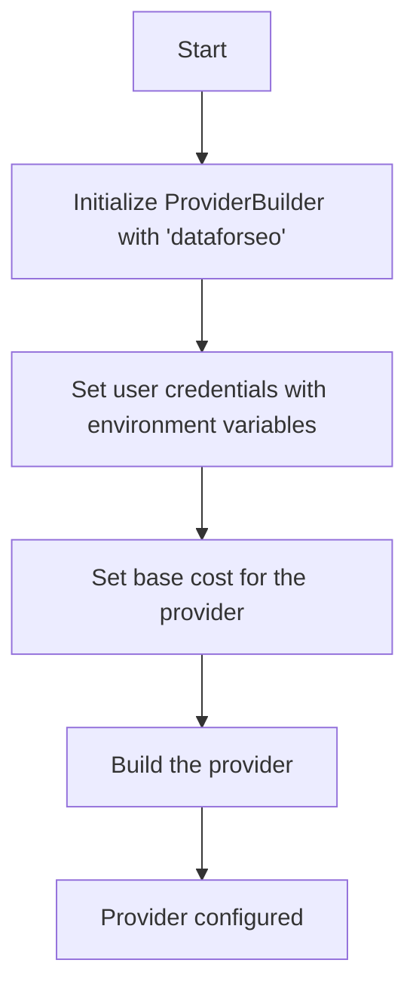
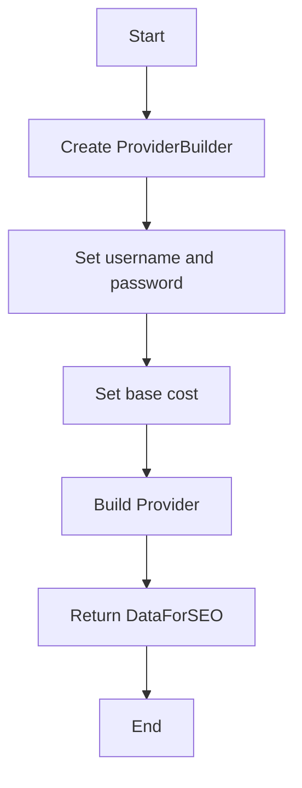

# `.\AutoGPT\autogpt_platform\backend\backend\blocks\dataforseo\_config.py` 详细设计文档

This code configures a DataForSEO provider using the new SDK pattern, setting up authentication credentials and base cost for the provider.

## 整体流程



## 类结构

```
ProviderBuilder (类)
├── dataforseo (全局变量)
```

## 全局变量及字段


### `dataforseo`
    
An instance of ProviderBuilder configured for DataForSEO with username/password authentication.

类型：`ProviderBuilder`
    


### `ProviderBuilder.name`
    
The name of the provider.

类型：`str`
    
    

## 全局函数及方法


### ProviderBuilder.with_user_password

This method configures the DataForSEO provider with username and password authentication.

参数：

- `username_env_var`：`str`，The environment variable name that contains the username.
- `password_env_var`：`str`，The environment variable name that contains the password.
- `title`：`str`，The title of the credentials configuration.

返回值：`None`，This method does not return a value; it configures the provider object.

#### 流程图

```mermaid
graph LR
A[Start] --> B[ProviderBuilder("dataforseo")]
B --> C[with_user_password(username_env_var="DATAFORSEO_USERNAME", password_env_var="DATAFORSEO_PASSWORD", title="DataForSEO Credentials")]
C --> D[with_base_cost(1, BlockCostType.RUN)]
D --> E[build()]
E --> F[Return Provider Object]
F --> G[End]
```

#### 带注释源码

```
from backend.sdk import BlockCostType, ProviderBuilder

# Build the DataForSEO provider with username/password authentication
dataforseo = (
    ProviderBuilder("dataforseo")
    .with_user_password(
        username_env_var="DATAFORSEO_USERNAME",
        password_env_var="DATAFORSEO_PASSWORD",
        title="DataForSEO Credentials",
    )
    .with_base_cost(1, BlockCostType.RUN)
    .build()
)
```


### ProviderBuilder.with_base_cost

This method is used to set the base cost for a DataForSEO block using the new SDK pattern.

参数：

- `cost`：`int`，The base cost value to be set for the block.
- `cost_type`：`BlockCostType`，The type of cost to be set (e.g., RUN, QUERY).

返回值：`None`，This method does not return a value; it configures the provider.

#### 流程图

```mermaid
graph TD
    A[Start] --> B[ProviderBuilder.with_base_cost(cost: int, cost_type: BlockCostType)]
    B --> C[Set base cost]
    C --> D[Return to build method]
    D --> E[Build provider]
    E --> F[End]
```

#### 带注释源码

```
# Build the DataForSEO provider with username/password authentication
dataforseo = (
    ProviderBuilder("dataforseo")
    .with_user_password(
        username_env_var="DATAFORSEO_USERNAME",
        password_env_var="DATAFORSEO_PASSWORD",
        title="DataForSEO Credentials",
    )
    .with_base_cost(1, BlockCostType.RUN)  # Set the base cost for the block
    .build()
)
```


### ProviderBuilder.build

该函数用于构建DataForSEO提供者实例，使用用户名和密码进行认证。

参数：

- `self`：`ProviderBuilder`对象，表示当前构建的提供者实例。
- `username_env_var`：`str`，环境变量名称，用于获取用户名。
- `password_env_var`：`str`，环境变量名称，用于获取密码。
- `title`：`str`，提供者标题，用于显示在用户界面中。
- `base_cost`：`int`，基础成本，表示每个操作的成本。
- `BlockCostType`：`BlockCostType`枚举，表示成本类型。

返回值：`DataForSEO`对象，表示构建完成的提供者实例。

#### 流程图



#### 带注释源码

```python
from backend.sdk import BlockCostType, ProviderBuilder

# Build the DataForSEO provider with username/password authentication
dataforseo = (
    ProviderBuilder("dataforseo")
    .with_user_password(
        username_env_var="DATAFORSEO_USERNAME",
        password_env_var="DATAFORSEO_PASSWORD",
        title="DataForSEO Credentials",
    )
    .with_base_cost(1, BlockCostType.RUN)
    .build()
)
```


## 关键组件


### 张量索引与惰性加载

支持对张量的索引操作，并在需要时才加载数据，以优化内存使用和性能。

### 反量化支持

提供对反量化操作的支持，允许在量化过程中进行逆量化处理。

### 量化策略

定义了不同的量化策略，用于在模型训练和推理过程中对权重进行量化。


## 问题及建议


### 已知问题

-   {问题1}：代码中使用了环境变量来获取用户名和密码，这可能导致安全性问题，如果环境变量被不当访问或泄露。
-   {问题2}：代码没有实现错误处理机制，如果SDK构建过程中发生错误，程序可能会崩溃或产生不可预测的行为。
-   {问题3}：代码没有提供日志记录功能，这会使得调试和监控应用程序的运行状态变得困难。

### 优化建议

-   {建议1}：使用加密存储来保护敏感信息，例如用户名和密码，而不是直接使用环境变量。
-   {建议2}：在构建SDK提供者时添加异常处理，确保在发生错误时能够优雅地处理异常，并提供有用的错误信息。
-   {建议3}：实现日志记录功能，记录关键操作和潜在的错误，以便于问题追踪和性能监控。
-   {建议4}：考虑将配置信息抽象为一个配置类，以便于管理和重用配置信息，同时提高代码的可读性和可维护性。
-   {建议5}：定期审查和更新依赖项，确保使用的是最新和最安全的版本，以减少安全风险。


## 其它


### 设计目标与约束

- 设计目标：
  - 提供一个统一的配置接口，用于所有使用新SDK模式的DataForSEO块。
  - 确保配置过程简单且易于管理。
  - 支持环境变量配置，以便于在不同环境中复用配置。
- 约束：
  - 必须使用环境变量来存储敏感信息，如用户名和密码。
  - 配置必须支持多种BlockCostType。

### 错误处理与异常设计

- 错误处理：
  - 当环境变量未设置时，抛出`EnvironmentError`。
  - 当构建Provider时发生错误，抛出`ProviderBuilderError`。
- 异常设计：
  - 定义自定义异常类`ProviderBuilderError`，用于处理Provider构建过程中的错误。

### 数据流与状态机

- 数据流：
  - 用户通过环境变量提供认证信息。
  - `ProviderBuilder`使用这些信息构建DataForSEO Provider。
- 状态机：
  - `ProviderBuilder`类内部管理构建状态，从初始化到构建完成。

### 外部依赖与接口契约

- 外部依赖：
  - `backend.sdk.BlockCostType`：定义了BlockCostType枚举。
  - `backend.sdk.ProviderBuilder`：用于构建DataForSEO Provider。
- 接口契约：
  - `ProviderBuilder`接口定义了构建Provider的方法和所需参数。
  - `BlockCostType`枚举定义了可能的成本类型。


    