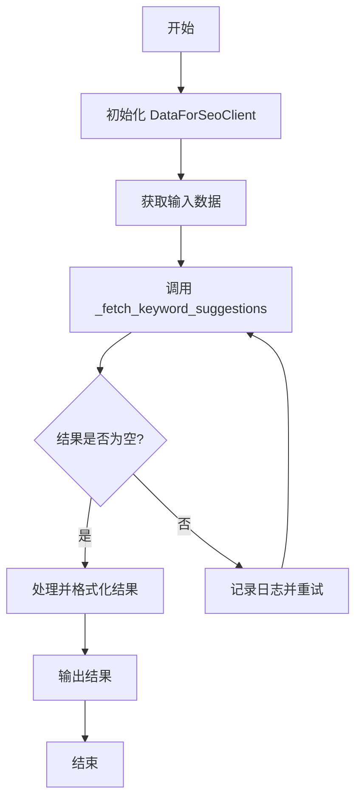
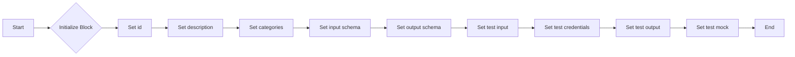
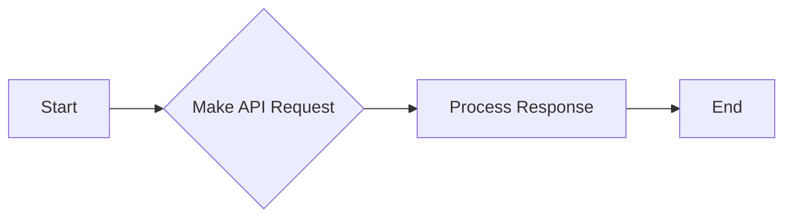
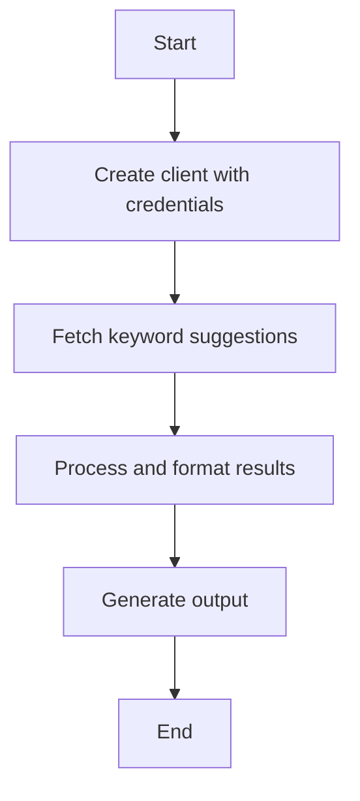
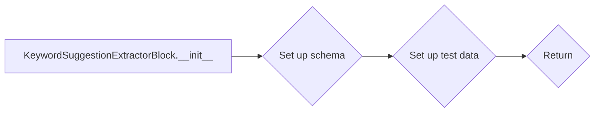
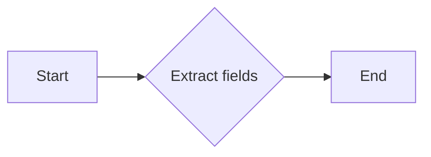

# `.\AutoGPT\autogpt_platform\backend\backend\blocks\dataforseo\keyword_suggestions.py` 详细设计文档

This code provides functionality to fetch keyword suggestions from DataForSEO Labs using Google API, and extract individual fields from keyword suggestion objects.

## 整体流程



## 类结构

```
DataForSeoKeywordSuggestionsBlock (数据获取块)
├── KeywordSuggestionExtractorBlock (字段提取块)
│   ├── KeywordSuggestion (关键字建议模型)
│   └── Input/Output (输入/输出模型)
```

## 全局变量及字段


### `KeywordSuggestion.keyword`
    
The keyword suggestion

类型：`str`
    


### `KeywordSuggestion.search_volume`
    
Monthly search volume

类型：`Optional[int]`
    


### `KeywordSuggestion.competition`
    
Competition level (0-1)

类型：`Optional[float]`
    


### `KeywordSuggestion.cpc`
    
Cost per click in USD

类型：`Optional[float]`
    


### `KeywordSuggestion.keyword_difficulty`
    
Keyword difficulty score

类型：`Optional[int]`
    


### `KeywordSuggestion.serp_info`
    
data from SERP for each keyword

类型：`Optional[Dict[str, Any]]`
    


### `KeywordSuggestion.clickstream_data`
    
Clickstream data metrics

类型：`Optional[Dict[str, Any]]`
    
    

## 全局函数及方法


### DataForSeoKeywordSuggestionsBlock.__init__

This method initializes the `DataForSeoKeywordSuggestionsBlock` class, setting up its schema, test input, test credentials, test output, and test mock for the keyword suggestions block.

参数：

- `id`: `str`，The unique identifier for the block.
- `description`: `str`，A description of the block's functionality.
- `categories`: `set`，A set of categories that the block belongs to.
- `input_schema`: `BlockSchemaInput`，The schema for the block's input.
- `output_schema`: `BlockSchemaOutput`，The schema for the block's output.
- `test_input`: `dict`，The test input data for the block.
- `test_credentials`: `UserPasswordCredentials`，The test credentials for the block.
- `test_output`: `list`，The expected test output for the block.
- `test_mock`: `dict`，The mock data for the test.

返回值：`None`，This method does not return any value.

#### 流程图



#### 带注释源码

```python
def __init__(self):
    super().__init__(
        id="73c3e7c4-2b3f-4e9f-9e3e-8f7a5c3e2d45",
        description="Get keyword suggestions from DataForSEO Labs Google API",
        categories={BlockCategory.SEARCH, BlockCategory.DATA},
        input_schema=self.Input,
        output_schema=self.Output,
        test_input={
            "credentials": dataforseo.get_test_credentials().model_dump(),
            "keyword": "digital marketing",
            "location_code": 2840,
            "language_code": "en",
            "limit": 1,
        },
        test_credentials=dataforseo.get_test_credentials(),
        test_output=[
            (
                "suggestion",
                lambda x: hasattr(x, "keyword")
                and x.keyword == "digital marketing strategy",
            ),
            ("suggestions", lambda x: isinstance(x, list) and len(x) == 1),
            ("total_count", 1),
            ("seed_keyword", "digital marketing"),
        ],
        test_mock={
            "_fetch_keyword_suggestions": lambda *args, **kwargs: [
                {
                    "items": [
                        {
                            "keyword": "digital marketing strategy",
                            "keyword_info": {
                                "search_volume": 10000,
                                "competition": 0.5,
                                "cpc": 2.5,
                            },
                            "keyword_properties": {
                                "keyword_difficulty": 50,
                            },
                        }
                    ]
                }
            ]
        },
    )
```


### `_fetch_keyword_suggestions`

This method fetches keyword suggestions from the DataForSEO Labs Google API.

参数：

- `client`：`DataForSeoClient`，The DataForSEO client used to make API requests.
- `input_data`：`Input`，The input data containing the keyword and other parameters for the API request.

返回值：`Any`，The response from the API request.

#### 流程图



#### 带注释源码

```python
async def _fetch_keyword_suggestions(
    self,
    client: DataForSeoClient,
    input_data: Input,
) -> Any:
    """Private method to fetch keyword suggestions - can be mocked for testing."""
    return await client.keyword_suggestions(
        keyword=input_data.keyword,
        location_code=input_data.location_code,
        language_code=input_data.language_code,
        include_seed_keyword=input_data.include_seed_keyword,
        include_serp_info=input_data.include_serp_info,
        include_clickstream_data=input_data.include_clickstream_data,
        limit=input_data.limit,
    )
```


### DataForSeoKeywordSuggestionsBlock.run

Execute the keyword suggestions query.

参数：

- `input_data`：`Input`，The input data for the keyword suggestions query.
- `credentials`：`UserPasswordCredentials`，DataForSEO credentials (username and password)

返回值：`BlockOutput`，The output of the keyword suggestions query.

#### 流程图



#### 带注释源码

```python
async def run(
    self,
    input_data: Input,
    *,
    credentials: UserPasswordCredentials,
    **kwargs,
) -> BlockOutput:
    """Execute the keyword suggestions query."""
    try:
        client = DataForSeoClient(credentials)

        results = await self._fetch_keyword_suggestions(client, input_data)

        # Process and format the results
        suggestions = []
        if results and len(results) > 0:
            # results is a list, get the first element
            first_result = results[0] if isinstance(results, list) else results
            items = (
                first_result.get("items", [])
                if isinstance(first_result, dict)
                else []
            )
            if items is None:
                items = []
            for item in items:
                # Create the KeywordSuggestion object
                suggestion = KeywordSuggestion(
                    keyword=item.get("keyword", ""),
                    search_volume=item.get("keyword_info", {}).get("search_volume"),
                    competition=item.get("keyword_info", {}).get("competition"),
                    cpc=item.get("keyword_info", {}).get("cpc"),
                    keyword_difficulty=item.get("keyword_properties", {}).get(
                        "keyword_difficulty"
                    ),
                    serp_info=(
                        item.get("serp_info")
                        if input_data.include_serp_info
                        else None
                    ),
                    clickstream_data=(
                        item.get("clickstream_keyword_info")
                        if input_data.include_clickstream_data
                        else None
                    ),
                )
                yield "suggestion", suggestion
                suggestions.append(suggestion)

        yield "suggestions", suggestions
        yield "total_count", len(suggestions)
        yield "seed_keyword", input_data.keyword
    except Exception as e:
        yield "error", f"Failed to fetch keyword suggestions: {str(e)}"
```


### KeywordSuggestionExtractorBlock.__init__

This method initializes the KeywordSuggestionExtractorBlock class, setting up the block's schema and test data.

参数：

- 无

返回值：无

#### 流程图



#### 带注释源码

```python
def __init__(self):
    super().__init__(
        id="4193cb94-677c-48b0-9eec-6ac72fffd0f2",
        description="Extract individual fields from a KeywordSuggestion object",
        categories={BlockCategory.DATA},
        input_schema=self.Input,
        output_schema=self.Output,
        test_input={
            "suggestion": KeywordSuggestion(
                keyword="test keyword",
                search_volume=1000,
                competition=0.5,
                cpc=2.5,
                keyword_difficulty=60,
            ).model_dump()
        },
        test_output=[
            ("keyword", "test keyword"),
            ("search_volume", 1000),
            ("competition", 0.5),
            ("cpc", 2.5),
            ("keyword_difficulty", 60),
            ("serp_info", None),
            ("clickstream_data", None),
        ],
    )
```


### KeywordSuggestionExtractorBlock.run

Extract fields from the KeywordSuggestion object.

参数：

- `input_data`：`Input`，The input data containing the KeywordSuggestion object to extract fields from.

返回值：`BlockOutput`，The extracted fields from the KeywordSuggestion object.

#### 流程图



#### 带注释源码

```python
async def run(self, input_data: Input, **kwargs) -> BlockOutput:
    """Extract fields from the KeywordSuggestion object."""
    suggestion = input_data.suggestion

    yield "keyword", suggestion.keyword
    yield "search_volume", suggestion.search_volume
    yield "competition", suggestion.competition
    yield "cpc", suggestion.cpc
    yield "keyword_difficulty", suggestion.keyword_difficulty
    yield "serp_info", suggestion.serp_info
    yield "clickstream_data", suggestion.clickstream_data
``` 


## 关键组件


### 张量索引与惰性加载

用于高效地索引和访问大型数据集，同时延迟加载数据以减少内存消耗。

### 反量化支持

提供对量化策略的支持，允许在模型训练过程中动态调整量化参数。

### 量化策略

实现量化策略，用于优化模型性能和减少模型大小。


## 问题及建议


### 已知问题

-   **代码重复**：`KeywordSuggestionExtractorBlock` 类中的 `run` 方法与 `DataForSeoKeywordSuggestionsBlock` 类中的 `run` 方法在处理 `KeywordSuggestion` 对象的逻辑上存在重复。这可能导致维护成本增加，并且如果 `KeywordSuggestion` 的结构发生变化，两个地方都需要更新。
-   **异常处理**：`run` 方法中的异常处理仅捕获了通用的 `Exception`，这可能隐藏了特定于模块的错误。建议捕获更具体的异常类型，以便更好地诊断问题。
-   **全局变量**：代码中使用了全局变量 `dataforseo`，这可能导致代码难以测试和重用。建议将配置信息作为参数传递给类或方法。

### 优化建议

-   **代码重构**：将 `KeywordSuggestion` 对象的处理逻辑提取到一个单独的方法中，并在两个类中复用该方法，以减少代码重复。
-   **异常处理**：引入更具体的异常处理，例如捕获 `DataForSeoClient` 可能抛出的异常，并相应地处理它们。
-   **依赖注入**：将 `dataforseo` 配置信息作为参数传递给类或方法，而不是使用全局变量，以提高代码的可测试性和可重用性。
-   **单元测试**：增加单元测试来覆盖代码中的关键路径，确保代码在各种情况下都能正常工作。
-   **文档**：为代码添加更详细的文档注释，包括每个类、方法和函数的目的、参数和返回值。


## 其它


### 设计目标与约束

- 设计目标：
  - 提供一个模块化的API来获取关键词建议。
  - 确保API能够处理大量数据，并保持响应时间。
  - 提供灵活的配置选项，允许用户自定义查询参数。
  - 确保代码的可维护性和可扩展性。

- 约束：
  - 必须使用DataForSEO的API。
  - 输入参数必须符合DataForSEO API的要求。
  - 输出格式必须符合BlockSchemaOutput的要求。

### 错误处理与异常设计

- 错误处理：
  - 在API调用失败时，捕获异常并返回错误信息。
  - 在数据处理过程中，检查数据的有效性，并在发现问题时返回错误。

- 异常设计：
  - 定义自定义异常类，用于处理特定类型的错误。
  - 使用try-except块捕获和处理异常。

### 数据流与状态机

- 数据流：
  - 用户输入关键词和查询参数。
  - 系统调用DataForSEO API获取关键词建议。
  - 系统处理API返回的数据，并生成输出。

- 状态机：
  - 无状态设计，所有操作都是同步的。

### 外部依赖与接口契约

- 外部依赖：
  - DataForSEO API。
  - BlockSchemaInput和BlockSchemaOutput。

- 接口契约：
  - 输入参数必须符合BlockSchemaInput的要求。
  - 输出参数必须符合BlockSchemaOutput的要求。
  - API调用必须遵循DataForSEO API的规范。

    