# `.\AutoGPT\autogpt_platform\backend\backend\blocks\dataforseo\related_keywords.py` 详细设计文档

This code provides functionality to fetch and process related keywords from DataForSEO Labs using the Google API.

## 整体流程

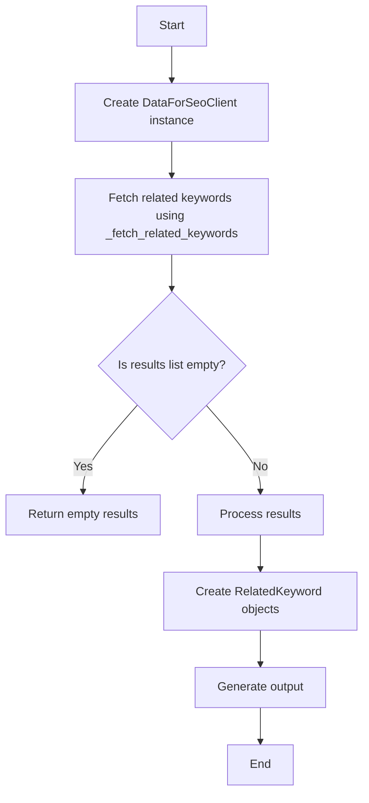

## 类结构

```
DataForSeoRelatedKeywordsBlock (Block)
├── Input (BlockSchemaInput)
│   ├── credentials (CredentialsMetaInput)
│   ├── keyword (str)
│   ├── location_code (int)
│   ├── language_code (str)
│   ├── include_seed_keyword (bool)
│   ├── include_serp_info (bool)
│   ├── include_clickstream_data (bool)
│   └── limit (int)
│   └── depth (int)
├── Output (BlockSchemaOutput)
│   ├── related_keywords (List[RelatedKeyword])
│   ├── related_keyword (RelatedKeyword)
│   ├── total_count (int)
│   └── seed_keyword (str)
└── _fetch_related_keywords (async def)
    └── client (DataForSeoClient)
    └── input_data (Input)
```

## 全局变量及字段


### `dataforseo`
    
Module containing configuration and credentials for DataForSEO.

类型：`module`
    


### `Block`
    
Base class for blocks in the system.

类型：`class`
    


### `BlockCategory`
    
Enumeration for block categories.

类型：`enum`
    


### `BlockOutput`
    
Base class for block outputs.

类型：`class`
    


### `BlockSchemaInput`
    
Base class for block schema inputs.

类型：`class`
    


### `BlockSchemaOutput`
    
Base class for block schema outputs.

类型：`class`
    


### `CredentialsMetaInput`
    
Class for credentials metadata inputs.

类型：`class`
    


### `SchemaField`
    
Class for schema fields.

类型：`class`
    


### `UserPasswordCredentials`
    
Class for user password credentials.

类型：`class`
    


### `DataForSeoClient`
    
Class for interacting with the DataForSEO API.

类型：`class`
    


### `{'name': 'RelatedKeyword', 'fields': ['keyword (str)', 'search_volume (Optional[int])', 'competition (Optional[float])', 'cpc (Optional[float])', 'keyword_difficulty (Optional[int])', 'serp_info (Optional[Dict[str, Any]])', 'clickstream_data (Optional[Dict[str, Any]])'], 'methods': []}.keyword (str)`
    
The related keyword.

类型：`str`
    


### `{'name': 'RelatedKeyword', 'fields': ['keyword (str)', 'search_volume (Optional[int])', 'competition (Optional[float])', 'cpc (Optional[float])', 'keyword_difficulty (Optional[int])', 'serp_info (Optional[Dict[str, Any]])', 'clickstream_data (Optional[Dict[str, Any]])'], 'methods': []}.search_volume (Optional[int)`
    
Monthly search volume.

类型：`Optional[int]`
    


### `{'name': 'RelatedKeyword', 'fields': ['keyword (str)', 'search_volume (Optional[int])', 'competition (Optional[float])', 'cpc (Optional[float])', 'keyword_difficulty (Optional[int])', 'serp_info (Optional[Dict[str, Any]])', 'clickstream_data (Optional[Dict[str, Any]])'], 'methods': []}.competition (Optional[float)`
    
Competition level (0-1).

类型：`Optional[float]`
    


### `{'name': 'RelatedKeyword', 'fields': ['keyword (str)', 'search_volume (Optional[int])', 'competition (Optional[float])', 'cpc (Optional[float])', 'keyword_difficulty (Optional[int])', 'serp_info (Optional[Dict[str, Any]])', 'clickstream_data (Optional[Dict[str, Any]])'], 'methods': []}.cpc (Optional[float)`
    
Cost per click in USD.

类型：`Optional[float]`
    


### `{'name': 'RelatedKeyword', 'fields': ['keyword (str)', 'search_volume (Optional[int])', 'competition (Optional[float])', 'cpc (Optional[float])', 'keyword_difficulty (Optional[int])', 'serp_info (Optional[Dict[str, Any]])', 'clickstream_data (Optional[Dict[str, Any]])'], 'methods': []}.keyword_difficulty (Optional[int)`
    
Keyword difficulty score.

类型：`Optional[int]`
    


### `{'name': 'RelatedKeyword', 'fields': ['keyword (str)', 'search_volume (Optional[int])', 'competition (Optional[float])', 'cpc (Optional[float])', 'keyword_difficulty (Optional[int])', 'serp_info (Optional[Dict[str, Any]])', 'clickstream_data (Optional[Dict[str, Any]])'], 'methods': []}.serp_info (Optional[Dict[str, Any})`
    
SERP data for the keyword.

类型：`Optional[Dict[str, Any]]`
    


### `{'name': 'RelatedKeyword', 'fields': ['keyword (str)', 'search_volume (Optional[int])', 'competition (Optional[float])', 'cpc (Optional[float])', 'keyword_difficulty (Optional[int])', 'serp_info (Optional[Dict[str, Any]])', 'clickstream_data (Optional[Dict[str, Any]])'], 'methods': []}.clickstream_data (Optional[Dict[str, Any})`
    
Clickstream data metrics.

类型：`Optional[Dict[str, Any]]`
    


### `RelatedKeyword.keyword`
    
The related keyword.

类型：`str`
    


### `RelatedKeyword.search_volume`
    
Monthly search volume.

类型：`Optional[int]`
    


### `RelatedKeyword.competition`
    
Competition level (0-1).

类型：`Optional[float]`
    


### `RelatedKeyword.cpc`
    
Cost per click in USD.

类型：`Optional[float]`
    


### `RelatedKeyword.keyword_difficulty`
    
Keyword difficulty score.

类型：`Optional[int]`
    


### `RelatedKeyword.serp_info`
    
SERP data for the keyword.

类型：`Optional[Dict[str, Any]]`
    


### `RelatedKeyword.clickstream_data`
    
Clickstream data metrics.

类型：`Optional[Dict[str, Any]]`
    
    

## 全局函数及方法


### dataforseo.credentials_field

This function is used to define a field in the input schema for the DataForSeoRelatedKeywordsBlock class. It specifies the DataForSEO credentials required for authentication.

参数：

- `credentials`：`CredentialsMetaInput`，DataForSEO credentials (username and password)

返回值：无

#### 流程图

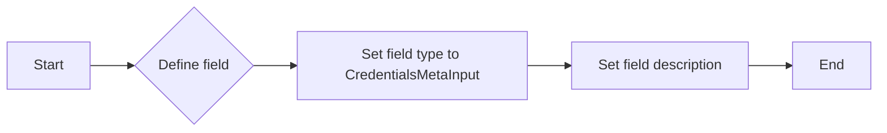

#### 带注释源码

```python
from backend.sdk import CredentialsMetaInput

dataforseo.credentials_field(
    description="DataForSEO credentials (username and password)"
)
```


### dataforseo.get_test_credentials

This function retrieves test credentials for DataForSEO.

参数：

- 无

返回值：`CredentialsMetaInput`，返回DataForSEO的测试凭据对象

#### 流程图

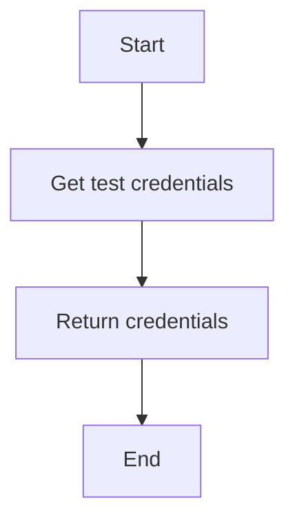

#### 带注释源码

```python
def get_test_credentials(self) -> CredentialsMetaInput:
    """
    Get test credentials for DataForSEO.
    """
    return CredentialsMetaInput(
        username="test_username",
        password="test_password",
        token=None,
    )
```


### dataforseo.get_test_credentials().model_dump()

This function returns a model dump of test credentials for DataForSEO.

参数：

- 无

返回值：`Dict[str, Any]`，包含测试凭证信息的字典

#### 流程图

```mermaid
graph TD
    A[Start] --> B[Call get_test_credentials()]
    B --> C[Return model_dump()]
    C --> D[End]
```

#### 带注释源码

```python
def get_test_credentials() -> CredentialsMetaInput:
    """Return test credentials for DataForSEO."""
    return CredentialsMetaInput(
        username="test_username",
        password="test_password",
        token=None,
        token_secret=None,
    )

def model_dump(self) -> Dict[str, Any]:
    """Return a model dump of the object."""
    return {
        key: getattr(self, key)
        for key in self.__dict__
        if not key.startswith("__")
    }
```


### `_fetch_related_keywords`

Private method to fetch related keywords - can be mocked for testing.

参数：

- `client`：`DataForSeoClient`，The DataForSEO client instance used to make the API call.
- `input_data`：`Input`，The input data containing the parameters for the API call.

返回值：`Any`，The response from the DataForSEO API.

#### 流程图

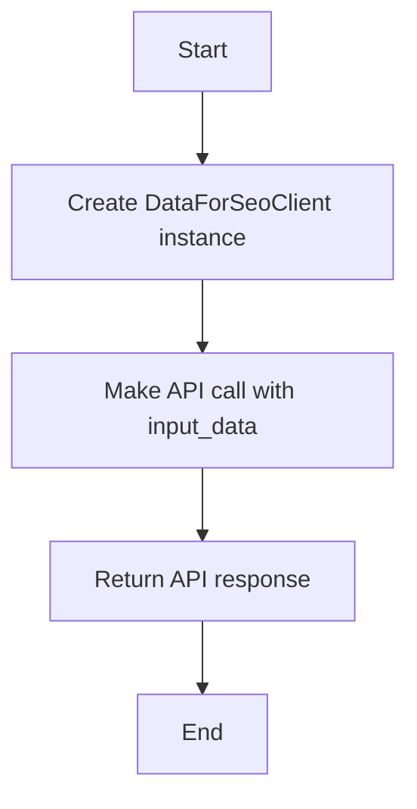

#### 带注释源码

```python
async def _fetch_related_keywords(self, client: DataForSeoClient, input_data: Input) -> Any:
    """Private method to fetch related keywords - can be mocked for testing."""
    return await client.related_keywords(
        keyword=input_data.keyword,
        location_code=input_data.location_code,
        language_code=input_data.language_code,
        include_seed_keyword=input_data.include_seed_keyword,
        include_serp_info=input_data.include_serp_info,
        include_clickstream_data=input_data.include_clickstream_data,
        limit=input_data.limit,
        depth=input_data.depth,
    )
```


### DataForSeoClient.related_keywords

This method fetches related keywords from the DataForSEO Labs Google API.

参数：

- `keyword`：`str`，The seed keyword to find related keywords for
- `location_code`：`Optional[int]`，Location code for targeting (e.g., 2840 for USA)
- `language_code`：`Optional[str]`，Language code (e.g., 'en' for English)
- `include_seed_keyword`：`bool`，Include the seed keyword in results
- `include_serp_info`：`bool`，Include SERP information
- `include_clickstream_data`：`bool`，Include clickstream metrics
- `limit`：`int`，Maximum number of results (up to 3000)
- `depth`：`int`，Keyword search depth (0-4). Controls the number of returned keywords: 0=1 keyword, 1=~8 keywords, 2=~72 keywords, 3=~584 keywords, 4=~4680 keywords

返回值：`Any`，The response from the DataForSEO Labs Google API

#### 流程图

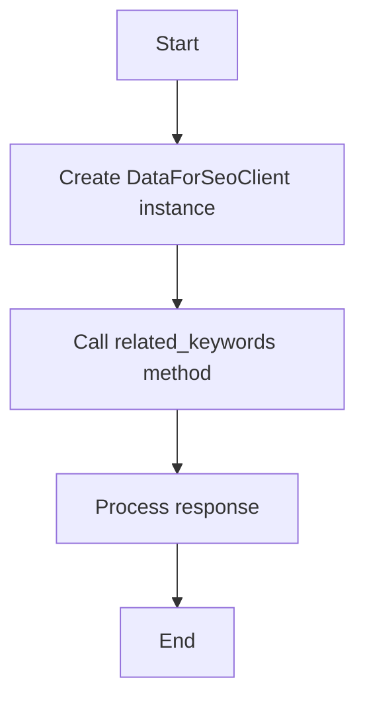

#### 带注释源码

```python
async def related_keywords(
    self,
    keyword: str,
    location_code: Optional[int] = None,
    language_code: Optional[str] = None,
    include_seed_keyword: bool = False,
    include_serp_info: bool = False,
    include_clickstream_data: bool = False,
    limit: int = 100,
    depth: int = 1,
) -> Any:
    """Fetch related keywords from the DataForSEO Labs Google API."""
    # Construct the API request parameters
    params = {
        "keyword": keyword,
        "location_code": location_code,
        "language_code": language_code,
        "include_seed_keyword": include_seed_keyword,
        "include_serp_info": include_serp_info,
        "include_clickstream_data": include_clickstream_data,
        "limit": limit,
        "depth": depth,
    }
    # Make the API request
    response = await self._http_client.get(
        self._api_url + "/related-keywords", params=params
    )
    # Process the response
    return response.json()
```


### lambda x: hasattr(x, 'keyword') and x.keyword == 'content strategy'

This function checks if an object has an attribute named 'keyword' and if its value is 'content strategy'.

参数：

- `x`：`Any`，The object to check for the 'keyword' attribute and its value.

返回值：`bool`，Returns `True` if the object has the 'keyword' attribute with the value 'content strategy', otherwise returns `False`.

#### 流程图

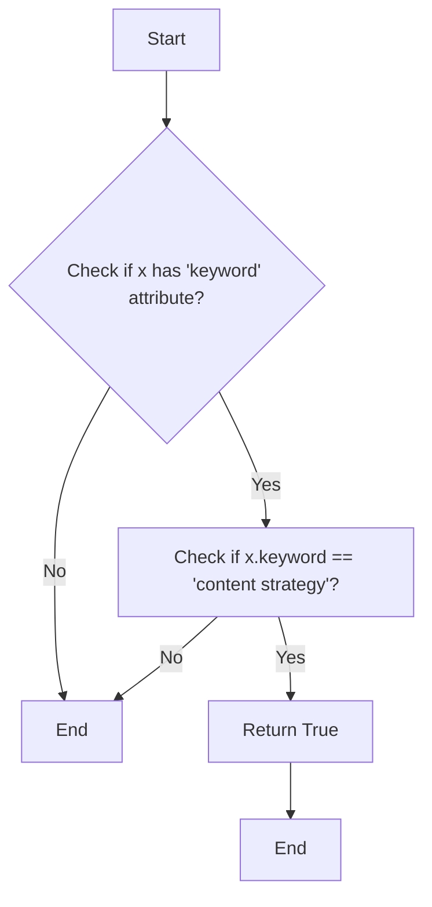

#### 带注释源码

```python
lambda x: hasattr(x, 'keyword') and x.keyword == 'content strategy'
```


### lambda x: isinstance(x, list) and len(x) 

检查一个变量是否为长度为1的列表。

参数：

- `x`：`Any`，要检查的变量

返回值：`bool`，如果`x`是长度为1的列表，则返回`True`，否则返回`False`

#### 流程图

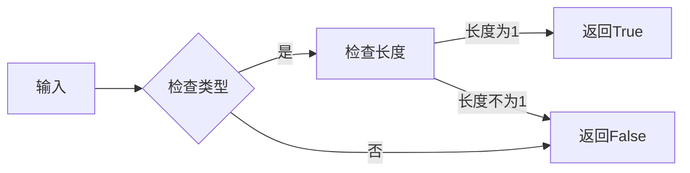

#### 带注释源码

```python
lambda x: isinstance(x, list) and len(x) == 1
```


### lambda x: x.keyword == 'content marketing'

This function checks if the `keyword` attribute of an object `x` is equal to the string `'content marketing'`.

参数：

- `x`：`Any`，The object to check the `keyword` attribute of.

返回值：`bool`，Returns `True` if the `keyword` attribute is `'content marketing'`, otherwise `False`.

#### 流程图

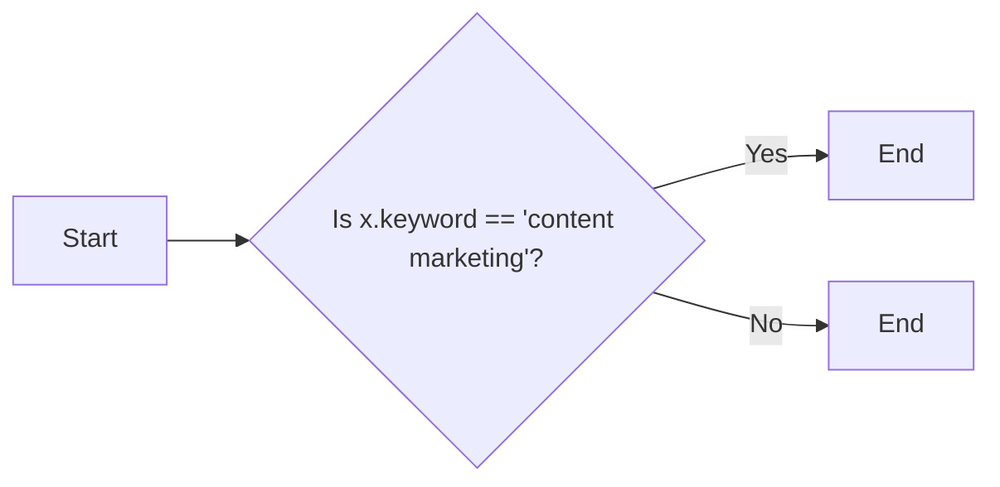

#### 带注释源码

```python
lambda x: x.keyword == 'content marketing'
```


### lambda *args, **kwargs: [{'items': [{'keyword_data': {'keyword': 'content strategy', 'keyword_info': {'search_volume': 8000, 'competition': 0.4, 'cpc': 3.0}, 'keyword_properties': {'keyword_difficulty': 45}}}]}}]

#### 描述

该lambda函数是一个匿名函数，用于处理从DataForSEO API返回的与关键字相关的数据。它接受任意数量的位置参数和关键字参数，并返回一个包含单个字典的列表，该字典包含关键字数据。

#### 参数

- `*args`：任意数量的位置参数，此处未使用。
- `**kwargs`：任意数量的关键字参数，此处未使用。

#### 返回值

- `List[Dict]`：包含单个字典的列表，字典中包含关键字数据。

#### 流程图

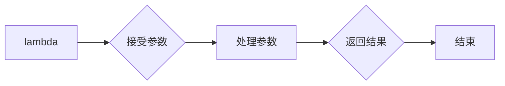

#### 带注释源码

```python
lambda *args, **kwargs: [{'items': [{'keyword_data': {'keyword': 'content strategy', 'keyword_info': {'search_volume': 8000, 'competition': 0.4, 'cpc': 3.0}, 'keyword_properties': {'keyword_difficulty': 45}}}]}}]
```

由于该lambda函数没有使用参数，因此参数名称和类型描述为未使用。返回值类型为`List[Dict]`，描述为包含单个字典的列表，字典中包含关键字数据。


### DataForSeoRelatedKeywordsBlock.__init__

This method initializes the `DataForSeoRelatedKeywordsBlock` class, setting up its schema, test input, test credentials, test output, and test mock.

参数：

- `id`: `str`，The unique identifier for the block.
- `description`: `str`，A description of the block's functionality.
- `categories`: `set`，A set of categories that the block belongs to.
- `input_schema`: `BlockSchemaInput`，The schema for the block's input.
- `output_schema`: `BlockSchemaOutput`，The schema for the block's output.
- `test_input`: `dict`，The test input data for the block.
- `test_credentials`: `UserPasswordCredentials`，The test credentials for the block.
- `test_output`: `list`，The expected test output for the block.
- `test_mock`: `dict`，Mock data for testing the block.

返回值：`None`，This method does not return any value.

#### 流程图

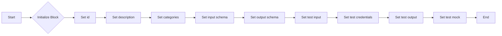

#### 带注释源码

```python
def __init__(self):
    super().__init__(
        id="8f2e4d6a-1b3c-4a5e-9d7f-2c8e6a4b3f1d",
        description="Get related keywords from DataForSEO Labs Google API",
        categories={BlockCategory.SEARCH, BlockCategory.DATA},
        input_schema=self.Input,
        output_schema=self.Output,
        test_input={
            "credentials": dataforseo.get_test_credentials().model_dump(),
            "keyword": "content marketing",
            "location_code": 2840,
            "language_code": "en",
            "limit": 1,
        },
        test_credentials=dataforseo.get_test_credentials(),
        test_output=[
            (
                "related_keyword",
                lambda x: hasattr(x, "keyword") and x.keyword == "content strategy",
            ),
            ("related_keywords", lambda x: isinstance(x, list) and len(x) == 1),
            ("total_count", 1),
            ("seed_keyword", "content marketing"),
        ],
        test_mock={
            "_fetch_related_keywords": lambda *args, **kwargs: [
                {
                    "items": [
                        {
                            "keyword_data": {
                                "keyword": "content strategy",
                                "keyword_info": {
                                    "search_volume": 8000,
                                    "competition": 0.4,
                                    "cpc": 3.0,
                                },
                                "keyword_properties": {
                                    "keyword_difficulty": 45,
                                },
                            }
                        }
                    ]
                }
            ]
        },
    )
```


### `_fetch_related_keywords`

This method fetches related keywords from the DataForSEO API.

参数：

- `client`：`DataForSeoClient`，The DataForSEO client instance used to make the API call.
- `input_data`：`Input`，The input data containing the parameters for the API call.

返回值：`Any`，The response from the DataForSEO API.

#### 流程图

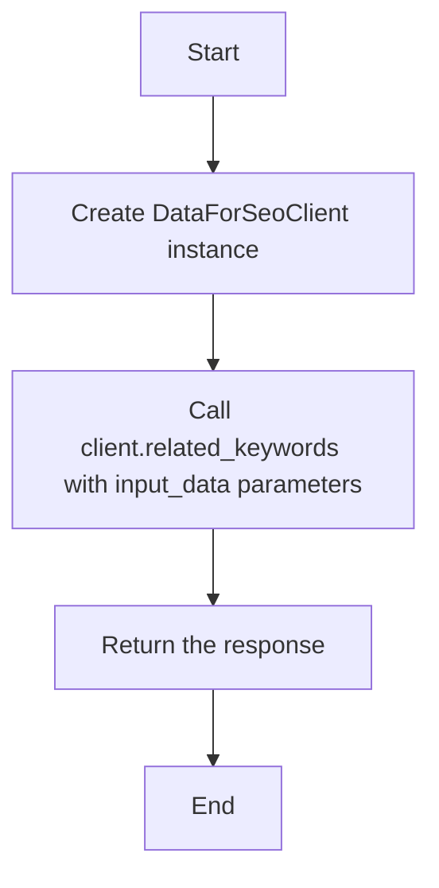

#### 带注释源码

```python
async def _fetch_related_keywords(
    self,
    client: DataForSeoClient,
    input_data: Input,
) -> Any:
    """Private method to fetch related keywords - can be mocked for testing."""
    return await client.related_keywords(
        keyword=input_data.keyword,
        location_code=input_data.location_code,
        language_code=input_data.language_code,
        include_seed_keyword=input_data.include_seed_keyword,
        include_serp_info=input_data.include_serp_info,
        include_clickstream_data=input_data.include_clickstream_data,
        limit=input_data.limit,
        depth=input_data.depth,
    )
```


### DataForSeoRelatedKeywordsBlock.run

Execute the related keywords query.

参数：

- `input_data`：`Input`，The input data for the block.
- `credentials`：`UserPasswordCredentials`，DataForSEO credentials (username and password)

返回值：`BlockOutput`，The output of the block.

#### 流程图

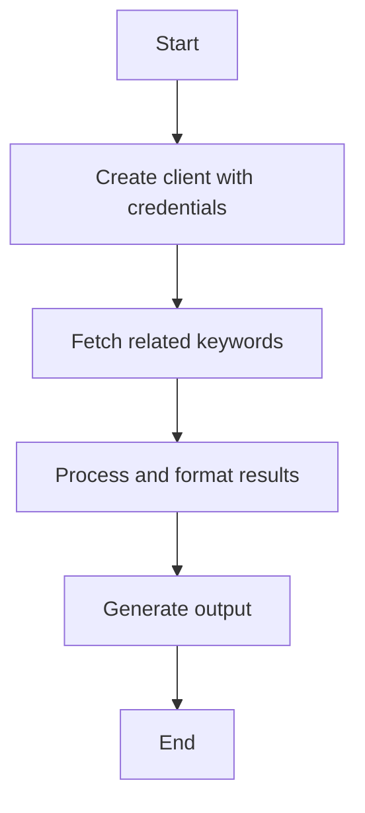

#### 带注释源码

```python
async def run(
    self,
    input_data: Input,
    *,
    credentials: UserPasswordCredentials,
    **kwargs,
) -> BlockOutput:
    """Execute the related keywords query."""
    try:
        client = DataForSeoClient(credentials)

        results = await self._fetch_related_keywords(client, input_data)

        # Process and format the results
        related_keywords = []
        if results and len(results) > 0:
            # results is a list, get the first element
            first_result = results[0] if isinstance(results, list) else results
            # Handle missing key, null value, or valid list value
            if isinstance(first_result, dict):
                items = first_result.get("items") or []
            else:
                items = []
            for item in items:
                # Extract keyword_data from the item
                keyword_data = item.get("keyword_data", {})

                # Create the RelatedKeyword object
                keyword = RelatedKeyword(
                    keyword=keyword_data.get("keyword", ""),
                    search_volume=keyword_data.get("keyword_info", {}).get(
                        "search_volume"
                    ),
                    competition=keyword_data.get("keyword_info", {}).get(
                        "competition"
                    ),
                    cpc=keyword_data.get("keyword_info", {}).get("cpc"),
                    keyword_difficulty=keyword_data.get(
                        "keyword_properties", {}
                    ).get("keyword_difficulty"),
                    serp_info=(
                        keyword_data.get("serp_info")
                        if input_data.include_serp_info
                        else None
                    ),
                    clickstream_data=(
                        keyword_data.get("clickstream_keyword_info")
                        if input_data.include_clickstream_data
                        else None
                    ),
                )
                yield "related_keyword", keyword
                related_keywords.append(keyword)

        yield "related_keywords", related_keywords
        yield "total_count", len(related_keywords)
        yield "seed_keyword", input_data.keyword
    except Exception as e:
        yield "error", f"Failed to fetch related keywords: {str(e)}"
```


### `RelatedKeywordExtractorBlock.__init__`

This method initializes the `RelatedKeywordExtractorBlock` class, setting up its schema and test configurations.

参数：

- `id`：`str`，The unique identifier for the block.
- `description`：`str`，A brief description of the block's functionality.
- `categories`：`set`，A set of categories that the block belongs to.
- `input_schema`：`BlockSchemaInput`，The schema for the block's input.
- `output_schema`：`BlockSchemaOutput`，The schema for the block's output.
- `test_input`：`dict`，The test input data for the block.
- `test_output`：`list`，The expected test output data for the block.
- `test_credentials`：`UserPasswordCredentials`，The test credentials for the block.
- `test_mock`：`dict`，Mock data for testing the block.

返回值：`None`，This method does not return any value.

#### 流程图

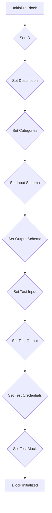

#### 带注释源码

```python
def __init__(self):
    super().__init__(
        id="98342061-09d2-4952-bf77-0761fc8cc9a8",
        description="Extract individual fields from a RelatedKeyword object",
        categories={BlockCategory.DATA},
        input_schema=self.Input,
        output_schema=self.Output,
        test_input={
            "related_keyword": RelatedKeyword(
                keyword="test related keyword",
                search_volume=800,
                competition=0.4,
                cpc=3.0,
                keyword_difficulty=55,
            ).model_dump()
        },
        test_output=[
            ("keyword", "test related keyword"),
            ("search_volume", 800),
            ("competition", 0.4),
            ("cpc", 3.0),
            ("keyword_difficulty", 55),
            ("serp_info", None),
            ("clickstream_data", None),
        ],
        test_credentials=dataforseo.get_test_credentials(),
        test_mock={
            "_extract_fields": lambda *args, **kwargs: {
                "keyword": "test related keyword",
                "search_volume": 800,
                "competition": 0.4,
                "cpc": 3.0,
                "keyword_difficulty": 55,
                "serp_info": None,
                "clickstream_data": None,
            }
        },
    )
```


### `RelatedKeywordExtractorBlock.run`

Extract fields from the RelatedKeyword object.

参数：

- `input_data`：`Input`，The input data containing the RelatedKeyword object to extract fields from.

返回值：`BlockOutput`，A dictionary containing the extracted fields.

#### 流程图

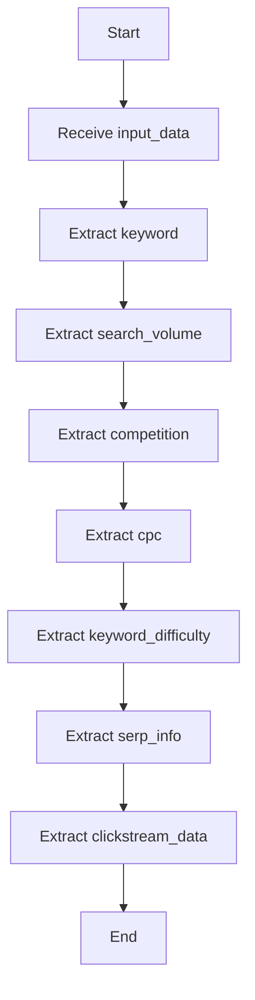

#### 带注释源码

```python
async def run(self, input_data: Input, **kwargs) -> BlockOutput:
    """Extract fields from the RelatedKeyword object."""
    related_keyword = input_data.related_keyword

    yield "keyword", related_keyword.keyword
    yield "search_volume", related_keyword.search_volume
    yield "competition", related_keyword.competition
    yield "cpc", related_keyword.cpc
    yield "keyword_difficulty", related_keyword.keyword_difficulty
    yield "serp_info", related_keyword.serp_info
    yield "clickstream_data", related_keyword.clickstream_data
```


## 关键组件


### 张量索引与惰性加载

张量索引与惰性加载是代码中用于高效处理大量数据的关键组件。它允许在需要时才加载数据，从而减少内存消耗并提高性能。

### 反量化支持

反量化支持是代码中用于处理量化数据的关键组件。它允许对量化数据进行反量化处理，以便进行进一步的分析和操作。

### 量化策略

量化策略是代码中用于优化数据存储和计算效率的关键组件。它通过减少数据精度来降低内存和计算需求，同时保持足够的准确性。


## 问题及建议


### 已知问题

-   **全局变量和函数依赖性**：代码中存在全局变量和函数，如`dataforseo`和`_fetch_related_keywords`，这可能导致代码的可维护性和可测试性降低。全局变量和函数的修改可能会影响到整个模块，增加了出错的风险。
-   **异常处理**：在`run`方法中，异常处理仅捕获了通用的`Exception`，这可能隐藏了特定异常的处理需求。建议根据可能出现的异常类型进行更细粒度的异常处理。
-   **代码重复**：在`RelatedKeywordExtractorBlock`的`run`方法中，存在与`DataForSeoRelatedKeywordsBlock`中类似的字段提取逻辑，这可能导致代码维护成本增加。建议考虑将这部分逻辑抽象为一个单独的函数或类。
-   **测试覆盖率**：代码中提供的测试用例可能不足以覆盖所有功能路径和边界条件。建议增加更多的测试用例，以提高代码的测试覆盖率。

### 优化建议

-   **减少全局变量和函数的使用**：将全局变量和函数替换为类成员或方法，以提高代码的模块化和可测试性。
-   **细化异常处理**：根据可能出现的异常类型，添加更具体的异常处理逻辑，以便更好地诊断和解决问题。
-   **抽象重复代码**：将重复的代码片段抽象为函数或类，以减少代码冗余，提高代码的可维护性。
-   **增加测试用例**：编写更多的测试用例，包括边界条件和异常情况，以确保代码在各种情况下都能正常工作。
-   **代码格式化**：使用代码格式化工具（如`black`或`autopep8`）来统一代码风格，提高代码的可读性。
-   **文档化**：为代码添加详细的文档注释，包括类、方法和函数的用途、参数和返回值等信息，以便其他开发者更好地理解和使用代码。


## 其它


### 设计目标与约束

- 设计目标：
  - 提供一个模块化、可扩展的API来获取相关关键词。
  - 确保代码的可读性和可维护性。
  - 支持多种语言和地区代码。
  - 提供错误处理机制，确保系统的健壮性。

- 约束：
  - 限制返回结果的最大数量。
  - 支持的深度搜索范围有限。
  - 依赖外部API，可能存在不可预测的延迟或中断。

### 错误处理与异常设计

- 错误处理：
  - 使用try-except块捕获可能发生的异常。
  - 在异常发生时，记录错误信息并返回相应的错误消息。

- 异常设计：
  - 定义自定义异常类，以便更精确地处理特定类型的错误。
  - 异常类应提供足够的信息，以便调用者了解错误原因。

### 数据流与状态机

- 数据流：
  - 输入数据通过API接口传递到处理函数。
  - 处理函数从外部API获取数据，并返回结果。

- 状态机：
  - 无状态设计，每个请求独立处理。

### 外部依赖与接口契约

- 外部依赖：
  - DataForSeoClient：用于与DataForSEO API交互。
  - SchemaField：用于定义输入和输出模式。

- 接口契约：
  - 定义清晰的输入和输出模式，确保数据的一致性。
  - 提供测试用例，验证接口的正确性。

    