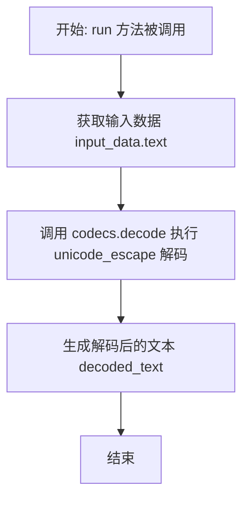
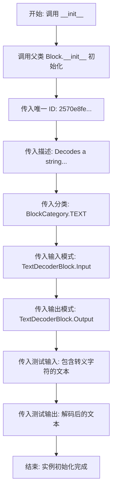
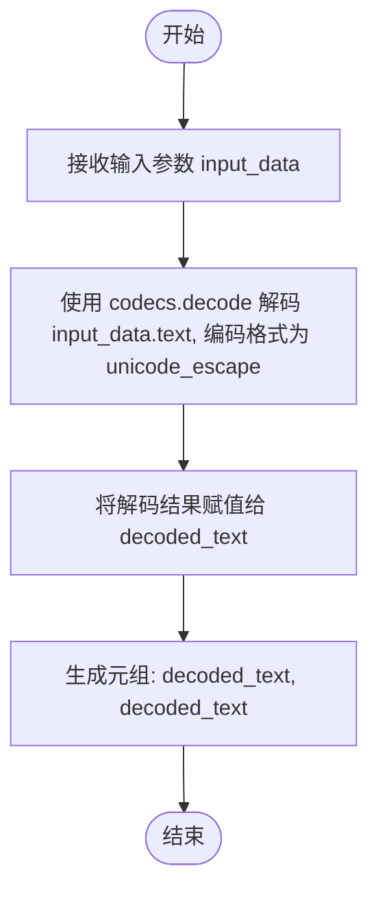

# `AutoGPT\autogpt_platform\backend\backend\blocks\decoder_block.py` 详细设计文档

这段代码定义了一个名为 `TextDecoderBlock` 的类，继承自 `Block`，用于接收包含转义字符（如 \n, \"）的字符串输入，并将其解码为实际的文本格式后输出。

## 整体流程



## 类结构

```
TextDecoderBlock (Block)
├── Input (BlockSchemaInput)
└── Output (BlockSchemaOutput)
```

## 全局变量及字段


### `TextDecoderBlock.Input.text`
    
A string containing escaped characters to be decoded

类型：`str`
    


### `TextDecoderBlock.Output.decoded_text`
    
The decoded text with escape sequences processed

类型：`str`
    
    

## 全局函数及方法


### `TextDecoderBlock.__init__`

`TextDecoderBlock` 类的构造函数，负责初始化该块的元数据、输入输出模式定义以及测试用例。它调用父类 `Block` 的初始化方法，配置该块用于解码包含转义序列的字符串。

参数：

-  `self`：`TextDecoderBlock`，类的实例本身。

返回值：`None`，构造函数不返回任何值。

#### 流程图



#### 带注释源码

```python
def __init__(self):
    # 调用父类 Block 的初始化方法，配置块的基本属性和行为
    super().__init__(
        # 定义该块的全局唯一标识符 (UUID)
        id="2570e8fe-8447-43ed-84c7-70d657923231",
        # 描述该块的核心功能：解码包含转义序列的字符串
        description="Decodes a string containing escape sequences into actual text",
        # 指定该块所属的分类：文本处理 (TEXT)
        categories={BlockCategory.TEXT},
        # 绑定输入数据的模式定义，指定预期的输入字段结构
        input_schema=TextDecoderBlock.Input,
        # 绑定输出数据的模式定义，指定输出字段的结构
        output_schema=TextDecoderBlock.Output,
        # 定义测试用的输入数据，验证包含 \n 和 \" 等转义符的字符串处理
        test_input={"text": """Hello\nWorld!\nThis is a \"quoted\" string."""},
        # 定义预期的测试输出结果，验证解码后的文本是否正确
        test_output=[
            (
                "decoded_text",
                """Hello
World!
This is a "quoted" string.""",
            )
        ],
    )
```


### `TextDecoderBlock.run`

该方法是 `TextDecoderBlock` 的核心执行逻辑，负责接收包含转义字符的字符串输入，使用编解码器将其处理为原始文本，并将结果输出。

参数：

-  `input_data`：`Input`，包含待解码文本的输入数据对象，该对象结构由 `TextDecoderBlock.Input` 类定义。
-  `**kwargs`：`dict`，额外的关键字参数，用于扩展或传递上下文信息（本方法中未显式使用）。

返回值：`BlockOutput`，一个生成器，用于产出包含解码后文本的键值对元组。

#### 流程图



#### 带注释源码

```python
    async def run(self, input_data: Input, **kwargs) -> BlockOutput:
        # 使用 codecs 库的 decode 函数，将输入的字符串按照 unicode_escape 编码格式进行解码
        # 这会将字符串中的转义序列（例如 \n, \", \t 等）转换为对应的实际字符
        decoded_text = codecs.decode(input_data.text, "unicode_escape")
        # 产出解码后的文本，键名为 "decoded_text"，与 Output Schema 中定义的字段对应
        yield "decoded_text", decoded_text
```


## 关键组件


### 输入输出 Schema 定义

定义了数据块的输入契约（包含待解码的文本字段 `text`）和输出契约（包含解码后的文本字段 `decoded_text`），明确了数据的结构与语义。

### Unicode 转义解码核心逻辑

在 `run` 方法中，通过 `codecs.decode` 函数结合 `unicode_escape` 编码，将输入字符串中的转义字符序列（如 `\n`, `\"`）解析为实际对应的字符，实现文本还原。

### 块元数据与测试用例配置

在初始化方法中设定了块的基本属性，包括唯一 ID、功能描述、所属分类（文本类），并内置了测试输入和预期输出以验证功能的正确性。


## 问题及建议


### 已知问题

-   **异常处理缺失**：当前代码使用 `codecs.decode` 进行解码，当输入字符串包含不完整的转义序列（如以奇数个反斜杠结尾）或无效的 Unicode 字节序列时，会抛出 `UnicodeDecodeError`，导致任务崩溃且未提供错误回退机制。
-   **异步上下文中的阻塞调用**：`run` 方法被定义为 `async`，但 `codecs.decode` 是同步的 CPU 密集型操作。在处理大量文本或高并发场景下，直接调用可能会阻塞事件循环，影响系统的整体吞吐量。

### 优化建议

-   **增加异常捕获与容错处理**：建议在 `run` 方法中增加 `try-except` 块捕获 `UnicodeDecodeError`。当解码失败时，可以选择返回原始文本、带有错误占位符的文本，或通过特定的输出端口输出错误信息，以保证 Block 的健壮性。
-   **使用线程池避免阻塞**：对于可能耗时的解码操作，建议使用 `loop.run_in_executor` 将同步的 `codecs.decode` 调用提交到线程池中执行，以释放事件循环，提升异步处理的并发性能。
-   **强化输入校验**：尽管有 Schema 定义，但在运行时显式检查输入是否为 `None` 或非字符串类型，可以增加防御性编程的深度，避免因上游数据异常导致的潜在运行时错误。


## 其它


### 设计目标与约束

**设计目标：**
1.  **功能正确性**：核心目标是准确地将包含转义字符（如 `\n`, `\"`, `\t` 等）的字符串解码为其对应的原始文本形式，确保数据在传输或存储转义后能被正确还原。
2.  **非阻塞 I/O**：作为 `Block` 的一部分，设计上需支持异步执行模型（`async def run`），以适应高并发的 event loop 架构，避免阻塞主线程。
3.  **轻量级处理**：保持逻辑简单高效，利用 Python 标准库的 `codecs` 模块进行原生解码，减少不必要的依赖和计算开销。

**设计约束：**
1.  **框架契约**：必须严格继承自 `Block` 类，并实现父类定义的接口规范，如 `input_schema`、`output_schema` 和 `run` 方法。
2.  **输入限制**：输入必须为合法的 Python 字符串格式，且包含的转义序列必须符合 `unicode_escape` 编码规则，否则可能导致解码失败。
3.  **环境依赖**：依赖 Python 运行环境的标准库 `codecs` 及内部定义的 `backend.data` 模块结构。

### 错误处理与异常设计

1.  **异常传播机制**：
    *   当前实现中，`run` 方法内部没有显式的 `try-except` 块。
    *   当 `input_data.text` 包含无效的转义序列（例如孤体的反斜杠后跟不可识别字符）时，`codecs.decode(..., "unicode_escape")` 会抛出 `UnicodeDecodeError`。
    *   该异常会向上传播至调用该 Block 的上层执行器或框架层，由框架决定如何终止流程或记录错误。
2.  **输入验证**：
    *   依赖 Pydantic 模型（`BlockSchemaInput`）进行基础类型检查。如果输入非字符串，将在进入 `run` 方法前被拦截并报错。
3.  **潜在改进点**：
    *   当前缺乏对特定错误的自定义处理（如回退到原始文本或提供部分解码结果），所有解码错误均被视为致命错误。

### 外部依赖与接口契约

1.  **外部依赖**：
    *   **标准库**：`codecs`（用于具体的字符解码操作）。
    *   **内部模块**：`backend.data.block`（提供基类 `Block` 及相关类型定义）、`backend.data.model`（提供 `SchemaField` 用于定义输入输出结构）。

2.  **接口契约**：
    *   **输入接口 (`TextDecoderBlock.Input`)**：
        *   **名称**：`text`
        *   **类型**：`str`
        *   **契约**：调用方必须提供一个字符串，该字符串中可能包含符合 Python `unicode_escape` 规范的转义序列。
    *   **输出接口 (`BlockOutput`)**：
        *   **类型**：异步生成器，产生元组。
        *   **格式**：`("decoded_text", str)`
        *   **契约**：方法每次执行应 yield 且仅 yield 一次结果，包含固定的键名 `"decoded_text"` 和处理后的字符串。

### 数据流与状态机

1.  **数据流**：
    *   **输入阶段**：外部系统通过 `input_data` 字典传入文本字符串。
    *   **处理阶段**：`TextDecoderBlock.run` 方法接收数据，调用 `codecs.decode` 函数。数据从“转义字符串”状态转换为“原始字符串”状态。
    *   **输出阶段**：通过 `yield` 关键字将解码后的数据流式输出给下一个处理节点或调用者。

2.  **状态机**：
    *   **状态类型**：无状态。
    *   **描述**：该 Block 不维护任何内部实例变量（字段）来记录调用之间的状态。每次调用 `run` 方法都是独立的，仅依赖于当前的输入参数。这符合纯函数式的特性，保证了可重复性和线程安全性。

### 并发与线程安全模型

1.  **并发模型**：
    *   基于协程的并发。类方法 `run` 被定义为 `async def`，表明其设计用于在 Python 的异步事件循环中运行。这使得在等待 I/O（尽管此计算主要是 CPU 密集型，但符合框架整体异步风格）时不会阻塞事件循环。

2.  **线程安全性**：
    *   **安全等级**：线程安全。
    *   **分析**：类中不定义任何可变的成员变量（实例属性）。所有操作仅依赖于输入参数 `input_data` 和局部变量 `decoded_text`。由于不存在共享的可变状态，多个线程或协程同时调用同一个 `TextDecoderBlock` 实例的 `run` 方法不会产生竞态条件。

    